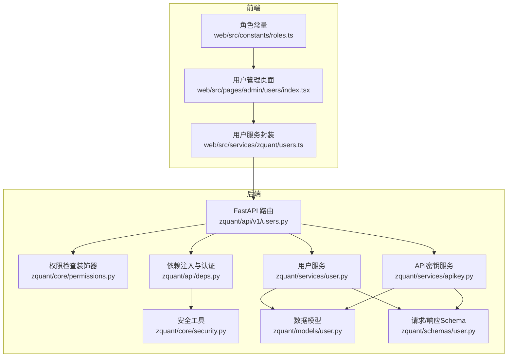
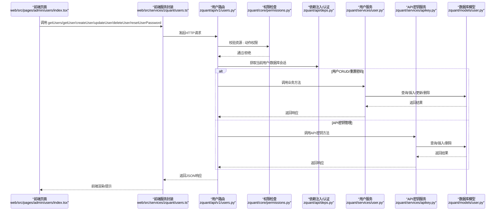
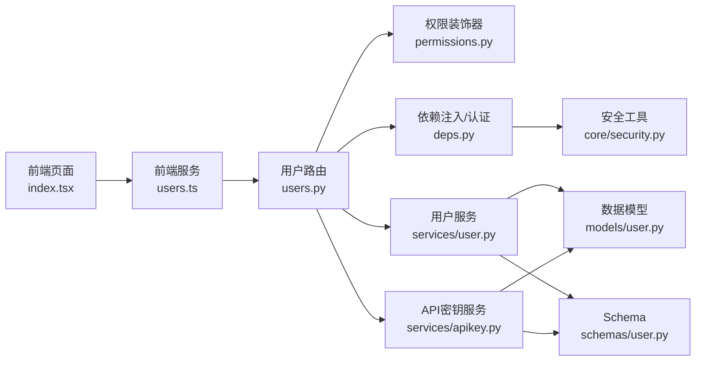

# 用户管理API

<cite>
**本文引用的文件**
- [zquant/api/v1/users.py](file://zquant/api/v1/users.py)
- [zquant/services/user.py](file://zquant/services/user.py)
- [zquant/models/user.py](file://zquant/models/user.py)
- [zquant/schemas/user.py](file://zquant/schemas/user.py)
- [zquant/core/permissions.py](file://zquant/core/permissions.py)
- [zquant/services/apikey.py](file://zquant/services/apikey.py)
- [zquant/api/deps.py](file://zquant/api/deps.py)
- [zquant/core/security.py](file://zquant/core/security.py)
- [zquant/scripts/init_db.py](file://zquant/scripts/init_db.py)
- [web/src/services/zquant/users.ts](file://web/src/services/zquant/users.ts)
- [web/src/pages/admin/users/index.tsx](file://web/src/pages/admin/users/index.tsx)
- [web/src/constants/roles.ts](file://web/src/constants/roles.ts)
- [zquant/tests/unittest/test_user_service.py](file://zquant/tests/unittest/test_user_service.py)
</cite>

## 目录
1. [简介](#简介)
2. [项目结构](#项目结构)
3. [核心组件](#核心组件)
4. [架构总览](#架构总览)
5. [详细组件分析](#详细组件分析)
6. [依赖关系分析](#依赖关系分析)
7. [性能考量](#性能考量)
8. [故障排查指南](#故障排查指南)
9. [结论](#结论)
10. [附录](#附录)

## 简介
本文件为 zquant 用户管理API的权威文档，覆盖用户CRUD（创建、读取、更新、删除）、API密钥管理、密码重置等端点；解释基于角色的访问控制（RBAC）在权限管理中的应用；说明分页、筛选与排序的实现方式；阐述用户数据验证与异常处理机制，并提供面向开发者的完整使用示例与错误处理指南。

## 项目结构
用户管理API位于后端 Python 服务层，采用 FastAPI + SQLAlchemy 架构，前端通过 Ant Design Pro 的 ProTable 实现列表查询与交互。



图表来源
- [zquant/api/v1/users.py](file://zquant/api/v1/users.py#L1-L208)
- [zquant/core/permissions.py](file://zquant/core/permissions.py#L1-L111)
- [zquant/api/deps.py](file://zquant/api/deps.py#L1-L93)
- [zquant/services/user.py](file://zquant/services/user.py#L1-L222)
- [zquant/services/apikey.py](file://zquant/services/apikey.py#L1-L142)
- [zquant/core/security.py](file://zquant/core/security.py#L1-L133)
- [zquant/models/user.py](file://zquant/models/user.py#L1-L113)
- [zquant/schemas/user.py](file://zquant/schemas/user.py#L1-L376)
- [web/src/pages/admin/users/index.tsx](file://web/src/pages/admin/users/index.tsx#L1-L503)
- [web/src/services/zquant/users.ts](file://web/src/services/zquant/users.ts#L1-L152)
- [web/src/constants/roles.ts](file://web/src/constants/roles.ts#L1-L45)

章节来源
- [zquant/api/v1/users.py](file://zquant/api/v1/users.py#L1-L208)
- [web/src/pages/admin/users/index.tsx](file://web/src/pages/admin/users/index.tsx#L1-L503)

## 核心组件
- API 路由层：提供用户查询、详情、创建、更新、删除、密码重置以及当前用户信息、API密钥列表、创建与删除等端点。
- 权限控制：基于资源与动作的 RBAC 装饰器，校验当前用户是否具备相应权限。
- 服务层：封装业务逻辑，包括用户创建/更新/删除、密码重置、分页/筛选/排序查询、API密钥创建/校验/删除。
- 数据模型：用户、角色、权限、API密钥等实体及关系。
- 请求/响应 Schema：Pydantic 定义的输入输出模型，含字段约束与校验。
- 前端集成：Admin 页面使用 ProTable 实现分页、筛选、排序；调用用户服务封装发起请求。

章节来源
- [zquant/api/v1/users.py](file://zquant/api/v1/users.py#L51-L208)
- [zquant/core/permissions.py](file://zquant/core/permissions.py#L38-L111)
- [zquant/services/user.py](file://zquant/services/user.py#L41-L222)
- [zquant/services/apikey.py](file://zquant/services/apikey.py#L43-L142)
- [zquant/models/user.py](file://zquant/models/user.py#L34-L113)
- [zquant/schemas/user.py](file://zquant/schemas/user.py#L33-L231)
- [web/src/services/zquant/users.ts](file://web/src/services/zquant/users.ts#L1-L152)
- [web/src/pages/admin/users/index.tsx](file://web/src/pages/admin/users/index.tsx#L1-L503)

## 架构总览
用户管理API遵循“路由层-权限层-服务层-数据层”的分层设计，配合 Pydantic Schema 进行输入校验，SQLAlchemy ORM 进行数据持久化。



图表来源
- [zquant/api/v1/users.py](file://zquant/api/v1/users.py#L51-L208)
- [zquant/core/permissions.py](file://zquant/core/permissions.py#L38-L111)
- [zquant/api/deps.py](file://zquant/api/deps.py#L41-L93)
- [zquant/services/user.py](file://zquant/services/user.py#L41-L222)
- [zquant/services/apikey.py](file://zquant/services/apikey.py#L43-L142)
- [zquant/models/user.py](file://zquant/models/user.py#L34-L113)
- [web/src/services/zquant/users.ts](file://web/src/services/zquant/users.ts#L1-L152)
- [web/src/pages/admin/users/index.tsx](file://web/src/pages/admin/users/index.tsx#L1-L503)

## 详细组件分析

### 用户CRUD与密码重置端点
- 查询用户列表（分页、筛选、排序）
  - 方法与路径：GET /api/v1/users
  - 查询参数：skip、limit、is_active、role_id、username（模糊）、order_by、order
  - 权限：需要 user:read
  - 返回：PageResponse（items、total、skip、limit）
  - 服务实现：UserService.get_all_users、UserService.count_users
- 查询当前用户信息
  - 方法与路径：GET /api/v1/users/me
  - 返回：UserResponse
- 查询用户详情
  - 方法与路径：GET /api/v1/users/{user_id}
  - 权限：需要 user:read
  - 返回：UserResponse
- 创建用户
  - 方法与路径：POST /api/v1/users
  - 权限：需要 user:create
  - 请求体：UserCreate（用户名、邮箱、密码、确认密码、角色ID）
  - 返回：UserResponse
- 更新用户
  - 方法与路径：PUT /api/v1/users/{user_id}
  - 权限：需要 user:update
  - 请求体：UserUpdate（邮箱、是否激活、角色ID）
  - 返回：UserResponse
- 重置用户密码
  - 方法与路径：POST /api/v1/users/{user_id}/reset-password
  - 权限：需要 user:update
  - 请求体：PasswordReset（新密码、确认新密码）
  - 返回：{"message": "..."}
- 删除用户
  - 方法与路径：DELETE /api/v1/users/{user_id}
  - 权限：需要 user:delete
  - 返回：{"message": "..."}

章节来源
- [zquant/api/v1/users.py](file://zquant/api/v1/users.py#L51-L208)
- [zquant/services/user.py](file://zquant/services/user.py#L41-L222)
- [zquant/schemas/user.py](file://zquant/schemas/user.py#L33-L104)

### API密钥管理端点
- 获取我的API密钥列表
  - 方法与路径：GET /api/v1/users/me/apikeys
  - 返回：list[APIKeyResponse]
- 创建API密钥
  - 方法与路径：POST /api/v1/users/me/apikeys
  - 请求体：APIKeyCreate（名称/描述，可选）
  - 返回：APIKeyCreateResponse（包含secret_key，仅返回一次）
- 删除API密钥
  - 方法与路径：DELETE /api/v1/users/me/apikeys/{key_id}
  - 返回：{"message": "..."}
- API密钥校验（内部使用）
  - 方法：APIKeyService.verify_api_key（通过access_key+secret_key获取用户）

章节来源
- [zquant/api/v1/users.py](file://zquant/api/v1/users.py#L101-L136)
- [zquant/services/apikey.py](file://zquant/services/apikey.py#L43-L142)
- [zquant/schemas/user.py](file://zquant/schemas/user.py#L188-L220)

### 基于角色的访问控制（RBAC）
- 权限检查装饰器
  - check_permission(resource, action)：对路由进行权限拦截
  - has_permission(db, user, resource, action)：基于用户角色与权限表关联判断
  - require_role(role_name)：要求特定角色
  - is_admin(user, db)：快速判断管理员
- 初始化脚本
  - scripts/init_db.py 中预置了 user:*、role:*、permission:* 等权限，并将 admin 角色授予全部权限
- 前端角色常量
  - web/src/constants/roles.ts 提供角色ID常量，便于前端判断

章节来源
- [zquant/core/permissions.py](file://zquant/core/permissions.py#L38-L111)
- [zquant/scripts/init_db.py](file://zquant/scripts/init_db.py#L129-L190)
- [web/src/constants/roles.ts](file://web/src/constants/roles.ts#L1-L45)

### 分页、筛选与排序实现
- 后端
  - 分页：skip、limit 参数传入 UserService.get_all_users
  - 筛选：is_active、role_id、username（模糊匹配）
  - 排序：order_by 支持 id、username、email、is_active、created_at、updated_at；order 支持 asc/desc，默认按创建时间倒序
  - 统计：UserService.count_users 与分页结合返回 total
- 前端
  - web/src/pages/admin/users/index.tsx 使用 ProTable 的 request 回调，将分页、筛选、排序参数转换为后端期望的查询参数
  - 默认每页20条，支持 pageSize 切换

章节来源
- [zquant/services/user.py](file://zquant/services/user.py#L148-L207)
- [web/src/pages/admin/users/index.tsx](file://web/src/pages/admin/users/index.tsx#L210-L269)

### 数据验证与异常处理
- 输入验证（Pydantic）
  - UserCreate：用户名长度、邮箱格式、密码强度、确认密码一致性
  - UserUpdate：邮箱格式、布尔字段、整型字段
  - PasswordReset：密码强度、确认密码一致性
  - APIKeyCreate/Response：字段约束与属性映射
- 业务验证（服务层）
  - 用户创建：角色存在性、用户名/邮箱唯一性、密码强度
  - 用户更新：邮箱唯一性、角色存在性
  - 密码重置：密码强度
  - 删除用户：存在性检查
- 异常处理（路由层）
  - NotFoundError、ValidationError、AuthenticationError 等转换为 HTTP 404/400/401/403/500
  - 当数据库表未初始化时，返回 503 并提示初始化脚本
- 前端处理
  - web/src/services/zquant/users.ts 对各端点进行封装
  - web/src/pages/admin/users/index.tsx 在错误时展示 message.error 并保留错误详情

章节来源
- [zquant/schemas/user.py](file://zquant/schemas/user.py#L33-L104)
- [zquant/services/user.py](file://zquant/services/user.py#L41-L222)
- [zquant/api/v1/users.py](file://zquant/api/v1/users.py#L148-L208)
- [zquant/api/deps.py](file://zquant/api/deps.py#L41-L93)
- [web/src/services/zquant/users.ts](file://web/src/services/zquant/users.ts#L1-L152)
- [web/src/pages/admin/users/index.tsx](file://web/src/pages/admin/users/index.tsx#L1-L209)

### 类与关系图
```mermaid
classDiagram
class User {
+int id
+string username
+string email
+string hashed_password
+int role_id
+bool is_active
+datetime created_at
+datetime updated_at
}
class Role {
+int id
+string name
+string description
+datetime created_at
}
class Permission {
+int id
+string name
+string resource
+string action
+string description
+datetime created_at
}
class RolePermission {
+int role_id
+int permission_id
}
class APIKey {
+int id
+int user_id
+string access_key
+string secret_key
+string name
+bool is_active
+datetime last_used_at
+datetime created_at
+datetime expires_at
}
User --> Role : "属于"
Role ||--o{ User : "拥有"
Role ||--o{ RolePermission : "关联"
Permission ||--o{ RolePermission : "关联"
APIKey --> User : "属于"
```

图表来源
- [zquant/models/user.py](file://zquant/models/user.py#L34-L113)

## 依赖关系分析
- 路由层依赖权限装饰器与依赖注入，调用服务层；服务层依赖数据模型与安全工具。
- 前端通过服务封装调用后端路由，Admin 页面负责参数组装与交互。



图表来源
- [zquant/api/v1/users.py](file://zquant/api/v1/users.py#L51-L208)
- [zquant/core/permissions.py](file://zquant/core/permissions.py#L38-L111)
- [zquant/api/deps.py](file://zquant/api/deps.py#L41-L93)
- [zquant/services/user.py](file://zquant/services/user.py#L41-L222)
- [zquant/services/apikey.py](file://zquant/services/apikey.py#L43-L142)
- [zquant/models/user.py](file://zquant/models/user.py#L34-L113)
- [zquant/schemas/user.py](file://zquant/schemas/user.py#L188-L231)
- [zquant/core/security.py](file://zquant/core/security.py#L116-L133)
- [web/src/pages/admin/users/index.tsx](file://web/src/pages/admin/users/index.tsx#L1-L503)
- [web/src/services/zquant/users.ts](file://web/src/services/zquant/users.ts#L1-L152)

## 性能考量
- 分页与排序
  - 后端对排序字段做了白名单校验，避免任意列排序带来的SQL注入风险
  - 建议前端仅传递必要字段，减少网络传输
- 数据库索引
  - 用户表的 username、email、role_id 等字段具备索引，有利于筛选与排序
- 密钥校验
  - API密钥校验会查询APIKey表并比对哈希，建议在网关层或中间件缓存热点用户信息以降低数据库压力
- 前端渲染
  - ProTable 默认每页20条，可根据实际场景调整 pageSize，平衡加载速度与交互体验

[本节为通用指导，无需列出具体文件来源]

## 故障排查指南
- 401 未授权
  - 检查 Bearer Token 或 X-API-Key/X-API-Secret 是否正确传递
  - 若提示数据库未初始化，先运行初始化脚本
- 403 禁止访问
  - 当前用户角色不具备 user:create/read/update/delete 权限
  - 管理员角色可通过权限管理界面为角色分配相应权限
- 400 参数错误
  - 用户名/邮箱重复、密码强度不足、确认密码不一致、角色ID不存在
- 404 资源不存在
  - 用户ID或API密钥ID不存在
- 500 服务器错误
  - 数据库异常或服务内部异常，查看后端日志定位

章节来源
- [zquant/api/v1/users.py](file://zquant/api/v1/users.py#L148-L208)
- [zquant/api/deps.py](file://zquant/api/deps.py#L41-L93)
- [zquant/services/user.py](file://zquant/services/user.py#L41-L222)
- [zquant/services/apikey.py](file://zquant/services/apikey.py#L89-L142)

## 结论
zquant 用户管理API采用清晰的分层架构与严格的 RBAC 控制，结合 Pydantic Schema 实现强约束的数据验证，并通过分页、筛选与排序提升大规模数据下的可用性。前后端协同完善，既满足后台管理需求，也为扩展更多资源类型的权限体系打下基础。

[本节为总结性内容，无需列出具体文件来源]

## 附录

### API端点一览（后端）
- GET /api/v1/users
  - 查询参数：skip、limit、is_active、role_id、username、order_by、order
  - 返回：PageResponse
- GET /api/v1/users/me
  - 返回：UserResponse
- GET /api/v1/users/{user_id}
  - 返回：UserResponse
- POST /api/v1/users
  - 请求体：UserCreate
  - 返回：UserResponse
- PUT /api/v1/users/{user_id}
  - 请求体：UserUpdate
  - 返回：UserResponse
- POST /api/v1/users/{user_id}/reset-password
  - 请求体：PasswordReset
  - 返回：{"message": "..."}
- DELETE /api/v1/users/{user_id}
  - 返回：{"message": "..."}
- GET /api/v1/users/me/apikeys
  - 返回：list[APIKeyResponse]
- POST /api/v1/users/me/apikeys
  - 请求体：APIKeyCreate
  - 返回：APIKeyCreateResponse
- DELETE /api/v1/users/me/apikeys/{key_id}
  - 返回：{"message": "..."}

章节来源
- [zquant/api/v1/users.py](file://zquant/api/v1/users.py#L51-L208)

### 前端调用示例（参考）
- 获取当前用户信息：getCurrentUser()
- 创建用户：createUser(UserCreate)
- 获取API密钥列表：getAPIKeys()
- 创建API密钥：createAPIKey(APIKeyCreate)
- 删除API密钥：deleteAPIKey(keyId)
- 查询用户列表：getUsers({skip, limit, is_active, role_id, username, order_by, order})
- 查询用户详情：getUser(userId)
- 更新用户：updateUser(userId, UserUpdate)
- 重置密码：resetUserPassword(userId, PasswordReset)
- 删除用户：deleteUser(userId)

章节来源
- [web/src/services/zquant/users.ts](file://web/src/services/zquant/users.ts#L1-L152)
- [web/src/pages/admin/users/index.tsx](file://web/src/pages/admin/users/index.tsx#L1-L503)

### 数据模型与Schema要点
- 用户模型字段：id、username、email、hashed_password、role_id、is_active、created_at、updated_at
- API密钥模型字段：id、user_id、access_key、secret_key、name、is_active、last_used_at、created_at、expires_at
- Schema 约束：最小/最大长度、邮箱格式、密码强度、确认密码一致性、布尔/整数范围等

章节来源
- [zquant/models/user.py](file://zquant/models/user.py#L74-L113)
- [zquant/schemas/user.py](file://zquant/schemas/user.py#L33-L231)

### 单元测试要点（参考）
- 用户创建：重复用户名/邮箱、无效角色ID、弱密码
- 用户更新：重复邮箱、不存在用户
- 密码重置：不存在用户、弱密码（Pydantic校验）
- 列表查询：筛选活跃/非活跃用户、统计总数
- 删除用户：不存在用户

章节来源
- [zquant/tests/unittest/test_user_service.py](file://zquant/tests/unittest/test_user_service.py#L1-L231)