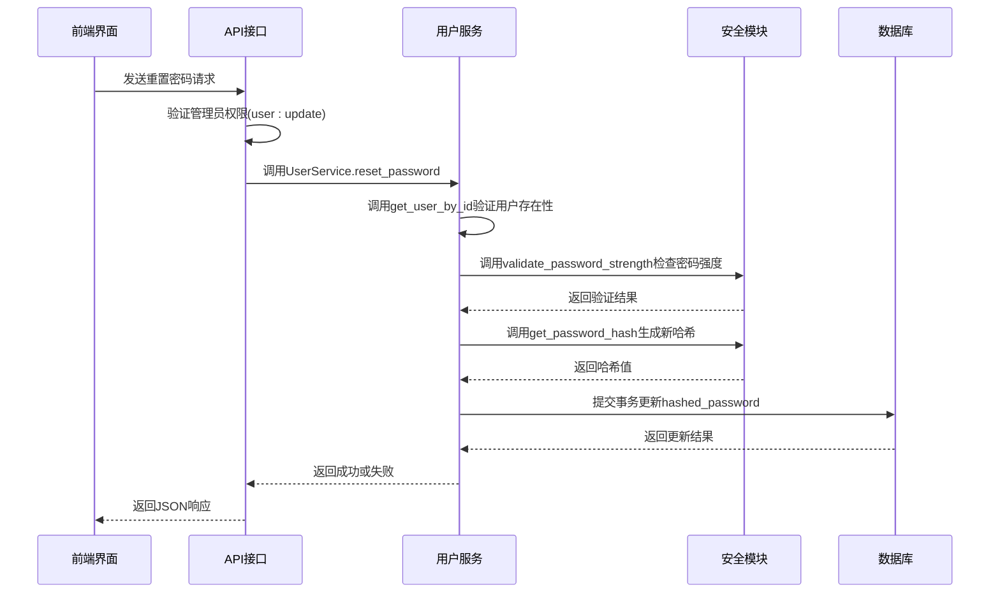
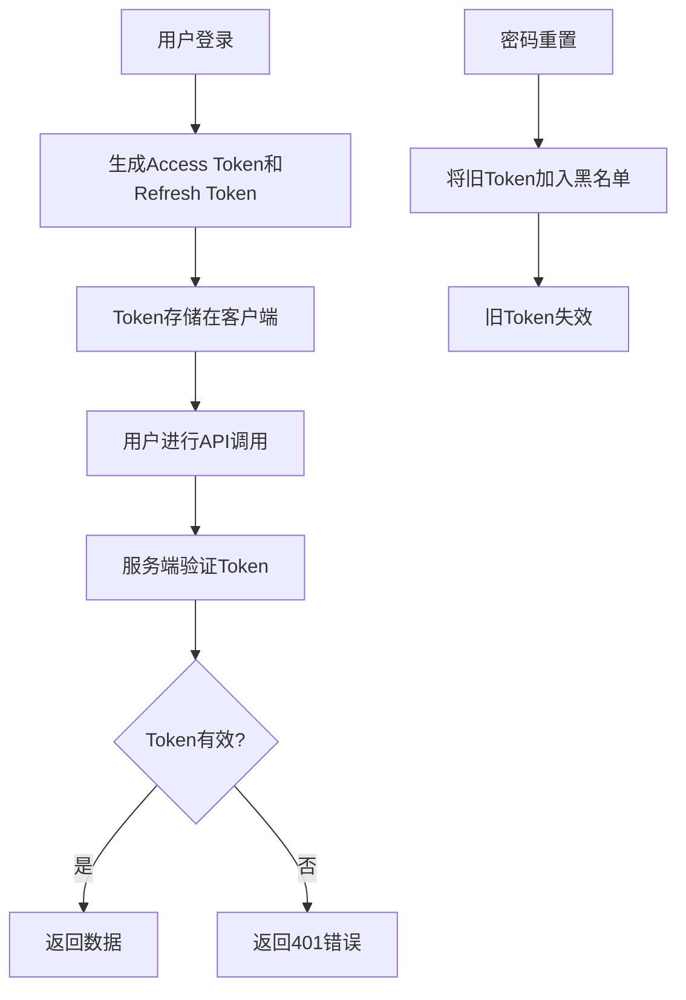

# 密码重置

<cite>
**本文档引用的文件**   
- [users.py](file://zquant/api/v1/users.py)
- [user.py](file://zquant/services/user.py)
- [user.py](file://zquant/models/user.py)
- [user.py](file://zquant/schemas/user.py)
- [security.py](file://zquant/core/security.py)
- [auth.py](file://zquant/services/auth.py)
- [audit.py](file://zquant/middleware/audit.py)
- [index.tsx](file://web/src/pages/admin/users/index.tsx)
- [users.ts](file://web/src/services/zquant/users.ts)
</cite>

## 目录
1. [简介](#简介)
2. [核心功能分析](#核心功能分析)
3. [执行流程详解](#执行流程详解)
4. [API接口与请求响应](#api接口与请求响应)
5. [安全最佳实践](#安全最佳实践)
6. [错误处理与状态码](#错误处理与状态码)
7. [审计日志记录](#审计日志记录)
8. [结论](#结论)

## 简介
本文档全面记录了管理员密码重置功能的实现细节。该功能允许具有相应权限的管理员重置其他用户的密码，是系统安全管理的重要组成部分。文档详细说明了`UserService.reset_password`方法的执行流程，包括用户存在性验证、新密码强度检查以及密码哈希更新机制。同时，文档还解释了密码重置功能与用户登录流程的集成点，以及密码变更后对现有会话的影响。此外，文档提供了安全最佳实践建议，如密码复杂度要求和审计日志记录，并展示了API请求/响应示例，描述了密码更新失败的各种场景及其对应的HTTP状态码。

## 核心功能分析

管理员密码重置功能是系统用户管理模块的核心功能之一，主要由后端服务和前端界面协同完成。后端通过FastAPI框架提供RESTful API接口，业务逻辑由`UserService`类封装，数据模型由`User`类定义。前端使用React框架构建管理界面，通过API调用与后端交互。

该功能的核心在于确保密码重置过程的安全性和可靠性。系统通过多层次的验证机制来保证操作的合法性：首先验证执行操作的管理员是否具有`user:update`权限；其次验证目标用户是否存在；最后对新密码进行严格的强度校验。密码的存储采用安全的哈希算法，确保即使数据库泄露，用户密码也不会被轻易破解。

**Section sources**
- [users.py](file://zquant/api/v1/users.py#L179-L194)
- [user.py](file://zquant/services/user.py#L124-L144)

## 执行流程详解

管理员密码重置功能的执行流程是一个严谨的多步骤过程，确保了操作的安全性和数据的完整性。以下是该流程的详细说明：



**Diagram sources**
- [users.py](file://zquant/api/v1/users.py#L179-L194)
- [user.py](file://zquant/services/user.py#L124-L144)
- [security.py](file://zquant/core/security.py#L49-L82)

**Section sources**
- [users.py](file://zquant/api/v1/users.py#L179-L194)
- [user.py](file://zquant/services/user.py#L124-L144)
- [security.py](file://zquant/core/security.py#L49-L82)

### 用户存在性验证
执行密码重置的第一步是验证目标用户的存在性。`UserService.reset_password`方法首先调用`get_user_by_id`方法，通过用户ID在数据库中查询用户记录。如果查询结果为空，即用户不存在，系统会抛出`NotFoundError`异常，该异常会被API层捕获并转换为HTTP 404状态码返回给客户端。这一步骤确保了管理员不能对不存在的用户执行密码重置操作，防止了无效操作和潜在的安全风险。

### 新密码强度检查
在确认用户存在后，系统会对新密码进行严格的强度检查。`validate_password_strength`函数负责此项任务，它对密码执行多项验证：
- **长度验证**：密码长度必须在8到128个字符之间。
- **字符类型验证**：密码必须同时包含大写字母、小写字母、数字和特殊字符（!@#$%^&*()_+-=[]{}|;:,.<>?）。
如果密码未能满足上述任何一项要求，函数将返回`False`和相应的错误消息，`reset_password`方法会抛出`ValidationError`异常，最终导致HTTP 400状态码的响应。这种严格的密码策略极大地提高了账户的安全性。

### 密码哈希更新机制
当新密码通过所有验证后，系统会使用`get_password_hash`函数生成新的密码哈希值。该函数利用`bcrypt`算法对明文密码进行哈希处理，生成一个安全的、不可逆的哈希字符串。然后，`reset_password`方法将用户对象的`hashed_password`字段更新为此新值，并通过数据库事务提交更改。整个过程在一个数据库事务中完成，如果提交失败（例如由于数据库约束冲突），事务会回滚，确保数据的一致性。

## API接口与请求响应

管理员密码重置功能通过RESTful API暴露给前端应用。API端点定义在`zquant/api/v1/users.py`文件中，遵循标准的HTTP协议和JSON数据格式。

### API定义
- **端点**: `POST /api/v1/users/{user_id}/reset-password`
- **权限要求**: `user:update`
- **请求体**: `PasswordReset`模型
- **成功响应**: HTTP 200，JSON对象 `{"message": "密码重置成功"}`
- **失败响应**: 相应的HTTP错误状态码和错误消息

### 请求示例
```json
{
  "password": "NewPass123!",
  "password_confirm": "NewPass123!"
}
```

### 响应示例
```json
{
  "message": "密码重置成功"
}
```

前端通过`web/src/services/zquant/users.ts`中的`resetUserPassword`函数调用此API。该函数封装了HTTP请求的细节，使得前端组件可以方便地发起密码重置请求。

**Section sources**
- [users.py](file://zquant/api/v1/users.py#L179-L194)
- [user.py](file://zquant/schemas/user.py#L64-L77)
- [users.ts](file://web/src/services/zquant/users.ts#L132-L139)

## 安全最佳实践

系统在密码重置功能中实施了多项安全最佳实践，以保护用户账户安全。

### 密码复杂度要求
系统强制要求新密码必须满足高复杂度标准。密码必须包含大写字母、小写字母、数字和特殊字符，且长度在8到128位之间。这一策略有效防止了弱密码的使用，大大增加了暴力破解的难度。

### 会话管理
当用户密码被重置后，该用户的所有现有会话都将失效。这是通过`AuthService`的Token黑名单机制实现的。当用户成功登录时，系统会生成一个访问Token和一个刷新Token。当密码重置后，即使攻击者持有旧的Token，也无法继续访问系统，因为这些Token在下次使用时会被识别为已失效。



**Diagram sources**
- [auth.py](file://zquant/services/auth.py#L147-L162)
- [audit.py](file://zquant/middleware/audit.py#L91-L159)

**Section sources**
- [auth.py](file://zquant/services/auth.py#L147-L162)
- [audit.py](file://zquant/middleware/audit.py#L91-L159)

## 错误处理与状态码

系统对密码重置过程中可能出现的各种错误情况进行了完善的处理，并返回相应的HTTP状态码，便于前端进行错误提示和用户引导。

| 错误场景 | HTTP状态码 | 错误消息示例 | 说明 |
| :--- | :--- | :--- | :--- |
| 用户不存在 | 404 Not Found | "用户ID 99999 不存在" | 目标用户ID在数据库中找不到 |
| 密码强度不足 | 400 Bad Request | "密码长度至少为8位" | 新密码未满足复杂度要求 |
| 两次密码输入不一致 | 400 Bad Request | "两次输入的密码不一致" | `PasswordReset`模型的验证器抛出 |
| 数据库操作失败 | 400 Bad Request | "重置密码失败" | 事务提交时发生完整性错误 |
| 权限不足 | 403 Forbidden | (由权限装饰器处理) | 执行者不具有`user:update`权限 |

这些清晰的错误反馈机制有助于管理员快速定位问题并采取正确的纠正措施。

**Section sources**
- [users.py](file://zquant/api/v1/users.py#L191-L194)
- [user.py](file://zquant/services/user.py#L133-L134)
- [user.py](file://zquant/schemas/user.py#L75-L76)

## 审计日志记录

为了满足安全审计和合规性要求，系统对密码重置操作进行了详细的日志记录。`AuditMiddleware`中间件会自动捕获所有敏感的HTTP请求，包括密码重置操作。

当管理员发起密码重置请求时，审计中间件会记录以下信息：
- **HTTP方法**: POST
- **请求路径**: `/api/v1/users/{user_id}/reset-password`
- **状态码**: 操作结果（200表示成功，400/404表示失败）
- **操作者信息**: 执行操作的管理员的用户ID和用户名
- **客户端IP**: 发起请求的客户端IP地址
- **请求体**: 脱敏后的请求数据（密码字段被替换为`***`）
- **操作结果**: 成功或失败

日志根据操作的敏感程度和结果选择不同的日志级别。成功的敏感操作记录为`INFO`级别，失败的敏感操作记录为`WARNING`级别。这些日志对于追踪安全事件、调查异常行为和满足合规性要求至关重要。

**Section sources**
- [audit.py](file://zquant/middleware/audit.py#L137-L156)
- [users.py](file://zquant/api/v1/users.py#L179-L194)

## 结论
管理员密码重置功能是一个设计严谨、安全性高的系统功能。它通过多层次的验证机制、安全的密码存储策略、严格的会话管理和详尽的审计日志，确保了用户账户的安全。该功能的实现体现了系统在安全性和用户体验之间的良好平衡。对于管理员而言，操作流程简单直观；对于系统而言，每一步操作都受到严格的控制和监控。建议在实际使用中，管理员应遵循最小权限原则，仅在必要时执行密码重置操作，并确保操作的合法性和正当性。