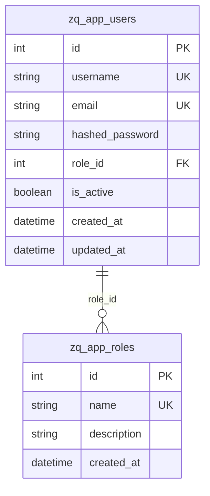

# 用户创建

<cite>
**本文档引用的文件**   
- [user.py](file://zquant/services/user.py)
- [user.py](file://zquant/models/user.py)
- [users.py](file://zquant/api/v1/users.py)
- [user.py](file://zquant/schemas/user.py)
- [security.py](file://zquant/core/security.py)
- [validators.py](file://zquant/utils/validators.py)
- [users.ts](file://web/src/services/zquant/users.ts)
</cite>

## 目录
1. [用户创建功能概述](#用户创建功能概述)
2. [UserService.create_user方法实现机制](#userservicecreate_user方法实现机制)
3. [用户数据模型与数据库约束](#用户数据模型与数据库约束)
4. [API接口定义与请求示例](#api接口定义与请求示例)
5. [事务处理与异常回滚机制](#事务处理与异常回滚机制)
6. [前端表单验证建议](#前端表单验证建议)
7. [总结](#总结)

## 用户创建功能概述

用户创建功能是系统管理的核心功能之一，允许管理员创建新用户账户。该功能涉及多个组件的协同工作，包括API接口、服务层、数据模型和数据库约束。整个流程确保了用户数据的完整性、安全性和一致性。

该功能主要由`UserService.create_user`方法实现，该方法在创建用户时执行多项验证，包括角色存在性验证、用户名和邮箱唯一性检查、密码强度验证等。所有操作都在数据库事务中执行，确保了数据的一致性。

**Section sources**
- [user.py](file://zquant/services/user.py#L41-L81)
- [users.py](file://zquant/api/v1/users.py#L148-L157)

## UserService.create_user方法实现机制

`UserService.create_user`方法是用户创建功能的核心实现，它是一个静态方法，接收数据库会话和用户创建数据作为参数。该方法的实现机制包括以下几个关键步骤：

### 角色验证

在创建用户之前，系统首先验证指定的角色ID是否存在。这是通过查询`Role`模型来完成的：

```python
role = db.query(Role).filter(Role.id == user_data.role_id).first()
if not role:
    raise NotFoundError(f"角色ID {user_data.role_id} 不存在")
```

如果角色不存在，则抛出`NotFoundError`异常，阻止用户创建过程。

### 用户名和邮箱唯一性检查

系统在创建用户前会检查用户名和邮箱的唯一性，防止重复注册：

```python
# 检查用户名是否已存在
existing_user = db.query(User).filter(User.username == user_data.username).first()
if existing_user:
    raise ValidationError(f"用户名 {user_data.username} 已存在")

# 检查邮箱是否已存在
existing_email = db.query(User).filter(User.email == user_data.email).first()
if existing_email:
    raise ValidationError(f"邮箱 {user_data.email} 已被使用")
```

这些检查确保了用户名和邮箱在整个系统中的唯一性。

### 密码强度验证

密码强度验证是通过调用`validate_password_strength`函数实现的：

```python
is_valid, error_msg = validate_password_strength(user_data.password)
if not is_valid:
    raise ValidationError(error_msg)
```

密码强度验证的具体规则在`core/security.py`文件中定义，包括长度要求、字符类型要求等。

**Section sources**
- [user.py](file://zquant/services/user.py#L43-L61)

## 用户数据模型与数据库约束

用户数据模型定义了用户实体的结构和约束，包括字段定义、索引和关系。

### 用户模型字段约束

`User`模型定义了以下字段及其约束：

```python
class User(Base):
    __tablename__ = "zq_app_users"

    id = Column(Integer, primary_key=True, index=True)
    username = Column(String(50), unique=True, nullable=False, index=True)
    email = Column(String(100), unique=True, nullable=False, index=True)
    hashed_password = Column(String(255), nullable=False)
    role_id = Column(Integer, ForeignKey("zq_app_roles.id"), nullable=False)
    is_active = Column(Boolean, default=True, nullable=False)
    created_at = Column(DateTime, default=func.now(), nullable=False)
    updated_at = Column(DateTime, default=func.now(), onupdate=func.now(), nullable=False)
```

- `username`: 字符串类型，最大长度50，唯一且带索引
- `email`: 字符串类型，最大长度100，唯一且带索引
- `hashed_password`: 字符串类型，最大长度255，存储加密后的密码
- `role_id`: 整数类型，外键关联到角色表，不能为空
- `is_active`: 布尔类型，表示用户是否激活，默认为True
- `created_at`: 创建时间，自动设置为当前时间
- `updated_at`: 更新时间，自动更新为当前时间

### 数据库层面的唯一性索引

数据库层面通过以下方式确保数据的唯一性：

1. **唯一约束**：`username`和`email`字段都设置了`unique=True`，这会在数据库层面创建唯一性约束，防止重复值。
2. **索引**：`username`、`email`和`role_id`字段都设置了索引，提高了查询性能。
3. **外键约束**：`role_id`字段是外键，确保了引用完整性。

这些数据库约束与应用层的验证共同作用，确保了数据的一致性和完整性。



**Diagram sources **
- [user.py](file://zquant/models/user.py#L74-L87)
- [user.py](file://zquant/models/user.py#L34-L43)

**Section sources**
- [user.py](file://zquant/models/user.py#L74-L94)

## API接口定义与请求示例

用户创建功能通过RESTful API暴露，允许客户端通过HTTP请求创建用户。

### API端点

创建用户的API端点定义如下：

```python
@router.post("", response_model=UserResponse, status_code=status.HTTP_201_CREATED, summary="创建用户")
@check_permission("user", "create")
def create_user(
    user_data: UserCreate, db: Session = Depends(get_db), current_user: User = Depends(get_current_active_user)
):
    """创建用户（需要user:create权限）"""
    try:
        user = UserService.create_user(db, user_data)
        return user
    except (NotFoundError, ValidationError) as e:
        raise HTTPException(status_code=status.HTTP_400_BAD_REQUEST, detail=str(e))
```

该端点需要`user:create`权限，并返回创建的用户信息。

### 请求示例

#### 成功场景

```json
POST /api/v1/users
Content-Type: application/json

{
  "username": "newuser",
  "email": "newuser@example.com",
  "password": "NewPass123!",
  "password_confirm": "NewPass123!",
  "role_id": 1
}
```

响应：
```json
HTTP/1.1 201 Created
Content-Type: application/json

{
  "id": 2,
  "username": "newuser",
  "email": "newuser@example.com",
  "role_id": 1,
  "is_active": true,
  "created_at": "2025-01-01T00:00:00"
}
```

#### 失败场景

1. **用户名已存在**：
```json
HTTP/1.1 400 Bad Request
{
  "detail": "用户名 newuser 已存在"
}
```

2. **邮箱已被使用**：
```json
HTTP/1.1 400 Bad Request
{
  "detail": "邮箱 newuser@example.com 已被使用"
}
```

3. **角色不存在**：
```json
HTTP/1.1 400 Bad Request
{
  "detail": "角色ID 999 不存在"
}
```

4. **密码强度不足**：
```json
HTTP/1.1 400 Bad Request
{
  "detail": "密码必须包含至少一个大写字母"
}
```

**Section sources**
- [users.py](file://zquant/api/v1/users.py#L148-L157)
- [user.py](file://zquant/schemas/user.py#L40-L48)

## 事务处理与异常回滚机制

用户创建操作涉及数据库事务处理，确保了数据的一致性和完整性。

### 事务处理流程

`UserService.create_user`方法中的事务处理流程如下：

```python
try:
    db.add(user)
    db.commit()
    db.refresh(user)
    return user
except IntegrityError:
    db.rollback()
    raise ValidationError("创建用户失败，数据冲突")
```

1. 将新用户对象添加到数据库会话
2. 提交事务
3. 刷新对象以获取数据库生成的ID和其他默认值
4. 返回创建的用户对象

### IntegrityError处理

当发生数据库完整性错误（如唯一性约束冲突）时，系统会捕获`IntegrityError`异常：

```python
except IntegrityError:
    db.rollback()
    raise ValidationError("创建用户失败，数据冲突")
```

处理流程包括：
1. 回滚事务，撤销所有未提交的更改
2. 抛出`ValidationError`异常，向客户端返回友好的错误消息

这种机制确保了即使在错误情况下，数据库状态也保持一致，不会留下部分创建的用户记录。

此外，系统还通过`get_db`依赖注入函数提供了全局的异常处理机制，确保在任何数据库操作异常时都能正确回滚事务。

**Section sources**
- [user.py](file://zquant/services/user.py#L73-L81)
- [database.py](file://zquant/database.py#L99-L109)

## 前端表单验证建议

为了提供更好的用户体验，前端应在提交前进行表单验证，确保与后端验证规则一致。

### 验证规则一致性

前端验证应与后端规则保持一致：

1. **用户名**：3-50个字符
2. **邮箱**：有效的邮箱格式
3. **密码**：
   - 至少8位
   - 包含大小写字母
   - 包含数字
   - 包含特殊字符（!@#$%^&*()_+-=[]{}|;:,.<>?）

### 前端实现示例

基于项目中的前端代码，可以实现如下验证：

```typescript
// 密码验证规则
const passwordRules = [
  { required: true, message: '请输入密码' },
  { min: 8, message: '密码至少8位' },
  {
    pattern: /^(?=.*[a-z])(?=.*[A-Z])(?=.*\d)(?=.*[!@#$%^&*()_+\-=\[\]{}|;:,.<>?])/,
    message: '密码必须包含大小写字母、数字和特殊字符',
  },
];

// 确认密码验证
const confirmPasswordRules = [
  { required: true, message: '请再次输入密码' },
  ({ getFieldValue }) => ({
    validator(_, value) {
      if (!value || getFieldValue('password') === value) {
        return Promise.resolve();
      }
      return Promise.reject(new Error('两次输入的密码不一致'));
    },
  }),
];
```

这种前后端一致的验证策略可以减少不必要的API调用，提高用户体验。

**Section sources**
- [users.ts](file://web/src/services/zquant/users.ts#L41-L48)
- [index.tsx](file://web/src/pages/admin/users/index.tsx#L316-L347)

## 总结

用户创建功能通过多层次的验证和事务处理机制，确保了用户数据的完整性、安全性和一致性。从API接口到服务层，再到数据模型和数据库约束，每个环节都精心设计，共同构成了一个健壮的用户管理系统。

关键特性包括：
- 角色存在性验证
- 用户名和邮箱唯一性检查
- 严格的密码强度验证
- 数据库事务和异常回滚
- 前后端验证规则一致性

这些特性共同确保了系统能够安全、可靠地管理用户账户，为整个应用的安全性奠定了基础。