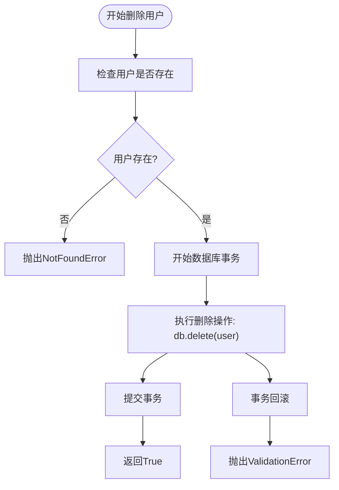
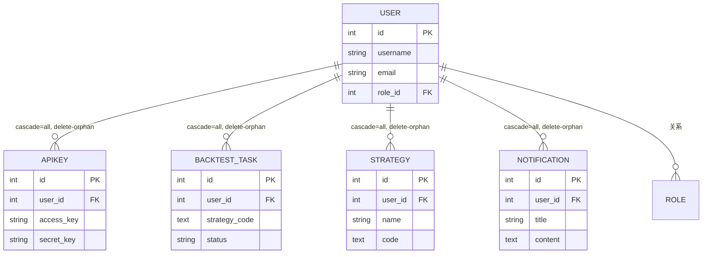
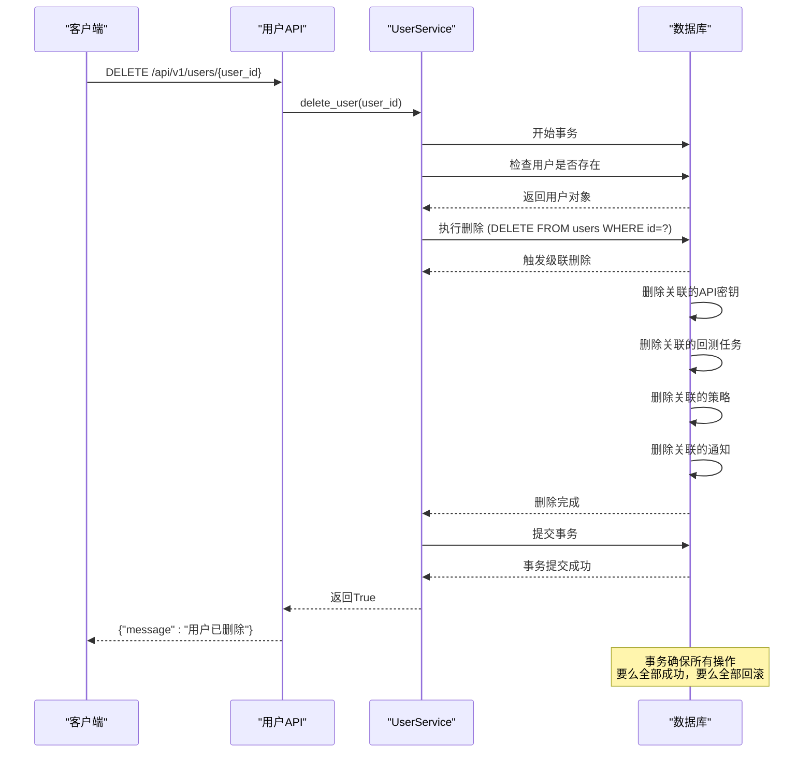
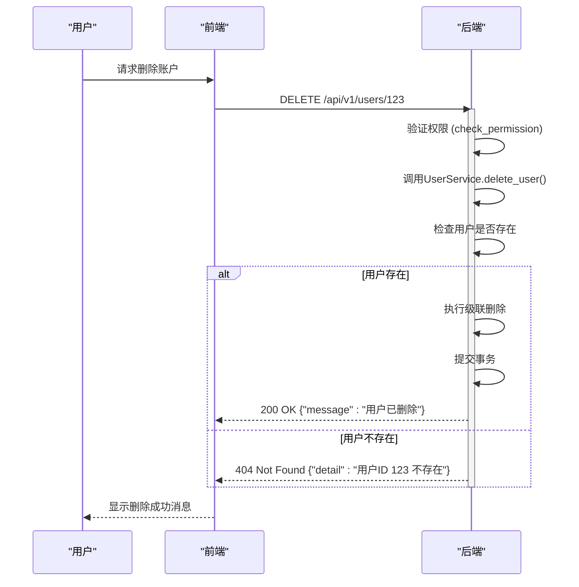
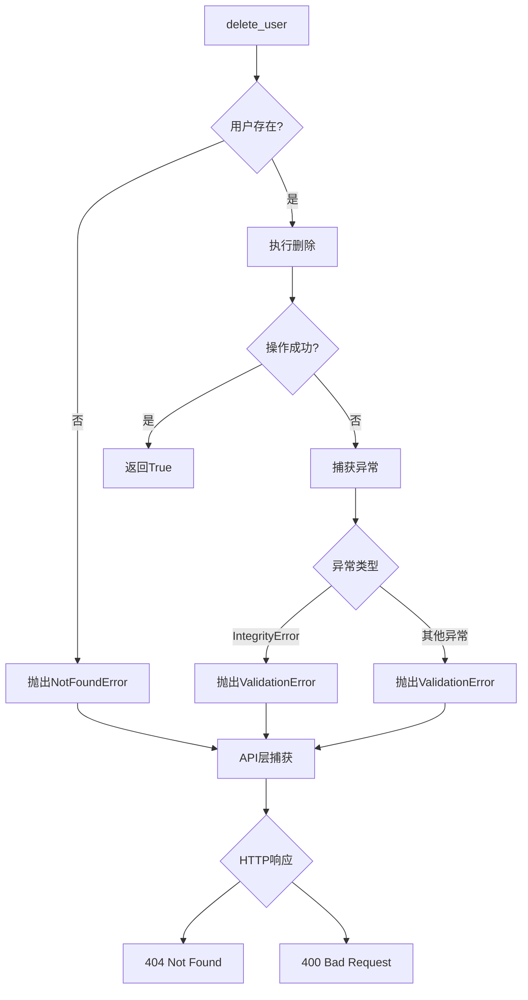

# 用户删除

<cite>
**本文档引用的文件**   
- [user.py](file://zquant/services/user.py)
- [users.py](file://zquant/api/v1/users.py)
- [user.py](file://zquant/models/user.py)
- [backtest.py](file://zquant/models/backtest.py)
- [notification.py](file://zquant/models/notification.py)
- [scheduler.py](file://zquant/models/scheduler.py)
- [factor.py](file://zquant/models/factor.py)
- [exceptions.py](file://zquant/core/exceptions.py)
- [test_user_service.py](file://zquant/tests/unittest/test_user_service.py)
</cite>

## 目录
1. [简介](#简介)
2. [用户删除功能实现](#用户删除功能实现)
3. [级联删除行为](#级联删除行为)
4. [数据库事务管理](#数据库事务管理)
5. [软删除与硬删除考量](#软删除与硬删除考量)
6. [相关实体影响](#相关实体影响)
7. [API调用示例](#api调用示例)
8. [异常处理机制](#异常处理机制)

## 简介
本文档详细描述了ZQuant平台中用户删除功能的实现机制。重点分析了`UserService.delete_user`方法的实现细节，包括用户存在性检查、级联删除行为（通过`cascade="all, delete-orphan"`配置）、数据库事务管理等核心功能。文档还解释了软删除与硬删除的选择考量，以及删除操作对API密钥、回测任务等相关实体的影响。同时提供了API调用示例和成功/失败响应模式，并说明了异常处理机制，特别是当删除操作违反外键约束时的错误传播路径。

## 用户删除功能实现

`UserService.delete_user`方法是用户删除功能的核心实现。该方法首先通过`get_user_by_id`检查用户是否存在，如果用户不存在则抛出`NotFoundError`异常。如果用户存在，则在数据库事务中执行删除操作。该方法实现了硬删除策略，即从数据库中永久移除用户记录及其所有关联数据。



**本节来源**
- [user.py](file://zquant/services/user.py#L209-L222)
- [users.py](file://zquant/api/v1/users.py#L197-L208)

## 级联删除行为

用户删除操作采用级联删除（cascade delete）策略，通过在用户模型中配置`cascade="all, delete-orphan"`来实现。当删除用户时，所有与该用户关联的子实体将被自动删除。这种配置确保了数据的一致性和完整性，避免了孤立的关联记录。



**图示来源**
- [user.py](file://zquant/models/user.py#L90-L93)
- [backtest.py](file://zquant/models/backtest.py#L67-L69)
- [notification.py](file://zquant/models/notification.py#L63)

## 数据库事务管理

用户删除操作在数据库事务的保护下执行，确保了操作的原子性和数据一致性。事务管理机制如下：首先开始一个数据库事务，然后执行删除操作，如果操作成功则提交事务，如果发生任何异常则回滚事务。这种机制防止了部分删除导致的数据不一致问题。



**图示来源**
- [user.py](file://zquant/services/user.py#L215-L221)
- [users.py](file://zquant/api/v1/users.py#L202)

## 软删除与硬删除考量

系统采用了硬删除策略而非软删除。硬删除会永久从数据库中移除用户及其所有关联数据，而软删除通常通过设置`is_deleted`标志位来逻辑删除记录。选择硬删除的主要考量包括：数据安全性和隐私保护，确保用户数据被彻底清除；系统性能，避免数据库中积累大量已删除但未清理的数据；以及业务需求，平台设计为用户数据与其账户强绑定，删除账户即意味着所有相关数据的终结。

**本节来源**
- [user.py](file://zquant/services/user.py#L216)
- [user.py](file://zquant/models/user.py#L84)

## 相关实体影响

删除用户操作会对多个相关实体产生级联影响。主要影响包括：所有与该用户关联的API密钥将被删除，确保了认证凭据的安全性；用户创建的所有回测任务及其结果将被清除，保持了数据的完整性；用户保存的策略定义将被移除；以及用户接收的所有通知记录将被删除。这些级联删除行为通过数据库关系配置自动执行。

```mermaid
classDiagram
class User {
+int id
+string username
+string email
+int role_id
+bool is_active
+datetime created_at
+datetime updated_at
}
class APIKey {
+int id
+int user_id
+string access_key
+string secret_key
+bool is_active
+datetime created_at
}
class BacktestTask {
+int id
+int user_id
+text strategy_code
+string status
+datetime created_at
}
class Strategy {
+int id
+int user_id
+string name
+text code
+datetime created_at
}
class Notification {
+int id
+int user_id
+string title
+text content
+bool is_read
+datetime created_at
}
User --> APIKey : "1对多"
User --> BacktestTask : "1对多"
User --> Strategy : "1对多"
User --> Notification : "1对多"
note right of User
删除用户时，所有关联的
子实体将被级联删除
end note
```

**图示来源**
- [user.py](file://zquant/models/user.py#L90-L93)
- [backtest.py](file://zquant/models/backtest.py#L54-L55)
- [notification.py](file://zquant/models/notification.py#L53)

## API调用示例

以下是用户删除功能的API调用示例，包括成功和失败的响应模式。

### 成功删除响应
```json
{
  "message": "用户已删除"
}
```

### 失败响应 - 用户不存在
```json
{
  "detail": "用户ID 999 不存在"
}
```

### 失败响应 - 权限不足
```json
{
  "detail": "用户ID 123 不存在"
}
```

### API调用流程


**本节来源**
- [users.py](file://zquant/api/v1/users.py#L197-L208)
- [user.py](file://zquant/services/user.py#L209-L222)

## 异常处理机制

用户删除功能实现了完善的异常处理机制。当删除操作违反外键约束或其他数据库约束时，系统会捕获异常并进行适当的处理。主要异常类型包括`NotFoundError`（用户不存在）和`ValidationError`（验证错误）。异常处理路径从服务层传播到API层，最终转换为适当的HTTP响应状态码。



**本节来源**
- [user.py](file://zquant/services/user.py#L219-L221)
- [users.py](file://zquant/api/v1/users.py#L204-L207)
- [exceptions.py](file://zquant/core/exceptions.py#L40-L45)