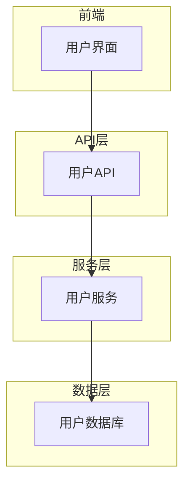
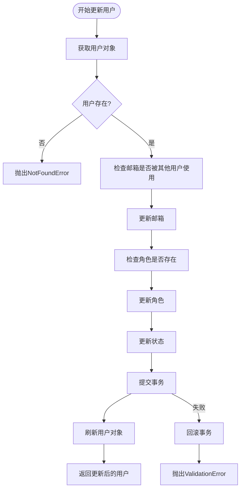
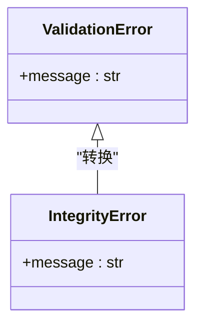
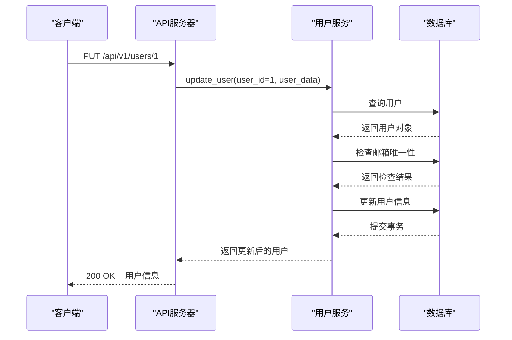

# 用户更新

<cite>
**本文档中引用的文件**   
- [user.py](file://zquant/services/user.py)
- [user.py](file://zquant/models/user.py)
- [users.py](file://zquant/api/v1/users.py)
- [user.py](file://zquant/schemas/user.py)
- [database.py](file://zquant/database.py)
- [deps.py](file://zquant/api/deps.py)
- [exceptions.py](file://zquant/core/exceptions.py)
- [security.py](file://zquant/core/security.py)
- [test_user_service.py](file://zquant/tests/unittest/test_user_service.py)
</cite>

## 目录
1. [用户信息更新功能概述](#用户信息更新功能概述)
2. [核心组件与架构](#核心组件与架构)
3. [用户更新业务逻辑详解](#用户更新业务逻辑详解)
4. [数据验证与错误处理机制](#数据验证与错误处理机制)
5. [事务管理与并发控制](#事务管理与并发控制)
6. [API接口与请求示例](#api接口与请求示例)
7. [安全与权限控制](#安全与权限控制)
8. [测试验证](#测试验证)
9. [总结](#总结)

## 用户信息更新功能概述

用户信息更新功能是系统用户管理模块的核心功能之一，允许管理员或用户本人安全地更新用户信息。该功能通过`UserService.update_user`方法实现，支持部分更新，包括邮箱、账户状态和角色等字段的修改。系统在更新过程中实施了严格的验证机制，确保数据的完整性和一致性，同时通过事务管理保证操作的原子性。

**Section sources**
- [user.py](file://zquant/services/user.py#L93-L123)
- [users.py](file://zquant/api/v1/users.py#L161-L177)

## 核心组件与架构

用户信息更新功能涉及多个核心组件，包括服务层、API层、数据模型和数据库会话管理。服务层的`UserService`类负责业务逻辑处理，API层通过FastAPI路由暴露更新接口，数据模型定义了用户实体的结构，而数据库会话管理确保了数据操作的正确性。

**Diagram sources **
- [users.py](file://zquant/api/v1/users.py#L161-L177)
- [user.py](file://zquant/services/user.py#L93-L123)
- [user.py](file://zquant/models/user.py#L74-L94)

## 用户更新业务逻辑详解

`UserService.update_user`方法实现了用户信息的部分更新功能。该方法首先通过用户ID获取用户对象，然后根据传入的更新数据逐项处理。对于邮箱更新，系统会检查新邮箱是否已被其他用户使用，但排除当前用户自身，以避免自我冲突。角色更新时，会验证角色ID是否存在。状态变更则直接更新用户的激活状态。

**Diagram sources **
- [user.py](file://zquant/services/user.py#L93-L123)

**Section sources**
- [user.py](file://zquant/services/user.py#L93-L123)

## 数据验证与错误处理机制

系统在用户更新过程中实施了多层次的数据验证。首先，通过Pydantic模型`UserUpdate`进行基础验证，确保输入数据的格式正确。然后，在服务层进行业务逻辑验证，如邮箱唯一性检查和角色存在性验证。当捕获到数据库`IntegrityError`时，系统将其转换为`ValidationError`，提供更友好的错误信息。

**Diagram sources **
- [user.py](file://zquant/services/user.py#L116-L122)
- [exceptions.py](file://zquant/core/exceptions.py#L44-L45)

**Section sources**
- [user.py](file://zquant/services/user.py#L116-L122)
- [exceptions.py](file://zquant/core/exceptions.py#L44-L45)

## 事务管理与并发控制

用户更新操作在数据库事务中执行，确保了操作的原子性和一致性。系统使用SQLAlchemy的会话管理机制，在`update_user`方法中，所有数据库操作都在同一个会话中进行。如果更新过程中发生任何异常，事务将被回滚，防止数据处于不一致状态。这种机制有效处理了并发更新场景，避免了数据冲突。

**Section sources**
- [user.py](file://zquant/services/user.py#L116-L122)
- [database.py](file://zquant/database.py#L84-L109)

## API接口与请求示例

用户更新功能通过PUT `/api/v1/users/{user_id}` API端点暴露。该接口需要`user:update`权限，并接受`UserUpdate`模型作为请求体。以下是一个安全更新用户信息的请求示例：

**Diagram sources **
- [users.py](file://zquant/api/v1/users.py#L161-L177)
- [user.py](file://zquant/services/user.py#L93-L123)

**Section sources**
- [users.py](file://zquant/api/v1/users.py#L161-L177)

## 安全与权限控制

系统通过多层次的安全机制保护用户更新功能。首先，API端点使用`@check_permission("user", "update")`装饰器，确保只有具有相应权限的用户才能执行更新操作。其次，密码强度验证通过`validate_password_strength`函数实现，确保新密码符合安全要求。最后，所有敏感操作都被记录在审计日志中，便于追踪和监控。

**Section sources**
- [users.py](file://zquant/api/v1/users.py#L162)
- [security.py](file://zquant/core/security.py#L49-L82)
- [deps.py](file://zquant/api/deps.py#L77-L92)

## 测试验证

系统提供了全面的单元测试来验证用户更新功能的正确性。测试用例覆盖了成功更新、更新不存在的用户、邮箱冲突等场景。通过`test_update_user_success`、`test_update_user_not_found`和`test_update_user_duplicate_email`等测试方法，确保了功能的健壮性和可靠性。

**Section sources**
- [test_user_service.py](file://zquant/tests/unittest/test_user_service.py#L130-L152)

## 总结

用户信息更新功能通过精心设计的业务逻辑、严格的数据验证和可靠的事务管理，实现了安全、高效和一致的用户信息更新。系统不仅支持部分更新，还通过多层次的验证和错误处理机制，确保了数据的完整性和系统的稳定性。API接口的设计遵循RESTful原则，提供了清晰的错误反馈，便于客户端处理各种异常情况。