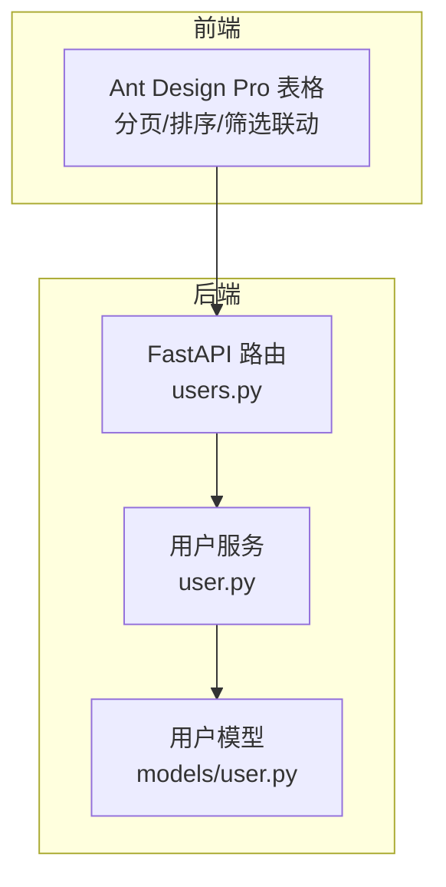
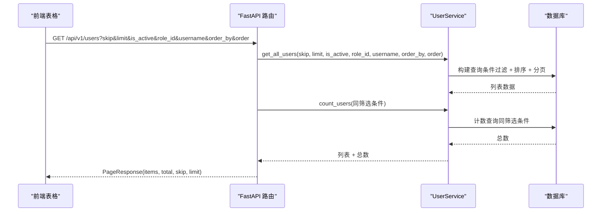
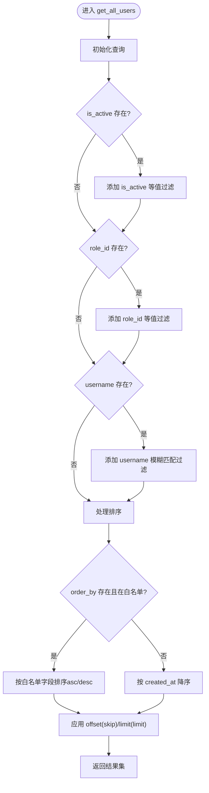
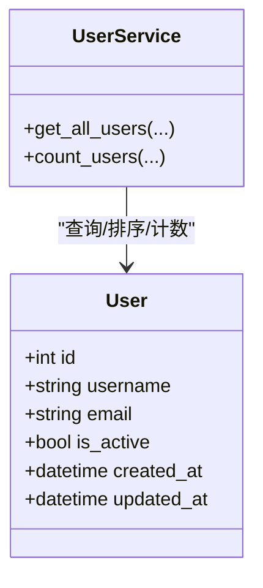
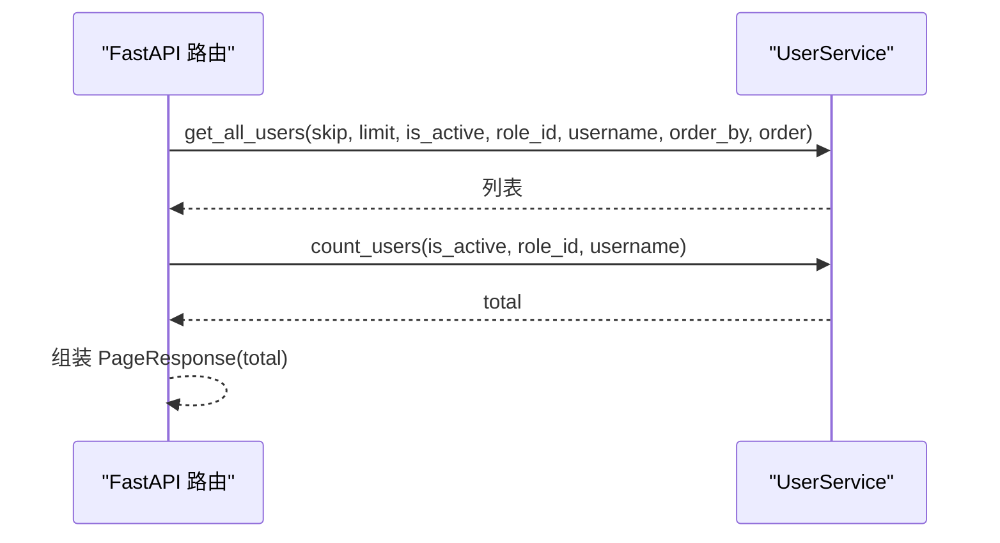
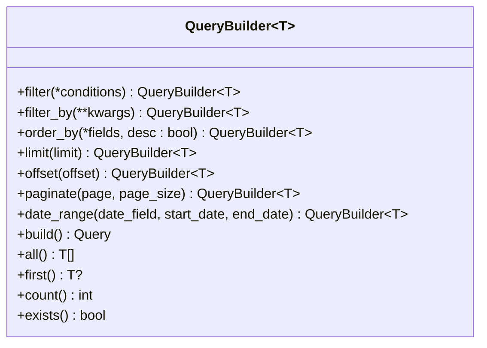

# 用户查询

<cite>
**本文引用的文件**
- [zquant/services/user.py](file://zquant/services/user.py)
- [zquant/api/v1/users.py](file://zquant/api/v1/users.py)
- [zquant/models/user.py](file://zquant/models/user.py)
- [web/src/pages/admin/users/index.tsx](file://web/src/pages/admin/users/index.tsx)
- [zquant/utils/query_builder.py](file://zquant/utils/query_builder.py)
- [zquant/utils/query_optimizer.py](file://zquant/utils/query_optimizer.py)
- [zquant/tests/unittest/test_user_service.py](file://zquant/tests/unittest/test_user_service.py)
</cite>

## 目录
1. [简介](#简介)
2. [项目结构](#项目结构)
3. [核心组件](#核心组件)
4. [架构总览](#架构总览)
5. [详细组件分析](#详细组件分析)
6. [依赖分析](#依赖分析)
7. [性能考虑](#性能考虑)
8. [故障排查指南](#故障排查指南)
9. [结论](#结论)
10. [附录](#附录)

## 简介
本文件聚焦于“用户查询”功能的实现与使用，围绕以下目标展开：
- 解释 UserService.get_all_users 如何支持分页（skip/limit）、多条件筛选（激活状态、角色ID、用户名模糊匹配）与排序功能
- 分析查询构建器模式在动态SQL生成中的应用
- 说明 sortable_fields 字典如何实现安全的排序字段白名单
- 说明 count_users 在分页计算中的作用
- 提供 API 参数使用示例（复杂筛选与排序场景）
- 给出性能优化建议（索引使用）

## 项目结构
用户查询功能涉及三层：
- API 层：FastAPI 路由接收请求参数并调用服务层
- 服务层：UserService 提供 get_all_users、count_users 等业务方法
- 数据层：SQLAlchemy ORM 映射 User 模型，配合索引提升查询性能

**图表来源**
- [zquant/api/v1/users.py](file://zquant/api/v1/users.py#L51-L76)
- [zquant/services/user.py](file://zquant/services/user.py#L147-L206)
- [zquant/models/user.py](file://zquant/models/user.py#L74-L94)

**章节来源**
- [zquant/api/v1/users.py](file://zquant/api/v1/users.py#L51-L76)
- [zquant/services/user.py](file://zquant/services/user.py#L147-L206)
- [zquant/models/user.py](file://zquant/models/user.py#L74-L94)

## 核心组件
- API 路由层：定义查询参数（skip、limit、is_active、role_id、username、order_by、order），调用 UserService 并返回分页响应
- 服务层：实现 get_all_users 的动态条件拼装与排序；实现 count_users 的计数
- 模型层：User 表及索引字段（id、username、email、role_id、created_at、updated_at）

关键点：
- 分页：skip/limit 传入后端，最终以 offset/limit 应用到查询
- 筛选：is_active、role_id、username（模糊匹配）三类条件可任意组合
- 排序：order_by 限定白名单，order 控制 asc/desc

**章节来源**
- [zquant/api/v1/users.py](file://zquant/api/v1/users.py#L51-L76)
- [zquant/services/user.py](file://zquant/services/user.py#L147-L206)
- [zquant/models/user.py](file://zquant/models/user.py#L74-L94)

## 架构总览
用户查询的端到端流程如下：

**图表来源**
- [zquant/api/v1/users.py](file://zquant/api/v1/users.py#L51-L76)
- [zquant/services/user.py](file://zquant/services/user.py#L147-L206)

## 详细组件分析

### UserService.get_all_users：分页/筛选/排序
- 分页参数
  - skip：跳过记录数（offset）
  - limit：每页记录数（limit）
- 筛选条件
  - is_active：布尔等值筛选
  - role_id：整数等值筛选
  - username：字符串模糊匹配（LIKE %username%）
- 排序策略
  - order_by：排序字段，受 sortable_fields 白名单控制
  - order：asc/desc，默认 desc
  - 若未指定或不在白名单内，则按 created_at 降序兜底
- 返回
  - apply offset/skip + limit 后的结果集

**图表来源**
- [zquant/services/user.py](file://zquant/services/user.py#L147-L190)

**章节来源**
- [zquant/services/user.py](file://zquant/services/user.py#L147-L190)

### sortable_fields 白名单与安全排序
- sortable_fields 定义允许排序的字段集合
- 仅当 order_by 在白名单中时才应用排序，否则回退到 created_at 降序
- 有效避免了任意字符串注入导致的 SQL 注入风险

**图表来源**
- [zquant/services/user.py](file://zquant/services/user.py#L147-L190)
- [zquant/models/user.py](file://zquant/models/user.py#L74-L94)

**章节来源**
- [zquant/services/user.py](file://zquant/services/user.py#L168-L188)
- [zquant/models/user.py](file://zquant/models/user.py#L74-L94)

### count_users 与分页计算
- API 层在返回列表前调用 count_users，传入与列表相同的筛选条件
- 服务层对相同筛选条件执行 count，得到 total
- 前端基于 total 计算总页数、导航与分页控件

**图表来源**
- [zquant/api/v1/users.py](file://zquant/api/v1/users.py#L51-L76)
- [zquant/services/user.py](file://zquant/services/user.py#L192-L206)

**章节来源**
- [zquant/api/v1/users.py](file://zquant/api/v1/users.py#L51-L76)
- [zquant/services/user.py](file://zquant/services/user.py#L192-L206)

### API 参数与使用示例
- 请求路径：GET /api/v1/users
- 查询参数
  - skip：跳过记录数（非负整数）
  - limit：每页记录数（1~1000）
  - is_active：是否激活（布尔）
  - role_id：角色ID（整数）
  - username：用户名（模糊匹配）
  - order_by：排序字段（id, username, email, is_active, created_at, updated_at）
  - order：排序方向（asc/desc）
- 响应：PageResponse（items、total、skip、limit）

常见复杂筛选与排序组合示例（以参数形式表达）：
- 活跃用户 + 角色ID = 1 + 按用户名升序
  - is_active=true & role_id=1 & order_by=username & order=asc
- 非活跃用户 + 用户名包含 “admin” + 按创建时间降序
  - is_active=false & username=admin & order_by=created_at & order=desc
- 按邮箱排序（asc）+ 分页
  - order_by=email & order=asc & skip=0 & limit=50

前端表格与 API 的对接要点：
- 前端 ProTable 支持 sorter，会将排序字段与方向转换为 order_by/order
- 前端分页 current/pageSize 计算 skip：skip=(current-1)*pageSize
- 前端将 is_active 转换为布尔或 undefined，role_id 与 username 直接透传

**章节来源**
- [zquant/api/v1/users.py](file://zquant/api/v1/users.py#L51-L76)
- [web/src/pages/admin/users/index.tsx](file://web/src/pages/admin/users/index.tsx#L210-L253)

### 查询构建器模式与动态SQL生成
- 当前 UserService.get_all_users 采用直接链式调用 SQLAlchemy Query API 的方式实现动态条件拼装
- 仓库提供了通用的 QueryBuilder 与 query_optimizer 工具，可用于进一步抽象与优化
  - QueryBuilder：提供 filter/filter_by/order_by/limit/offset/paginate/date_range/build/all/first/count/exists 等链式能力
  - query_optimizer：提供 paginate_query、优化关联加载、字段选择、日期范围过滤、查询统计等能力

**图表来源**
- [zquant/utils/query_builder.py](file://zquant/utils/query_builder.py#L37-L206)

**章节来源**
- [zquant/utils/query_builder.py](file://zquant/utils/query_builder.py#L37-L206)
- [zquant/utils/query_optimizer.py](file://zquant/utils/query_optimizer.py#L35-L181)

## 依赖分析
- API 路由依赖 UserService
- UserService 依赖 SQLAlchemy Session 与 User 模型
- 前端表格组件通过服务调用 API，传递分页/筛选/排序参数

**图表来源**
- [web/src/pages/admin/users/index.tsx](file://web/src/pages/admin/users/index.tsx#L210-L253)
- [zquant/api/v1/users.py](file://zquant/api/v1/users.py#L51-L76)
- [zquant/services/user.py](file://zquant/services/user.py#L147-L206)
- [zquant/models/user.py](file://zquant/models/user.py#L74-L94)

**章节来源**
- [web/src/pages/admin/users/index.tsx](file://web/src/pages/admin/users/index.tsx#L210-L253)
- [zquant/api/v1/users.py](file://zquant/api/v1/users.py#L51-L76)
- [zquant/services/user.py](file://zquant/services/user.py#L147-L206)
- [zquant/models/user.py](file://zquant/models/user.py#L74-L94)

## 性能考虑
- 索引设计
  - User 表已建立多个索引字段：id、username、email、role_id、created_at、updated_at
  - 建议在高频查询字段上保持索引，例如 username、role_id、is_active
- 查询优化建议
  - 使用 QueryBuilder 的 paginate 与 count 统一分页逻辑，避免重复计算
  - 对频繁联表/关联字段，结合 query_optimizer 的关联预加载能力，减少 N+1 查询
  - 对大数据量场景，尽量使用复合索引覆盖常用筛选与排序组合
- 前端分页与排序
  - 前端 ProTable 的 sorter 与分页 current/pageSize 与后端 skip/limit 对齐，避免跨端重复计算

**章节来源**
- [zquant/models/user.py](file://zquant/models/user.py#L74-L94)
- [zquant/utils/query_builder.py](file://zquant/utils/query_builder.py#L37-L206)
- [zquant/utils/query_optimizer.py](file://zquant/utils/query_optimizer.py#L35-L181)
- [web/src/pages/admin/users/index.tsx](file://web/src/pages/admin/users/index.tsx#L210-L253)

## 故障排查指南
- 常见问题
  - 排序字段非法：order_by 不在白名单将回退到 created_at 降序
  - 筛选条件无效：is_active 非布尔、role_id 非整数、username 非字符串将按传入值参与过滤
  - 分页越界：limit 超过上限或 skip 为负将导致异常或结果为空
- 单元测试参考
  - 测试覆盖了 get_all_users 的筛选与计数行为，可作为行为验证依据

**章节来源**
- [zquant/services/user.py](file://zquant/services/user.py#L147-L206)
- [zquant/tests/unittest/test_user_service.py](file://zquant/tests/unittest/test_user_service.py#L180-L213)

## 结论
- UserService.get_all_users 通过白名单排序与动态条件拼装，实现了灵活、安全的用户列表查询
- API 层负责参数解析与分页总数计算，前端表格与后端参数严格对齐
- 借助 QueryBuilder 与 query_optimizer，可进一步标准化与优化查询逻辑
- 建议在高频字段上完善索引，并结合预加载与字段选择降低查询成本

## 附录
- API 参数速查
  - skip：跳过记录数（非负整数）
  - limit：每页记录数（1~1000）
  - is_active：是否激活（布尔）
  - role_id：角色ID（整数）
  - username：用户名（模糊匹配）
  - order_by：排序字段（id, username, email, is_active, created_at, updated_at）
  - order：排序方向（asc/desc）