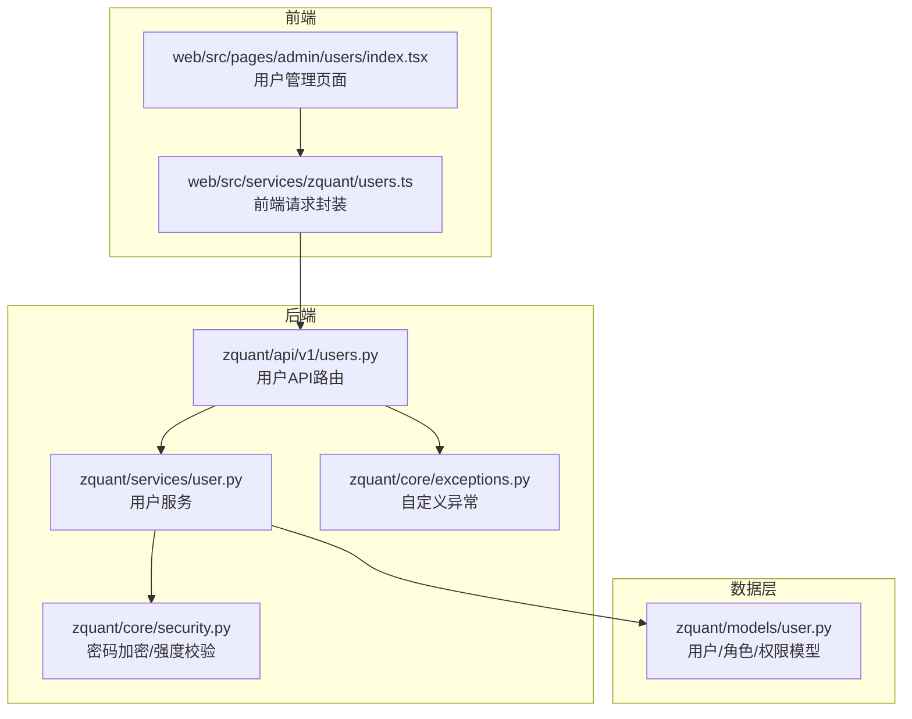
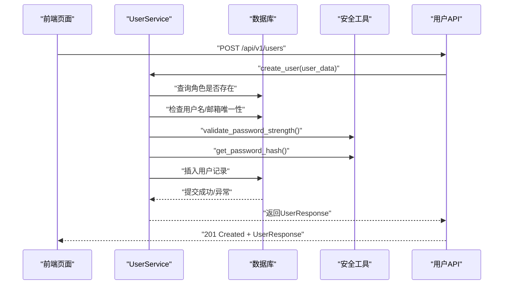
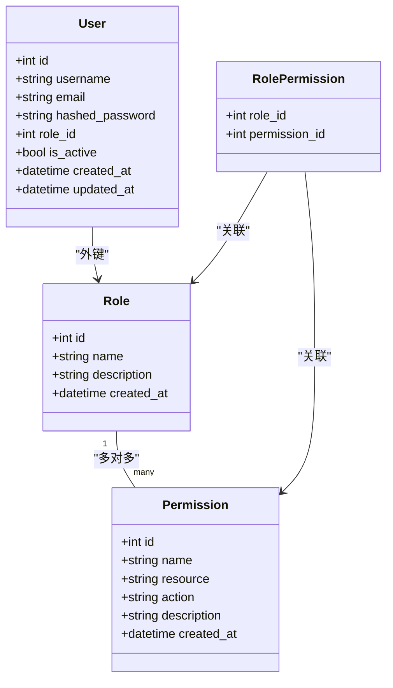
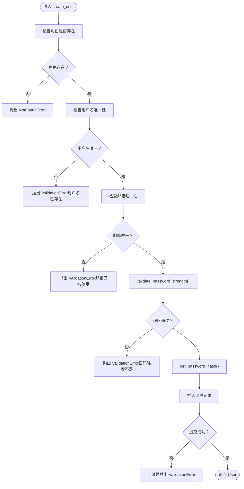
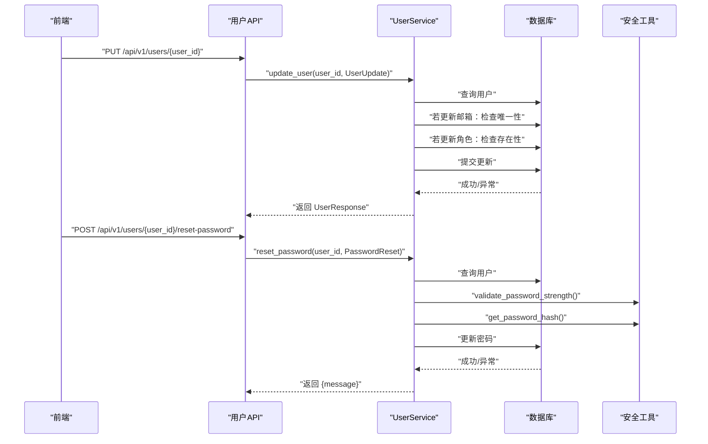
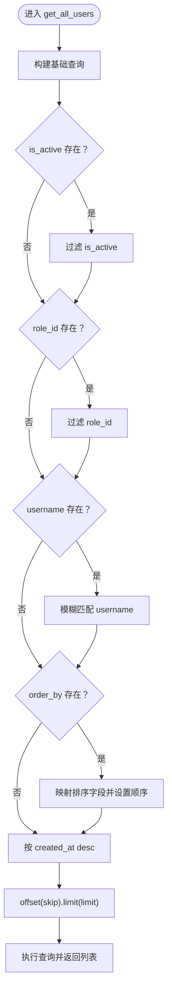
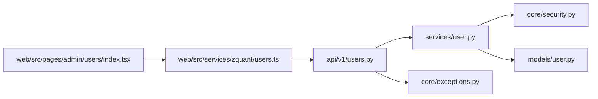

# 用户管理子系统

<cite>
**本文引用的文件**
- [models/user.py](file://zquant/models/user.py)
- [schemas/user.py](file://zquant/schemas/user.py)
- [services/user.py](file://zquant/services/user.py)
- [api/v1/users.py](file://zquant/api/v1/users.py)
- [core/security.py](file://zquant/core/security.py)
- [core/exceptions.py](file://zquant/core/exceptions.py)
- [web/src/services/zquant/users.ts](file://web/src/services/zquant/users.ts)
- [web/src/pages/admin/users/index.tsx](file://web/src/pages/admin/users/index.tsx)
- [tests/unittest/test_user_service.py](file://zquant/tests/unittest/test_user_service.py)
</cite>

## 目录
1. [简介](#简介)
2. [项目结构](#项目结构)
3. [核心组件](#核心组件)
4. [架构总览](#架构总览)
5. [详细组件分析](#详细组件分析)
6. [依赖关系分析](#依赖关系分析)
7. [性能考量](#性能考量)
8. [故障排查指南](#故障排查指南)
9. [结论](#结论)
10. [附录](#附录)

## 简介
本文件为 zquant 用户管理子系统的权威文档，覆盖用户 CRUD（创建、读取、更新、删除）的完整实现机制，包括：
- 用户创建时的角色验证、唯一性检查与密码强度校验
- 用户信息更新与密码重置的业务逻辑
- 用户列表查询的分页、筛选与排序实现
- 数据验证规则与异常处理机制
- 开发者使用示例与错误处理指南（含 HTTP 状态码与错误响应格式）

## 项目结构
用户管理子系统由后端 API、服务层、数据模型与前端交互组成，关键路径如下：
- 后端 API 层：负责路由、鉴权与异常映射
- 服务层：封装业务逻辑（创建、更新、删除、查询、计数、重置密码）
- 数据模型：定义用户、角色、权限与关联关系
- 前端服务与页面：提供用户列表、创建、编辑、重置密码与删除等交互

图表来源
- [api/v1/users.py](file://zquant/api/v1/users.py#L1-L208)
- [services/user.py](file://zquant/services/user.py#L1-L222)
- [models/user.py](file://zquant/models/user.py#L1-L113)
- [core/security.py](file://zquant/core/security.py#L1-L133)
- [core/exceptions.py](file://zquant/core/exceptions.py#L1-L54)
- [web/src/services/zquant/users.ts](file://web/src/services/zquant/users.ts#L1-L152)
- [web/src/pages/admin/users/index.tsx](file://web/src/pages/admin/users/index.tsx#L1-L200)

章节来源
- [api/v1/users.py](file://zquant/api/v1/users.py#L1-L208)
- [services/user.py](file://zquant/services/user.py#L1-L222)
- [models/user.py](file://zquant/models/user.py#L1-L113)
- [core/security.py](file://zquant/core/security.py#L1-L133)
- [core/exceptions.py](file://zquant/core/exceptions.py#L1-L54)
- [web/src/services/zquant/users.ts](file://web/src/services/zquant/users.ts#L1-L152)
- [web/src/pages/admin/users/index.tsx](file://web/src/pages/admin/users/index.tsx#L1-L200)

## 核心组件
- 数据模型（用户、角色、权限）
  - 用户表包含用户名、邮箱、哈希密码、角色外键、激活状态与时间戳
  - 角色表与权限表通过中间关联表建立多对多关系
- Pydantic 模型（输入/输出）
  - 用户创建、更新、重置密码、响应与分页模型
- 服务层（业务逻辑）
  - 创建用户：角色存在性校验、用户名/邮箱唯一性、密码强度校验、哈希存储
  - 更新用户：邮箱唯一性、角色存在性、字段级更新
  - 重置密码：目标用户存在性、密码强度校验、哈希更新
  - 列表查询：分页、筛选（激活状态、角色ID、用户名模糊）、排序（多字段）
  - 统计与删除：计数、删除并回滚异常
- API 层（路由与权限）
  - 提供用户列表、详情、创建、更新、重置密码、删除接口
  - 使用装饰器进行权限校验与当前用户注入
- 安全与异常
  - 密码强度校验与哈希算法
  - 自定义异常类型（认证、授权、未找到、验证、数据、回测）

章节来源
- [models/user.py](file://zquant/models/user.py#L1-L113)
- [schemas/user.py](file://zquant/schemas/user.py#L1-L376)
- [services/user.py](file://zquant/services/user.py#L1-L222)
- [api/v1/users.py](file://zquant/api/v1/users.py#L1-L208)
- [core/security.py](file://zquant/core/security.py#L1-L133)
- [core/exceptions.py](file://zquant/core/exceptions.py#L1-L54)

## 架构总览
用户管理的端到端流程如下：

图表来源
- [api/v1/users.py](file://zquant/api/v1/users.py#L148-L159)
- [services/user.py](file://zquant/services/user.py#L41-L78)
- [core/security.py](file://zquant/core/security.py#L44-L83)

章节来源
- [api/v1/users.py](file://zquant/api/v1/users.py#L148-L159)
- [services/user.py](file://zquant/services/user.py#L41-L78)
- [core/security.py](file://zquant/core/security.py#L44-L83)

## 详细组件分析

### 用户模型与关系
- 用户表字段：主键、用户名唯一索引、邮箱唯一索引、哈希密码、角色外键、激活状态、创建/更新时间戳
- 角色表字段：主键、名称唯一索引、描述、创建时间
- 权限表字段：主键、名称唯一索引、资源类型、动作类型、描述、创建时间
- 中间关联表：角色-权限多对多
- 用户与角色一对多；用户与 APIKey、策略、回测任务、通知等存在一对多级联删除

图表来源
- [models/user.py](file://zquant/models/user.py#L34-L113)

章节来源
- [models/user.py](file://zquant/models/user.py#L34-L113)

### 用户创建流程（含角色验证、唯一性检查、密码强度）
- 角色存在性：查询角色表，不存在则抛出“未找到”异常
- 唯一性检查：用户名与邮箱均需唯一，重复则抛出“验证错误”
- 密码强度：长度 8-128，必须包含大写、小写、数字、特殊字符
- 存储：密码经哈希后写入数据库，激活状态默认开启

图表来源
- [services/user.py](file://zquant/services/user.py#L41-L78)
- [core/security.py](file://zquant/core/security.py#L49-L83)

章节来源
- [services/user.py](file://zquant/services/user.py#L41-L78)
- [core/security.py](file://zquant/core/security.py#L49-L83)

### 用户信息更新与密码重置
- 更新用户
  - 可更新邮箱、激活状态、角色ID
  - 邮箱更新需保证全局唯一
  - 角色更新需确保角色存在
  - 提交失败时回滚并抛出“验证错误”
- 重置密码
  - 目标用户必须存在
  - 新密码需满足强度要求
  - 成功后返回成功消息

图表来源
- [api/v1/users.py](file://zquant/api/v1/users.py#L161-L195)
- [services/user.py](file://zquant/services/user.py#L93-L146)
- [core/security.py](file://zquant/core/security.py#L49-L83)

章节来源
- [api/v1/users.py](file://zquant/api/v1/users.py#L161-L195)
- [services/user.py](file://zquant/services/user.py#L93-L146)
- [core/security.py](file://zquant/core/security.py#L49-L83)

### 用户列表查询：分页、筛选、排序
- 分页参数：skip、limit（前端默认 100，最大 1000）
- 筛选参数：is_active（布尔）、role_id（整数）、username（模糊匹配）
- 排序参数：order_by（支持 id、username、email、is_active、created_at、updated_at）、order（asc/desc，默认 desc）
- 返回：PageResponse（items、total、skip、limit）

图表来源
- [api/v1/users.py](file://zquant/api/v1/users.py#L51-L76)
- [services/user.py](file://zquant/services/user.py#L148-L207)

章节来源
- [api/v1/users.py](file://zquant/api/v1/users.py#L51-L76)
- [services/user.py](file://zquant/services/user.py#L148-L207)

### 数据验证规则与异常处理
- Pydantic 验证
  - 用户创建：用户名长度 3-50，邮箱合法，密码长度 8-128，确认密码一致
  - 密码重置：密码长度 8-128，确认密码一致
- 密码强度规则
  - 长度 8-128
  - 必须包含大写字母、小写字母、数字、特殊字符
- 异常类型
  - NotFoundError：资源不存在（如用户、角色）
  - ValidationError：输入验证失败（如重复用户名/邮箱、弱密码、数据冲突）
  - 其他：认证/授权/数据/回测异常（用于统一异常体系）

章节来源
- [schemas/user.py](file://zquant/schemas/user.py#L40-L79)
- [core/security.py](file://zquant/core/security.py#L49-L83)
- [core/exceptions.py](file://zquant/core/exceptions.py#L1-L54)

### 前端使用示例与错误处理
- 前端服务封装了用户管理的常用请求（获取当前用户、创建用户、获取/创建/删除 API Key、查询用户列表、查询详情、更新、重置密码、删除）
- 页面组件提供用户表格、创建/编辑弹窗、重置密码弹窗与删除确认
- 错误处理：捕获后端返回的 detail 并展示消息；成功后刷新表格

章节来源
- [web/src/services/zquant/users.ts](file://web/src/services/zquant/users.ts#L1-L152)
- [web/src/pages/admin/users/index.tsx](file://web/src/pages/admin/users/index.tsx#L1-L200)

## 依赖关系分析
- API 层依赖服务层与权限装饰器，返回统一响应模型
- 服务层依赖数据模型、安全工具与异常类型
- 前端服务依赖后端 API，页面组件依赖服务与角色下拉数据

图表来源
- [api/v1/users.py](file://zquant/api/v1/users.py#L1-L208)
- [services/user.py](file://zquant/services/user.py#L1-L222)
- [models/user.py](file://zquant/models/user.py#L1-L113)
- [core/security.py](file://zquant/core/security.py#L1-L133)
- [core/exceptions.py](file://zquant/core/exceptions.py#L1-L54)
- [web/src/services/zquant/users.ts](file://web/src/services/zquant/users.ts#L1-L152)
- [web/src/pages/admin/users/index.tsx](file://web/src/pages/admin/users/index.tsx#L1-L200)

章节来源
- [api/v1/users.py](file://zquant/api/v1/users.py#L1-L208)
- [services/user.py](file://zquant/services/user.py#L1-L222)
- [models/user.py](file://zquant/models/user.py#L1-L113)
- [core/security.py](file://zquant/core/security.py#L1-L133)
- [core/exceptions.py](file://zquant/core/exceptions.py#L1-L54)
- [web/src/services/zquant/users.ts](file://web/src/services/zquant/users.ts#L1-L152)
- [web/src/pages/admin/users/index.tsx](file://web/src/pages/admin/users/index.tsx#L1-L200)

## 性能考量
- 查询优化
  - 用户名与邮箱建立唯一索引，避免重复写入与查询冲突
  - 列表查询支持按激活状态、角色ID、用户名模糊匹配，建议在高并发场景下为常用筛选字段建立索引
- 分页与排序
  - 默认每页 100 条，最大 1000 条，避免一次性返回过多数据
  - 排序字段有限且明确，建议在数据库层面为排序字段建立索引以提升排序性能
- 密码处理
  - 使用哈希算法存储密码，避免明文存储带来的安全风险
- 事务与回滚
  - 写入失败时回滚，减少脏数据产生

[本节为通用指导，无需列出具体文件来源]

## 故障排查指南
- 创建用户失败
  - 角色不存在：检查角色 ID 是否正确
  - 用户名/邮箱重复：修改用户名或邮箱
  - 密码强度不足：满足长度与字符要求
- 更新用户失败
  - 目标用户不存在：确认用户 ID
  - 邮箱重复：更换邮箱
  - 角色不存在：确认角色 ID
- 重置密码失败
  - 目标用户不存在：确认用户 ID
  - 密码强度不足：满足长度与字符要求
- 删除用户失败
  - 目标用户不存在：确认用户 ID
  - 数据库异常：检查连接与权限

章节来源
- [services/user.py](file://zquant/services/user.py#L41-L222)
- [tests/unittest/test_user_service.py](file://zquant/tests/unittest/test_user_service.py#L1-L231)

## 结论
用户管理子系统通过清晰的分层设计与严格的验证规则，实现了安全、可控的用户生命周期管理。后端 API 提供标准的 CRUD 与查询能力，前端页面与服务封装了常用交互。建议在生产环境中为高频查询字段建立索引，并持续完善日志与监控以保障稳定性。

[本节为总结性内容，无需列出具体文件来源]

## 附录

### API 定义与错误响应格式
- 查询用户列表
  - 方法与路径：GET /api/v1/users
  - 参数：skip（≥0）、limit（1-1000）、is_active（布尔）、role_id（整数）、username（模糊）、order_by（id/username/email/is_active/created_at/updated_at）、order（asc/desc）
  - 响应：PageResponse（items、total、skip、limit）
  - 成功状态码：200
- 查询用户详情
  - 方法与路径：GET /api/v1/users/{user_id}
  - 成功状态码：200；不存在：404
- 创建用户
  - 方法与路径：POST /api/v1/users
  - 请求体：UserCreate（username、email、password、password_confirm、role_id）
  - 成功状态码：201；失败：400
- 更新用户
  - 方法与路径：PUT /api/v1/users/{user_id}
  - 请求体：UserUpdate（email、is_active、role_id）
  - 成功状态码：200；不存在：404；失败：400
- 重置密码
  - 方法与路径：POST /api/v1/users/{user_id}/reset-password
  - 请求体：PasswordReset（password、password_confirm）
  - 成功状态码：200；不存在：404；失败：400
- 删除用户
  - 方法与路径：DELETE /api/v1/users/{user_id}
  - 成功状态码：200；不存在：404；失败：400

章节来源
- [api/v1/users.py](file://zquant/api/v1/users.py#L51-L207)
- [schemas/user.py](file://zquant/schemas/user.py#L40-L79)

### 使用示例（基于前端服务封装）
- 获取当前用户信息：调用 getCurrentUser()
- 创建用户：调用 createUser({ username, email, password, password_confirm, role_id })
- 获取 API 密钥列表：调用 getAPIKeys()
- 创建 API 密钥：调用 createAPIKey({ name })
- 删除 API 密钥：调用 deleteAPIKey(keyId)
- 查询用户列表：调用 getUsers({ skip, limit, is_active, role_id, username, order_by, order })
- 查询用户详情：调用 getUser(userId)
- 更新用户：调用 updateUser(userId, { email, is_active, role_id })
- 重置密码：调用 resetUserPassword(userId, { password, password_confirm })
- 删除用户：调用 deleteUser(userId)

章节来源
- [web/src/services/zquant/users.ts](file://web/src/services/zquant/users.ts#L1-L152)
- [web/src/pages/admin/users/index.tsx](file://web/src/pages/admin/users/index.tsx#L1-L200)