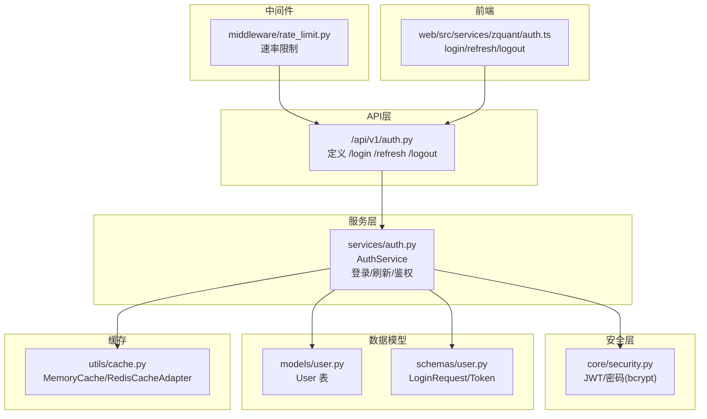
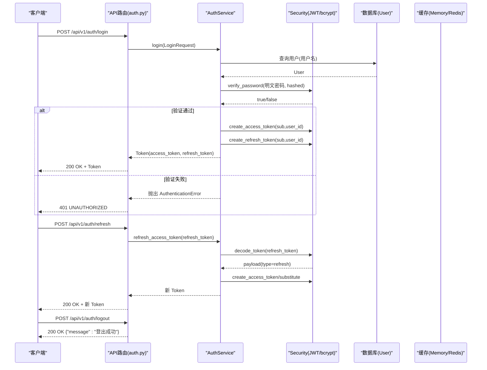
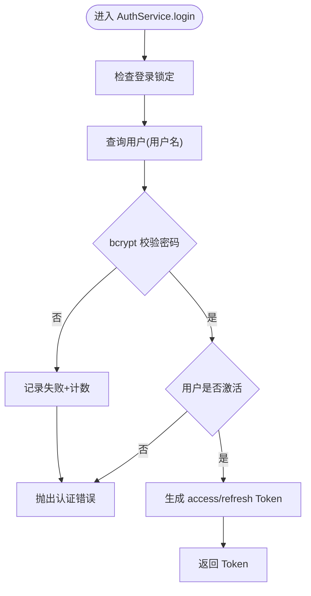
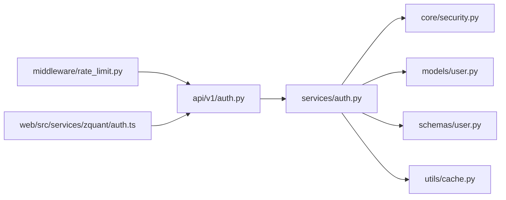

# 认证API

<cite>
**本文引用的文件**
- [zquant/api/v1/auth.py](file://zquant/api/v1/auth.py)
- [zquant/services/auth.py](file://zquant/services/auth.py)
- [zquant/core/security.py](file://zquant/core/security.py)
- [zquant/schemas/user.py](file://zquant/schemas/user.py)
- [zquant/models/user.py](file://zquant/models/user.py)
- [zquant/config.py](file://zquant/config.py)
- [zquant/middleware/rate_limit.py](file://zquant/middleware/rate_limit.py)
- [zquant/utils/cache.py](file://zquant/utils/cache.py)
- [web/src/services/zquant/auth.ts](file://web/src/services/zquant/auth.ts)
- [zquant/tests/test_auth.py](file://zquant/tests/test_auth.py)
- [zquant/tests/unittest/test_auth_service.py](file://zquant/tests/unittest/test_auth_service.py)
- [zquant/tests/unittest/test_security.py](file://zquant/tests/unittest/test_security.py)
</cite>

## 目录
1. [简介](#简介)
2. [项目结构](#项目结构)
3. [核心组件](#核心组件)
4. [架构总览](#架构总览)
5. [详细组件分析](#详细组件分析)
6. [依赖关系分析](#依赖关系分析)
7. [性能考量](#性能考量)
8. [故障排查指南](#故障排查指南)
9. [结论](#结论)
10. [附录](#附录)

## 简介
本文件为 zquant 认证API的权威文档，覆盖以下内容：
- /login、/refresh、/logout 端点的功能、请求参数与响应格式
- JWT 认证机制的实现原理：访问Token与刷新Token的生成与验证流程
- 密码加密存储（bcrypt）与Token过期策略
- 开发者集成认证功能的客户端示例（前端 Umi/React）
- 安全最佳实践：防暴力破解与Token泄露防护

## 项目结构
认证相关代码主要分布在以下模块：
- API 层：路由定义与异常处理
- 服务层：认证业务逻辑、登录失败次数限制、Token黑名单
- 安全层：JWT 编解码、bcrypt 密码校验与哈希
- 模型与Schema：用户模型、登录请求与Token响应模型
- 中间件：速率限制
- 缓存：内存/Redis 缓存抽象与登录锁定、Token黑名单存储
- 前端：认证API调用封装

图表来源
- [zquant/api/v1/auth.py](file://zquant/api/v1/auth.py#L36-L64)
- [zquant/services/auth.py](file://zquant/services/auth.py#L45-L289)
- [zquant/core/security.py](file://zquant/core/security.py#L27-L133)
- [zquant/models/user.py](file://zquant/models/user.py#L74-L113)
- [zquant/schemas/user.py](file://zquant/schemas/user.py#L166-L186)
- [zquant/middleware/rate_limit.py](file://zquant/middleware/rate_limit.py#L40-L203)
- [zquant/utils/cache.py](file://zquant/utils/cache.py#L207-L247)
- [web/src/services/zquant/auth.ts](file://web/src/services/zquant/auth.ts#L24-L65)

章节来源
- [zquant/api/v1/auth.py](file://zquant/api/v1/auth.py#L36-L64)
- [zquant/services/auth.py](file://zquant/services/auth.py#L45-L289)
- [zquant/core/security.py](file://zquant/core/security.py#L27-L133)
- [zquant/schemas/user.py](file://zquant/schemas/user.py#L166-L186)
- [zquant/models/user.py](file://zquant/models/user.py#L74-L113)
- [zquant/middleware/rate_limit.py](file://zquant/middleware/rate_limit.py#L40-L203)
- [zquant/utils/cache.py](file://zquant/utils/cache.py#L207-L247)
- [web/src/services/zquant/auth.ts](file://web/src/services/zquant/auth.ts#L24-L65)

## 核心组件
- API 路由：定义 /api/v1/auth/login、/api/v1/auth/refresh、/api/v1/auth/logout
- AuthService：登录、刷新Token、从Token解析当前用户、登录失败次数限制、Token黑名单
- Security：JWT 编解码、bcrypt 密码哈希与校验、API Key 生成与校验
- Schema：LoginRequest、Token 响应模型
- Model：User 表（含 hashed_password、is_active）
- RateLimitMiddleware：按 IP/用户限流
- Cache：MemoryCache/RedisCacheAdapter，用于登录锁定与Token黑名单

章节来源
- [zquant/api/v1/auth.py](file://zquant/api/v1/auth.py#L36-L64)
- [zquant/services/auth.py](file://zquant/services/auth.py#L45-L289)
- [zquant/core/security.py](file://zquant/core/security.py#L27-L133)
- [zquant/schemas/user.py](file://zquant/schemas/user.py#L166-L186)
- [zquant/models/user.py](file://zquant/models/user.py#L74-L113)
- [zquant/middleware/rate_limit.py](file://zquant/middleware/rate_limit.py#L40-L203)
- [zquant/utils/cache.py](file://zquant/utils/cache.py#L207-L247)

## 架构总览
认证流程概览（登录、刷新、登出）与关键交互如下：

图表来源
- [zquant/api/v1/auth.py](file://zquant/api/v1/auth.py#L36-L64)
- [zquant/services/auth.py](file://zquant/services/auth.py#L200-L249)
- [zquant/core/security.py](file://zquant/core/security.py#L85-L114)
- [zquant/models/user.py](file://zquant/models/user.py#L74-L113)

## 详细组件分析

### API 端点定义与行为
- /login
  - 方法：POST
  - 请求体：LoginRequest（用户名、密码）
  - 响应体：Token（access_token、refresh_token、token_type）
  - 异常：认证失败返回 401
- /refresh
  - 方法：POST
  - 请求体：refresh_token 字符串
  - 响应体：Token（新 access_token、新 refresh_token）
  - 异常：无效/过期/类型错误返回 401
- /logout
  - 方法：POST
  - 行为：客户端删除本地Token即可；服务端无服务端撤销逻辑

章节来源
- [zquant/api/v1/auth.py](file://zquant/api/v1/auth.py#L36-L64)
- [zquant/schemas/user.py](file://zquant/schemas/user.py#L166-L186)

### AuthService：登录、刷新与鉴权
- 登录流程
  - 校验登录锁定状态（缓存键：login_lockout:username）
  - 查询用户并校验密码（bcrypt）
  - 校验用户是否激活
  - 成功后生成 access_token 与 refresh_token
  - 记录登录成功（清除失败计数与锁定）
- 刷新流程
  - 解码 refresh_token，校验类型为 refresh
  - 重新签发 access_token 与 refresh_token
- 当前用户解析
  - 黑名单检查（基于 token 的 sha256 哈希）
  - 解码 access_token，校验类型为 access
  - 查询用户并校验是否激活

图表来源
- [zquant/services/auth.py](file://zquant/services/auth.py#L164-L227)

章节来源
- [zquant/services/auth.py](file://zquant/services/auth.py#L69-L161)
- [zquant/services/auth.py](file://zquant/services/auth.py#L200-L249)
- [zquant/services/auth.py](file://zquant/services/auth.py#L250-L289)

### JWT 与密码安全
- JWT
  - 访问Token：带 exp 与 type=access
  - 刷新Token：带 exp 与 type=refresh
  - 算法：HS256，密钥来自配置
- 密码
  - bcrypt 上下文，提供 get_password_hash 与 verify_password
  - 密码强度校验（长度、大小写、数字、特殊字符）
- API Key
  - 生成 access_key/secret_key，secret_key 存储前进行哈希

章节来源
- [zquant/core/security.py](file://zquant/core/security.py#L27-L133)
- [zquant/config.py](file://zquant/config.py#L73-L78)

### 数据模型与Schema
- User 模型
  - 字段：id、username、email、hashed_password、role_id、is_active
- LoginRequest
  - 字段：username、password
- Token
  - 字段：access_token、refresh_token、token_type

章节来源
- [zquant/models/user.py](file://zquant/models/user.py#L74-L113)
- [zquant/schemas/user.py](file://zquant/schemas/user.py#L166-L186)

### 速率限制中间件
- 限流维度：优先使用用户ID，否则使用客户端IP
- 窗口：分钟/小时双维度计数
- 跳过路径：/health、/docs、/redoc、/openapi.json
- 触发限流时返回 429 并附带速率限制响应头

章节来源
- [zquant/middleware/rate_limit.py](file://zquant/middleware/rate_limit.py#L40-L203)

### 缓存与黑名单
- 缓存后端：MemoryCache 或 RedisCacheAdapter（按配置选择）
- 登录锁定：失败次数与锁定到期时间 TTL
- Token 黑名单：以 token 的 sha256 哈希作为键，值为占位，TTL 为过期秒数

章节来源
- [zquant/utils/cache.py](file://zquant/utils/cache.py#L207-L247)
- [zquant/services/auth.py](file://zquant/services/auth.py#L128-L161)

### 前端集成示例
- 登录：POST /api/v1/auth/login
- 刷新：POST /api/v1/auth/refresh
- 登出：POST /api/v1/auth/logout
- 前端封装位于 web/src/services/zquant/auth.ts

章节来源
- [web/src/services/zquant/auth.ts](file://web/src/services/zquant/auth.ts#L24-L65)

## 依赖关系分析
认证相关模块之间的依赖关系如下：

图表来源
- [zquant/api/v1/auth.py](file://zquant/api/v1/auth.py#L36-L64)
- [zquant/services/auth.py](file://zquant/services/auth.py#L45-L289)
- [zquant/core/security.py](file://zquant/core/security.py#L27-L133)
- [zquant/models/user.py](file://zquant/models/user.py#L74-L113)
- [zquant/schemas/user.py](file://zquant/schemas/user.py#L166-L186)
- [zquant/utils/cache.py](file://zquant/utils/cache.py#L207-L247)
- [zquant/middleware/rate_limit.py](file://zquant/middleware/rate_limit.py#L40-L203)
- [web/src/services/zquant/auth.ts](file://web/src/services/zquant/auth.ts#L24-L65)

## 性能考量
- Token 过期策略
  - 访问Token：默认 24 小时过期
  - 刷新Token：默认 7 天过期
- 缓存命中
  - 登录锁定与黑名单均使用缓存，建议生产环境使用 Redis 以提升横向扩展能力
- 速率限制
  - 默认每分钟 60 次、每小时 1000 次，可根据业务调整
- 密码哈希
  - bcrypt 为 CPU 密集型，登录时仅做一次哈希校验，避免额外开销

章节来源
- [zquant/config.py](file://zquant/config.py#L73-L78)
- [zquant/middleware/rate_limit.py](file://zquant/middleware/rate_limit.py#L40-L203)
- [zquant/utils/cache.py](file://zquant/utils/cache.py#L207-L247)

## 故障排查指南
- 401 未授权
  - /login：用户名或密码错误
  - /refresh：无效/过期/类型错误
  - 当前用户解析：Token 已失效/无效/类型错误/用户不存在/禁用
- 登录被锁定
  - 失败次数达到上限后账户被锁定，需等待锁定时间到期或清除缓存
- 429 太多请求
  - 速率限制触发，检查限流配置与客户端重试策略
- 前端调用
  - 使用 web/src/services/zquant/auth.ts 的 login/refresh/logout 封装
  - 登出后客户端需删除本地 Token

章节来源
- [zquant/api/v1/auth.py](file://zquant/api/v1/auth.py#L36-L64)
- [zquant/services/auth.py](file://zquant/services/auth.py#L164-L289)
- [zquant/middleware/rate_limit.py](file://zquant/middleware/rate_limit.py#L146-L203)
- [web/src/services/zquant/auth.ts](file://web/src/services/zquant/auth.ts#L24-L65)

## 结论
zquant 的认证体系采用标准 JWT 流程，结合 bcrypt 密码校验与缓存实现登录锁定与 Token 黑名单，辅以速率限制中间件提升安全性与稳定性。/login、/refresh、/logout 三个端点清晰明确，便于前后端集成与二次开发。

## 附录

### 端点定义与参数说明
- /api/v1/auth/login
  - 方法：POST
  - 请求体：LoginRequest
    - username: string（必填）
    - password: string（必填）
  - 响应体：Token
    - access_token: string
    - refresh_token: string
    - token_type: string（默认 bearer）
- /api/v1/auth/refresh
  - 方法：POST
  - 请求体：JSON
    - refresh_token: string（必填）
  - 响应体：Token（同上）
- /api/v1/auth/logout
  - 方法：POST
  - 响应体：JSON
    - message: string（例如“登出成功”）

章节来源
- [zquant/api/v1/auth.py](file://zquant/api/v1/auth.py#L36-L64)
- [zquant/schemas/user.py](file://zquant/schemas/user.py#L166-L186)

### JWT 与密码策略
- 访问Token过期：24 小时
- 刷新Token过期：7 天
- 算法：HS256
- 密码强度：长度 8-128，包含大小写字母、数字与特殊字符
- 密码存储：bcrypt 哈希

章节来源
- [zquant/config.py](file://zquant/config.py#L73-L78)
- [zquant/core/security.py](file://zquant/core/security.py#L49-L83)

### 安全最佳实践
- 防暴力破解
  - 登录失败次数限制与锁定时间
  - 速率限制中间件
- 防止 Token 泄露
  - 仅在 HTTPS 下传输
  - 客户端妥善保存 Token，避免持久化到本地存储
  - 登出时删除本地 Token
  - 刷新 Token 仅在服务端使用，不暴露给前端
- Token 黑名单
  - 服务端未提供主动撤销接口，但可将 Token 哈希加入黑名单并在解析时拦截
- 密钥管理
  - SECRET_KEY 与 ENCRYPTION_KEY 必须妥善保管，定期轮换

章节来源
- [zquant/services/auth.py](file://zquant/services/auth.py#L69-L161)
- [zquant/middleware/rate_limit.py](file://zquant/middleware/rate_limit.py#L40-L203)
- [zquant/utils/cache.py](file://zquant/utils/cache.py#L207-L247)

### 客户端集成要点（前端）
- 使用 web/src/services/zquant/auth.ts 的 login/refresh/logout 方法
- 登录成功后保存 access_token 与 refresh_token
- 请求受保护接口时携带 Authorization: Bearer {access_token}
- 刷新 Token 时使用 refresh_token 发起 /api/v1/auth/refresh
- 登出时删除本地 Token

章节来源
- [web/src/services/zquant/auth.ts](file://web/src/services/zquant/auth.ts#L24-L65)

### 示例调用（路径参考）
- 登录：POST /api/v1/auth/login
- 刷新：POST /api/v1/auth/refresh
- 登出：POST /api/v1/auth/logout

章节来源
- [zquant/api/v1/auth.py](file://zquant/api/v1/auth.py#L36-L64)