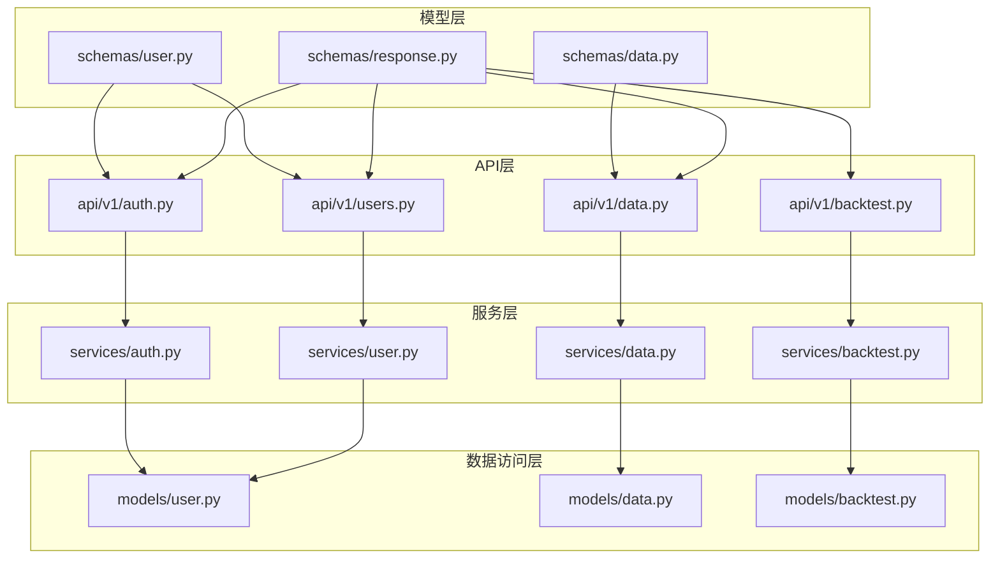
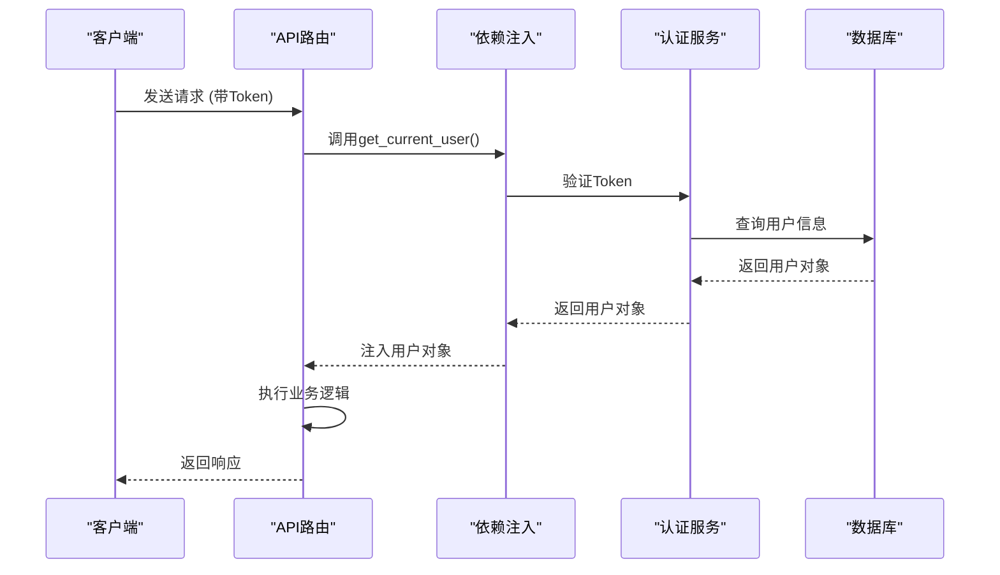
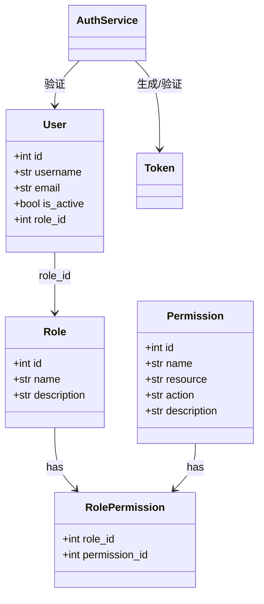

# 后端架构

<cite>
**本文档引用文件**   
- [main.py](file://zquant/main.py)
- [config.py](file://zquant/config.py)
- [database.py](file://zquant/database.py)
- [api/deps.py](file://zquant/api/deps.py)
- [schemas/user.py](file://zquant/schemas/user.py)
- [services/auth.py](file://zquant/services/auth.py)
- [api/v1/auth.py](file://zquant/api/v1/auth.py)
- [models/user.py](file://zquant/models/user.py)
- [core/security.py](file://zquant/core/security.py)
- [schemas/response.py](file://zquant/schemas/response.py)
</cite>

## 目录
1. [项目结构](#项目结构)
2. [分层架构设计](#分层架构设计)
3. [依赖注入机制](#依赖注入机制)
4. [Pydantic模型与数据验证](#pydantic模型与数据验证)
5. [JWT认证与权限控制](#jwt认证与权限控制)
6. [ORM映射关系](#orm映射关系)
7. [开发范式指导](#开发范式指导)

## 项目结构

zquant后端项目采用清晰的分层架构，主要目录结构如下：
- `zquant/api/v1/`: API路由层，包含各个功能模块的路由定义
- `zquant/services/`: 服务层，处理核心业务逻辑
- `zquant/models/`: 数据访问层，定义SQLAlchemy ORM模型
- `zquant/schemas/`: Pydantic模型，用于请求/响应数据验证
- `zquant/database.py`: 数据库连接和会话管理
- `zquant/config.py`: 配置管理
- `zquant/core/`: 核心功能模块，包括安全、权限、异常处理等



**图示来源**
- [main.py](file://zquant/main.py#L217-L231)
- [api/v1/auth.py](file://zquant/api/v1/auth.py#L36)
- [services/auth.py](file://zquant/services/auth.py#L45)
- [models/user.py](file://zquant/models/user.py#L74)
- [schemas/user.py](file://zquant/schemas/user.py#L33)

## 分层架构设计

zquant后端采用标准的三层架构设计，各层职责分明：

### API路由层
位于`api/v1/`目录下，负责请求分发和HTTP接口定义。每个模块（如auth、users、data等）都有独立的路由文件，通过FastAPI的APIRouter进行管理。在`main.py`中通过`include_router`方法将各路由注册到应用中。

### 服务层
位于`services/`目录下，处理核心业务逻辑。每个服务类封装了特定领域的业务操作，如用户管理、认证、数据处理等。服务层不直接处理HTTP请求，而是提供可重用的业务方法。

### 数据访问层
位于`models/`目录下，使用SQLAlchemy ORM定义数据库模型。每个模型类对应数据库中的一张表，通过声明式基类`Base`进行管理。数据访问层提供了与数据库交互的接口，但不包含业务逻辑。

**代码来源**
- [main.py](file://zquant/main.py#L217-L231)
- [services/auth.py](file://zquant/services/auth.py#L45)
- [models/user.py](file://zquant/models/user.py#L74)

## 依赖注入机制

zquant后端广泛使用FastAPI的依赖注入系统（Depends），实现了松耦合和可测试性。

### 数据库会话管理
通过`database.py`中的`get_db()`函数实现数据库会话的依赖注入。该函数使用生成器模式，确保每个请求都有独立的数据库会话，并在请求结束时自动关闭。

```python
def get_db() -> Generator[Session, None, None]:
    db = SessionLocal()
    try:
        yield db
    except Exception as e:
        db.rollback()
        raise
    finally:
        db.close()
```

### 认证依赖
在`api/deps.py`中定义了认证相关的依赖函数：
- `get_current_user`: 从JWT Token中解析当前用户
- `get_current_active_user`: 确保用户处于激活状态
- `get_api_key_user`: 通过API密钥进行认证

这些依赖函数可以在路由中通过`Depends()`直接使用，实现了认证逻辑的复用。



**图示来源**
- [database.py](file://zquant/database.py#L84-L109)
- [api/deps.py](file://zquant/api/deps.py#L41-L68)
- [services/auth.py](file://zquant/services/auth.py#L251)

## Pydantic模型与数据验证

Pydantic模型在zquant后端中扮演着重要角色，主要用于请求/响应数据验证和配置管理。

### 请求/响应数据验证
在`schemas/`目录下定义了各种Pydantic模型，用于验证API请求和响应数据。例如，用户登录请求使用`LoginRequest`模型：

```python
class LoginRequest(BaseModel):
    username: str = Field(..., description="用户名")
    password: str = Field(..., description="密码")
```

这些模型通过`response_model`参数在路由中使用，确保API返回的数据格式统一。

### 统一响应格式
通过`schemas/response.py`中的`BaseResponse`、`SuccessResponse`和`ErrorResponse`模型，实现了统一的API响应格式：

```python
class BaseResponse(BaseModel, Generic[T]):
    success: bool = Field(..., description="操作是否成功")
    message: str = Field(..., description="响应消息")
    data: T | None = Field(None, description="响应数据")
    code: int = Field(200, description="响应状态码")
```

### 配置管理
`config.py`中的`Settings`类继承自`BaseSettings`，实现了配置的自动加载和验证。配置优先级为：环境变量 > .env文件 > 默认值。

**代码来源**
- [schemas/user.py](file://zquant/schemas/user.py#L181-L186)
- [schemas/response.py](file://zquant/schemas/response.py#L36-L47)
- [config.py](file://zquant/config.py#L32)

## JWT认证与权限控制

zquant后端实现了完整的JWT认证流程和基于角色的权限控制体系。

### JWT认证流程
1. 用户通过`/api/v1/auth/login`端点提交用户名和密码
2. 系统验证凭证，生成访问Token和刷新Token
3. 客户端在后续请求的Authorization头中携带Token
4. 服务端通过`get_current_user`依赖验证Token并获取用户信息

### 认证服务
`services/auth.py`中的`AuthService`类提供了完整的认证功能：
- 密码加密和验证（使用bcrypt）
- Token的创建和验证（使用JWT）
- 登录失败次数限制和账户锁定
- Token黑名单管理

### 权限控制
通过`core/permissions.py`中的`check_permission`装饰器实现权限控制。系统采用基于角色的访问控制（RBAC）模型，用户、角色和权限之间的关系通过数据库表进行管理。



**图示来源**
- [services/auth.py](file://zquant/services/auth.py#L45)
- [models/user.py](file://zquant/models/user.py#L74)
- [core/security.py](file://zquant/core/security.py#L35)
- [api/v1/auth.py](file://zquant/api/v1/auth.py#L39)

## ORM映射关系

zquant后端使用SQLAlchemy ORM进行数据库操作，`models/`目录下的模型类定义了与数据库表的映射关系。

### 用户相关模型
`models/user.py`中定义了用户管理相关的模型：
- `User`: 用户表，存储用户基本信息
- `Role`: 角色表，定义系统角色
- `Permission`: 权限表，定义系统权限
- `RolePermission`: 角色权限关联表，实现多对多关系
- `APIKey`: API密钥表，用于API访问认证

### 数据相关模型
`models/data.py`中定义了数据相关的模型，包括：
- `Tustock`: 股票基础信息表
- `Fundamental`: 财务数据表
- `TustockTradecal`: 交易日历表
- 动态创建的分表模型（如日线数据、每日指标等）

### 表命名规范
zquant遵循统一的表命名规范：
- 应用表：`zq_app_*` (如 zq_app_users)
- 数据表：`zq_data_*` (如 zq_data_tustock_stockbasic)
- 回测表：`zq_backtest_*` (如 zq_backtest_tasks)
- 任务表：`zq_task_*` (如 zq_task_scheduled_tasks)

**代码来源**
- [models/user.py](file://zquant/models/user.py#L34-L112)
- [models/data.py](file://zquant/models/data.py#L61-L800)
- [database.py](file://zquant/database.py#L81)

## 开发范式指导

### 添加新API端点
1. 在`api/v1/`目录下创建新的路由文件（如`new_module.py`）
2. 定义APIRouter实例
3. 在`main.py`中导入并注册新路由

```python
# 在main.py中
from zquant.api.v1 import new_module
app.include_router(new_module.router, prefix="/api/v1/new_module", tags=["新模块"])
```

### 扩展业务服务
1. 在`services/`目录下创建新的服务文件
2. 定义服务类，封装业务逻辑
3. 在API路由中注入并使用服务

```python
# 在API路由中
from zquant.services.new_service import NewService

@router.get("/items")
def get_items(db: Session = Depends(get_db)):
    return NewService.get_items(db)
```

### 数据模型变更
1. 修改`models/`目录下的相应模型类
2. 使用Alembic生成迁移脚本
3. 应用迁移到数据库

```bash
alembic revision --autogenerate -m "描述变更"
alembic upgrade head
```

**代码来源**
- [main.py](file://zquant/main.py#L217-L231)
- [api/v1/auth.py](file://zquant/api/v1/auth.py#L36)
- [services/auth.py](file://zquant/services/auth.py#L45)
- [models/user.py](file://zquant/models/user.py#L74)
- [database.py](file://zquant/database.py#L40)