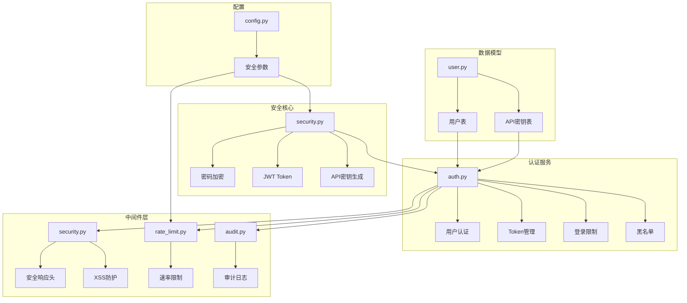
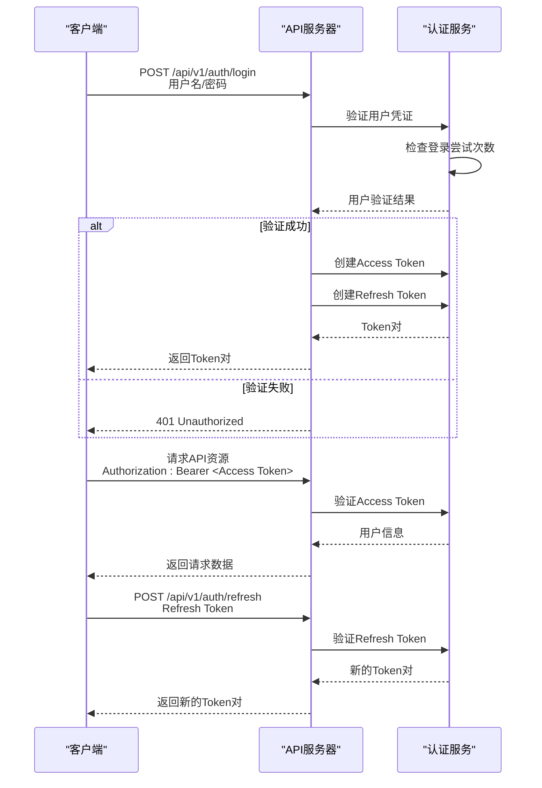
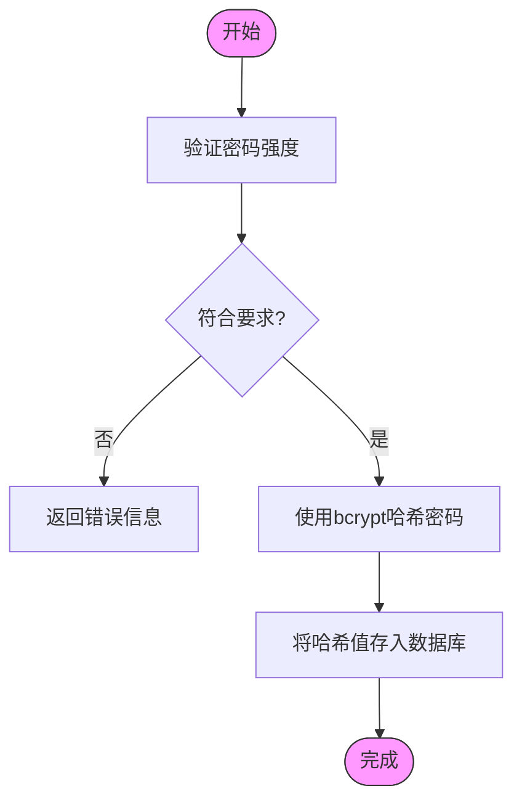
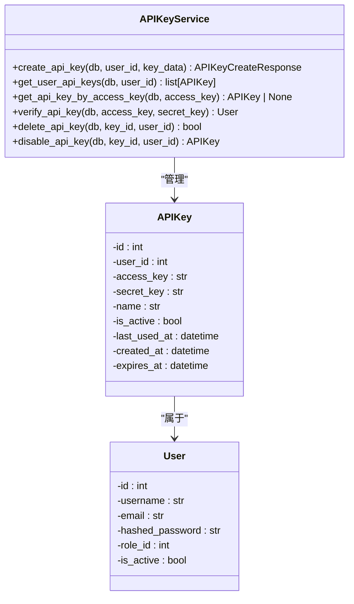
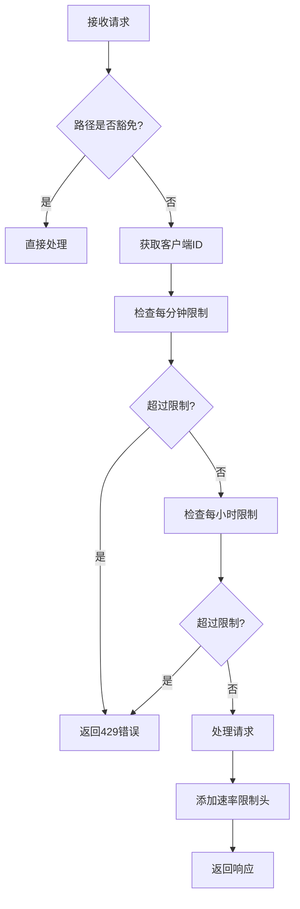
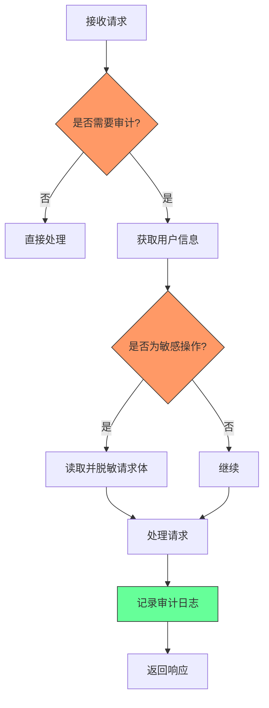

# 安全机制

<cite>
**本文档引用的文件**
- [security.py](file://zquant/core/security.py)
- [auth.py](file://zquant/services/auth.py)
- [auth.py](file://zquant/api/v1/auth.py)
- [deps.py](file://zquant/api/deps.py)
- [security.py](file://zquant/middleware/security.py)
- [rate_limit.py](file://zquant/middleware/rate_limit.py)
- [audit.py](file://zquant/middleware/audit.py)
- [apikey.py](file://zquant/services/apikey.py)
- [user.py](file://zquant/models/user.py)
- [config.py](file://zquant/config.py)
- [encryption.py](file://zquant/utils/encryption.py)
- [validators.py](file://zquant/utils/validators.py)
- [cache.py](file://zquant/utils/cache.py)
</cite>

## 目录
1. [引言](#引言)
2. [安全架构概述](#安全架构概述)
3. [认证与授权机制](#认证与授权机制)
4. [密码安全与加密](#密码安全与加密)
5. [API密钥管理](#api密钥管理)
6. [中间件层安全防护](#中间件层安全防护)
7. [审计日志与操作追踪](#审计日志与操作追踪)
8. [会话与Token管理](#会话与token管理)
9. [配置与使用方法](#配置与使用方法)
10. [常见安全威胁防护](#常见安全威胁防护)

## 引言
zquant平台构建了一套全面的安全机制，旨在保护用户数据、防止未授权访问并确保系统的稳定运行。本文档详细阐述了平台的安全架构，包括JWT认证流程、密码加密算法（bcrypt）、API密钥管理等核心安全功能。同时，文档还深入解析了中间件层的安全防护措施，如速率限制、输入验证、XSS防护等，并解释了审计日志的实现机制和敏感操作的追踪策略。通过本文档，开发者和管理员可以全面了解zquant平台的安全设计，确保系统在生产环境中的安全可靠。

## 安全架构概述
zquant平台的安全架构采用分层设计，从数据加密、用户认证、API访问控制到审计追踪，构建了多维度的安全防护体系。系统核心安全功能由`zquant/core/security.py`模块提供，包括密码哈希、JWT Token生成与验证等基础服务。认证服务`zquant/services/auth.py`实现了完整的用户登录、Token管理和会话控制逻辑。中间件层通过`zquant/middleware`目录下的多个模块，提供了速率限制、XSS防护、安全响应头等运行时保护。此外，系统还通过审计日志中间件记录所有敏感操作，确保所有行为可追溯。



**图源**
- [security.py](file://zquant/core/security.py)
- [auth.py](file://zquant/services/auth.py)
- [security.py](file://zquant/middleware/security.py)
- [rate_limit.py](file://zquant/middleware/rate_limit.py)
- [audit.py](file://zquant/middleware/audit.py)
- [user.py](file://zquant/models/user.py)
- [config.py](file://zquant/config.py)

## 认证与授权机制

zquant平台采用基于JWT（JSON Web Token）的认证机制，结合OAuth 2.0的Bearer Token模式，实现安全的用户身份验证和授权。当用户成功登录后，系统会生成一对访问Token（Access Token）和刷新Token（Refresh Token），客户端使用访问Token来访问受保护的API资源。

### JWT认证流程
JWT认证流程是zquant平台的核心安全机制。系统使用`HS256`算法对Token进行签名，确保其完整性和防篡改性。访问Token的有效期默认为24小时（可配置），而刷新Token的有效期为7天。这种双Token机制既保证了安全性，又提升了用户体验，避免用户频繁登录。



**图源**
- [auth.py](file://zquant/services/auth.py)
- [auth.py](file://zquant/api/v1/auth.py)
- [deps.py](file://zquant/api/deps.py)

### 登录失败次数限制
为防止暴力破解攻击，zquant平台实现了登录失败次数限制机制。系统使用Redis或内存缓存来跟踪用户的登录尝试次数。当用户连续5次登录失败后，账户将被锁定15分钟。此机制通过`AuthService`类中的`_check_login_lockout`和`_record_login_attempt`方法实现，有效保护了用户账户安全。

**节源**
- [auth.py](file://zquant/services/auth.py#L55-L126)

## 密码安全与加密

### 密码强度验证与哈希
zquant平台对用户密码实施严格的安全策略。系统在用户注册和修改密码时，会通过`validate_password_strength`函数验证密码强度，要求密码必须满足以下条件：
- 长度至少8位，不超过128位
- 必须包含至少一个大写字母
- 必须包含至少一个小写字母
- 必须包含至少一个数字
- 必须包含至少一个特殊字符（!@#$%^&*()_+-=[]{}|;:,.<>?）

密码存储采用业界标准的bcrypt算法进行哈希处理，通过`get_password_hash`函数实现。bcrypt是一种自适应的哈希算法，具有盐值（salt）和成本因子（cost factor），能有效抵御彩虹表攻击和暴力破解。



**图源**
- [security.py](file://zquant/core/security.py#L49-L82)

### 敏感数据加密
对于需要存储的敏感数据（如API密钥的secret部分），zquant平台使用Fernet对称加密算法进行加密。`zquant/utils/encryption.py`模块提供了`encrypt_value`和`decrypt_value`函数，使用从`ENCRYPTION_KEY`配置项派生的密钥对数据进行加密解密。该机制确保即使数据库被泄露，攻击者也无法直接获取敏感信息。

**节源**
- [encryption.py](file://zquant/utils/encryption.py)

## API密钥管理

### API密钥生成与验证
API密钥是zquant平台为程序化访问提供的安全凭证。系统通过`APIKeyService`类管理API密钥的全生命周期。当用户创建API密钥时，系统会生成一对密钥：`access_key`（32字节）和`secret_key`（64字节）。`access_key`用于标识请求，而`secret_key`用于身份验证，且仅在创建时显示一次。



**图源**
- [apikey.py](file://zquant/services/apikey.py)
- [user.py](file://zquant/models/user.py)

### API密钥验证流程
API密钥的验证通过HTTP请求头`X-API-Key`和`X-API-Secret`传递。`get_api_key_user`依赖注入函数会调用`APIKeyService.verify_api_key`方法进行验证，该方法会检查密钥的有效性、是否被禁用以及是否过期。验证通过后，系统会更新密钥的最后使用时间，并返回对应的用户对象。

**节源**
- [apikey.py](file://zquant/services/apikey.py#L89-L116)
- [deps.py](file://zquant/api/deps.py#L77-L92)

## 中间件层安全防护

### 速率限制
为防止API被滥用或遭受DDoS攻击，zquant平台实现了基于IP地址和用户ID的速率限制中间件。`RateLimitMiddleware`会根据客户端标识（已认证用户使用user_id，未认证用户使用IP地址）跟踪其请求频率。系统默认限制每分钟60次请求和每小时1000次请求，并通过`X-RateLimit-*`响应头告知客户端剩余请求数。



**图源**
- [rate_limit.py](file://zquant/middleware/rate_limit.py)

### 输入验证与XSS防护
zquant平台在多个层面实施输入验证和XSS防护。`zquant/utils/validators.py`模块提供了针对股票代码、日期格式、数值范围等的专用验证器。同时，`XSSProtectionMiddleware`中间件会扫描请求参数中的潜在XSS攻击模式（如`<script>`标签、`javascript:`协议等），并在日志中记录可疑请求。

**节源**
- [validators.py](file://zquant/utils/validators.py)
- [security.py](file://zquant/middleware/security.py#L63-L145)

### 安全响应头
安全中间件自动为所有响应添加关键的安全HTTP头，增强客户端的安全性：
- `X-Content-Type-Options: nosniff`：防止MIME类型嗅探攻击
- `X-Frame-Options: DENY`：防止点击劫持攻击
- `X-XSS-Protection: 1; mode=block`：启用浏览器XSS过滤器
- `Referrer-Policy: strict-origin-when-cross-origin`：控制Referer信息泄露
- `Strict-Transport-Security`：强制使用HTTPS（当使用HTTPS时）

**节源**
- [security.py](file://zquant/middleware/security.py#L49-L58)

## 审计日志与操作追踪

### 审计日志实现
zquant平台通过`AuditMiddleware`中间件实现全面的审计日志功能。该中间件会记录所有敏感操作，包括用户登录、数据修改、删除等。系统会记录操作的HTTP方法、路径、状态码、用户信息、客户端IP以及请求体（对敏感字段如密码进行脱敏处理）。



**图源**
- [audit.py](file://zquant/middleware/audit.py)

### 敏感操作追踪
系统将`/api/v1/users`、`/api/v1/backtest`、`/api/v1/scheduler`等路径标记为敏感操作路径。对这些路径的POST、PUT、PATCH、DELETE请求会被记录为敏感操作日志，便于安全审计和问题追踪。日志级别根据操作结果动态调整：成功操作记录为INFO，失败操作记录为WARNING。

**节源**
- [audit.py](file://zquant/middleware/audit.py#L47-L61)

## 会话与Token管理

### Token黑名单机制
为实现用户登出和Token吊销功能，zquant平台实现了Token黑名单机制。当用户登出或管理员禁用用户时，系统会调用`add_token_to_blacklist`方法，将Token的SHA256哈希值存入Redis缓存，并设置与Token剩余有效期相同的过期时间。后续请求在验证Token时，会先检查其是否在黑名单中。

```mermaid
classDiagram
class AuthService {
-_is_token_blacklisted(token) bool
+add_token_to_blacklist(token, expires_in) None
+get_current_user_from_token(token, db) User
}
class CacheInterface {
+get(key) str | None
+set(key, value, ex) bool
+delete(key) bool
+exists(key) bool
}
AuthService --> CacheInterface : "使用"
note right of AuthService
Token黑名单键格式：<br/>
token_blacklist : {token_hash}
end
```

**图源**
- [auth.py](file://zquant/services/auth.py#L128-L162)

### 会话管理
zquant平台的会话管理完全基于无状态的JWT Token。服务器不存储会话状态，所有会话信息都包含在Token的payload中。Token中包含`sub`（用户名）、`user_id`、`exp`（过期时间）和`type`（Token类型）等声明。系统通过刷新Token机制延长用户会话，同时通过黑名单机制实现会话的主动终止。

**节源**
- [security.py](file://zquant/core/security.py#L85-L104)
- [auth.py](file://zquant/services/auth.py#L230-L248)

## 配置与使用方法

### 安全配置
zquant平台的安全行为主要通过`zquant/config.py`文件中的配置项控制。关键安全配置包括：
- `SECRET_KEY`: JWT签名密钥，生产环境必须更改
- `ACCESS_TOKEN_EXPIRE_MINUTES`: 访问Token有效期
- `REFRESH_TOKEN_EXPIRE_DAYS`: 刷新Token有效期
- `RATE_LIMIT_ENABLED`: 是否启用速率限制
- `ENCRYPTION_KEY`: 敏感数据加密密钥

```python
# 示例：config.py中的安全配置
class Settings(BaseSettings):
    # JWT配置
    SECRET_KEY: str = "your-secret-key-change-this-in-production"
    ALGORITHM: str = "HS256"
    ACCESS_TOKEN_EXPIRE_MINUTES: int = 1440  # 24小时
    REFRESH_TOKEN_EXPIRE_DAYS: int = 7
    
    # 加密配置
    ENCRYPTION_KEY: str | None = None
```

**节源**
- [config.py](file://zquant/config.py#L73-L83)

### API使用示例
以下是使用API密钥访问受保护API的示例：

```bash
# 使用curl调用API
curl -X GET "http://localhost:8000/api/v1/data/daily" \
  -H "X-API-Key: your_access_key" \
  -H "X-API-Secret: your_secret_key" \
  -H "Content-Type: application/json"
```

## 常见安全威胁防护

### 防御暴力破解
通过登录失败次数限制和账户锁定机制，有效防御暴力破解攻击。系统在5次失败尝试后锁定账户15分钟，大大增加了攻击成本。

### 防御重放攻击
JWT Token的短期有效期和刷新机制，结合黑名单，有效防止了Token被截获后的重放攻击。

### 防御XSS攻击
通过输入验证、输出编码（前端）和安全响应头的多重防护，降低XSS攻击风险。

### 防御CSRF攻击
虽然API主要使用Token认证，但系统通过CORS策略和安全响应头，为可能的Web界面提供CSRF防护。

### 防御DDoS攻击
速率限制中间件可以有效缓解API层面的DDoS攻击，保护后端服务的稳定性。