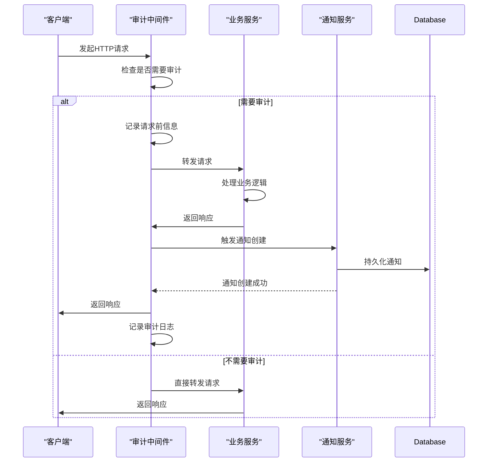
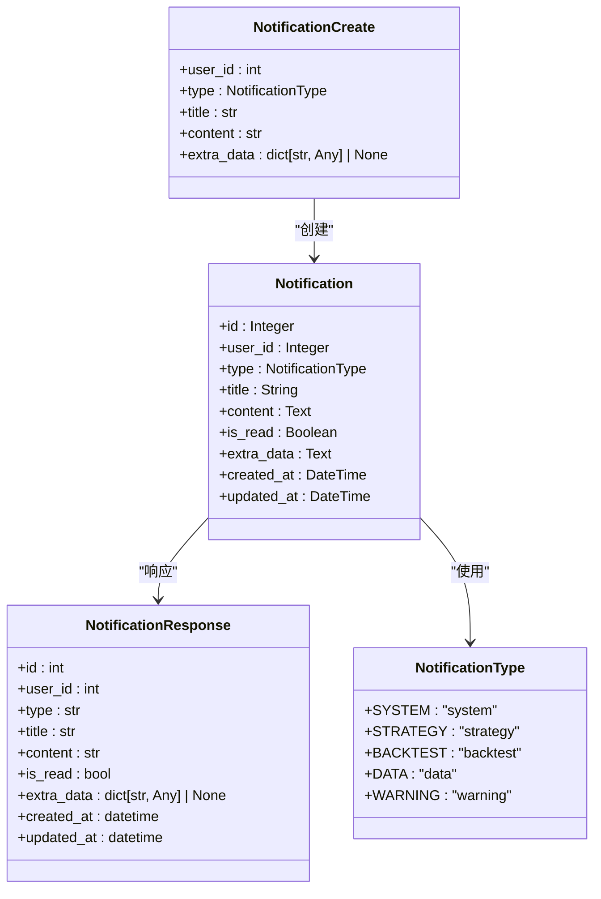
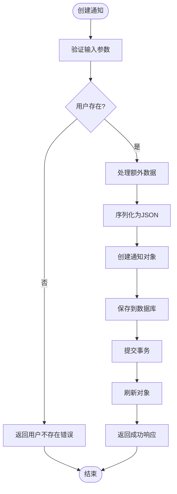
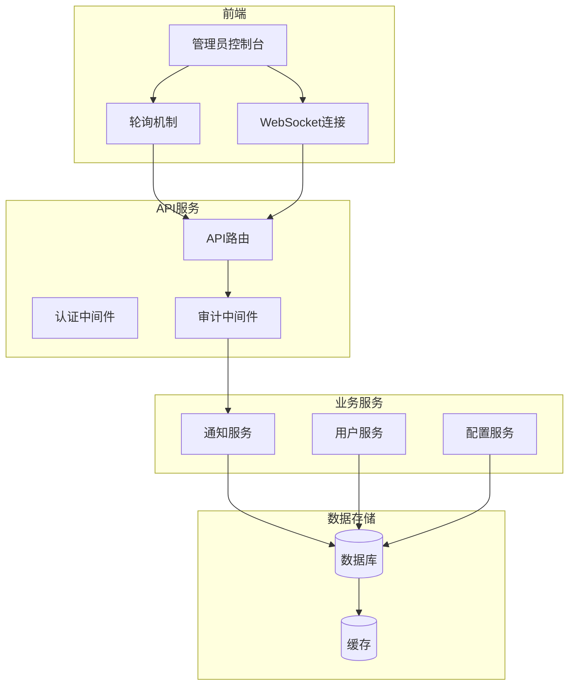

# 审计事件通知集成

<cite>
**本文档引用的文件**   
- [audit.py](file://zquant/middleware/audit.py)
- [notification.py](file://zquant/services/notification.py)
- [notifications.py](file://zquant/api/v1/notifications.py)
- [notification.py](file://zquant/models/notification.py)
- [notification.py](file://zquant/schemas/notification.py)
- [main.py](file://zquant/main.py)
- [notifications.ts](file://web/src/services/zquant/notifications.ts)
</cite>

## 目录
1. [引言](#引言)
2. [审计事件触发机制](#审计事件触发机制)
3. [通知数据模型](#通知数据模型)
4. [通知服务实现](#通知服务实现)
5. [实时告警机制](#实时告警机制)
6. [敏感操作配置](#敏感操作配置)
7. [系统架构图](#系统架构图)

## 引言
审计事件通知集成是ZQuant量化分析平台的重要安全特性，旨在通过通知服务（NotificationService）将关键审计事件（如管理员登录、用户删除、系统配置修改）推送给系统管理员。本系统通过审计中间件监控敏感操作，当检测到关键事件时，自动触发通知服务，将安全告警信息持久化到数据库，并通过前端轮询或WebSocket机制实现实时告警。该机制增强了系统的安全性和可追溯性，确保管理员能够及时响应潜在的安全威胁。

## 审计事件触发机制
审计事件的触发机制基于中间件层的请求拦截和分析。系统通过`AuditMiddleware`类实现审计功能，该中间件在请求处理流程中检查每个HTTP请求，判断是否需要进行审计记录。

审计中间件定义了需要监控的HTTP方法（POST、PUT、PATCH、DELETE）和路径模式，包括用户管理、回测、调度器等关键API端点。当请求匹配这些条件时，中间件会记录详细的审计日志，包括请求方法、路径、状态码、用户信息、客户端主机等。

对于敏感操作（如用户管理、回测、调度器操作），系统会记录请求体内容（经过脱敏处理），并在操作成功时记录为INFO级别日志，操作失败时记录为WARNING级别日志。这种机制确保了所有关键操作都有完整的审计追踪，为后续的安全分析和问题排查提供了基础数据。

**Diagram sources**
- [audit.py](file://zquant/middleware/audit.py#L43-L159)

**Section sources**
- [audit.py](file://zquant/middleware/audit.py#L43-L159)

## 通知数据模型
通知系统的核心是`Notification`数据模型，它定义了通知的结构和属性。该模型包含以下关键字段：用户ID（user_id）、通知类型（type）、标题（title）、内容（content）、已读状态（is_read）、额外数据（extra_data）以及创建和更新时间戳。

通知类型通过`NotificationType`枚举类定义，包括系统通知（SYSTEM）、策略相关（STRATEGY）、回测相关（BACKTEST）、数据相关（DATA）和警告（WARNING）等类别。这种分类机制使得通知可以根据其重要性和来源进行区分，便于管理员优先处理关键告警。

额外数据字段（extra_data）允许存储JSON格式的附加信息，为通知提供了扩展能力。例如，在系统配置修改的通知中，可以包含修改前后的配置值；在用户删除操作中，可以包含被删除用户的详细信息。这种设计增强了通知的上下文信息，帮助管理员快速理解事件的完整情况。

**Diagram sources**
- [notification.py](file://zquant/models/notification.py#L37-L70)
- [notification.py](file://zquant/schemas/notification.py#L36-L112)

**Section sources**
- [notification.py](file://zquant/models/notification.py#L37-L70)
- [notification.py](file://zquant/schemas/notification.py#L36-L112)

## 通知服务实现
通知服务的核心是`NotificationService`类，它提供了创建、查询、更新和删除通知的完整功能。服务的入口点是`create_notification`方法，该方法接收`NotificationCreate`数据模型作为参数，验证用户存在性后将通知持久化到数据库。

创建通知时，服务会处理额外数据字段，将其序列化为JSON字符串存储。通知创建成功后，会返回包含完整信息的`NotificationResponse`模型。服务还提供了分页查询功能，支持按已读状态、通知类型等条件筛选，以及按创建时间或更新时间排序。

通知服务与API层通过`notifications.py`文件中的路由定义进行集成。系统管理员或系统本身可以通过POST请求创建通知，其他用户可以通过GET请求获取自己的通知列表。权限控制通过`@check_permission`装饰器实现，确保只有授权用户才能创建通知。

**Diagram sources**
- [notification.py](file://zquant/services/notification.py#L41-L164)
- [notifications.py](file://zquant/api/v1/notifications.py#L120-L129)

**Section sources**
- [notification.py](file://zquant/services/notification.py#L41-L164)
- [notifications.py](file://zquant/api/v1/notifications.py#L120-L129)

## 实时告警机制
实时告警机制通过前端轮询和WebSocket两种方式实现，确保管理员能够及时收到关键审计事件的通知。前端通过`notifications.ts`文件中的API客户端定期调用`getNotificationStats`接口获取未读通知统计，当未读数量发生变化时，在用户界面显示醒目的告警图标。

对于需要即时响应的关键安全事件，系统支持WebSocket连接，允许服务器主动推送通知到管理员控制台。这种机制避免了轮询带来的延迟和服务器负载，实现了真正的实时告警。通知列表支持分页加载和筛选功能，管理员可以根据通知类型、已读状态等条件快速定位重要信息。

前端界面通过`RightContent`组件中的`NotificationIcon`显示通知状态，并提供下拉菜单展示最近的通知摘要。点击通知可以查看详细信息，标记为已读或删除。这种设计优化了用户体验，使管理员能够高效地管理大量通知。

**Section sources**
- [notifications.ts](file://web/src/services/zquant/notifications.ts#L49-L53)
- [notifications.py](file://zquant/api/v1/notifications.py#L67-L72)

## 敏感操作配置
敏感操作的配置通过审计中间件中的常量定义实现，系统管理员可以通过修改这些配置来调整审计范围。`AUDIT_PATHS`列表定义了需要审计的所有API路径模式，包括认证、用户管理、回测、数据服务和调度器等关键功能模块。

`SENSITIVE_PATHS`列表进一步标识了需要详细记录的敏感操作，这些操作的请求体会被完整记录（经过密码等敏感信息脱敏处理）。系统通过`_should_audit`和`_is_sensitive`方法判断请求是否需要审计和是否为敏感操作，这种分层设计既保证了关键操作的完整审计，又避免了对非关键操作的过度记录。

配置的灵活性允许系统根据安全需求进行调整。例如，在安全要求较高的环境中，可以扩展审计路径列表，将更多操作纳入监控范围；在性能敏感的场景中，可以缩小敏感操作范围，减少日志记录的开销。这种可配置性使得系统能够在安全性和性能之间取得平衡。

**Section sources**
- [audit.py](file://zquant/middleware/audit.py#L47-L61)

## 系统架构图
整个审计事件通知集成系统的架构包括前端界面、API服务、中间件层、业务服务和数据存储五个主要组件。前端通过API与后端交互，中间件层负责审计事件的检测和记录，业务服务处理核心逻辑，数据存储持久化通知信息。

系统启动时，通过`main.py`文件注册所有路由和中间件，确保审计中间件在请求处理链中的正确位置。当敏感操作发生时，审计中间件触发通知服务，创建安全告警并存储到数据库。前端通过轮询或WebSocket接收通知，实现实时告警。

**Diagram sources**
- [main.py](file://zquant/main.py#L117-L247)
- [audit.py](file://zquant/middleware/audit.py#L36-L159)

**Section sources**
- [main.py](file://zquant/main.py#L117-L247)