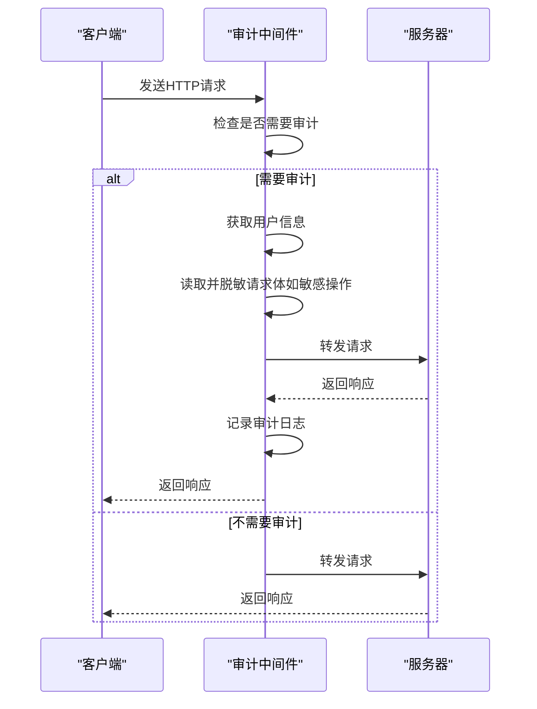
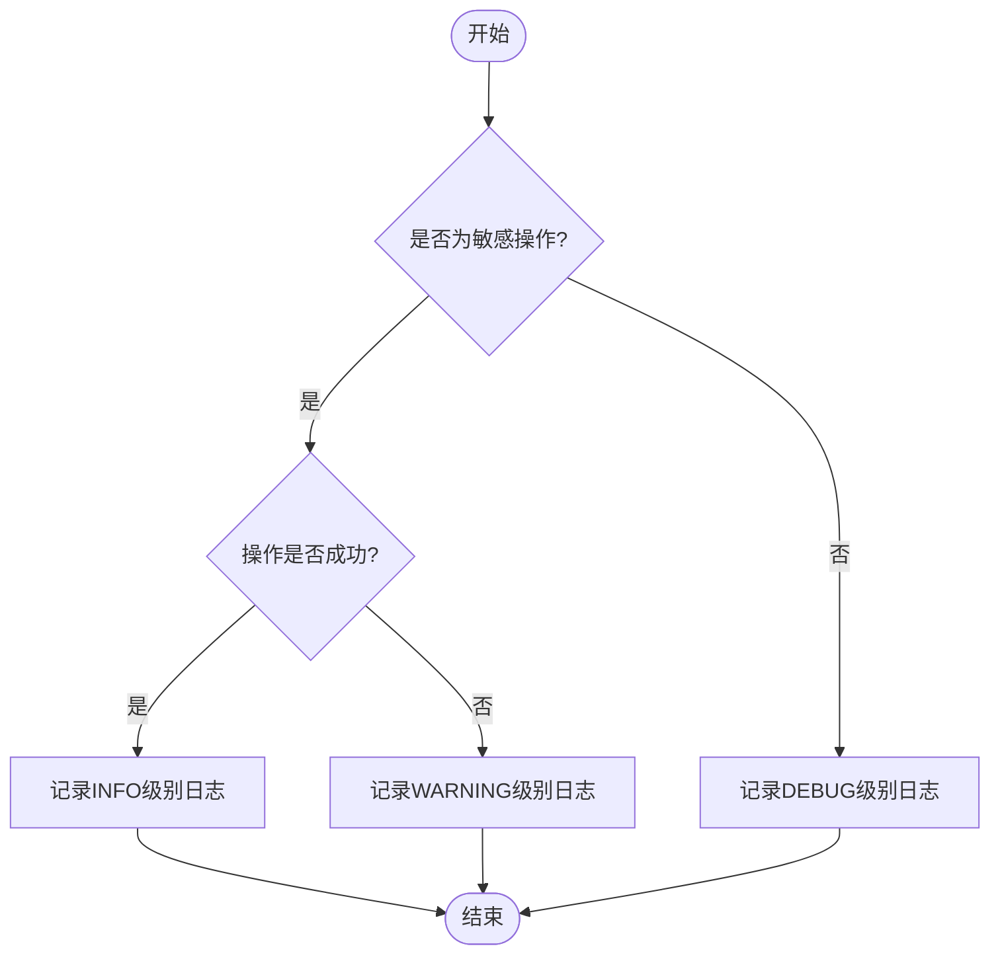
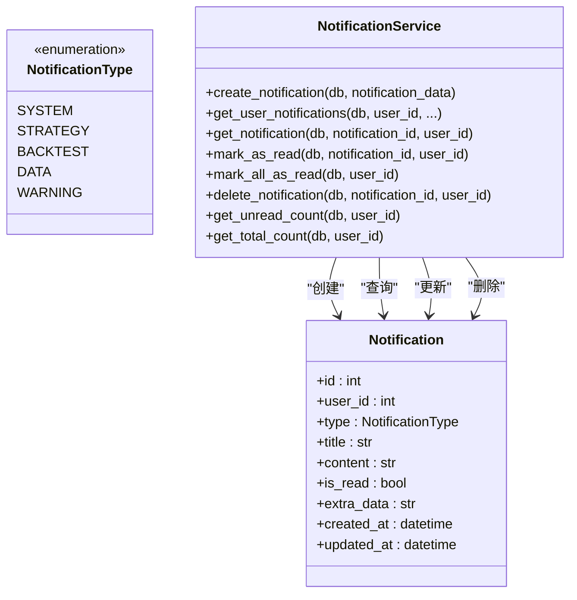
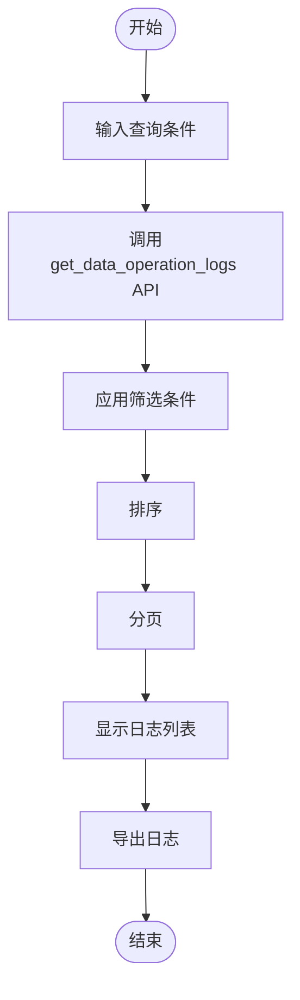

# 审计日志

<cite>
**本文档引用的文件**   
- [audit.py](file://zquant/middleware/audit.py)
- [logging.py](file://zquant/middleware/logging.py)
- [config.py](file://zquant/config.py)
- [log_handler.py](file://zquant/utils/log_handler.py)
- [logger.py](file://zquant/utils/logger.py)
- [notification.py](file://zquant/models/notification.py)
- [notification.py](file://zquant/services/notification.py)
- [data.py](file://zquant/models/data.py)
- [data.py](file://zquant/services/data.py)
- [auth.py](file://zquant/api/v1/auth.py)
- [users.py](file://zquant/api/v1/users.py)
- [data.py](file://zquant/api/v1/data.py)
- [dashboard.py](file://zquant/services/dashboard.py)
- [zquant_dbtool.py](file://zquant/scripts/zquant_dbtool.py)
- [main.py](file://zquant/main.py)
</cite>

## 目录
1. [审计日志概述](#审计日志概述)
2. [审计中间件实现](#审计中间件实现)
3. [日志存储与分级策略](#日志存储与分级策略)
4. [敏感操作审计](#敏感操作审计)
5. [通知服务集成](#通知服务集成)
6. [日志查询与导出](#日志查询与导出)
7. [日志保留策略](#日志保留策略)

## 审计日志概述

zquant系统的审计日志功能旨在记录用户的关键操作，以确保系统的安全性和可追溯性。该功能通过审计中间件自动捕获和记录用户在系统中的关键行为，包括登录、登出、数据修改、策略创建等操作。审计日志不仅记录操作的基本信息，如操作类型、用户ID、IP地址、时间戳和操作结果，还特别关注敏感操作，如删除因子、修改系统配置等，以满足更高的安全要求。

审计日志的实现基于FastAPI框架的中间件机制，确保在请求处理流程中无缝集成。通过配置文件，系统管理员可以灵活调整日志的存储方式、分级策略和保留期限，以适应不同的安全和合规需求。此外，系统还集成了通知服务，能够将重要审计事件推送给管理员，实现及时的监控和响应。

**Section sources**
- [audit.py](file://zquant/middleware/audit.py#L23-L26)
- [main.py](file://zquant/main.py#L132-L148)

## 审计中间件实现

zquant的审计日志功能由`AuditMiddleware`类实现，该类继承自FastAPI的`BaseHTTPMiddleware`。中间件通过拦截HTTP请求，分析请求方法和路径，决定是否需要进行审计记录。具体来说，中间件会检查请求的HTTP方法是否为`POST`、`PUT`、`PATCH`或`DELETE`，并验证请求路径是否匹配预定义的审计路径模式。

审计路径模式包括`/api/v1/auth/login`、`/api/v1/auth/logout`、`/api/v1/users`、`/api/v1/backtest`、`/api/v1/data`和`/api/v1/scheduler`。对于这些路径的请求，中间件会进一步判断是否为敏感操作。敏感操作路径包括`/api/v1/users`、`/api/v1/backtest`和`/api/v1/scheduler`，这些路径的操作会被详细记录，包括请求体内容。

在处理请求时，中间件首先获取用户信息（如果已认证），包括用户ID、用户名和客户端IP地址。对于敏感操作，中间件还会读取请求体内容，并进行脱敏处理，例如将密码字段替换为`***`。处理完请求后，中间件会根据操作结果选择合适的日志级别进行记录。成功执行的敏感操作使用`INFO`级别，失败的敏感操作使用`WARNING`级别，其他操作则使用`DEBUG`级别。

**Diagram sources **
- [audit.py](file://zquant/middleware/audit.py#L36-L159)

**Section sources**
- [audit.py](file://zquant/middleware/audit.py#L36-L159)

## 日志存储与分级策略

zquant系统的审计日志采用文件存储方式，日志文件位于`logs/zquant.log`。日志的存储和分级策略由配置文件`config.py`中的`LOG_LEVEL`和`LOG_FILE`参数控制。`LOG_LEVEL`参数定义了日志的最低记录级别，可选值包括`DEBUG`、`INFO`、`WARNING`和`ERROR`。`LOG_FILE`参数指定了日志文件的路径。

为了确保日志文件的可管理性和系统性能，zquant使用了`WindowsCompatibleTimedRotatingFileHandler`处理器，该处理器支持按时间滚动日志文件。在Windows系统上，该处理器通过复制和删除策略避免了文件被占用时的权限错误。日志文件的滚动周期和保留数量可以通过配置文件进一步调整。

日志的分级策略根据操作的敏感性和结果动态选择。对于成功执行的敏感操作，日志级别为`INFO`；对于失败的敏感操作，日志级别为`WARNING`；对于其他操作，日志级别为`DEBUG`。这种分级策略有助于管理员快速识别和响应潜在的安全威胁。

**Diagram sources **
- [config.py](file://zquant/config.py#L84-L87)
- [log_handler.py](file://zquant/utils/log_handler.py#L36-L113)
- [audit.py](file://zquant/middleware/audit.py#L150-L158)

**Section sources**
- [config.py](file://zquant/config.py#L84-L87)
- [log_handler.py](file://zquant/utils/log_handler.py#L36-L113)
- [audit.py](file://zquant/middleware/audit.py#L150-L158)

## 敏感操作审计

zquant系统对敏感操作实施了额外的审计要求，以确保关键数据和配置的安全。敏感操作包括用户管理、回测管理和调度管理等，这些操作的路径模式为`/api/v1/users`、`/api/v1/backtest`和`/api/v1/scheduler`。对于这些操作，审计中间件会记录更详细的信息，包括请求体内容。

在记录请求体内容时，中间件会进行脱敏处理，以保护用户的敏感信息。例如，如果请求体中包含密码字段，该字段的值将被替换为`***`。此外，中间件还会记录操作的IP地址、时间戳和操作结果，以便进行安全审计和问题追踪。

敏感操作的审计日志不仅用于事后分析，还可以作为实时监控的依据。通过分析审计日志，管理员可以及时发现异常行为，如频繁的登录失败尝试或未经授权的数据修改，从而采取相应的安全措施。

**Section sources**
- [audit.py](file://zquant/middleware/audit.py#L57-L61)
- [audit.py](file://zquant/middleware/audit.py#L107-L120)

## 通知服务集成

zquant系统通过集成通知服务，实现了重要审计事件的实时推送。当发生关键操作时，如用户登录、登出、数据修改或策略创建，系统会生成相应的通知，并通过通知服务推送给管理员。通知服务由`NotificationService`类实现，该类提供了创建、查询、标记和删除通知的功能。

通知的类型通过`NotificationType`枚举定义，包括`SYSTEM`（系统通知）、`STRATEGY`（策略相关）、`BACKTEST`（回测相关）、`DATA`（数据相关）和`WARNING`（警告）。对于审计事件，系统通常使用`WARNING`类型，以突出其重要性。通知内容包括事件的详细信息，如操作类型、用户ID、IP地址和时间戳。

通过前端页面`operation-logs.tsx`，管理员可以查看和管理审计日志相关的通知。系统还支持将通知导出为文件，以便进行进一步的分析和存档。

**Diagram sources **
- [notification.py](file://zquant/models/notification.py#L37-L70)
- [notification.py](file://zquant/services/notification.py#L37-L165)

**Section sources**
- [notification.py](file://zquant/models/notification.py#L37-L70)
- [notification.py](file://zquant/services/notification.py#L37-L165)
- [operation-logs.tsx](file://web/src/pages/data/operation-logs.tsx#L73-L289)

## 日志查询与导出

zquant系统提供了强大的日志查询和导出功能，使管理员能够高效地管理和分析审计日志。日志查询功能通过`DataService.get_data_operation_logs`方法实现，该方法支持多种筛选条件，包括数据表名、操作类型、操作结果、开始日期和结束日期。查询结果支持分页和排序，便于处理大量日志数据。

前端页面`operation-logs.tsx`提供了用户友好的界面，管理员可以通过表单输入筛选条件，点击查询按钮获取日志列表。日志列表以表格形式展示，包括ID、数据表名、操作类型、插入记录数、更新记录数、删除记录数、操作结果、开始时间、结束时间、耗时、创建人和创建时间等字段。管理员还可以点击“查看错误”按钮，查看详细的错误信息。

日志导出功能允许管理员将查询结果导出为文件，支持多种格式，如CSV和JSON。导出的文件可以用于离线分析、存档或合规报告。通过`zquant_dbtool.py`脚本，管理员还可以批量导出日志数据，实现自动化管理。

**Diagram sources **
- [data.py](file://zquant/services/data.py#L508-L619)
- [data.py](file://zquant/api/v1/data.py#L2040-L2062)
- [operation-logs.tsx](file://web/src/pages/data/operation-logs.tsx#L73-L289)

**Section sources**
- [data.py](file://zquant/services/data.py#L508-L619)
- [data.py](file://zquant/api/v1/data.py#L2040-L2062)
- [operation-logs.tsx](file://web/src/pages/data/operation-logs.tsx#L73-L289)

## 日志保留策略

zquant系统的日志保留策略由配置文件`config.py`中的`LOG_LEVEL`和日志文件处理器的配置共同决定。默认情况下，系统会保留所有级别的日志，包括`DEBUG`、`INFO`、`WARNING`和`ERROR`。日志文件按时间滚动，保留一定数量的历史文件，具体数量和滚动周期可以通过配置文件调整。

为了防止日志文件占用过多磁盘空间，系统建议定期清理旧的日志文件。管理员可以通过`zquant_dbtool.py`脚本执行日志清理任务，该脚本提供了`_log_operation`方法，用于记录和管理日志操作。通过定期执行清理任务，可以确保日志文件的大小在合理范围内，同时保留足够的历史数据用于审计和分析。

此外，系统还支持将日志文件归档到外部存储，如云存储服务，以实现长期保存和灾难恢复。归档策略可以根据业务需求和合规要求进行定制，确保日志数据的安全性和可用性。

**Section sources**
- [config.py](file://zquant/config.py#L84-L87)
- [log_handler.py](file://zquant/utils/log_handler.py#L44-L57)
- [zquant_dbtool.py](file://zquant/scripts/zquant_dbtool.py#L929-L998)