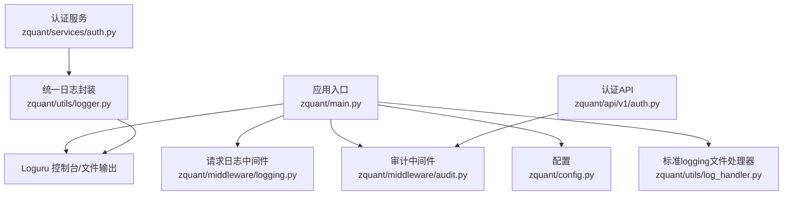
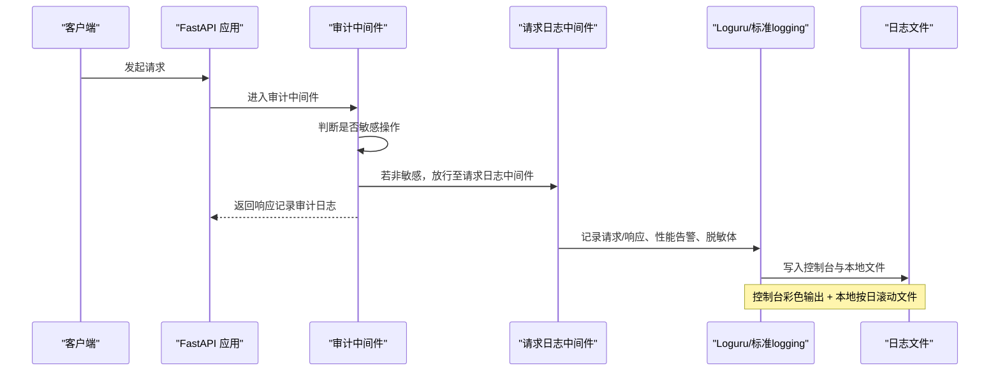
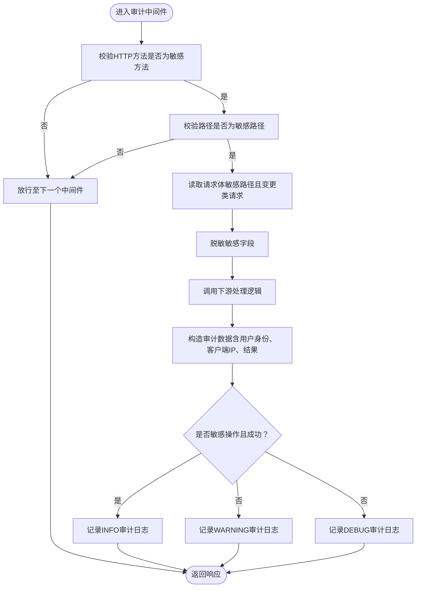
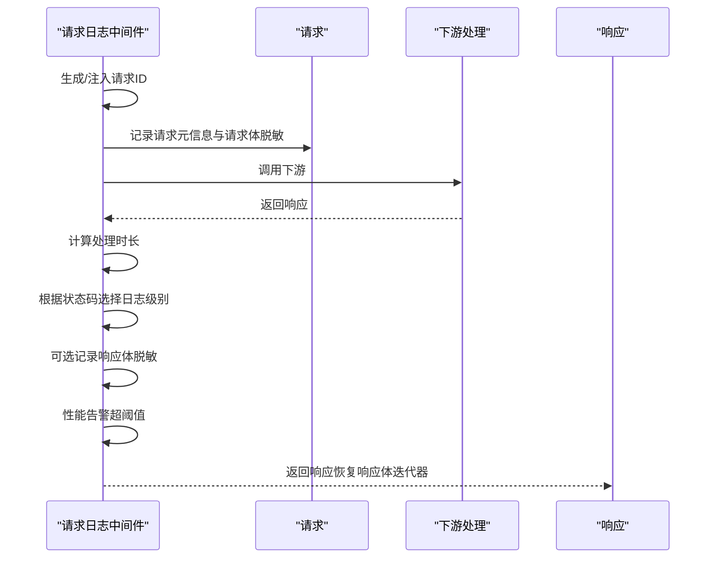
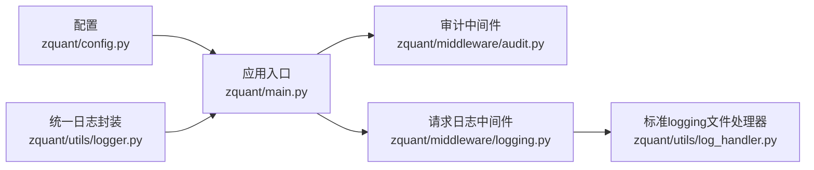

# 审计日志存储策略

<cite>
**本文引用的文件**
- [zquant/main.py](file://zquant/main.py)
- [zquant/config.py](file://zquant/config.py)
- [zquant/middleware/logging.py](file://zquant/middleware/logging.py)
- [zquant/middleware/audit.py](file://zquant/middleware/audit.py)
- [zquant/utils/logger.py](file://zquant/utils/logger.py)
- [zquant/utils/log_handler.py](file://zquant/utils/log_handler.py)
- [zquant/api/v1/auth.py](file://zquant/api/v1/auth.py)
- [zquant/services/auth.py](file://zquant/services/auth.py)
</cite>

## 目录
1. [引言](#引言)
2. [项目结构](#项目结构)
3. [核心组件](#核心组件)
4. [架构总览](#架构总览)
5. [详细组件分析](#详细组件分析)
6. [依赖关系分析](#依赖关系分析)
7. [性能与可靠性考量](#性能与可靠性考量)
8. [故障排查指南](#故障排查指南)
9. [结论](#结论)
10. [附录](#附录)

## 引言
本文件系统性阐述 zquant 项目的审计日志存储策略，重点说明如何基于 Loguru 实现多目标输出（控制台、本地文件按日滚动），以及如何通过审计中间件与请求日志中间件协同，形成“敏感操作审计 + 通用请求审计”的双轨日志体系。文档还解释分级策略（INFO 成功敏感操作、WARNING 失败敏感操作、DEBUG 其他审计事件）的设计原理与合规考量，并给出日志格式化模板、保留周期与磁盘空间管理策略，以及敏感信息脱敏机制（如密码）的实现方式与数据安全合规建议。

## 项目结构
围绕审计日志的关键文件组织如下：
- 应用入口与日志初始化：负责注册中间件、配置 Loguru 控制台与文件输出、配置标准 logging 的文件处理器（按日滚动、Windows 兼容）。
- 中间件层：
  - 请求日志中间件：记录请求/响应、性能告警、请求体与响应体脱敏。
  - 审计中间件：聚焦敏感操作（认证、用户、回测、数据、定时任务等）的结构化审计日志。
- 工具层：
  - 统一日志封装：提供带请求 ID 的结构化日志接口。
  - Windows 兼容滚动处理器：解决日志滚动时文件占用导致的权限问题。
- 配置层：集中定义日志级别、日志文件路径、保留周期等。

图表来源
- [zquant/main.py](file://zquant/main.py#L44-L114)
- [zquant/middleware/logging.py](file://zquant/middleware/logging.py#L171-L314)
- [zquant/middleware/audit.py](file://zquant/middleware/audit.py#L36-L160)
- [zquant/utils/logger.py](file://zquant/utils/logger.py#L33-L74)
- [zquant/utils/log_handler.py](file://zquant/utils/log_handler.py#L36-L113)
- [zquant/config.py](file://zquant/config.py#L84-L90)
- [zquant/api/v1/auth.py](file://zquant/api/v1/auth.py#L39-L65)
- [zquant/services/auth.py](file://zquant/services/auth.py#L150-L228)

章节来源
- [zquant/main.py](file://zquant/main.py#L44-L114)
- [zquant/config.py](file://zquant/config.py#L84-L90)

## 核心组件
- Loguru 控制台输出：彩色终端输出，便于开发调试；格式包含时间、级别、模块与行号。
- Loguru 文件输出：按日滚动（每日午夜）、UTF-8 编码、多线程安全、开启堆栈诊断。
- 标准 logging 文件处理器：按日滚动（Windows 兼容）、UTF-8 编码、多线程安全、保留 30 天。
- 请求日志中间件：记录请求/响应、性能告警、请求体与响应体脱敏；统一注入请求 ID。
- 审计中间件：针对敏感路径与方法进行结构化审计，区分成功/失败使用不同日志级别。
- 统一日志封装：提供带请求 ID 的 info/debug/warning/error/critical 接口。
- Windows 兼容滚动处理器：在文件被占用时采用复制+清空策略，保证滚动不中断。

章节来源
- [zquant/main.py](file://zquant/main.py#L44-L114)
- [zquant/middleware/logging.py](file://zquant/middleware/logging.py#L171-L314)
- [zquant/middleware/audit.py](file://zquant/middleware/audit.py#L36-L160)
- [zquant/utils/logger.py](file://zquant/utils/logger.py#L33-L74)
- [zquant/utils/log_handler.py](file://zquant/utils/log_handler.py#L36-L113)

## 架构总览
审计日志由两条路径构成：
- 通用请求审计：通过请求日志中间件记录所有请求/响应细节（含请求体与响应体脱敏），用于问题定位与性能监控。
- 敏感操作审计：通过审计中间件聚焦认证、用户、回测、数据、定时任务等敏感路径，记录结构化审计数据（方法、路径、状态码、用户身份、客户端 IP、结果等），并按成功/失败选择不同日志级别。

图表来源
- [zquant/main.py](file://zquant/main.py#L132-L147)
- [zquant/middleware/audit.py](file://zquant/middleware/audit.py#L91-L160)
- [zquant/middleware/logging.py](file://zquant/middleware/logging.py#L171-L314)
- [zquant/main.py](file://zquant/main.py#L44-L114)

## 详细组件分析

### 日志分级策略与安全合规考量
- 分级原则
  - 敏感操作成功：INFO
  - 敏感操作失败：WARNING
  - 其他审计事件：DEBUG
- 设计原理
  - 将“敏感操作”与“一般操作”分离，便于合规审计与风险识别。
  - 成功与失败分别使用不同级别，便于自动化规则（如告警阈值）快速识别异常。
- 合规考量
  - 仅记录必要的审计字段，避免冗余与隐私泄露。
  - 对敏感字段（如密码）进行脱敏处理，满足数据最小化与隐私保护要求。
  - 通过请求 ID 将请求生命周期内的日志串联，便于审计追踪。

章节来源
- [zquant/middleware/audit.py](file://zquant/middleware/audit.py#L133-L158)

### 日志格式化模板
- Loguru 控制台格式：包含时间、级别、模块名、函数名、行号与消息，便于快速定位。
- Loguru 文件格式：包含时间、级别、模块名:函数:行号 - 消息，便于离线分析与检索。
- 标准 logging 文件格式：包含时间、名称、级别、进程/线程信息、模块.函数:行号 - 消息，与第三方日志收集系统对接友好。

章节来源
- [zquant/main.py](file://zquant/main.py#L47-L69)
- [zquant/main.py](file://zquant/main.py#L73-L114)

### 多目标输出与滚动策略
- 控制台输出：Loguru 控制台处理器，彩色输出，适合开发与运维实时观察。
- 本地文件输出：
  - Loguru 文件处理器：按日滚动（每日午夜）、UTF-8 编码、多线程安全、保留策略与诊断开关可配置。
  - 标准 logging 文件处理器：按日滚动（Windows 兼容）、UTF-8 编码、保留 30 天、多线程安全。
- 远程日志收集：仓库未内置远程日志采集器配置。建议通过标准 logging 的文件输出配合外部日志收集系统（如 Filebeat、Fluentd、Promtail 或云厂商日志服务）实现集中采集与转发。

章节来源
- [zquant/main.py](file://zquant/main.py#L44-L114)
- [zquant/utils/log_handler.py](file://zquant/utils/log_handler.py#L36-L113)

### 审计中间件（敏感操作）
- 触发条件：HTTP 方法为 POST/PUT/PATCH/DELETE，且路径匹配预设的敏感路径前缀。
- 审计字段：方法、路径、状态码、用户 ID/用户名、客户端 IP、成功标志、请求体（敏感路径且变更类请求时）。
- 日志级别：敏感操作成功使用 INFO，失败使用 WARNING，其他审计事件使用 DEBUG。
- 脱敏策略：对请求体中的敏感键（如 password、token、secret 等）进行脱敏处理。

图表来源
- [zquant/middleware/audit.py](file://zquant/middleware/audit.py#L36-L160)

章节来源
- [zquant/middleware/audit.py](file://zquant/middleware/audit.py#L36-L160)

### 请求日志中间件（通用请求）
- 请求阶段：记录方法、路径、查询参数、客户端 IP、用户代理、认证类型、请求体（脱敏）。
- 响应阶段：记录状态码、处理时长；若超过阈值（例如 1 秒）记录性能警告；可选记录响应体（脱敏）。
- 脱敏策略：对请求体与响应体中的敏感键进行脱敏；二进制或大体积响应体进行截断与提示。
- 请求 ID：为每个请求生成唯一 ID 并贯穿请求生命周期，便于跨服务/组件关联日志。

图表来源
- [zquant/middleware/logging.py](file://zquant/middleware/logging.py#L171-L314)

章节来源
- [zquant/middleware/logging.py](file://zquant/middleware/logging.py#L171-L314)

### 统一日志封装与请求 ID
- 统一日志封装：提供带请求 ID 的 info/debug/warning/error/critical 接口，便于在业务代码中统一输出结构化日志。
- 请求 ID：通过上下文变量在请求生命周期内传递，确保跨模块日志可关联。

章节来源
- [zquant/utils/logger.py](file://zquant/utils/logger.py#L33-L74)
- [zquant/middleware/logging.py](file://zquant/middleware/logging.py#L59-L77)

### Windows 兼容滚动处理器
- 问题背景：在 Windows 上，当日志文件被其他程序占用时，os.rename() 会抛出权限错误，导致滚动失败。
- 解决方案：优先尝试重命名；失败时改用复制+清空策略；若仍失败，则记录错误但继续写入当前文件，保证日志不中断。
- 适用范围：标准 logging 的 TimedRotatingFileHandler 替代实现，适用于按日滚动场景。

章节来源
- [zquant/utils/log_handler.py](file://zquant/utils/log_handler.py#L36-L113)

### 敏感信息脱敏机制
- 脱敏范围：请求体与响应体中的敏感键（如 password、token、secret、api_key、access_token、refresh_token 等）。
- 脱敏方式：将匹配键对应的值替换为占位符；对嵌套结构递归处理；对非 JSON 文本进行截断与提示。
- 例外处理：对二进制或大体积响应体进行截断与提示，避免日志膨胀。

章节来源
- [zquant/middleware/logging.py](file://zquant/middleware/logging.py#L144-L168)
- [zquant/middleware/logging.py](file://zquant/middleware/logging.py#L103-L142)
- [zquant/middleware/audit.py](file://zquant/middleware/audit.py#L107-L129)

### 日志保留周期与磁盘空间管理
- Loguru 文件保留：按配置设置保留周期（例如 30 天），到期自动清理旧文件。
- 标准 logging 文件保留：按日滚动并保留 30 天的历史文件。
- 磁盘空间管理建议：
  - 结合系统磁盘配额与日志轮转策略，定期清理过期文件。
  - 对大体量响应体与二进制内容，建议在上游进行限流与压缩，减少日志体积。
  - 如需集中存储，建议将标准 logging 的文件输出接入外部日志收集系统，实现远端归档与生命周期管理。

章节来源
- [zquant/main.py](file://zquant/main.py#L59-L69)
- [zquant/main.py](file://zquant/main.py#L96-L107)

### 关键审计字段与合规要点
- 必备字段：时间戳、操作类型（方法）、请求路径、用户身份（ID/用户名）、客户端 IP、请求结果（状态码/成功标志）、请求 ID。
- 脱敏字段：密码、令牌、密钥等敏感信息必须脱敏。
- 合规建议：遵循最小化原则，仅记录必要字段；对日志进行分级与保留策略管理；建立日志访问权限控制与审计追踪。

章节来源
- [zquant/middleware/audit.py](file://zquant/middleware/audit.py#L133-L158)
- [zquant/middleware/logging.py](file://zquant/middleware/logging.py#L171-L314)

## 依赖关系分析
- 应用入口依赖配置模块，动态决定日志级别与文件路径，并注册中间件顺序。
- 审计中间件与请求日志中间件均依赖 Loguru；请求日志中间件同时依赖标准 logging 的文件处理器。
- 统一日志封装依赖请求 ID 上下文变量，贯穿中间件链路。
- Windows 兼容滚动处理器用于标准 logging 文件处理器，提升稳定性。

图表来源
- [zquant/config.py](file://zquant/config.py#L84-L90)
- [zquant/main.py](file://zquant/main.py#L132-L147)
- [zquant/middleware/audit.py](file://zquant/middleware/audit.py#L36-L160)
- [zquant/middleware/logging.py](file://zquant/middleware/logging.py#L171-L314)
- [zquant/utils/log_handler.py](file://zquant/utils/log_handler.py#L36-L113)
- [zquant/utils/logger.py](file://zquant/utils/logger.py#L33-L74)

章节来源
- [zquant/main.py](file://zquant/main.py#L132-L147)
- [zquant/config.py](file://zquant/config.py#L84-L90)

## 性能与可靠性考量
- 多线程安全：Loguru 与标准 logging 文件处理器均启用多线程安全写入，避免并发写入冲突。
- 滚动稳定性：Windows 兼容滚动处理器在文件占用时采用复制+清空策略，保证滚动不中断。
- 性能告警：请求日志中间件对处理时长进行监控，超过阈值记录警告，便于及时发现性能瓶颈。
- 日志体积控制：对响应体进行截断与脱敏，避免日志膨胀；对二进制内容进行十六进制预览与截断提示。

章节来源
- [zquant/main.py](file://zquant/main.py#L59-L69)
- [zquant/main.py](file://zquant/main.py#L96-L107)
- [zquant/middleware/logging.py](file://zquant/middleware/logging.py#L299-L301)
- [zquant/middleware/logging.py](file://zquant/middleware/logging.py#L103-L142)

## 故障排查指南
- 日志滚动失败（Windows）：检查是否有其他程序占用日志文件；确认滚动处理器已启用；查看标准 logging 的错误输出。
- 日志级别不生效：确认配置模块中的日志级别设置；检查应用入口是否正确加载配置。
- 审计日志缺失：确认中间件注册顺序（审计中间件在外层，请求日志中间件在内层）；检查敏感路径与方法是否命中。
- 敏感信息未脱敏：检查请求体/响应体是否为 JSON；确认敏感键是否包含在脱敏列表中。
- 日志体积过大：调整响应体截断阈值；对大体量响应体进行压缩或降采样；结合外部日志收集系统进行归档。

章节来源
- [zquant/utils/log_handler.py](file://zquant/utils/log_handler.py#L36-L113)
- [zquant/main.py](file://zquant/main.py#L132-L147)
- [zquant/middleware/logging.py](file://zquant/middleware/logging.py#L144-L168)
- [zquant/middleware/audit.py](file://zquant/middleware/audit.py#L107-L129)

## 结论
zquant 的审计日志存储策略通过“通用请求审计 + 敏感操作审计”的双轨设计，结合 Loguru 与标准 logging 的多目标输出，实现了可控、可观测、可追溯的日志体系。分级策略与脱敏机制满足安全合规要求，按日滚动与保留策略保障长期可用性。建议在生产环境中配合外部日志收集系统实现集中化管理与生命周期治理，进一步提升审计效率与合规水平。

## 附录
- 关键审计字段清单
  - 时间戳、操作类型（方法）、请求路径、用户身份（ID/用户名）、客户端 IP、请求结果（状态码/成功标志）、请求 ID、请求体（脱敏）、响应体（脱敏，可选）
- 建议的远程日志收集对接
  - 使用标准 logging 的文件输出作为数据源，配合 Filebeat/Fluentd/Promtail 等工具采集并转发至集中式日志平台（如 ELK、Loki、云厂商日志服务）。