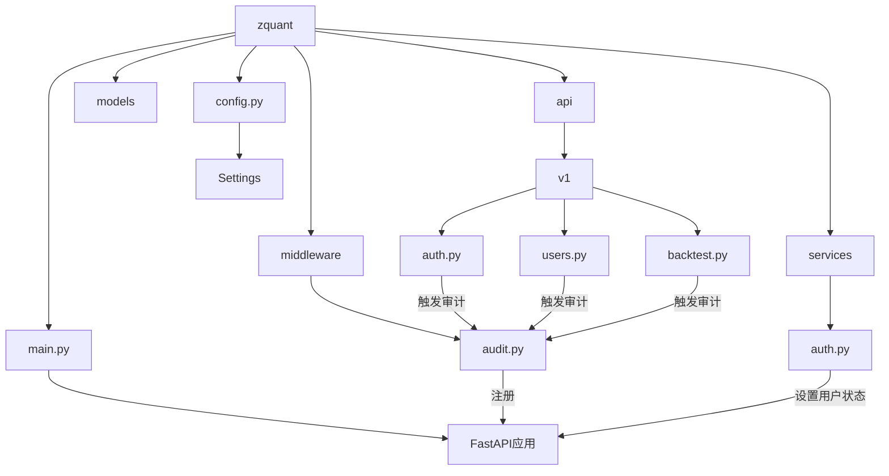
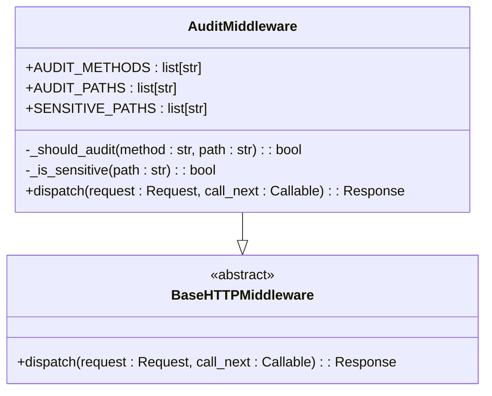
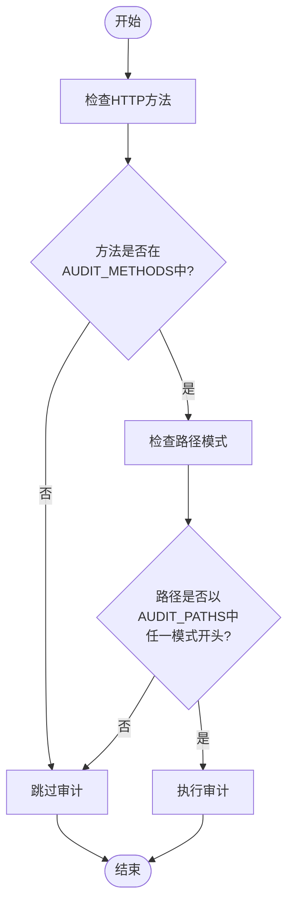
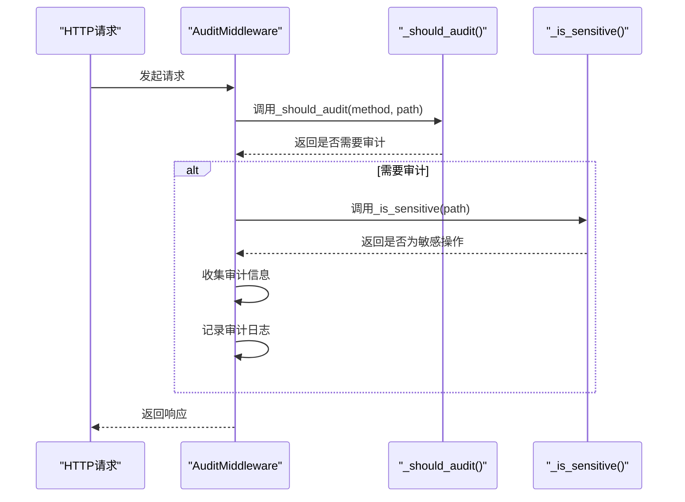
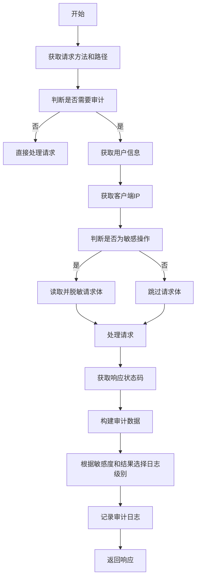
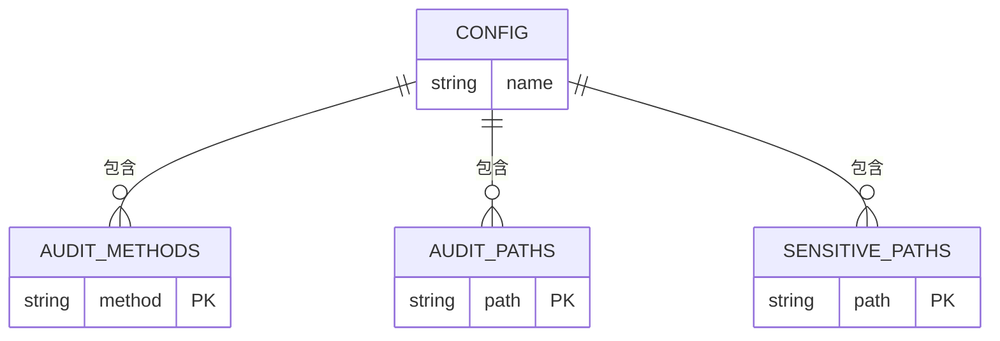

# 审计日志实现机制

<cite>
**本文档引用的文件**  
- [audit.py](file://zquant/middleware/audit.py)
- [main.py](file://zquant/main.py)
- [auth.py](file://zquant/api/v1/auth.py)
- [users.py](file://zquant/api/v1/users.py)
- [backtest.py](file://zquant/api/v1/backtest.py)
- [auth.py](file://zquant/services/auth.py)
- [deps.py](file://zquant/api/deps.py)
- [config.py](file://zquant/config.py)
</cite>

## 目录
1. [项目结构](#项目结构)
2. [核心组件](#核心组件)
3. [审计日志中间件分析](#审计日志中间件分析)
4. [审计触发逻辑](#审计触发逻辑)
5. [审计级别判断机制](#审计级别判断机制)
6. [日志信息收集与记录](#日志信息收集与记录)
7. [敏感操作与普通操作处理策略](#敏感操作与普通操作处理策略)
8. [配置项分析](#配置项分析)

## 项目结构



**图示来源**
- [audit.py](file://zquant/middleware/audit.py)
- [main.py](file://zquant/main.py)
- [auth.py](file://zquant/api/v1/auth.py)
- [users.py](file://zquant/api/v1/users.py)
- [backtest.py](file://zquant/api/v1/backtest.py)
- [auth.py](file://zquant/services/auth.py)
- [config.py](file://zquant/config.py)

## 核心组件

zquant平台的审计日志实现机制主要由以下几个核心组件构成：审计中间件(AuditMiddleware)、API路由、认证服务(AuthService)和配置系统(Settings)。这些组件协同工作，实现了对敏感操作的全面审计和日志记录。

**组件来源**
- [audit.py](file://zquant/middleware/audit.py)
- [main.py](file://zquant/main.py)
- [auth.py](file://zquant/services/auth.py)
- [config.py](file://zquant/config.py)

## 审计日志中间件分析

审计日志中间件(AuditMiddleware)是zquant平台安全审计的核心组件，它继承自FastAPI的BaseHTTPMiddleware，通过拦截所有HTTP请求来实现审计功能。该中间件在请求处理的前后阶段收集关键信息，并根据操作的敏感程度和执行结果选择适当的日志级别进行记录。



**图示来源**
- [audit.py](file://zquant/middleware/audit.py#L36-L159)

## 审计触发逻辑

审计中间件通过`_should_audit`方法判断是否需要对特定请求进行审计。该方法的触发逻辑基于两个关键条件：HTTP方法类型和请求路径模式。



**图示来源**
- [audit.py](file://zquant/middleware/audit.py#L63-L77)

## 审计级别判断机制

审计级别判断机制由`_should_audit`和`_is_sensitive`两个私有方法协同工作实现。`_should_audit`方法基于AUDIT_METHODS和AUDIT_PATHS配置项判断操作是否需要审计，而`_is_sensitive`方法则基于SENSITIVE_PATHS配置项判断操作是否为敏感操作。



**图示来源**
- [audit.py](file://zquant/middleware/audit.py#L63-L90)

## 日志信息收集与记录

审计中间件在请求处理前后收集多种关键信息，并以结构化JSON格式记录到日志系统。信息收集过程包括用户身份、客户端信息、请求体（含脱敏处理）和响应状态码等。



**图示来源**
- [audit.py](file://zquant/middleware/audit.py#L91-L159)

## 敏感操作与普通操作处理策略

系统对敏感操作和普通操作采用不同的日志级别处理策略。敏感操作（如用户管理、回测创建）在成功时使用INFO级别，在失败时使用WARNING级别；而普通操作则统一使用DEBUG级别记录。

```mermaid
flowchart TD
A[审计操作] --> B{是否为敏感操作?}
B --> |是| C{操作是否成功?}
B --> |否| D[使用DEBUG级别记录]
C --> |是| E[使用INFO级别记录<br/>\"敏感操作成功\"]
C --> |否| F[使用WARNING级别记录<br/>\"敏感操作失败\"]
E --> G[结束]
F --> G
D --> G
```

**图示来源**
- [audit.py](file://zquant/middleware/audit.py#L150-L157)

## 配置项分析

审计功能的配置主要通过AUDIT_METHODS、AUDIT_PATHS和SENSITIVE_PATHS三个类属性实现。这些配置项定义了哪些HTTP方法、路径模式需要审计，以及哪些路径属于敏感操作。



**图示来源**
- [audit.py](file://zquant/middleware/audit.py#L43-L61)