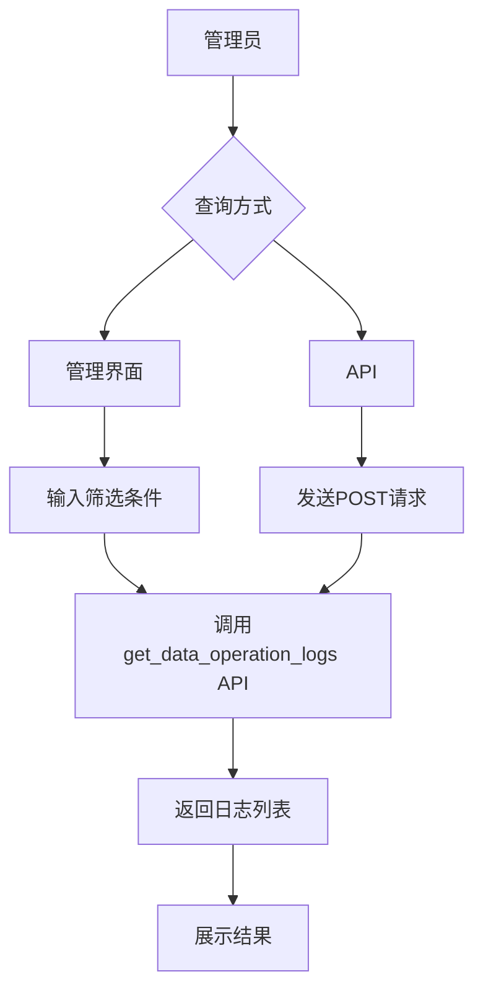
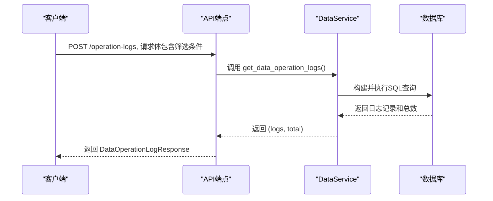
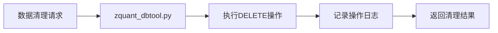
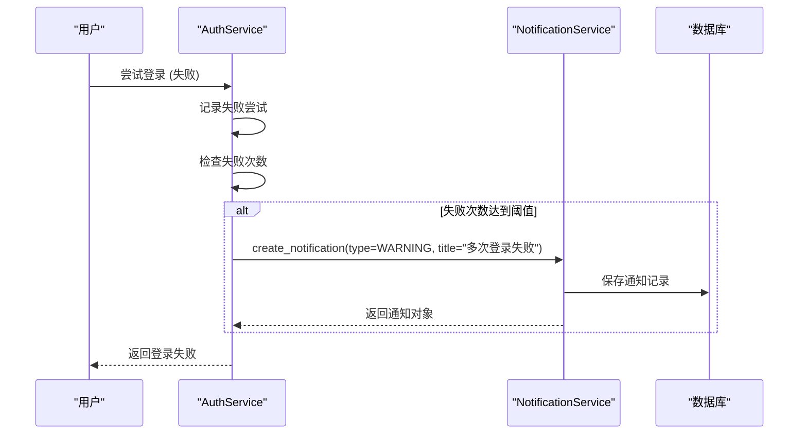

# 审计日志管理与查询

<cite>
**本文档引用的文件**   
- [audit.py](file://zquant/middleware/audit.py)
- [data.py](file://zquant/services/data.py)
- [data.py](file://zquant/api/v1/data.py)
- [data.py](file://zquant/models/data.py)
- [data.py](file://zquant/schemas/data.py)
- [notification.py](file://zquant/services/notification.py)
- [notification.py](file://zquant/api/v1/notifications.py)
- [notification.py](file://zquant/models/notification.py)
- [scheduler.py](file://zquant/data/etl/scheduler.py)
- [zquant_dbtool.py](file://zquant/scripts/zquant_dbtool.py)
- [operation-logs.tsx](file://web/src/pages/data/operation-logs.tsx)
</cite>

## 目录
1. [简介](#简介)
2. [审计日志查询](#审计日志查询)
3. [日志查询接口实现](#日志查询接口实现)
4. [日志导出功能](#日志导出功能)
5. [日志保留与清理策略](#日志保留与清理策略)
6. [安全告警监控](#安全告警监控)
7. [结论](#结论)

## 简介
本系统提供全面的审计日志管理功能，用于记录和追踪所有关键的系统操作。审计日志主要分为两类：一类是通过中间件记录的API访问和用户操作日志，另一类是专门用于数据同步和管理操作的结构化日志。系统管理员可以通过管理界面或API对这些日志进行查询、筛选和分析，以满足安全审计和问题排查的需求。日志数据被持久化存储在数据库中，确保了数据的可靠性和可追溯性。

## 审计日志查询
系统管理员可以通过管理界面或API查询审计日志记录。查询功能支持多种筛选条件，包括用户、时间范围、操作类型和成功/失败状态。

### 管理界面查询
在管理界面的“数据”模块下，有一个名为“操作日志”的页面（`operation-logs.tsx`）。用户可以通过该页面的表单输入筛选条件，如数据表名、操作类型、操作结果和日期范围，然后点击查询按钮。前端会将这些条件封装成一个请求对象，并调用后端API获取数据，最终在表格中展示查询结果。

### API查询
系统提供了专门的API端点来查询数据操作日志。管理员可以向 `/api/v1/data/operation-logs` 发送POST请求，请求体中包含查询参数。这些参数与管理界面的表单字段相对应，允许进行灵活的组合查询。

**日志查询参数**
- **table_name**: 数据表名，支持模糊查询。
- **operation_type**: 操作类型，如 `sync`、`insert`、`update`、`delete` 等，精确匹配。
- **operation_result**: 操作结果，如 `success`、`failed`、`partial_success`，精确匹配。
- **start_date**: 开始日期，用于筛选创建时间。
- **end_date**: 结束日期，用于筛选创建时间。
- **order_by**: 排序字段，如 `created_time`、`id` 等。
- **order**: 排序方向，`asc` 或 `desc`。

**Section sources**
- [operation-logs.tsx](file://web/src/pages/data/operation-logs.tsx#L73-L111)
- [data.py](file://zquant/api/v1/data.py#L2040-L2062)

## 日志查询接口实现
日志查询接口的实现基于数据库中的结构化审计记录。系统使用SQLAlchemy ORM从数据库中读取 `DataOperationLog` 表的数据，并根据传入的参数进行筛选、排序和分页。

### 数据模型
审计日志的核心数据模型是 `DataOperationLog`，它定义了日志记录的所有字段，包括：
- `id`: 日志ID
- `table_name`: 操作的数据表名
- `operation_type`: 操作类型
- `operation_result`: 操作结果
- `start_time` / `end_time`: 操作的开始和结束时间
- `insert_count` / `update_count` / `delete_count`: 各类操作的数量
- `created_time`: 日志创建时间
- `created_by`: 操作执行者

### 服务层逻辑
`DataService` 类中的 `get_data_operation_logs` 方法负责处理查询逻辑。该方法接收数据库会话和各种筛选参数，构建一个SQL查询，然后执行查询并返回结果。

**查询逻辑说明**
1.  **确保表存在**: 在查询前，系统会检查 `DataOperationLog` 表是否存在，如果不存在则自动创建。
2.  **构建查询**: 使用 `db.query(DataOperationLog)` 创建一个查询对象。
3.  **应用筛选**: 根据传入的参数，动态地向查询对象添加 `filter` 条件。例如，如果提供了 `table_name`，则使用 `like` 操作符进行模糊匹配。
4.  **计算总数**: 在应用筛选后，调用 `query.count()` 获取满足条件的总记录数。
5.  **排序**: 根据 `order_by` 和 `order` 参数，对查询结果进行排序。
6.  **分页**: 使用 `offset` 和 `limit` 方法实现分页，返回指定范围内的记录。

**Diagram sources**
- [data.py](file://zquant/models/data.py#L1046-L1082)
- [data.py](file://zquant/services/data.py#L508-L572)

**Section sources**
- [data.py](file://zquant/models/data.py#L1046-L1082)
- [data.py](file://zquant/services/data.py#L508-L572)
- [data.py](file://zquant/schemas/data.py#L178-L213)

## 日志导出功能
虽然当前代码库中没有直接实现日志导出为CSV格式的功能，但系统提供了完整的API接口和数据模型，为实现此功能奠定了坚实的基础。管理员或开发人员可以基于现有的 `get_data_operation_logs` API，开发一个额外的端点来处理导出请求。

### 实现建议
1.  **创建新的API端点**: 例如 `/api/v1/data/operation-logs/export`，该端点接受与查询API相同的参数。
2.  **获取数据**: 在服务层调用 `get_data_operation_logs` 方法，但将 `limit` 参数设置为一个非常大的值（或移除限制），以获取所有匹配的记录。
3.  **数据转换**: 将查询到的 `DataOperationLog` 对象列表转换为CSV格式。可以使用Python的 `csv` 模块或 `pandas` 库来高效地完成此操作。
4.  **文件生成与响应**: 将生成的CSV数据作为HTTP响应返回，设置正确的 `Content-Type` (如 `text/csv`) 和 `Content-Disposition` 头，以便浏览器提示用户下载文件。

此功能对于满足合规性审计需求至关重要，因为它允许管理员将日志数据导出并进行离线分析或提交给审计机构。

## 日志保留策略和自动清理机制
系统通过数据库表来存储审计日志，其保留策略和清理机制主要依赖于数据库层面的维护和管理脚本。

### 日志保留
目前，系统没有在代码层面实现自动的日志过期删除策略。所有通过 `DataOperationLog` 模型记录的日志都会永久保留在 `zq_stats_apisync` 数据库表中，直到被手动清理。这种设计确保了所有操作都有据可查，满足了长期审计的需求。

### 自动清理机制
虽然没有自动的定时清理任务，但系统提供了一个强大的数据库管理工具 `zquant_dbtool.py`，其中包含了手动清理数据的功能。该工具可以用于执行数据清理操作。

**清理流程**
1.  **发起清理**: 管理员通过命令行调用 `zquant_dbtool.py` 脚本，并指定要清理的表和时间范围。
2.  **执行删除**: 脚本执行SQL的 `DELETE` 语句，删除指定时间段内的数据。
3.  **记录日志**: 在删除操作完成后，脚本会调用 `_log_operation` 方法，将这次删除操作本身也记录到 `DataOperationLog` 表中，确保了操作的可追溯性。这体现了“审计日志自身也需要被审计”的安全原则。
4.  **返回结果**: 向管理员返回清理结果，包括成功删除的记录数。

这种机制将清理操作本身也作为一次“操作”进行记录，保证了审计链条的完整性。

**Section sources**
- [zquant_dbtool.py](file://zquant/scripts/zquant_dbtool.py#L242-L280)
- [zquant_dbtool.py](file://zquant/scripts/zquant_dbtool.py#L938-L964)

## 安全告警监控
系统通过通知服务来监控和响应由审计事件触发的安全告警。当发生特定的敏感操作时，系统可以创建通知，提醒管理员进行检查。

### 通知服务
`NotificationService` 类提供了管理用户通知的核心功能，包括创建、查询、标记已读和删除通知。

**核心功能**
- `create_notification`: 创建一条新的通知。
- `get_user_notifications`: 根据用户ID、是否已读、通知类型等条件查询通知列表。
- `mark_as_read`: 将单条或所有通知标记为已读。
- `get_unread_count`: 获取用户的未读通知数量。

### 安全告警的实现
虽然代码中没有直接展示如何将审计事件（如多次登录失败）转化为安全告警，但其架构是清晰的。例如，在 `auth.py` 中，`authenticate_user` 方法会记录登录尝试。一个合理的扩展是，在检测到多次失败的登录尝试后，调用 `NotificationService.create_notification` 方法，创建一条类型为 `WARNING` 的通知。

管理员可以通过管理界面的“通知”模块或调用 `/api/v1/notifications` API 来查看这些安全告警。通知的类型（`NotificationType`）枚举中包含了 `WARNING`，这为实现安全告警提供了类型支持。

**Diagram sources**
- [notification.py](file://zquant/services/notification.py#L37-L164)
- [notification.py](file://zquant/api/v1/notifications.py#L47-L130)

**Section sources**
- [notification.py](file://zquant/services/notification.py#L37-L164)
- [notification.py](file://zquant/api/v1/notifications.py#L47-L130)
- [notification.py](file://zquant/models/notification.py#L37-L70)
- [auth.py](file://zquant/services/auth.py#L158-L205)

## 结论
zquant系统建立了一套完善的审计日志管理体系。通过 `AuditMiddleware` 中间件，系统能够自动记录所有关键的API请求，形成基础的审计追踪。同时，通过 `DataOperationLog` 模型，系统对数据同步等核心操作进行了结构化的日志记录，支持管理员通过管理界面或API进行多维度的查询和分析。尽管日志导出功能需要额外开发，但其底层数据和接口已准备就绪。系统的日志保留策略确保了数据的长期可追溯性，而通过管理工具进行的清理操作本身也会被记录，保证了审计的完整性。最后，通知服务为实现基于审计事件的安全告警提供了可行的架构，可以有效提升系统的安全监控能力。