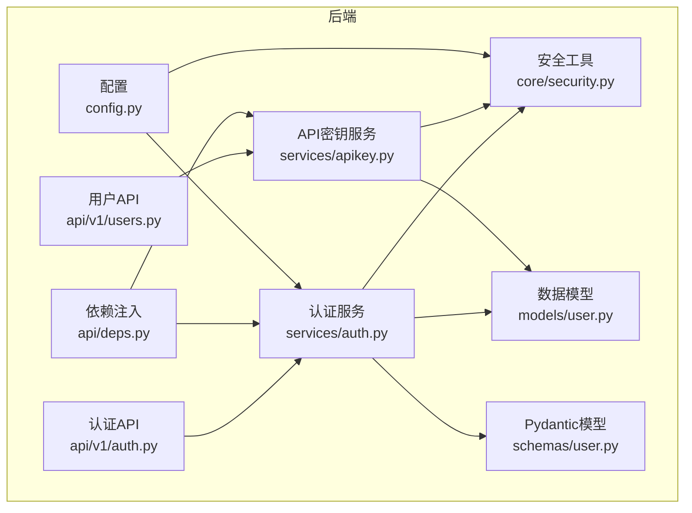
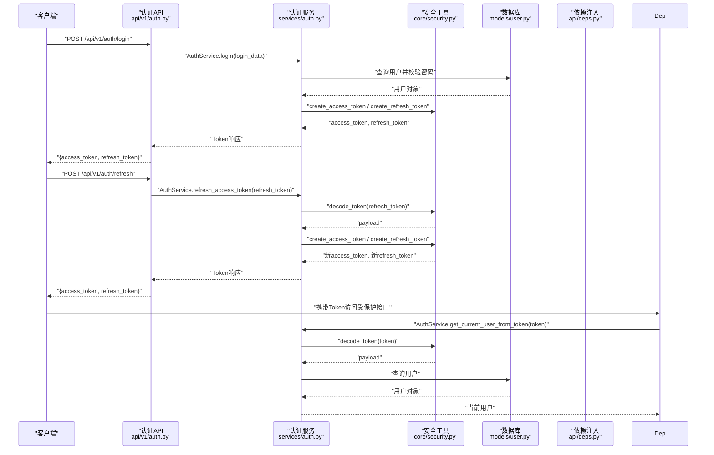
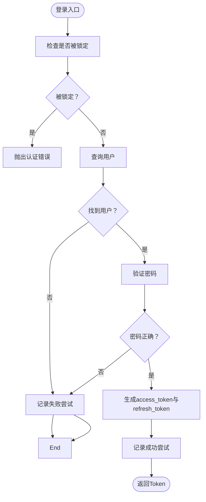
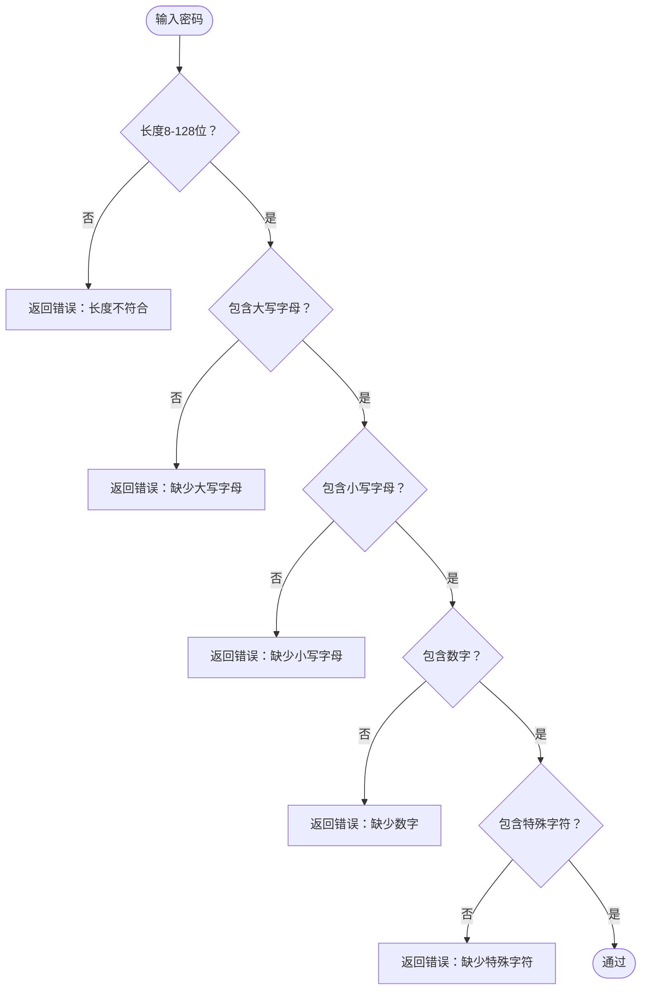
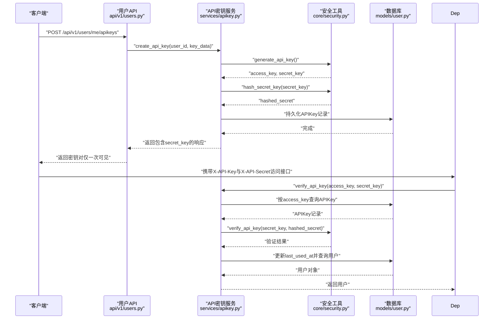
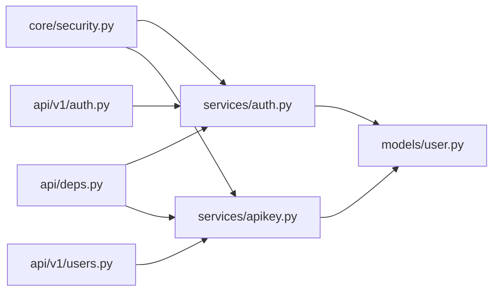

# 认证安全

<cite>
**本文引用的文件**
- [zquant/core/security.py](file://zquant/core/security.py)
- [zquant/services/auth.py](file://zquant/services/auth.py)
- [zquant/api/v1/auth.py](file://zquant/api/v1/auth.py)
- [zquant/services/apikey.py](file://zquant/services/apikey.py)
- [zquant/api/deps.py](file://zquant/api/deps.py)
- [zquant/api/v1/users.py](file://zquant/api/v1/users.py)
- [zquant/config.py](file://zquant/config.py)
- [zquant/models/user.py](file://zquant/models/user.py)
- [zquant/schemas/user.py](file://zquant/schemas/user.py)
- [zquant/tests/unittest/test_auth_service.py](file://zquant/tests/unittest/test_auth_service.py)
- [zquant/tests/unittest/test_security.py](file://zquant/tests/unittest/test_security.py)
</cite>

## 目录
1. [简介](#简介)
2. [项目结构](#项目结构)
3. [核心组件](#核心组件)
4. [架构总览](#架构总览)
5. [详细组件分析](#详细组件分析)
6. [依赖关系分析](#依赖关系分析)
7. [性能考量](#性能考量)
8. [故障排查指南](#故障排查指南)
9. [结论](#结论)
10. [附录](#附录)

## 简介
本文件面向zquant项目的认证与安全实现，围绕以下目标展开：
- 深入阐述JWT认证流程：访问Token与刷新Token的生成、验证机制
- 基于bcrypt的密码哈希与验证实现
- API密钥的生成、存储（哈希）与验证流程
- 密码强度策略（长度、大小写、数字、特殊字符）及其在注册与修改密码时的强制执行
- Token过期处理与刷新机制
- 结合代码示例路径，展示核心函数的使用方式

## 项目结构
认证与安全相关的核心代码分布在如下模块：
- 安全与通用工具：zquant/core/security.py
- 认证服务：zquant/services/auth.py
- 认证API：zquant/api/v1/auth.py
- API密钥服务：zquant/services/apikey.py
- API依赖注入与鉴权：zquant/api/deps.py
- 用户相关API：zquant/api/v1/users.py
- 配置：zquant/config.py
- 数据模型：zquant/models/user.py
- Pydantic模型：zquant/schemas/user.py
- 单元测试：zquant/tests/unittest/test_auth_service.py、zquant/tests/unittest/test_security.py

图表来源
- [zquant/config.py](file://zquant/config.py#L73-L78)
- [zquant/core/security.py](file://zquant/core/security.py#L35-L133)
- [zquant/services/auth.py](file://zquant/services/auth.py#L1-L289)
- [zquant/services/apikey.py](file://zquant/services/apikey.py#L1-L142)
- [zquant/api/v1/auth.py](file://zquant/api/v1/auth.py#L1-L65)
- [zquant/api/deps.py](file://zquant/api/deps.py#L70-L92)
- [zquant/api/v1/users.py](file://zquant/api/v1/users.py#L106-L135)
- [zquant/models/user.py](file://zquant/models/user.py#L74-L113)
- [zquant/schemas/user.py](file://zquant/schemas/user.py#L166-L210)

章节来源
- [zquant/config.py](file://zquant/config.py#L73-L78)
- [zquant/core/security.py](file://zquant/core/security.py#L35-L133)
- [zquant/services/auth.py](file://zquant/services/auth.py#L1-L289)
- [zquant/services/apikey.py](file://zquant/services/apikey.py#L1-L142)
- [zquant/api/v1/auth.py](file://zquant/api/v1/auth.py#L1-L65)
- [zquant/api/deps.py](file://zquant/api/deps.py#L70-L92)
- [zquant/api/v1/users.py](file://zquant/api/v1/users.py#L106-L135)
- [zquant/models/user.py](file://zquant/models/user.py#L74-L113)
- [zquant/schemas/user.py](file://zquant/schemas/user.py#L166-L210)

## 核心组件
- 安全工具层（密码哈希、JWT、API密钥）
  - 密码哈希与验证：verify_password、get_password_hash
  - 密码强度校验：validate_password_strength
  - JWT访问/刷新Token生成与解码：create_access_token、create_refresh_token、decode_token
  - API密钥生成与验证：generate_api_key、hash_secret_key、verify_api_key
- 认证服务层（登录、刷新、用户解析、登录失败次数限制、Token黑名单）
  - 登录与Token发放：AuthService.login
  - 刷新访问Token：AuthService.refresh_access_token
  - 从Token解析当前用户：AuthService.get_current_user_from_token
  - 登录失败次数限制与锁定：AuthService._check_login_lockout、AuthService._record_login_attempt
  - Token黑名单管理：AuthService.add_token_to_blacklist、AuthService._is_token_blacklisted
- API密钥服务层（创建、查询、验证、禁用、删除）
  - 创建API密钥：APIKeyService.create_api_key
  - 查询用户密钥：APIKeyService.get_user_api_keys
  - 验证API密钥并返回用户：APIKeyService.verify_api_key
  - 删除与禁用API密钥：APIKeyService.delete_api_key、APIKeyService.disable_api_key
- 依赖注入与鉴权
  - 通过Header携带X-API-Key与X-API-Secret进行API密钥鉴权：get_api_key_user
  - 通过Token获取当前活跃用户：get_current_active_user
- 配置
  - JWT密钥、算法、过期时间、加密密钥等：Settings

章节来源
- [zquant/core/security.py](file://zquant/core/security.py#L35-L133)
- [zquant/services/auth.py](file://zquant/services/auth.py#L45-L289)
- [zquant/services/apikey.py](file://zquant/services/apikey.py#L43-L142)
- [zquant/api/deps.py](file://zquant/api/deps.py#L70-L92)
- [zquant/config.py](file://zquant/config.py#L73-L83)

## 架构总览
下图展示了认证与API密钥的整体交互流程，包括登录、Token发放、刷新、用户解析、API密钥验证等环节。

图表来源
- [zquant/api/v1/auth.py](file://zquant/api/v1/auth.py#L39-L65)
- [zquant/services/auth.py](file://zquant/services/auth.py#L200-L249)
- [zquant/core/security.py](file://zquant/core/security.py#L85-L114)
- [zquant/models/user.py](file://zquant/models/user.py#L74-L94)
- [zquant/api/deps.py](file://zquant/api/deps.py#L70-L92)

## 详细组件分析

### JWT认证流程与Token管理
- 访问Token与刷新Token生成
  - 访问Token：携带用户身份信息与类型标记“access”，默认过期时间为配置项ACCESS_TOKEN_EXPIRE_MINUTES
  - 刷新Token：携带用户身份信息与类型标记“refresh”，默认过期时间为配置项REFRESH_TOKEN_EXPIRE_DAYS
  - 两者均使用配置项SECRET_KEY与ALGORITHM进行签名
- Token解码与验证
  - decode_token负责解码并返回payload；若解码失败则返回空
  - get_current_user_from_token在解析Token时会检查类型是否为“access”，并校验用户是否存在且处于激活状态
  - refresh_access_token在刷新时会先解码并校验类型为“refresh”，再生成新的访问与刷新Token
- 登录失败次数限制与锁定
  - 使用缓存记录登录尝试次数与锁定截止时间，超过阈值将锁定一段时间
- Token黑名单
  - 支持将Token加入黑名单（以SHA-256哈希为键），防止撤销的Token继续使用

图表来源
- [zquant/services/auth.py](file://zquant/services/auth.py#L164-L199)
- [zquant/services/auth.py](file://zquant/services/auth.py#L200-L228)

章节来源
- [zquant/core/security.py](file://zquant/core/security.py#L85-L114)
- [zquant/services/auth.py](file://zquant/services/auth.py#L164-L249)
- [zquant/config.py](file://zquant/config.py#L73-L78)

### 密码哈希与强度策略
- 密码哈希与验证
  - 使用bcrypt方案，verify_password用于验证明文密码与哈希值
  - get_password_hash用于生成哈希值
- 密码强度策略
  - 长度：最小8位，最大128位
  - 必须包含至少一个大写字母、一个小写字母、一个数字、一个特殊字符（集合包含常见符号）
- 注册与修改密码时的强制执行
  - 后端模型与前端表单均对密码长度与字符集进行约束，确保满足强度要求
  - 注册时还要求两次密码输入一致

图表来源
- [zquant/core/security.py](file://zquant/core/security.py#L49-L83)
- [zquant/schemas/user.py](file://zquant/schemas/user.py#L40-L55)
- [zquant/schemas/user.py](file://zquant/schemas/user.py#L65-L79)

章节来源
- [zquant/core/security.py](file://zquant/core/security.py#L35-L83)
- [zquant/schemas/user.py](file://zquant/schemas/user.py#L40-L79)

### API密钥生成、存储与验证
- 生成与存储
  - generate_api_key生成access_key与secret_key
  - secret_key在入库前使用bcrypt进行哈希存储
- 验证流程
  - 通过access_key定位API密钥记录
  - 校验状态与有效期
  - 使用bcrypt验证secret_key
  - 成功后更新最后使用时间，并返回用户对象
- 管理能力
  - 支持查询用户所有密钥、删除与禁用密钥

图表来源
- [zquant/api/v1/users.py](file://zquant/api/v1/users.py#L110-L135)
- [zquant/services/apikey.py](file://zquant/services/apikey.py#L47-L116)
- [zquant/core/security.py](file://zquant/core/security.py#L116-L133)
- [zquant/models/user.py](file://zquant/models/user.py#L96-L113)
- [zquant/api/deps.py](file://zquant/api/deps.py#L77-L92)

章节来源
- [zquant/services/apikey.py](file://zquant/services/apikey.py#L43-L142)
- [zquant/core/security.py](file://zquant/core/security.py#L116-L133)
- [zquant/models/user.py](file://zquant/models/user.py#L96-L113)
- [zquant/api/deps.py](file://zquant/api/deps.py#L77-L92)

### Token过期处理与刷新机制
- 过期时间
  - 访问Token默认过期时间为ACCESS_TOKEN_EXPIRE_MINUTES（分钟）
  - 刷新Token默认过期时间为REFRESH_TOKEN_EXPIRE_DAYS（天）
- 刷新流程
  - 客户端使用refresh_token调用刷新接口
  - 服务端解码并校验类型为“refresh”，随后生成新的access_token与refresh_token
- 黑名单与撤销
  - 登出或撤销场景可将Token加入黑名单，防止继续使用

章节来源
- [zquant/config.py](file://zquant/config.py#L73-L78)
- [zquant/services/auth.py](file://zquant/services/auth.py#L230-L249)
- [zquant/core/security.py](file://zquant/core/security.py#L85-L114)

### 核心函数使用示例（代码片段路径）
- create_access_token
  - 示例路径：[zquant/core/security.py](file://zquant/core/security.py#L85-L95)
- verify_password
  - 示例路径：[zquant/core/security.py](file://zquant/core/security.py#L39-L41)
- generate_api_key
  - 示例路径：[zquant/core/security.py](file://zquant/core/security.py#L116-L122)
- validate_password_strength
  - 示例路径：[zquant/core/security.py](file://zquant/core/security.py#L49-L83)

章节来源
- [zquant/core/security.py](file://zquant/core/security.py#L39-L133)

## 依赖关系分析
- 组件耦合
  - AuthService依赖core.security提供的JWT与密码工具，依赖数据库模型User
  - APIKeyService依赖core.security进行密钥生成与哈希，依赖数据库模型APIKey与User
  - API依赖注入get_api_key_user与get_current_active_user分别依赖APIKeyService与AuthService
- 外部依赖
  - JWT签名与解码：jose
  - 密码哈希：passlib（bcrypt）
  - 缓存：get_cache（来自utils.cache）
  - 数据库：SQLAlchemy模型

图表来源
- [zquant/core/security.py](file://zquant/core/security.py#L35-L133)
- [zquant/services/auth.py](file://zquant/services/auth.py#L1-L289)
- [zquant/services/apikey.py](file://zquant/services/apikey.py#L1-L142)
- [zquant/api/deps.py](file://zquant/api/deps.py#L70-L92)
- [zquant/api/v1/auth.py](file://zquant/api/v1/auth.py#L1-L65)
- [zquant/api/v1/users.py](file://zquant/api/v1/users.py#L106-L135)
- [zquant/models/user.py](file://zquant/models/user.py#L74-L113)

章节来源
- [zquant/core/security.py](file://zquant/core/security.py#L35-L133)
- [zquant/services/auth.py](file://zquant/services/auth.py#L1-L289)
- [zquant/services/apikey.py](file://zquant/services/apikey.py#L1-L142)
- [zquant/api/deps.py](file://zquant/api/deps.py#L70-L92)
- [zquant/api/v1/auth.py](file://zquant/api/v1/auth.py#L1-L65)
- [zquant/api/v1/users.py](file://zquant/api/v1/users.py#L106-L135)
- [zquant/models/user.py](file://zquant/models/user.py#L74-L113)

## 性能考量
- 密码哈希与JWT签名均为CPU密集型操作，建议在高并发场景下：
  - 合理设置ACCESS_TOKEN_EXPIRE_MINUTES与REFRESH_TOKEN_EXPIRE_DAYS，平衡安全性与用户体验
  - 使用Redis作为缓存后端以提升登录失败计数与黑名单查询性能
  - 对频繁的Token刷新请求进行限流，避免滥用
- API密钥验证涉及数据库查询与bcrypt验证，建议：
  - 对高频接口使用缓存或短期缓存API密钥状态
  - 控制secret_key的暴露面，仅在创建时返回一次

## 故障排查指南
- 登录失败
  - 若出现“用户名或密码错误”或账户被锁定，检查登录失败次数限制与锁定时间
  - 参考：[zquant/services/auth.py](file://zquant/services/auth.py#L164-L199)
- Token无效或类型错误
  - 使用refresh_token调用刷新接口时需确保类型为“refresh”
  - 使用access_token访问受保护接口时需确保类型为“access”
  - 参考：[zquant/services/auth.py](file://zquant/services/auth.py#L230-L249)
- API密钥验证失败
  - 确认X-API-Key与X-API-Secret是否正确传递
  - 确认APIKey状态为激活且未过期
  - 参考：[zquant/services/apikey.py](file://zquant/services/apikey.py#L90-L116)
- 单元测试参考
  - 密码强度与JWT、API密钥相关测试可作为行为验证依据
  - 参考：
    - [zquant/tests/unittest/test_security.py](file://zquant/tests/unittest/test_security.py#L44-L119)
    - [zquant/tests/unittest/test_security.py](file://zquant/tests/unittest/test_security.py#L121-L163)
    - [zquant/tests/unittest/test_security.py](file://zquant/tests/unittest/test_security.py#L164-L195)
    - [zquant/tests/unittest/test_auth_service.py](file://zquant/tests/unittest/test_auth_service.py#L64-L100)
    - [zquant/tests/unittest/test_auth_service.py](file://zquant/tests/unittest/test_auth_service.py#L101-L133)

章节来源
- [zquant/services/auth.py](file://zquant/services/auth.py#L164-L249)
- [zquant/services/apikey.py](file://zquant/services/apikey.py#L90-L116)
- [zquant/tests/unittest/test_auth_service.py](file://zquant/tests/unittest/test_auth_service.py#L64-L133)
- [zquant/tests/unittest/test_security.py](file://zquant/tests/unittest/test_security.py#L44-L195)

## 结论
zquant的认证与安全体系以bcrypt密码哈希、JWT令牌与API密钥为核心，辅以登录失败次数限制、Token黑名单与严格的密码强度策略，形成多层次的安全保障。通过清晰的服务层与API层分离，既保证了业务逻辑的内聚性，也便于扩展与维护。建议在生产环境中：
- 强制使用HTTPS传输
- 定期轮换SECRET_KEY与ENCRYPTION_KEY
- 对敏感接口实施速率限制与审计日志
- 在前端与后端同时执行密码强度校验，确保一致性

## 附录
- 配置项说明（节选）
  - SECRET_KEY：JWT签名密钥
  - ALGORITHM：JWT算法（默认HS256）
  - ACCESS_TOKEN_EXPIRE_MINUTES：访问Token过期时间（分钟）
  - REFRESH_TOKEN_EXPIRE_DAYS：刷新Token过期时间（天）
  - ENCRYPTION_KEY：对称加密密钥（Fernet），用于加密敏感配置
  - 参考：[zquant/config.py](file://zquant/config.py#L73-L83)

章节来源
- [zquant/config.py](file://zquant/config.py#L73-L83)