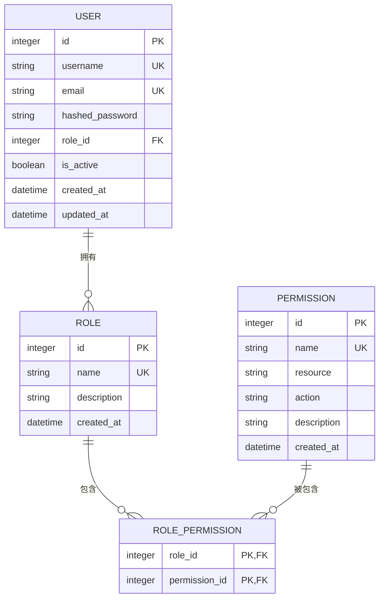
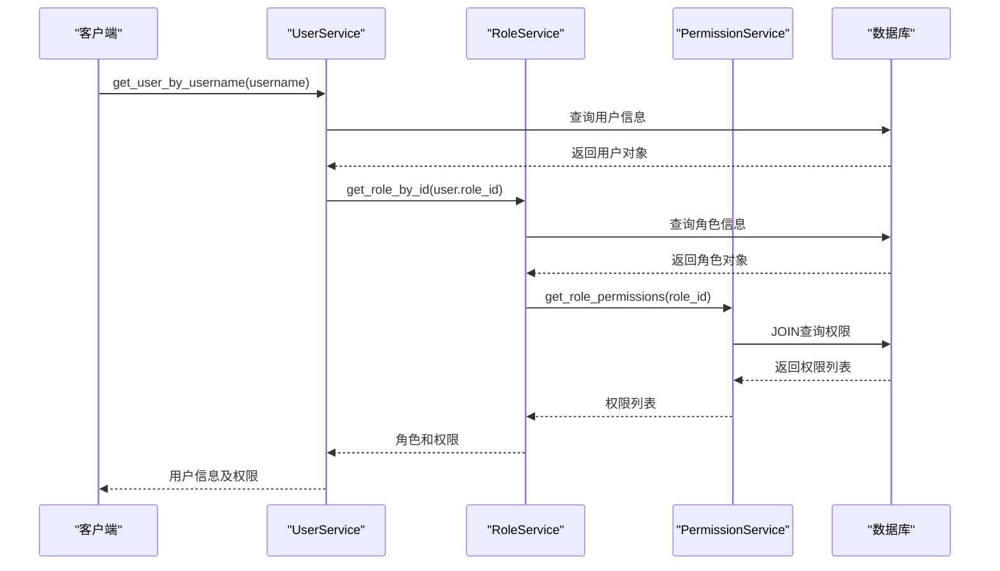

# RBAC模型设计

<cite>
**本文档引用的文件**  
- [user.py](file://zquant/models/user.py)
- [permission.py](file://zquant/services/permission.py)
- [role.py](file://zquant/services/role.py)
- [permissions.py](file://zquant/api/v1/permissions.py)
- [roles.py](file://zquant/api/v1/roles.py)
- [users.py](file://zquant/api/v1/users.py)
- [core/permissions.py](file://zquant/core/permissions.py)
- [init_db.py](file://zquant/scripts/init_db.py)
- [user.py](file://zquant/schemas/user.py)
</cite>

## 目录
1. [简介](#简介)
2. [核心模型设计](#核心模型设计)
3. [角色权限关联表](#角色权限关联表)
4. [数据库关系与约束](#数据库关系与约束)
5. [模型使用示例](#模型使用示例)
6. [权限验证机制](#权限验证机制)
7. [性能优化建议](#性能优化建议)
8. [总结](#总结)

## 简介

zquant平台采用基于角色的访问控制（RBAC）模型来管理用户权限。该模型通过用户（User）、角色（Role）和权限（Permission）三个核心实体的组合，实现了灵活且安全的权限管理体系。本文档详细阐述了这三个核心模型的设计原理、字段定义、数据库关系以及实际使用方式。

**Section sources**
- [user.py](file://zquant/models/user.py#L23-L113)

## 核心模型设计

zquant的RBAC模型由三个核心数据库模型构成：用户（User）、角色（Role）和权限（Permission）。每个模型都有明确的职责和字段定义，共同构建了完整的权限控制体系。

### 用户模型（User）

用户模型代表系统中的账户实体，是权限分配的最终目标。每个用户都归属于一个角色，通过角色间接获得相应的权限。

**字段定义：**
- `id`: 主键，整数类型，自增索引
- `username`: 用户名，字符串类型（50字符），唯一且带索引
- `email`: 邮箱地址，字符串类型（100字符），唯一且带索引
- `hashed_password`: 加密后的密码，字符串类型（255字符），不可为空
- `role_id`: 外键，关联到角色表（zq_app_roles.id），不可为空
- `is_active`: 布尔值，表示用户是否激活，默认为True
- `created_at`: 创建时间，使用数据库默认值（当前时间）
- `updated_at`: 更新时间，每次更新时自动更新为当前时间

**约束条件：**
- `username` 和 `email` 字段具有唯一性约束，防止重复注册
- `role_id` 字段具有外键约束，确保用户必须关联一个有效的角色
- 所有关键字段都建立了数据库索引，以提高查询性能

**Section sources**
- [user.py](file://zquant/models/user.py#L74-L94)

### 角色模型（Role）

角色模型是权限分配的中间层，代表一组预定义的权限集合。通过将权限分配给角色，再将角色分配给用户，实现了权限管理的灵活性和可维护性。

**字段定义：**
- `id`: 主键，整数类型，自增索引
- `name`: 角色名称，字符串类型（50字符），唯一且带索引
- `description`: 角色描述，字符串类型（255字符），可为空
- `created_at`: 创建时间，使用数据库默认值（当前时间）

**约束条件：**
- `name` 字段具有唯一性约束，确保角色名称不重复
- `name` 字段建立了索引，便于快速查询
- 在删除角色前，系统会检查是否有用户正在使用该角色，如果有则禁止删除，确保数据完整性

**Section sources**
- [user.py](file://zquant/models/user.py#L34-L47)

### 权限模型（Permission）

权限模型是权限体系的最小单位，代表对特定资源的特定操作。权限采用"资源:操作"的命名方式，如"user:create"表示"创建用户"的权限。

**字段定义：**
- `id`: 主键，整数类型，自增索引
- `name`: 权限名称，字符串类型（100字符），唯一且带索引
- `resource`: 资源类型，字符串类型（50字符），表示操作的资源，如：user, data, backtest
- `action`: 操作类型，字符串类型（50字符），表示具体的操作，如：create, read, update, delete
- `description`: 权限描述，字符串类型（255字符），可为空
- `created_at`: 创建时间，使用数据库默认值（当前时间）

**约束条件：**
- `name` 字段具有唯一性约束，确保权限名称不重复
- `name`、`resource`和`action`字段都建立了索引，优化查询性能
- 在删除权限前，系统会检查是否有角色使用该权限，如果有则禁止删除，确保数据完整性

**Section sources**
- [user.py](file://zquant/models/user.py#L49-L63)

## 角色权限关联表

### 设计目的

`RolePermission`表是实现角色与权限之间多对多关系的关键。在关系型数据库中，两个实体之间的多对多关系需要通过一个关联表（也称为连接表或中间表）来实现。`RolePermission`表的设计目的包括：

1. **实现灵活的权限分配**：一个角色可以拥有多个权限，一个权限也可以被分配给多个角色，这种灵活性使得权限管理更加高效。
2. **解耦角色与权限**：角色和权限两个模型保持独立，通过关联表建立关系，降低了系统的耦合度。
3. **支持动态权限管理**：可以随时为角色添加或移除权限，而不需要修改角色或权限模型的结构。

### 实现方式

`RolePermission`表的结构非常简洁，只包含两个字段：

- `role_id`: 外键，关联到角色表（zq_app_roles.id），作为复合主键的一部分
- `permission_id`: 外键，关联到权限表（zq_app_permissions.id），作为复合主键的一部分

**关键特性：**
- **复合主键**：`role_id`和`permission_id`共同构成复合主键，确保了同一角色不能重复拥有同一权限，保证了数据的唯一性。
- **外键约束**：两个字段都设置了外键约束，确保只能关联存在的角色和权限，维护了数据的完整性。
- **级联删除**：当删除角色或权限时，相关的关联记录会自动被删除，避免了孤儿记录的产生。



**Diagram sources**
- [user.py](file://zquant/models/user.py#L65-L73)

**Section sources**
- [user.py](file://zquant/models/user.py#L65-L73)

## 数据库关系与约束

zquant的RBAC模型通过精心设计的外键约束、索引和数据完整性保障机制，确保了系统的稳定性和数据的一致性。

### 外键约束

系统中存在以下外键约束：
- `zq_app_users.role_id` → `zq_app_roles.id`：确保每个用户都关联到一个有效的角色
- `zq_app_role_permissions.role_id` → `zq_app_roles.id`：确保关联表中的角色ID有效
- `zq_app_role_permissions.permission_id` → `zq_app_permissions.id`：确保关联表中的权限ID有效

这些外键约束在数据库层面防止了无效引用的产生，保证了数据的参照完整性。

### 索引设计

为了优化查询性能，系统在关键字段上建立了索引：
- `zq_app_users`表：`username`, `email`, `role_id`字段
- `zq_app_roles`表：`name`字段
- `zq_app_permissions`表：`name`, `resource`, `action`字段
- `zq_app_role_permissions`表：`role_id`, `permission_id`字段

这些索引显著提高了基于这些字段的查询速度，特别是在用户登录、权限验证等高频操作中。

### 数据完整性保障

系统通过多种机制保障数据完整性：
1. **唯一性约束**：用户名、邮箱、角色名、权限名等关键字段都设置了唯一性约束，防止重复数据。
2. **业务逻辑验证**：在服务层（Service Layer）对创建和更新操作进行验证，如检查角色名是否已存在。
3. **删除保护**：在删除角色或权限前，系统会检查是否有用户或角色正在使用它们，如果有则禁止删除。
4. **事务管理**：所有数据库操作都在事务中执行，确保操作的原子性，要么全部成功，要么全部回滚。

**Section sources**
- [user.py](file://zquant/models/user.py#L34-L113)

## 模型使用示例

### 查询用户角色权限

系统提供了多种方式来查询用户的权限信息。以下是一个典型的权限查询流程：

1. 通过用户名查询用户信息
2. 根据用户的角色ID查询角色信息
3. 查询该角色拥有的所有权限

这个过程可以通过数据库的JOIN操作高效完成，或者利用ORM框架的懒加载或预加载功能。



**Diagram sources**
- [users.py](file://zquant/api/v1/users.py#L138-L145)
- [roles.py](file://zquant/api/v1/roles.py#L65-L82)
- [permissions.py](file://zquant/api/v1/permissions.py#L62-L71)

### 验证权限归属

权限验证是RBAC模型的核心功能。系统通过`check_permission`装饰器来实现权限检查：

```python
@check_permission("user", "read")
def get_users():
    # 只有拥有"user:read"权限的用户才能执行此操作
    pass
```

验证流程如下：
1. 从JWT令牌中获取当前用户信息
2. 查询用户的角色
3. 检查该角色是否拥有请求的权限（resource:action）
4. 如果有权限，继续执行；否则返回403错误

**Section sources**
- [core/permissions.py](file://zquant/core/permissions.py#L38-L80)
- [users.py](file://zquant/api/v1/users.py#L51-L53)

## 权限验证机制

zquant平台的权限验证机制基于装饰器模式实现，提供了声明式的权限控制方式。

### 装饰器实现

`check_permission`装饰器是权限验证的核心。它接收资源类型和操作类型作为参数，然后包装目标函数，在函数执行前进行权限检查。

**工作流程：**
1. 装饰器捕获函数调用
2. 从依赖注入中获取当前用户和数据库会话
3. 调用`has_permission`函数进行实际的权限检查
4. 如果权限检查通过，执行原函数；否则抛出403异常

### 权限检查逻辑

`has_permission`函数的实现采用了JOIN查询，直接在数据库层面检查用户角色是否拥有指定权限，避免了多次查询的开销。

```python
def has_permission(db: Session, user: User, resource: str, action: str) -> bool:
    permission = (
        db.query(Permission)
        .join(Role.permissions)
        .filter(Permission.resource == resource, Permission.action == action, Role.id == user.role_id)
        .first()
    )
    return permission is not None
```

这种实现方式高效且准确，确保了权限验证的性能和可靠性。

**Section sources**
- [core/permissions.py](file://zquant/core/permissions.py#L38-L80)

## 性能优化建议

为了确保RBAC模型在高并发场景下的性能，建议采取以下优化措施：

### 缓存策略

1. **角色权限缓存**：将角色的权限列表缓存在Redis中，避免频繁的数据库查询。
2. **用户角色缓存**：将用户的简要信息（包括角色ID）缓存在会话或Redis中，减少用户信息查询。
3. **缓存失效机制**：当权限或角色发生变化时，及时清除相关缓存，确保数据一致性。

### 数据库优化

1. **复合索引**：在`zq_app_role_permissions`表上创建`(role_id, permission_id)`的复合索引，优化JOIN查询性能。
2. **查询优化**：使用预加载（eager loading）避免N+1查询问题，特别是在查询用户列表时。
3. **分页查询**：对于权限和角色的列表查询，始终使用分页，避免一次性加载过多数据。

### 代码层面优化

1. **批量操作**：在为角色分配多个权限时，使用批量插入而不是逐个插入。
2. **连接池**：配置合适的数据库连接池大小，避免连接瓶颈。
3. **异步处理**：对于非关键的权限检查，可以考虑使用异步方式，提高响应速度。

**Section sources**
- [role.py](file://zquant/services/role.py#L163-L187)
- [permission.py](file://zquant/services/permission.py#L74-L109)

## 总结

zquant平台的RBAC模型设计合理，通过用户、角色和权限三个核心模型的有机结合，实现了灵活、安全且易于维护的权限管理体系。模型间通过外键约束和关联表建立了清晰的关系，确保了数据的完整性和一致性。系统提供了丰富的API和服务方法，支持权限的创建、查询、更新和删除操作，同时通过装饰器模式实现了声明式的权限验证。通过合理的索引设计和潜在的缓存优化，该模型能够满足高性能要求，为平台的安全运行提供了坚实的基础。

**Section sources**
- [user.py](file://zquant/models/user.py#L34-L113)
- [init_db.py](file://zquant/scripts/init_db.py#L114-L256)