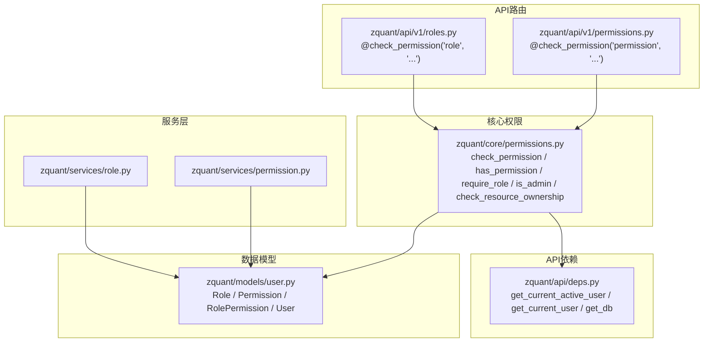
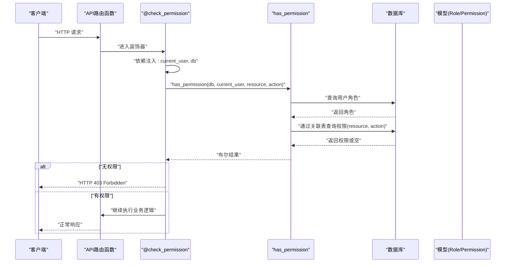
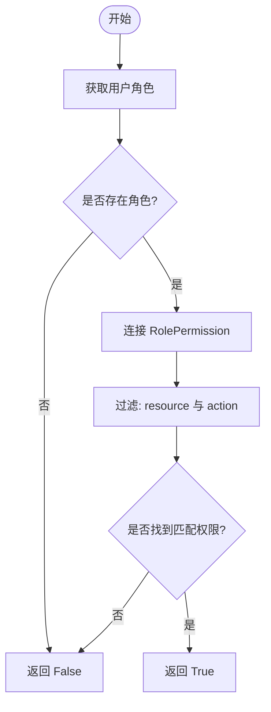
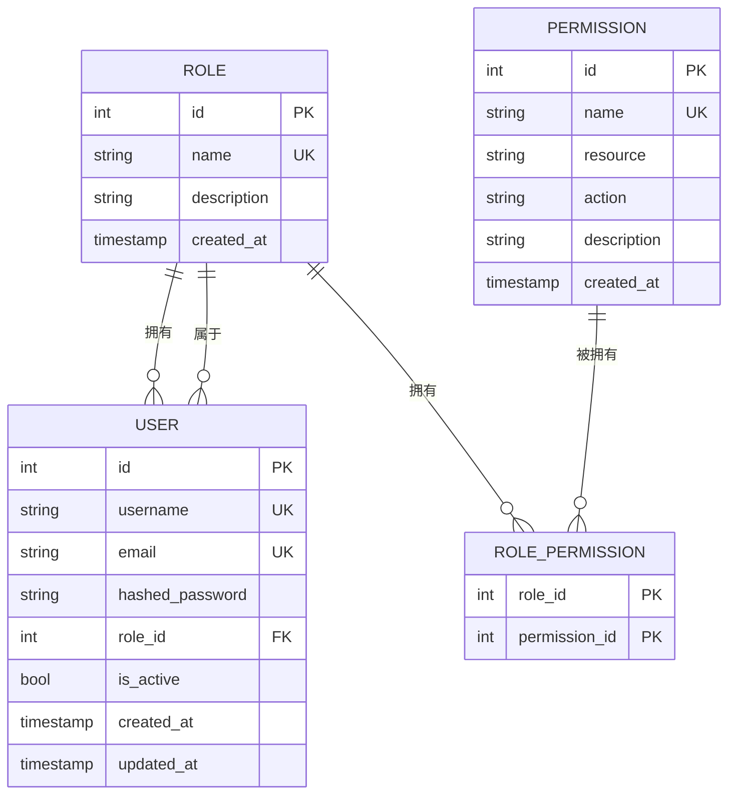
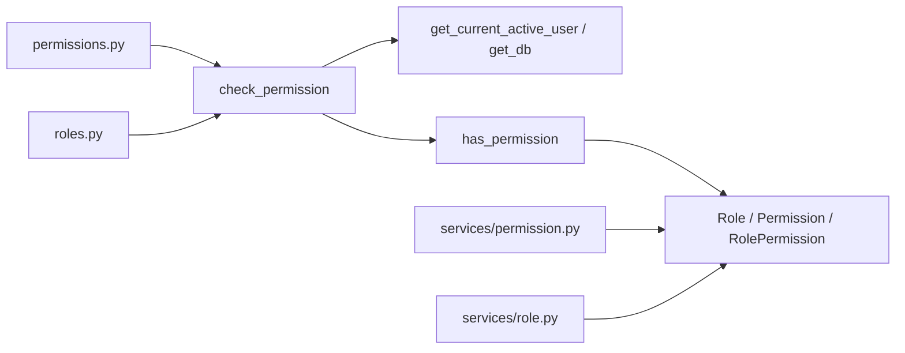

# 权限校验机制

<cite>
**本文引用的文件**
- [zquant/core/permissions.py](file://zquant/core/permissions.py)
- [zquant/api/deps.py](file://zquant/api/deps.py)
- [zquant/models/user.py](file://zquant/models/user.py)
- [zquant/api/v1/permissions.py](file://zquant/api/v1/permissions.py)
- [zquant/api/v1/roles.py](file://zquant/api/v1/roles.py)
- [zquant/services/permission.py](file://zquant/services/permission.py)
- [zquant/services/role.py](file://zquant/services/role.py)
- [zquant/schemas/user.py](file://zquant/schemas/user.py)
</cite>

## 目录
1. [简介](#简介)
2. [项目结构](#项目结构)
3. [核心组件](#核心组件)
4. [架构总览](#架构总览)
5. [详细组件分析](#详细组件分析)
6. [依赖关系分析](#依赖关系分析)
7. [性能考量](#性能考量)
8. [故障排查指南](#故障排查指南)
9. [结论](#结论)

## 简介
本文件系统性阐述 zquant 的权限校验机制，重点围绕以下目标展开：
- 解释 check_permission 装饰器的工作原理，包括资源(resource)与操作(action)的组合策略
- 说明通过依赖注入获取当前活跃用户与数据库会话的方式
- 详解 has_permission 函数的查询逻辑，尤其是基于角色关联查询权限的 SQL 实现思路
- 描述 require_role 装饰器的使用场景与实现细节
- 介绍 is_admin 与 check_resource_ownership 等辅助函数的应用
- 提供在 API 路由中使用这些装饰器的具体示例路径
- 分析权限校验失败时的异常处理流程与 HTTP 403 响应生成机制

## 项目结构
权限相关代码主要分布在如下位置：
- 核心权限逻辑：zquant/core/permissions.py
- API 依赖注入：zquant/api/deps.py
- 数据模型：zquant/models/user.py（Role、Permission、RolePermission、User）
- API 路由层：zquant/api/v1/permissions.py、zquant/api/v1/roles.py
- 服务层：zquant/services/permission.py、zquant/services/role.py
- Pydantic 模型：zquant/schemas/user.py

图表来源
- [zquant/core/permissions.py](file://zquant/core/permissions.py#L38-L111)
- [zquant/api/deps.py](file://zquant/api/deps.py#L41-L93)
- [zquant/models/user.py](file://zquant/models/user.py#L34-L113)
- [zquant/api/v1/permissions.py](file://zquant/api/v1/permissions.py#L41-L120)
- [zquant/api/v1/roles.py](file://zquant/api/v1/roles.py#L49-L194)
- [zquant/services/permission.py](file://zquant/services/permission.py#L36-L177)
- [zquant/services/role.py](file://zquant/services/role.py#L112-L243)

章节来源
- [zquant/core/permissions.py](file://zquant/core/permissions.py#L38-L111)
- [zquant/api/deps.py](file://zquant/api/deps.py#L41-L93)
- [zquant/models/user.py](file://zquant/models/user.py#L34-L113)
- [zquant/api/v1/permissions.py](file://zquant/api/v1/permissions.py#L41-L120)
- [zquant/api/v1/roles.py](file://zquant/api/v1/roles.py#L49-L194)
- [zquant/services/permission.py](file://zquant/services/permission.py#L36-L177)
- [zquant/services/role.py](file://zquant/services/role.py#L112-L243)

## 核心组件
- 权限装饰器 check_permission(resource, action)
  - 作用：在路由函数执行前，检查当前用户是否具备指定资源与操作的权限
  - 依赖注入：自动注入 get_current_active_user 与 get_db
  - 失败处理：抛出 HTTP 403 Forbidden 异常
- 权限查询 has_permission(db, user, resource, action)
  - 逻辑：先获取用户角色，再通过角色与权限的多对多关联表查询是否存在匹配的 resource+action
- 角色级装饰器 require_role(role_name)
  - 作用：仅允许具备指定角色名的用户访问
  - 失败处理：抛出 HTTP 403 Forbidden 异常
- 辅助函数
  - is_admin(user, db)：判断用户是否为管理员
  - check_resource_ownership(user, resource_user_id)：资源所有权校验（用于资源隔离）

章节来源
- [zquant/core/permissions.py](file://zquant/core/permissions.py#L38-L111)

## 架构总览
权限校验的整体调用链如下：
- API 路由函数通过 @check_permission(...) 装饰器声明所需权限
- 装饰器通过依赖注入获取当前活跃用户与数据库会话
- 调用 has_permission(db, user, resource, action) 进行权限判定
- 若无权限，抛出 HTTP 403；否则继续执行业务逻辑

图表来源
- [zquant/core/permissions.py](file://zquant/core/permissions.py#L38-L111)
- [zquant/api/deps.py](file://zquant/api/deps.py#L41-L93)
- [zquant/models/user.py](file://zquant/models/user.py#L34-L113)

## 详细组件分析

### check_permission 装饰器
- 参数
  - resource：资源类型，如 "permission"、"role"、"user"、"data"、"backtest" 等
  - action：操作类型，如 "create"、"read"、"update"、"delete"
- 行为
  - 在函数执行前，通过依赖注入获取 current_user 与 db
  - 调用 has_permission 判断权限
  - 无权限时抛出 HTTP 403
- 典型使用
  - 在权限管理 API 中，@check_permission("permission", "read|create|update|delete") 保护各端点
  - 在角色管理 API 中，@check_permission("role", "read|create|update|delete") 保护各端点

章节来源
- [zquant/core/permissions.py](file://zquant/core/permissions.py#L38-L61)
- [zquant/api/v1/permissions.py](file://zquant/api/v1/permissions.py#L41-L120)
- [zquant/api/v1/roles.py](file://zquant/api/v1/roles.py#L49-L194)

### has_permission 查询逻辑
- 步骤
  - 从 User 获取其 role_id 对应的角色
  - 通过 Role.permissions 关联查询 Permission，过滤条件为 resource 与 action 匹配
- SQL 思路
  - 本质是连接 Role 与 Permission 的中间表 RolePermission，按 resource 与 action 进行过滤
  - 返回是否存在匹配记录
- 复杂度
  - 单次查询，复杂度 O(1)（索引命中），受中间表与权限数量影响

图表来源
- [zquant/core/permissions.py](file://zquant/core/permissions.py#L64-L79)
- [zquant/models/user.py](file://zquant/models/user.py#L34-L113)

章节来源
- [zquant/core/permissions.py](file://zquant/core/permissions.py#L64-L79)
- [zquant/models/user.py](file://zquant/models/user.py#L34-L113)

### require_role 装饰器
- 用途
  - 仅允许具备指定角色名的用户访问，例如 "admin"
- 行为
  - 通过 db 查询当前用户的 Role，比较 name
  - 不满足则抛出 HTTP 403
- 注意
  - 需要显式传入 db（装饰器内部会从 kwargs 中提取）

章节来源
- [zquant/core/permissions.py](file://zquant/core/permissions.py#L82-L99)

### is_admin 与 check_resource_ownership 辅助函数
- is_admin(user, db)
  - 通过角色名判断是否为管理员
- check_resource_ownership(user, resource_user_id)
  - 用于资源隔离，确保当前用户仅能访问自身拥有的资源

章节来源
- [zquant/core/permissions.py](file://zquant/core/permissions.py#L102-L111)

### API 路由中的使用示例
- 权限管理 API
  - 列表查询、详情查询、创建、更新、删除均使用 @check_permission("permission", "...") 保护
  - 示例路径参考：
    - [zquant/api/v1/permissions.py](file://zquant/api/v1/permissions.py#L41-L120)
- 角色管理 API
  - 列表查询、详情查询、创建、更新、删除、分配/添加/移除权限均使用 @check_permission("role", "...") 保护
  - 示例路径参考：
    - [zquant/api/v1/roles.py](file://zquant/api/v1/roles.py#L49-L194)

章节来源
- [zquant/api/v1/permissions.py](file://zquant/api/v1/permissions.py#L41-L120)
- [zquant/api/v1/roles.py](file://zquant/api/v1/roles.py#L49-L194)

### 依赖注入与活跃用户获取
- get_current_active_user
  - 通过 HTTP Bearer Token 获取当前用户
  - 若用户非活跃，抛出 HTTP 403
- get_current_user
  - 从 Token 解析用户，处理数据库表不存在等异常
- get_db
  - 提供 SQLAlchemy Session

章节来源
- [zquant/api/deps.py](file://zquant/api/deps.py#L41-L93)

### 数据模型与关系
- Role
  - 与 User 一对多（外键 role_id）
  - 与 Permission 多对多（通过 RolePermission 关联）
- Permission
  - 字段包含 resource 与 action，构成权限标识
- RolePermission
  - 中间表，建立角色与权限的多对多关系
- User
  - 持有 role_id，用于权限判定

图表来源
- [zquant/models/user.py](file://zquant/models/user.py#L34-L113)

章节来源
- [zquant/models/user.py](file://zquant/models/user.py#L34-L113)

### 异常处理与 HTTP 403 流程
- 权限不足
  - check_permission 在 has_permission 返回 False 时，抛出 HTTP 403
- 用户非活跃
  - get_current_active_user 在用户 is_active 为 False 时，抛出 HTTP 403
- 其他常见异常
  - NotFoundError：资源不存在
  - ValidationError：参数或业务校验失败
  - AuthenticationError：认证失败
  - 数据库表不存在：返回 503 并提示初始化脚本

章节来源
- [zquant/core/permissions.py](file://zquant/core/permissions.py#L38-L61)
- [zquant/api/deps.py](file://zquant/api/deps.py#L70-L75)

## 依赖关系分析
- 装饰器依赖
  - check_permission 依赖 get_current_active_user 与 get_db
  - has_permission 依赖 Role、Permission、RolePermission 模型
- 路由依赖
  - 权限与角色 API 路由均依赖 @check_permission
  - 服务层依赖 SQLAlchemy 模型与数据库会话
- 服务层依赖
  - PermissionService/RoleService 通过 RolePermission 关联表进行权限/角色权限管理

图表来源
- [zquant/core/permissions.py](file://zquant/core/permissions.py#L38-L111)
- [zquant/api/deps.py](file://zquant/api/deps.py#L41-L93)
- [zquant/models/user.py](file://zquant/models/user.py#L34-L113)
- [zquant/api/v1/permissions.py](file://zquant/api/v1/permissions.py#L41-L120)
- [zquant/api/v1/roles.py](file://zquant/api/v1/roles.py#L49-L194)
- [zquant/services/permission.py](file://zquant/services/permission.py#L36-L177)
- [zquant/services/role.py](file://zquant/services/role.py#L112-L243)

章节来源
- [zquant/core/permissions.py](file://zquant/core/permissions.py#L38-L111)
- [zquant/api/deps.py](file://zquant/api/deps.py#L41-L93)
- [zquant/models/user.py](file://zquant/models/user.py#L34-L113)
- [zquant/api/v1/permissions.py](file://zquant/api/v1/permissions.py#L41-L120)
- [zquant/api/v1/roles.py](file://zquant/api/v1/roles.py#L49-L194)
- [zquant/services/permission.py](file://zquant/services/permission.py#L36-L177)
- [zquant/services/role.py](file://zquant/services/role.py#L112-L243)

## 性能考量
- has_permission 查询
  - 通过 join Role.permissions 与 RolePermission 中间表，过滤 resource 与 action
  - 建议在 resource、action、role_id 上建立索引以提升查询效率
- 依赖注入
  - get_current_active_user 与 get_db 为轻量依赖，避免重复解析 Token 与创建 Session
- 服务层事务
  - 服务层对数据库写操作采用提交/回滚，建议批量操作时合并提交以减少 IO

[本节为通用性能建议，无需列出具体文件来源]

## 故障排查指南
- 403 Forbidden
  - 检查当前用户是否具备对应 resource+action 权限
  - 确认用户角色是否正确绑定到权限
  - 参考路径：
    - [zquant/core/permissions.py](file://zquant/core/permissions.py#L38-L61)
- 401 Unauthorized
  - Token 缺失或无效，或数据库表未初始化
  - 参考路径：
    - [zquant/api/deps.py](file://zquant/api/deps.py#L41-L93)
- 404 Not Found
  - 访问不存在的权限/角色 ID
  - 参考路径：
    - [zquant/api/v1/permissions.py](file://zquant/api/v1/permissions.py#L62-L71)
    - [zquant/api/v1/roles.py](file://zquant/api/v1/roles.py#L65-L72)
- 400 Bad Request
  - 参数校验失败或业务校验失败
  - 参考路径：
    - [zquant/services/permission.py](file://zquant/services/permission.py#L116-L177)
    - [zquant/services/role.py](file://zquant/services/role.py#L112-L243)

章节来源
- [zquant/core/permissions.py](file://zquant/core/permissions.py#L38-L61)
- [zquant/api/deps.py](file://zquant/api/deps.py#L41-L93)
- [zquant/api/v1/permissions.py](file://zquant/api/v1/permissions.py#L62-L71)
- [zquant/api/v1/roles.py](file://zquant/api/v1/roles.py#L65-L72)
- [zquant/services/permission.py](file://zquant/services/permission.py#L116-L177)
- [zquant/services/role.py](file://zquant/services/role.py#L112-L243)

## 结论
zquant 的权限体系以 check_permission 为核心，结合 has_permission 的角色-权限关联查询，形成简洁而高效的权限控制机制。配合 require_role、is_admin、check_resource_ownership 等辅助能力，既满足细粒度资源操作控制，又支持角色级访问限制与资源隔离。API 层通过装饰器统一接入，异常处理清晰，便于维护与扩展。