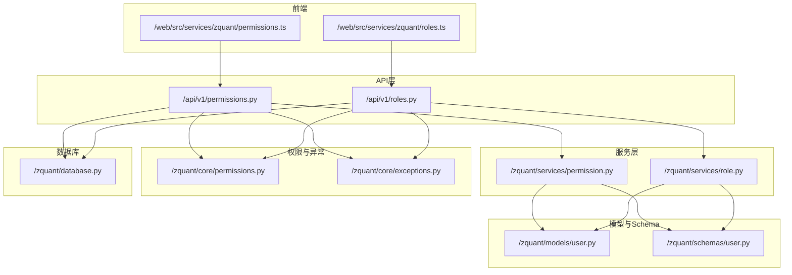
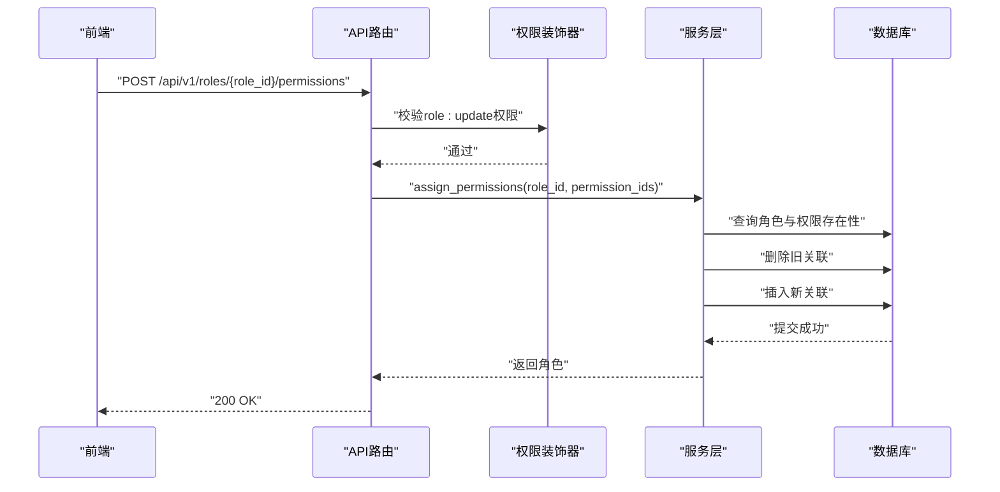
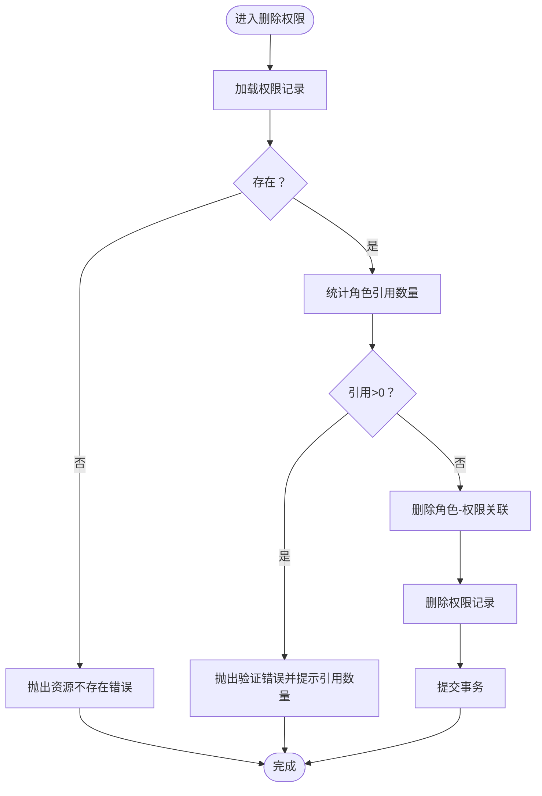
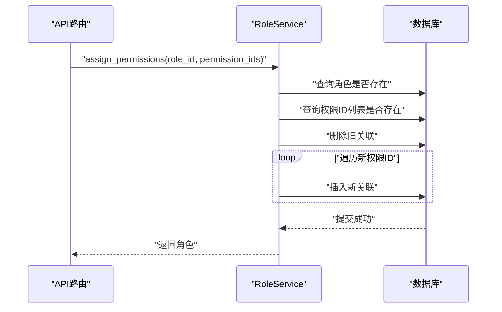
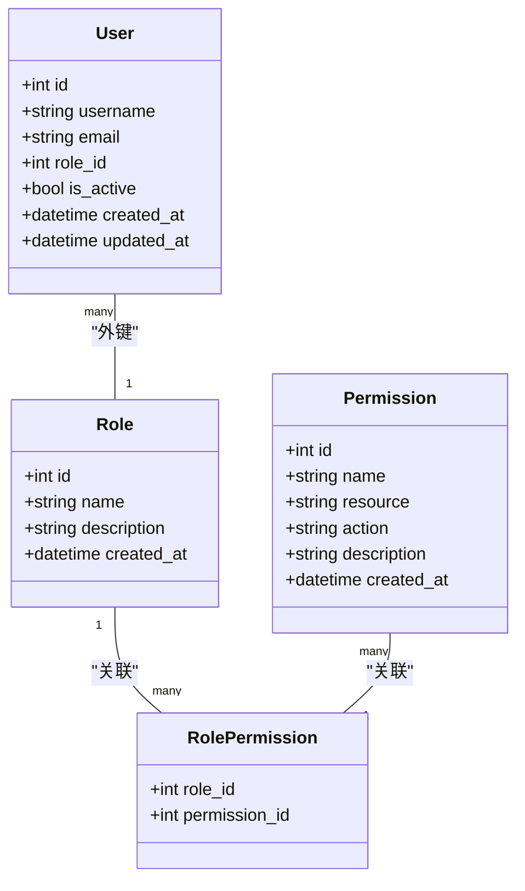

# 角色与权限管理

<cite>
**本文引用的文件**
- [zquant/services/permission.py](file://zquant/services/permission.py)
- [zquant/services/role.py](file://zquant/services/role.py)
- [zquant/api/v1/permissions.py](file://zquant/api/v1/permissions.py)
- [zquant/api/v1/roles.py](file://zquant/api/v1/roles.py)
- [zquant/models/user.py](file://zquant/models/user.py)
- [zquant/schemas/user.py](file://zquant/schemas/user.py)
- [zquant/core/exceptions.py](file://zquant/core/exceptions.py)
- [zquant/core/permissions.py](file://zquant/core/permissions.py)
- [zquant/database.py](file://zquant/database.py)
- [web/src/services/zquant/permissions.ts](file://web/src/services/zquant/permissions.ts)
- [web/src/services/zquant/roles.ts](file://web/src/services/zquant/roles.ts)
- [zquant/scripts/init_db.py](file://zquant/scripts/init_db.py)
</cite>

## 目录
1. [简介](#简介)
2. [项目结构](#项目结构)
3. [核心组件](#核心组件)
4. [架构总览](#架构总览)
5. [详细组件分析](#详细组件分析)
6. [依赖关系分析](#依赖关系分析)
7. [性能考量](#性能考量)
8. [故障排查指南](#故障排查指南)
9. [结论](#结论)
10. [附录](#附录)

## 简介
本文件面向zquant的角色与权限管理子系统，围绕PermissionService与RoleService两个服务类展开，系统化阐述其CRUD能力、唯一性约束与数据完整性校验、异常处理机制、批量分配权限的事务流程，以及删除角色或权限时的级联检查逻辑。同时给出API调用示例、分页/排序/过滤实现方式及最佳实践，帮助开发者快速理解并安全地集成与扩展权限体系。

## 项目结构
- 后端服务层位于zquant/services，分别提供权限与角色的服务实现。
- API层位于zquant/api/v1，暴露REST接口并对权限进行装饰器校验。
- 数据模型位于zquant/models/user.py，定义角色、权限、用户及角色-权限关联表。
- Pydantic Schema位于zquant/schemas/user.py，统一请求/响应结构。
- 权限检查与装饰器位于zquant/core/permissions.py。
- 异常类型位于zquant/core/exceptions.py。
- 数据库会话管理位于zquant/database.py。
- 前端调用封装位于web/src/services/zquant/*。

图表来源
- [zquant/api/v1/permissions.py](file://zquant/api/v1/permissions.py#L1-L120)
- [zquant/api/v1/roles.py](file://zquant/api/v1/roles.py#L1-L194)
- [zquant/services/permission.py](file://zquant/services/permission.py#L1-L178)
- [zquant/services/role.py](file://zquant/services/role.py#L1-L244)
- [zquant/models/user.py](file://zquant/models/user.py#L1-L113)
- [zquant/schemas/user.py](file://zquant/schemas/user.py#L1-L376)
- [zquant/core/permissions.py](file://zquant/core/permissions.py#L1-L111)
- [zquant/core/exceptions.py](file://zquant/core/exceptions.py#L1-L54)
- [zquant/database.py](file://zquant/database.py#L77-L154)
- [web/src/services/zquant/permissions.ts](file://web/src/services/zquant/permissions.ts#L1-L92)
- [web/src/services/zquant/roles.ts](file://web/src/services/zquant/roles.ts#L1-L135)

章节来源
- [zquant/api/v1/permissions.py](file://zquant/api/v1/permissions.py#L1-L120)
- [zquant/api/v1/roles.py](file://zquant/api/v1/roles.py#L1-L194)
- [zquant/services/permission.py](file://zquant/services/permission.py#L1-L178)
- [zquant/services/role.py](file://zquant/services/role.py#L1-L244)
- [zquant/models/user.py](file://zquant/models/user.py#L1-L113)
- [zquant/schemas/user.py](file://zquant/schemas/user.py#L1-L376)
- [zquant/core/permissions.py](file://zquant/core/permissions.py#L1-L111)
- [zquant/core/exceptions.py](file://zquant/core/exceptions.py#L1-L54)
- [zquant/database.py](file://zquant/database.py#L77-L154)
- [web/src/services/zquant/permissions.ts](file://web/src/services/zquant/permissions.ts#L1-L92)
- [web/src/services/zquant/roles.ts](file://web/src/services/zquant/roles.ts#L1-L135)

## 核心组件
- PermissionService：提供权限的创建、读取、更新、删除与分页/排序/过滤查询；负责权限名唯一性校验、更新时的冲突检测、删除前的角色引用检查。
- RoleService：提供角色的创建、读取、更新、删除与分页/排序查询；负责角色名唯一性校验、更新时的冲突检测、删除前的用户引用检查；提供角色权限的查询与批量分配、单个添加/移除。

章节来源
- [zquant/services/permission.py](file://zquant/services/permission.py#L36-L178)
- [zquant/services/role.py](file://zquant/services/role.py#L36-L244)

## 架构总览
后端采用“API层-服务层-模型层”的分层设计：
- API层通过装饰器校验资源与动作权限，再调用对应服务。
- 服务层对业务规则进行校验（唯一性、引用检查、权限名格式等），并以事务方式提交或回滚。
- 模型层定义角色、权限、用户与关联表，约束唯一性与外键关系。
- Schema层统一请求/响应结构，便于前后端契约一致。
- 前端通过封装好的HTTP服务调用后端API。

图表来源
- [zquant/api/v1/roles.py](file://zquant/api/v1/roles.py#L142-L158)
- [zquant/services/role.py](file://zquant/services/role.py#L163-L191)
- [zquant/core/permissions.py](file://zquant/core/permissions.py#L38-L61)

## 详细组件分析

### PermissionService（权限服务）
- 唯一性约束与完整性校验
  - 创建权限时，按权限名进行唯一性检查；若重复则抛出验证错误。
  - 更新权限时，若修改名称，需确保新名称在同角色下唯一；违反约束则抛出验证错误。
  - 删除权限前，检查是否存在角色引用（通过角色-权限关联计数），若有则禁止删除并提示具体数量。
- CRUD与查询
  - 创建：接收创建Schema，写入数据库并刷新实体。
  - 读取：按ID/名称查询；提供分页、筛选（按资源类型）、排序（默认按创建时间倒序）。
  - 更新：按ID更新，支持部分字段更新；异常捕获IntegrityError并回滚。
  - 删除：先清理关联，再删除权限，异常捕获并回滚。
- 异常处理
  - NotFoundError：资源不存在。
  - ValidationError：数据冲突/业务校验失败。
- 性能与复杂度
  - 分页查询基于offset/limit，排序字段有限集合；时间复杂度主要受查询与过滤影响。
  - 唯一性检查与引用检查均为O(n)扫描，建议配合数据库索引优化。

图表来源
- [zquant/services/permission.py](file://zquant/services/permission.py#L156-L178)

章节来源
- [zquant/services/permission.py](file://zquant/services/permission.py#L36-L178)
- [zquant/models/user.py](file://zquant/models/user.py#L34-L73)
- [zquant/schemas/user.py](file://zquant/schemas/user.py#L134-L164)
- [zquant/core/exceptions.py](file://zquant/core/exceptions.py#L28-L54)

### RoleService（角色服务）
- 唯一性约束与完整性校验
  - 创建角色时，按角色名进行唯一性检查；若重复则抛出验证错误。
  - 更新角色时，若修改名称，需确保新名称在同系统内唯一；违反约束则抛出验证错误。
  - 删除角色前，检查是否存在用户引用（按role_id计数），若有则禁止删除并提示具体数量。
- CRUD与查询
  - 创建/读取/更新/删除：与PermissionService类似，均进行唯一性与引用检查。
  - 角色权限查询：通过角色-权限关联表查询该角色的所有权限。
- 批量分配权限（assign_permissions）
  - 先删除旧的关联，再批量插入新的关联；异常捕获并回滚。
  - 若传入的权限ID列表中存在不存在的ID，会抛出资源不存在错误。
- 单个权限增删
  - add_permission：检查目标角色与权限是否存在，避免重复插入；冲突时回滚并抛出验证错误。
  - remove_permission：删除角色-权限关联，若无匹配记录则抛出资源不存在错误。
- 异常处理
  - NotFoundError：资源不存在。
  - ValidationError：数据冲突/业务校验失败。

图表来源
- [zquant/services/role.py](file://zquant/services/role.py#L163-L191)

章节来源
- [zquant/services/role.py](file://zquant/services/role.py#L36-L244)
- [zquant/models/user.py](file://zquant/models/user.py#L34-L73)
- [zquant/schemas/user.py](file://zquant/schemas/user.py#L233-L247)
- [zquant/core/exceptions.py](file://zquant/core/exceptions.py#L28-L54)

### API层调用示例与最佳实践
- 权限API
  - 列表查询：支持分页(skip/limit)、按资源类型筛选(resource)、按字段排序(order_by/order)。
  - 详情查询：按ID查询。
  - 创建/更新/删除：均需具备相应资源动作权限（如permission:create/update/delete）。
- 角色API
  - 列表查询：支持分页与排序。
  - 详情查询：返回角色基本信息与权限列表。
  - 角色权限管理：批量分配、单个添加、单个移除。
- 前端调用
  - 前端封装了权限与角色的HTTP请求方法，参数与后端一致，便于复用。

章节来源
- [zquant/api/v1/permissions.py](file://zquant/api/v1/permissions.py#L41-L120)
- [zquant/api/v1/roles.py](file://zquant/api/v1/roles.py#L49-L194)
- [web/src/services/zquant/permissions.ts](file://web/src/services/zquant/permissions.ts#L1-L92)
- [web/src/services/zquant/roles.ts](file://web/src/services/zquant/roles.ts#L1-L135)

### 分页、排序与过滤实现
- 分页
  - API层通过skip/limit控制分页；服务层使用offset/limit实现。
- 过滤
  - 权限列表支持按资源类型过滤。
- 排序
  - 权限列表支持按id/name/resource/action/created_at排序，默认按created_at倒序。
  - 角色列表支持按id/name/description/created_at排序，默认按created_at倒序。
- 最佳实践
  - 对高频查询字段建立数据库索引（如name、resource、role_id等）。
  - 控制最大limit值，防止超大分页导致性能问题。
  - 排序字段应限定在白名单内，避免任意列排序带来的SQL注入风险。

章节来源
- [zquant/api/v1/permissions.py](file://zquant/api/v1/permissions.py#L41-L59)
- [zquant/api/v1/roles.py](file://zquant/api/v1/roles.py#L49-L63)
- [zquant/services/permission.py](file://zquant/services/permission.py#L73-L109)
- [zquant/services/role.py](file://zquant/services/role.py#L72-L98)

### 级联检查与事务处理
- 级联检查
  - 删除权限前检查角色-权限关联数量，若>0则拒绝删除。
  - 删除角色前检查用户-角色关联数量，若>0则拒绝删除。
- 事务处理
  - 服务层在关键写操作（创建/更新/删除/批量分配）中显式提交或回滚。
  - 数据库会话管理器在异常时自动回滚并关闭会话，保证一致性。
- 业务规则
  - 批量分配权限时，先清空旧关联再插入新关联，确保最终状态与请求一致。
  - 单个添加权限时，若已存在则视为成功，避免重复插入。

章节来源
- [zquant/services/permission.py](file://zquant/services/permission.py#L156-L178)
- [zquant/services/role.py](file://zquant/services/role.py#L130-L152)
- [zquant/services/role.py](file://zquant/services/role.py#L163-L191)
- [zquant/database.py](file://zquant/database.py#L84-L138)

## 依赖关系分析
- 模型依赖
  - Role与Permission通过中间表RolePermission建立多对多关系。
  - User外键关联Role。
- 服务依赖
  - PermissionService/RoleService依赖数据库会话、异常类型、模型与Schema。
- API依赖
  - API路由依赖权限装饰器、数据库会话、服务层与Schema。
- 前端依赖
  - 前端服务封装了API调用，参数与后端保持一致。

图表来源
- [zquant/models/user.py](file://zquant/models/user.py#L34-L94)

章节来源
- [zquant/models/user.py](file://zquant/models/user.py#L34-L94)
- [zquant/services/permission.py](file://zquant/services/permission.py#L36-L178)
- [zquant/services/role.py](file://zquant/services/role.py#L36-L244)
- [zquant/api/v1/permissions.py](file://zquant/api/v1/permissions.py#L1-L120)
- [zquant/api/v1/roles.py](file://zquant/api/v1/roles.py#L1-L194)

## 性能考量
- 索引与查询
  - 建议为角色名、权限名、用户邮箱、角色-权限关联主键建立索引，提升唯一性检查与关联查询效率。
- 批量操作
  - 批量分配权限时，先删除旧关联再批量插入，建议在事务内一次性提交，减少往返开销。
- 分页与排序
  - 对排序字段建立索引，避免全表排序；限制最大分页大小，防止高延迟。
- 会话管理
  - 使用依赖注入的数据库会话，确保异常时自动回滚与关闭，避免连接泄漏。

[本节为通用指导，无需列出章节来源]

## 故障排查指南
- 常见错误与定位
  - 404：资源不存在（角色/权限ID无效）。
  - 400：数据冲突/业务校验失败（名称重复、引用未解除、权限ID不存在）。
  - 403：权限不足（缺少资源动作权限）。
- 定位步骤
  - 查看API层装饰器是否通过权限校验。
  - 检查服务层的唯一性与引用检查逻辑。
  - 确认数据库事务是否正常提交/回滚。
- 参考实现
  - 权限装饰器has_permission用于判断当前用户是否具备指定资源动作权限。
  - 数据库会话管理器在异常时自动回滚并关闭会话。

章节来源
- [zquant/core/permissions.py](file://zquant/core/permissions.py#L38-L80)
- [zquant/database.py](file://zquant/database.py#L84-L138)
- [zquant/api/v1/permissions.py](file://zquant/api/v1/permissions.py#L74-L120)
- [zquant/api/v1/roles.py](file://zquant/api/v1/roles.py#L85-L194)

## 结论
PermissionService与RoleService提供了完善的角色与权限管理能力，覆盖CRUD、唯一性约束、引用检查与事务一致性。API层通过权限装饰器保障访问控制，前端封装简化了调用流程。遵循本文的最佳实践与故障排查建议，可在保证数据一致性的前提下高效扩展权限体系。

[本节为总结性内容，无需列出章节来源]

## 附录
- 初始化数据示例
  - 初始化脚本会创建常用权限（如role:*、permission:*、user:*等），并为不同角色分配相应权限，便于快速上线与演示。

章节来源
- [zquant/scripts/init_db.py](file://zquant/scripts/init_db.py#L129-L221)