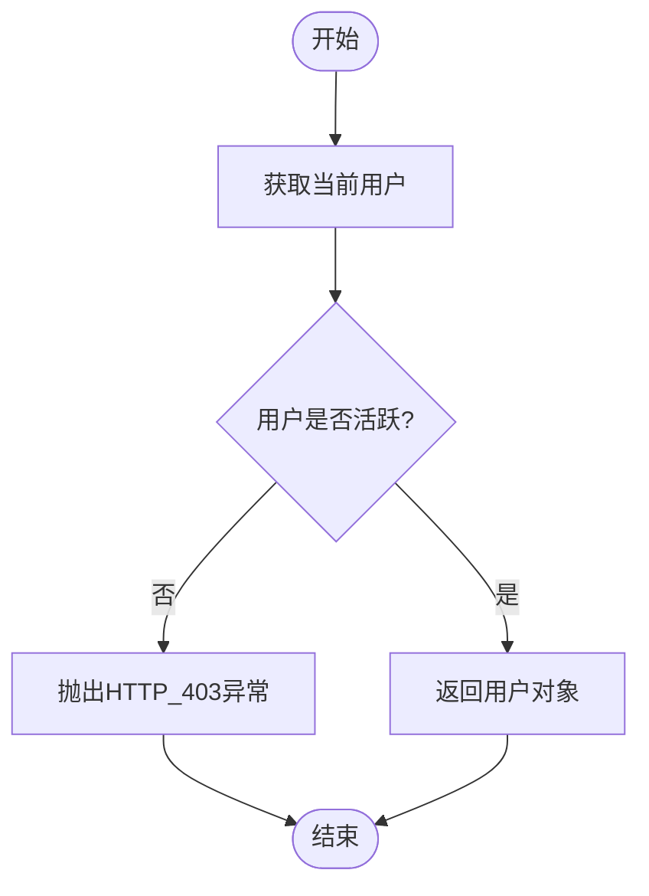
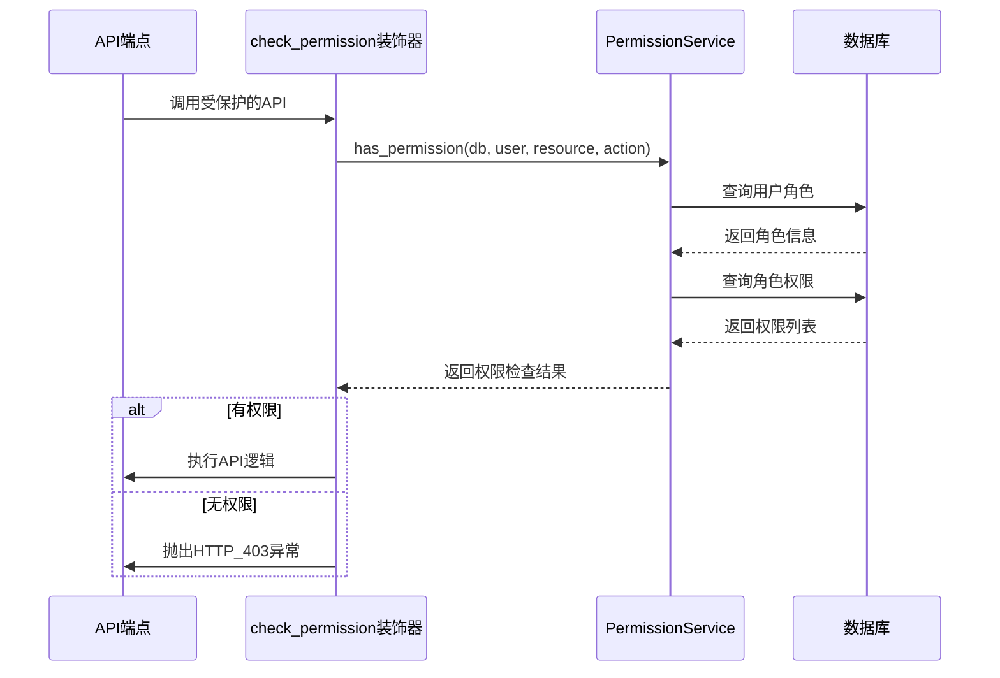
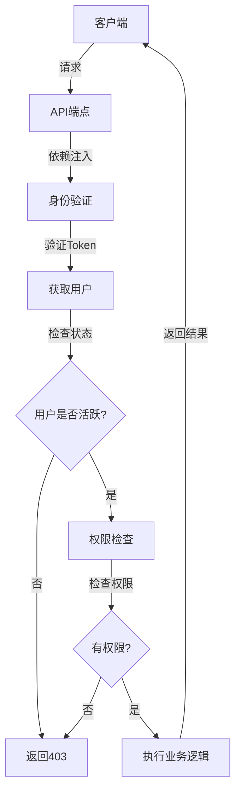
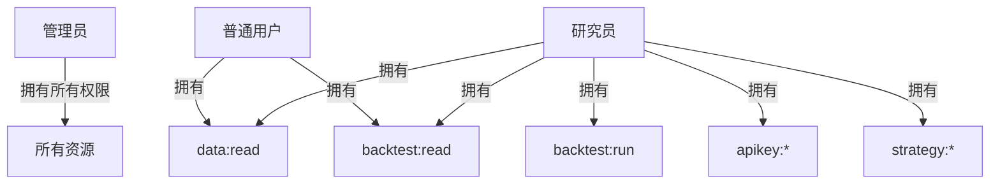
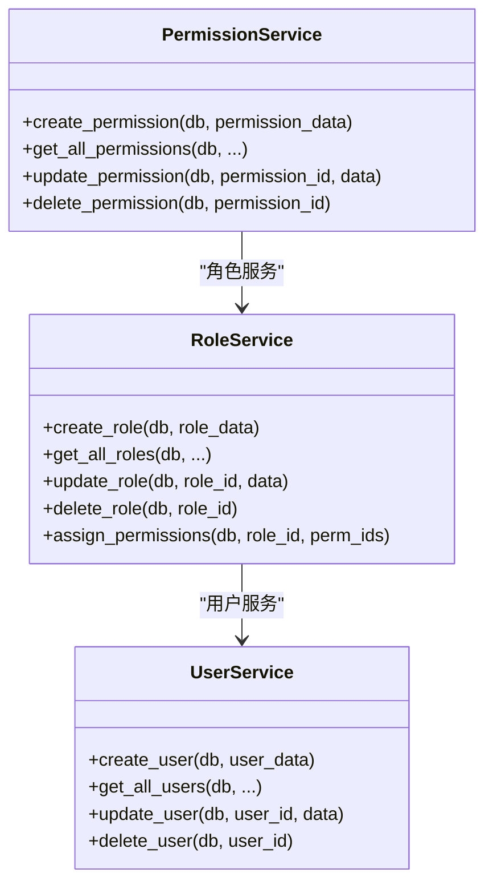
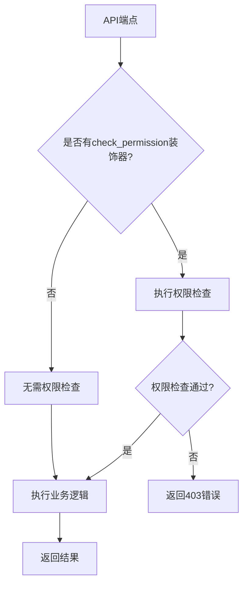

# 访问控制

<cite>
**本文档引用的文件**   
- [deps.py](file://zquant/api/deps.py)
- [permissions.py](file://zquant/core/permissions.py)
- [security.py](file://zquant/core/security.py)
- [user.py](file://zquant/models/user.py)
- [permission.py](file://zquant/services/permission.py)
- [role.py](file://zquant/services/role.py)
- [user.py](file://zquant/services/user.py)
- [permissions.py](file://zquant/api/v1/permissions.py)
- [roles.py](file://zquant/api/v1/roles.py)
- [users.py](file://zquant/api/v1/users.py)
- [auth.py](file://zquant/api/v1/auth.py)
- [roles.ts](file://web/src/services/zquant/roles.ts)
- [init_db.py](file://zquant/scripts/init_db.py)
</cite>

## 目录
1. [引言](#引言)
2. [RBAC模型设计](#rbac模型设计)
3. [权限依赖项实现](#权限依赖项实现)
4. [API路由中的权限校验](#api路由中的权限校验)
5. [角色权限分配逻辑](#角色权限分配逻辑)
6. [服务层与API层的权限控制](#服务层与api层的权限控制)
7. [权限校验失败处理](#权限校验失败处理)
8. [总结](#总结)

## 引言

zquant平台实现了基于角色的访问控制（RBAC）系统，为用户提供细粒度的权限管理机制。该系统通过用户、角色和权限三个核心概念的关联，实现了灵活的访问控制策略。本文档全面解析zquant的访问控制系统，包括模型设计、实现细节和实际应用。

## RBAC模型设计

zquant的RBAC系统基于三个核心实体：用户（User）、角色（Role）和权限（Permission）。这些实体通过数据库模型进行定义，并通过关系进行关联。

```mermaid
erDiagram
USER {
int id PK
string username UK
string email UK
int role_id FK
boolean is_active
datetime created_at
datetime updated_at
}
ROLE {
int id PK
string name UK
string description
datetime created_at
}
PERMISSION {
int id PK
string name UK
string resource
string action
string description
datetime created_at
}
ROLE_PERMISSION {
int role_id PK FK
int permission_id PK FK
}
USER ||--o{ ROLE : "拥有"
ROLE ||--o{ ROLE_PERMISSION : "包含"
PERMISSION ||--o{ ROLE_PERMISSION : "被包含"
```

**图源**
- [user.py](file://zquant/models/user.py#L34-L113)

### 用户模型

用户模型（User）是系统中的基本实体，每个用户都关联一个角色。用户表包含用户名、邮箱、密码哈希、角色ID和激活状态等字段。用户与角色之间是一对多的关系，一个角色可以被多个用户拥有。

**节源**
- [user.py](file://zquant/models/user.py#L74-L94)

### 角色模型

角色模型（Role）定义了系统中的角色类型，如管理员、研究员和普通用户。每个角色可以拥有多个权限，通过角色权限关联表（RolePermission）实现多对多关系。角色表包含名称、描述和创建时间等字段。

**节源**
- [user.py](file://zquant/models/user.py#L34-L47)

### 权限模型

权限模型（Permission）定义了系统中的具体操作权限。每个权限包含资源类型（resource）和操作类型（action），如"data:read"表示对数据资源的读取权限。权限表还包含名称、描述和创建时间等字段。

**节源**
- [user.py](file://zquant/models/user.py#L49-L63)

## 权限依赖项实现

zquant通过依赖注入机制实现了权限检查功能，主要依赖项包括`get_current_active_user`和`require_permission`。

### get_current_active_user实现

`get_current_active_user`函数是权限系统的基础，它确保当前用户是活跃状态。该函数依赖于`get_current_user`，首先验证用户的Token，然后检查用户的`is_active`状态。



**图源**
- [deps.py](file://zquant/api/deps.py#L70-L74)

### require_permission实现

`require_permission`装饰器（在代码中为`check_permission`）实现了细粒度的权限检查。它接受资源类型和操作类型作为参数，检查当前用户是否拥有相应的权限。



**图源**
- [permissions.py](file://zquant/core/permissions.py#L38-L61)

## API路由中的权限校验

zquant通过FastAPI的`Depends`注入机制，在API路由中实现了权限校验。这种设计将权限检查逻辑与业务逻辑分离，提高了代码的可维护性。

### 权限校验流程

当客户端请求受保护的API端点时，系统会按照以下流程进行权限校验：



**图源**
- [deps.py](file://zquant/api/deps.py#L41-L74)
- [permissions.py](file://zquant/core/permissions.py#L38-L61)

### 实际应用示例

在`zquant/api/v1/permissions.py`文件中，可以看到权限校验的实际应用：

```python
@router.get("", response_model=PageResponse, summary="查询权限列表")
@check_permission("permission", "read")
def get_permissions(
    skip: int = Query(0, ge=0, description="跳过记录数"),
    limit: int = Query(100, ge=1, le=1000, description="每页记录数"),
    resource: str | None = Query(None, description="资源类型筛选"),
    order_by: str | None = Query(None, description="排序字段：id, name, resource, action, created_at"),
    order: str | None = Query("desc", description="排序方向：asc 或 desc"),
    db: Session = Depends(get_db),
    current_user: User = Depends(get_current_active_user),
):
    """查询权限列表（分页、筛选、排序）"""
    # 业务逻辑
```

在此示例中，`@check_permission("permission", "read")`装饰器确保只有拥有"permission:read"权限的用户才能访问该API端点。

**节源**
- [permissions.py](file://zquant/api/v1/permissions.py#L41-L59)

## 角色权限分配逻辑

zquant系统定义了多种角色，每种角色拥有不同的权限集合。权限分配在系统初始化时完成，并可通过管理界面进行动态调整。

### 预定义角色

根据`zquant/scripts/init_db.py`文件中的初始化代码，系统预定义了以下角色及其权限：



**图源**
- [init_db.py](file://zquant/scripts/init_db.py#L175-L255)

### 角色权限管理

系统提供了完整的角色权限管理API，包括为角色分配、添加和移除权限的功能。这些功能通过`zquant/api/v1/roles.py`文件中的API端点实现：

- `POST /api/v1/roles/{role_id}/permissions`：为角色分配权限
- `POST /api/v1/roles/{role_id}/permissions/{permission_id}`：为角色添加单个权限
- `DELETE /api/v1/roles/{role_id}/permissions/{permission_id}`：移除角色的单个权限

这些API端点都使用`@check_permission("role", "update")`装饰器，确保只有拥有角色更新权限的用户才能修改角色权限。

**节源**
- [roles.py](file://zquant/api/v1/roles.py#L142-L180)

## 服务层与API层的权限控制

zquant的权限控制贯穿于服务层和API层，实现了完整的安全防护。

### 服务层权限控制

在服务层，权限检查主要通过`PermissionService`、`RoleService`和`UserService`等服务类实现。这些服务类提供了创建、查询、更新和删除权限、角色和用户的业务逻辑。



**图源**
- [permission.py](file://zquant/services/permission.py#L36-L178)
- [role.py](file://zquant/services/role.py#L36-L244)
- [user.py](file://zquant/services/user.py#L37-L222)

### API层权限控制

在API层，权限控制通过路由装饰器和依赖注入实现。每个API端点都明确声明了所需的权限，确保只有授权用户才能访问。



**图源**
- [permissions.py](file://zquant/api/v1/permissions.py)
- [roles.py](file://zquant/api/v1/roles.py)
- [users.py](file://zquant/api/v1/users.py)

## 权限校验失败处理

当权限校验失败时，zquant系统会返回标准的HTTP错误响应，主要是`HTTP_403_FORBIDDEN`状态码。

### 异常处理机制

系统通过`HTTPException`类处理权限校验失败的情况。当用户没有相应权限时，系统会抛出带有`HTTP_403_FORBIDDEN`状态码的异常。

```python
if not has_permission(db, current_user, resource, action):
    raise HTTPException(
        status_code=status.HTTP_403_FORBIDDEN, 
        detail=f"没有权限执行 {resource}:{action} 操作"
    )
```

### 错误响应格式

权限校验失败时，系统返回的错误响应遵循统一的格式：

```json
{
  "detail": "没有权限执行 permission:read 操作"
}
```

这种标准化的错误响应格式便于客户端进行错误处理和用户提示。

**节源**
- [permissions.py](file://zquant/core/permissions.py#L54-L56)

## 总结

zquant的访问控制系统通过基于角色的访问控制（RBAC）模型，实现了灵活而安全的权限管理。系统通过用户、角色和权限三个核心实体的关联，结合依赖注入和装饰器机制，在API路由中实现了细粒度的权限校验。超级管理员、研究员和普通用户等不同角色拥有不同的权限集合，满足了不同用户群体的需求。服务层和API层的权限控制相结合，确保了系统的安全性。当权限校验失败时，系统会返回标准的`HTTP_403_FORBIDDEN`错误，提供了清晰的错误提示。