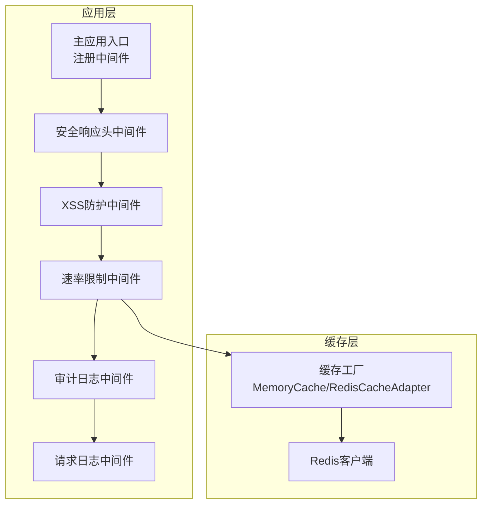
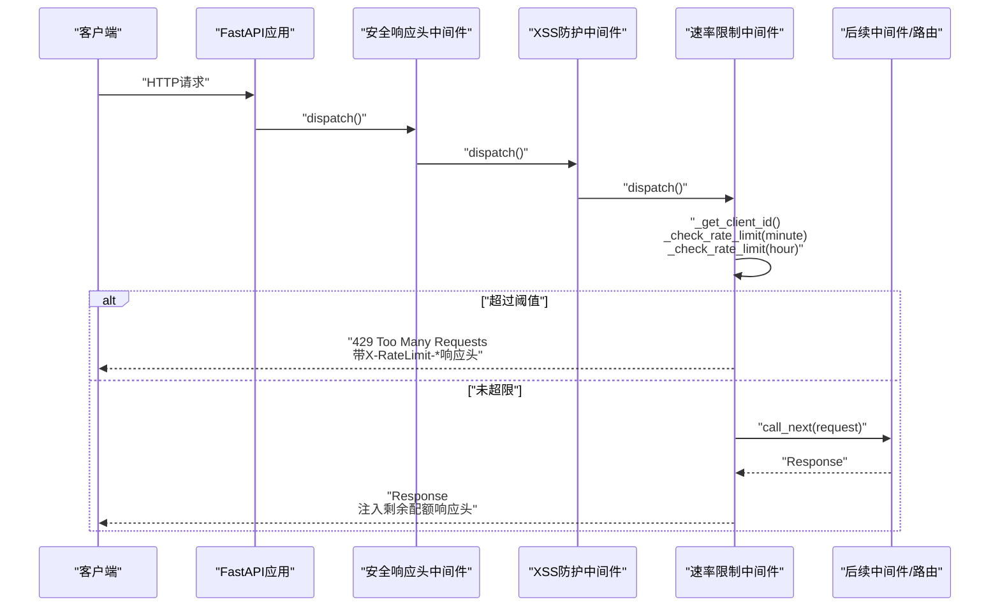
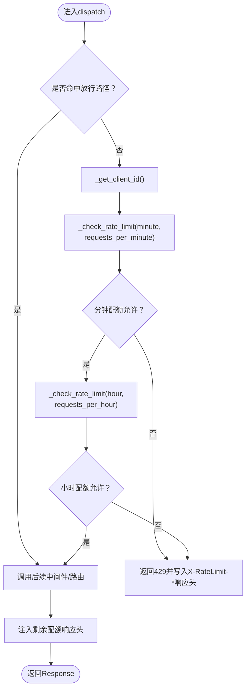
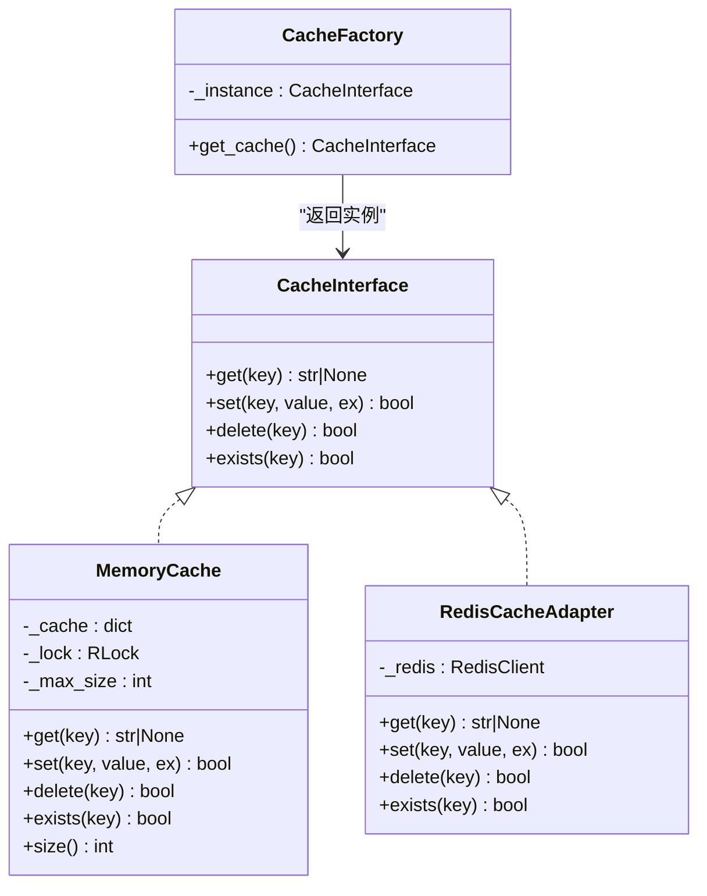
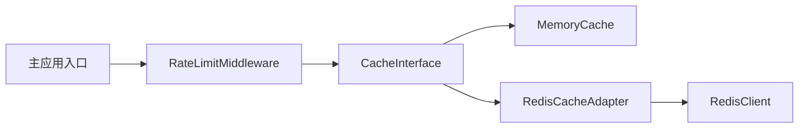

# 速率限制

<cite>
**本文引用的文件**
- [zquant/middleware/rate_limit.py](file://zquant/middleware/rate_limit.py)
- [zquant/utils/cache.py](file://zquant/utils/cache.py)
- [zquant/utils/redis_client.py](file://zquant/utils/redis_client.py)
- [zquant/config.py](file://zquant/config.py)
- [zquant/main.py](file://zquant/main.py)
- [zquant/middleware/security.py](file://zquant/middleware/security.py)
</cite>

## 目录
1. [简介](#简介)
2. [项目结构](#项目结构)
3. [核心组件](#核心组件)
4. [架构总览](#架构总览)
5. [详细组件分析](#详细组件分析)
6. [依赖关系分析](#依赖关系分析)
7. [性能考量](#性能考量)
8. [故障排查指南](#故障排查指南)
9. [结论](#结论)
10. [附录](#附录)

## 简介
本文件面向zquant的分布式速率限制中间件，系统性阐述其设计与实现要点，包括：
- 基于Redis的分布式计数模型与滑动窗口思想
- 支持按用户ID或客户端IP进行请求计数
- 在HTTP响应头中返回速率限制相关信息
- 配置文件中速率限制规则的设置方式（每分钟/每小时）
- 面对突发流量与暴力破解的配置建议
- 高并发场景下的性能影响与优化策略

## 项目结构
速率限制功能位于后端中间件层，与缓存抽象层、配置模块以及主应用入口紧密协作：
- 中间件层：速率限制中间件负责拦截请求、判断配额、注入响应头
- 缓存抽象层：统一内存缓存与Redis缓存接口，支持分布式部署
- 配置模块：集中管理速率限制开关与阈值
- 主应用入口：按顺序注册中间件，确保速率限制生效

图表来源
- [zquant/main.py](file://zquant/main.py#L132-L147)
- [zquant/middleware/rate_limit.py](file://zquant/middleware/rate_limit.py#L40-L60)
- [zquant/utils/cache.py](file://zquant/utils/cache.py#L207-L247)
- [zquant/utils/redis_client.py](file://zquant/utils/redis_client.py#L36-L162)

章节来源
- [zquant/main.py](file://zquant/main.py#L132-L147)

## 核心组件
- 速率限制中间件：实现按分钟与小时两个维度的滑动窗口式计数，支持用户ID优先、IP回退；对特定路径放行；在429时返回限流相关响应头；在正常响应中注入剩余配额信息。
- 缓存抽象层：提供统一的CacheInterface接口，支持MemoryCache与RedisCacheAdapter两种后端；根据配置动态选择后端。
- Redis客户端：封装Redis连接、操作与异常处理，提供延迟初始化与代理访问。
- 配置模块：集中管理速率限制开关与阈值，支持从环境变量覆盖默认值。

章节来源
- [zquant/middleware/rate_limit.py](file://zquant/middleware/rate_limit.py#L40-L202)
- [zquant/utils/cache.py](file://zquant/utils/cache.py#L38-L247)
- [zquant/utils/redis_client.py](file://zquant/utils/redis_client.py#L36-L162)
- [zquant/config.py](file://zquant/config.py#L64-L72)

## 架构总览
速率限制中间件在FastAPI中间件链中的位置如下：
- 安全响应头中间件（最外层）
- XSS防护中间件
- 速率限制中间件（条件启用）
- 审计日志中间件
- 请求日志中间件

中间件注册处会根据配置决定是否启用速率限制，并传入每分钟/每小时阈值。

图表来源
- [zquant/main.py](file://zquant/main.py#L132-L147)
- [zquant/middleware/rate_limit.py](file://zquant/middleware/rate_limit.py#L146-L202)
- [zquant/middleware/security.py](file://zquant/middleware/security.py#L43-L62)

章节来源
- [zquant/main.py](file://zquant/main.py#L132-L147)

## 详细组件分析

### 速率限制中间件（RateLimitMiddleware）
- 客户端标识策略
  - 优先使用已认证用户的用户ID；若不可用，则回退到客户端IP地址。
- 计数逻辑
  - 使用“窗口起始时间+计数”的字符串形式存储在缓存中，键名包含客户端标识与时间窗口（minute/hour）。
  - 每次请求都会检查是否进入新窗口，若是则重置计数；否则计数+1。
  - 当同一窗口内计数超过阈值时，拒绝请求并返回429，同时在响应头中携带限流相关字段。
- 响应头
  - 429响应：包含X-RateLimit-Limit、X-RateLimit-Remaining、Retry-After。
  - 正常响应：注入X-RateLimit-Limit-Minute、X-RateLimit-Remaining-Minute、X-RateLimit-Limit-Hour、X-RateLimit-Remaining-Hour。
- 路径放行
  - 对健康检查与文档路径（/health、/docs、/redoc、/openapi.json）不做限流。

图表来源
- [zquant/middleware/rate_limit.py](file://zquant/middleware/rate_limit.py#L146-L202)

章节来源
- [zquant/middleware/rate_limit.py](file://zquant/middleware/rate_limit.py#L61-L81)
- [zquant/middleware/rate_limit.py](file://zquant/middleware/rate_limit.py#L82-L145)
- [zquant/middleware/rate_limit.py](file://zquant/middleware/rate_limit.py#L146-L202)

### 缓存抽象层（CacheFactory/CacheInterface）
- 接口协议：统一get/set/delete/exists方法，便于替换后端。
- 内存缓存：线程安全、TTL惰性清理、LRU淘汰，适合单机部署。
- Redis适配：延迟初始化Redis客户端，提供get/set/delete/exists，适合分布式部署。
- 工厂模式：根据配置选择后端，单例持有，避免重复初始化。

图表来源
- [zquant/utils/cache.py](file://zquant/utils/cache.py#L38-L247)
- [zquant/utils/redis_client.py](file://zquant/utils/redis_client.py#L36-L162)

章节来源
- [zquant/utils/cache.py](file://zquant/utils/cache.py#L38-L247)

### Redis客户端（RedisClient/RedisCacheAdapter）
- 连接参数：主机、端口、数据库、密码、解码响应、连接超时。
- 操作封装：get/set/delete/exists，异常捕获与日志记录。
- 延迟初始化：首次使用时建立连接，避免导入即连接。
- 代理访问：通过代理对象延迟暴露redis_client属性。

章节来源
- [zquant/utils/redis_client.py](file://zquant/utils/redis_client.py#L36-L162)

### 配置模块（Settings）
- 速率限制开关与阈值：RATE_LIMIT_ENABLED、RATE_LIMIT_PER_MINUTE、RATE_LIMIT_PER_HOUR。
- 缓存类型：CACHE_TYPE（memory/redis），本地缓存最大条目数CACHE_MAX_SIZE。
- Redis连接参数：REDIS_HOST、REDIS_PORT、REDIS_DB、REDIS_PASSWORD。
- 环境变量优先级：环境变量 > .env文件 > 默认值。

章节来源
- [zquant/config.py](file://zquant/config.py#L64-L72)
- [zquant/config.py](file://zquant/config.py#L58-L67)
- [zquant/config.py](file://zquant/config.py#L113-L165)

### 主应用入口（中间件注册）
- 中间件顺序：安全响应头 → XSS防护 → 速率限制（条件启用）→ 审计日志 → 请求日志。
- 条件启用：仅当配置开启时注册速率限制中间件，并传入每分钟/每小时阈值。

章节来源
- [zquant/main.py](file://zquant/main.py#L132-L147)

## 依赖关系分析
- 速率限制中间件依赖缓存抽象层提供的CacheInterface，从而与具体后端解耦。
- 缓存工厂根据配置选择MemoryCache或RedisCacheAdapter，后者依赖Redis客户端。
- 主应用入口在启动时按顺序注册中间件，确保速率限制中间件在审计与日志之前执行。

图表来源
- [zquant/middleware/rate_limit.py](file://zquant/middleware/rate_limit.py#L40-L60)
- [zquant/utils/cache.py](file://zquant/utils/cache.py#L207-L247)
- [zquant/utils/redis_client.py](file://zquant/utils/redis_client.py#L36-L162)
- [zquant/main.py](file://zquant/main.py#L132-L147)

章节来源
- [zquant/middleware/rate_limit.py](file://zquant/middleware/rate_limit.py#L40-L60)
- [zquant/utils/cache.py](file://zquant/utils/cache.py#L207-L247)
- [zquant/utils/redis_client.py](file://zquant/utils/redis_client.py#L36-L162)
- [zquant/main.py](file://zquant/main.py#L132-L147)

## 性能考量
- 分布式一致性
  - 使用Redis作为后端时，计数与过期由Redis原子操作保证，适合多实例部署。
  - 若使用本地内存缓存，需确保单实例部署或共享缓存策略。
- 过期与窗口
  - 每分钟窗口过期时间为60秒，每小时窗口为3600秒，避免长期占用缓存空间。
- 并发与竞争
  - 每次请求都进行一次get/set操作，属于轻量级KV操作；在高并发下建议使用Redis后端。
- 响应头开销
  - 注入响应头为O(1)操作，对性能影响极小。
- 中间件顺序
  - 将速率限制置于审计与日志之前，避免对审计与日志统计造成干扰。

[本节为通用性能讨论，无需列出章节来源]

## 故障排查指南
- 429 Too Many Requests
  - 触发条件：同一分钟或同一小时内的请求计数超过阈值。
  - 响应头：X-RateLimit-Limit、X-RateLimit-Remaining、Retry-After。
  - 排查：检查当前用户ID/IP是否被限流；核对配置中的每分钟/每小时阈值。
- 文档与健康检查不受限流
  - /health、/docs、/redoc、/openapi.json路径放行，用于运维与调试。
- 缓存后端问题
  - Redis连接失败：检查REDIS_HOST/PORT/DB/PASSWORD配置；确认Redis服务可达。
  - 缓存操作异常：查看日志中Redis GET/SET/DELETE失败记录。
- 中间件未生效
  - 确认主应用入口已按顺序注册中间件；检查配置开关RATE_LIMIT_ENABLED。
- 配置覆盖
  - 环境变量优先级高于默认值与.env文件，可通过环境变量快速调整阈值。

章节来源
- [zquant/middleware/rate_limit.py](file://zquant/middleware/rate_limit.py#L146-L202)
- [zquant/config.py](file://zquant/config.py#L113-L165)
- [zquant/utils/redis_client.py](file://zquant/utils/redis_client.py#L36-L162)
- [zquant/main.py](file://zquant/main.py#L132-L147)

## 结论
zquant的速率限制中间件采用滑动窗口思想与Redis分布式计数，结合用户ID与IP的双重标识策略，在HTTP响应头中提供清晰的限流反馈。通过配置模块集中管理阈值与后端选择，既满足单机开发需求，又能在多实例环境下保持一致的限流效果。配合合适的中间件顺序与缓存后端，可在高并发场景下获得稳定可靠的性能表现。

[本节为总结性内容，无需列出章节来源]

## 附录

### 配置示例与最佳实践
- 开启/关闭速率限制
  - 在配置中设置开关，控制是否启用中间件。
- 设置每分钟/每小时阈值
  - 通过配置项设置每分钟与每小时允许的请求数，支持环境变量覆盖。
- 面对突发流量
  - 建议将每小时阈值设为每分钟阈值的较大倍数，以允许短时突发。
- 防暴力破解
  - 对登录等敏感接口，可在认证服务中叠加登录失败次数与锁定策略（参考认证服务中的锁定期设置思路）。
- 高并发优化
  - 使用Redis后端；合理设置Redis连接参数与超时；避免在高并发下频繁切换后端。

章节来源
- [zquant/config.py](file://zquant/config.py#L64-L72)
- [zquant/config.py](file://zquant/config.py#L58-L67)
- [zquant/utils/redis_client.py](file://zquant/utils/redis_client.py#L36-L162)
- [zquant/middleware/rate_limit.py](file://zquant/middleware/rate_limit.py#L146-L202)