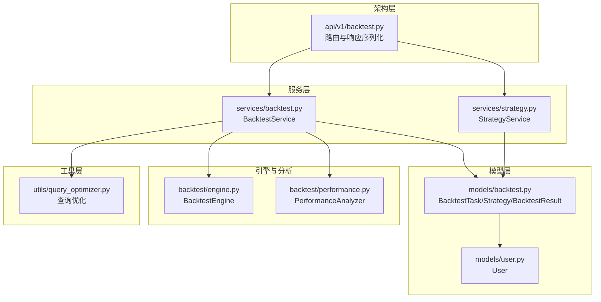
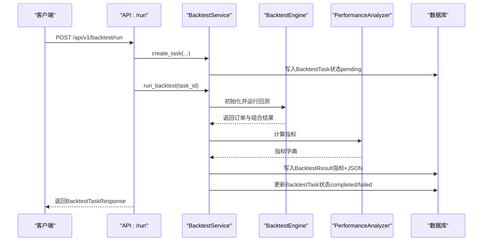
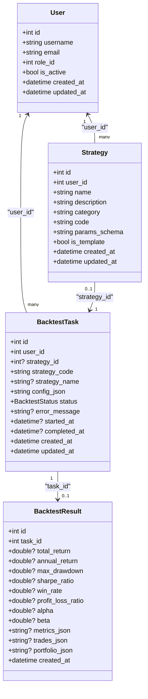
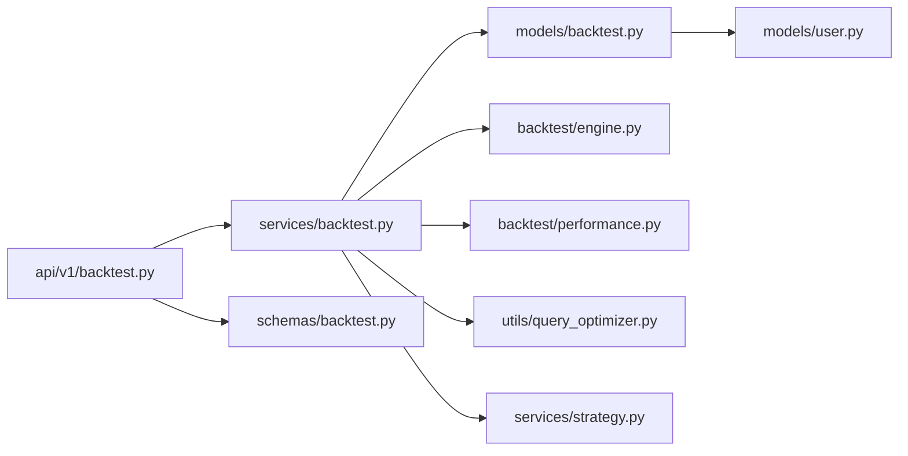
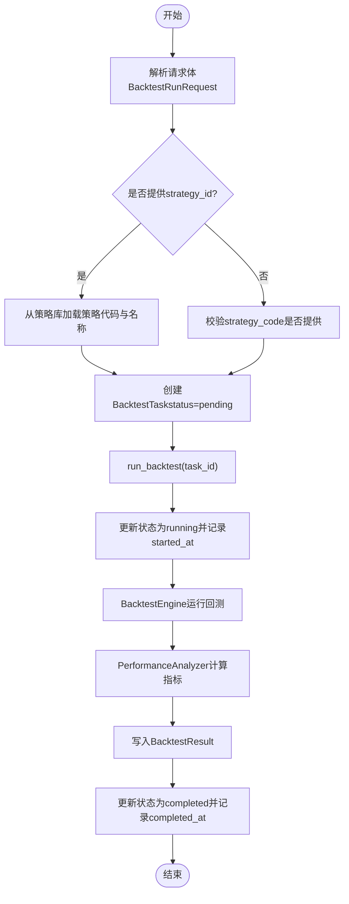

# 回测模型

<cite>
**本文引用的文件**
- [models/backtest.py](file://zquant/models/backtest.py)
- [schemas/backtest.py](file://zquant/schemas/backtest.py)
- [services/backtest.py](file://zquant/services/backtest.py)
- [api/v1/backtest.py](file://zquant/api/v1/backtest.py)
- [models/user.py](file://zquant/models/user.py)
- [backtest/engine.py](file://zquant/backtest/engine.py)
- [backtest/performance.py](file://zquant/backtest/performance.py)
- [utils/query_optimizer.py](file://zquant/utils/query_optimizer.py)
- [services/strategy.py](file://zquant/services/strategy.py)
</cite>

## 目录
1. [简介](#简介)
2. [项目结构](#项目结构)
3. [核心组件](#核心组件)
4. [架构总览](#架构总览)
5. [详细组件分析](#详细组件分析)
6. [依赖分析](#依赖分析)
7. [性能考量](#性能考量)
8. [故障排查指南](#故障排查指南)
9. [结论](#结论)
10. [附录](#附录)

## 简介
本文件系统性梳理回测数据模型与相关流程，围绕 BacktestTask ORM 模型的字段语义、与 User/Strategy/BacktestResult 的关系、BacktestSchema 在策略参数与回测结果序列化中的作用展开；并结合实际代码路径，说明回测任务的创建、状态管理与结果存储模式，最后给出查询优化、大规模结果存储与性能指标计算的最佳实践。

## 项目结构
围绕回测主题的关键文件分布如下：
- 模型层：定义数据库表结构与关系
- 架构层：API 控制器负责请求解析与响应序列化
- 服务层：封装业务逻辑（任务创建、运行、查询、删除）
- 引擎与分析：回测引擎驱动回测执行，分析器计算指标
- 工具层：查询优化与分页工具

图表来源
- [models/backtest.py](file://zquant/models/backtest.py#L48-L119)
- [models/user.py](file://zquant/models/user.py#L74-L94)
- [api/v1/backtest.py](file://zquant/api/v1/backtest.py#L90-L173)
- [services/backtest.py](file://zquant/services/backtest.py#L43-L278)
- [services/strategy.py](file://zquant/services/strategy.py#L35-L265)
- [backtest/engine.py](file://zquant/backtest/engine.py#L41-L498)
- [backtest/performance.py](file://zquant/backtest/performance.py#L36-L330)
- [utils/query_optimizer.py](file://zquant/utils/query_optimizer.py#L35-L181)

章节来源
- [models/backtest.py](file://zquant/models/backtest.py#L48-L119)
- [api/v1/backtest.py](file://zquant/api/v1/backtest.py#L90-L173)
- [services/backtest.py](file://zquant/services/backtest.py#L43-L278)

## 核心组件
- BacktestTask：回测任务表，承载任务元信息、状态与配置
- Strategy：策略表，支持模板策略与参数 Schema
- BacktestResult：回测结果表，保存核心指标与明细 JSON
- BacktestService：回测服务，负责任务创建、运行、查询与删除
- BacktestEngine：回测引擎，驱动回测执行、撮合订单、更新组合
- PerformanceAnalyzer：绩效分析器，计算累计/年化收益、最大回撤、夏普比率、胜率、盈亏比、Alpha/Beta 等
- BacktestSchema：Pydantic 模型，用于请求体校验与响应序列化

章节来源
- [models/backtest.py](file://zquant/models/backtest.py#L48-L119)
- [schemas/backtest.py](file://zquant/schemas/backtest.py#L33-L152)
- [services/backtest.py](file://zquant/services/backtest.py#L43-L278)
- [backtest/engine.py](file://zquant/backtest/engine.py#L41-L498)
- [backtest/performance.py](file://zquant/backtest/performance.py#L36-L330)

## 架构总览
回测从 API 层进入，经服务层创建任务并触发引擎运行，分析器计算指标并持久化到结果表，最终通过 API 将任务与结果序列化返回。

图表来源
- [api/v1/backtest.py](file://zquant/api/v1/backtest.py#L90-L173)
- [services/backtest.py](file://zquant/services/backtest.py#L43-L162)
- [backtest/engine.py](file://zquant/backtest/engine.py#L405-L498)
- [backtest/performance.py](file://zquant/backtest/performance.py#L50-L86)

## 详细组件分析

### BacktestTask ORM 模型字段定义与业务含义
- 字段与含义
  - id：主键，自增
  - user_id：外键，指向用户表，标识任务归属
  - strategy_id：外键，指向策略表，可选（可直接传入策略代码）
  - strategy_code：策略代码（Python 字符串），当未使用策略库时必填
  - strategy_name：策略名称（可选）
  - config_json：回测配置（JSON 字符串），包含 start_date、end_date、initial_capital、symbols、commission_rate、tax_rate、slippage_rate、adjust_type、benchmark、use_daily_basic 等
  - status：枚举，取值 pending、running、completed、failed、cancelled
  - error_message：失败时的错误信息
  - started_at/completed_at：任务开始/完成时间
  - created_at/updated_at：记录创建与更新时间
- 关系
  - 与 User：一对多，BacktestTask.user
  - 与 Strategy：一对一（可选），BacktestTask.strategy
  - 与 BacktestResult：一对一（级联删除），BacktestTask.result

章节来源
- [models/backtest.py](file://zquant/models/backtest.py#L48-L119)
- [models/user.py](file://zquant/models/user.py#L74-L94)

### BacktestSchema 在策略参数验证与回测结果序列化中的作用
- 请求体校验
  - BacktestConfig：校验 start_date、end_date、initial_capital、symbols、frequency、adjust_type、commission_rate、min_commission、tax_rate、slippage_rate、benchmark、use_daily_basic 等字段
  - BacktestRunRequest：校验 strategy_id 与 strategy_code 二选一，strategy_name，config
- 响应体序列化
  - BacktestTaskResponse：序列化任务基本信息、状态、时间戳及从 config_json 中解析的 start_date/end_date
  - BacktestResultResponse：序列化核心指标与三类 JSON（metrics_json、trades_json、portfolio_json）
  - PerformanceResponse：聚合指标、交易记录、投资组合
- 策略参数 Schema
  - StrategyCreateRequest/StrategyUpdateRequest：支持 params_schema（JSON 字符串），用于定义策略参数结构，便于前端校验与展示

章节来源
- [schemas/backtest.py](file://zquant/schemas/backtest.py#L33-L152)

### 回测任务的创建、状态管理与结果存储模式
- 创建任务
  - 若提供 strategy_id，则从策略库加载策略代码与名称；若为模板策略，允许所有用户使用
  - 若未提供 strategy_id，则必须提供 strategy_code
  - 将 config_json 序列化后写入 BacktestTask
- 运行回测
  - 将任务状态置为 running，记录 started_at
  - 动态加载策略类（要求策略代码中定义 Strategy 类）
  - 初始化 BacktestEngine，运行回测，得到订单与组合结果
  - 使用 PerformanceAnalyzer 计算指标，写入 BacktestResult
  - 更新 BacktestTask 状态为 completed 或 failed，并记录 completed_at/error_message
- 查询与删除
  - 任务与结果均按 user_id 进行资源隔离
  - 支持分页、排序与过滤（服务层使用子查询与排序字段映射）

章节来源
- [services/backtest.py](file://zquant/services/backtest.py#L43-L278)
- [api/v1/backtest.py](file://zquant/api/v1/backtest.py#L90-L173)

### BacktestEngine 与 PerformanceAnalyzer 的职责边界
- BacktestEngine
  - 加载价格数据与每日指标数据（可选）
  - 维护订单队列（T+1 成交）、撮合逻辑、手续费/印花税/滑点成本
  - 维护投资组合（现金、持仓、市值、盈亏）
  - 暴露 Context 给策略调用（下单、目标下单、每日指标访问等）
- PerformanceAnalyzer
  - 基于引擎输出的订单与组合，计算累计/年化收益、最大回撤、波动率、夏普比率、胜率、盈亏比、Alpha/Beta 等

章节来源
- [backtest/engine.py](file://zquant/backtest/engine.py#L41-L498)
- [backtest/performance.py](file://zquant/backtest/performance.py#L36-L330)

### 数据模型关系图

图表来源
- [models/backtest.py](file://zquant/models/backtest.py#L48-L119)
- [models/user.py](file://zquant/models/user.py#L74-L94)

## 依赖分析
- API 层依赖服务层与 Pydantic Schema
- 服务层依赖模型层、引擎与分析器、查询优化工具
- 引擎与分析器依赖数据仓库与回测上下文
- 模型层定义外键与级联关系，确保数据一致性

图表来源
- [api/v1/backtest.py](file://zquant/api/v1/backtest.py#L90-L173)
- [services/backtest.py](file://zquant/services/backtest.py#L43-L278)
- [models/backtest.py](file://zquant/models/backtest.py#L48-L119)
- [backtest/engine.py](file://zquant/backtest/engine.py#L41-L498)
- [backtest/performance.py](file://zquant/backtest/performance.py#L36-L330)
- [utils/query_optimizer.py](file://zquant/utils/query_optimizer.py#L35-L181)
- [models/user.py](file://zquant/models/user.py#L74-L94)
- [services/strategy.py](file://zquant/services/strategy.py#L35-L265)

## 性能考量
- 查询优化
  - 使用子查询限定用户任务范围，避免全表扫描
  - 对排序字段建立索引（如 user_id、status、created_at、updated_at、task_id 等）
  - 使用分页与最大页大小限制，防止超大数据集查询
  - 预加载关联关系（joinedload/selectinload）避免 N+1 查询
- 大规模结果存储
  - 指标字段采用双精度浮点，JSON 字段采用文本存储，便于扩展
  - 对 trades_json/portfolio_json 等大字段按需读取，避免一次性传输
- 指标计算
  - 使用向量化与对齐数据计算，减少循环开销
  - 年化指标统一以 252 个交易日为基准
- 引擎与分析
  - 批量加载价格与每日指标数据，减少多次查询
  - T+1 成交与成本计算在内存中完成，降低数据库压力

章节来源
- [services/backtest.py](file://zquant/services/backtest.py#L186-L278)
- [utils/query_optimizer.py](file://zquant/utils/query_optimizer.py#L35-L181)
- [backtest/engine.py](file://zquant/backtest/engine.py#L105-L182)
- [backtest/performance.py](file://zquant/backtest/performance.py#L50-L330)

## 故障排查指南
- 任务状态异常
  - 检查 BacktestTask.status 与 error_message 字段，定位失败原因
  - 确认 started_at/completed_at 时间戳是否正确更新
- 策略加载失败
  - 确保策略代码中定义 Strategy 类
  - 若使用模板策略，确认 is_template 标记与可见性
- 结果缺失
  - 确认 BacktestResult 是否存在且 task_id 关联正确
  - 检查 JSON 字段是否为空（可能因回测未产生交易或数据缺失）
- 权限与隔离
  - API 层与服务层均按 user_id 进行资源隔离，避免越权访问
- 查询慢
  - 为常用过滤与排序字段建立索引
  - 使用分页与限制每页大小

章节来源
- [services/backtest.py](file://zquant/services/backtest.py#L100-L162)
- [api/v1/backtest.py](file://zquant/api/v1/backtest.py#L137-L173)
- [models/backtest.py](file://zquant/models/backtest.py#L48-L119)

## 结论
BacktestTask 模型清晰地承载了回测任务的生命周期与关键元数据；BacktestSchema 在请求校验与响应序列化中发挥关键作用；服务层将任务创建、运行、查询与删除串联起来，配合引擎与分析器完成回测执行与指标计算；通过查询优化与合理的大数据存储策略，可在保证性能的同时支撑大规模回测场景。

## 附录

### 回测任务创建与运行流程图

图表来源
- [api/v1/backtest.py](file://zquant/api/v1/backtest.py#L90-L173)
- [services/backtest.py](file://zquant/services/backtest.py#L100-L162)
- [backtest/engine.py](file://zquant/backtest/engine.py#L405-L498)
- [backtest/performance.py](file://zquant/backtest/performance.py#L50-L86)