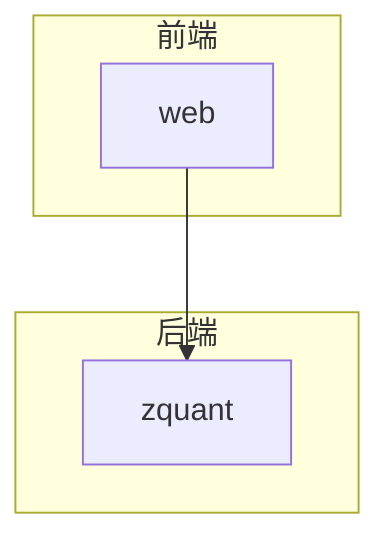
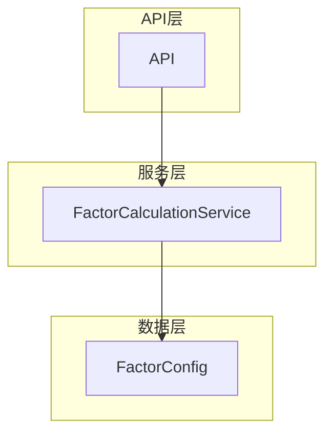
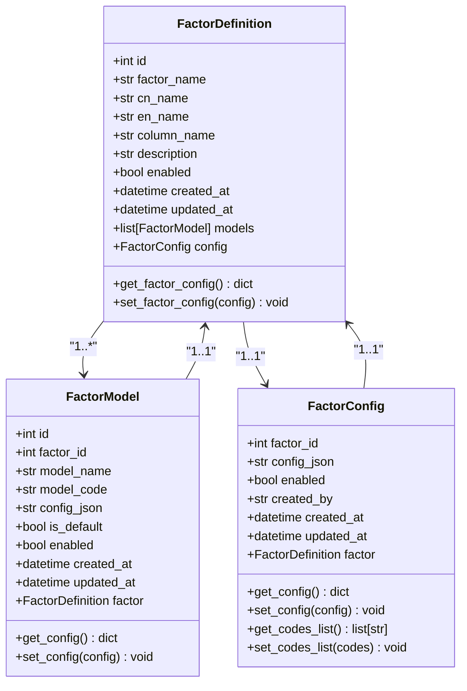
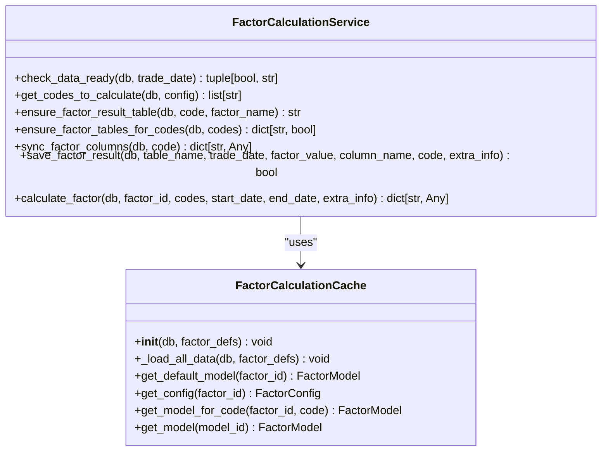
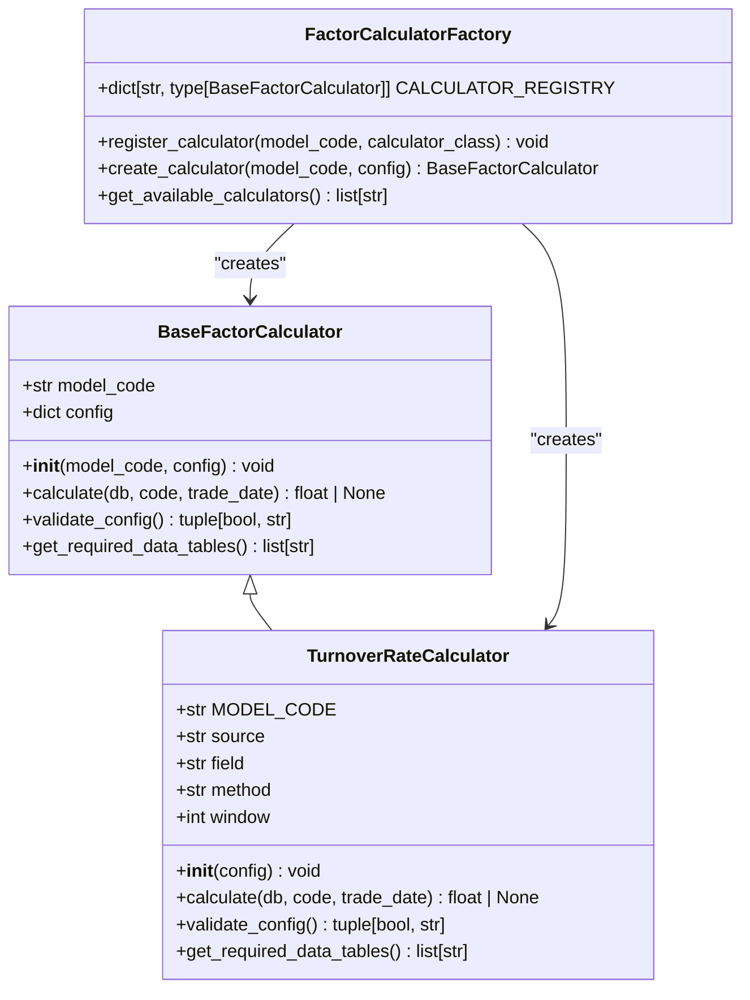
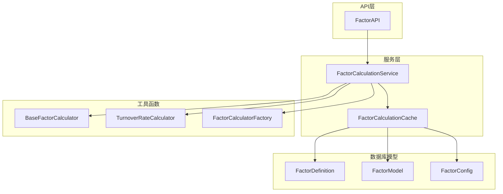

# 因子模型

<cite>
**本文档引用的文件**   
- [factor.py](file://zquant/models/factor.py)
- [factor.py](file://zquant/schemas/factor.py)
- [factor.py](file://zquant/services/factor.py)
- [factor_repository.py](file://zquant/repositories/factor_repository.py)
- [data.py](file://zquant/models/data.py)
- [factor.py](file://zquant/api/v1/factor.py)
- [base.py](file://zquant/factor/calculators/base.py)
- [factory.py](file://zquant/factor/calculators/factory.py)
- [turnover_rate.py](file://zquant/factor/calculators/turnover_rate.py)
- [factor_calculation.py](file://zquant/services/factor_calculation.py)
- [user.py](file://zquant/models/user.py)
- [user.py](file://zquant/schemas/user.py)
</cite>

## 目录
1. [引言](#引言)
2. [项目结构](#项目结构)
3. [核心组件](#核心组件)
4. [架构概述](#架构概述)
5. [详细组件分析](#详细组件分析)
6. [依赖分析](#依赖分析)
7. [性能考虑](#性能考虑)
8. [故障排除指南](#故障排除指南)
9. [结论](#结论)
10. [附录](#附录)（如有必要）

## 引言
本文档旨在全面描述zquant项目中的因子数据模型，包括FactorDefinition、FactorCalculationTask、FactorResult等ORM模型的字段定义和业务逻辑约束。文档详细解释了因子定义与用户创建者的关系，以及因子结果与股票和交易日期的复合关系。同时，文档说明了FactorSchema在因子参数验证和计算结果序列化中的作用，并结合实际代码展示了因子定义、计算任务调度和结果查询的实现模式。最后，文档提供了因子元数据管理、大规模因子结果存储和查询性能优化的最佳实践。

## 项目结构
zquant项目采用分层架构，主要分为以下几个部分：
- **docker/**: Docker相关配置文件
- **docs/**: 项目文档
- **web/**: 前端代码
- **zquant/**: 后端核心代码
  - **alembic/**: 数据库迁移工具
  - **api/**: API接口
  - **backtest/**: 回测相关
  - **constants/**: 常量定义
  - **core/**: 核心功能
  - **data/**: 数据处理
  - **factor/calculators/**: 因子计算器
  - **middleware/**: 中间件
  - **models/**: 数据库模型
  - **repositories/**: 数据访问层
  - **scheduler/**: 任务调度
  - **schemas/**: Pydantic模型
  - **scripts/**: 脚本
  - **services/**: 业务逻辑层
  - **strategy/examples/**: 策略示例
  - **tests/**: 测试代码
  - **utils/**: 工具函数

**图源**
- [web](file://web)
- [zquant](file://zquant)

**节源**
- [web](file://web)
- [zquant](file://zquant)

## 核心组件
本文档的核心组件包括：
- **FactorDefinition**: 因子定义模型
- **FactorModel**: 因子模型
- **FactorConfig**: 因子配置
- **FactorCalculationService**: 因子计算服务
- **FactorCalculationCache**: 因子计算缓存
- **BaseFactorCalculator**: 因子计算器基类
- **TurnoverRateCalculator**: 换手率因子计算器

**节源**
- [factor.py](file://zquant/models/factor.py#L35-L267)
- [factor_calculation.py](file://zquant/services/factor_calculation.py#L215-L213)
- [base.py](file://zquant/factor/calculators/base.py#L34-L82)
- [turnover_rate.py](file://zquant/factor/calculators/turnover_rate.py#L37-L188)

## 架构概述
zquant项目的因子数据模型采用分层设计，主要包括数据层、服务层和API层。数据层使用SQLAlchemy定义ORM模型，服务层封装业务逻辑，API层提供RESTful接口。

**图源**
- [factor.py](file://zquant/models/factor.py#L35-L267)
- [factor_calculation.py](file://zquant/services/factor_calculation.py#L215-L213)
- [factor.py](file://zquant/api/v1/factor.py#L63-L816)

**节源**
- [factor.py](file://zquant/models/factor.py#L35-L267)
- [factor_calculation.py](file://zquant/services/factor_calculation.py#L215-L213)
- [factor.py](file://zquant/api/v1/factor.py#L63-L816)

## 详细组件分析
### 因子定义模型分析
#### 因子定义模型

**图源**
- [factor.py](file://zquant/models/factor.py#L35-L267)

**节源**
- [factor.py](file://zquant/models/factor.py#L35-L267)

### 因子计算服务分析
#### 因子计算服务

**图源**
- [factor_calculation.py](file://zquant/services/factor_calculation.py#L215-L213)

**节源**
- [factor_calculation.py](file://zquant/services/factor_calculation.py#L215-L213)

### 因子计算器分析
#### 因子计算器

**图源**
- [base.py](file://zquant/factor/calculators/base.py#L34-L82)
- [turnover_rate.py](file://zquant/factor/calculators/turnover_rate.py#L37-L188)
- [factory.py](file://zquant/factor/calculators/factory.py#L35-L90)

**节源**
- [base.py](file://zquant/factor/calculators/base.py#L34-L82)
- [turnover_rate.py](file://zquant/factor/calculators/turnover_rate.py#L37-L188)
- [factory.py](file://zquant/factor/calculators/factory.py#L35-L90)

## 依赖分析
zquant项目的因子数据模型依赖于多个组件，包括数据库模型、服务层、API层和工具函数。

**图源**
- [factor.py](file://zquant/models/factor.py#L35-L267)
- [factor_calculation.py](file://zquant/services/factor_calculation.py#L215-L213)
- [factor.py](file://zquant/api/v1/factor.py#L63-L816)
- [base.py](file://zquant/factor/calculators/base.py#L34-L82)
- [turnover_rate.py](file://zquant/factor/calculators/turnover_rate.py#L37-L188)
- [factory.py](file://zquant/factor/calculators/factory.py#L35-L90)

**节源**
- [factor.py](file://zquant/models/factor.py#L35-L267)
- [factor_calculation.py](file://zquant/services/factor_calculation.py#L215-L213)
- [factor.py](file://zquant/api/v1/factor.py#L63-L816)
- [base.py](file://zquant/factor/calculators/base.py#L34-L82)
- [turnover_rate.py](file://zquant/factor/calculators/turnover_rate.py#L37-L188)
- [factory.py](file://zquant/factor/calculators/factory.py#L35-L90)

## 性能考虑
在大规模因子结果存储和查询性能优化方面，zquant项目采用了以下最佳实践：
- **分表存储**: 每个股票的因子结果存储在独立的表中，以提高查询性能。
- **索引优化**: 在关键字段上创建索引，如交易日期和股票代码。
- **缓存机制**: 使用FactorCalculationCache减少数据库查询次数。
- **批量处理**: 在计算因子时，采用批量处理方式，减少数据库交互次数。

## 故障排除指南
在使用zquant项目的因子数据模型时，可能会遇到以下常见问题：
- **因子计算失败**: 检查数据是否准备就绪，确保当日数据已同步。
- **因子结果表不存在**: 使用ensure_factor_result_table方法确保表存在。
- **配置验证失败**: 检查因子配置是否符合要求，如数据来源、字段名等。

**节源**
- [factor_calculation.py](file://zquant/services/factor_calculation.py#L219-L243)
- [factor_calculation.py](file://zquant/services/factor_calculation.py#L266-L333)
- [turnover_rate.py](file://zquant/factor/calculators/turnover_rate.py#L155-L175)

## 结论
本文档全面描述了zquant项目中的因子数据模型，包括核心组件、架构设计、依赖关系和性能优化策略。通过详细的代码分析和图表展示，为开发者提供了清晰的指导，帮助他们更好地理解和使用因子数据模型。

## 附录
无