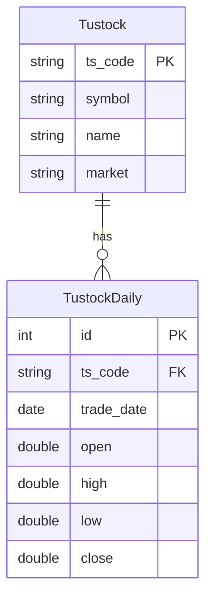
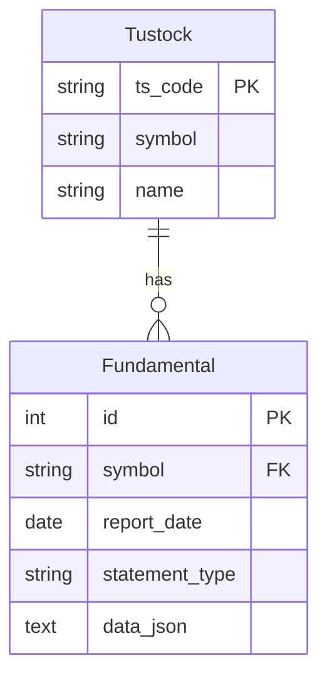
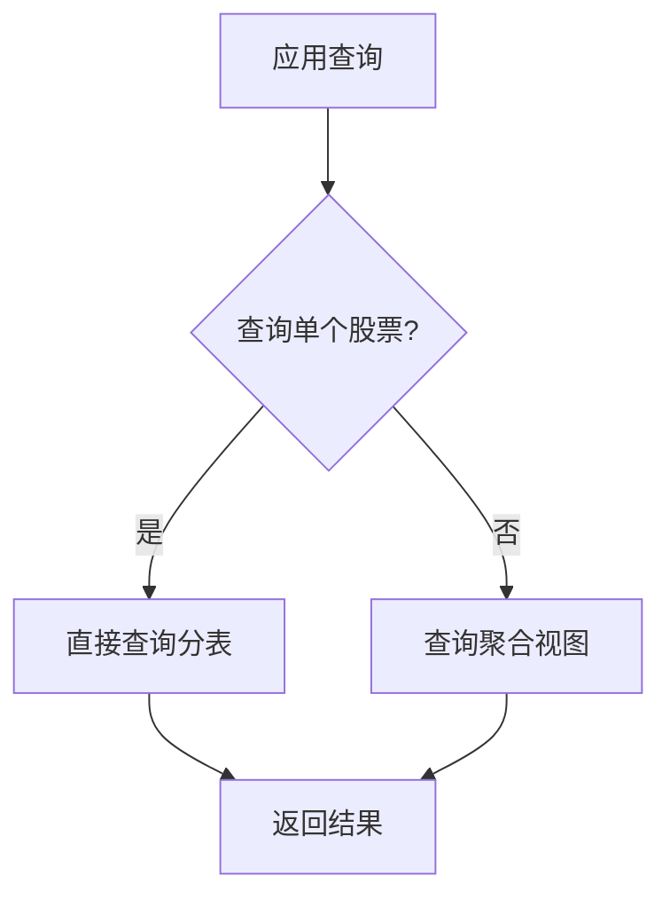

# 数据服务模型

<cite>
**本文档引用的文件**   
- [data.py](file://zquant/models/data.py)
- [data.py](file://zquant/schemas/data.py)
- [stock_repository.py](file://zquant/repositories/stock_repository.py)
- [price_data_repository.py](file://zquant/repositories/price_data_repository.py)
- [trading_date_repository.py](file://zquant/repositories/trading_date_repository.py)
- [processor.py](file://zquant/data/processor.py)
- [storage.py](file://zquant/data/storage.py)
- [data.py](file://zquant/api/v1/data.py)
</cite>

## 目录
1. [核心ORM模型定义](#核心orm模型定义)
2. [数据模型关系映射](#数据模型关系映射)
3. [数据验证与API响应格式化](#数据验证与api响应格式化)
4. [数据ETL流程与批量插入优化](#数据etl流程与批量插入优化)
5. [时间序列查询模式](#时间序列查询模式)
6. [高频数据存储优化与分区策略](#高频数据存储优化与分区策略)
7. [数据一致性维护最佳实践](#数据一致性维护最佳实践)

## 核心ORM模型定义

本节详细描述Stock、DailyBar、FinancialReport、TradingCalendar等核心ORM模型的字段定义、索引策略和数据约束。

### Stock模型 (Tustock)

`Tustock`模型代表股票基础信息，其表名为`zq_data_tustock_stockbasic`。

**字段定义：**
- `ts_code`: TS代码，主键，长度10，带索引
- `symbol`: 股票代码，长度6，带索引
- `name`: 股票名称，长度50，非空
- `area`: 地域，长度20
- `industry`: 所属行业，长度30
- `fullname`: 股票全称，长度100
- `enname`: 英文全称，长度200
- `cnspell`: 拼音缩写，长度50
- `market`: 市场类型，长度20，带索引
- `exchange`: 交易所代码，长度10
- `curr_type`: 交易货币，长度10
- `list_status`: 上市状态，长度1
- `list_date`: 上市日期
- `delist_date`: 退市日期
- `is_hs`: 是否沪深港通标的，长度1

**索引策略：**
- 主键索引：`ts_code`
- 普通索引：`symbol`, `market`

**数据约束：**
- `ts_code`为主键，确保唯一性
- `name`字段为非空约束

**Section sources**
- [data.py](file://zquant/models/data.py#L61-L109)

### DailyBar模型 (TustockDaily)

`TustockDaily`模型代表股票日线数据，采用动态分表策略，每个股票一个表，表名格式为`zq_data_tustock_daily_{股票代码}`。

**字段定义：**
- `id`: 自增主键，带索引
- `ts_code`: TS代码，长度10，非空，带索引
- `trade_date`: 交易日期，非空，带索引
- `open`: 开盘价，双精度浮点数，非空
- `high`: 最高价，双精度浮点数，非空
- `low`: 最低价，双精度浮点数，非空
- `close`: 收盘价，双精度浮点数，非空
- `pre_close`: 昨收价，双精度浮点数
- `change`: 涨跌额，双精度浮点数
- `pct_chg`: 涨跌幅，双精度浮点数
- `vol`: 成交量（手），双精度浮点数，非空，默认0
- `amount`: 成交额（千元），双精度浮点数，非空，默认0

**索引策略：**
- 主键索引：`id`
- 复合索引：`ts_code`和`trade_date`，确保同一股票同一日期的唯一性

**数据约束：**
- `ts_code`和`trade_date`组合的唯一约束
- 价格和成交量字段为非空约束

**Section sources**
- [data.py](file://zquant/models/data.py#L218-L272)

### FinancialReport模型 (Fundamental)

`Fundamental`模型代表财务数据，其表名为`zq_data_fundamentals`。

**字段定义：**
- `id`: 自增主键，带索引
- `symbol`: 股票代码，外键关联`Tustock.ts_code`，长度20，非空，带索引
- `report_date`: 报告期，非空，带索引
- `statement_type`: 报表类型，长度20，非空，带索引
- `data_json`: JSON格式存储财务数据，文本类型，非空
- `created_at`: 创建时间
- `updated_at`: 修改时间

**索引策略：**
- 主键索引：`id`
- 复合索引：`symbol`和`report_date`，用于高效查询

**数据约束：**
- `symbol`和`report_date`以及`statement_type`的唯一约束，确保同一股票同一报告期同一报表类型的唯一性
- `symbol`为外键，关联`Tustock`表

**Section sources**
- [data.py](file://zquant/models/data.py#L112-L131)

### TradingCalendar模型 (TustockTradecal)

`TustockTradecal`模型代表交易日历，其表名为`zq_data_tustock_tradecal`。

**字段定义：**
- `id`: 自增主键，带索引
- `exchange`: 交易所，长度10，带索引
- `cal_date`: 日历日期，非空，带索引
- `is_open`: 是否交易，小整数类型
- `pretrade_date`: 上一交易日

**索引策略：**
- 主键索引：`id`
- 复合索引：`exchange`和`cal_date`，确保同一交易所同一日期的唯一性

**数据约束：**
- `exchange`和`cal_date`的唯一约束

**Section sources**
- [data.py](file://zquant/models/data.py#L134-L172)

## 数据模型关系映射

本节解释Stock与DailyBar等模型之间的关系映射。

### Stock与DailyBar的一对多关系

`Tustock`（Stock）与`TustockDaily`（DailyBar）之间存在一对多关系。一个`Tustock`实例可以关联多个`TustockDaily`实例，这些实例通过`ts_code`字段进行关联。

在`TustockDaily`模型中，`ts_code`字段作为外键引用`Tustock`表的`ts_code`主键。这种设计允许通过股票代码高效地查询特定股票的所有日线数据。



**Diagram sources **
- [data.py](file://zquant/models/data.py#L61-L109)
- [data.py](file://zquant/models/data.py#L218-L272)

### Stock与FinancialReport的一对多关系

`Tustock`（Stock）与`Fundamental`（FinancialReport）之间也存在一对多关系。一个`Tustock`实例可以关联多个`Fundamental`实例，这些实例通过`symbol`字段进行关联。

在`Fundamental`模型中，`symbol`字段作为外键引用`Tustock`表的`ts_code`主键。这种设计允许通过股票代码查询特定股票的所有财务报告。



**Diagram sources **
- [data.py](file://zquant/models/data.py#L61-L109)
- [data.py](file://zquant/models/data.py#L112-L131)

**Section sources**
- [data.py](file://zquant/models/data.py#L61-L131)

## 数据验证与API响应格式化

本节说明DataSchema在数据导入验证和API响应格式化中的应用。

### 数据验证 (Data Validation)

数据验证通过Pydantic模型在API层实现。`zquant/schemas/data.py`文件定义了多个请求和响应模型，用于验证输入数据和格式化输出数据。

例如，`DailyDataRequest`模型用于验证获取日线数据的请求参数：

```python
class DailyDataRequest(BaseModel):
    ts_code: str | list[str] | None = Field(None, description="TS代码")
    start_date: date | None = Field(None, description="开始日期")
    end_date: date | None = Field(None, description="结束日期")
```

当API接收到请求时，FastAPI会自动使用此模型验证输入数据。如果数据不符合模型定义，将返回422 Unprocessable Entity错误。

### API响应格式化

API响应同样使用Pydantic模型进行格式化。`DailyDataResponse`模型定义了日线数据响应的结构：

```python
class DailyDataResponse(BaseModel):
    items: list[DailyDataItem] = Field(..., description="日线数据列表（包含所有字段）")
```

`DailyDataItem`模型则定义了单条日线数据的字段：

```python
class DailyDataItem(BaseModel):
    id: int | None = Field(None, description="记录ID")
    ts_code: str | None = Field(None, description="TS代码")
    trade_date: str | None = Field(None, description="交易日期（ISO格式）")
    # ... 其他字段
```

这种设计确保了API响应的一致性和可预测性。

**Section sources**
- [data.py](file://zquant/schemas/data.py#L102-L135)
- [data.py](file://zquant/schemas/data.py#L131-L135)

## 数据ETL流程与批量插入优化

本节结合代码示例展示数据ETL流程、批量插入优化。

### 数据ETL流程

数据ETL流程主要由`zquant/data/storage.py`中的`DataStorage`类实现。该类提供了多个方法用于将数据从外部源（如Tushare API）导入数据库。

以日线数据为例，`upsert_daily_data`方法实现了插入或更新操作：

```python
@staticmethod
def upsert_daily_data(
    db: Session, bars_df: pd.DataFrame, ts_code: str, extra_info: dict | None = None, update_view: bool = True
) -> int:
    # ... 数据处理
    stmt = insert(TustockDaily).values(records)
    update_dict = build_update_dict(stmt, update_fields, extra_info)
    return execute_upsert(db, stmt, update_dict, len(records), f"更新日线数据 {ts_code} {{count}} 条")
```

此方法使用SQLAlchemy的`insert().on_duplicate_key_update()`功能，实现了"upsert"（插入或更新）语义，避免了先查询后插入的开销。

### 批量插入优化

对于大量数据的插入，系统提供了批量插入方法`upsert_daily_data_batch`：

```python
@staticmethod
def upsert_daily_data_batch(
    db: Session, all_data_df: pd.DataFrame, extra_info: dict | None = None, update_view: bool = False
) -> dict:
    # 按 ts_code 分组
    grouped = all_data_df.groupby("ts_code")
    for ts_code, group_df in grouped:
        # 使用单股票写入方法
        count = DataStorage.upsert_daily_data(db, group_df, ts_code, extra_info, update_view=False)
        # ... 统计信息
    # 批量完成后统一更新视图
    if update_view:
        create_or_update_daily_view(db)
    return {"total": total_count, "success": success_count, "failed": failed_list, "table_details": table_details}
```

此方法的关键优化点包括：
1. **分组处理**：按`ts_code`分组，对每个股票分别处理
2. **延迟视图更新**：`update_view=False`参数避免了每次插入后都更新视图，最后统一更新一次，极大提高了性能
3. **错误隔离**：单个股票的写入失败不会影响其他股票

**Section sources**
- [storage.py](file://zquant/data/storage.py#L149-L211)
- [storage.py](file://zquant/data/storage.py#L214-L282)

## 时间序列查询模式

本节展示时间序列查询模式。

### 单股票时间序列查询

通过`PriceDataRepository`的`get_daily_data`方法可以查询单个股票的时间序列数据：

```python
def get_daily_data(
    self,
    ts_code: str | list[str] | None = None,
    start_date: Optional[date] = None,
    end_date: Optional[date] = None,
) -> list[dict]:
    return DataProcessor.get_daily_data_records(
        self.db, ts_code=ts_code, start_date=start_date, end_date=end_date
    )
```

对于单个股票，此方法直接查询其对应的分表，效率极高。

### 多股票时间序列查询

对于多个股票的查询，系统使用视图`zq_data_tustock_daily_view`。`DataProcessor`在查询时会检查视图是否存在，如果不存在则抛出异常。

```python
# 多个code或None：查询视图，视图不存在则抛出异常
inspector = inspect(engine)
view_exists = TUSTOCK_DAILY_VIEW_NAME in all_tables or TUSTOCK_DAILY_VIEW_NAME in all_views
if not view_exists:
    error_msg = f"视图 {TUSTOCK_DAILY_VIEW_NAME} 不存在，无法查询多个代码或查询所有数据。请先创建视图。"
    raise ValueError(error_msg)
```

这种设计将查询复杂性封装在数据层，API层无需关心底层是分表还是视图。

**Section sources**
- [price_data_repository.py](file://zquant/repositories/price_data_repository.py#L49-L68)
- [processor.py](file://zquant/data/processor.py#L101-L321)

## 高频数据存储优化与分区策略

本节介绍高频数据存储优化、分区策略。

### 动态分表策略

系统采用动态分表策略来优化高频数据存储。每个股票的日线数据存储在独立的表中，表名由`get_daily_table_name`函数生成：

```python
def get_daily_table_name(ts_code: str) -> str:
    if "." in ts_code:
        code_part = ts_code.split(".")[0]
    else:
        code_part = ts_code
    table_suffix = code_part.replace("-", "_").lower()
    return f"zq_data_tustock_daily_{table_suffix}"
```

这种策略的优势包括：
- **查询性能**：查询单个股票时，只需扫描一个表，避免了全表扫描
- **数据隔离**：不同股票的数据物理隔离，便于管理和维护
- **扩展性**：易于水平扩展，可以将不同表分布到不同数据库实例

### 视图聚合

为了支持跨股票的查询，系统创建了视图`zq_data_tustock_daily_view`，该视图聚合了所有分表的数据。`view_manager.py`中的`create_or_update_daily_view`函数负责创建和更新视图。



**Diagram sources **
- [processor.py](file://zquant/data/processor.py#L101-L321)

**Section sources**
- [data.py](file://zquant/models/data.py#L175-L193)
- [processor.py](file://zquant/data/processor.py#L101-L321)

## 数据一致性维护最佳实践

本节提供数据一致性维护的最佳实践。

### 原子性操作

所有数据写入操作都使用数据库事务确保原子性。`execute_upsert`函数在执行SQL后会提交事务：

```python
db.execute(stmt)
db.commit()
```

这确保了数据要么完全写入，要么完全回滚，不会出现部分写入的中间状态。

### 数据校验

系统提供了完整的数据校验机制，通过对比数据库数据和原始接口数据来验证数据一致性。`data.py`中的`validate_daily_data`端点实现了这一功能：

```python
@router.post("/daily/validate", response_model=DailyDataValidateResponse, summary="日线数据校验")
@handle_data_api_error
def validate_daily_data(
    request: DailyDataValidateRequest,
    db: Session = Depends(get_db),
    current_user: User = Depends(get_current_active_user),
):
    # ... 校验逻辑
```

### 缓存一致性

系统使用Redis缓存来提高查询性能，并通过`StockRepository`等类维护缓存一致性。当数据更新时，相关缓存会被清除或更新。

```python
# 更新缓存
self._symbol_to_ts_code_cache[symbol] = ts_code
self.cache.set(cache_key, ts_code, ex=86400)  # 缓存1天
```

**Section sources**
- [storage.py](file://zquant/data/storage.py#L555-L559)
- [stock_repository.py](file://zquant/repositories/stock_repository.py#L79-L82)