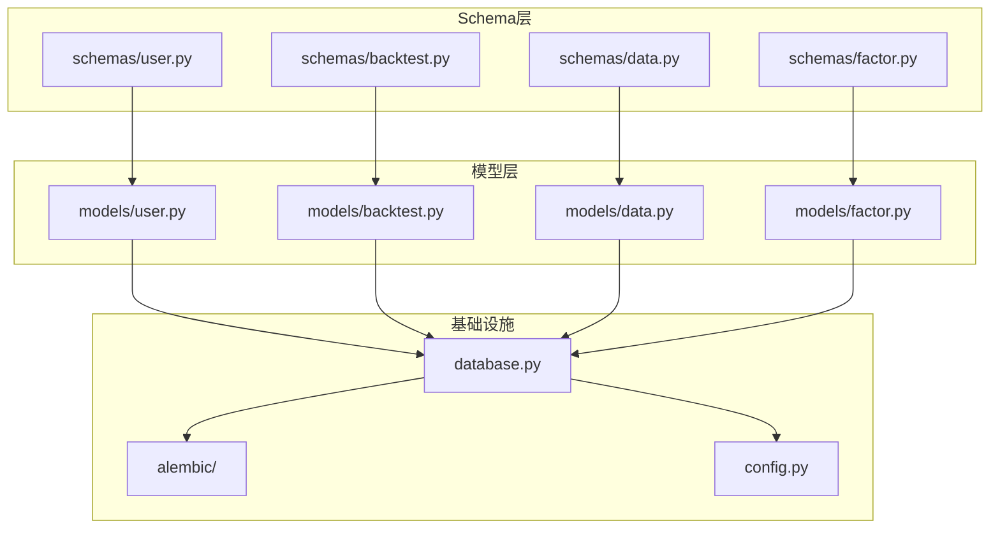
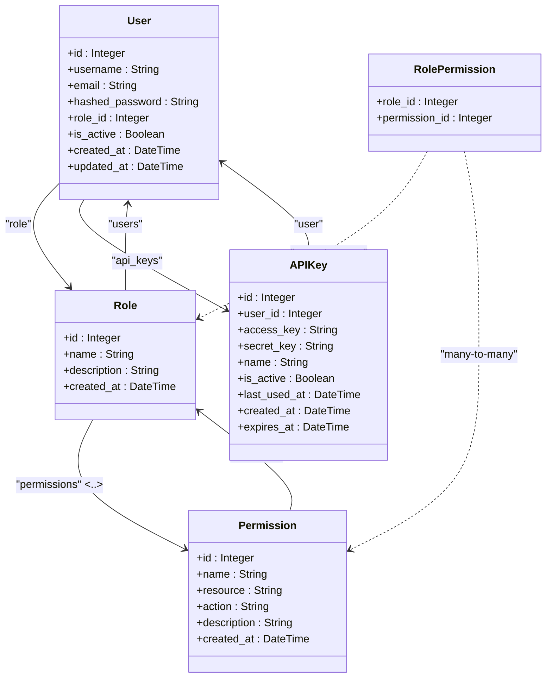
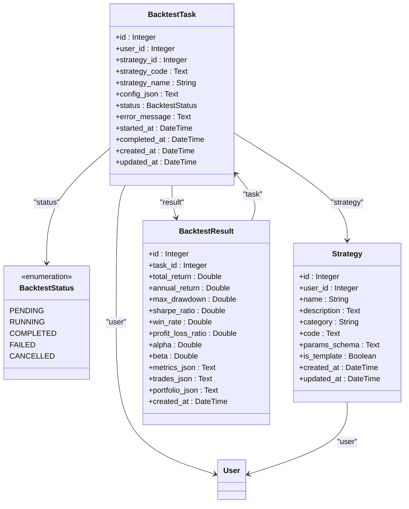
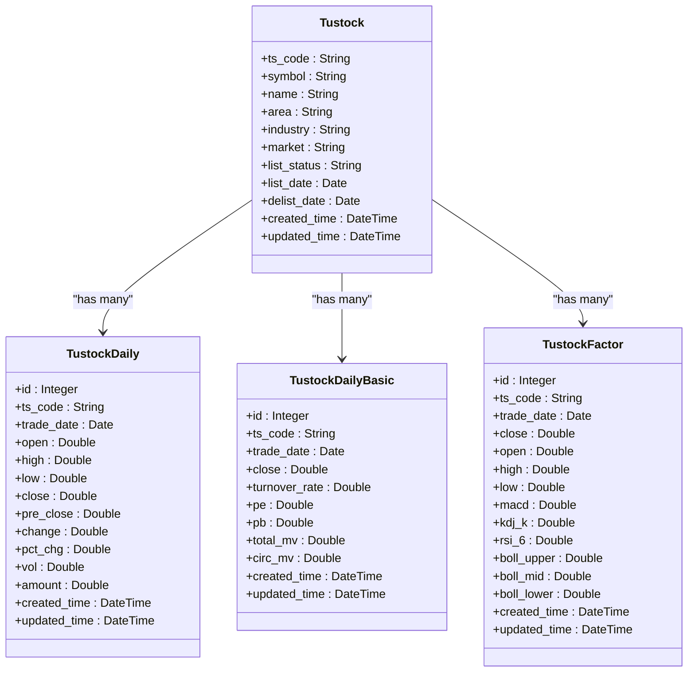
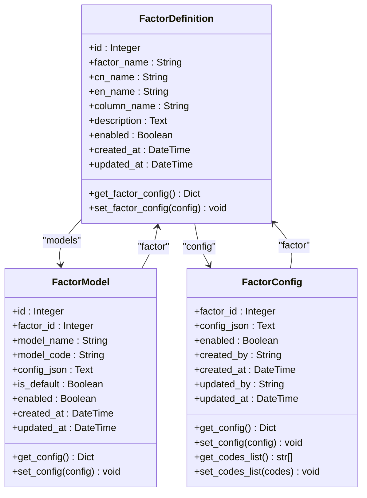
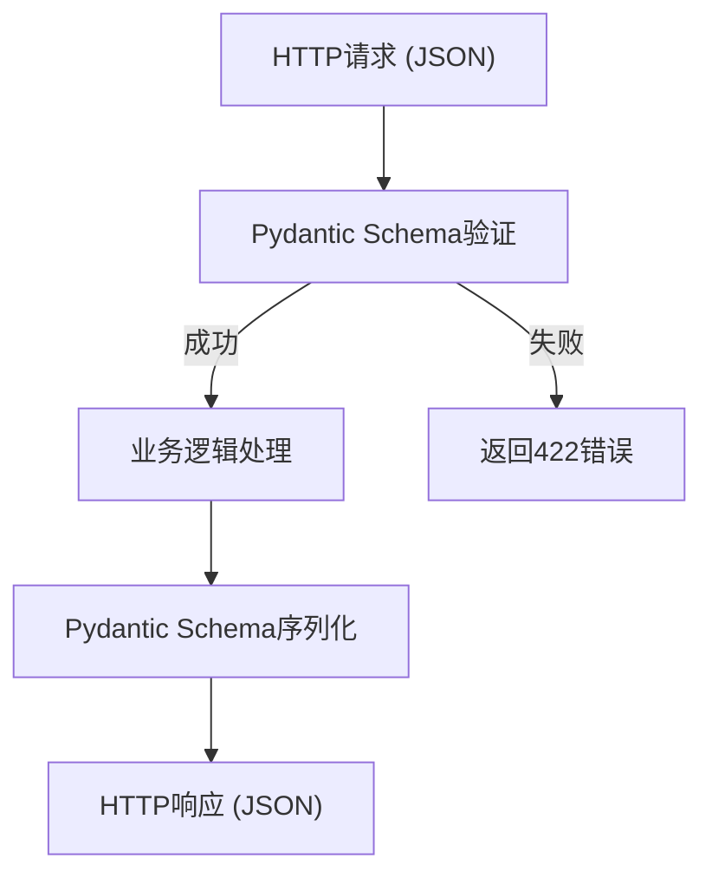

# 数据模型

<cite>
**本文档引用的文件**   
- [user.py](file://zquant/models/user.py)
- [backtest.py](file://zquant/models/backtest.py)
- [data.py](file://zquant/models/data.py)
- [factor.py](file://zquant/models/factor.py)
- [user.py](file://zquant/schemas/user.py)
- [backtest.py](file://zquant/schemas/backtest.py)
- [factor.py](file://zquant/schemas/factor.py)
- [database.py](file://zquant/database.py)
- [env.py](file://zquant/alembic/env.py)
- [config.py](file://zquant/config.py)
</cite>

## 目录
1. [引言](#引言)
2. [项目结构](#项目结构)
3. [核心数据模型](#核心数据模型)
4. [Pydantic Schema设计](#pydantic-schemadesign)
5. [数据库迁移管理](#数据库迁移管理)
6. [数据查询与事务管理](#数据查询与事务管理)
7. [数据库模式演进策略](#数据库模式演进策略)
8. [结论](#结论)

## 引言
zquant项目是一个量化投资分析平台，其数据模型设计遵循清晰的分层架构和规范化的命名约定。本项目采用SQLAlchemy作为ORM框架，Pydantic用于请求验证和响应序列化，Alembic进行数据库迁移管理。数据模型分为应用表、回测表、数据表和任务表四大类，分别以`zq_app_*`、`zq_backtest_*`、`zq_data_*`和`zq_task_*`为前缀，确保了不同功能模块的数据隔离和管理清晰。

**Section sources**
- [data.py](file://zquant/models/data.py#L49-L55)

## 项目结构
zquant项目的模型文件组织清晰，主要分为以下几个模块：
- `models/` 目录包含所有SQLAlchemy ORM模型，按功能划分为`user.py`、`backtest.py`、`data.py`和`factor.py`等文件。
- `schemas/` 目录包含所有Pydantic模型，用于API请求验证和响应序列化，与`models/`目录结构相对应。
- `alembic/` 目录包含数据库迁移配置和脚本模板。
- `database.py` 文件定义了数据库连接、会话管理和基类。
- `config.py` 文件管理应用的所有配置，包括数据库连接参数。

这种分层结构使得数据访问层、业务逻辑层和API层职责分明，便于维护和扩展。



**Diagram sources **
- [zquant/models/user.py](file://zquant/models/user.py)
- [zquant/models/backtest.py](file://zquant/models/backtest.py)
- [zquant/models/data.py](file://zquant/models/data.py)
- [zquant/models/factor.py](file://zquant/models/factor.py)
- [zquant/schemas/user.py](file://zquant/schemas/user.py)
- [zquant/schemas/backtest.py](file://zquant/schemas/backtest.py)
- [zquant/schemas/factor.py](file://zquant/schemas/factor.py)
- [zquant/database.py](file://zquant/database.py)
- [zquant/alembic/env.py](file://zquant/alembic/env.py)
- [zquant/config.py](file://zquant/config.py)

**Section sources**
- [zquant/models/user.py](file://zquant/models/user.py)
- [zquant/models/backtest.py](file://zquant/models/backtest.py)
- [zquant/models/data.py](file://zquant/models/data.py)
- [zquant/models/factor.py](file://zquant/models/factor.py)
- [zquant/schemas/user.py](file://zquant/schemas/user.py)
- [zquant/schemas/backtest.py](file://zquant/schemas/backtest.py)
- [zquant/schemas/factor.py](file://zquant/schemas/factor.py)
- [zquant/database.py](file://zquant/database.py)
- [zquant/alembic/env.py](file://zquant/alembic/env.py)
- [zquant/config.py](file://zquant/config.py)

## 核心数据模型

zquant项目的核心数据模型设计围绕用户管理、回测分析、数据存储和因子计算四大功能展开。所有模型均继承自`database.Base`，并遵循统一的命名和约束规范。

### 用户管理模型
用户管理模块包含`User`、`Role`、`Permission`和`APIKey`四个核心实体。

`User`模型（`zq_app_users`表）是系统的核心实体，包含用户名、邮箱、密码哈希、角色关联等字段。`role_id`字段作为外键关联到`Role`表，建立了用户与角色的一对多关系。`User`模型通过`back_populates`属性与`Role`模型双向关联，确保了数据一致性。

`Role`模型（`zq_app_roles`表）定义了系统中的角色，如管理员、普通用户等。`Role`与`Permission`通过`RolePermission`关联表建立多对多关系，实现了灵活的权限分配机制。

`APIKey`模型（`zq_app_apikeys`表）用于管理用户的API访问密钥，支持密钥的创建、激活和过期管理。每个API密钥都与一个用户关联，确保了访问的安全性。



**Diagram sources **
- [zquant/models/user.py](file://zquant/models/user.py)

**Section sources**
- [zquant/models/user.py](file://zquant/models/user.py)

### 回测分析模型
回测分析模块包含`BacktestTask`、`Strategy`和`BacktestResult`三个核心实体。

`BacktestTask`模型（`zq_backtest_tasks`表）代表一个回测任务，包含任务状态、配置信息、开始和完成时间等。`status`字段使用`BacktestStatus`枚举类型，确保了状态值的合法性。`user_id`和`strategy_id`字段作为外键，分别关联到`User`和`Strategy`表。

`Strategy`模型（`zq_backtest_strategies`表）存储用户创建的策略代码和参数。`is_template`字段标识策略是否为模板，便于策略的复用和管理。

`BacktestResult`模型（`zq_backtest_results`表）存储回测任务的详细结果，包括收益率、夏普比率、最大回撤等核心指标。结果以JSON格式存储详细数据，如交易记录和投资组合变化。



**Diagram sources **
- [zquant/models/backtest.py](file://zquant/models/backtest.py)

**Section sources**
- [zquant/models/backtest.py](file://zquant/models/backtest.py)

### 数据存储模型
数据存储模块采用分表策略来管理海量的金融数据，主要包含`Tustock`、`TustockDaily`、`TustockDailyBasic`、`TustockFactor`等动态生成的模型。

`Tustock`模型（`zq_data_tustock_stockbasic`表）存储股票的基础信息，如名称、行业、上市日期等。`ts_code`作为主键，确保了股票的唯一性。

`TustockDaily`、`TustockDailyBasic`和`TustockFactor`模型均通过`create_tustock_daily_class`、`create_tustock_daily_basic_class`和`create_tustock_factor_class`函数动态生成，实现了按`ts_code`分表。每个股票代码对应一个独立的数据表，如`zq_data_tustock_daily_000001`，有效解决了单表数据量过大的性能瓶颈。



**Diagram sources **
- [zquant/models/data.py](file://zquant/models/data.py)

**Section sources**
- [zquant/models/data.py](file://zquant/models/data.py)

### 因子计算模型
因子计算模块包含`FactorDefinition`、`FactorModel`和`FactorConfig`三个核心实体，用于管理和配置量化因子。

`FactorDefinition`模型（`zq_quant_factor_definitions`表）定义了因子的基本信息，如名称、描述和数据列名。`factor_name`字段具有唯一约束，确保了因子的唯一性。

`FactorModel`模型（`zq_quant_factor_models`表）定义了计算因子的具体算法模型。一个因子可以有多个模型，通过`is_default`字段标识默认算法。

`FactorConfig`模型（`zq_quant_factor_configs`表）存储因子的配置信息，以JSON格式保存启用状态和股票代码映射。`get_factor_config()`和`set_factor_config()`方法提供了便捷的配置读写接口。



**Diagram sources **
- [zquant/models/factor.py](file://zquant/models/factor.py)

**Section sources**
- [zquant/models/factor.py](file://zquant/models/factor.py)

## Pydantic Schema设计

Pydantic Schema在zquant项目中扮演着至关重要的角色，主要用于API请求的验证和响应的序列化。`schemas/`目录下的模型与`models/`目录下的ORM模型紧密对应，但职责分离，确保了API接口的稳定性和灵活性。

### 请求验证
Pydantic模型通过字段注解和验证器（`@model_validator`）确保了输入数据的合法性和完整性。例如，`UserCreate`模型要求密码至少8位，并通过`validate_password_match`验证器确保两次输入的密码一致。



**Diagram sources **
- [zquant/schemas/user.py](file://zquant/schemas/user.py)

### 响应序列化
响应模型（如`UserResponse`、`BacktestTaskResponse`）通过`Config`类中的`from_attributes = True`配置，实现了与ORM模型的自动映射。这使得服务层可以直接返回ORM对象，由FastAPI框架自动转换为JSON响应。

### 与ORM模型的映射关系
Pydantic模型与SQLAlchemy ORM模型的映射关系清晰，通常遵循以下原则：
- `Create`模型对应POST请求的请求体。
- `Update`模型对应PUT/PATCH请求的请求体。
- `Response`模型对应所有GET请求的响应体。
- `Base`模型作为`Create`和`Response`模型的基类，避免重复定义。

这种设计模式使得数据流清晰，易于维护。

**Section sources**
- [zquant/schemas/user.py](file://zquant/schemas/user.py)
- [zquant/schemas/backtest.py](file://zquant/schemas/backtest.py)
- [zquant/schemas/factor.py](file://zquant/schemas/factor.py)

## 数据库迁移管理

zquant项目使用Alembic进行数据库迁移管理，确保了数据库模式的版本控制和团队协作。

### Alembic配置
`alembic/env.py`文件是迁移环境的核心配置。它通过`sys.path.insert`将项目根目录加入Python路径，确保了模型的正确导入。`target_metadata = Base.metadata`指定了迁移的目标元数据，即所有继承自`Base`的模型。

```python
# zquant/alembic/env.py
from zquant.database import Base
from zquant.models import *  # Import all models

target_metadata = Base.metadata
```

### 迁移流程
1. **生成迁移脚本**：使用`alembic revision --autogenerate -m "描述"`命令，Alembic会自动比较当前模型与数据库状态，生成差异化的迁移脚本。
2. **审查迁移脚本**：生成的脚本位于`alembic/versions/`目录下，需要手动审查以确保正确性。
3. **应用迁移**：使用`alembic upgrade head`命令将迁移应用到数据库。

### 最佳实践
- **版本控制**：所有迁移脚本都应提交到版本控制系统（如Git），确保团队成员同步。
- **测试迁移**：在生产环境应用迁移前，应在测试环境中充分测试。
- **备份数据库**：在执行重大迁移前，务必备份数据库。

**Section sources**
- [zquant/alembic/env.py](file://zquant/alembic/env.py)
- [zquant/database.py](file://zquant/database.py)

## 数据查询与事务管理

zquant项目通过SQLAlchemy ORM和自定义服务类实现了高效的数据查询和安全的事务管理。

### 模型查询
服务类（如`UserService`）封装了常见的CRUD操作。例如，`get_all_users`方法构建了复杂的查询，支持分页、筛选和排序。

```python
# zquant/services/user.py
def get_all_users(db: Session, skip: int, limit: int, is_active: bool | None, ...):
    query = db.query(User)
    if is_active is not None:
        query = query.filter(User.is_active == is_active)
    # ... 其他条件
    return query.offset(skip).limit(limit).all()
```

### 关联加载
SQLAlchemy支持多种关联加载策略，如`selectinload`、`joinedload`等。在需要获取关联数据时，应在查询中显式指定加载策略，避免N+1查询问题。

### 事务管理
`get_db_context`上下文管理器确保了事务的原子性。在`with`块中，所有数据库操作都在同一个事务中执行，发生异常时自动回滚。

```python
# zquant/database.py
@contextmanager
def get_db_context() -> Generator[Session, None, None]:
    db = SessionLocal()
    try:
        yield db
        db.commit()
    except Exception as e:
        db.rollback()
        raise
    finally:
        db.close()
```

**Section sources**
- [zquant/services/user.py](file://zquant/services/user.py)
- [zquant/database.py](file://zquant/database.py)

## 数据库模式演进策略

zquant项目遵循以下数据库模式演进原则：

### 分表策略
对于海量数据（如日线数据），采用按`ts_code`分表的策略。`get_daily_table_name`函数根据股票代码生成对应的表名，`create_tustock_daily_class`函数动态创建SQLAlchemy模型。这种策略显著提升了查询性能。

### 视图管理
通过创建视图（如`zq_data_tustock_daily_view`），将所有分表的数据聚合起来，为上层应用提供统一的查询接口，简化了数据访问逻辑。

### 版本控制
所有模式变更都通过Alembic迁移脚本进行版本控制。每个迁移脚本都有唯一的`revision ID`，并记录了与前一个版本的依赖关系（`revises`）。

### 向后兼容
在修改现有字段时，优先考虑添加新字段而非修改旧字段，确保API的向后兼容性。旧字段在确认无用后方可删除。

**Section sources**
- [zquant/models/data.py](file://zquant/models/data.py)
- [zquant/alembic/env.py](file://zquant/alembic/env.py)

## 结论
zquant项目的数据模型设计体现了良好的工程实践。通过分层架构、清晰的命名规范、动态分表和自动化迁移，构建了一个可扩展、高性能的量化分析平台。Pydantic Schema与SQLAlchemy ORM的有效结合，确保了API接口的健壮性和数据访问的灵活性。未来可进一步优化索引策略和查询性能，以应对更大规模的数据处理需求。