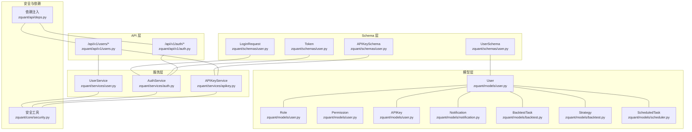
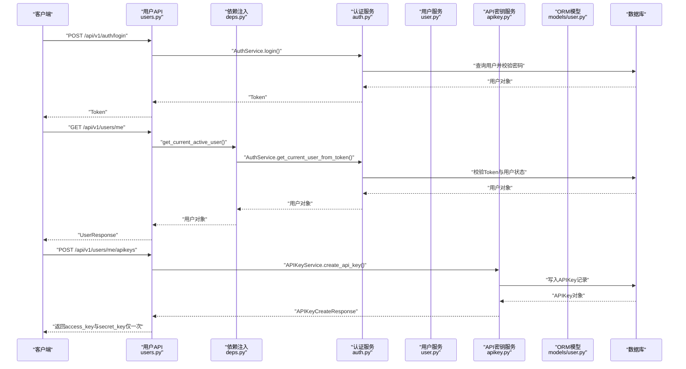
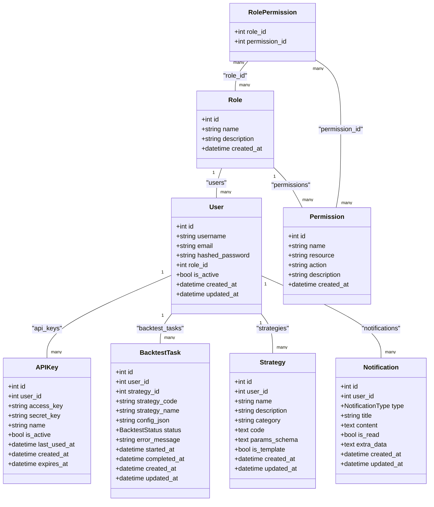
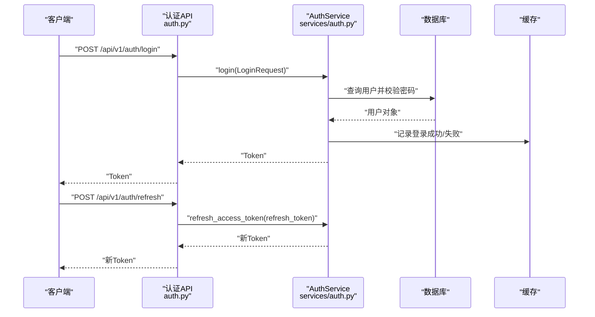
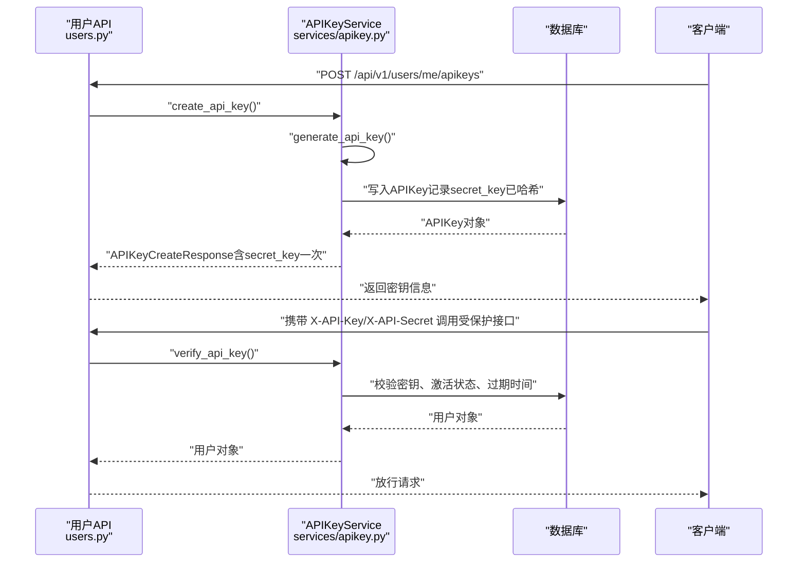
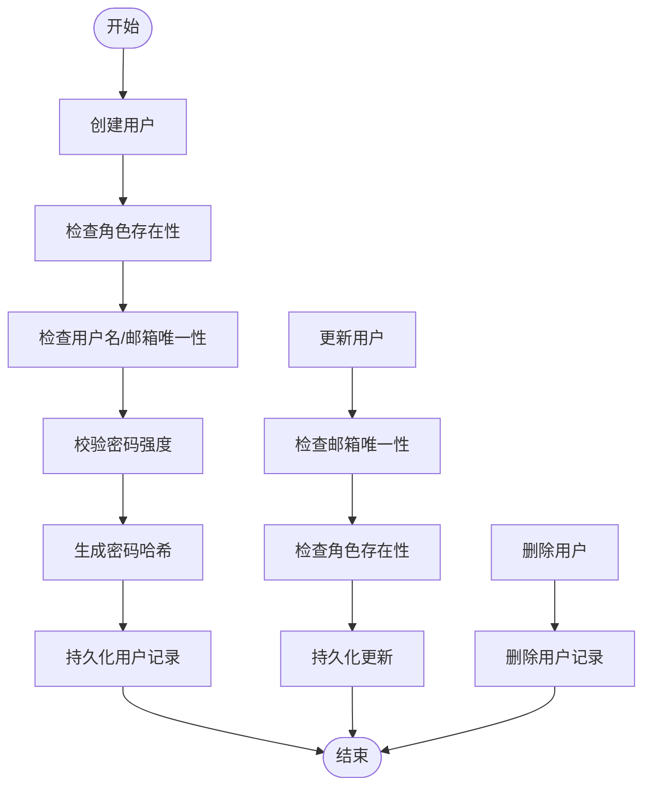
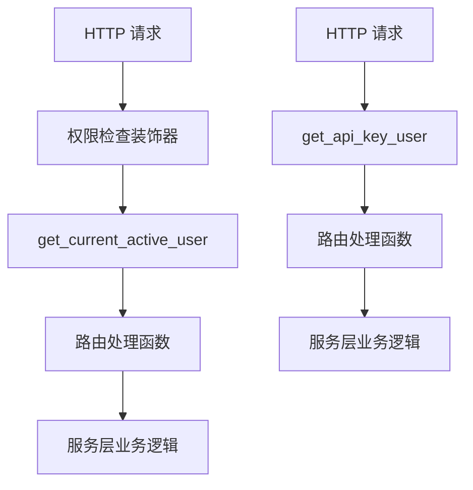
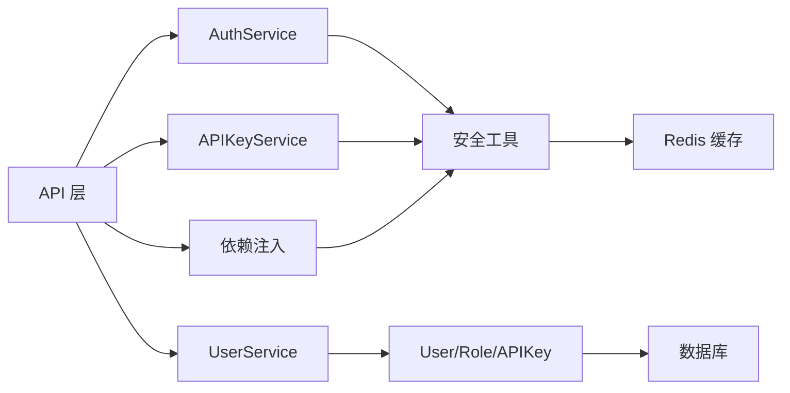

# 用户模型

<cite>
**本文引用的文件**
- [zquant/models/user.py](file://zquant/models/user.py)
- [zquant/schemas/user.py](file://zquant/schemas/user.py)
- [zquant/services/user.py](file://zquant/services/user.py)
- [zquant/api/v1/users.py](file://zquant/api/v1/users.py)
- [zquant/models/backtest.py](file://zquant/models/backtest.py)
- [zquant/models/scheduler.py](file://zquant/models/scheduler.py)
- [zquant/services/apikey.py](file://zquant/services/apikey.py)
- [zquant/core/security.py](file://zquant/core/security.py)
- [zquant/api/deps.py](file://zquant/api/deps.py)
- [zquant/services/auth.py](file://zquant/services/auth.py)
- [zquant/api/v1/auth.py](file://zquant/api/v1/auth.py)
- [zquant/models/notification.py](file://zquant/models/notification.py)
</cite>

## 目录
1. [简介](#简介)
2. [项目结构](#项目结构)
3. [核心组件](#核心组件)
4. [架构总览](#架构总览)
5. [详细组件分析](#详细组件分析)
6. [依赖分析](#依赖分析)
7. [性能考虑](#性能考虑)
8. [故障排查指南](#故障排查指南)
9. [结论](#结论)
10. [附录](#附录)

## 简介
本文件围绕用户数据模型进行全面技术文档化，覆盖以下方面：
- ORM模型字段定义与约束：id、username、email、hashed_password、role_id、is_active、created_at、updated_at 等。
- 用户模型与其他模型的关系：与 BacktestTask、ScheduledTask、APIKey、Notification 的外键与反向关系。
- Pydantic Schema 在请求校验与响应序列化中的应用及与 ORM 的映射机制。
- 用户认证、权限验证与 API 密钥管理的实现模式与最佳实践。
- 用户数据生命周期管理、安全存储（密码哈希）、访问控制与审计要点。

## 项目结构
用户相关的核心代码分布在以下模块：
- ORM 模型：用户、角色、权限、API 密钥、通知、回测任务、策略、回测结果、定时任务等。
- Pydantic Schema：用户、角色、权限、Token、登录请求、API 密钥、分页等。
- 服务层：用户服务、认证服务、API 密钥服务。
- API 层：用户管理接口、认证接口。
- 安全工具：密码哈希、JWT、API 密钥生成与校验。
- 依赖注入：基于 Bearer Token 与 API Key 的用户解析。

图表来源
- [zquant/models/user.py](file://zquant/models/user.py#L74-L113)
- [zquant/models/notification.py](file://zquant/models/notification.py#L47-L70)
- [zquant/models/backtest.py](file://zquant/models/backtest.py#L48-L90)
- [zquant/models/scheduler.py](file://zquant/models/scheduler.py#L68-L106)
- [zquant/schemas/user.py](file://zquant/schemas/user.py#L33-L220)
- [zquant/services/user.py](file://zquant/services/user.py#L37-L222)
- [zquant/services/auth.py](file://zquant/services/auth.py#L45-L289)
- [zquant/services/apikey.py](file://zquant/services/apikey.py#L43-L142)
- [zquant/api/v1/users.py](file://zquant/api/v1/users.py#L51-L208)
- [zquant/api/v1/auth.py](file://zquant/api/v1/auth.py#L39-L65)
- [zquant/core/security.py](file://zquant/core/security.py#L39-L133)
- [zquant/api/deps.py](file://zquant/api/deps.py#L41-L93)

章节来源
- [zquant/models/user.py](file://zquant/models/user.py#L74-L113)
- [zquant/schemas/user.py](file://zquant/schemas/user.py#L33-L220)
- [zquant/services/user.py](file://zquant/services/user.py#L37-L222)
- [zquant/api/v1/users.py](file://zquant/api/v1/users.py#L51-L208)

## 核心组件
本节聚焦用户模型的字段定义、约束与关系，并说明与 Pydantic Schema 的映射。

- User ORM 字段与约束
  - id：整型主键，索引。
  - username：字符串，唯一、非空、索引。
  - email：字符串，唯一、非空、索引。
  - hashed_password：字符串，非空，存储 bcrypt 哈希后的密码。
  - role_id：整型，外键至 zq_app_roles.id，非空。
  - is_active：布尔，默认 true，非空。
  - created_at、updated_at：时间戳，默认当前时间，支持 onupdate 更新。
  - 关系：
    - role：与 Role 的多对一关系。
    - api_keys：与 APIKey 的一对多关系，级联删除孤儿。
    - backtest_tasks：与 BacktestTask 的一对多关系，级联删除孤儿。
    - strategies：与 Strategy 的一对多关系，级联删除孤儿。
    - notifications：与 Notification 的一对多关系，级联删除孤儿。

- Pydantic UserSchema 映射
  - UserBase：username、email。
  - UserCreate：继承 UserBase，新增 password、password_confirm、role_id；包含密码一致性校验。
  - UserUpdate：email、is_active、role_id（可空）。
  - PasswordReset：password、password_confirm；包含密码一致性校验。
  - UserInDB：id、role_id、is_active、created_at、updated_at；开启 from_attributes。
  - UserResponse：id、role_id、is_active、created_at；开启 from_attributes。
  - APIKeyCreate/Response/CreateResponse：API 密钥创建、查询与首次返回 secret_key 的 Schema。
  - Token/TokenData/LoginRequest：登录、Token 类型与数据模型。

- 与 BacktestTask、ScheduledTask 的关系
  - BacktestTask.user_id 外键指向 zq_app_users.id，BacktestTask.user 与 User.backtest_tasks 反向关系。
  - Strategy.user_id 外键指向 zq_app_users.id，Strategy.user 与 User.strategies 反向关系。
  - Notification.user_id 外键指向 zq_app_users.id，Notification.user 与 User.notifications 反向关系。
  - ScheduledTask 与 User 无直接外键关系，但可通过业务逻辑与用户关联（例如执行者、创建者）。

章节来源
- [zquant/models/user.py](file://zquant/models/user.py#L74-L113)
- [zquant/schemas/user.py](file://zquant/schemas/user.py#L33-L220)
- [zquant/models/backtest.py](file://zquant/models/backtest.py#L48-L90)
- [zquant/models/notification.py](file://zquant/models/notification.py#L47-L70)

## 架构总览
用户数据模型贯穿“API 层 → 依赖注入 → 服务层 → ORM 模型 → 数据库”的调用链路，同时配合安全工具与 Schema 校验，形成完整的认证、授权与数据管理闭环。

图表来源
- [zquant/api/v1/auth.py](file://zquant/api/v1/auth.py#L39-L65)
- [zquant/api/v1/users.py](file://zquant/api/v1/users.py#L79-L123)
- [zquant/api/deps.py](file://zquant/api/deps.py#L41-L93)
- [zquant/services/auth.py](file://zquant/services/auth.py#L200-L289)
- [zquant/services/user.py](file://zquant/services/user.py#L37-L120)
- [zquant/services/apikey.py](file://zquant/services/apikey.py#L43-L120)
- [zquant/models/user.py](file://zquant/models/user.py#L74-L113)

## 详细组件分析

### User ORM 模型与关系图

图表来源
- [zquant/models/user.py](file://zquant/models/user.py#L34-L113)
- [zquant/models/backtest.py](file://zquant/models/backtest.py#L48-L90)
- [zquant/models/notification.py](file://zquant/models/notification.py#L47-L70)

章节来源
- [zquant/models/user.py](file://zquant/models/user.py#L34-L113)
- [zquant/models/backtest.py](file://zquant/models/backtest.py#L48-L90)
- [zquant/models/notification.py](file://zquant/models/notification.py#L47-L70)

### 用户认证流程（登录、Token 刷新、登出）
- 登录：客户端提交用户名与密码，API 层调用认证服务，服务层校验密码与用户状态，生成访问 Token 与刷新 Token。
- 刷新：客户端使用刷新 Token 请求新访问 Token。
- 登出：客户端删除本地 Token 即可；服务端通过黑名单机制保障 Token 失效（若启用）。

图表来源
- [zquant/api/v1/auth.py](file://zquant/api/v1/auth.py#L39-L65)
- [zquant/services/auth.py](file://zquant/services/auth.py#L200-L289)
- [zquant/core/security.py](file://zquant/core/security.py#L85-L105)

章节来源
- [zquant/api/v1/auth.py](file://zquant/api/v1/auth.py#L39-L65)
- [zquant/services/auth.py](file://zquant/services/auth.py#L164-L289)
- [zquant/core/security.py](file://zquant/core/security.py#L39-L105)

### API 密钥管理流程
- 创建密钥：用户创建 API 密钥，服务层生成 access_key 与 secret_key，secret_key 存储为哈希值，仅在创建时返回明文 secret_key。
- 验证密钥：通过 access_key 与 secret_key 验证用户身份，检查激活状态与过期时间，更新最后使用时间。
- 删除/禁用密钥：仅允许用户删除自己的密钥，或禁用密钥。

图表来源
- [zquant/api/v1/users.py](file://zquant/api/v1/users.py#L101-L136)
- [zquant/services/apikey.py](file://zquant/services/apikey.py#L43-L142)
- [zquant/core/security.py](file://zquant/core/security.py#L116-L133)

章节来源
- [zquant/api/v1/users.py](file://zquant/api/v1/users.py#L101-L136)
- [zquant/services/apikey.py](file://zquant/services/apikey.py#L43-L142)
- [zquant/core/security.py](file://zquant/core/security.py#L116-L133)

### 用户数据生命周期与安全存储
- 创建用户：校验角色存在性、用户名与邮箱唯一性、密码强度，存储 hashed_password。
- 更新用户：邮箱唯一性检查、角色存在性检查、可选更新 is_active 与 role_id。
- 删除用户：软/硬删除取决于业务需求，建议保留关联数据的级联策略以维持数据完整性。
- 密码安全：使用 bcrypt 哈希存储，密码强度规则在服务层统一校验。
- API 密钥安全：仅在创建时返回 secret_key，后续仅存储哈希值；定期轮换密钥，设置过期时间。

图表来源
- [zquant/services/user.py](file://zquant/services/user.py#L37-L120)
- [zquant/core/security.py](file://zquant/core/security.py#L49-L83)

章节来源
- [zquant/services/user.py](file://zquant/services/user.py#L37-L222)
- [zquant/core/security.py](file://zquant/core/security.py#L39-L83)

### 权限验证与访问控制
- API 层使用装饰器对路由进行权限检查，例如对用户 CRUD 操作要求特定权限。
- 依赖注入层提供 get_current_active_user，确保当前用户处于激活状态。
- API Key 方案通过自定义依赖 get_api_key_user，支持基于请求头的密钥认证。

图表来源
- [zquant/api/v1/users.py](file://zquant/api/v1/users.py#L51-L77)
- [zquant/api/deps.py](file://zquant/api/deps.py#L70-L93)

章节来源
- [zquant/api/v1/users.py](file://zquant/api/v1/users.py#L51-L77)
- [zquant/api/deps.py](file://zquant/api/deps.py#L70-L93)

## 依赖分析
- 组件耦合
  - API 层依赖依赖注入与服务层；服务层依赖 ORM 模型与安全工具。
  - User 模型与 Role、APIKey、BacktestTask、Strategy、Notification 存在明确外键关系。
- 外部依赖
  - SQLAlchemy ORM 用于模型定义与关系映射。
  - Pydantic 用于请求/响应校验与序列化。
  - passlib bcrypt 用于密码哈希；jose 用于 JWT 编解码。
  - Redis 缓存用于登录失败次数与 Token 黑名单。

图表来源
- [zquant/api/v1/users.py](file://zquant/api/v1/users.py#L51-L208)
- [zquant/api/deps.py](file://zquant/api/deps.py#L41-L93)
- [zquant/services/user.py](file://zquant/services/user.py#L37-L222)
- [zquant/services/auth.py](file://zquant/services/auth.py#L45-L289)
- [zquant/services/apikey.py](file://zquant/services/apikey.py#L43-L142)
- [zquant/core/security.py](file://zquant/core/security.py#L39-L133)

章节来源
- [zquant/api/v1/users.py](file://zquant/api/v1/users.py#L51-L208)
- [zquant/api/deps.py](file://zquant/api/deps.py#L41-L93)
- [zquant/services/user.py](file://zquant/services/user.py#L37-L222)
- [zquant/services/auth.py](file://zquant/services/auth.py#L45-L289)
- [zquant/services/apikey.py](file://zquant/services/apikey.py#L43-L142)
- [zquant/core/security.py](file://zquant/core/security.py#L39-L133)

## 性能考虑
- 查询优化
  - 对 username、email、role_id、is_active、created_at、updated_at 等常用过滤与排序字段建立索引，减少查询开销。
  - 分页查询时使用 skip/limit，并对总数进行单独统计，避免一次性加载大量数据。
- 缓存策略
  - 登录失败次数与锁定状态使用 Redis 缓存，降低数据库压力。
  - Token 黑名单使用 Redis 存储，避免频繁查询数据库。
- 密钥与密码
  - API 密钥 secret_key 仅在创建时返回一次，其余均存储哈希值，降低泄露风险与计算成本。
  - 密码使用 bcrypt 哈希，强度高但计算成本较高，建议在批量导入或迁移场景下谨慎处理。

## 故障排查指南
- 认证失败
  - 用户名或密码错误：检查用户名是否存在、密码是否匹配、用户是否被禁用。
  - 登录失败次数过多导致账户锁定：查看缓存中的登录尝试计数与锁定时间。
  - Token 失效：确认 Token 类型是否为 access、是否在黑名单中、是否过期。
- API 密钥问题
  - 无效或过期密钥：检查 access_key 是否存在、secret_key 是否匹配、是否被禁用或过期。
  - 删除/禁用密钥失败：确认密钥属于当前用户。
- 用户管理
  - 用户名/邮箱重复：检查唯一性约束是否被违反。
  - 角色不存在：确认 role_id 是否有效。

章节来源
- [zquant/services/auth.py](file://zquant/services/auth.py#L164-L289)
- [zquant/services/apikey.py](file://zquant/services/apikey.py#L89-L142)
- [zquant/services/user.py](file://zquant/services/user.py#L37-L120)
- [zquant/api/deps.py](file://zquant/api/deps.py#L41-L93)

## 结论
用户数据模型在本项目中采用清晰的 ORM 设计与严格的 Schema 校验，结合认证服务、API 密钥服务与依赖注入，实现了从请求到持久化的完整闭环。通过 bcrypt 哈希、JWT 与 Redis 缓存，系统在安全性与性能之间取得平衡。建议在生产环境中持续完善审计日志、密钥轮换策略与权限最小化原则，以进一步提升系统的安全与可维护性。

## 附录
- 最佳实践清单
  - 密码策略：强制大小写字母、数字与特殊字符，长度 8-128。
  - API 密钥：仅在创建时保存明文 secret_key，定期轮换，设置合理有效期。
  - 权限控制：基于资源与动作的细粒度权限检查，遵循最小权限原则。
  - 审计与监控：记录登录、Token 刷新、密钥创建/删除等关键事件。
  - 数据一致性：利用外键与级联删除策略，保证用户与其子资源的一致性。