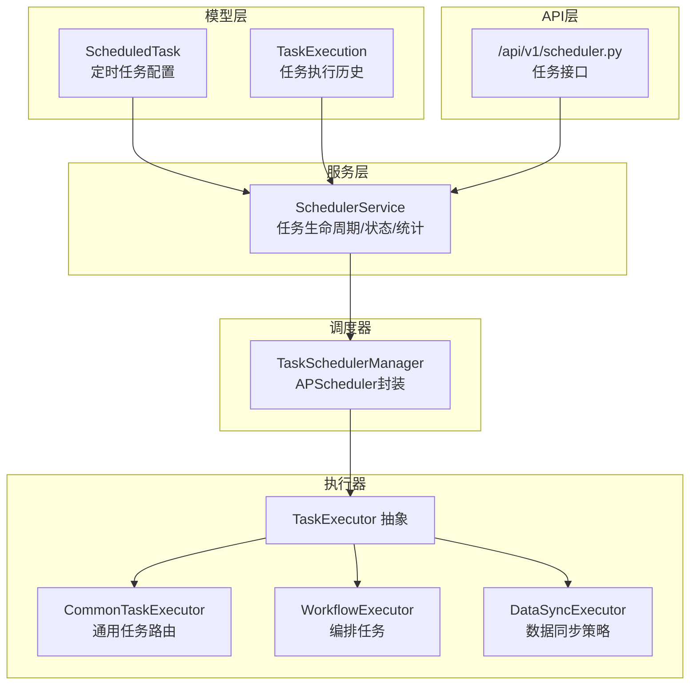
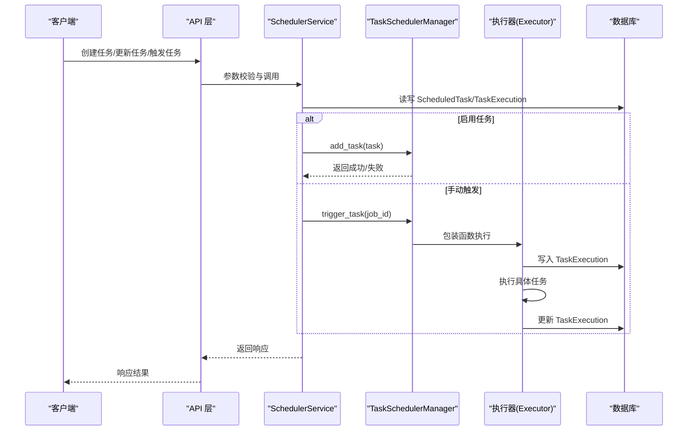
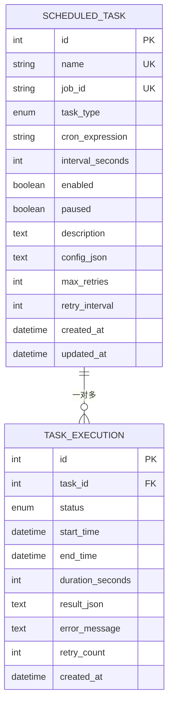
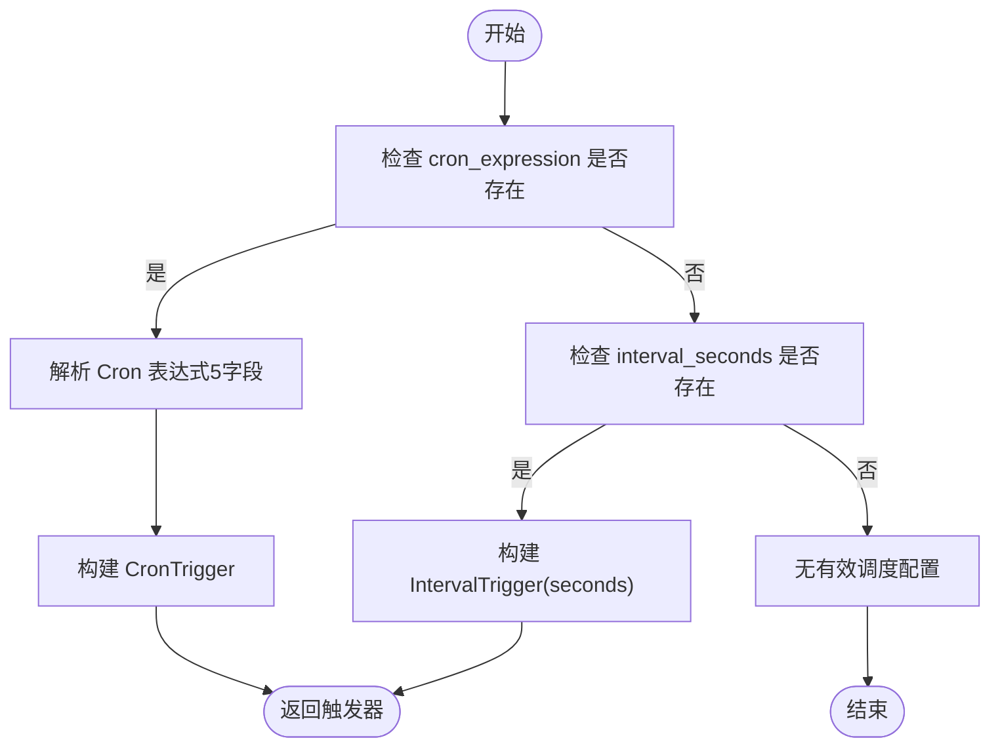
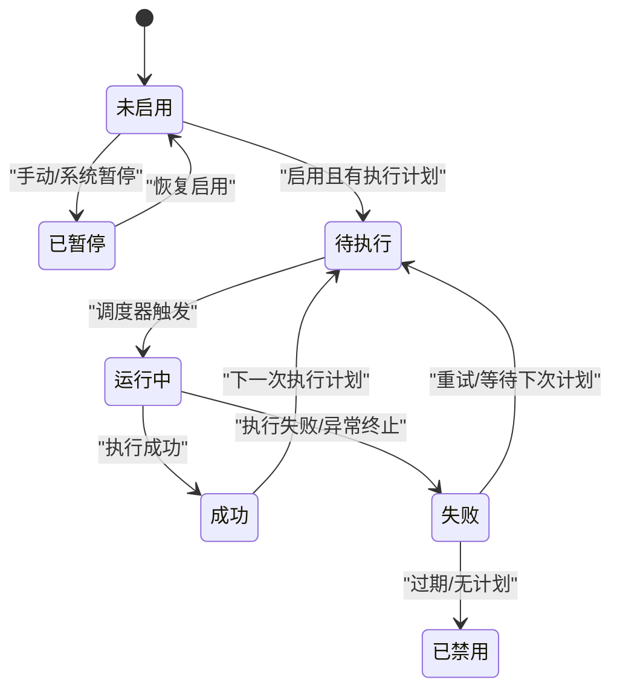
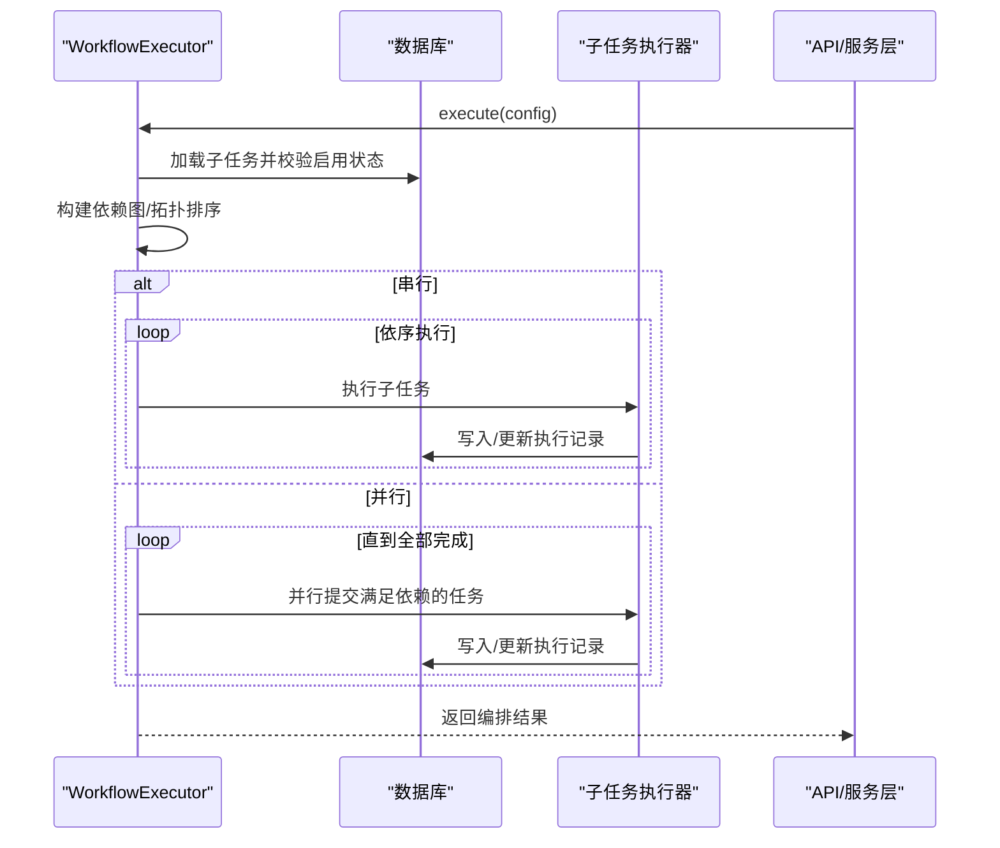
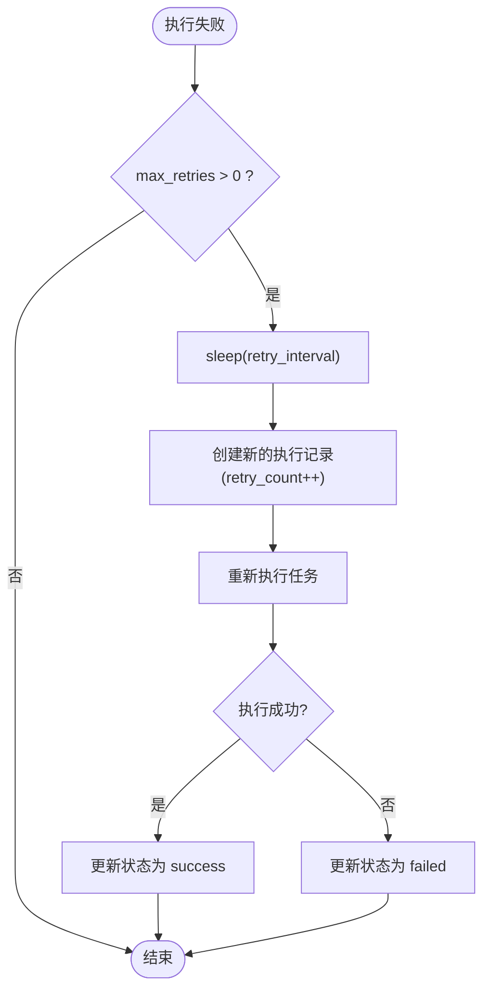
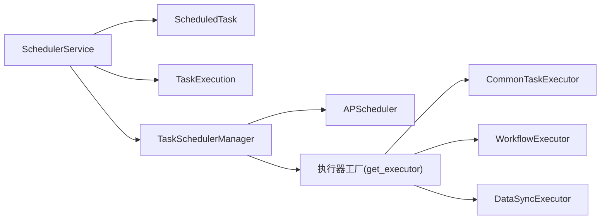

# 调度模型

<cite>
**本文引用的文件**
- [zquant/models/scheduler.py](file://zquant/models/scheduler.py)
- [zquant/schemas/scheduler.py](file://zquant/schemas/scheduler.py)
- [zquant/services/scheduler.py](file://zquant/services/scheduler.py)
- [zquant/scheduler/manager.py](file://zquant/scheduler/manager.py)
- [zquant/scheduler/base.py](file://zquant/scheduler/base.py)
- [zquant/scheduler/executor.py](file://zquant/scheduler/executor.py)
- [zquant/scheduler/executors/common_executor.py](file://zquant/scheduler/executors/common_executor.py)
- [zquant/scheduler/executors/workflow_executor.py](file://zquant/scheduler/executors/workflow_executor.py)
- [zquant/api/v1/scheduler.py](file://zquant/api/v1/scheduler.py)
- [zquant/scripts/init_scheduler.py](file://zquant/scripts/init_scheduler.py)
- [docs/scheduler_guide.md](file://docs/scheduler_guide.md)
</cite>

## 目录
1. [简介](#简介)
2. [项目结构](#项目结构)
3. [核心组件](#核心组件)
4. [架构总览](#架构总览)
5. [详细组件分析](#详细组件分析)
6. [依赖关系分析](#依赖关系分析)
7. [性能考量](#性能考量)
8. [故障排查指南](#故障排查指南)
9. [结论](#结论)
10. [附录](#附录)

## 简介
本文件面向调度系统数据模型与执行流程，围绕以下目标展开：
- 全面梳理 ScheduledTask、TaskExecutionLog（对应 ORM 模型 TaskExecution）、CronTriggerConfig（触发器配置）等模型的字段定义与状态机设计
- 说明 ScheduledTask 与用户的关系边界（归属关系说明）、与 TaskExecution 的一对多关系
- 解释 SchedulerSchema 在任务参数校验与执行状态展示中的作用
- 结合代码示例路径，展示定时任务的创建、触发器配置、执行历史追踪与失败重试机制
- 提供调度元数据持久化、高并发任务调度与执行日志分析的最佳实践

## 项目结构
调度系统由“模型层（ORM）+ 服务层（业务逻辑）+ 执行器（任务执行）+ API 层（对外接口）+ 调度器（APScheduler 封装）”构成，核心文件如下：
- 模型层：ScheduledTask、TaskExecution
- 服务层：SchedulerService（任务生命周期、状态计算、统计、编排校验等）
- 执行器：TaskExecutor 抽象、CommonTaskExecutor、WorkflowExecutor、DataSyncExecutor
- 调度器：TaskSchedulerManager（基于 APScheduler 的封装）
- API 层：/api/v1/scheduler.py（任务 CRUD、触发、统计、编排校验等）
- 文档与示例：docs/scheduler_guide.md、scripts/init_scheduler.py

图表来源
- [zquant/models/scheduler.py](file://zquant/models/scheduler.py#L68-L203)
- [zquant/services/scheduler.py](file://zquant/services/scheduler.py#L39-L710)
- [zquant/scheduler/manager.py](file://zquant/scheduler/manager.py#L46-L475)
- [zquant/scheduler/base.py](file://zquant/scheduler/base.py#L35-L72)
- [zquant/scheduler/executor.py](file://zquant/scheduler/executor.py#L122-L152)
- [zquant/scheduler/executors/common_executor.py](file://zquant/scheduler/executors/common_executor.py#L37-L135)
- [zquant/scheduler/executors/workflow_executor.py](file://zquant/scheduler/executors/workflow_executor.py#L39-L385)
- [zquant/api/v1/scheduler.py](file://zquant/api/v1/scheduler.py#L1-L341)

章节来源
- [zquant/models/scheduler.py](file://zquant/models/scheduler.py#L68-L203)
- [zquant/services/scheduler.py](file://zquant/services/scheduler.py#L39-L710)
- [zquant/scheduler/manager.py](file://zquant/scheduler/manager.py#L46-L475)
- [zquant/scheduler/base.py](file://zquant/scheduler/base.py#L35-L72)
- [zquant/scheduler/executor.py](file://zquant/scheduler/executor.py#L122-L152)
- [zquant/scheduler/executors/common_executor.py](file://zquant/scheduler/executors/common_executor.py#L37-L135)
- [zquant/scheduler/executors/workflow_executor.py](file://zquant/scheduler/executors/workflow_executor.py#L39-L385)
- [zquant/api/v1/scheduler.py](file://zquant/api/v1/scheduler.py#L1-L341)

## 核心组件
- ScheduledTask（定时任务配置）
  - 字段要点：名称、job_id、任务类型、Cron 表达式、间隔秒数、启用/暂停、描述、配置 JSON、重试次数与间隔、时间戳
  - 关系：与 TaskExecution 一对多（通过 task_id 关联）
- TaskExecution（任务执行历史）
  - 字段要点：任务 ID、状态、开始/结束时间、耗时、结果 JSON、错误信息、重试次数、创建时间
  - 关系：与 ScheduledTask 多对一（back_populates）
- SchedulerService（调度服务）
  - 负责任务创建/更新/删除、启用/禁用/暂停/恢复、手动触发、执行历史查询、统计、编排配置校验、调度状态计算
- TaskSchedulerManager（调度器）
  - 基于 APScheduler 的封装，负责任务添加/移除/暂停/恢复/手动触发、状态查询、触发器构建（Cron/Interval）、线程池执行
- TaskExecutor 抽象与具体执行器
  - TaskExecutor：统一执行接口与进度更新能力
  - CommonTaskExecutor：根据 config 路由到脚本执行、示例任务、数据同步、因子计算等
  - WorkflowExecutor：串行/并行编排，支持依赖与失败策略
  - DataSyncExecutor：数据同步策略入口（Strategy 模式）

章节来源
- [zquant/models/scheduler.py](file://zquant/models/scheduler.py#L68-L203)
- [zquant/services/scheduler.py](file://zquant/services/scheduler.py#L39-L710)
- [zquant/scheduler/manager.py](file://zquant/scheduler/manager.py#L46-L475)
- [zquant/scheduler/base.py](file://zquant/scheduler/base.py#L35-L72)
- [zquant/scheduler/executor.py](file://zquant/scheduler/executor.py#L122-L152)
- [zquant/scheduler/executors/common_executor.py](file://zquant/scheduler/executors/common_executor.py#L37-L135)
- [zquant/scheduler/executors/workflow_executor.py](file://zquant/scheduler/executors/workflow_executor.py#L39-L385)

## 架构总览
调度系统采用“模型-服务-执行器-调度器-接口”的分层架构：
- 模型层负责持久化与关系映射
- 服务层负责业务规则、状态计算与编排校验
- 执行器层负责任务的实际执行与进度更新
- 调度器层负责触发器与并发执行
- 接口层负责参数校验与对外暴露

图表来源
- [zquant/api/v1/scheduler.py](file://zquant/api/v1/scheduler.py#L51-L200)
- [zquant/services/scheduler.py](file://zquant/services/scheduler.py#L39-L200)
- [zquant/scheduler/manager.py](file://zquant/scheduler/manager.py#L93-L194)
- [zquant/scheduler/executor.py](file://zquant/scheduler/executor.py#L145-L152)
- [zquant/scheduler/executors/common_executor.py](file://zquant/scheduler/executors/common_executor.py#L49-L110)

## 详细组件分析

### ScheduledTask 与 TaskExecution：字段定义与关系
- ScheduledTask
  - 主键自增 id
  - 唯一索引：name、job_id
  - 关键字段：task_type、cron_expression、interval_seconds、enabled、paused、config_json、max_retries、retry_interval
  - 关系：与 TaskExecution 通过 task_id 一对多，按 start_time 逆序排列
- TaskExecution
  - 主键自增 id
  - 关键字段：task_id、status、start_time、end_time、duration_seconds、result_json、error_message、retry_count
  - 关系：与 ScheduledTask 多对一，back_populates

图表来源
- [zquant/models/scheduler.py](file://zquant/models/scheduler.py#L68-L203)

章节来源
- [zquant/models/scheduler.py](file://zquant/models/scheduler.py#L68-L203)

### CronTriggerConfig：触发器配置与构建
- CronTriggerConfig 并非单独的 ORM 模型，而是通过 ScheduledTask 的 cron_expression 与 interval_seconds 组合形成触发器
- TaskSchedulerManager._build_trigger 根据 cron_expression 构建 CronTrigger，或根据 interval_seconds 构建 IntervalTrigger
- Cron 表达式解析严格要求 5 个字段（分、时、日、月、周），否则视为无效

图表来源
- [zquant/scheduler/manager.py](file://zquant/scheduler/manager.py#L259-L281)

章节来源
- [zquant/scheduler/manager.py](file://zquant/scheduler/manager.py#L259-L281)

### SchedulerSchema：参数校验与状态展示
- TaskCreate/TaskUpdate：用于创建/更新任务的 Pydantic 模型，包含 name、task_type、cron_expression、interval_seconds、description、config、max_retries、retry_interval、enabled 等字段
- TaskResponse：用于对外展示任务信息，包含 latest_execution_time、latest_execution_status、schedule_status 等
- ExecutionResponse：用于对外展示执行历史，包含 status、start_time、end_time、duration_seconds、result、error_message、retry_count
- API 层在创建/更新任务时进行权限校验与参数校验（如手动任务禁止 Cron/间隔配置），并在查询任务列表时批量附加最新执行时间与状态

章节来源
- [zquant/schemas/scheduler.py](file://zquant/schemas/scheduler.py#L35-L114)
- [zquant/schemas/scheduler.py](file://zquant/schemas/scheduler.py#L116-L149)
- [zquant/api/v1/scheduler.py](file://zquant/api/v1/scheduler.py#L51-L172)

### 任务状态机设计
- TaskStatus（执行状态）：pending、running、success、failed、completed、terminated
- TaskScheduleStatus（调度状态）：disabled、paused、pending、running、success、failed
- SchedulerService.calculate_task_status 综合任务启用/暂停、调度器 job 状态、最新执行记录与未来执行计划，计算最终调度状态

图表来源
- [zquant/models/scheduler.py](file://zquant/models/scheduler.py#L38-L58)
- [zquant/services/scheduler.py](file://zquant/services/scheduler.py#L630-L710)

章节来源
- [zquant/models/scheduler.py](file://zquant/models/scheduler.py#L38-L58)
- [zquant/services/scheduler.py](file://zquant/services/scheduler.py#L630-L710)

### 手动任务与调度器集成
- 手动任务（MANUAL_TASK）不加入调度器，只能通过手动触发执行
- 非手动任务（COMMON_TASK、WORKFLOW）加入调度器，支持 Cron/Interval 触发
- 手动触发时，服务层在独立线程中创建执行记录并执行，完成后更新状态与结果

章节来源
- [zquant/services/scheduler.py](file://zquant/services/scheduler.py#L392-L491)
- [zquant/scheduler/manager.py](file://zquant/scheduler/manager.py#L93-L139)

### 编排任务（Workflow）执行流程
- 支持 serial（串行）与 parallel（并行）两种模式
- 依赖关系通过拓扑排序保证串行顺序，或通过线程池并行执行满足依赖的任务批次
- 支持 on_failure 策略：stop（停止）或 continue（继续）

图表来源
- [zquant/scheduler/executors/workflow_executor.py](file://zquant/scheduler/executors/workflow_executor.py#L39-L385)

章节来源
- [zquant/scheduler/executors/workflow_executor.py](file://zquant/scheduler/executors/workflow_executor.py#L39-L385)

### 失败重试机制
- 任务执行失败时，若 max_retries > 0，调度器在独立线程中延时 retry_interval 后创建新的执行记录并重试
- 重试次数记录在 TaskExecution.retry_count 中，最终成功或失败均更新执行记录

图表来源
- [zquant/scheduler/manager.py](file://zquant/scheduler/manager.py#L373-L463)

章节来源
- [zquant/scheduler/manager.py](file://zquant/scheduler/manager.py#L373-L463)

### 用户归属关系说明
- 当前模型层未直接包含用户字段（如 user_id），ScheduledTask 与 User 无直接外键关系
- API 层在创建/更新/删除任务时进行管理员权限校验，体现“操作者”而非“归属者”的控制边界
- 若需引入用户归属，可在 ScheduledTask 增加 user_id 外键并维护关系

章节来源
- [zquant/models/scheduler.py](file://zquant/models/scheduler.py#L68-L120)
- [zquant/api/v1/scheduler.py](file://zquant/api/v1/scheduler.py#L51-L89)

### 执行结果与日志精简策略
- TaskExecution.set_result 仅保留关键字段（success、exit_code、message、command、work_dir、duration_seconds、progress_percent、current_step、total_steps、汇总统计等），避免保存 stdout/stderr
- 若失败且存在 stderr，提取前 500 字符作为 error_summary
- 对超长结果进行兜底裁剪，确保不超过数据库限制

章节来源
- [zquant/models/scheduler.py](file://zquant/models/scheduler.py#L129-L203)

## 依赖关系分析
- 模块耦合
  - SchedulerService 依赖模型层（ScheduledTask、TaskExecution）、调度器（TaskSchedulerManager）、执行器工厂（get_executor）
  - TaskSchedulerManager 依赖 APScheduler、执行器工厂、数据库 Session
  - 执行器层通过工厂注册表解耦具体执行器类型
- 外部依赖
  - APScheduler（CronTrigger、IntervalTrigger、BackgroundScheduler、ThreadPoolExecutor）
  - SQLAlchemy（ORM、关系映射、索引）
  - Pydantic（Schema 校验与序列化）

图表来源
- [zquant/services/scheduler.py](file://zquant/services/scheduler.py#L39-L120)
- [zquant/scheduler/manager.py](file://zquant/scheduler/manager.py#L46-L120)
- [zquant/scheduler/executor.py](file://zquant/scheduler/executor.py#L122-L152)

章节来源
- [zquant/services/scheduler.py](file://zquant/services/scheduler.py#L39-L120)
- [zquant/scheduler/manager.py](file://zquant/scheduler/manager.py#L46-L120)
- [zquant/scheduler/executor.py](file://zquant/scheduler/executor.py#L122-L152)

## 性能考量
- 线程池与并发
  - TaskSchedulerManager 使用 ThreadPoolExecutor，max_workers 来源于配置项，确保任务异步执行
  - 并行编排使用线程池并发执行满足依赖的任务批次
- 触发器与调度
  - coalesce 合并待执行任务，max_instances=1 防止同任务并发实例
  - misfire_grace_time 控制错过执行时间的任务容忍窗口
- 数据库访问
  - 任务列表查询使用子查询与 group_by 聚合最新执行时间与状态，减少多次查询
  - 执行历史查询按 start_time 逆序分页，索引覆盖 task_id/status/start_time
- 结果存储
  - 执行结果仅保留必要字段，避免大体积日志写入数据库

章节来源
- [zquant/scheduler/manager.py](file://zquant/scheduler/manager.py#L46-L120)
- [zquant/services/scheduler.py](file://zquant/services/scheduler.py#L199-L239)
- [zquant/models/scheduler.py](file://zquant/models/scheduler.py#L129-L203)

## 故障排查指南
- 常见问题
  - Cron 表达式无效：检查字段数量与格式，确保为 5 个字段
  - 任务未加入调度器：确认任务类型非 MANUAL_TASK，且 enabled/paused 状态正常
  - 手动任务无法触发：需在独立线程中执行，检查线程池与数据库连接
  - 编排任务失败：检查依赖关系、循环依赖、on_failure 策略
- 日志与诊断
  - API 层对参数校验失败返回 400，对未找到任务返回 404，对内部错误返回 500
  - 调度器与执行器均输出详细日志，便于定位失败原因
- 重试与回滚
  - 失败重试在独立线程中执行，失败后更新执行记录并记录错误信息
  - 编排任务失败策略可选择 stop/continue

章节来源
- [zquant/api/v1/scheduler.py](file://zquant/api/v1/scheduler.py#L51-L200)
- [zquant/scheduler/manager.py](file://zquant/scheduler/manager.py#L373-L463)
- [zquant/scheduler/executors/workflow_executor.py](file://zquant/scheduler/executors/workflow_executor.py#L242-L344)

## 结论
调度系统通过清晰的分层设计实现了“配置驱动 + 触发器 + 执行器 + 状态机 + 统计”的完整闭环。ScheduledTask 与 TaskExecution 的关系明确了任务与执行历史的持久化边界；SchedulerService 的状态计算与编排校验保障了复杂场景下的稳定性；TaskSchedulerManager 的 APScheduler 封装提供了高并发与容错能力；API 层通过 Schema 实现强参数校验与一致的响应格式。结合本文最佳实践，可在生产环境中实现可靠的调度元数据持久化、高并发任务调度与执行日志分析。

## 附录

### 代码示例路径（创建/触发/历史/重试）
- 创建定时任务（含 Cron/间隔配置、启用状态、重试参数）
  - [zquant/api/v1/scheduler.py](file://zquant/api/v1/scheduler.py#L51-L89)
  - [zquant/services/scheduler.py](file://zquant/services/scheduler.py#L39-L111)
  - [zquant/scripts/init_scheduler.py](file://zquant/scripts/init_scheduler.py#L621-L710)
- 配置 Cron 触发器
  - [zquant/scheduler/manager.py](file://zquant/scheduler/manager.py#L259-L281)
- 手动触发任务
  - [zquant/services/scheduler.py](file://zquant/services/scheduler.py#L392-L491)
- 执行历史追踪
  - [zquant/api/v1/scheduler.py](file://zquant/api/v1/scheduler.py#L250-L291)
  - [zquant/services/scheduler.py](file://zquant/services/scheduler.py#L493-L514)
- 失败重试机制
  - [zquant/scheduler/manager.py](file://zquant/scheduler/manager.py#L373-L463)
- 编排任务（串行/并行）
  - [zquant/scheduler/executors/workflow_executor.py](file://zquant/scheduler/executors/workflow_executor.py#L39-L385)
- 任务参数校验与状态展示
  - [zquant/schemas/scheduler.py](file://zquant/schemas/scheduler.py#L35-L149)
  - [zquant/services/scheduler.py](file://zquant/services/scheduler.py#L630-L710)

### 最佳实践清单
- 调度元数据持久化
  - 为高频查询字段建立索引（name、job_id、task_type、enabled、paused、status、start_time）
  - 使用 JSON 字段存储配置，避免频繁新增字段
- 高并发任务调度
  - 合理设置线程池大小，避免资源争用
  - 使用 coalesce 与 misfire_grace_time 平衡吞吐与准确性
- 执行日志分析
  - 仅保留关键结果字段，避免大体积日志
  - 通过 latest_execution_time 与 latest_execution_status 快速定位异常
- 编排与重试
  - 串行编排使用拓扑排序，确保依赖满足
  - 并行编排注意资源竞争，合理设置并发度
  - 失败重试设置合理的 retry_interval 与 max_retries，避免雪崩