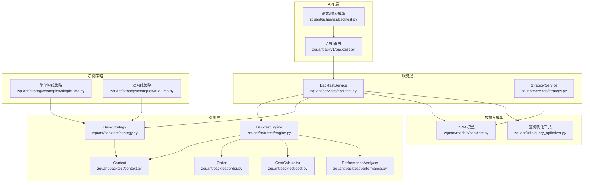
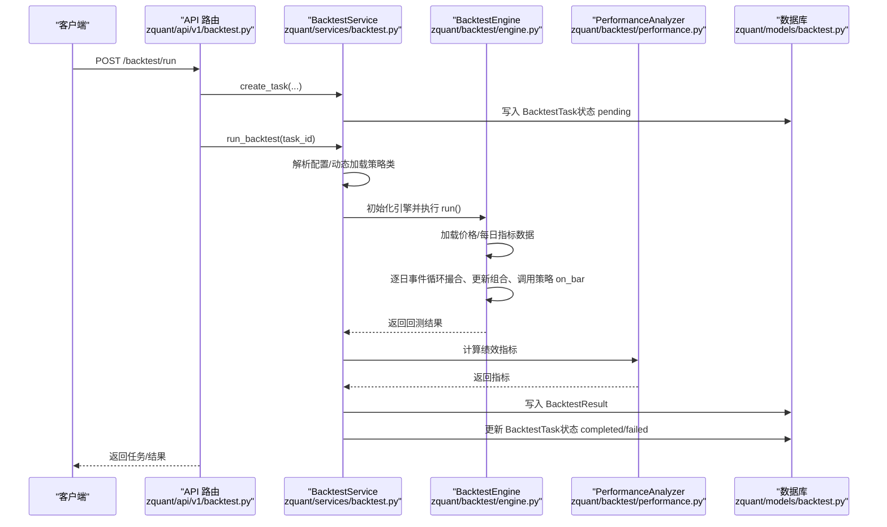
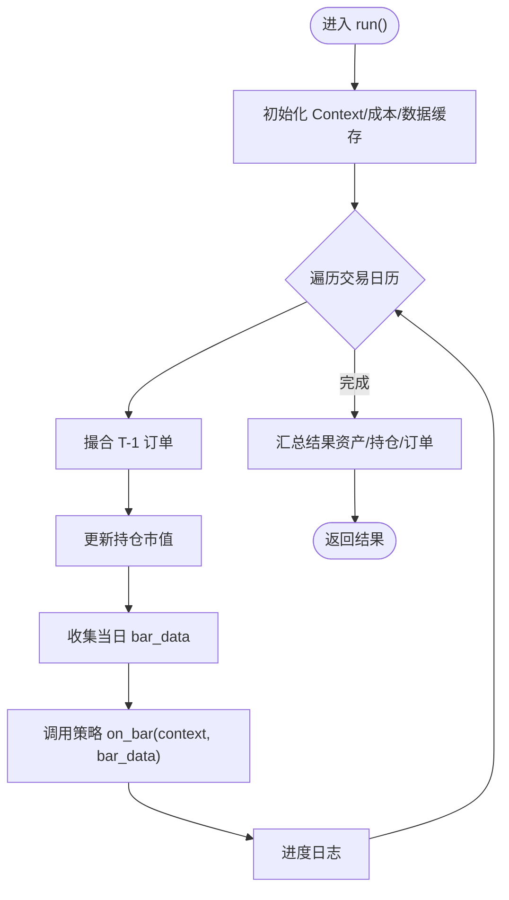
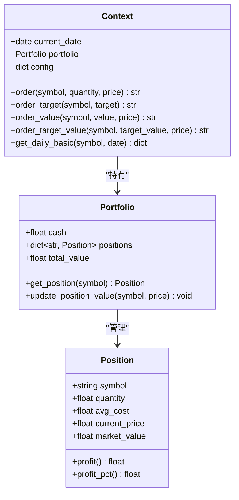
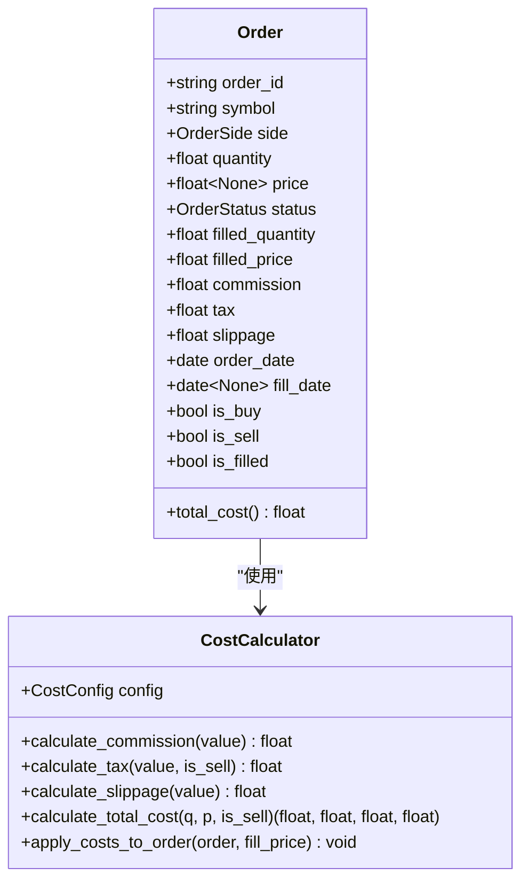
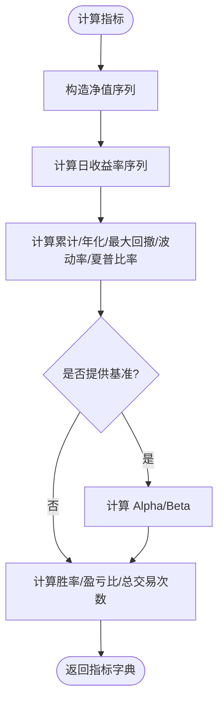
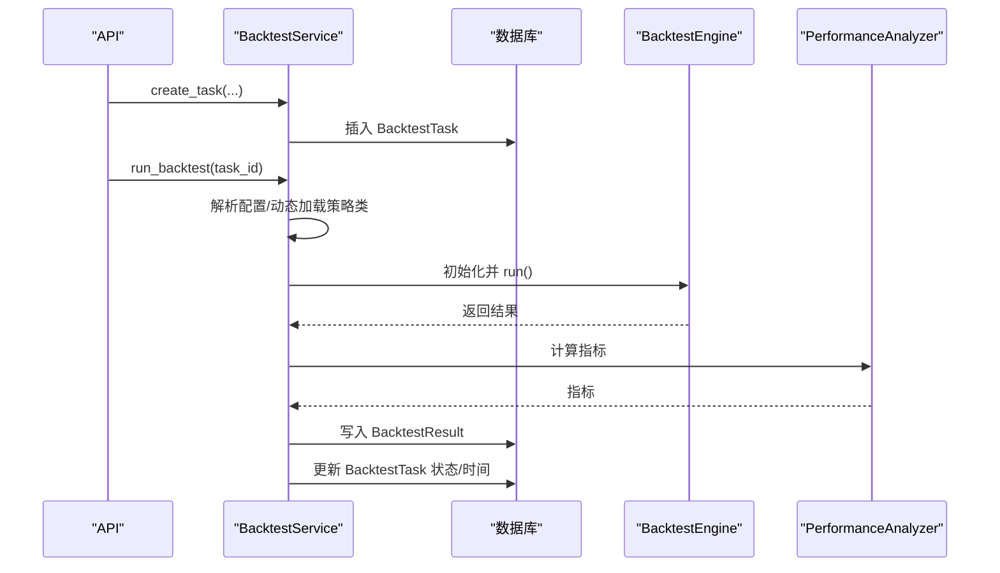
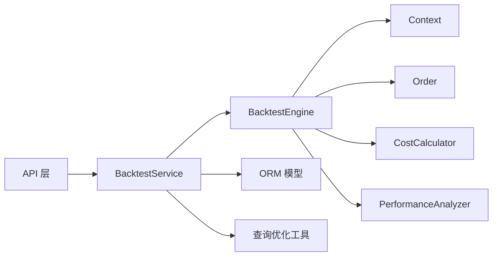

# 回测服务

<cite>
**本文引用的文件**
- [zquant/backtest/engine.py](file://zquant/backtest/engine.py)
- [zquant/backtest/context.py](file://zquant/backtest/context.py)
- [zquant/backtest/order.py](file://zquant/backtest/order.py)
- [zquant/backtest/cost.py](file://zquant/backtest/cost.py)
- [zquant/backtest/performance.py](file://zquant/backtest/performance.py)
- [zquant/backtest/strategy.py](file://zquant/backtest/strategy.py)
- [zquant/services/backtest.py](file://zquant/services/backtest.py)
- [zquant/api/v1/backtest.py](file://zquant/api/v1/backtest.py)
- [zquant/models/backtest.py](file://zquant/models/backtest.py)
- [zquant/schemas/backtest.py](file://zquant/schemas/backtest.py)
- [zquant/services/strategy.py](file://zquant/services/strategy.py)
- [zquant/utils/query_optimizer.py](file://zquant/utils/query_optimizer.py)
- [zquant/strategy/examples/simple_ma.py](file://zquant/strategy/examples/simple_ma.py)
- [zquant/strategy/examples/dual_ma.py](file://zquant/strategy/examples/dual_ma.py)
</cite>

## 目录
1. [简介](#简介)
2. [项目结构](#项目结构)
3. [核心组件](#核心组件)
4. [架构总览](#架构总览)
5. [详细组件分析](#详细组件分析)
6. [依赖分析](#依赖分析)
7. [性能考量](#性能考量)
8. [故障排查指南](#故障排查指南)
9. [结论](#结论)
10. [附录](#附录)

## 简介
本文件面向开发者与运维人员，系统性阐述回测服务的整体设计与实现细节，重点覆盖以下方面：
- BacktestService 如何协调回测引擎执行策略代码、模拟交易、计算绩效指标的全过程
- 服务层对策略沙箱环境的管理、参数校验、资源隔离机制
- 回测任务的状态管理（运行、暂停、终止）、结果持久化与异步通知流程
- 自定义策略接入的接口规范与性能监控数据采集方法
- 典型错误处理案例（策略异常退出、内存溢出等）及优化建议

## 项目结构
回测相关代码主要分布在以下模块：
- API 层：FastAPI 路由与请求/响应模型，负责对外暴露回测任务与结果的 REST 接口
- 服务层：BacktestService 与 StrategyService，负责任务生命周期管理、策略加载与执行、结果持久化
- 引擎层：BacktestEngine、Context、Order、CostCalculator、PerformanceAnalyzer，负责策略执行、撮合成交、成本计算与绩效分析
- 模型与模式：ORM 模型与 Pydantic 模式，负责数据结构与接口契约
- 示例策略：提供策略基类与示例策略，帮助用户快速接入

图表来源
- [zquant/api/v1/backtest.py](file://zquant/api/v1/backtest.py#L1-L120)
- [zquant/services/backtest.py](file://zquant/services/backtest.py#L1-L120)
- [zquant/backtest/engine.py](file://zquant/backtest/engine.py#L1-L120)
- [zquant/backtest/context.py](file://zquant/backtest/context.py#L1-L120)
- [zquant/backtest/order.py](file://zquant/backtest/order.py#L1-L86)
- [zquant/backtest/cost.py](file://zquant/backtest/cost.py#L1-L116)
- [zquant/backtest/performance.py](file://zquant/backtest/performance.py#L1-L120)
- [zquant/backtest/strategy.py](file://zquant/backtest/strategy.py#L1-L82)
- [zquant/models/backtest.py](file://zquant/models/backtest.py#L1-L119)
- [zquant/utils/query_optimizer.py](file://zquant/utils/query_optimizer.py#L1-L120)
- [zquant/strategy/examples/simple_ma.py](file://zquant/strategy/examples/simple_ma.py#L1-L59)
- [zquant/strategy/examples/dual_ma.py](file://zquant/strategy/examples/dual_ma.py#L1-L99)

章节来源
- [zquant/api/v1/backtest.py](file://zquant/api/v1/backtest.py#L1-L120)
- [zquant/services/backtest.py](file://zquant/services/backtest.py#L1-L120)
- [zquant/backtest/engine.py](file://zquant/backtest/engine.py#L1-L120)

## 核心组件
- BacktestEngine：回测引擎，负责加载数据、驱动策略、撮合订单、更新组合、产出结果
- Context：回测上下文，封装资金、持仓、当前日期、下单辅助函数等
- Order/CostCalculator：订单与交易成本模型，支持佣金、印花税、滑点
- PerformanceAnalyzer：绩效分析器，计算总收益、年化收益、最大回撤、夏普比率、Alpha/Beta、胜率、盈亏比等
- BacktestService：服务层入口，负责任务创建、策略动态加载、执行、结果持久化与状态管理
- API 层：FastAPI 路由，提供运行回测、查询任务、获取结果、策略管理等接口
- ORM 模型：BacktestTask、BacktestResult、Strategy，承载任务与结果的持久化
- 策略基类与示例：BaseStrategy 与示例策略，定义策略接口与参考实现

章节来源
- [zquant/backtest/engine.py](file://zquant/backtest/engine.py#L1-L120)
- [zquant/backtest/context.py](file://zquant/backtest/context.py#L1-L120)
- [zquant/backtest/order.py](file://zquant/backtest/order.py#L1-L86)
- [zquant/backtest/cost.py](file://zquant/backtest/cost.py#L1-L116)
- [zquant/backtest/performance.py](file://zquant/backtest/performance.py#L1-L120)
- [zquant/backtest/strategy.py](file://zquant/backtest/strategy.py#L1-L82)
- [zquant/services/backtest.py](file://zquant/services/backtest.py#L1-L120)
- [zquant/api/v1/backtest.py](file://zquant/api/v1/backtest.py#L1-L120)
- [zquant/models/backtest.py](file://zquant/models/backtest.py#L1-L119)
- [zquant/schemas/backtest.py](file://zquant/schemas/backtest.py#L1-L120)

## 架构总览
回测服务采用“API 层—服务层—引擎层”的分层架构。API 层接收请求并进行鉴权与参数校验；服务层负责任务生命周期与策略加载；引擎层负责策略执行、撮合与绩效分析；模型层负责数据持久化。

图表来源
- [zquant/api/v1/backtest.py](file://zquant/api/v1/backtest.py#L90-L120)
- [zquant/services/backtest.py](file://zquant/services/backtest.py#L100-L162)
- [zquant/backtest/engine.py](file://zquant/backtest/engine.py#L405-L498)
- [zquant/backtest/performance.py](file://zquant/backtest/performance.py#L50-L120)
- [zquant/models/backtest.py](file://zquant/models/backtest.py#L38-L119)

## 详细组件分析

### BacktestEngine：回测引擎
- 初始化与配置
  - 读取回测配置（初始资金、手续费、滑点、交易标的、频率、是否使用每日指标等）
  - 构造 Context，并重写 context.order 为引擎内部下单方法
  - 初始化成本计算器（佣金、印花税、滑点）
  - 加载交易日历与价格/每日指标数据，建立缓存
- 事件循环
  - 逐日遍历交易日历，执行撮合、更新组合市值、调用策略 on_bar
  - 撮合规则：T+1 成交、涨跌停限制、资金/持仓约束、部分成交
- 结果产出
  - 统计最终资产、持仓明细、订单明细，打包为结果字典

图表来源
- [zquant/backtest/engine.py](file://zquant/backtest/engine.py#L405-L498)

章节来源
- [zquant/backtest/engine.py](file://zquant/backtest/engine.py#L41-L120)
- [zquant/backtest/engine.py](file://zquant/backtest/engine.py#L120-L220)
- [zquant/backtest/engine.py](file://zquant/backtest/engine.py#L220-L360)
- [zquant/backtest/engine.py](file://zquant/backtest/engine.py#L360-L455)
- [zquant/backtest/engine.py](file://zquant/backtest/engine.py#L455-L498)

### Context/Portfolio/Position：策略沙箱与资金管理
- Context
  - 持有 current_date、portfolio、config
  - 提供 order/order_target/order_value/order_target_value 等下单辅助函数
  - 可选每日指标数据访问接口
- Portfolio/Position
  - 管理现金、持仓集合、总价值
  - 持仓更新市值、计算浮动盈亏与比例

图表来源
- [zquant/backtest/context.py](file://zquant/backtest/context.py#L1-L188)

章节来源
- [zquant/backtest/context.py](file://zquant/backtest/context.py#L1-L188)

### Order/CostCalculator：交易成本与撮合
- Order
  - 订单状态（待成交、已成交、已拒绝、已取消）
  - 订单方向（买入/卖出），成交数量/价格、费用（佣金、印花税、滑点）
- CostCalculator
  - 佣金（含最低收费）、印花税（卖出）、滑点
  - 将成本应用到订单，计算总成本

图表来源
- [zquant/backtest/order.py](file://zquant/backtest/order.py#L1-L86)
- [zquant/backtest/cost.py](file://zquant/backtest/cost.py#L1-L116)

章节来源
- [zquant/backtest/order.py](file://zquant/backtest/order.py#L1-L86)
- [zquant/backtest/cost.py](file://zquant/backtest/cost.py#L1-L116)

### PerformanceAnalyzer：绩效指标计算
- 净值序列与收益序列
- 累计/年化收益、最大回撤、波动率、夏普比率
- Alpha/Beta（若提供基准）
- 胜率、盈亏比、总交易次数

图表来源
- [zquant/backtest/performance.py](file://zquant/backtest/performance.py#L50-L120)
- [zquant/backtest/performance.py](file://zquant/backtest/performance.py#L120-L220)
- [zquant/backtest/performance.py](file://zquant/backtest/performance.py#L220-L330)

章节来源
- [zquant/backtest/performance.py](file://zquant/backtest/performance.py#L1-L330)

### BacktestService：服务层与任务生命周期
- 任务创建
  - 校验策略来源（策略库或直接提供代码）
  - 参数校验与默认值处理
  - 写入 BacktestTask（状态 pending）
- 任务执行
  - 解析配置、动态加载策略类（exec + 动态模块）
  - 创建引擎并运行，捕获异常，更新任务状态与错误信息
- 结果持久化
  - 计算指标，写入 BacktestResult
  - 更新 BacktestTask 完成时间与状态
- 资源隔离
  - 任务与结果查询均按 user_id 过滤，确保资源隔离

图表来源
- [zquant/services/backtest.py](file://zquant/services/backtest.py#L43-L162)
- [zquant/models/backtest.py](file://zquant/models/backtest.py#L38-L119)
- [zquant/backtest/performance.py](file://zquant/backtest/performance.py#L50-L120)

章节来源
- [zquant/services/backtest.py](file://zquant/services/backtest.py#L43-L162)
- [zquant/models/backtest.py](file://zquant/models/backtest.py#L38-L119)

### API 层：接口规范与状态管理
- 运行回测
  - 支持从策略库选择或直接传入策略代码
  - 返回任务状态（pending/running/completed/failed）
- 查询任务与结果
  - 支持排序、分页
  - 任务响应中解析 start_date/end_date
- 策略管理
  - 提供策略框架模板、创建/更新/删除策略
  - 列表支持分类、搜索、模板策略可见性控制

章节来源
- [zquant/api/v1/backtest.py](file://zquant/api/v1/backtest.py#L90-L173)
- [zquant/api/v1/backtest.py](file://zquant/api/v1/backtest.py#L175-L424)
- [zquant/schemas/backtest.py](file://zquant/schemas/backtest.py#L1-L152)

### 自定义策略接入规范
- 策略基类
  - 继承 BaseStrategy，实现 initialize 与 on_bar
  - 可选 on_tick/on_order_status
- 上下文接口
  - 通过 context.order_* 辅助函数下单
  - 通过 context.portfolio 获取持仓与总价值
  - 可选每日指标数据访问
- 示例策略
  - 简单均线策略与双均线策略展示了参数化、历史数据维护、信号判断与目标市值下单

章节来源
- [zquant/backtest/strategy.py](file://zquant/backtest/strategy.py#L1-L82)
- [zquant/strategy/examples/simple_ma.py](file://zquant/strategy/examples/simple_ma.py#L1-L59)
- [zquant/strategy/examples/dual_ma.py](file://zquant/strategy/examples/dual_ma.py#L1-L99)

## 依赖分析
- 组件耦合
  - BacktestService 依赖 BacktestEngine、PerformanceAnalyzer、ORM 模型与 StrategyService
  - BacktestEngine 依赖 Context、Order、CostCalculator、数据仓库（通过 Repository）
  - API 层依赖服务层与模式定义
- 外部依赖
  - 数据库（SQLAlchemy）、日志（loguru）、数据处理（pandas/numpy）
- 潜在环路
  - 服务层与引擎层双向协作，但无循环导入迹象
- 查询优化
  - 服务层使用查询优化工具进行分页与关系预加载，降低 N+1 查询风险

图表来源
- [zquant/services/backtest.py](file://zquant/services/backtest.py#L1-L120)
- [zquant/backtest/engine.py](file://zquant/backtest/engine.py#L1-L120)
- [zquant/utils/query_optimizer.py](file://zquant/utils/query_optimizer.py#L1-L120)

章节来源
- [zquant/services/backtest.py](file://zquant/services/backtest.py#L1-L120)
- [zquant/utils/query_optimizer.py](file://zquant/utils/query_optimizer.py#L1-L120)

## 性能考量
- 数据加载
  - 批量加载价格与每日指标，减少数据库往返
  - 交易日历与价格数据缓存，避免重复查询
- 订单撮合
  - T+1 成交延迟，涨跌停与资金/持仓约束，提升仿真度
- 指标计算
  - 使用 pandas/numpy 进行高效序列计算
  - 年化指标基于交易日历长度（固定 252 天）
- 查询优化
  - 分页与关系预加载，避免 N+1 查询
- 异步执行
  - API 层注释提示生产环境应使用异步任务队列（如 Celery）执行回测，避免阻塞请求线程

章节来源
- [zquant/backtest/engine.py](file://zquant/backtest/engine.py#L100-L182)
- [zquant/backtest/performance.py](file://zquant/backtest/performance.py#L160-L220)
- [zquant/utils/query_optimizer.py](file://zquant/utils/query_optimizer.py#L1-L120)
- [zquant/api/v1/backtest.py](file://zquant/api/v1/backtest.py#L100-L120)

## 故障排查指南
- 策略异常退出
  - 现象：策略 on_bar 抛出异常，引擎继续推进
  - 处理：查看任务错误信息字段，定位具体日期与异常栈
  - 建议：在策略内捕获异常并记录日志，避免中断回测
- 内存溢出
  - 现象：历史数据过长或未清理导致内存增长
  - 处理：限制历史窗口长度，及时清理不再使用的数据
  - 建议：使用滚动窗口与分批处理
- 订单无法成交
  - 现象：停牌、涨跌停、资金不足、持仓不足
  - 处理：检查订单状态与拒绝原因，调整策略参数或过滤条件
- 数据缺失
  - 现象：交易日历为空、价格数据缺失
  - 处理：确认日期范围与标的列表，检查数据仓库连接
- 异步通知
  - 现象：生产环境应使用异步任务队列，API 层当前为简化同步执行
  - 处理：集成 Celery，任务完成后通过回调或轮询通知前端

章节来源
- [zquant/backtest/engine.py](file://zquant/backtest/engine.py#L440-L455)
- [zquant/services/backtest.py](file://zquant/services/backtest.py#L156-L162)
- [zquant/api/v1/backtest.py](file://zquant/api/v1/backtest.py#L100-L120)

## 结论
回测服务通过清晰的分层设计与完善的组件职责划分，实现了从策略接入、数据仿真、交易撮合到绩效分析的完整闭环。服务层在资源隔离、参数校验与结果持久化方面提供了稳健保障；引擎层在仿真度与性能之间取得平衡；API 层提供简洁的接口与策略模板。建议在生产环境中引入异步任务队列以提升吞吐与稳定性，并持续优化数据加载与查询路径。

## 附录
- 状态枚举与模型字段
  - BacktestStatus：pending/running/completed/failed/cancelled
  - BacktestTask：任务元数据、状态、错误信息、时间戳
  - BacktestResult：核心指标与 JSON 化明细
- 请求/响应模型
  - BacktestConfig：日期范围、初始资金、手续费、滑点、是否使用每日指标等
  - BacktestRunRequest：策略来源（ID 或代码）、策略名称、配置
  - BacktestTaskResponse/BacktestResultResponse：任务与结果的对外响应

章节来源
- [zquant/models/backtest.py](file://zquant/models/backtest.py#L38-L119)
- [zquant/schemas/backtest.py](file://zquant/schemas/backtest.py#L1-L152)