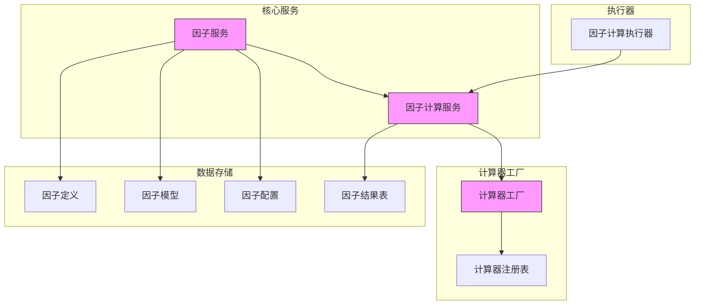
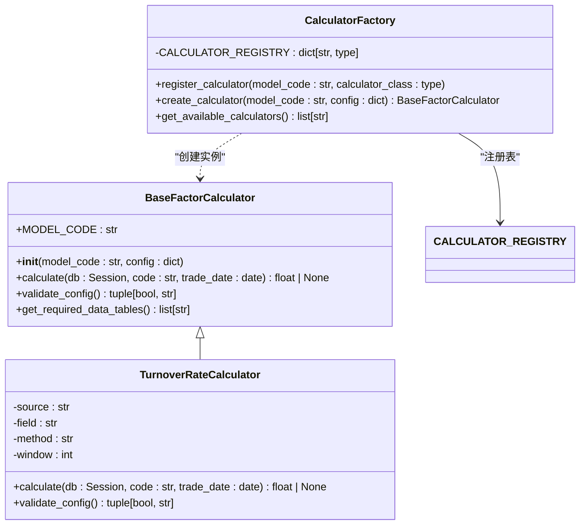
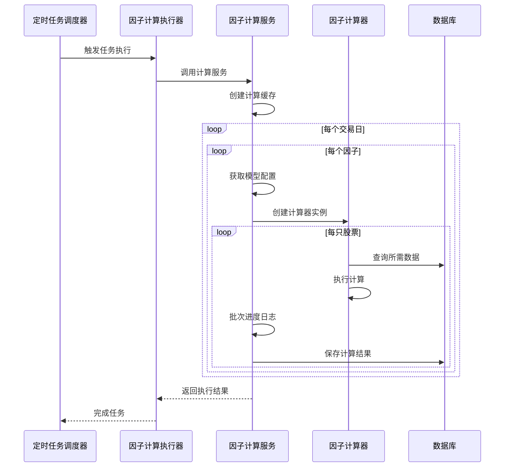

# 因子服务

<cite>
**本文档引用的文件**   
- [factor.py](file://zquant/services/factor.py)
- [factor_calculation.py](file://zquant/services/factor_calculation.py)
- [factory.py](file://zquant/factor/calculators/factory.py)
- [base.py](file://zquant/factor/calculators/base.py)
- [turnover_rate.py](file://zquant/factor/calculators/turnover_rate.py)
- [factor_repository.py](file://zquant/repositories/factor_repository.py)
- [factor_calculator.py](file://zquant/scheduler/executors/factor_calculator.py)
- [factor.py](file://zquant/api/v1/factor.py)
- [factor.py](file://zquant/models/factor.py)
- [data.py](file://zquant/models/data.py)
- [storage_base.py](file://zquant/data/storage_base.py)
- [code_converter.py](file://zquant/utils/code_converter.py)
- [factor_management.md](file://docs/factor_management.md)
</cite>

## 目录
1. [引言](#引言)
2. [因子服务架构](#因子服务架构)
3. [因子生命周期管理](#因子生命周期管理)
4. [因子计算器工厂](#因子计算器工厂)
5. [异步计算与进度跟踪](#异步计算与进度跟踪)
6. [高性能优化技巧](#高性能优化技巧)
7. [自定义因子开发](#自定义因子开发)
8. [常见问题与解决方案](#常见问题与解决方案)

## 引言
因子服务是量化分析系统的核心组件，负责因子的全生命周期管理，包括因子定义、计算任务调度、结果存储与查询。本服务通过插件式架构支持多种因子算法的扩展，并提供高性能的计算能力，满足大规模因子计算的需求。

## 因子服务架构



**图源**
- [factor.py](file://zquant/services/factor.py#L38-L745)
- [factor_calculation.py](file://zquant/services/factor_calculation.py#L215-L816)
- [factory.py](file://zquant/factor/calculators/factory.py#L27-L89)
- [models/factor.py](file://zquant/models/factor.py#L35-L267)

## 因子生命周期管理

### 因子定义管理
因子定义是因子的元数据，包含因子的基本信息。通过`FactorService`类提供完整的CRUD操作。

**核心方法：**
- `create_factor_definition`: 创建因子定义
- `get_factor_definition`: 获取因子定义
- `list_factor_definitions`: 获取因子定义列表
- `update_factor_definition`: 更新因子定义
- `delete_factor_definition`: 删除因子定义

每个因子定义包含以下属性：
- **factor_name**: 因子名称（唯一标识）
- **cn_name**: 中文简称
- **en_name**: 英文简称
- **column_name**: 数据表列名
- **description**: 详细描述
- **enabled**: 是否启用

### 因子模型管理
因子模型代表具体的计算算法，一个因子可以有多个模型，支持设置默认模型。

**核心方法：**
- `create_factor_model`: 创建因子模型
- `get_factor_model`: 获取因子模型
- `list_factor_models`: 获取因子模型列表
- `update_factor_model`: 更新因子模型
- `delete_factor_model`: 删除因子模型

模型配置以JSON格式存储，包含算法特定的参数。

### 因子配置管理
因子配置定义了因子模型与股票代码的映射关系，支持灵活的配置策略。

**配置结构：**
```json
{
  "enabled": true,
  "mappings": [
    {
      "model_id": 1,
      "codes": ["000001.SZ", "000002.SZ"]
    },
    {
      "model_id": 2,
      "codes": null
    }
  ]
}
```
其中`codes`为`null`表示默认配置，应用于未明确指定的股票。

### 结果存储与查询
因子计算结果按股票代码分表存储，采用`zq_quant_factor_spacex_{code}`的命名规范。

**查询流程：**
1. 通过`CodeConverter`将股票代码转换为TS代码格式
2. 构建目标表名
3. 执行SQL查询获取结果
4. 返回标准化的响应数据

**Section sources**
- [factor.py](file://zquant/services/factor.py#L43-L745)
- [factor_repository.py](file://zquant/repositories/factor_repository.py#L38-L218)
- [data.py](file://zquant/models/data.py#L519-L525)
- [code_converter.py](file://zquant/utils/code_converter.py#L39-L213)

## 因子计算器工厂

### 协作机制
因子计算器工厂采用注册模式管理所有可用的因子计算器，实现了计算逻辑与调度逻辑的解耦。



**图源**
- [base.py](file://zquant/factor/calculators/base.py#L34-L82)
- [turnover_rate.py](file://zquant/factor/calculators/turnover_rate.py#L37-L188)
- [factory.py](file://zquant/factor/calculators/factory.py#L27-L89)

### 插件式扩展
通过工厂模式实现插件式扩展，新增因子算法只需：
1. 创建继承`BaseFactorCalculator`的计算器类
2. 实现`calculate`和`validate_config`方法
3. 在`factory.py`中注册计算器

**扩展示例：**
```python
class MyFactorCalculator(BaseFactorCalculator):
    MODEL_CODE = "my_factor"
    
    def __init__(self, config: dict | None = None):
        super().__init__(self.MODEL_CODE, config)
    
    def calculate(self, db: Session, code: str, trade_date: date) -> float | None:
        # 实现计算逻辑
        pass
    
    def validate_config(self) -> tuple[bool, str]:
        # 验证配置
        return True, ""
```

**Section sources**
- [base.py](file://zquant/factor/calculators/base.py#L34-L82)
- [factory.py](file://zquant/factor/calculators/factory.py#L41-L89)

## 异步计算与进度跟踪

### 异步执行流程
因子计算任务通过定时任务系统异步执行，确保不影响主应用性能。



**图源**
- [factor_calculator.py](file://zquant/scheduler/executors/factor_calculator.py#L40-L123)
- [factor_calculation.py](file://zquant/services/factor_calculation.py#L576-L816)

### 进度跟踪机制
系统提供详细的进度跟踪和日志记录，便于监控和调试。

**跟踪指标：**
- **calculated_count**: 成功计算的数量
- **failed_count**: 计算失败的数量
- **invalid_count**: 数据不完整的数量
- **details**: 详细执行信息

每处理100只股票会记录批次进度日志，便于实时监控大规模计算任务的执行状态。

**Section sources**
- [factor_calculator.py](file://zquant/scheduler/executors/factor_calculator.py#L40-L123)
- [factor_calculation.py](file://zquant/services/factor_calculation.py#L702-L764)

## 高性能优化技巧

### 向量化运算
对于支持向量化计算的算法，优先使用Pandas或NumPy进行批量计算，避免逐行处理。

**优化建议：**
- 将SQL查询结果转换为DataFrame
- 使用向量化操作替代循环
- 利用Pandas内置函数进行统计计算

### 缓存复用
系统采用多层缓存机制减少数据库查询开销。

**缓存策略：**
- **计算缓存**: `FactorCalculationCache`类一次性加载所有相关配置到内存
- **数据缓存**: 使用Redis缓存频繁访问的基础数据
- **结果缓存**: 对重复查询提供缓存支持

### 并行处理
通过多进程或多线程实现并行计算，充分利用多核CPU资源。

**并行方案：**
- 按交易日并行：不同交易日的计算任务可完全并行
- 按因子并行：独立因子的计算可并行执行
- 按股票分组：将股票列表分组并行处理

**Section sources**
- [factor_calculation.py](file://zquant/services/factor_calculation.py#L44-L213)
- [utils/cache.py](file://zquant/utils/cache.py)
- [utils/cache_decorator.py](file://zquant/utils/cache_decorator.py)

## 自定义因子开发

### 开发模板
提供标准化的开发模板，简化新因子的开发流程。

```python
from zquant.factor.calculators.base import BaseFactorCalculator
from datetime import date
from sqlalchemy.orm import Session

class CustomFactorCalculator(BaseFactorCalculator):
    """自定义因子计算器"""
    
    MODEL_CODE = "custom_factor"
    
    def __init__(self, config: dict | None = None):
        """
        初始化计算器
        Args:
            config: 配置字典，包含算法参数
        """
        super().__init__(self.MODEL_CODE, config)
        # 初始化配置参数
        self.param1 = self.config.get("param1", "default_value")
        self.param2 = self.config.get("param2", 1.0)
    
    def calculate(self, db: Session, code: str, trade_date: date) -> float | None:
        """
        计算因子值
        Args:
            db: 数据库会话
            code: 股票代码
            trade_date: 交易日期
        Returns:
            因子值，计算失败返回None
        """
        try:
            # 1. 查询所需数据
            # 2. 执行计算逻辑
            # 3. 返回结果
            return result_value
        except Exception as e:
            logger.error(f"计算失败: {e}")
            return None
    
    def validate_config(self) -> tuple[bool, str]:
        """
        验证配置有效性
        Returns:
            (是否有效, 错误信息)
        """
        if not self.param1:
            return False, "param1不能为空"
        return True, ""
    
    def get_required_data_tables(self) -> list[str]:
        """
        获取所需数据表
        Returns:
            数据表名称列表
        """
        return ["zq_data_tustock_daily_*", "zq_data_tustock_daily_basic_*"]
```

### 调试指南
提供完整的调试工具和方法，确保开发效率。

**调试步骤：**
1. 使用单元测试验证计算逻辑
2. 通过API手动触发计算任务
3. 检查日志输出和执行结果
4. 验证结果数据的正确性

**调试工具：**
- `factor_management.md`文档中的使用示例
- 初始化脚本`init_factor.py`创建测试环境
- API接口支持手动触发计算

**Section sources**
- [base.py](file://zquant/factor/calculators/base.py#L34-L82)
- [factor_management.md](file://docs/factor_management.md#L262-L283)

## 常见问题与解决方案

### 性能瓶颈
**问题1：大规模计算耗时过长**
- **解决方案**：启用并行处理，将任务分组并行执行

**问题2：数据库查询频繁导致性能下降**
- **解决方案**：使用`FactorCalculationCache`减少查询次数，实现批量加载

**问题3：内存占用过高**
- **解决方案**：分批处理数据，避免一次性加载过多数据到内存

### 配置问题
**问题1：因子配置不生效**
- **解决方案**：检查配置格式是否正确，确保`mappings`中只有一个默认配置

**问题2：计算器注册失败**
- **解决方案**：确认在`factory.py`中正确注册了计算器类

### 数据问题
**问题1：计算结果为None**
- **解决方案**：检查数据源是否完整，确认所需数据表存在且有数据

**问题2：历史数据计算失败**
- **解决方案**：验证日期范围是否合理，确保在交易日范围内

**Section sources**
- [factor_management.md](file://docs/factor_management.md#L449-L473)
- [factor_calculation.py](file://zquant/services/factor_calculation.py#L219-L242)