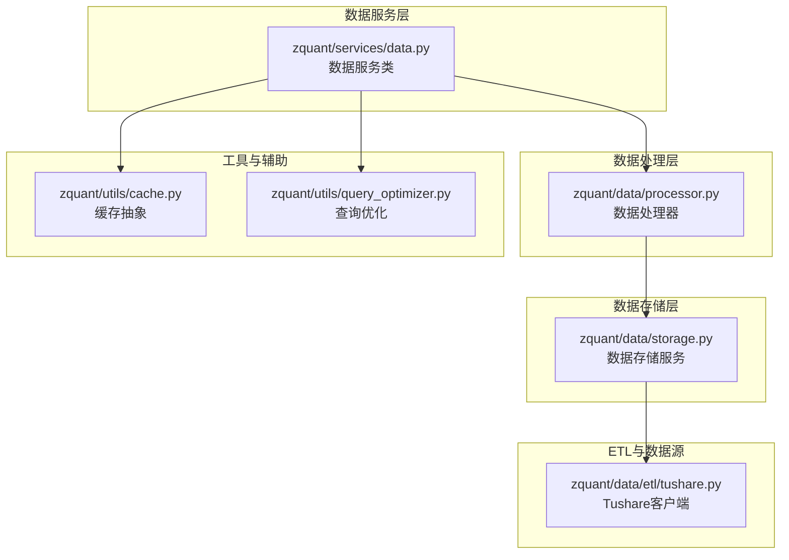
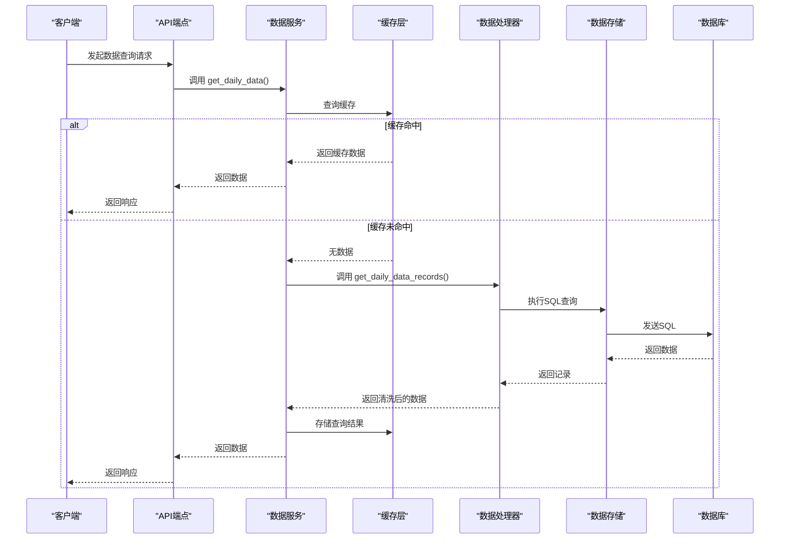
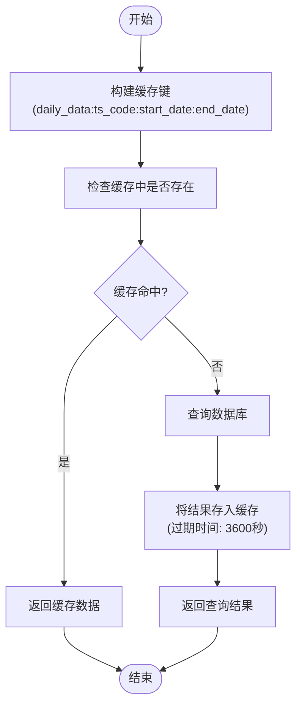
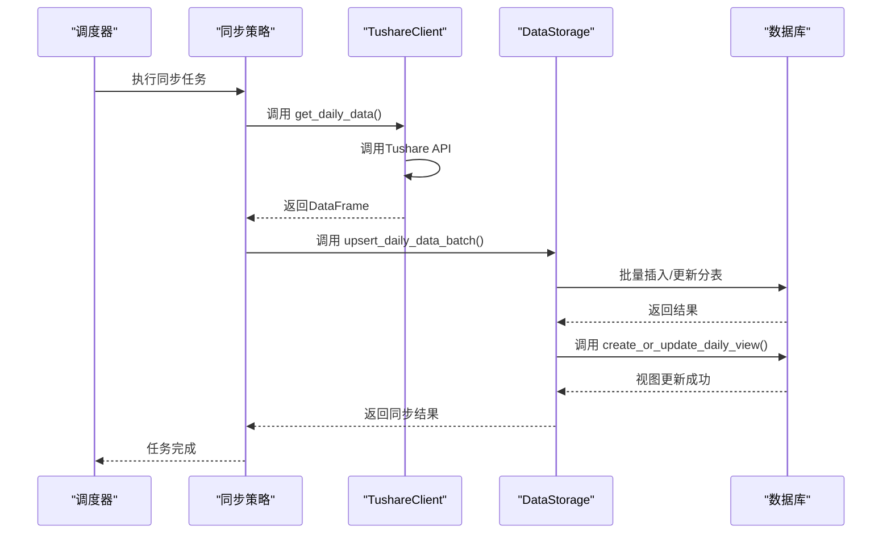
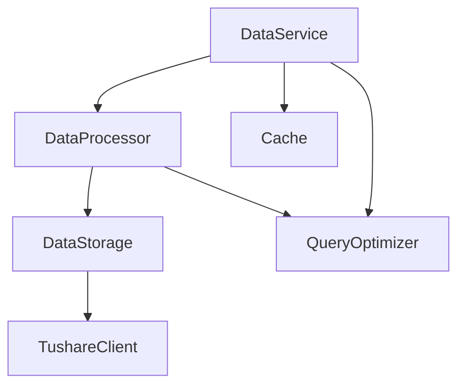

# 数据服务

<cite>
**本文档引用的文件**   
- [data.py](file://zquant/services/data.py)
- [storage.py](file://zquant/data/storage.py)
- [processor.py](file://zquant/data/processor.py)
- [tushare.py](file://zquant/data/etl/tushare.py)
- [cache.py](file://zquant/utils/cache.py)
- [query_optimizer.py](file://zquant/utils/query_optimizer.py)
- [data.py](file://zquant/api/v1/data.py)
</cite>

## 目录
1. [简介](#简介)
2. [项目结构](#项目结构)
3. [核心组件](#核心组件)
4. [架构概述](#架构概述)
5. [详细组件分析](#详细组件分析)
6. [依赖分析](#依赖分析)
7. [性能考虑](#性能考虑)
8. [故障排除指南](#故障排除指南)
9. [结论](#结论)

## 简介
本文档旨在详细阐述zquant项目中数据服务（DataService）的技术实现。该服务负责封装对股票行情、财务数据和交易日历等数据的访问逻辑，是整个系统数据交互的核心。文档将深入分析其与ETL模块和数据存储层的交互机制，包括数据缓存策略、查询优化和分页处理。同时，将提供典型使用场景示例，并解释数据版本控制和历史数据更新策略，最后给出性能调优建议和错误处理机制。

## 项目结构
zquant项目的数据服务相关代码主要分布在`zquant`目录下的多个子模块中。其核心结构遵循清晰的分层设计，将数据访问、数据处理、数据存储和外部数据源访问进行了分离。

**Diagram sources**
- [data.py](file://zquant/services/data.py)
- [processor.py](file://zquant/data/processor.py)
- [storage.py](file://zquant/data/storage.py)
- [tushare.py](file://zquant/data/etl/tushare.py)
- [cache.py](file://zquant/utils/cache.py)
- [query_optimizer.py](file://zquant/utils/query_optimizer.py)

**Section sources**
- [data.py](file://zquant/services/data.py)
- [processor.py](file://zquant/data/processor.py)
- [storage.py](file://zquant/data/storage.py)
- [tushare.py](file://zquant/data/etl/tushare.py)
- [cache.py](file://zquant/utils/cache.py)
- [query_optimizer.py](file://zquant/utils/query_optimizer.py)

## 核心组件

数据服务（DataService）是整个数据访问逻辑的入口。它通过静态方法为上层应用（如API）提供统一的数据查询接口，如`get_daily_data`、`get_fundamentals`和`get_trading_calendar`。这些方法内部会调用数据处理器（DataProcessor）来执行具体的查询逻辑，并利用缓存（Cache）来提升性能。数据服务本身不直接操作数据库，而是通过`DataProcessor`和`DataStorage`进行间接操作，实现了业务逻辑与数据访问的解耦。

**Section sources**
- [data.py](file://zquant/services/data.py)

## 架构概述

zquant数据服务的架构采用分层模式，确保了高内聚和低耦合。其核心交互流程如下：当API接收到数据查询请求时，会调用`DataService`的相应方法。`DataService`首先检查Redis或内存缓存中是否存在结果，若存在则直接返回，避免了数据库查询。如果缓存未命中，`DataService`会调用`DataProcessor`。`DataProcessor`根据查询条件（如单个股票代码或多股票代码）决定是直接查询分表还是通过视图进行查询。对于分表查询，它会动态构建SQL语句；对于视图查询，则直接执行。查询结果从数据库返回后，`DataProcessor`会进行数据清洗和格式化，然后返回给`DataService`，`DataService`再将结果存入缓存并返回给API。

**Diagram sources**
- [data.py](file://zquant/services/data.py)
- [processor.py](file://zquant/data/processor.py)
- [storage.py](file://zquant/data/storage.py)

## 详细组件分析

### 数据服务分析
`DataService`类是数据访问的门面（Facade），它封装了所有数据查询的复杂性，为上层提供了简洁的API。

#### 数据访问与缓存
`DataService`通过实现缓存策略显著提升了系统性能。以`get_daily_data`方法为例，它首先根据查询参数（ts_code, start_date, end_date）构建一个唯一的缓存键（cache_key）。然后，它会尝试从缓存中获取数据。如果缓存命中，则直接返回反序列化后的数据，避免了耗时的数据库查询。如果缓存未命中，它会从数据库获取数据，并在返回结果前将数据序列化后存入缓存，并设置1小时的过期时间。这种策略对于频繁查询的、不经常变动的数据（如历史行情）非常有效。

**Diagram sources**
- [data.py](file://zquant/services/data.py#L245-L274)

**Section sources**
- [data.py](file://zquant/services/data.py)

### ETL与数据存储分析
ETL（Extract, Transform, Load）模块负责从外部数据源（Tushare）提取数据，并将其清洗、转换后加载到内部数据库。

#### ETL与数据存储交互
`TushareClient`类封装了与Tushare API的所有交互。当调度任务（如`sync_daily_data`）需要同步数据时，它会创建`TushareClient`实例并调用其方法（如`get_daily_data`）来获取原始数据。获取到的`pandas.DataFrame`数据会被传递给`DataStorage`服务。`DataStorage`根据数据类型（日线、财务等）和股票代码（ts_code）动态选择或创建对应的数据库模型（如`TustockDaily`），然后使用`ON DUPLICATE KEY UPDATE`语句将数据批量插入或更新到对应的分表中。数据同步完成后，`DataStorage`还会负责更新数据库视图，以确保后续的查询能够正确访问所有分表的数据。

**Diagram sources**
- [tushare.py](file://zquant/data/etl/tushare.py)
- [storage.py](file://zquant/data/storage.py)

**Section sources**
- [tushare.py](file://zquant/data/etl/tushare.py)
- [storage.py](file://zquant/data/storage.py)

### 查询优化与分页
为了处理大量数据并保证查询效率，系统实现了查询优化和分页机制。

#### 分页处理
`DataService`中的`get_data_operation_logs`和`get_table_statistics`等方法支持分页查询。它们通过调用`utils.query_optimizer.paginate_query`函数来实现。该函数接收一个SQLAlchemy查询对象、页码和每页大小作为参数。它首先计算出总记录数，然后根据页码计算出`OFFSET`和`LIMIT`值，并将这些分页参数应用到原始查询上。最后，它返回分页后的查询对象和包含总页数、是否有下一页等信息的分页元数据。这使得前端可以实现分页加载，避免一次性加载过多数据导致性能问题。

**Section sources**
- [data.py](file://zquant/services/data.py)
- [query_optimizer.py](file://zquant/utils/query_optimizer.py)

## 依赖分析

zquant数据服务的组件之间存在明确的依赖关系。`DataService`依赖于`DataProcessor`来执行数据查询，而`DataProcessor`又依赖于`DataStorage`来执行底层的数据库操作。`DataStorage`则依赖于`TushareClient`来获取外部数据。缓存层（`Cache`）被`DataService`直接使用，而查询优化工具（`QueryOptimizer`）则被`DataService`和`DataProcessor`用于构建高效的数据库查询。这种依赖关系确保了各组件职责单一，便于维护和测试。

**Diagram sources**
- [data.py](file://zquant/services/data.py)
- [processor.py](file://zquant/data/processor.py)
- [storage.py](file://zquant/data/storage.py)
- [tushare.py](file://zquant/data/etl/tushare.py)
- [cache.py](file://zquant/utils/cache.py)
- [query_optimizer.py](file://zquant/utils/query_optimizer.py)

**Section sources**
- [data.py](file://zquant/services/data.py)
- [processor.py](file://zquant/data/processor.py)
- [storage.py](file://zquant/data/storage.py)
- [tushare.py](file://zquant/data/etl/tushare.py)
- [cache.py](file://zquant/utils/cache.py)
- [query_optimizer.py](file://zquant/utils/query_optimizer.py)

## 性能考虑

### 数据缓存策略
系统实现了两级缓存策略：Redis缓存和本地内存缓存。`CacheFactory`根据配置（`CACHE_TYPE`）决定使用哪种后端。对于高并发场景，推荐使用Redis以实现多实例间的缓存共享。缓存的键设计遵循`数据类型:参数1:参数2`的模式，确保了唯一性。缓存的过期时间根据数据的更新频率设置，例如行情数据为1小时，而交易日历这类静态数据则为24小时。这有效减少了对数据库的直接访问压力。

### 查询优化建议
1.  **批量查询**：在可能的情况下，应使用支持批量查询的API，如`get_daily_data(ts_code=['000001.SZ', '000002.SZ'])`，而不是对每个股票代码进行单独查询，以减少网络往返次数。
2.  **索引使用**：数据库表在关键字段上（如`ts_code`、`trade_date`、`cal_date`）建立了索引。在编写自定义查询时，应确保WHERE条件能有效利用这些索引。
3.  **分页查询**：对于可能返回大量结果的查询（如操作日志、表统计），必须使用分页参数（`skip`和`limit`）来限制返回的数据量。

## 故障排除指南

### 错误处理机制
系统实现了多层次的错误处理。在数据访问层面，`DataService`和`DataProcessor`中的方法都包含了异常捕获和日志记录。例如，在查询分表时，如果表不存在，会记录警告日志并返回空列表，而不是抛出异常中断整个流程。在ETL层面，`TushareClient`会对API调用进行统一的日志记录，包括成功、失败和空数据的情况，便于追踪问题。在API层面，使用了`@handle_data_api_error`装饰器来捕获所有未处理的异常，并将其转换为标准的错误响应，避免将内部错误信息暴露给客户端。

### 数据源不可用降级方案
当Tushare数据源不可用时，系统会采取降级策略：
1.  **缓存优先**：`DataService`会优先返回缓存中的历史数据，保证核心功能（如查看历史行情）的可用性。
2.  **返回旧数据**：对于需要最新数据的请求，如果无法从数据源获取新数据，系统会返回数据库中已有的最新记录，并在响应中明确标注数据可能不是最新的。
3.  **异步重试**：ETL任务在同步失败时，会记录失败日志但不会中断整个调度流程。调度系统会根据配置的重试策略，在后续周期再次尝试同步。

**Section sources**
- [data.py](file://zquant/services/data.py)
- [processor.py](file://zquant/data/processor.py)
- [tushare.py](file://zquant/data/etl/tushare.py)
- [data.py](file://zquant/api/v1/data.py)

## 结论
zquant的数据服务通过清晰的分层架构、有效的缓存策略和稳健的错误处理机制，为系统提供了高效、可靠的数据访问能力。其与ETL模块和数据存储层的紧密协作，确保了数据的准确性和及时性。通过遵循本文档中的性能调优建议和理解其降级方案，可以更好地维护和使用该服务。