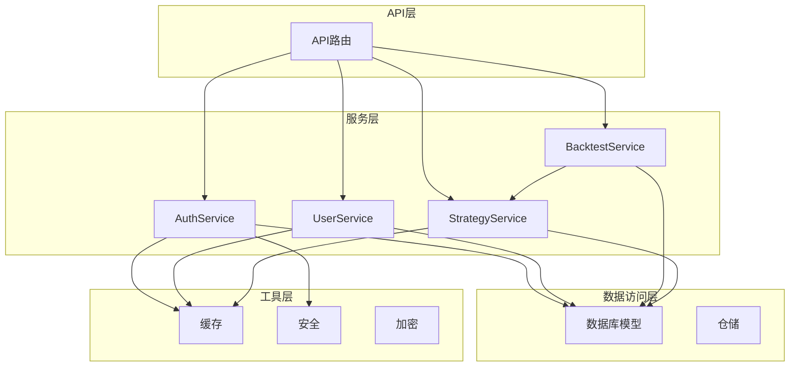
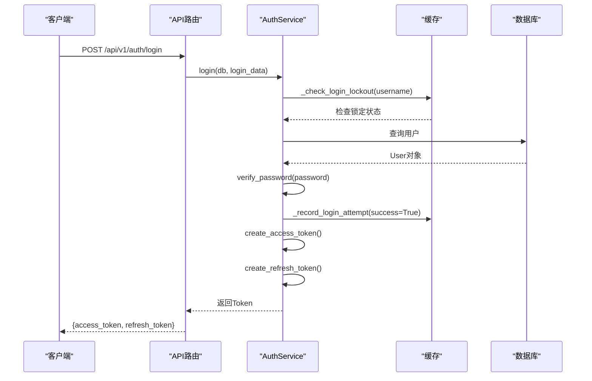
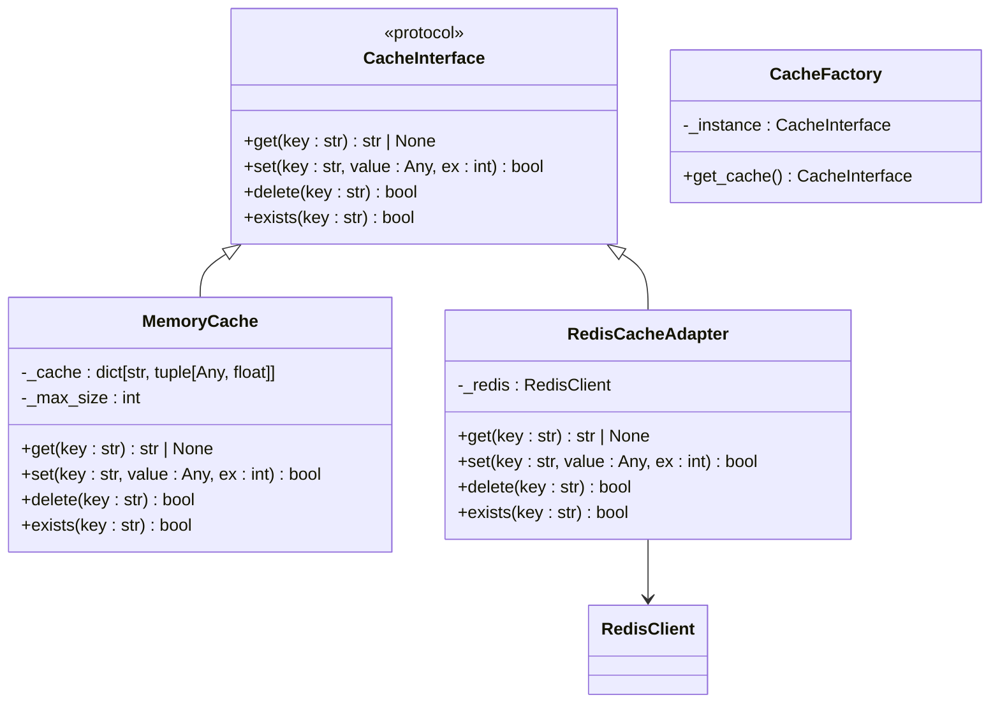

# 服务层设计

<cite>
**本文档引用的文件**
- [auth.py](file://zquant/services/auth.py)
- [user.py](file://zquant/services/user.py)
- [backtest.py](file://zquant/services/backtest.py)
- [strategy.py](file://zquant/services/strategy.py)
- [cache.py](file://zquant/utils/cache.py)
- [redis_client.py](file://zquant/utils/redis_client.py)
- [security.py](file://zquant/core/security.py)
- [encryption.py](file://zquant/utils/encryption.py)
- [config.py](file://zquant/config.py)
- [exceptions.py](file://zquant/core/exceptions.py)
- [cache_decorator.py](file://zquant/utils/cache_decorator.py)
- [query_optimizer.py](file://zquant/utils/query_optimizer.py)
- [user.py](file://zquant/models/user.py)
- [backtest.py](file://zquant/models/backtest.py)
- [auth.py](file://zquant/api/v1/auth.py)
</cite>

## 目录
1. [简介](#简介)
2. [服务层架构概览](#服务层架构概览)
3. [核心服务类设计模式](#核心服务类设计模式)
4. [认证服务安全机制](#认证服务安全机制)
5. [服务层与API层交互](#服务层与api层交互)
6. [缓存策略应用](#缓存策略应用)
7. [异步任务处理模式](#异步任务处理模式)
8. [新服务创建模板与最佳实践](#新服务创建模板与最佳实践)
9. [结论](#结论)

## 简介
zquant服务层是系统的核心业务逻辑处理中心，负责协调数据访问与业务规则，为上层API提供稳定、安全的业务功能。本服务层采用清晰的分层架构，将认证、用户管理、回测、策略管理等核心功能模块化，通过定义良好的接口和服务契约，实现了高内聚、低耦合的设计目标。服务层不仅封装了复杂的业务逻辑，还集成了安全控制、缓存优化和异步处理等关键机制，确保了系统的高性能和高可用性。

## 服务层架构概览
zquant服务层位于API层与数据访问层之间，是业务逻辑的核心承载者。其架构设计遵循单一职责原则，每个服务类（如AuthService、UserService）专注于特定领域的业务功能。服务层通过依赖注入的方式获取数据库会话（Session）和工具类（如缓存、加密），与`zquant/models`中的数据库模型和`zquant/schemas`中的数据传输对象（DTO）紧密协作，完成从数据持久化到业务逻辑处理的完整闭环。这种分层设计使得业务逻辑清晰、易于维护和测试。



**图示来源**
- [auth.py](file://zquant/services/auth.py)
- [user.py](file://zquant/services/user.py)
- [backtest.py](file://zquant/services/backtest.py)
- [strategy.py](file://zquant/services/strategy.py)
- [models/user.py](file://zquant/models/user.py)
- [models/backtest.py](file://zquant/models/backtest.py)

## 核心服务类设计模式
zquant服务层的核心服务类，如AuthService、UserService和BacktestService，均采用了静态方法（Static Method）的设计模式。每个服务类被定义为一个包含多个静态方法的工具类，这些方法直接处理业务逻辑，接收数据库会话（db: Session）作为参数，从而避免了实例化服务类的开销。这种设计模式简化了服务的调用，使得业务逻辑的组织更加清晰。例如，`AuthService`类集中处理所有与用户认证相关的逻辑，包括登录、Token刷新和用户信息验证；`UserService`则负责用户的创建、更新、查询和删除等管理操作。

**本节来源**
- [auth.py](file://zquant/services/auth.py#L45-L289)
- [user.py](file://zquant/services/user.py#L37-L222)
- [backtest.py](file://zquant/services/backtest.py#L43-L278)
- [strategy.py](file://zquant/services/strategy.py#L35-L265)

## 认证服务安全机制
zquant的认证服务（AuthService）实现了一套全面的安全机制，确保用户身份验证过程的安全可靠。

### JWT Token管理
认证服务基于JWT（JSON Web Token）标准实现Token管理。通过`core/security.py`中的`create_access_token`和`create_refresh_token`函数生成带有过期时间的访问Token和刷新Token。访问Token用于API请求的身份验证，有效期为24小时（可配置），而刷新Token用于在访问Token过期后获取新的访问Token，有效期为7天。这有效降低了长期持有高权限Token的风险。

### 密码加密
用户密码在存储前会经过`bcrypt`算法进行哈希加密。`core/security.py`模块中的`get_password_hash`函数负责生成密码哈希值，`verify_password`函数用于验证用户输入的密码。bcrypt是一种自适应的哈希算法，能够有效抵御彩虹表攻击。

### 登录失败限制
为了防止暴力破解，AuthService实现了严格的登录失败次数限制。服务使用Redis或内存缓存来记录用户的登录尝试次数。当用户连续登录失败达到5次时，账户将被锁定15分钟。此机制通过`_check_login_lockout`和`_record_login_attempt`等私有静态方法实现，有效提升了系统的安全性。

### Token黑名单
为了支持用户登出和强制Token失效，AuthService实现了Token黑名单机制。当用户登出或管理员禁用用户时，可以调用`add_token_to_blacklist`方法将Token的哈希值存入缓存，并设置与Token过期时间相同的生存时间（TTL）。在验证Token时，`_is_token_blacklisted`方法会检查该Token是否在黑名单中，从而确保已注销的Token无法再被使用。



**图示来源**
- [auth.py](file://zquant/services/auth.py#L45-L289)
- [security.py](file://zquant/core/security.py#L39-L104)
- [cache.py](file://zquant/utils/cache.py)
- [api/v1/auth.py](file://zquant/api/v1/auth.py#L39-L46)

**本节来源**
- [auth.py](file://zquant/services/auth.py#L45-L289)
- [security.py](file://zquant/core/security.py#L39-L104)
- [config.py](file://zquant/config.py#L73-L77)

## 服务层与API层交互
服务层与API层的交互通过明确定义的接口进行。API层的路由函数（如`api/v1/auth.py`中的`login`函数）负责接收HTTP请求、解析参数并进行初步验证。随后，API层调用相应服务类的静态方法，并将数据库会话（通过依赖注入`get_db`获得）作为参数传递。服务层执行完业务逻辑后，将结果返回给API层，API层再将其封装成HTTP响应返回给客户端。这种模式将HTTP协议相关的逻辑（如状态码、异常转换）与纯粹的业务逻辑分离，使代码结构更加清晰。例如，`login` API函数捕获服务层抛出的`AuthenticationError`，并将其转换为HTTP 401错误响应。

**本节来源**
- [auth.py](file://zquant/services/auth.py)
- [api/v1/auth.py](file://zquant/api/v1/auth.py#L39-L49)

## 缓存策略应用
zquant服务层广泛使用缓存策略来提升性能和响应速度。

### 缓存抽象层
项目通过`utils/cache.py`实现了一个缓存抽象层。`CacheInterface`协议定义了统一的缓存操作接口（get, set, delete, exists），而`MemoryCache`和`RedisCacheAdapter`分别提供了内存和Redis两种后端的实现。`CacheFactory`单例模式根据配置（`CACHE_TYPE`）动态创建并返回相应的缓存实例，使得应用可以在内存缓存和Redis缓存之间无缝切换。

### 缓存应用场景
1.  **登录限制**：`AuthService`使用缓存来存储用户的登录尝试次数和锁定状态，避免了频繁的数据库查询。
2.  **Token黑名单**：已注销的Token被其哈希值作为键存入缓存，实现快速的失效检查。
3.  **数据查询**：对于读取频繁且更新不频繁的数据（如用户信息、角色权限），可以使用`cache_decorator.py`中的`@cache_result`装饰器，将查询结果自动缓存。

### 缓存装饰器
`utils/cache_decorator.py`提供了`@cache_result`装饰器，可以方便地为任何函数添加结果缓存功能。开发者只需在函数上添加装饰器并指定过期时间，即可实现方法结果的自动缓存和读取，极大地简化了缓存逻辑的编码。



**图示来源**
- [cache.py](file://zquant/utils/cache.py#L38-L247)
- [redis_client.py](file://zquant/utils/redis_client.py#L36-L163)

**本节来源**
- [cache.py](file://zquant/utils/cache.py)
- [redis_client.py](file://zquant/utils/redis_client.py)
- [auth.py](file://zquant/services/auth.py#L42)
- [cache_decorator.py](file://zquant/utils/cache_decorator.py)

## 异步任务处理模式
zquant服务层通过集成异步任务处理框架来应对耗时操作，如大规模数据回测。虽然在当前分析的文件中未直接体现异步任务的实现细节，但其架构为异步处理提供了良好的基础。例如，`BacktestService.run_backtest`方法是一个典型的耗时操作。在实际部署中，此类操作应被封装为异步任务（例如使用Celery或RQ），由API层触发后立即返回一个任务ID，而实际的回测计算在后台工作进程中执行。用户可以通过轮询或WebSocket获取任务状态和最终结果。这种模式避免了长时间的HTTP请求超时，提升了用户体验和系统吞吐量。

**本节来源**
- [backtest.py](file://zquant/services/backtest.py#L100-L162)

## 新服务创建模板与最佳实践
为开发者创建新的服务类，建议遵循以下模板和最佳实践：

### 创建模板
```python
"""
[服务功能描述]
"""

from sqlalchemy.orm import Session
# 导入需要的模型和Schema
from zquant.models import [Model]
from zquant.schemas import [Schema]
# 导入需要的工具和异常
from zquant.core.exceptions import [Exception]
from zquant.utils.cache import get_cache

class [ServiceName]Service:
    """[服务功能]服务类"""

    @staticmethod
    def [method_name](db: Session, [other_params]) -> [ReturnType]:
        """
        [方法功能描述]

        Args:
            db: 数据库会话
            [other_params]: [参数描述]

        Returns:
            [返回值描述]

        Raises:
            [Exception]: [异常情况描述]
        """
        # 1. 参数验证
        # 2. 业务逻辑处理（调用模型、缓存等）
        # 3. 数据库操作（增删改查）
        # 4. 返回结果
        pass
```

### 最佳实践
1.  **单一职责**：每个服务类应专注于一个特定的业务领域。
2.  **静态方法**：优先使用静态方法，避免不必要的实例化。
3.  **依赖注入**：将数据库会话作为参数传入，便于单元测试。
4.  **异常处理**：使用`core/exceptions.py`中定义的自定义异常，统一错误处理。
5.  **缓存利用**：对读多写少的数据，积极使用`@cache_result`装饰器。
6.  **安全编码**：涉及用户数据时，注意资源隔离（如`get_task(db, task_id, user_id)`确保用户只能访问自己的任务）。
7.  **配置化**：将常量（如最大尝试次数、过期时间）移至`config.py`中，便于管理和调整。

**本节来源**
- [auth.py](file://zquant/services/auth.py)
- [user.py](file://zquant/services/user.py)
- [backtest.py](file://zquant/services/backtest.py)
- [strategy.py](file://zquant/services/strategy.py)
- [config.py](file://zquant/config.py)

## 结论
zquant的服务层设计体现了现代Web应用开发的最佳实践。通过清晰的分层、模块化的服务类、强大的安全机制和灵活的缓存策略，构建了一个健壮、高效且易于扩展的业务逻辑核心。对JWT Token、密码加密和登录限制的细致实现，确保了系统的安全性。服务层与API层的松耦合设计，以及对异步任务模式的支持，为系统的高性能和高可用性奠定了坚实的基础。开发者在遵循既定模板和最佳实践的前提下，可以高效地扩展新的业务功能。