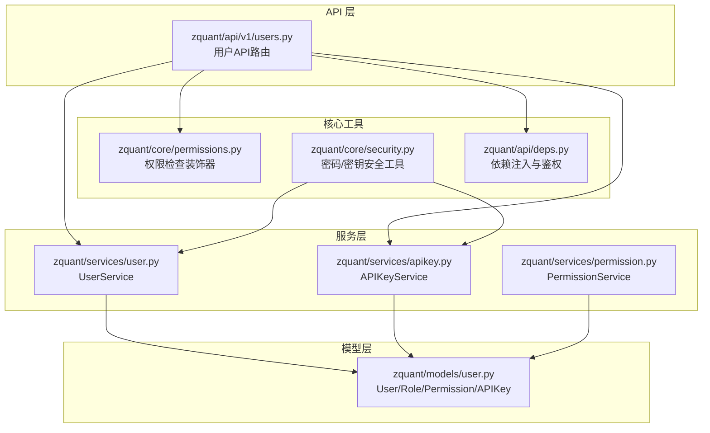
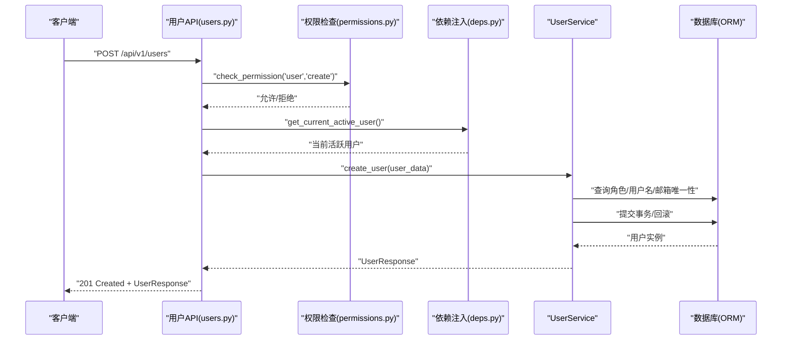
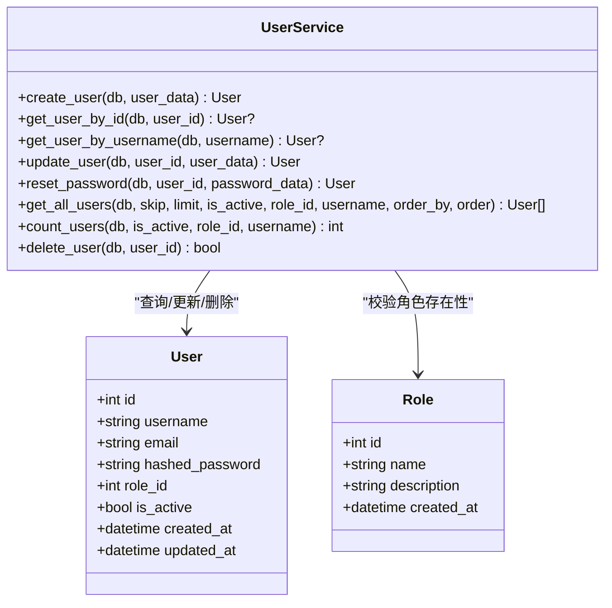
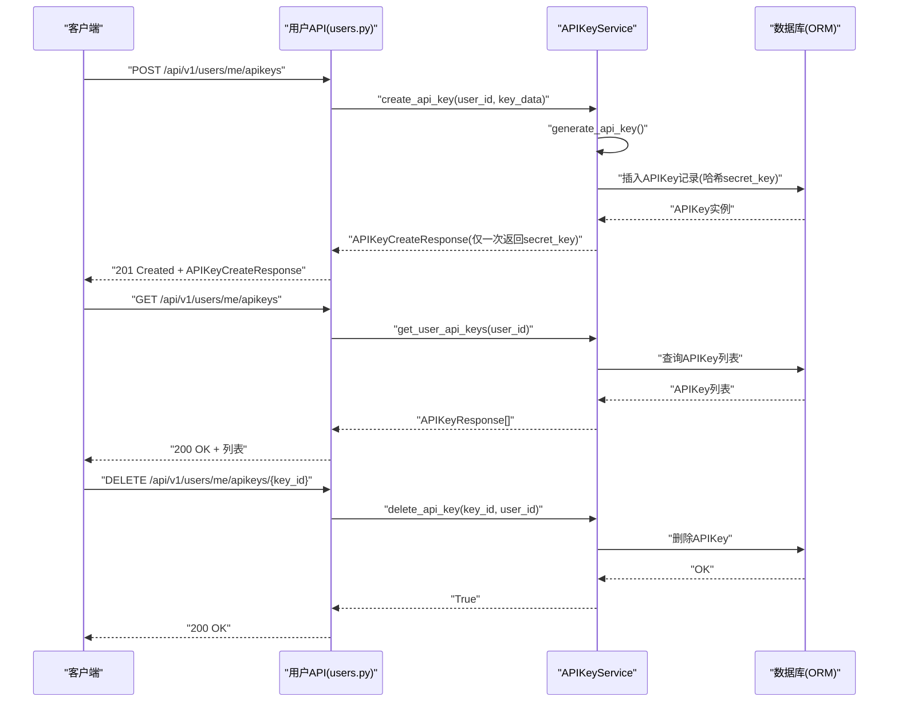
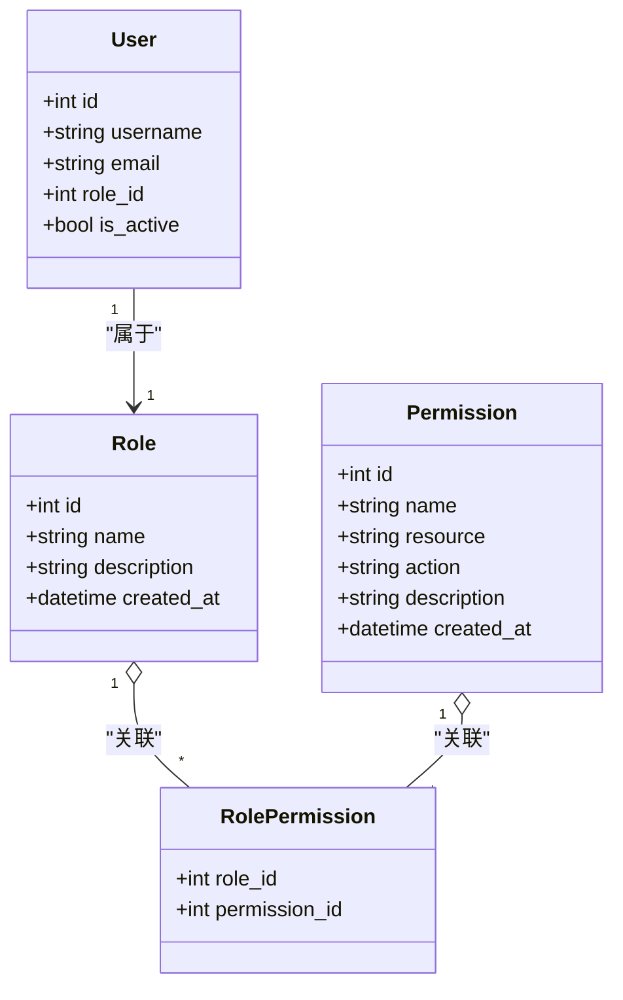
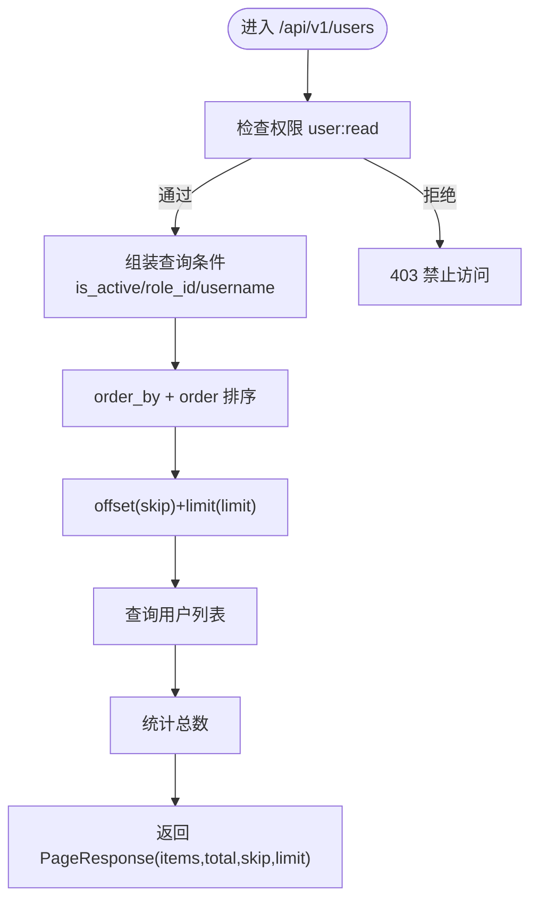
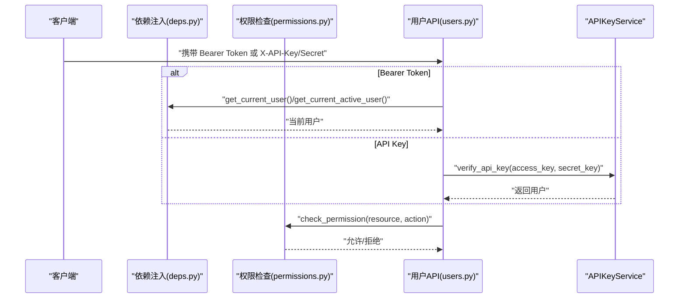
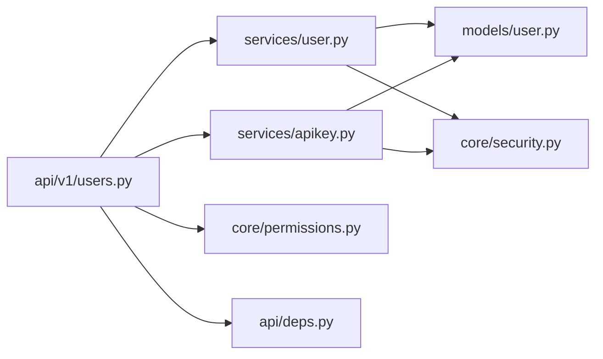
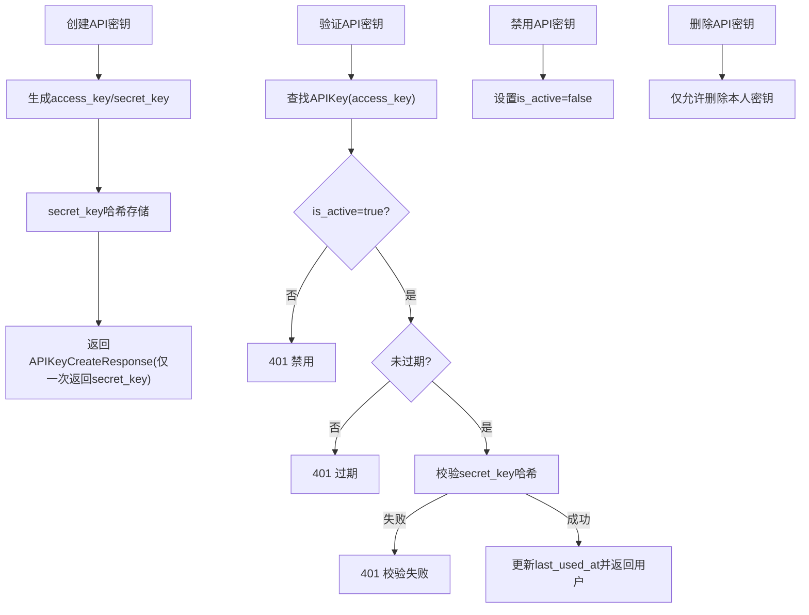

# 用户服务

<cite>
**本文引用的文件**
- [zquant/services/user.py](file://zquant/services/user.py)
- [zquant/models/user.py](file://zquant/models/user.py)
- [zquant/schemas/user.py](file://zquant/schemas/user.py)
- [zquant/api/v1/users.py](file://zquant/api/v1/users.py)
- [zquant/services/apikey.py](file://zquant/services/apikey.py)
- [zquant/core/security.py](file://zquant/core/security.py)
- [zquant/core/permissions.py](file://zquant/core/permissions.py)
- [zquant/api/deps.py](file://zquant/api/deps.py)
- [zquant/services/permission.py](file://zquant/services/permission.py)
- [zquant/api/v1/roles.py](file://zquant/api/v1/roles.py)
- [zquant/scripts/init_db.py](file://zquant/scripts/init_db.py)
- [web/src/pages/user/apikeys.tsx](file://web/src/pages/user/apikeys.tsx)
- [web/src/pages/admin/users/index.tsx](file://web/src/pages/admin/users/index.tsx)
- [web/src/pages/account/settings/index.tsx](file://web/src/pages/account/settings/index.tsx)
</cite>

## 目录
1. [简介](#简介)
2. [项目结构](#项目结构)
3. [核心组件](#核心组件)
4. [架构总览](#架构总览)
5. [详细组件分析](#详细组件分析)
6. [依赖分析](#依赖分析)
7. [性能考量](#性能考量)
8. [故障排查指南](#故障排查指南)
9. [结论](#结论)
10. [附录](#附录)

## 简介
本文件面向“用户服务模块”的开发者与使用者，系统性梳理 UserService 的职责边界与实现细节，覆盖用户注册、信息更新、API 密钥管理、权限角色分配、分页查询与权限校验、与认证/权限服务的协作关系，并给出常见问题（数据一致性、并发更新）的解决方案与最佳实践。文档同时说明用户数据的持久化机制及与数据库模型 User 的映射关系，帮助读者快速理解并正确使用该模块。

## 项目结构
用户服务位于后端 Python 代码中，主要由三层构成：
- API 层：定义 REST 接口，负责参数解析、鉴权与响应封装
- 服务层：业务逻辑实现，如用户 CRUD、API 密钥管理、权限校验
- 模型层：SQLAlchemy ORM 映射，定义用户、角色、权限、API 密钥等实体

图表来源
- [zquant/api/v1/users.py](file://zquant/api/v1/users.py#L1-L208)
- [zquant/services/user.py](file://zquant/services/user.py#L1-L222)
- [zquant/services/apikey.py](file://zquant/services/apikey.py#L1-L142)
- [zquant/services/permission.py](file://zquant/services/permission.py#L1-L178)
- [zquant/core/permissions.py](file://zquant/core/permissions.py#L1-L111)
- [zquant/core/security.py](file://zquant/core/security.py#L1-L133)
- [zquant/api/deps.py](file://zquant/api/deps.py#L1-L93)
- [zquant/models/user.py](file://zquant/models/user.py#L1-L113)

章节来源
- [zquant/api/v1/users.py](file://zquant/api/v1/users.py#L1-L208)
- [zquant/services/user.py](file://zquant/services/user.py#L1-L222)
- [zquant/models/user.py](file://zquant/models/user.py#L1-L113)

## 核心组件
- UserService：提供用户注册、查询、更新、重置密码、删除、分页查询与计数等能力；内部进行角色存在性校验、邮箱唯一性校验、密码强度校验、事务回滚与完整性约束处理。
- APIKeyService：提供 API 密钥的创建、查询、验证、删除、禁用等能力；密钥对生成与存储采用安全策略（access_key 唯一、secret_key 存储哈希）。
- PermissionService：提供权限的创建、查询、更新、删除、分页与计数能力；删除权限前检查是否仍被角色使用。
- 权限与安全工具：check_permission 装饰器基于角色-权限映射进行资源级授权；core/security 提供密码哈希、JWT、API 密钥生成与校验等。

章节来源
- [zquant/services/user.py](file://zquant/services/user.py#L1-L222)
- [zquant/services/apikey.py](file://zquant/services/apikey.py#L1-L142)
- [zquant/services/permission.py](file://zquant/services/permission.py#L1-L178)
- [zquant/core/permissions.py](file://zquant/core/permissions.py#L1-L111)
- [zquant/core/security.py](file://zquant/core/security.py#L1-L133)

## 架构总览
用户服务的调用链路如下：
- API 层接收请求，进行参数校验与权限检查
- 服务层执行业务逻辑，访问模型层进行数据持久化
- 安全与权限工具贯穿于鉴权、授权与密钥校验过程

图表来源
- [zquant/api/v1/users.py](file://zquant/api/v1/users.py#L148-L159)
- [zquant/core/permissions.py](file://zquant/core/permissions.py#L38-L80)
- [zquant/api/deps.py](file://zquant/api/deps.py#L41-L75)
- [zquant/services/user.py](file://zquant/services/user.py#L41-L81)

## 详细组件分析

### UserService 组件分析
- 职责边界
  - 用户注册：校验角色存在性、用户名/邮箱唯一性、密码强度，创建用户并返回
  - 用户查询：按 ID/用户名查询单个用户
  - 用户更新：支持邮箱、激活状态、角色变更；校验邮箱唯一性与角色存在性
  - 密码重置：管理员重置用户密码，校验密码强度并更新
  - 用户删除：软/硬删除取决于模型级级联策略，捕获异常并回滚
  - 分页查询与计数：支持按激活状态、角色、用户名模糊匹配、多字段排序
- 数据持久化与模型映射
  - 与 User/Role 模型映射，遵循唯一性约束（username、email、access_key）
  - 事务控制：使用 SQLAlchemy Session，异常捕获 IntegrityError 并回滚
- 与权限/安全的协作
  - 注册/更新/重置/删除均受 check_permission 装饰器保护
  - 密码存储使用 get_password_hash，避免明文存储

图表来源
- [zquant/services/user.py](file://zquant/services/user.py#L41-L222)
- [zquant/models/user.py](file://zquant/models/user.py#L74-L94)

章节来源
- [zquant/services/user.py](file://zquant/services/user.py#L41-L222)
- [zquant/models/user.py](file://zquant/models/user.py#L74-L94)
- [zquant/api/v1/users.py](file://zquant/api/v1/users.py#L148-L208)

### API 密钥管理流程
- 生成与存储
  - 生成 access_key/secret_key 对，secret_key 存储为哈希值，首次返回明文 secret_key 供用户保存
  - APIKey 表包含 user_id、access_key 唯一索引、secret_key 哈希、is_active、last_used_at、expires_at 等
- 验证流程
  - 根据 access_key 查找 APIKey，校验 is_active 与过期时间，再验证 secret_key 哈希
  - 验证成功后更新 last_used_at，并返回用户
- 激活/禁用/删除
  - 支持禁用 APIKey（is_active=false）
  - 支持删除 APIKey（仅本人）

图表来源
- [zquant/api/v1/users.py](file://zquant/api/v1/users.py#L101-L136)
- [zquant/services/apikey.py](file://zquant/services/apikey.py#L47-L142)
- [zquant/core/security.py](file://zquant/core/security.py#L116-L133)
- [zquant/models/user.py](file://zquant/models/user.py#L96-L113)

章节来源
- [zquant/services/apikey.py](file://zquant/services/apikey.py#L47-L142)
- [zquant/core/security.py](file://zquant/core/security.py#L116-L133)
- [zquant/models/user.py](file://zquant/models/user.py#L96-L113)
- [web/src/pages/user/apikeys.tsx](file://web/src/pages/user/apikeys.tsx#L31-L282)

### 权限与角色分配
- 权限模型
  - Permission：name 唯一，resource/action 描述资源与操作
  - Role：与 Permission 通过中间表 zq_app_role_permissions 多对多关联
  - User 属于 Role，继承角色权限
- 权限校验
  - check_permission(resource, action) 装饰器基于用户角色查询是否具备相应权限
  - has_permission 实现具体校验逻辑
- 角色权限分配
  - API 提供查询角色权限、为角色分配权限等接口
  - 初始化脚本将常用权限分配给 admin/researcher/user 等角色

图表来源
- [zquant/models/user.py](file://zquant/models/user.py#L34-L63)
- [zquant/models/user.py](file://zquant/models/user.py#L65-L73)
- [zquant/models/user.py](file://zquant/models/user.py#L74-L94)
- [zquant/core/permissions.py](file://zquant/core/permissions.py#L64-L79)
- [zquant/api/v1/roles.py](file://zquant/api/v1/roles.py#L129-L157)
- [zquant/scripts/init_db.py](file://zquant/scripts/init_db.py#L129-L255)

章节来源
- [zquant/core/permissions.py](file://zquant/core/permissions.py#L38-L111)
- [zquant/api/v1/roles.py](file://zquant/api/v1/roles.py#L73-L157)
- [zquant/scripts/init_db.py](file://zquant/scripts/init_db.py#L129-L255)

### 分页查询与权限校验实现示例
- 分页查询用户列表
  - API：支持 skip/limit、is_active、role_id、username 模糊匹配、order_by/order 排序
  - 服务：get_all_users/count_users 组装查询条件与排序，返回 PageResponse
- 权限校验
  - API 使用 @check_permission("user","read") 保护列表查询
  - 依赖注入 get_current_active_user 确保用户处于激活状态

图表来源
- [zquant/api/v1/users.py](file://zquant/api/v1/users.py#L51-L77)
- [zquant/services/user.py](file://zquant/services/user.py#L148-L207)
- [zquant/core/permissions.py](file://zquant/core/permissions.py#L38-L80)
- [zquant/api/deps.py](file://zquant/api/deps.py#L70-L75)

章节来源
- [zquant/api/v1/users.py](file://zquant/api/v1/users.py#L51-L77)
- [zquant/services/user.py](file://zquant/services/user.py#L148-L207)
- [zquant/core/permissions.py](file://zquant/core/permissions.py#L38-L80)
- [zquant/api/deps.py](file://zquant/api/deps.py#L70-L75)

### 与认证、权限的协作关系
- Bearer Token 认证
  - 依赖注入 get_current_user 从 Authorization: Bearer 中解析 JWT，失败返回 401
  - get_current_active_user 进一步确保用户 is_active=true
- API 密钥认证
  - 通过 X-API-Key 与 X-API-Secret 请求头，调用 APIKeyService.verify_api_key 完成验证
- 权限控制
  - check_permission(resource, action) 基于用户角色与权限映射进行授权判断
  - require_role 可限定特定角色

图表来源
- [zquant/api/deps.py](file://zquant/api/deps.py#L41-L93)
- [zquant/core/permissions.py](file://zquant/core/permissions.py#L38-L111)
- [zquant/api/v1/users.py](file://zquant/api/v1/users.py#L101-L136)
- [zquant/services/apikey.py](file://zquant/services/apikey.py#L90-L117)

章节来源
- [zquant/api/deps.py](file://zquant/api/deps.py#L41-L93)
- [zquant/core/permissions.py](file://zquant/core/permissions.py#L38-L111)
- [zquant/api/v1/users.py](file://zquant/api/v1/users.py#L101-L136)
- [zquant/services/apikey.py](file://zquant/services/apikey.py#L90-L117)

## 依赖分析
- 组件耦合
  - API 层依赖权限检查与依赖注入，服务层依赖模型层与安全工具
  - UserService 与 APIKeyService 均依赖 User/Role/Permission 模型
- 外部依赖
  - SQLAlchemy ORM、FastAPI、Passlib（密码哈希）、python-jose（JWT）
- 潜在循环依赖
  - 当前模块间通过字符串导入与延迟调用避免循环依赖

图表来源
- [zquant/api/v1/users.py](file://zquant/api/v1/users.py#L1-L208)
- [zquant/services/user.py](file://zquant/services/user.py#L1-L222)
- [zquant/services/apikey.py](file://zquant/services/apikey.py#L1-L142)
- [zquant/core/permissions.py](file://zquant/core/permissions.py#L1-L111)
- [zquant/api/deps.py](file://zquant/api/deps.py#L1-L93)
- [zquant/core/security.py](file://zquant/core/security.py#L1-L133)
- [zquant/models/user.py](file://zquant/models/user.py#L1-L113)

章节来源
- [zquant/api/v1/users.py](file://zquant/api/v1/users.py#L1-L208)
- [zquant/services/user.py](file://zquant/services/user.py#L1-L222)
- [zquant/services/apikey.py](file://zquant/services/apikey.py#L1-L142)
- [zquant/core/security.py](file://zquant/core/security.py#L1-L133)
- [zquant/models/user.py](file://zquant/models/user.py#L1-L113)

## 性能考量
- 查询优化
  - 分页查询使用 offset/limit，结合索引列（username、email、access_key、created_at、updated_at）提升排序与过滤效率
  - 排序字段限定在白名单内，避免动态 SQL 注入与无索引扫描
- 事务与并发
  - 所有写操作在单事务中执行，遇到 IntegrityError 自动回滚，保证数据一致性
  - 建议在高并发场景下配合数据库锁或幂等设计（例如幂等键）降低冲突概率
- 缓存与批量
  - 权限查询可结合缓存（角色-权限映射）减少重复查询
  - 批量操作建议使用批量插入/更新策略（参考数据层批量写入模式）

[本节为通用指导，无需列出章节来源]

## 故障排查指南
- 常见错误与定位
  - 400 参数校验失败：用户名/邮箱重复、密码强度不满足、角色不存在
  - 403 权限不足：未持有资源级权限或用户被禁用
  - 401 API 密钥无效：access_key 不存在、secret_key 不匹配、密钥被禁用或过期
  - 500 数据库异常：IntegrityError 回滚、表不存在（依赖注入层会提示初始化脚本）
- 建议排查步骤
  - 检查请求头 Authorization 与 X-API-Key/Secret 是否正确
  - 确认用户 is_active=true 且角色存在
  - 核对密码强度规则与邮箱/用户名唯一性
  - 检查 API 密钥是否过期、是否被禁用
- 常见问题与解决方案
  - 数据一致性维护
    - 使用事务包裹写操作，捕获 IntegrityError 并回滚
    - 对关键字段（username/email/access_key）建立唯一索引
  - 并发更新
    - 在高并发场景下引入幂等键或乐观锁
    - 将热点字段更新拆分为最小必要事务，减少锁竞争

章节来源
- [zquant/services/user.py](file://zquant/services/user.py#L41-L123)
- [zquant/services/apikey.py](file://zquant/services/apikey.py#L90-L141)
- [zquant/api/deps.py](file://zquant/api/deps.py#L41-L93)

## 结论
用户服务模块以清晰的分层设计实现了用户生命周期管理、API 密钥安全管控与权限体系集成。通过严格的参数校验、事务回滚与权限装饰器，系统在保障安全性的同时提供了良好的扩展性。建议在生产环境中配合缓存、批量写入与幂等设计进一步提升性能与稳定性。

[本节为总结性内容，无需列出章节来源]

## 附录

### API 密钥生成、激活、禁用流程图

图表来源
- [zquant/services/apikey.py](file://zquant/services/apikey.py#L47-L141)
- [zquant/core/security.py](file://zquant/core/security.py#L116-L133)

### 前端交互要点
- API 密钥页面：创建成功后仅一次性展示 secret_key，需妥善保存
- 管理员用户管理：支持设置邮箱、激活状态、角色；密码重置需满足强度规则
- 个人中心：支持修改邮箱与重置密码

章节来源
- [web/src/pages/user/apikeys.tsx](file://web/src/pages/user/apikeys.tsx#L31-L282)
- [web/src/pages/admin/users/index.tsx](file://web/src/pages/admin/users/index.tsx#L405-L501)
- [web/src/pages/account/settings/index.tsx](file://web/src/pages/account/settings/index.tsx#L1-L151)