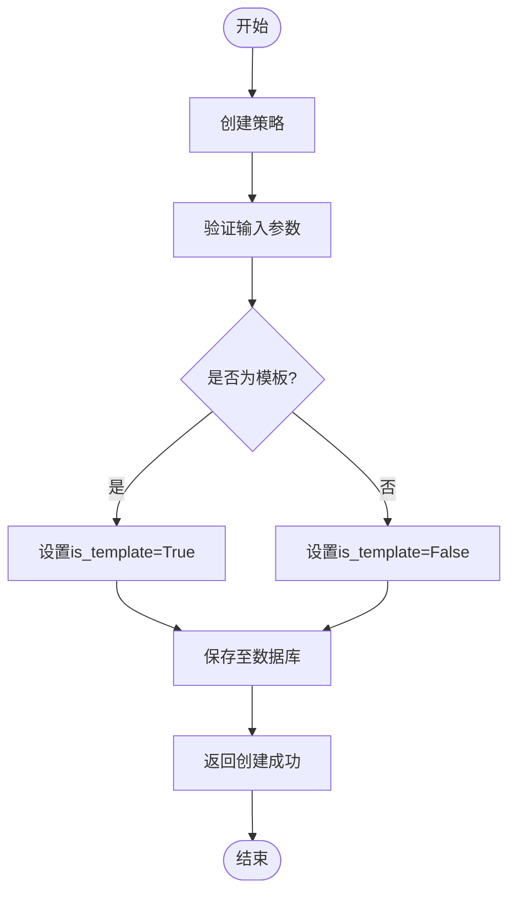
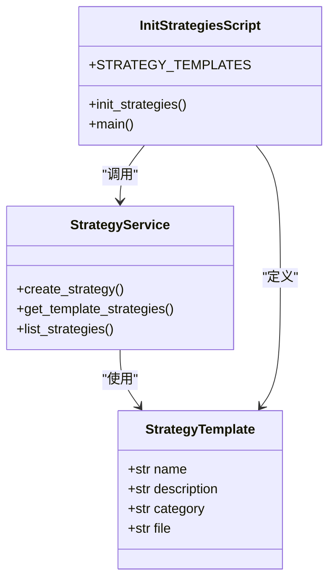
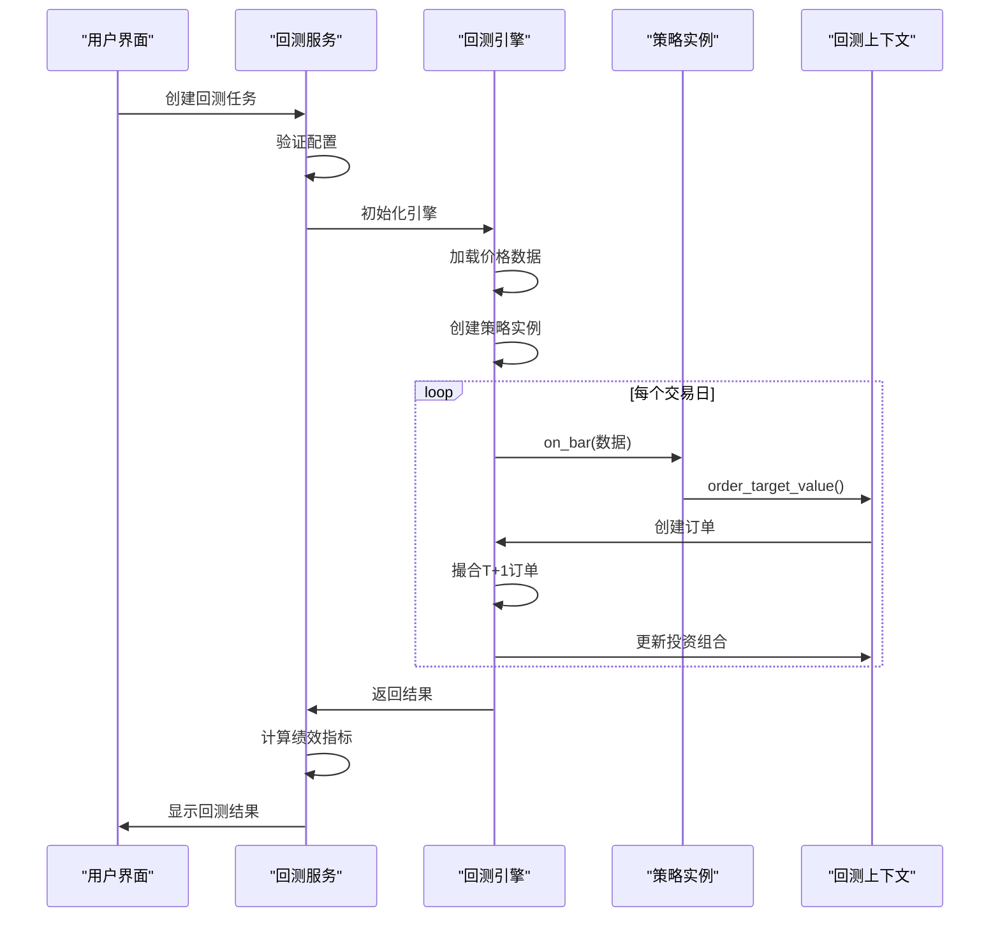
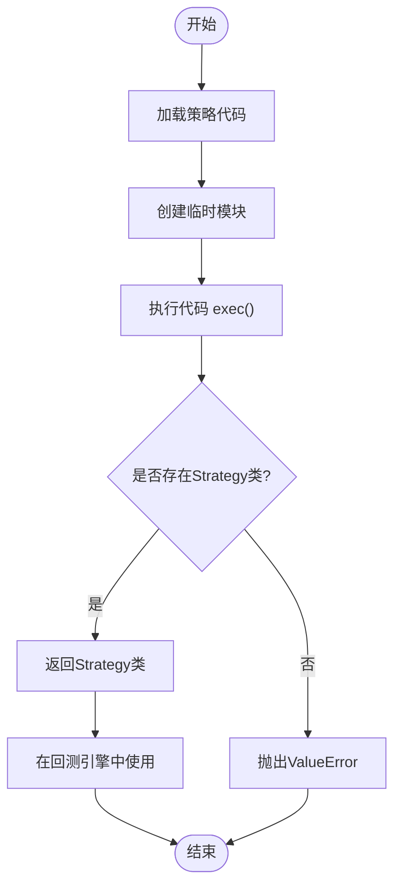
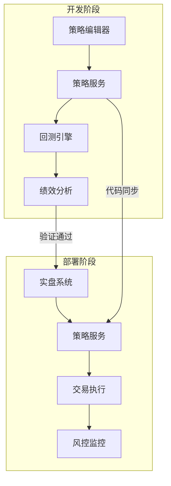

# 策略服务

<cite>
**本文档引用文件**  
- [strategy.py](file://zquant/services/strategy.py)
- [backtest.py](file://zquant/services/backtest.py)
- [engine.py](file://zquant/backtest/engine.py)
- [backtest.py](file://zquant/models/backtest.py)
- [strategy.py](file://zquant/backtest/strategy.py)
- [init_strategies.py](file://zquant/scripts/init_strategies.py)
- [simple_ma.py](file://zquant/strategy/examples/simple_ma.py)
- [dual_ma.py](file://zquant/strategy/examples/dual_ma.py)
- [bollinger_bands.py](file://zquant/strategy/examples/bollinger_bands.py)
- [create.tsx](file://web/src/pages/backtest/strategies/create.tsx)
- [index.tsx](file://web/src/pages/backtest/strategies/index.tsx)
</cite>

## 目录
1. [引言](#引言)
2. [策略管理功能](#策略管理功能)
3. [策略模板系统](#策略模板系统)
4. [策略执行与调度](#策略执行与调度)
5. [安全沙箱执行机制](#安全沙箱执行机制)
6. [版本控制策略](#版本控制策略)
7. [参数优化与A/B测试](#参数优化与ab测试)
8. [策略导入导出格式](#策略导入导出格式)
9. [依赖管理机制](#依赖管理机制)
10. [与回测/实盘环境集成](#与回测实盘环境集成)

## 引言
本文档全面介绍量化交易系统中的策略服务（StrategyService），详细阐述其对量化策略的全生命周期管理功能。策略服务作为系统核心组件，提供从策略创建、加载、验证到执行调度的完整解决方案。系统通过预设的策略模板（如双均线、布林带等）加速用户开发流程，并采用安全沙箱机制保障策略代码执行安全。同时，服务支持策略版本控制、参数优化和A/B测试，为用户提供强大的策略开发和验证能力。

## 策略管理功能

策略服务提供完整的CRUD（创建、读取、更新、删除）操作接口，实现对量化策略的全生命周期管理。所有操作均基于用户ID进行资源隔离，确保数据安全。

**核心功能接口**：
- **创建策略**：通过`create_strategy`方法创建新策略，支持设置策略名称、代码、描述、分类和参数模式
- **获取策略**：通过`get_strategy`方法根据ID获取策略详情，实施严格的用户权限校验
- **更新策略**：通过`update_strategy`方法修改策略内容，模板策略仅允许创建者修改
- **删除策略**：通过`delete_strategy`方法删除策略，模板策略受保护不可删除
- **策略列表**：提供`list_strategies`和`list_all_operable_strategies`方法，支持分页、搜索、分类筛选和排序

策略数据持久化于`zq_backtest_strategies`数据库表中，包含用户ID、名称、描述、分类、代码、参数模式和是否为模板等字段。系统通过`is_template`标志位区分用户自定义策略和系统模板策略，实现不同的权限控制策略。

**策略管理流程**：


**节来源**
- [strategy.py](file://zquant/services/strategy.py#L35-L265)

## 策略模板系统

策略模板系统通过预设的示例策略加速用户开发流程，降低量化策略开发门槛。系统提供多种经典策略模板，涵盖技术分析、基本面分析和量化策略等类别。

**预设模板示例**：
- **简单均线策略**：短期均线上穿长期均线时买入，下穿时卖出
- **双均线策略（增强版）**：在基础双均线基础上增加趋势过滤和仓位管理
- **布林带策略**：价格触及下轨时买入，触及上轨时卖出
- **动量策略**：买入过去N天收益率最高的股票
- **PE/PB价值策略**：基于PE/PB指标的低估值投资策略
- **换手率策略**：基于换手率指标的活跃度交易策略
- **均值回归策略**：价格偏离均值超过阈值时进行反向交易
- **RSI策略**：RSI低于超卖线时买入，高于超买线时卖出
- **网格交易策略**：在价格区间内设置网格进行高抛低吸

模板系统通过`init_strategies.py`脚本在系统初始化时自动导入，将`zquant/strategy/examples/`目录下的Python文件作为模板策略存入数据库。每个模板包含名称、描述、分类和对应的代码文件路径。用户在创建新策略时可选择模板，系统将自动加载模板代码和配置，用户可在此基础上进行修改和优化。



**图来源**  
- [init_strategies.py](file://zquant/scripts/init_strategies.py#L48-L104)
- [strategy.py](file://zquant/services/strategy.py#L178-L189)

**节来源**
- [init_strategies.py](file://zquant/scripts/init_strategies.py#L1-L189)
- [strategy.py](file://zquant/services/strategy.py#L178-L189)

## 策略执行与调度

策略执行与调度系统负责将策略代码转化为实际的交易行为，通过回测引擎模拟历史市场表现。系统采用事件驱动架构，按交易日顺序处理K线数据并触发策略回调。

**执行流程**：
1. **任务创建**：通过`create_task`方法创建回测任务，指定策略代码、配置参数和初始资金
2. **策略加载**：使用`_load_strategy_class`方法动态加载策略类，通过`exec()`函数执行策略代码
3. **引擎初始化**：创建`BacktestEngine`实例，加载价格数据和交易日历，初始化回测上下文
4. **回测执行**：按交易日循环，调用策略的`on_bar`方法处理K线数据，生成交易订单
5. **订单撮合**：在T+1日撮合订单，考虑开盘价、涨跌停限制和交易成本
6. **结果计算**：回测结束后计算绩效指标，包括累计收益率、年化收益率、最大回撤、夏普比率等

回测引擎通过`Context`对象为策略提供运行环境，封装了投资组合、订单管理、数据访问等核心功能。策略通过`context.order_target_value()`等方法下达交易指令，由引擎负责执行和状态更新。



**图来源**  
- [backtest.py](file://zquant/services/backtest.py#L43-L278)
- [engine.py](file://zquant/backtest/engine.py#L41-L498)

**节来源**
- [backtest.py](file://zquant/services/backtest.py#L43-L278)
- [engine.py](file://zquant/backtest/engine.py#L41-L498)

## 安全沙箱执行机制

策略服务采用安全沙箱机制执行用户提交的策略代码，防止恶意代码对系统造成损害。系统通过动态代码执行和资源访问控制实现安全隔离。

**安全机制**：
- **动态代码执行**：使用`importlib.util`和`exec()`函数在隔离的命名空间中执行策略代码
- **类名验证**：强制要求策略代码中定义名为`Strategy`的类，确保接口一致性
- **资源隔离**：策略运行在受限的`Context`环境中，无法直接访问系统资源
- **权限控制**：通过用户ID进行数据隔离，用户只能访问自己的策略和回测结果
- **异常处理**：捕获并记录所有执行异常，防止系统崩溃

策略代码执行流程中，系统首先创建临时模块，然后执行用户提交的代码字符串，最后验证模块中是否存在`Strategy`类。这种机制允许用户使用完整的Python语法编写策略，同时通过运行时环境限制确保系统安全。



**图来源**  
- [backtest.py](file://zquant/services/backtest.py#L163-L177)

**节来源**
- [backtest.py](file://zquant/services/backtest.py#L163-L177)

## 版本控制策略

策略服务通过数据库记录实现基本的版本控制功能，支持策略的迭代开发和历史追溯。系统采用基于时间戳的版本管理机制，记录每次修改的时间和内容。

**版本控制特性**：
- **自动版本记录**：每次策略更新时自动记录`updated_at`时间戳
- **历史追溯**：通过`created_at`和`updated_at`字段追踪策略生命周期
- **模板更新**：系统管理员可更新模板策略，所有用户可见最新版本
- **用户隔离**：用户自定义策略独立存储，不受模板更新影响

虽然当前系统未实现完整的Git式版本控制（如分支、合并、差异比较），但通过`params_schema`字段支持策略参数的结构化定义，为未来扩展版本控制功能奠定基础。建议用户通过策略名称或描述添加版本标识（如"v1.0"、"优化版"）来管理不同版本的策略。

**节来源**
- [backtest.py](file://zquant/models/backtest.py#L72-L90)

## 参数优化与A/B测试

策略服务为参数优化和A/B测试提供基础支持，通过灵活的配置系统实现不同参数组合的快速测试。

**参数优化支持**：
- **参数模式**：通过`params_schema`字段定义策略参数的JSON Schema，支持类型、范围和默认值定义
- **配置驱动**：回测配置作为独立参数传入，便于批量测试不同参数组合
- **批量执行**：可通过脚本批量创建多个回测任务，测试不同参数组合

**A/B测试支持**：
- **策略对比**：创建多个策略变体，分别进行回测后比较绩效指标
- **环境一致性**：所有测试使用相同的历史数据和市场环境，确保公平比较
- **指标分析**：通过夏普比率、最大回撤等指标量化评估策略表现差异

系统通过`config`参数传递回测配置，包括起止日期、股票池、初始资金、交易成本等，为参数优化和A/B测试提供灵活的实验框架。

**节来源**
- [backtest.py](file://zquant/models/backtest.py#L83)
- [engine.py](file://zquant/backtest/engine.py#L54-L71)

## 策略导入导出格式

策略服务支持标准化的策略导入导出格式，便于策略的分享和迁移。策略数据以结构化格式存储，包含代码、配置和元数据。

**导出格式**：
```json
{
  "name": "策略名称",
  "description": "策略描述",
  "category": "策略分类",
  "code": "策略Python代码",
  "params_schema": "参数JSON Schema",
  "is_template": false,
  "created_at": "创建时间",
  "updated_at": "更新时间"
}
```

**导入流程**：
1. 用户上传JSON格式的策略文件
2. 系统验证JSON结构和必填字段
3. 检查代码语法和策略类定义
4. 创建新的策略记录，`is_template`设为false
5. 返回导入结果和策略ID

系统通过API接口支持策略的批量导入导出，为用户在不同环境间迁移策略提供便利。

**节来源**
- [backtest.py](file://zquant/models/backtest.py#L72-L90)
- [strategy.py](file://zquant/services/strategy.py#L38-L125)

## 依赖管理机制

策略服务通过模块化设计和依赖注入实现清晰的依赖管理，确保各组件间的松耦合。

**核心依赖关系**：
- **数据库依赖**：通过SQLAlchemy ORM与数据库交互，使用`Session`进行事务管理
- **服务依赖**：`BacktestService`依赖`StrategyService`获取策略信息
- **数据依赖**：通过`PriceDataRepository`和`TradingDateRepository`访问市场数据
- **工具依赖**：使用`loguru`进行日志记录，`pandas`进行数据处理

系统采用依赖倒置原则，高层模块（如服务层）定义接口，低层模块（如数据访问层）实现具体逻辑。这种设计提高了代码的可测试性和可维护性，便于未来扩展和重构。

**节来源**
- [backtest.py](file://zquant/services/backtest.py#L36-L39)
- [engine.py](file://zquant/backtest/engine.py#L35-L39)

## 与回测/实盘环境集成

策略服务与回测和实盘环境紧密集成，提供一致的开发和部署体验。

**回测环境集成**：
- **无缝切换**：同一策略代码既可用于回测也可用于实盘（需适配执行环境）
- **数据一致性**：使用相同的数据访问接口，确保回测和实盘逻辑一致
- **风险控制**：回测结果作为实盘部署的决策依据，设置绩效阈值

**实盘环境集成**：
- **代码复用**：实盘系统可直接使用经过验证的策略代码
- **参数传递**：通过`params`参数动态调整策略行为
- **监控告警**：实盘运行时监控策略状态，异常时及时告警

系统通过`Context`对象抽象化执行环境差异，策略代码通过统一的API（如`order_target_value`）下达指令，由底层引擎根据环境类型（回测/实盘）进行适配执行。



**图来源**  
- [strategy.py](file://zquant/services/strategy.py)
- [engine.py](file://zquant/backtest/engine.py)

**节来源**
- [strategy.py](file://zquant/services/strategy.py)
- [engine.py](file://zquant/backtest/engine.py)