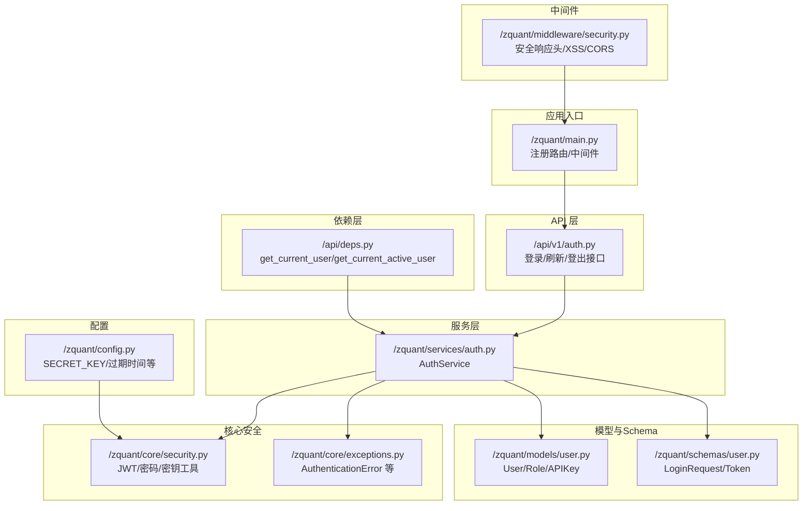
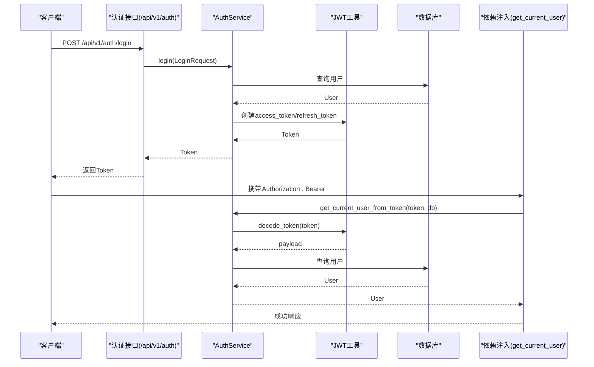
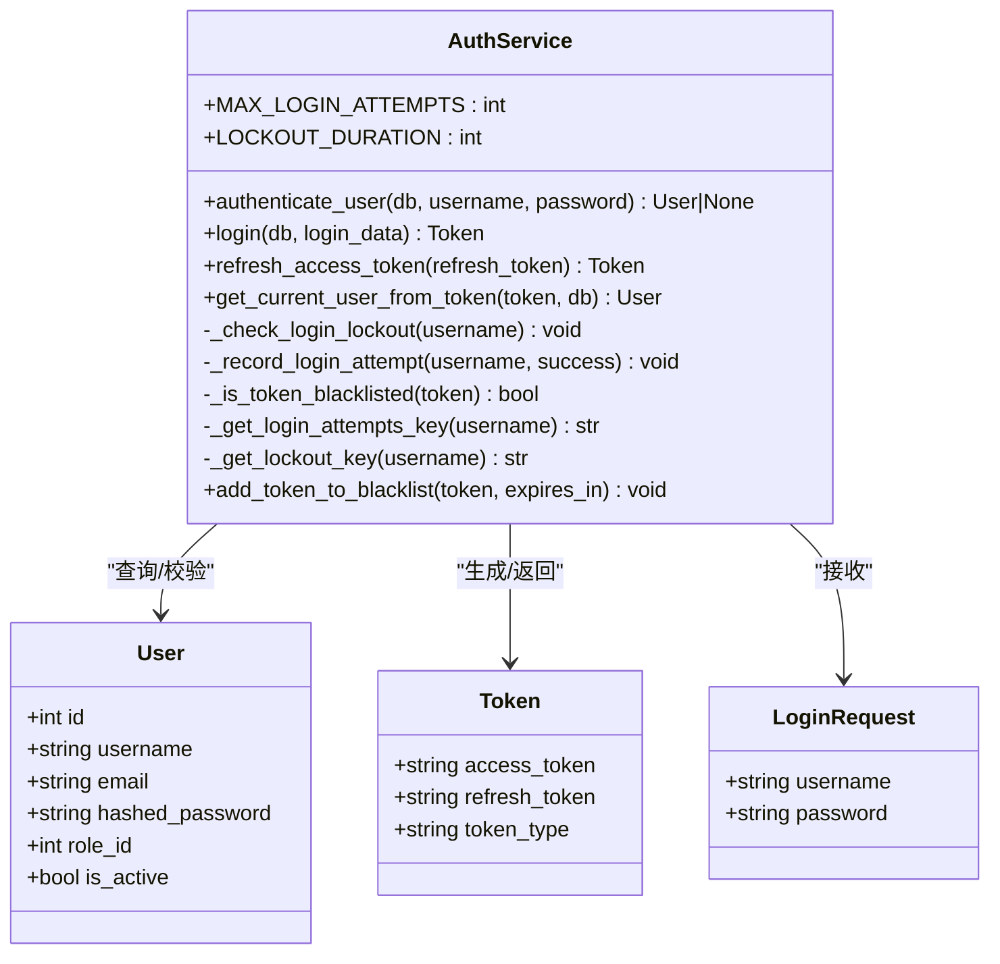
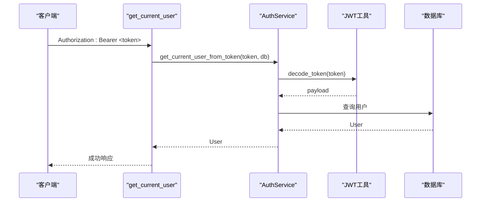
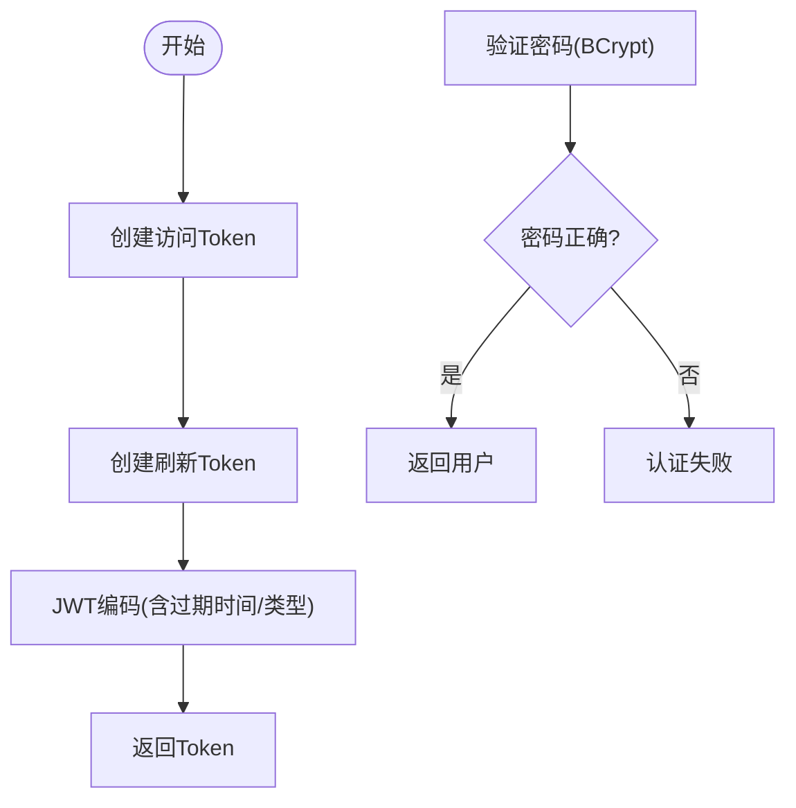
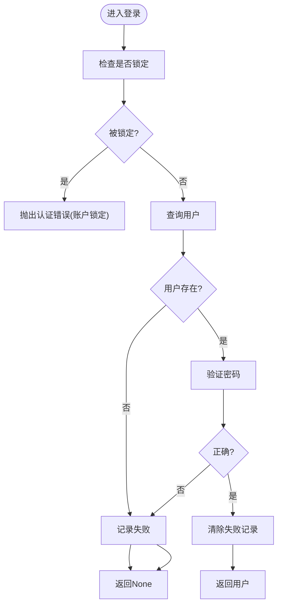
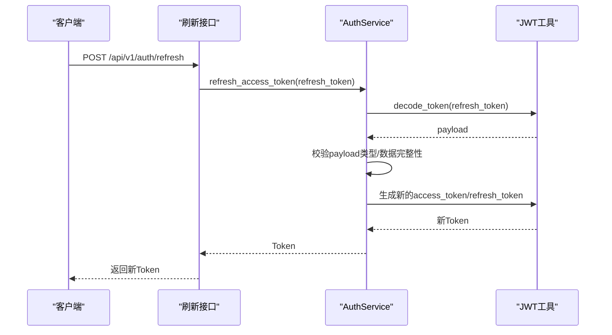
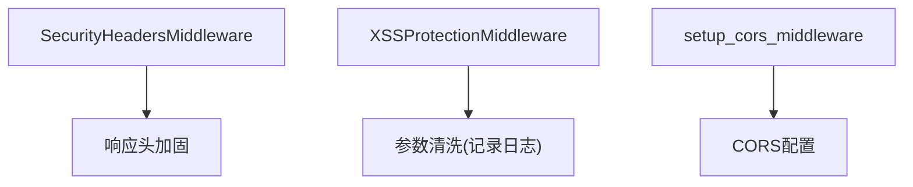
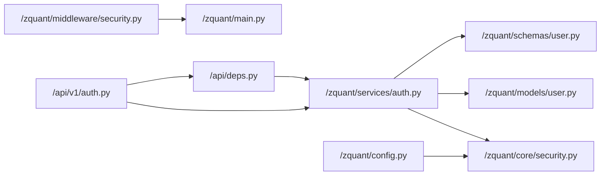

# 认证服务

<cite>
**本文引用的文件**
- [zquant/services/auth.py](file://zquant/services/auth.py)
- [zquant/api/v1/auth.py](file://zquant/api/v1/auth.py)
- [zquant/api/deps.py](file://zquant/api/deps.py)
- [zquant/middleware/security.py](file://zquant/middleware/security.py)
- [zquant/core/security.py](file://zquant/core/security.py)
- [zquant/core/exceptions.py](file://zquant/core/exceptions.py)
- [zquant/models/user.py](file://zquant/models/user.py)
- [zquant/schemas/user.py](file://zquant/schemas/user.py)
- [zquant/config.py](file://zquant/config.py)
- [zquant/main.py](file://zquant/main.py)
- [zquant/utils/encryption.py](file://zquant/utils/encryption.py)
- [zquant/tests/unittest/test_auth_service.py](file://zquant/tests/unittest/test_auth_service.py)
- [zquant/tests/unittest/test_security.py](file://zquant/tests/unittest/test_security.py)
</cite>

## 目录
1. [简介](#简介)
2. [项目结构](#项目结构)
3. [核心组件](#核心组件)
4. [架构总览](#架构总览)
5. [组件详解](#组件详解)
6. [依赖关系分析](#依赖关系分析)
7. [性能考量](#性能考量)
8. [故障排查指南](#故障排查指南)
9. [结论](#结论)
10. [附录](#附录)

## 简介
本文件面向开发者，系统性解析 zquant 的认证服务设计与实现，重点覆盖：
- AuthService 类：用户登录、JWT Token 生成与验证、密码加密存储（bcrypt）、登录失败次数限制与锁定、Token 黑名单与登出流程
- 与 FastAPI 依赖注入（get_current_user）的集成方式
- 中间件层面的安全加固（安全响应头、XSS 防护、CORS）
- Token 刷新流程与第三方认证扩展点
- 异常处理策略与响应规范
- 自定义认证逻辑的扩展指南

## 项目结构
认证相关代码主要分布在以下模块：
- 服务层：认证业务逻辑集中在服务层，便于复用与测试
- API 层：提供登录、刷新、登出等接口
- 依赖层：FastAPI 依赖注入，统一从 Token 获取当前用户
- 中间件层：安全响应头、XSS 防护、CORS
- 核心安全：JWT 工具、密码加密、API Key 加密
- 模型与 Schema：用户模型、登录/Token 数据模型
- 配置：JWT 密钥、算法、过期时间、速率限制等

图表来源
- [zquant/api/v1/auth.py](file://zquant/api/v1/auth.py#L1-L65)
- [zquant/api/deps.py](file://zquant/api/deps.py#L1-L93)
- [zquant/services/auth.py](file://zquant/services/auth.py#L1-L289)
- [zquant/core/security.py](file://zquant/core/security.py#L1-L133)
- [zquant/core/exceptions.py](file://zquant/core/exceptions.py#L1-L54)
- [zquant/models/user.py](file://zquant/models/user.py#L1-L113)
- [zquant/schemas/user.py](file://zquant/schemas/user.py#L160-L186)
- [zquant/middleware/security.py](file://zquant/middleware/security.py#L1-L163)
- [zquant/config.py](file://zquant/config.py#L73-L78)
- [zquant/main.py](file://zquant/main.py#L116-L148)

章节来源
- [zquant/api/v1/auth.py](file://zquant/api/v1/auth.py#L1-L65)
- [zquant/api/deps.py](file://zquant/api/deps.py#L1-L93)
- [zquant/services/auth.py](file://zquant/services/auth.py#L1-L289)
- [zquant/middleware/security.py](file://zquant/middleware/security.py#L1-L163)
- [zquant/core/security.py](file://zquant/core/security.py#L1-L133)
- [zquant/models/user.py](file://zquant/models/user.py#L1-L113)
- [zquant/schemas/user.py](file://zquant/schemas/user.py#L160-L186)
- [zquant/config.py](file://zquant/config.py#L73-L78)
- [zquant/main.py](file://zquant/main.py#L116-L148)

## 核心组件
- AuthService：认证服务核心类，负责登录、鉴权、Token 刷新、登录失败次数限制、Token 黑名单
- FastAPI 依赖注入：get_current_user 从 Authorization Bearer 中提取 Token 并校验
- JWT 工具：创建/解码访问/刷新 Token，密码 bcrypt 加密
- 中间件：安全响应头、XSS 防护、CORS
- 模型与 Schema：用户模型、登录请求、Token 响应
- 配置：JWT 密钥、算法、过期时间、速率限制

章节来源
- [zquant/services/auth.py](file://zquant/services/auth.py#L45-L289)
- [zquant/api/deps.py](file://zquant/api/deps.py#L41-L75)
- [zquant/core/security.py](file://zquant/core/security.py#L85-L114)
- [zquant/middleware/security.py](file://zquant/middleware/security.py#L39-L163)
- [zquant/schemas/user.py](file://zquant/schemas/user.py#L160-L186)
- [zquant/config.py](file://zquant/config.py#L73-L78)

## 架构总览
认证流程的关键交互如下：
- 客户端调用登录接口，服务端验证用户凭据，生成访问/刷新 Token
- 后续请求携带 Bearer Token，依赖注入 get_current_user 校验 Token 并返回当前用户
- 中间件层提供安全加固（响应头、XSS、CORS）
- 登出通过客户端删除 Token 实现；服务端支持将 Token 加入黑名单以强制失效

图表来源
- [zquant/api/v1/auth.py](file://zquant/api/v1/auth.py#L39-L65)
- [zquant/services/auth.py](file://zquant/services/auth.py#L200-L289)
- [zquant/api/deps.py](file://zquant/api/deps.py#L41-L75)
- [zquant/core/security.py](file://zquant/core/security.py#L85-L114)
- [zquant/models/user.py](file://zquant/models/user.py#L74-L94)

## 组件详解

### AuthService 类设计与实现
- 登录失败次数限制与锁定
  - 使用缓存记录登录尝试次数与锁定到期时间
  - 达到阈值后锁定账户一段时间，期间拒绝登录
  - 锁定过期后自动清理缓存
- Token 黑名单
  - 通过 Token 的哈希值作为键加入黑名单，支持强制失效
- 用户认证与登录
  - 校验用户是否存在、密码是否正确、用户是否激活
  - 成功后生成访问 Token 与刷新 Token
- Token 刷新
  - 校验刷新 Token 类型与有效性，生成新的访问/刷新 Token
- 当前用户获取
  - 校验 Token 是否在黑名单、类型是否为 access、用户是否存在且激活

图表来源
- [zquant/services/auth.py](file://zquant/services/auth.py#L45-L289)
- [zquant/models/user.py](file://zquant/models/user.py#L74-L94)
- [zquant/schemas/user.py](file://zquant/schemas/user.py#L160-L186)

章节来源
- [zquant/services/auth.py](file://zquant/services/auth.py#L55-L126)
- [zquant/services/auth.py](file://zquant/services/auth.py#L128-L199)
- [zquant/services/auth.py](file://zquant/services/auth.py#L200-L249)
- [zquant/services/auth.py](file://zquant/services/auth.py#L250-L289)

### FastAPI 依赖注入与 get_current_user
- get_current_user 从 Authorization Bearer 中提取 Token，调用 AuthService.get_current_user_from_token 校验
- 若校验失败，抛出 HTTP 401，并设置 WWW-Authenticate: Bearer
- get_current_active_user 在 get_current_user 基础上进一步校验用户是否激活
- get_api_key_user 支持通过 X-API-Key 与 X-API-Secret 进行 API Key 认证（扩展）

图表来源
- [zquant/api/deps.py](file://zquant/api/deps.py#L41-L75)
- [zquant/services/auth.py](file://zquant/services/auth.py#L250-L289)
- [zquant/core/security.py](file://zquant/core/security.py#L107-L114)

章节来源
- [zquant/api/deps.py](file://zquant/api/deps.py#L41-L75)

### JWT Token 生成与验证、密码加密存储（bcrypt）
- 访问 Token 与刷新 Token 的创建与过期时间由配置控制
- Token 解码失败或类型不符均视为无效
- 密码使用 bcrypt 加密存储，提供强度校验与验证

图表来源
- [zquant/core/security.py](file://zquant/core/security.py#L85-L114)
- [zquant/core/security.py](file://zquant/core/security.py#L39-L47)
- [zquant/core/security.py](file://zquant/core/security.py#L49-L83)
- [zquant/config.py](file://zquant/config.py#L73-L78)

章节来源
- [zquant/core/security.py](file://zquant/core/security.py#L39-L114)
- [zquant/config.py](file://zquant/config.py#L73-L78)

### 登录失败次数限制与锁定流程
- 每次登录尝试记录到缓存，成功则清空失败记录
- 失败达到阈值后设置锁定到期时间，期间拒绝登录
- 锁定过期后自动清理缓存

图表来源
- [zquant/services/auth.py](file://zquant/services/auth.py#L70-L126)
- [zquant/services/auth.py](file://zquant/services/auth.py#L164-L199)

章节来源
- [zquant/services/auth.py](file://zquant/services/auth.py#L70-L126)
- [zquant/services/auth.py](file://zquant/services/auth.py#L164-L199)

### Token 刷新流程
- 校验刷新 Token 的类型与有效性
- 生成新的访问 Token 与刷新 Token
- 返回给客户端

图表来源
- [zquant/api/v1/auth.py](file://zquant/api/v1/auth.py#L52-L59)
- [zquant/services/auth.py](file://zquant/services/auth.py#L230-L249)
- [zquant/core/security.py](file://zquant/core/security.py#L85-L114)

章节来源
- [zquant/api/v1/auth.py](file://zquant/api/v1/auth.py#L52-L59)
- [zquant/services/auth.py](file://zquant/services/auth.py#L230-L249)

### 中间件与请求拦截
- 安全响应头中间件：添加 X-Content-Type-Options、X-Frame-Options、X-XSS-Protection、Referrer-Policy、HSTS（HTTPS）
- XSS 防护中间件：对查询参数进行基本清洗（记录日志）
- CORS 中间件：统一跨域配置

图表来源
- [zquant/middleware/security.py](file://zquant/middleware/security.py#L39-L163)

章节来源
- [zquant/middleware/security.py](file://zquant/middleware/security.py#L39-L163)

### 异常处理策略与响应规范
- 认证失败：抛出 AuthenticationError，API 层转换为 HTTP 401 Unauthorized
- Token 过期/无效：AuthService 解码失败或类型不符，返回 401
- 用户禁用：返回 403 Forbidden
- 数据库未初始化：返回 503 Service Unavailable，提示初始化脚本

章节来源
- [zquant/api/v1/auth.py](file://zquant/api/v1/auth.py#L39-L65)
- [zquant/api/deps.py](file://zquant/api/deps.py#L41-L75)
- [zquant/core/exceptions.py](file://zquant/core/exceptions.py#L32-L34)

### 第三方认证扩展点
- API Key 认证：通过 X-API-Key 与 X-API-Secret 头部进行认证，依赖注入 get_api_key_user
- OAuth/OpenID Connect：可在现有依赖注入框架基础上新增认证头或中间件，遵循现有异常与响应规范

章节来源
- [zquant/api/deps.py](file://zquant/api/deps.py#L77-L93)

### 登出与 Token 黑名单
- 登出：客户端删除 Token 即可；服务端可通过 add_token_to_blacklist 将 Token 加入黑名单，强制失效
- 黑名单键：使用 Token 的哈希值，避免存储完整 Token

章节来源
- [zquant/services/auth.py](file://zquant/services/auth.py#L128-L162)
- [zquant/services/auth.py](file://zquant/services/auth.py#L146-L161)

## 依赖关系分析
- 低耦合高内聚：AuthService 依赖 JWT 工具与数据库模型，不直接依赖 FastAPI，便于单元测试
- 依赖注入：API 层通过依赖注入获取当前用户，避免在服务层硬编码认证逻辑
- 中间件独立：安全中间件与认证服务解耦，便于按需启用

图表来源
- [zquant/api/v1/auth.py](file://zquant/api/v1/auth.py#L1-L65)
- [zquant/api/deps.py](file://zquant/api/deps.py#L1-L93)
- [zquant/services/auth.py](file://zquant/services/auth.py#L1-L289)
- [zquant/core/security.py](file://zquant/core/security.py#L1-L133)
- [zquant/models/user.py](file://zquant/models/user.py#L1-L113)
- [zquant/schemas/user.py](file://zquant/schemas/user.py#L160-L186)
- [zquant/middleware/security.py](file://zquant/middleware/security.py#L1-L163)
- [zquant/config.py](file://zquant/config.py#L73-L78)
- [zquant/main.py](file://zquant/main.py#L116-L148)

章节来源
- [zquant/api/v1/auth.py](file://zquant/api/v1/auth.py#L1-L65)
- [zquant/api/deps.py](file://zquant/api/deps.py#L1-L93)
- [zquant/services/auth.py](file://zquant/services/auth.py#L1-L289)
- [zquant/core/security.py](file://zquant/core/security.py#L1-L133)
- [zquant/models/user.py](file://zquant/models/user.py#L1-L113)
- [zquant/schemas/user.py](file://zquant/schemas/user.py#L160-L186)
- [zquant/middleware/security.py](file://zquant/middleware/security.py#L1-L163)
- [zquant/config.py](file://zquant/config.py#L73-L78)
- [zquant/main.py](file://zquant/main.py#L116-L148)

## 性能考量
- 缓存命中率：登录失败次数与锁定状态基于缓存，建议结合 Redis 提升并发性能
- Token 过期时间：合理设置 ACCESS_TOKEN_EXPIRE_MINUTES 与 REFRESH_TOKEN_EXPIRE_DAYS，平衡安全与用户体验
- 密码加密：bcrypt 开销较高，建议在批量导入用户时异步处理，避免阻塞
- 中间件顺序：安全响应头与 XSS 防护位于速率限制之前，减少无效请求带来的计算开销

## 故障排查指南
- 登录失败被锁定
  - 检查缓存中是否存在 login_attempts 与 login_lockout 键
  - 等待锁定时间结束后自动恢复，或手动清理缓存
- Token 无效或过期
  - 确认 Authorization 头格式为 Bearer <token>
  - 使用刷新接口获取新 Token
- 用户被禁用
  - 确认用户 is_active 状态
- 数据库未初始化
  - 按提示运行初始化脚本或 Alembic 迁移
- 密码强度校验失败
  - 参考密码强度规则：长度、大小写字母、数字、特殊字符

章节来源
- [zquant/services/auth.py](file://zquant/services/auth.py#L70-L126)
- [zquant/api/deps.py](file://zquant/api/deps.py#L41-L75)
- [zquant/core/security.py](file://zquant/core/security.py#L49-L83)
- [zquant/tests/unittest/test_auth_service.py](file://zquant/tests/unittest/test_auth_service.py#L45-L71)
- [zquant/tests/unittest/test_security.py](file://zquant/tests/unittest/test_security.py#L44-L81)

## 结论
AuthService 将认证、Token 管理、安全策略整合在一个清晰的服务层中，配合 FastAPI 依赖注入与中间件，提供了可扩展、可测试、可维护的认证体系。通过 bcrypt 密码存储、登录失败次数限制、Token 黑名单与严格的异常处理，满足生产环境的安全要求。同时，通过 API Key 与依赖注入扩展点，可平滑接入第三方认证方案。

## 附录

### 配置要点
- JWT 密钥与算法：在配置中设置 SECRET_KEY 与 ALGORITHM
- Token 过期时间：ACCESS_TOKEN_EXPIRE_MINUTES 与 REFRESH_TOKEN_EXPIRE_DAYS
- 速率限制：开启 RATE_LIMIT_ENABLED 并配置 PER_MINUTE/PER_HOUR

章节来源
- [zquant/config.py](file://zquant/config.py#L73-L78)

### 加密工具（敏感配置）
- 对敏感配置使用对称加密（Fernet），密钥通过 ENCRYPTION_KEY 提供
- 加解密失败抛出 EncryptionError，确保异常可控

章节来源
- [zquant/utils/encryption.py](file://zquant/utils/encryption.py#L1-L151)

### 测试参考
- 认证服务单元测试：覆盖登录成功/失败、非活跃用户、密码强度等
- 安全工具测试：覆盖密码哈希、验证、强度校验

章节来源
- [zquant/tests/unittest/test_auth_service.py](file://zquant/tests/unittest/test_auth_service.py#L45-L71)
- [zquant/tests/unittest/test_security.py](file://zquant/tests/unittest/test_security.py#L44-L81)