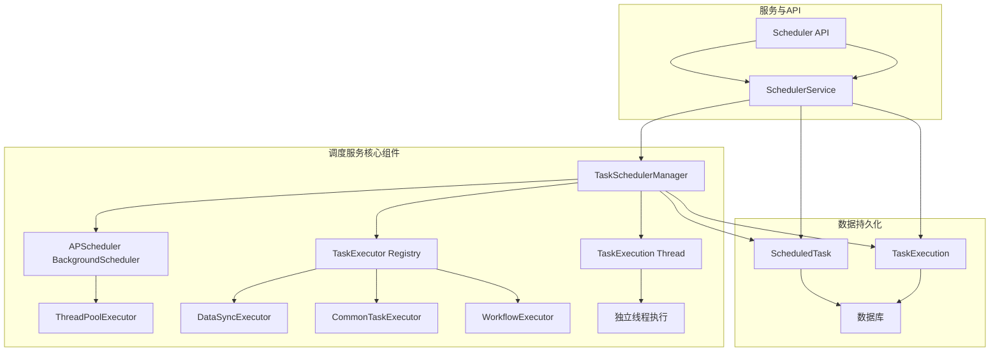
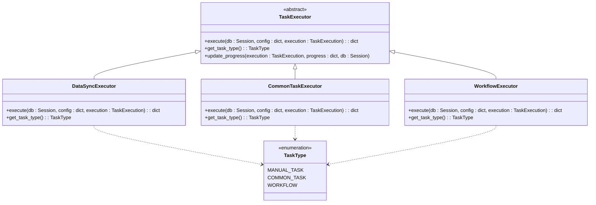
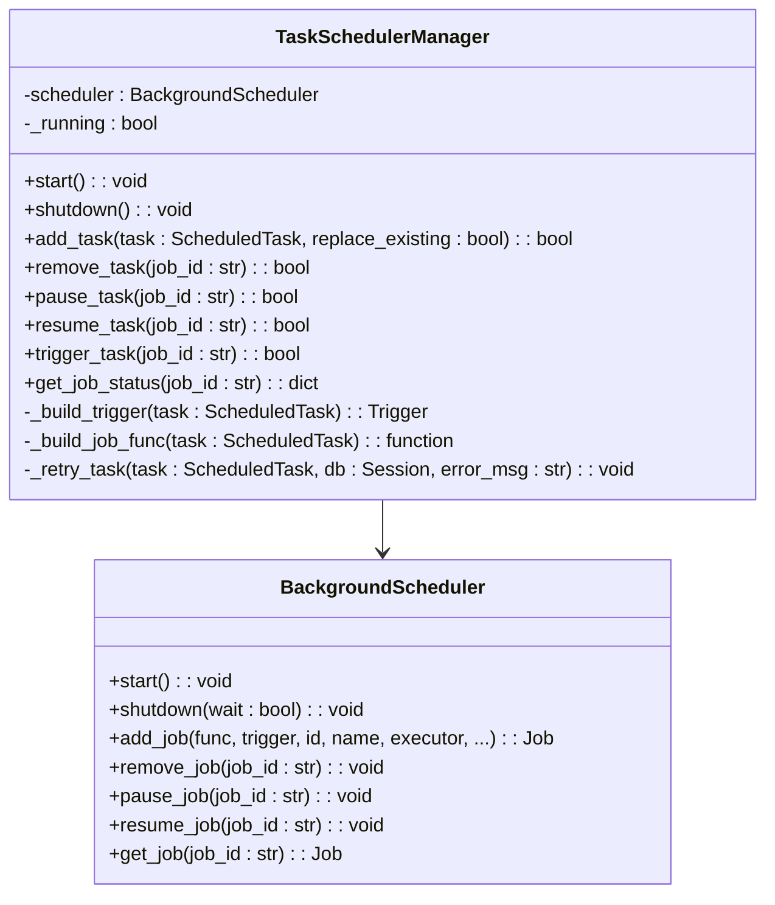
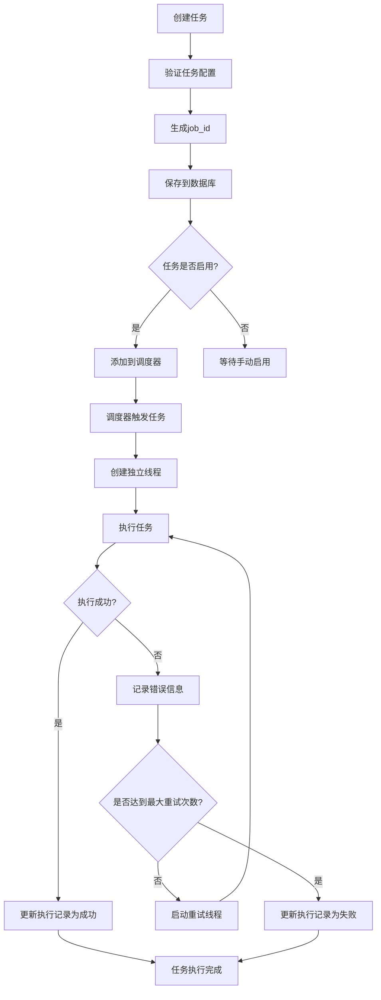
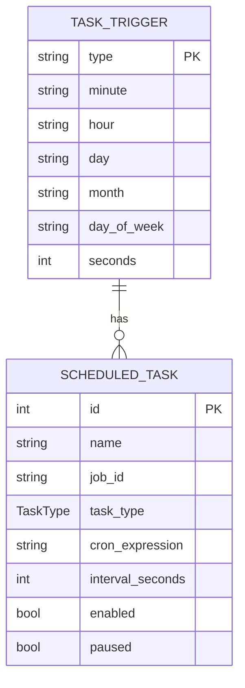
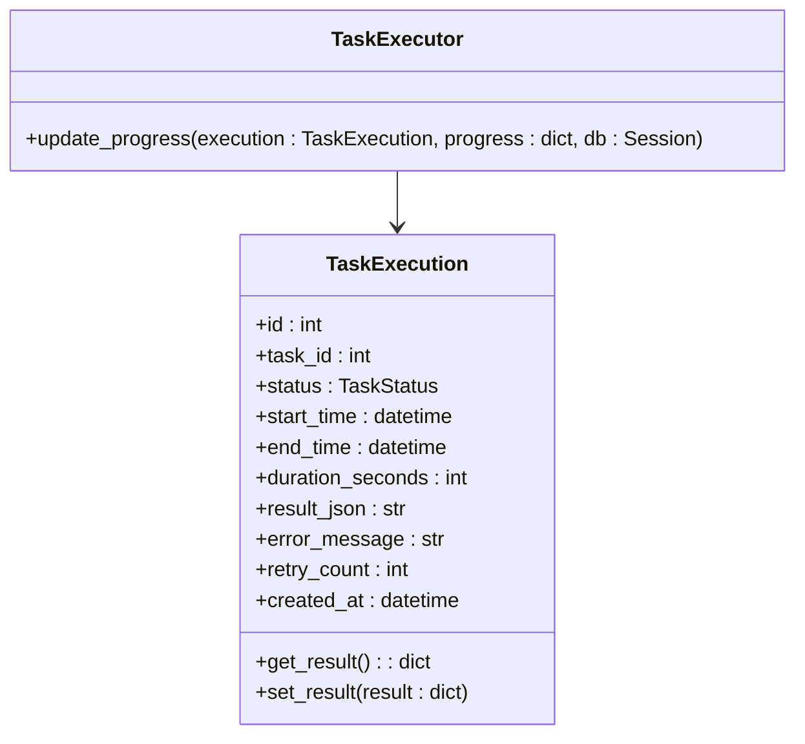
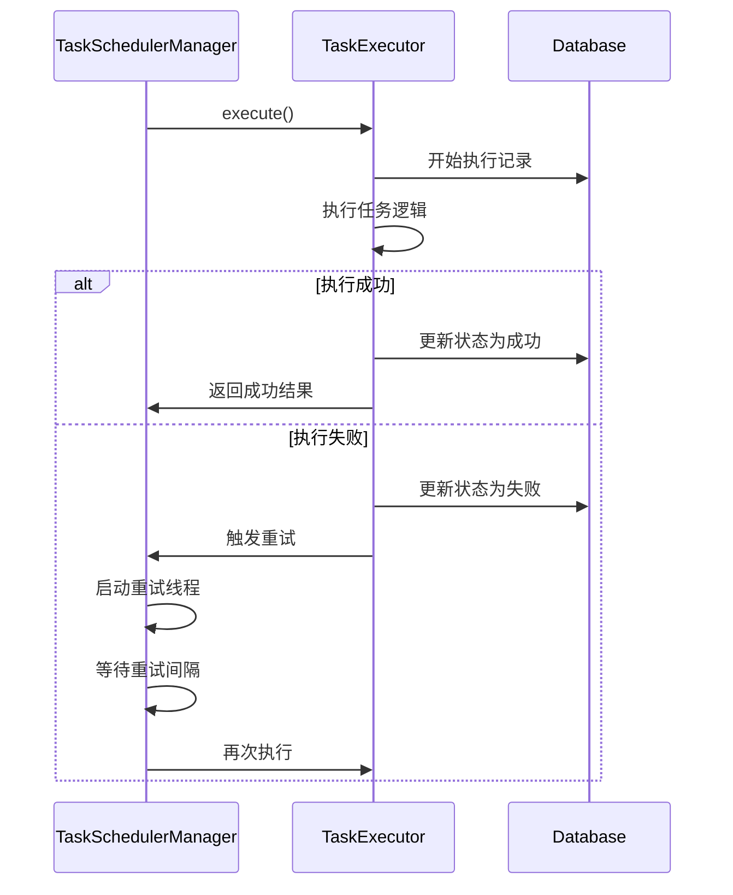
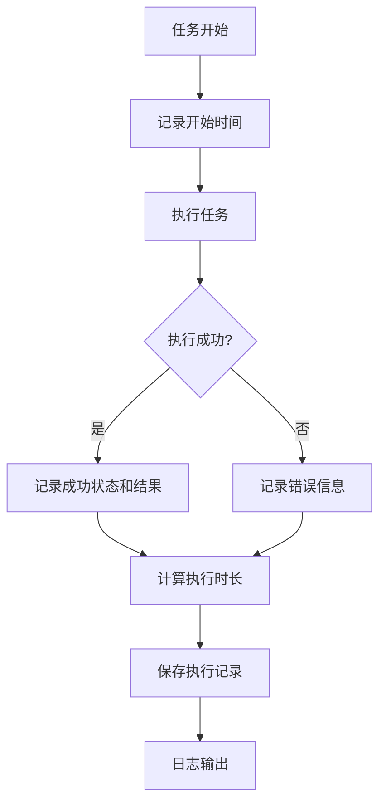
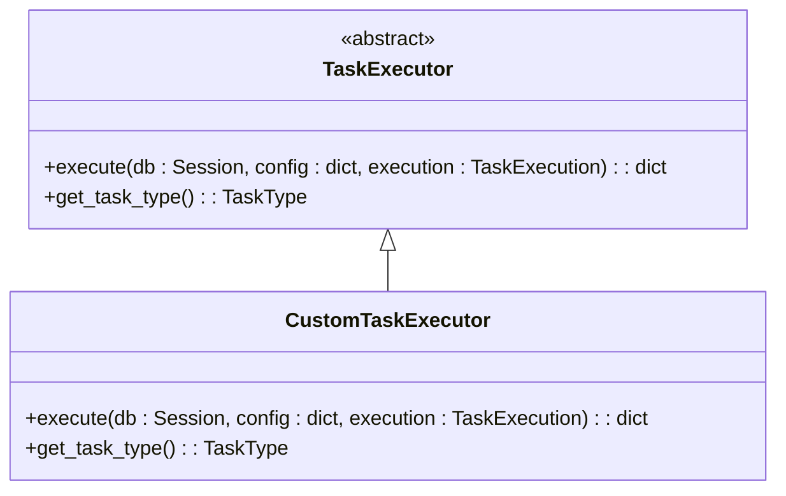
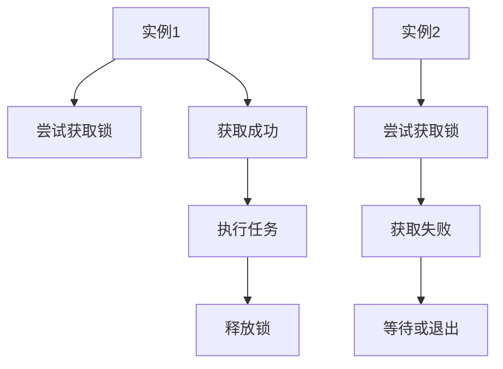

# 调度服务

<cite>
**本文档引用文件**   
- [scheduler.py](file://zquant/scheduler/manager.py)
- [base.py](file://zquant/scheduler/base.py)
- [executor.py](file://zquant/scheduler/executor.py)
- [common_executor.py](file://zquant/scheduler/executors/common_executor.py)
- [workflow_executor.py](file://zquant/scheduler/executors/workflow_executor.py)
- [scheduler.py](file://zquant/services/scheduler.py)
- [scheduler.py](file://zquant/api/v1/scheduler.py)
- [init_scheduler.py](file://zquant/scripts/init_scheduler.py)
- [DataScheduler.py](file://zquant/data/etl/scheduler.py)
- [sync_daily_basic_data.py](file://zquant/scheduler/job/sync_daily_basic_data.py)
- [example_scheduled_job.py](file://zquant/scheduler/job/example_scheduled_job.py)
</cite>

## 目录
1. [调度服务概述](#调度服务概述)
2. [核心架构与组件](#核心架构与组件)
3. [任务类型与执行器](#任务类型与执行器)
4. [任务调度管理器](#任务调度管理器)
5. [任务执行流程](#任务执行流程)
6. [任务触发器配置](#任务触发器配置)
7. [任务执行上下文与进度管理](#任务执行上下文与进度管理)
8. [任务失败重试策略](#任务失败重试策略)
9. [执行日志记录与监控](#执行日志记录与监控)
10. [自定义调度任务开发模板](#自定义调度任务开发模板)
11. [高可用部署与分布式锁](#高可用部署与分布式锁)

## 调度服务概述

调度服务是ZQuant系统的核心组件，负责管理所有定时任务的创建、执行、监控和持久化。该服务基于APScheduler库构建，提供了灵活的任务调度能力，支持Cron表达式和间隔调度等多种触发方式。调度服务不仅能够处理简单的定时任务，还支持复杂的任务编排（Workflow），允许用户定义任务间的依赖关系和执行顺序。

调度服务通过`TaskSchedulerManager`类实现，该类封装了APScheduler的`BackgroundScheduler`，确保任务在后台线程中异步执行，不会阻塞主线程。所有任务的配置和执行历史都持久化存储在数据库中，确保了系统的可靠性和可追溯性。调度服务还提供了丰富的API接口，支持任务的创建、更新、删除、手动触发、暂停、恢复等操作，方便用户通过Web界面或API进行管理。

调度服务的设计遵循模块化和可扩展的原则，通过任务执行器（Executor）模式，支持不同类型的任务。用户可以通过配置文件或数据库配置来定义任务，系统会根据任务类型自动选择合适的执行器。此外，调度服务还集成了任务失败重试机制、执行进度监控、日志记录和报警通知等功能，确保任务的稳定运行。

**Section sources**
- [scheduler.py](file://zquant/scheduler/manager.py#L1-L475)
- [scheduler.py](file://zquant/services/scheduler.py#L1-L710)
- [scheduler.py](file://zquant/api/v1/scheduler.py#L1-L341)

## 核心架构与组件

调度服务的核心架构由多个组件构成，包括任务调度管理器、任务执行器、任务模型、服务层和API层。这些组件协同工作，实现了任务的全生命周期管理。

**Diagram sources**
- [scheduler.py](file://zquant/scheduler/manager.py#L1-L475)
- [executor.py](file://zquant/scheduler/executor.py#L1-L152)
- [base.py](file://zquant/scheduler/base.py#L1-L72)
- [scheduler.py](file://zquant/services/scheduler.py#L1-L710)

**Section sources**
- [scheduler.py](file://zquant/scheduler/manager.py#L1-L475)
- [executor.py](file://zquant/scheduler/executor.py#L1-L152)
- [base.py](file://zquant/scheduler/base.py#L1-L72)
- [scheduler.py](file://zquant/services/scheduler.py#L1-L710)

## 任务类型与执行器

调度服务支持多种任务类型，每种类型由特定的执行器（Executor）处理。任务类型定义在`TaskType`枚举中，包括手动任务（MANUAL_TASK）、通用任务（COMMON_TASK）和编排任务（WORKFLOW）。

**Diagram sources**
- [base.py](file://zquant/scheduler/base.py#L1-L72)
- [executor.py](file://zquant/scheduler/executor.py#L1-L152)
- [common_executor.py](file://zquant/scheduler/executors/common_executor.py#L1-L135)
- [workflow_executor.py](file://zquant/scheduler/executors/workflow_executor.py#L1-L385)

**Section sources**
- [base.py](file://zquant/scheduler/base.py#L1-L72)
- [executor.py](file://zquant/scheduler/executor.py#L1-L152)
- [common_executor.py](file://zquant/scheduler/executors/common_executor.py#L1-L135)
- [workflow_executor.py](file://zquant/scheduler/executors/workflow_executor.py#L1-L385)

## 任务调度管理器

`TaskSchedulerManager`是调度服务的核心类，负责管理APScheduler实例和所有任务的生命周期。它提供了启动、关闭、添加、移除、暂停、恢复和手动触发任务的方法。

**Diagram sources**
- [scheduler.py](file://zquant/scheduler/manager.py#L1-L475)

**Section sources**
- [scheduler.py](file://zquant/scheduler/manager.py#L1-L475)

## 任务执行流程

任务的执行流程涉及多个步骤，从任务的创建到最终的执行结果记录。当一个任务被添加到调度器时，调度管理器会构建一个触发器和一个任务执行函数，并将其注册到APScheduler中。

**Diagram sources**
- [scheduler.py](file://zquant/scheduler/manager.py#L1-L475)
- [executor.py](file://zquant/scheduler/executor.py#L1-L152)

**Section sources**
- [scheduler.py](file://zquant/scheduler/manager.py#L1-L475)
- [executor.py](file://zquant/scheduler/executor.py#L1-L152)

## 任务触发器配置

调度服务支持两种主要的触发器：Cron表达式触发器和间隔触发器。Cron表达式触发器允许用户定义复杂的调度模式，如每天特定时间、每周几、每月几号等。间隔触发器则用于按固定时间间隔执行任务。

**Diagram sources**
- [scheduler.py](file://zquant/scheduler/manager.py#L1-L475)
- [models/scheduler.py](file://zquant/models/scheduler.py#L1-L203)

**Section sources**
- [scheduler.py](file://zquant/scheduler/manager.py#L1-L475)
- [models/scheduler.py](file://zquant/models/scheduler.py#L1-L203)

## 任务执行上下文与进度管理

调度服务提供了任务执行上下文和进度管理功能，允许任务在执行过程中更新其进度信息。执行上下文通过`TaskExecution`对象传递，该对象包含了任务的执行状态、开始时间、结束时间、执行时长和结果。

**Diagram sources**
- [models/scheduler.py](file://zquant/models/scheduler.py#L1-L203)
- [base.py](file://zquant/scheduler/base.py#L1-L72)

**Section sources**
- [models/scheduler.py](file://zquant/models/scheduler.py#L1-L203)
- [base.py](file://zquant/scheduler/base.py#L1-L72)

## 任务失败重试策略

调度服务内置了任务失败重试机制，当任务执行失败时，系统会根据配置的重试策略自动重试。重试策略包括最大重试次数和重试间隔时间，这些配置在任务创建时定义。

**Diagram sources**
- [scheduler.py](file://zquant/scheduler/manager.py#L1-L475)
- [executor.py](file://zquant/scheduler/executor.py#L1-L152)

**Section sources**
- [scheduler.py](file://zquant/scheduler/manager.py#L1-L475)
- [executor.py](file://zquant/scheduler/executor.py#L1-L152)

## 执行日志记录与监控

调度服务详细记录了每个任务的执行日志，包括执行开始、执行过程、执行结束和错误信息。日志信息通过`loguru`库输出，并持久化存储在数据库的`TaskExecution`表中。

**Diagram sources**
- [scheduler.py](file://zquant/scheduler/manager.py#L1-L475)
- [models/scheduler.py](file://zquant/models/scheduler.py#L1-L203)

**Section sources**
- [scheduler.py](file://zquant/scheduler/manager.py#L1-L475)
- [models/scheduler.py](file://zquant/models/scheduler.py#L1-L203)

## 自定义调度任务开发模板

开发自定义调度任务需要遵循特定的模板。用户可以创建新的任务执行器类，继承`TaskExecutor`基类，并实现`execute`和`get_task_type`方法。以下是一个数据同步任务的开发模板：

**Diagram sources**
- [base.py](file://zquant/scheduler/base.py#L1-L72)
- [executor.py](file://zquant/scheduler/executor.py#L1-L152)

**Section sources**
- [base.py](file://zquant/scheduler/base.py#L1-L72)
- [executor.py](file://zquant/scheduler/executor.py#L1-L152)

## 高可用部署与分布式锁

为了实现高可用部署，调度服务需要解决多个实例同时运行时的任务重复执行问题。通过使用分布式锁机制，可以确保同一时间只有一个实例执行特定任务。分布式锁可以基于Redis或数据库实现。

**Diagram sources**
- [scheduler.py](file://zquant/scheduler/manager.py#L1-L475)

**Section sources**
- [scheduler.py](file://zquant/scheduler/manager.py#L1-L475)