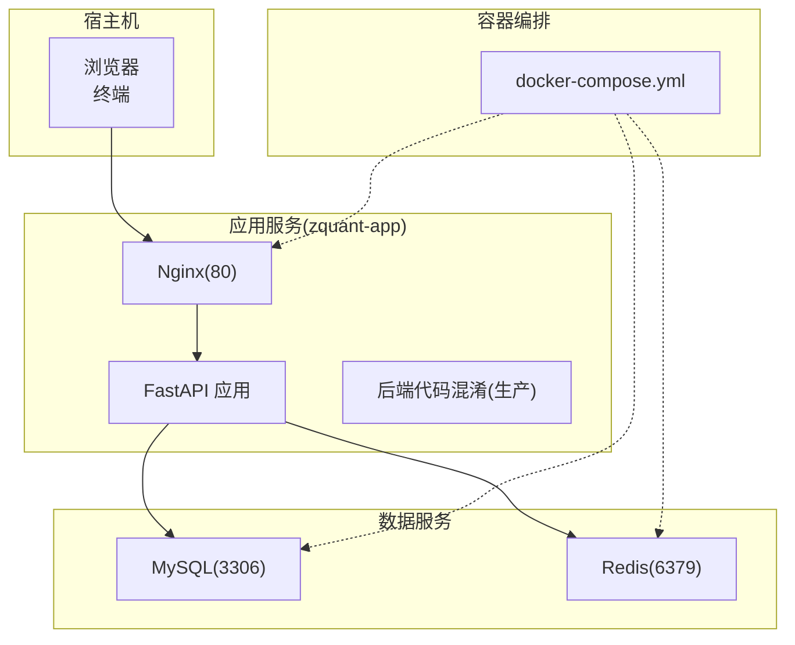
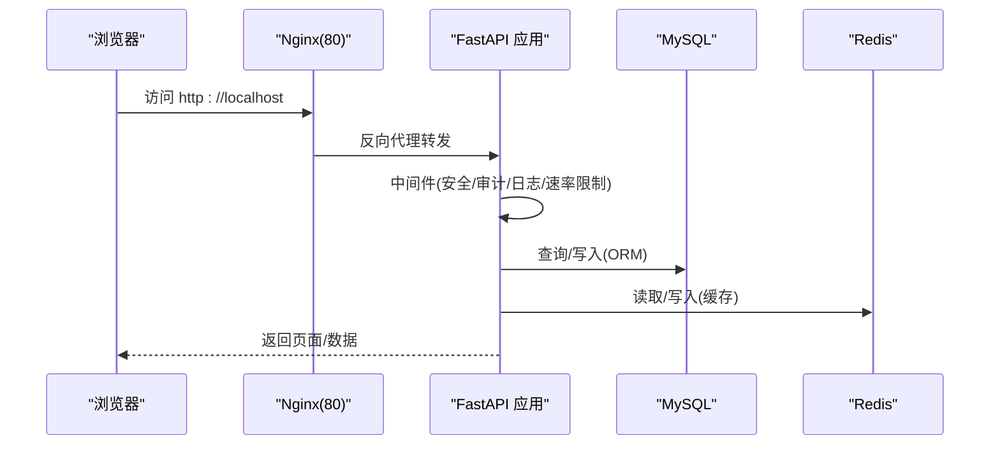
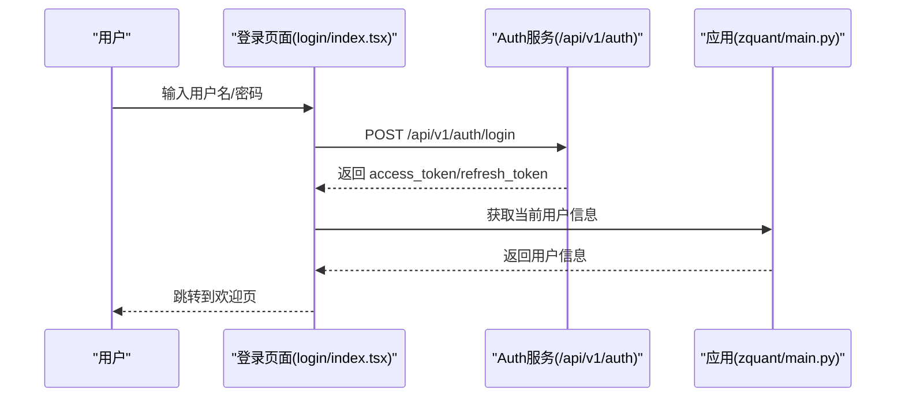
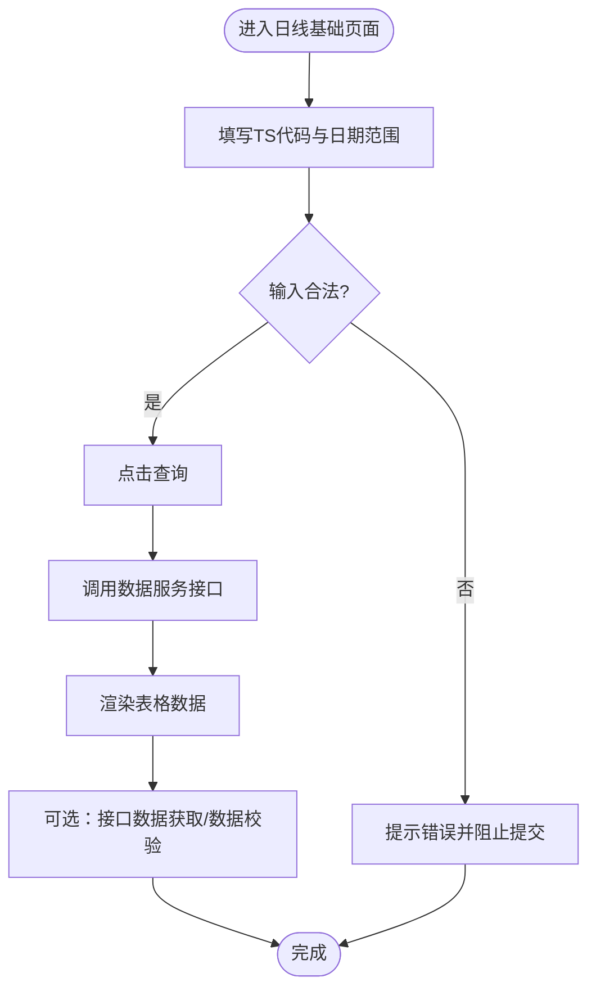
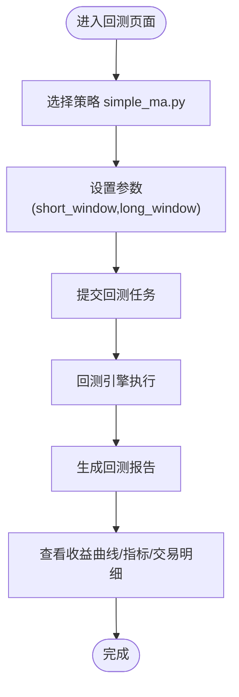
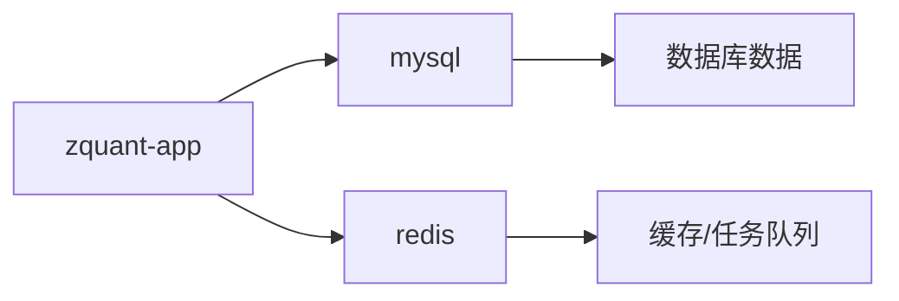

# 快速入门指南

<cite>
**本文引用的文件**
- [README.md](file://README.md)
- [docker-compose.yml](file://docker-compose.yml)
- [.env.example](file://.env.example)
- [Dockerfile](file://Dockerfile)
- [zquant/main.py](file://zquant/main.py)
- [zquant/config.py](file://zquant/config.py)
- [zquant/scripts/init_db.py](file://zquant/scripts/init_db.py)
- [zquant/strategy/examples/simple_ma.py](file://zquant/strategy/examples/simple_ma.py)
- [docs/docker_deployment.md](file://docs/docker_deployment.md)
- [web/src/pages/user/login/index.tsx](file://web/src/pages/user/login/index.tsx)
- [web/src/pages/data/daily-basic.tsx](file://web/src/pages/data/daily-basic.tsx)
- [web/src/services/zquant/auth.ts](file://web/src/services/zquant/auth.ts)
</cite>

## 目录
1. [引言](#引言)
2. [项目结构](#项目结构)
3. [核心组件](#核心组件)
4. [架构概览](#架构概览)
5. [详细组件分析](#详细组件分析)
6. [依赖关系分析](#依赖关系分析)
7. [性能考虑](#性能考虑)
8. [故障排查指南](#故障排查指南)
9. [结论](#结论)
10. [附录](#附录)

## 引言
本指南面向新手用户，帮助你在最短时间内运行 zquant 系统并完成首个操作。你将学会：
- 克隆仓库
- 配置环境变量（基于 .env.example）
- 使用 docker-compose 启动服务
- 访问 Web 界面，完成登录（默认账户或注册）
- 演示一个具体操作流程：浏览股票日线数据或运行一个示例回测策略（如 simple_ma.py）

为保证每一步都可验证，本指南提供命令行示例与截图指引，并在文末引导你查阅更深入的文档章节，如回测与因子管理。

## 项目结构
zquant 采用前后端分离架构，后端基于 FastAPI，前端基于 UmiJS/React。Docker Compose 提供一键部署，包含应用、MySQL、Redis 三个服务。

图表来源
- [docker-compose.yml](file://docker-compose.yml#L1-L114)
- [Dockerfile](file://Dockerfile#L1-L192)
- [zquant/main.py](file://zquant/main.py#L233-L247)

章节来源
- [README.md](file://README.md#L184-L217)
- [docker-compose.yml](file://docker-compose.yml#L1-L114)
- [Dockerfile](file://Dockerfile#L1-L192)

## 核心组件
- 应用入口与路由：后端 FastAPI 应用在启动时注册认证、用户、数据、回测、定时任务、配置、通知、仪表盘、自选、持仓、因子等路由，并提供健康检查接口。
- 配置管理：应用通过 Settings 类从环境变量加载数据库、Redis、JWT、日志、回测默认参数等配置。
- 初始化脚本：首次部署时运行数据库初始化、定时任务初始化、数据视图创建、策略模板导入等脚本。
- 前端登录与数据页面：提供登录表单、数据查询与校验、回测策略示例等页面。

章节来源
- [zquant/main.py](file://zquant/main.py#L217-L247)
- [zquant/config.py](file://zquant/config.py#L32-L121)
- [zquant/scripts/init_db.py](file://zquant/scripts/init_db.py#L94-L110)
- [web/src/pages/user/login/index.tsx](file://web/src/pages/user/login/index.tsx#L272-L346)
- [web/src/pages/data/daily-basic.tsx](file://web/src/pages/data/daily-basic.tsx#L40-L110)

## 架构概览
下图展示了从浏览器到后端 API 的典型请求链路，以及后端与数据库、缓存的交互。

图表来源
- [docker-compose.yml](file://docker-compose.yml#L1-L114)
- [Dockerfile](file://Dockerfile#L132-L191)
- [zquant/main.py](file://zquant/main.py#L132-L148)

## 详细组件分析

### 1) 克隆与环境准备
- 克隆仓库
  - 使用 git 克隆项目到本地
- 配置环境变量
  - 复制示例文件并编辑：docker/.env
  - 必填项：SECRET_KEY、DB_PASSWORD、TUSHARE_TOKEN
  - 可选项：ENCRYPTION_KEY（用于加密敏感配置）

章节来源
- [docs/docker_deployment.md](file://docs/docker_deployment.md#L38-L67)
- [.env.example](file://.env.example#L1-L5)

### 2) 使用 docker-compose 启动服务
- 启动所有服务
  - docker-compose up -d
- 首次部署初始化数据库
  - 方式一：在 docker/.env 中设置 INIT_DATABASE=true，重启应用容器
  - 方式二：进入容器执行初始化脚本
    - 初始化数据库表与角色权限
    - 初始化定时任务系统
    - 创建数据视图
    - 导入策略模板

章节来源
- [docs/docker_deployment.md](file://docs/docker_deployment.md#L68-L101)
- [docker-compose.yml](file://docker-compose.yml#L20-L60)
- [zquant/scripts/init_db.py](file://zquant/scripts/init_db.py#L94-L110)

### 3) 访问 Web 界面与登录
- 访问地址
  - 前端界面：http://localhost
  - API 文档：http://localhost/docs
  - 健康检查：http://localhost/health
- 登录流程
  - 前端登录页调用 /api/v1/auth/login 获取令牌
  - 成功后保存 access_token/refresh_token
  - 获取当前用户信息并跳转至欢迎页

图表来源
- [web/src/pages/user/login/index.tsx](file://web/src/pages/user/login/index.tsx#L272-L346)
- [web/src/services/zquant/auth.ts](file://web/src/services/zquant/auth.ts#L31-L39)
- [zquant/main.py](file://zquant/main.py#L233-L247)

章节来源
- [docs/docker_deployment.md](file://docs/docker_deployment.md#L97-L101)
- [web/src/pages/user/login/index.tsx](file://web/src/pages/user/login/index.tsx#L272-L346)
- [web/src/services/zquant/auth.ts](file://web/src/services/zquant/auth.ts#L31-L39)

### 4) 浏览股票日线数据
- 进入“数据”->“日线基础”页面
- 输入 TS 代码（如 000001.SZ,000002.SZ），选择日期范围
- 点击“查询”查看日线数据
- 可选：点击“接口数据获取”或“数据校验”，查看与上游接口的差异与统计

图表来源
- [web/src/pages/data/daily-basic.tsx](file://web/src/pages/data/daily-basic.tsx#L40-L110)
- [web/src/pages/data/daily-basic.tsx](file://web/src/pages/data/daily-basic.tsx#L100-L195)
- [web/src/pages/data/daily-basic.tsx](file://web/src/pages/data/daily-basic.tsx#L196-L277)

章节来源
- [web/src/pages/data/daily-basic.tsx](file://web/src/pages/data/daily-basic.tsx#L40-L110)
- [web/src/pages/data/daily-basic.tsx](file://web/src/pages/data/daily-basic.tsx#L100-L195)
- [web/src/pages/data/daily-basic.tsx](file://web/src/pages/data/daily-basic.tsx#L196-L277)

### 5) 运行示例回测策略（simple_ma.py）
- 策略说明
  - 简单均线策略：短期均线上穿长期均线时买入，下穿时卖出
  - 参数：short_window（短期窗口）、long_window（长期窗口）
- 操作步骤
  - 在“回测”页面创建新回测任务，选择策略 simple_ma.py
  - 配置参数（如 short_window=5, long_window=20）
  - 选择标的与时间范围，提交回测
  - 查看回测结果页面的收益曲线、收益指标与交易明细

图表来源
- [zquant/strategy/examples/simple_ma.py](file://zquant/strategy/examples/simple_ma.py#L12-L59)

章节来源
- [zquant/strategy/examples/simple_ma.py](file://zquant/strategy/examples/simple_ma.py#L12-L59)

### 6) 关键截图与命令行示例
- 访问健康检查
  - curl http://localhost/health
- 查看服务日志
  - docker-compose logs -f zquant-app
- 初始化数据库（可选）
  - docker-compose exec zquant-app python3 -m zquant.scripts.init_db
  - docker-compose exec zquant-app python3 -m zquant.scripts.init_scheduler
  - docker-compose exec zquant-app python3 -m zquant.scripts.init_view
  - docker-compose exec zquant-app python3 -m zquant.scripts.init_strategies

章节来源
- [docs/docker_deployment.md](file://docs/docker_deployment.md#L313-L335)
- [docs/docker_deployment.md](file://docs/docker_deployment.md#L97-L101)
- [docker-compose.yml](file://docker-compose.yml#L45-L60)

## 依赖关系分析
- 应用依赖
  - 数据库：MySQL（通过 DATABASE_URL 连接）
  - 缓存：Redis（通过 REDIS_URL 连接）
  - 认证：JWT（SECRET_KEY）
  - 数据源：Tushare（TUSHARE_TOKEN）
- 容器依赖
  - zquant-app 依赖 mysql 与 redis，且通过健康检查确保服务可用
- 启动顺序
  - 先启动 mysql（健康检查通过），再启动 redis，最后启动 zquant-app

图表来源
- [docker-compose.yml](file://docker-compose.yml#L19-L114)
- [zquant/config.py](file://zquant/config.py#L32-L121)

章节来源
- [docker-compose.yml](file://docker-compose.yml#L19-L114)
- [zquant/config.py](file://zquant/config.py#L32-L121)

## 性能考虑
- 前后端代码混淆
  - 前端：UmiJS 内置 Terser 进行混淆与压缩
  - 后端：PyArmor 8.x 进行混淆（生产镜像）
- 健康检查与自动重启
  - 应用与 Nginx 健康检查，异常自动重启
- 日志轮转与多线程安全
  - 日志按天滚动，支持多线程安全写入

章节来源
- [Dockerfile](file://Dockerfile#L1-L192)
- [docs/docker_deployment.md](file://docs/docker_deployment.md#L213-L257)
- [zquant/main.py](file://zquant/main.py#L44-L114)

## 故障排查指南
- 容器启动失败
  - 查看日志：docker-compose logs zquant-app
  - 检查端口占用与磁盘空间
- 数据库连接失败
  - 检查 mysql 服务状态与日志
  - 测试连接：docker-compose exec mysql mysql -u root -p
- Redis 连接失败
  - 检查 redis 服务状态与密码配置
  - 测试连接：docker-compose exec redis redis-cli ping
- 前端页面无法访问
  - 检查 Nginx 配置与端口映射
  - 确认前端构建产物存在

章节来源
- [docs/docker_deployment.md](file://docs/docker_deployment.md#L336-L411)

## 结论
通过本指南，你已完成 zquant 的环境准备、服务启动、登录验证，并完成了浏览日线数据与运行示例回测策略的首个操作。建议继续阅读以下文档以深入学习：
- 回测：docs/backtest_daily_basic_usage.md
- 因子管理：docs/factor_management.md
- 策略管理：docs/strategy_management.md
- 调度器：docs/scheduler_guide.md

## 附录
- 默认管理员账户
  - 用户名：admin
  - 密码：admin123（生产环境请立即修改）
- 常用命令
  - 启动：docker-compose up -d
  - 停止：docker-compose down
  - 查看状态：docker-compose ps
  - 查看日志：docker-compose logs -f zquant-app

章节来源
- [zquant/scripts/init_db.py](file://zquant/scripts/init_db.py#L257-L271)
- [docs/docker_deployment.md](file://docs/docker_deployment.md#L182-L212)