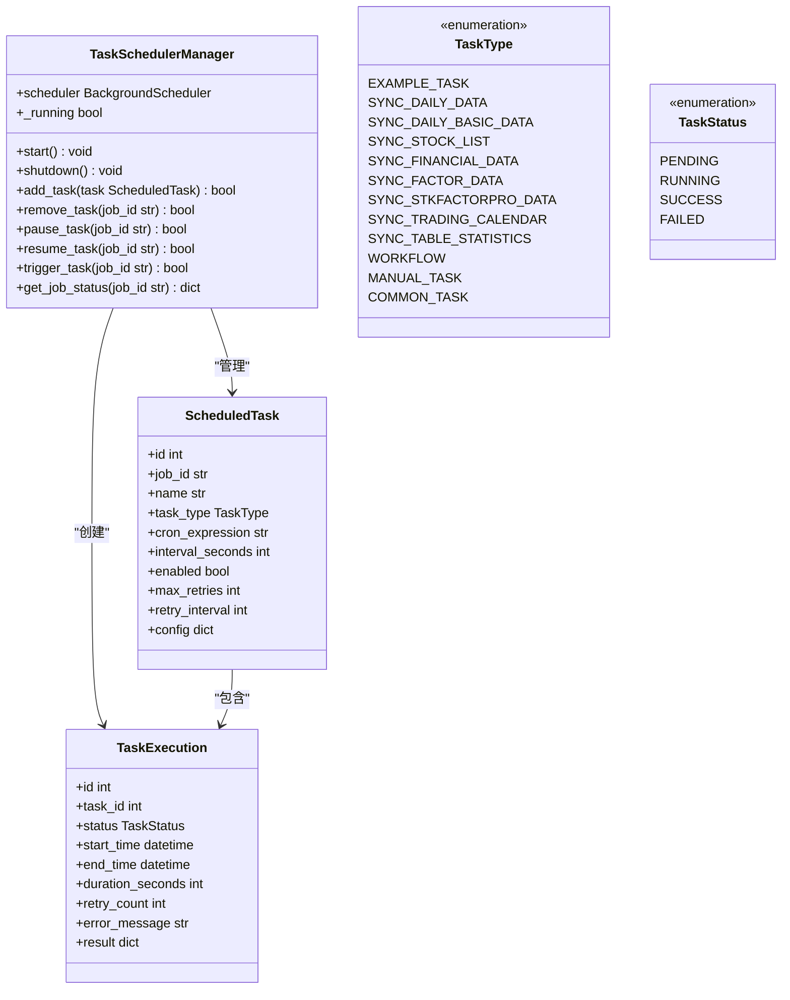
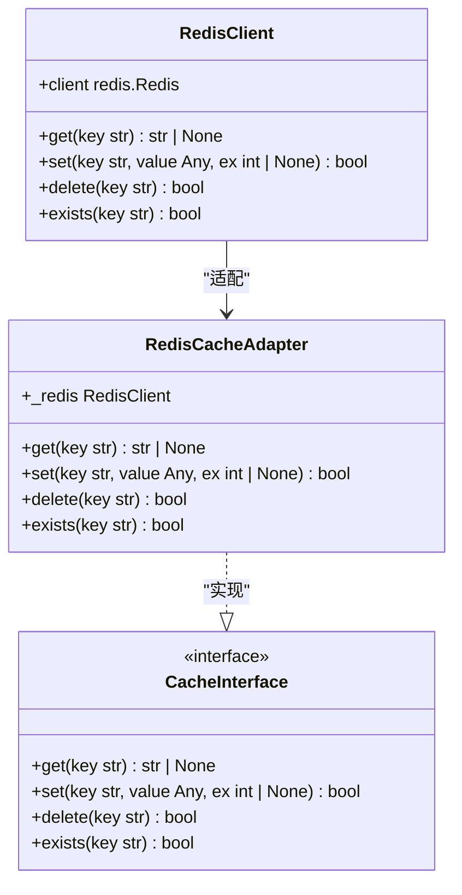

# 技术栈

<cite>
**本文档引用的文件**
- [pyproject.toml](file://zquant/pyproject.toml)
- [requirements.txt](file://zquant/requirements.txt)
- [package.json](file://web/package.json)
- [main.py](file://zquant/main.py)
- [database.py](file://zquant/database.py)
- [config.py](file://zquant/config.py)
- [redis_client.py](file://zquant/utils/redis_client.py)
- [manager.py](file://zquant/scheduler/manager.py)
- [README.md](file://README.md)
- [database_init.md](file://docs/database_init.md)
- [scheduler_guide.md](file://docs/scheduler_guide.md)
</cite>

## 目录
1. [引言](#引言)
2. [后端技术栈](#后端技术栈)
3. [前端技术栈](#前端技术栈)
4. [数据库与迁移](#数据库与迁移)
5. [外部服务集成](#外部服务集成)
6. [技术选型理由](#技术选型理由)
7. [版本兼容性与依赖管理](#版本兼容性与依赖管理)

## 引言
ZQuant项目是一个基于FastAPI的股票量化分析系统，提供数据服务、回测引擎、策略管理等功能。本项目采用现代化的技术栈，结合了高性能的后端框架、先进的前端框架和可靠的数据库技术，旨在为量化分析者提供从数据采集、策略开发、回测分析到结果管理的一站式解决方案。项目架构采用分层设计，通过Repository模式、Strategy模式等设计模式实现代码复用和解耦，确保系统的可维护性和扩展性。

## 后端技术栈

### FastAPI
FastAPI是ZQuant项目的核心后端框架，用于构建高性能API。FastAPI基于Python 3.7+的类型提示特性，提供了自动化的API文档生成、数据验证和序列化功能。在ZQuant项目中，FastAPI被用于创建RESTful API接口，处理HTTP请求和响应。通过FastAPI的依赖注入系统，项目实现了数据库会话的自动管理，确保每个请求都有独立的数据库会话。FastAPI还支持异步处理，能够高效处理大量并发请求。

**Section sources**
- [main.py](file://zquant/main.py#L23-L247)
- [README.md](file://README.md#L58-L68)

### SQLAlchemy
SQLAlchemy是Python的SQL工具包和ORM（对象关系映射）框架，用于ORM数据访问。在ZQuant项目中，SQLAlchemy被用于定义数据库模型、执行数据库查询和管理数据库会话。项目中的数据库模型定义在`zquant/models/`目录下，通过SQLAlchemy的Declarative Base系统创建。SQLAlchemy的ORM功能允许开发者使用Python类来表示数据库表，简化了数据库操作。项目还使用SQLAlchemy的查询构建器来创建复杂的数据库查询。

**Section sources**
- [database.py](file://zquant/database.py#L23-L155)
- [models/__init__.py](file://zquant/models/__init__.py#L1-L63)

### APScheduler
APScheduler（Advanced Python Scheduler）是Python的高级任务调度库，用于定时任务调度。在ZQuant项目中，APScheduler被用于实现定时任务系统，支持Cron表达式和间隔调度两种方式。调度器管理器（TaskSchedulerManager）负责启动、停止和管理定时任务。每个定时任务都有唯一的任务ID，可以手动触发、暂停或恢复。任务执行记录被存储在数据库中，便于监控和审计。

**Diagram sources**
- [manager.py](file://zquant/scheduler/manager.py#L23-L475)
- [models/scheduler.py](file://zquant/models/scheduler.py)

### Redis
Redis是高性能的内存数据库，用作缓存与中间件。在ZQuant项目中，Redis被用于缓存频繁访问的数据，减少数据库查询压力。Redis客户端封装在`zquant/utils/redis_client.py`中，提供了get、set、delete等基本操作。项目还实现了Redis缓存适配器，将RedisClient适配为统一的缓存接口。Redis的发布/订阅功能可用于实现消息队列，支持异步任务处理。

**Diagram sources**
- [redis_client.py](file://zquant/utils/redis_client.py#L23-L163)

### Pydantic
Pydantic是Python的数据验证和设置管理库，用于配置与数据验证。在ZQuant项目中，Pydantic被用于定义API请求和响应的数据模型，确保数据的类型安全和有效性。项目中的Pydantic模型定义在`zquant/schemas/`目录下，通过Pydantic的BaseModel类创建。Pydantic还用于配置管理，通过BaseSettings类从环境变量和配置文件中加载应用配置。

**Section sources**
- [config.py](file://zquant/config.py#L23-L166)
- [schemas/__init__.py](file://zquant/schemas/__init__.py)

## 前端技术栈

### React
React是用于构建用户界面的JavaScript库，是ZQuant前端的核心框架。在ZQuant项目中，React被用于创建组件化的用户界面，通过JSX语法将HTML和JavaScript结合。项目中的React组件定义在`web/src/components/`目录下，通过函数组件和Hooks实现状态管理和副作用处理。React的虚拟DOM机制确保了高效的UI更新性能。

**Section sources**
- [package.json](file://web/package.json#L38-L48)

### Ant Design
Ant Design是企业级UI设计语言和React组件库，为ZQuant提供了丰富的UI组件。在ZQuant项目中，Ant Design被用于构建一致的用户界面，包括按钮、表格、表单、导航等组件。项目通过`@ant-design/pro-components`使用高级组件，如ProTable、ProForm等，快速构建复杂的管理界面。Ant Design的响应式设计确保了在不同设备上的良好用户体验。

**Section sources**
- [package.json](file://web/package.json#L39-L44)

### UmiJS
UmiJS是可插件化的React应用框架，为ZQuant提供了应用架构和开发工具。在ZQuant项目中，UmiJS被用于管理路由、状态、构建和部署。项目通过UmiJS的约定式路由自动创建页面路由，通过插件系统集成各种开发工具。UmiJS的微前端支持允许将大型应用拆分为多个独立的子应用，提高开发效率和可维护性。

**Section sources**
- [package.json](file://web/package.json#L63)

### TypeScript
TypeScript是JavaScript的超集，为ZQuant提供了类型安全。在ZQuant项目中，TypeScript被用于定义组件的props和state类型，确保类型安全和代码可维护性。项目中的TypeScript类型定义在`web/src/types/`目录下，通过接口和类型别名创建。TypeScript的编译时类型检查帮助开发者在开发阶段发现潜在的错误，提高代码质量。

**Section sources**
- [package.json](file://web/package.json#L73)

## 数据库与迁移
ZQuant项目使用MySQL作为主要数据库，通过Alembic进行迁移管理。MySQL是可靠的关系型数据库，支持事务、索引和外键约束，确保数据的一致性和完整性。项目中的数据库表遵循严格的命名规范，所有表名都有明确的前缀，如`zq_data_*`、`zq_app_*`、`zq_backtest_*`等。Alembic是SQLAlchemy的数据库迁移工具，用于管理数据库模式的变更。项目通过Alembic的版本控制机制，确保数据库模式的演进可追溯和可回滚。

**Section sources**
- [database_init.md](file://docs/database_init.md#L1-L314)
- [alembic.ini](file://zquant/alembic.ini#L1-L45)
- [env.py](file://zquant/alembic/env.py#L1-L71)

## 外部服务集成
ZQuant项目集成了Tushare作为金融数据源。Tushare是专业的金融数据服务，提供股票、基金、期货等市场的历史和实时数据。在ZQuant项目中，Tushare API被用于获取股票基础信息、日线数据、财务数据等。项目通过Tushare Helper封装API调用，处理认证、错误和重试逻辑。Tushare Token通过环境变量配置，确保安全性。

**Section sources**
- [README.md](file://README.md#L66)
- [api/helpers/tushare_helper.py](file://zquant/api/helpers/tushare_helper.py)

## 技术选型理由
ZQuant项目的技术选型基于性能、可维护性和社区支持等因素。FastAPI提供了高性能和现代化的API开发体验，SQLAlchemy提供了强大的ORM功能和数据库抽象，APScheduler提供了灵活的任务调度能力，Redis提供了高效的缓存和消息队列支持，Pydantic提供了类型安全和数据验证。前端技术栈React、Ant Design、UmiJS和TypeScript提供了组件化、一致性和类型安全的开发体验。MySQL和Alembic提供了可靠的数据库存储和迁移管理。Tushare作为专业的金融数据源，确保了数据的准确性和完整性。

## 版本兼容性与依赖管理
ZQuant项目的依赖管理通过`pyproject.toml`、`requirements.txt`和`package.json`文件实现。后端依赖包括FastAPI 0.104.1、SQLAlchemy 2.0.23、APScheduler 3.10.4、Redis 5.0.1和Pydantic 2.7.0+。前端依赖包括React 19.1.0、Ant Design 5.25.4、UmiJS 4.3.24和TypeScript 5.6.3。开发者可以通过查看这些依赖文件获取最新的依赖列表，并使用相应的包管理工具（如pip、yarn）安装依赖。

**Section sources**
- [pyproject.toml](file://zquant/pyproject.toml#L1-L188)
- [requirements.txt](file://zquant/requirements.txt#L1-L62)
- [package.json](file://web/package.json#L1-L82)