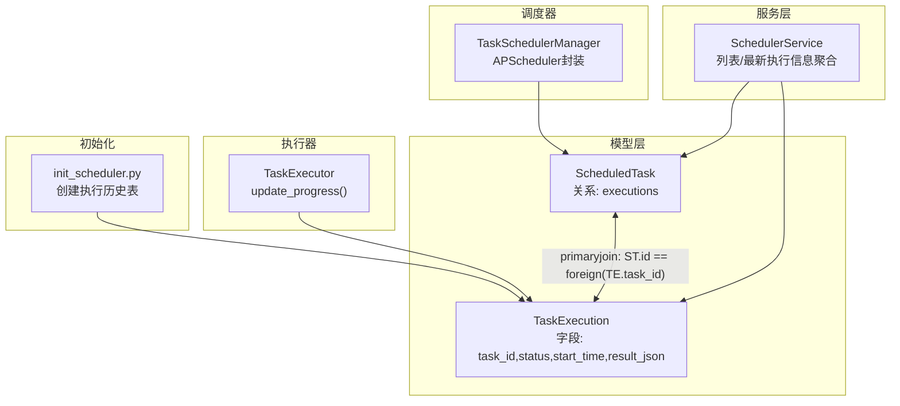
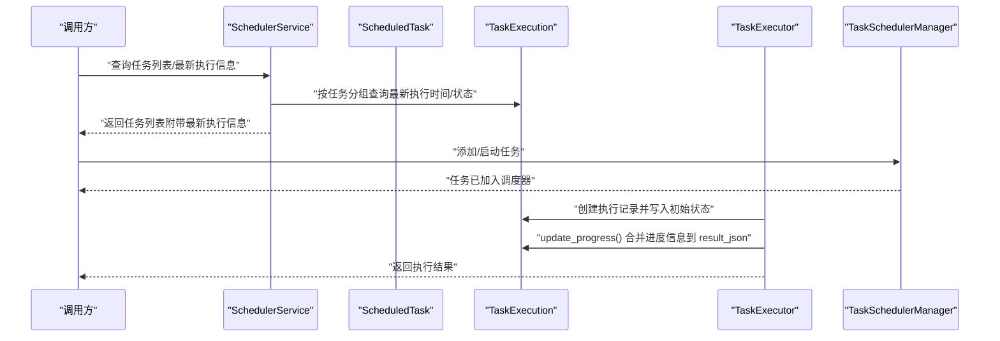
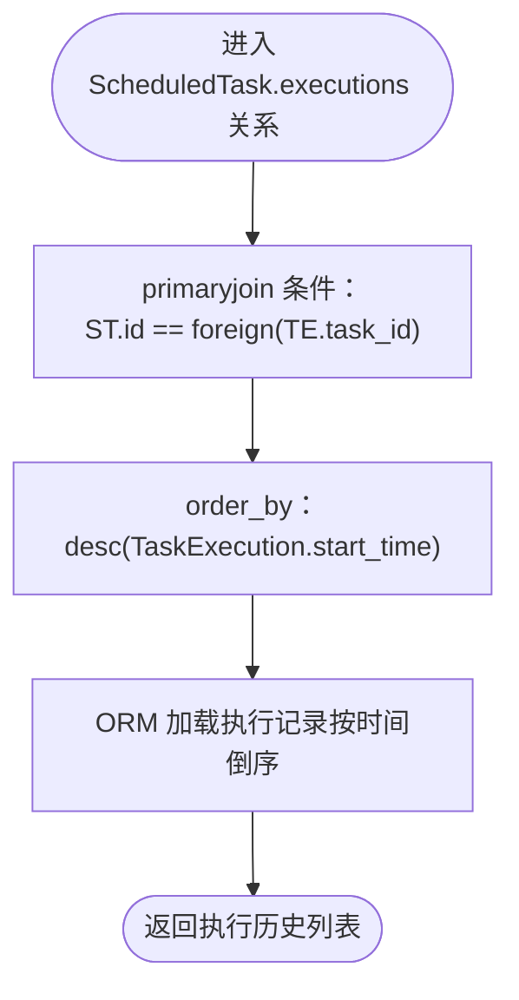
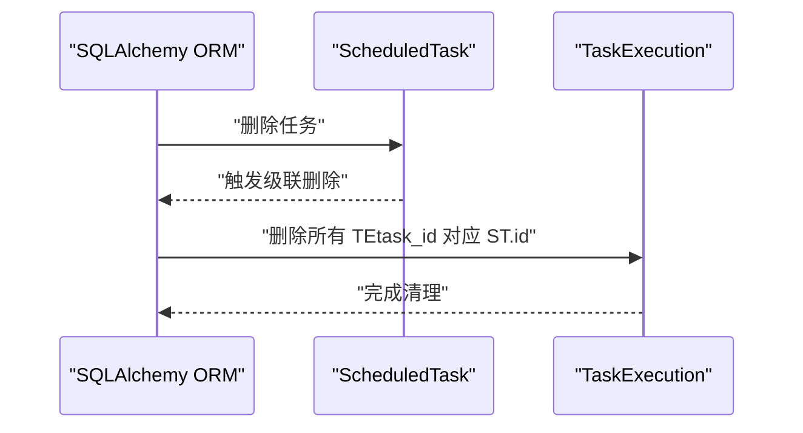
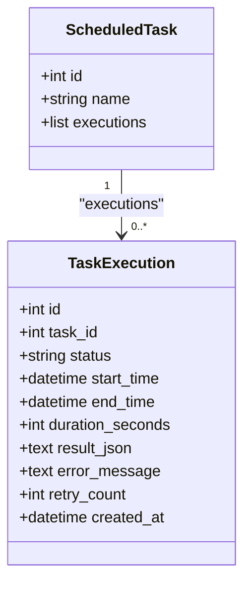
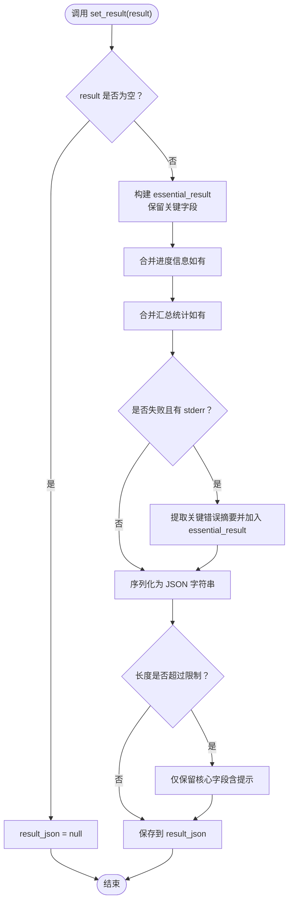
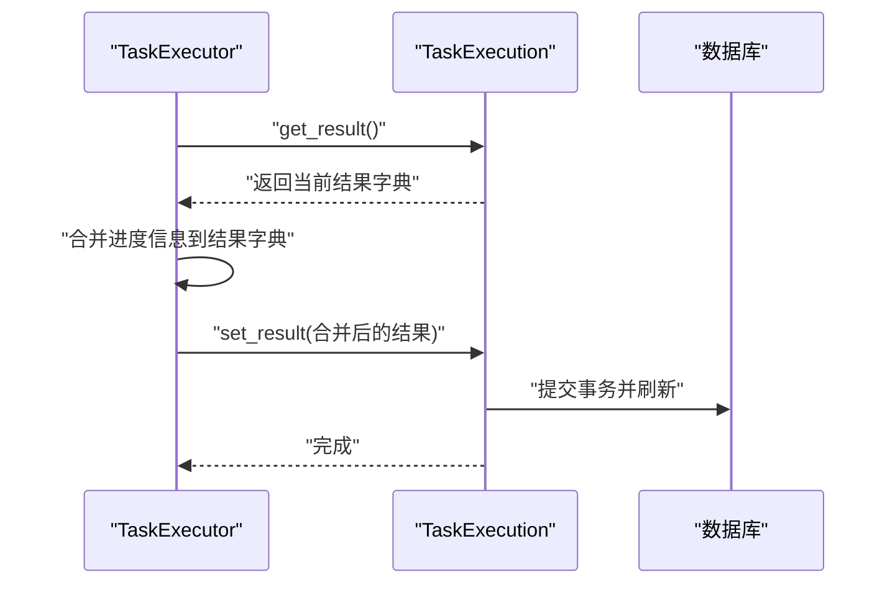
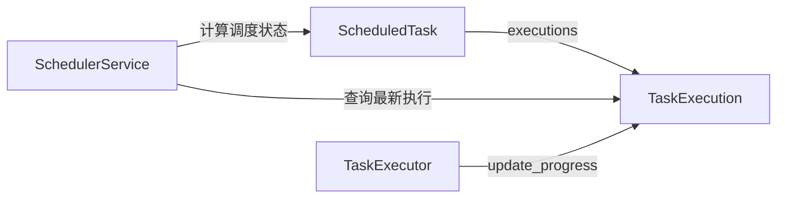

# 任务调度与执行记录关系

<cite>
**本文引用的文件**
- [zquant/models/scheduler.py](file://zquant/models/scheduler.py)
- [zquant/services/scheduler.py](file://zquant/services/scheduler.py)
- [zquant/scheduler/base.py](file://zquant/scheduler/base.py)
- [zquant/scheduler/manager.py](file://zquant/scheduler/manager.py)
- [zquant/scripts/init_scheduler.py](file://zquant/scripts/init_scheduler.py)
</cite>

## 目录
1. [引言](#引言)
2. [项目结构](#项目结构)
3. [核心组件](#核心组件)
4. [架构总览](#架构总览)
5. [详细组件分析](#详细组件分析)
6. [依赖分析](#依赖分析)
7. [性能考虑](#性能考虑)
8. [故障排查指南](#故障排查指南)
9. [结论](#结论)

## 引言
本文件围绕定时任务模型 ScheduledTask 与其执行记录 TaskExecution 之间的主外键连接机制展开，重点解释：
- ScheduledTask.executions 关系通过 primaryjoin 条件“ScheduledTask.id == foreign(TaskExecution.task_id)”建立高效关联；
- cascade='all, delete-orphan' 策略在任务删除时自动清理历史执行记录的保障机制；
- TaskExecution 表中 task_id 字段虽为逻辑外键但未强制数据库外键约束的设计考量；
- get_result()/set_result() 对执行结果 JSON 数据的精简存储策略及其在性能与调试间的平衡；
- order_by 配置确保执行历史按时间倒序排列。

## 项目结构
与本主题直接相关的代码主要分布在以下模块：
- 模型层：zquant/models/scheduler.py 定义了 ScheduledTask 与 TaskExecution 的 ORM 映射及关系；
- 服务层：zquant/services/scheduler.py 提供任务列表与最新执行信息的聚合查询；
- 执行器基类：zquant/scheduler/base.py 提供进度更新与结果合并能力；
- 调度器：zquant/scheduler/manager.py 管理任务调度与生命周期；
- 初始化脚本：zquant/scripts/init_scheduler.py 定义执行历史表结构与索引。

图表来源
- [zquant/models/scheduler.py](file://zquant/models/scheduler.py#L68-L127)
- [zquant/services/scheduler.py](file://zquant/services/scheduler.py#L144-L239)
- [zquant/scheduler/base.py](file://zquant/scheduler/base.py#L56-L71)
- [zquant/scheduler/manager.py](file://zquant/scheduler/manager.py#L93-L139)
- [zquant/scripts/init_scheduler.py](file://zquant/scripts/init_scheduler.py#L95-L114)

章节来源
- [zquant/models/scheduler.py](file://zquant/models/scheduler.py#L68-L127)
- [zquant/services/scheduler.py](file://zquant/services/scheduler.py#L144-L239)
- [zquant/scheduler/base.py](file://zquant/scheduler/base.py#L56-L71)
- [zquant/scheduler/manager.py](file://zquant/scheduler/manager.py#L93-L139)
- [zquant/scripts/init_scheduler.py](file://zquant/scripts/init_scheduler.py#L95-L114)

## 核心组件
- ScheduledTask：定时任务配置表，包含任务元信息与 executions 关系；
- TaskExecution：任务执行历史表，记录每次执行的状态、时间、结果等；
- SchedulerService：提供任务列表查询与最新执行时间/状态的批量聚合；
- TaskExecutor.update_progress：在执行过程中合并进度信息到执行结果；
- TaskSchedulerManager：负责将任务加入调度器并管理其生命周期；
- init_scheduler.py：初始化执行历史表结构与索引。

章节来源
- [zquant/models/scheduler.py](file://zquant/models/scheduler.py#L68-L127)
- [zquant/services/scheduler.py](file://zquant/services/scheduler.py#L144-L239)
- [zquant/scheduler/base.py](file://zquant/scheduler/base.py#L56-L71)
- [zquant/scheduler/manager.py](file://zquant/scheduler/manager.py#L93-L139)
- [zquant/scripts/init_scheduler.py](file://zquant/scripts/init_scheduler.py#L95-L114)

## 架构总览
下图展示 ScheduledTask 与 TaskExecution 的关系、服务层聚合以及执行器对结果的更新流程。

图表来源
- [zquant/services/scheduler.py](file://zquant/services/scheduler.py#L144-L239)
- [zquant/scheduler/base.py](file://zquant/scheduler/base.py#L56-L71)
- [zquant/scheduler/manager.py](file://zquant/scheduler/manager.py#L93-L139)
- [zquant/models/scheduler.py](file://zquant/models/scheduler.py#L68-L127)

## 详细组件分析

### 关系与连接机制：primaryjoin 与 order_by
- 主外键连接条件
  - ScheduledTask.executions 的 primaryjoin 设定为“ScheduledTask.id == foreign(TaskExecution.task_id)”，该条件将 ScheduledTask 的主键与 TaskExecution 的 task_id 字段进行关联，形成逻辑外键关系。
  - 这种写法允许在不建立数据库外键约束的前提下，通过 ORM 层实现强关联，同时避免因外键约束导致的任务删除时的级联限制。
- 执行历史排序
  - executions 关系通过 order_by="desc(TaskExecution.start_time)" 确保按开始时间倒序排列，便于前端展示最新执行记录。
- 服务层聚合
  - SchedulerService.list_tasks 在返回任务列表时，会批量查询每个任务的最新执行时间与状态，使用子查询定位每个任务的最新执行记录，从而减少 N+1 查询风险。

图表来源
- [zquant/models/scheduler.py](file://zquant/models/scheduler.py#L88-L95)
- [zquant/services/scheduler.py](file://zquant/services/scheduler.py#L199-L239)

章节来源
- [zquant/models/scheduler.py](file://zquant/models/scheduler.py#L88-L95)
- [zquant/services/scheduler.py](file://zquant/services/scheduler.py#L199-L239)

### cascade='all, delete-orphan' 自动清理机制
- 当删除 ScheduledTask 时，其 executions 关系上的 cascade='all, delete-orphan' 会自动删除所有对应的 TaskExecution 记录，保证历史执行数据与任务实体的一致性。
- 这一策略避免了业务层遗漏清理执行记录的风险，降低数据冗余与维护成本。

图表来源
- [zquant/models/scheduler.py](file://zquant/models/scheduler.py#L88-L95)

章节来源
- [zquant/models/scheduler.py](file://zquant/models/scheduler.py#L88-L95)

### TaskExecution.task_id 的逻辑外键设计考量
- 字段定义
  - TaskExecution.task_id 为 Integer 类型，nullable=False 并建立索引；注释明确指出“不使用外键约束，避免删除任务时的级联问题”。
- 设计动机
  - 通过逻辑外键而非数据库外键，可在删除任务时不触发数据库级联删除，从而避免意外清理执行记录；
  - 同时保留索引以提升查询效率，兼顾性能与灵活性。

图表来源
- [zquant/models/scheduler.py](file://zquant/models/scheduler.py#L68-L127)

章节来源
- [zquant/models/scheduler.py](file://zquant/models/scheduler.py#L108-L123)

### 执行结果 JSON 的精简存储策略：get_result() 与 set_result()
- get_result()
  - 若 result_json 存在，则解析为字典；否则返回空字典，便于前端与服务层统一处理。
- set_result()
  - 仅保留有价值的信息，包括：
    - 执行状态与关键信息：success、exit_code、message、command、work_dir、duration_seconds；
    - 进度信息：progress_percent、current_step、total_steps；
    - 汇总统计信息：如 total、success_count、failed_count、insert_count、update_count、delete_count 等；
  - 不保存 stdout/stderr，避免冗余与体积膨胀；
  - 若执行失败且存在 stderr，仅提取关键错误摘要（前若干字符），并追加到结果中；
  - 对超长结果进行二次裁剪，确保不超过数据库限制，避免存储溢出。

图表来源
- [zquant/models/scheduler.py](file://zquant/models/scheduler.py#L129-L203)

章节来源
- [zquant/models/scheduler.py](file://zquant/models/scheduler.py#L129-L203)

### 执行器进度更新与结果合并
- TaskExecutor.update_progress()
  - 从执行记录中读取当前 result_json 解析为字典；
  - 将传入的进度信息合并到现有结果中；
  - 调用执行记录的 set_result() 进行持久化；
  - 提交事务并刷新执行记录，确保后续读取可见最新结果。

图表来源
- [zquant/scheduler/base.py](file://zquant/scheduler/base.py#L56-L71)
- [zquant/models/scheduler.py](file://zquant/models/scheduler.py#L129-L203)

章节来源
- [zquant/scheduler/base.py](file://zquant/scheduler/base.py#L56-L71)
- [zquant/models/scheduler.py](file://zquant/models/scheduler.py#L129-L203)

### 执行历史表结构与索引
- 表结构
  - zq_task_task_executions：包含 id、task_id、status、start_time、end_time、duration_seconds、result_json、error_message、retry_count、created_at 等字段；
  - 在初始化脚本中创建了索引：idx_task_id、idx_status、idx_start_time，以支持高频查询场景。
- 设计意义
  - 索引覆盖常见过滤与排序字段，有助于提升服务层批量查询最新执行时间/状态的性能。

章节来源
- [zquant/scripts/init_scheduler.py](file://zquant/scripts/init_scheduler.py#L95-L114)
- [zquant/models/scheduler.py](file://zquant/models/scheduler.py#L108-L123)

## 依赖分析
- 模型层依赖
  - ScheduledTask 与 TaskExecution 通过 primaryjoin 建立一对一/多对一关系；
  - TaskExecution 的 task_id 作为逻辑外键，不强制数据库外键约束；
  - executions 关系配置 cascade='all, delete-orphan' 与 order_by="desc(start_time)"。
- 服务层依赖
  - SchedulerService.list_tasks 使用子查询聚合每个任务的最新执行时间与状态，避免 N+1 查询；
  - 通过 include_status 参数可附加调度状态，便于前端展示。
- 执行器依赖
  - TaskExecutor.update_progress 依赖 TaskExecution.get_result()/set_result() 实现进度与结果的增量更新。

图表来源
- [zquant/models/scheduler.py](file://zquant/models/scheduler.py#L68-L127)
- [zquant/services/scheduler.py](file://zquant/services/scheduler.py#L144-L239)
- [zquant/scheduler/base.py](file://zquant/scheduler/base.py#L56-L71)

章节来源
- [zquant/models/scheduler.py](file://zquant/models/scheduler.py#L68-L127)
- [zquant/services/scheduler.py](file://zquant/services/scheduler.py#L144-L239)
- [zquant/scheduler/base.py](file://zquant/scheduler/base.py#L56-L71)

## 性能考虑
- 索引优化
  - 执行历史表为 task_id、status、start_time 建立索引，有利于服务层批量查询最新执行时间/状态与按状态过滤；
- 关系与查询
  - executions 关系的 order_by=desc(start_time) 使前端默认展示最新执行记录，减少客户端排序开销；
  - SchedulerService.list_tasks 使用子查询定位每个任务的最新执行记录，避免 N+1 查询；
- 结果存储
  - set_result() 对结果进行精简与裁剪，控制 JSON 体积，避免大字段影响写入与读取性能；
- 调度并发
  - TaskSchedulerManager 使用线程池异步执行任务，避免阻塞主线程，提高整体吞吐。

章节来源
- [zquant/scripts/init_scheduler.py](file://zquant/scripts/init_scheduler.py#L95-L114)
- [zquant/services/scheduler.py](file://zquant/services/scheduler.py#L199-L239)
- [zquant/models/scheduler.py](file://zquant/models/scheduler.py#L129-L203)
- [zquant/scheduler/manager.py](file://zquant/scheduler/manager.py#L93-L139)

## 故障排查指南
- 执行历史缺失
  - 检查 ScheduledTask.executions 关系是否正确加载，确认 primaryjoin 条件与 order_by 配置；
  - 确认 TaskExecution.task_id 与 ScheduledTask.id 是否一致，避免逻辑外键不匹配。
- 删除任务后历史记录未清理
  - 检查 executions 关系的 cascade='all, delete-orphan' 是否生效；
  - 确认 ORM 删除任务时是否触发级联删除。
- 结果过大或存储异常
  - set_result() 会对超长结果进行裁剪，若仍异常，检查数据库字段长度限制与序列化策略；
  - 前端展示时注意对 result_json 的解析与截断处理。
- 查询性能问题
  - 确认执行历史表索引是否生效；
  - 服务层聚合查询是否使用子查询定位最新执行记录，避免 N+1。

章节来源
- [zquant/models/scheduler.py](file://zquant/models/scheduler.py#L88-L95)
- [zquant/models/scheduler.py](file://zquant/models/scheduler.py#L129-L203)
- [zquant/services/scheduler.py](file://zquant/services/scheduler.py#L199-L239)
- [zquant/scripts/init_scheduler.py](file://zquant/scripts/init_scheduler.py#L95-L114)

## 结论
- ScheduledTask 与 TaskExecution 通过 primaryjoin 条件“ST.id == foreign(TE.task_id)”建立高效关联，既满足业务需求又避免数据库外键级联限制；
- cascade='all, delete-orphan' 确保任务删除时自动清理历史执行记录，保障数据一致性；
- TaskExecution.task_id 采用逻辑外键并在初始化脚本中创建必要索引，兼顾性能与灵活性；
- get_result()/set_result() 对执行结果进行精简存储，在性能与调试之间取得平衡；
- order_by="desc(start_time)" 使执行历史默认按时间倒序排列，便于前端展示最新记录。