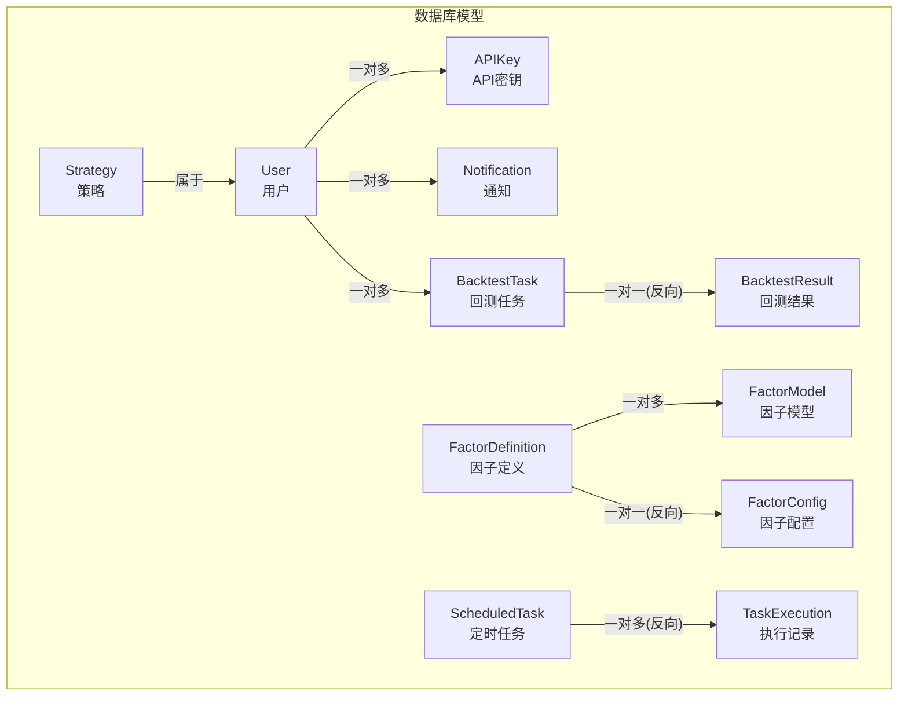
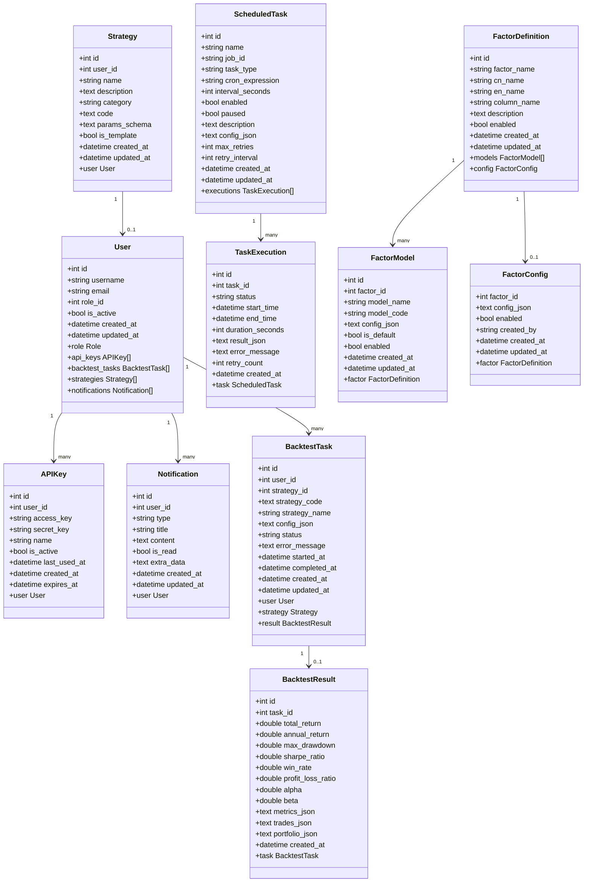
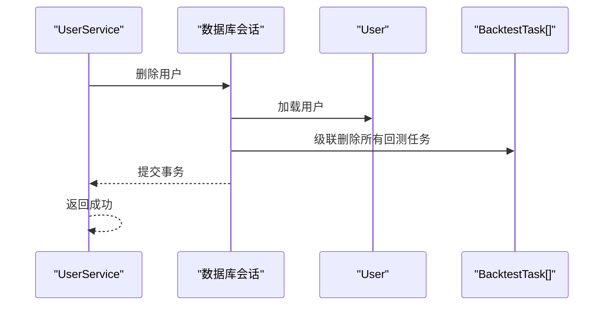
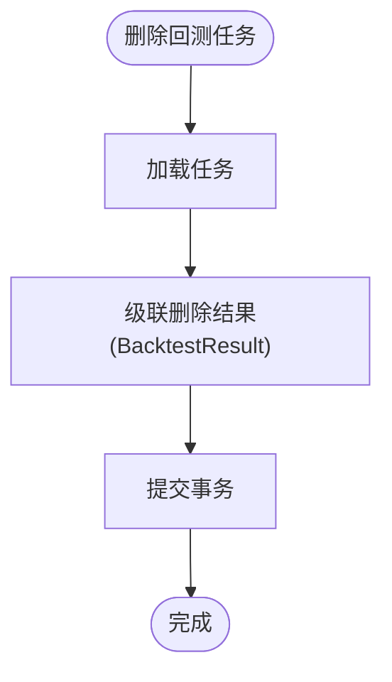
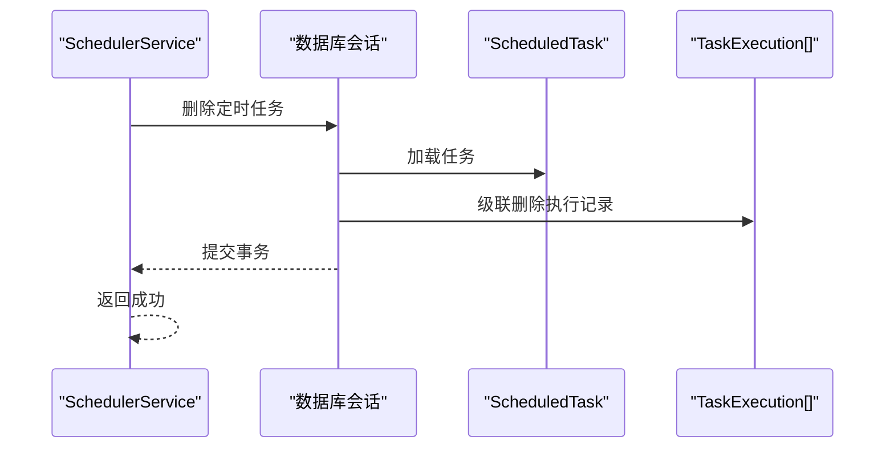
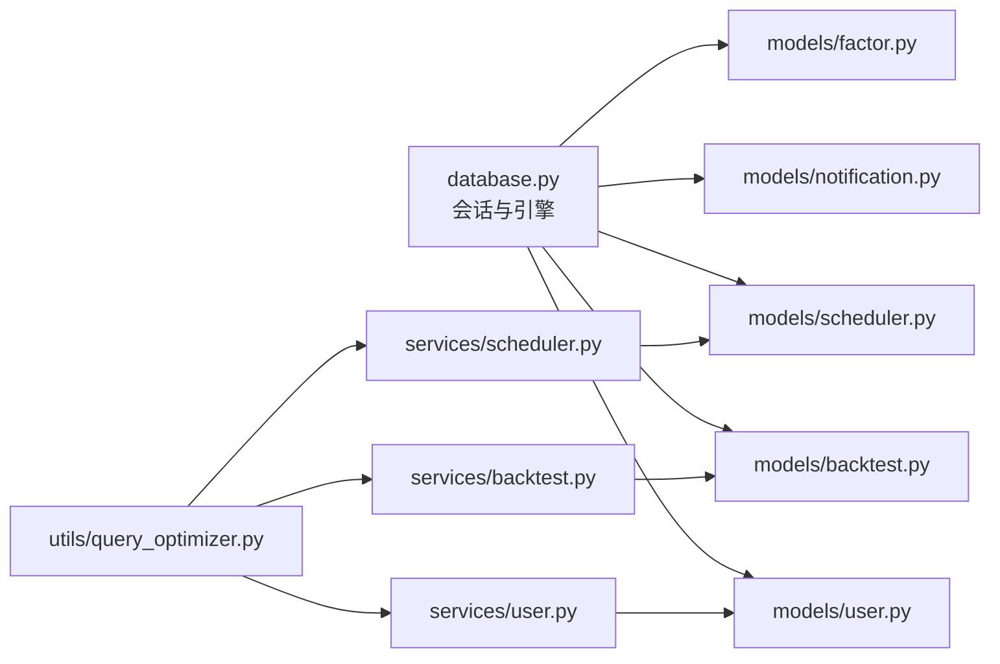

# 关系与约束

<cite>
**本文引用的文件**
- [database.py](file://zquant/database.py)
- [user.py](file://zquant/models/user.py)
- [backtest.py](file://zquant/models/backtest.py)
- [notification.py](file://zquant/models/notification.py)
- [scheduler.py](file://zquant/models/scheduler.py)
- [factor.py](file://zquant/models/factor.py)
- [user_service.py](file://zquant/services/user.py)
- [backtest_service.py](file://zquant/services/backtest.py)
- [scheduler_service.py](file://zquant/services/scheduler.py)
- [query_optimizer.py](file://zquant/utils/query_optimizer.py)
</cite>

## 目录
1. [简介](#简介)
2. [项目结构](#项目结构)
3. [核心组件](#核心组件)
4. [架构总览](#架构总览)
5. [详细组件分析](#详细组件分析)
6. [依赖分析](#依赖分析)
7. [性能考量](#性能考量)
8. [故障排查指南](#故障排查指南)
9. [结论](#结论)

## 简介
本文件聚焦于zquant数据库中各实体之间的关联关系与完整性约束，围绕以下主题展开：
- 用户(User)与回测任务(BacktestTask)之间的一对多级联删除关系
- 用户与API密钥(APIKey)、通知(Notification)的关系
- 回测任务与其结果(BacktestResult)的主外键连接与级联策略
- 因子定义(FactorDefinition)、模型(FactorModel)、配置(FactorConfig)之间的层级关联
- 定时任务(ScheduledTask)与其执行记录(TaskExecution)的主外键连接方式
- ForeignKey约束、relationship配置中的cascade策略（如“all, delete-orphan”）和primaryjoin条件的作用
- ORM层面的数据一致性与业务逻辑实现

## 项目结构
数据库模型集中在zquant/models目录下，采用SQLAlchemy声明式基类定义，配合服务层实现业务逻辑与数据一致性控制。数据库连接与会话管理由zquant/database.py统一提供。



图表来源
- [user.py](file://zquant/models/user.py#L74-L113)
- [backtest.py](file://zquant/models/backtest.py#L48-L119)
- [notification.py](file://zquant/models/notification.py#L47-L70)
- [scheduler.py](file://zquant/models/scheduler.py#L68-L135)
- [factor.py](file://zquant/models/factor.py#L35-L171)

章节来源
- [database.py](file://zquant/database.py#L39-L82)

## 核心组件
- 用户(User)：拥有角色、API密钥、回测任务、策略、通知等一对多关系，使用“all, delete-orphan”级联策略保证子对象随父对象删除而自动清理。
- 回测任务(BacktestTask)：与用户、策略、结果建立关系，结果使用“unique”外键与“all, delete-orphan”级联策略，形成任务-结果的一对一关系。
- 通知(Notification)：与用户建立一对多关系，便于按用户维度查询与管理。
- 定时任务(ScheduledTask)：与执行记录(TaskExecution)建立一对多关系，使用primaryjoin显式声明主外键连接，避免外键约束带来的复杂级联。
- 因子定义(FactorDefinition)：与模型(FactorModel)、配置(FactorConfig)建立层级关系，均使用“all, delete-orphan”保持父子一致性。

章节来源
- [user.py](file://zquant/models/user.py#L74-L113)
- [backtest.py](file://zquant/models/backtest.py#L48-L119)
- [notification.py](file://zquant/models/notification.py#L47-L70)
- [scheduler.py](file://zquant/models/scheduler.py#L68-L135)
- [factor.py](file://zquant/models/factor.py#L35-L171)

## 架构总览
下图展示实体间的主要关系与级联策略，帮助理解ORM层面的数据一致性与业务约束。



图表来源
- [user.py](file://zquant/models/user.py#L74-L113)
- [backtest.py](file://zquant/models/backtest.py#L48-L119)
- [notification.py](file://zquant/models/notification.py#L47-L70)
- [scheduler.py](file://zquant/models/scheduler.py#L68-L135)
- [factor.py](file://zquant/models/factor.py#L35-L171)

## 详细组件分析

### 用户(User)与回测任务(BacktestTask)的一对多级联删除
- 外键约束：BacktestTask.user_id 引用 zq_app_users.id。
- 级联策略：User.backtest_tasks 使用“all, delete-orphan”，删除用户时会级联删除其所有回测任务。
- 业务意义：保障用户注销或删除账户时，相关回测任务数据完整清理，避免悬挂数据。



图表来源
- [user_service.py](file://zquant/services/user.py#L209-L222)
- [user.py](file://zquant/models/user.py#L88-L94)
- [backtest.py](file://zquant/models/backtest.py#L54-L69)

章节来源
- [user.py](file://zquant/models/user.py#L88-L94)
- [backtest.py](file://zquant/models/backtest.py#L54-L69)
- [user_service.py](file://zquant/services/user.py#L209-L222)

### 用户(User)与API密钥(APIKey)、通知(Notification)的关系
- API密钥：User.api_keys 使用“all, delete-orphan”，删除用户时自动删除其API密钥。
- 通知：User.notifications 使用“all, delete-orphan”，删除用户时自动删除其通知。
- 业务意义：确保用户生命周期内产生的凭据与消息随用户一并清理，避免残留。

章节来源
- [user.py](file://zquant/models/user.py#L88-L94)
- [notification.py](file://zquant/models/notification.py#L62-L64)

### 回测任务(BacktestTask)与其结果(BacktestResult)的主外键连接与级联策略
- 外键约束：BacktestResult.task_id 引用 zq_backtest_tasks.id，且为唯一索引，形成一对一关系。
- 级联策略：BacktestTask.result 使用“all, delete-orphan”，删除任务时会级联删除结果。
- 业务意义：回测任务与其结果强绑定，删除任务即删除结果，避免孤立结果。



图表来源
- [backtest.py](file://zquant/models/backtest.py#L92-L119)
- [backtest_service.py](file://zquant/services/backtest.py#L260-L278)

章节来源
- [backtest.py](file://zquant/models/backtest.py#L92-L119)
- [backtest_service.py](file://zquant/services/backtest.py#L260-L278)

### 因子定义(FactorDefinition)、模型(FactorModel)、配置(FactorConfig)的层级关联
- 层级关系：
  - FactorDefinition 与 FactorModel：一对多，FactorModel.factor_id 引用 zq_quant_factor_definitions.id。
  - FactorDefinition 与 FactorConfig：一对一，FactorConfig.factor_id 作为主键，引用 zq_quant_factor_definitions.id。
- 级联策略：两者均使用“all, delete-orphan”，删除因子定义时自动删除其模型与配置。
- 业务意义：因子定义变更时，模型与配置随之一并清理或重建，保持数据一致性。

```mermaid
erDiagram
FACTOR_DEFINITION {
int id PK
string factor_name UK
string cn_name
string en_name
string column_name
text description
bool enabled
datetime created_at
datetime updated_at
}
FACTOR_MODEL {
int id PK
int factor_id FK
string model_name
string model_code
text config_json
bool is_default
bool enabled
datetime created_at
datetime updated_at
}
FACTOR_CONFIG {
int factor_id PK FK
text config_json
bool enabled
string created_by
datetime created_at
datetime updated_at
}
FACTOR_DEFINITION ||--o{ FACTOR_MODEL : "一对多"
FACTOR_DEFINITION ||--o| FACTOR_CONFIG : "一对一"
```

图表来源
- [factor.py](file://zquant/models/factor.py#L35-L171)

章节来源
- [factor.py](file://zquant/models/factor.py#L35-L171)

### 定时任务(ScheduledTask)与其执行记录(TaskExecution)的主外键连接
- 连接方式：ScheduledTask.executions 使用 primaryjoin 显式声明“foreign(TaskExecution.task_id) == ScheduledTask.id”，不使用外键约束，避免删除任务时的复杂级联。
- 级联策略：executions 使用“all, delete-orphan”，删除任务时会级联删除执行记录。
- 业务意义：执行记录独立于任务生命周期，便于审计与统计，同时通过primaryjoin确保查询与更新的准确性。



图表来源
- [scheduler.py](file://zquant/models/scheduler.py#L88-L96)
- [scheduler_service.py](file://zquant/services/scheduler.py#L297-L311)

章节来源
- [scheduler.py](file://zquant/models/scheduler.py#L88-L96)
- [scheduler_service.py](file://zquant/services/scheduler.py#L297-L311)

## 依赖分析
- 组件耦合与内聚：
  - User与BacktestTask、APIKey、Notification之间为高内聚的用户域实体，通过“all, delete-orphan”降低数据清理成本。
  - BacktestTask与BacktestResult通过唯一外键形成强绑定，避免结果漂移。
  - ScheduledTask与TaskExecution通过primaryjoin建立清晰的主外键关系，避免外键约束带来的复杂级联。
  - FactorDefinition、FactorModel、FactorConfig形成清晰的层级关系，便于扩展与维护。
- 外部依赖：
  - 数据库连接与会话管理由database.py提供，统一的SessionLocal与Base为所有模型提供一致的ORM环境。
  - 查询优化工具query_optimizer.py提供joinedload/selectinload等优化手段，避免N+1查询问题。



图表来源
- [database.py](file://zquant/database.py#L39-L82)
- [user.py](file://zquant/models/user.py#L74-L113)
- [backtest.py](file://zquant/models/backtest.py#L48-L119)
- [notification.py](file://zquant/models/notification.py#L47-L70)
- [scheduler.py](file://zquant/models/scheduler.py#L68-L135)
- [factor.py](file://zquant/models/factor.py#L35-L171)
- [user_service.py](file://zquant/services/user.py#L1-L222)
- [backtest_service.py](file://zquant/services/backtest.py#L1-L278)
- [scheduler_service.py](file://zquant/services/scheduler.py#L1-L710)
- [query_optimizer.py](file://zquant/utils/query_optimizer.py#L82-L112)

章节来源
- [database.py](file://zquant/database.py#L39-L82)
- [query_optimizer.py](file://zquant/utils/query_optimizer.py#L82-L112)

## 性能考量
- 预加载关联关系：使用joinedload或selectinload减少N+1查询，提升读取性能。
- 分页与过滤：对列表查询提供分页与过滤能力，避免一次性加载过多数据。
- 字段选择：按需选择字段，减少网络与内存开销。
- 查询统计：提供查询SQL与参数输出，辅助定位慢查询。

章节来源
- [query_optimizer.py](file://zquant/utils/query_optimizer.py#L35-L112)

## 故障排查指南
- 删除用户失败或报错：
  - 检查是否存在外键约束冲突或事务回滚。
  - 确认UserService.delete_user流程是否捕获并抛出异常。
- 删除回测任务后结果未清理：
  - 确认BacktestTask.result的“all, delete-orphan”级联策略是否生效。
  - 检查BacktestResult.task_id是否为唯一外键。
- 删除定时任务后执行记录未清理：
  - 确认ScheduledTask.executions的“all, delete-orphan”级联策略。
  - 检查primaryjoin条件是否正确匹配TaskExecution.task_id与ScheduledTask.id。
- 因子配置异常：
  - 检查FactorConfig.set_config的输入校验与JSON序列化逻辑。
  - 确认FactorDefinition.get_factor_config与set_factor_config的调用路径。

章节来源
- [user_service.py](file://zquant/services/user.py#L209-L222)
- [backtest_service.py](file://zquant/services/backtest.py#L260-L278)
- [scheduler_service.py](file://zquant/services/scheduler.py#L297-L311)
- [factor.py](file://zquant/models/factor.py#L147-L267)

## 结论
通过对zquant数据库实体关系与级联策略的梳理，可以看出项目在ORM层面通过明确的外键约束、relationship级联策略与primaryjoin条件，实现了用户域、回测域、因子域与定时任务域的数据一致性与业务逻辑闭环。删除用户、任务与因子定义时，相关子对象能够自动清理，避免悬挂数据；同时通过查询优化工具降低N+1查询风险，提升整体性能与可维护性。