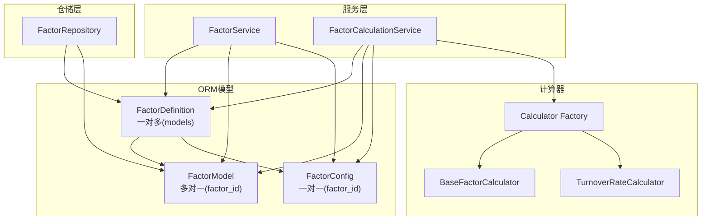
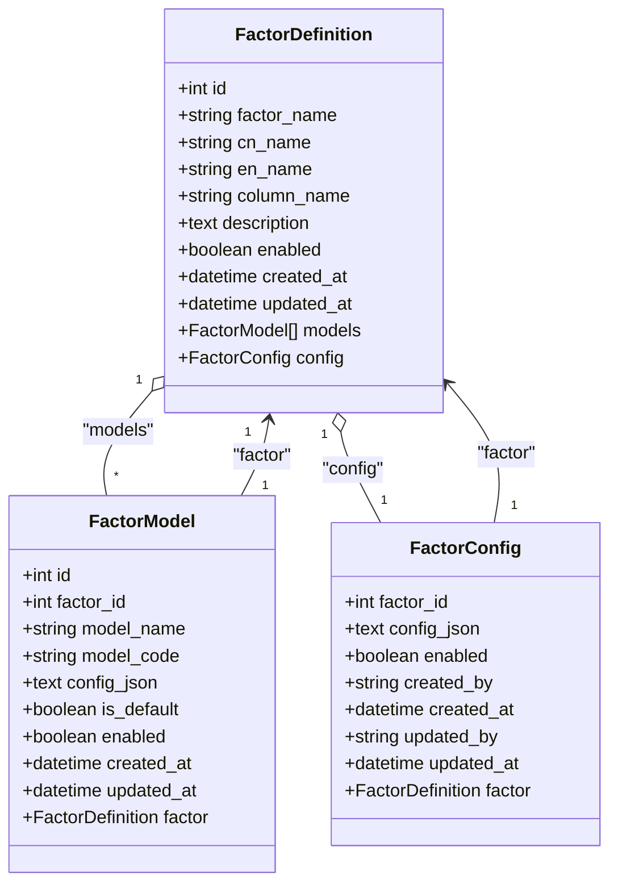
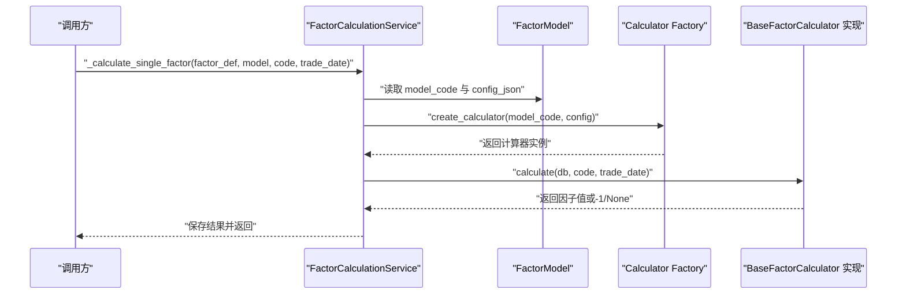
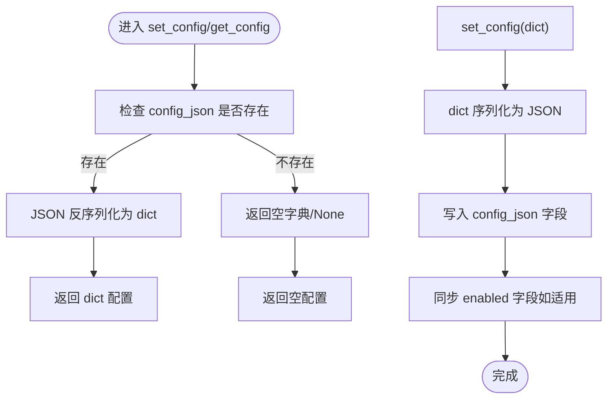
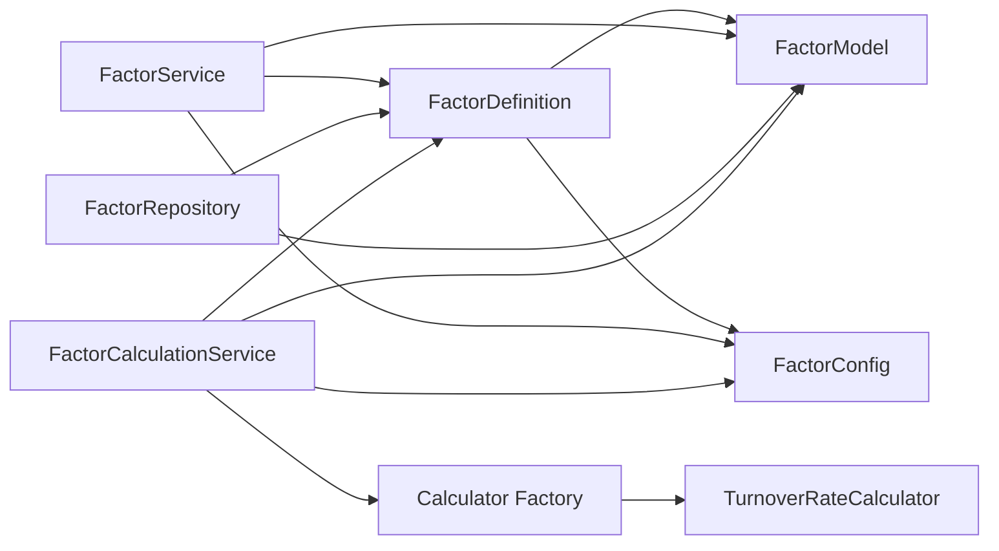

# 因子定义与模型

<cite>
**本文引用的文件**
- [zquant/models/factor.py](file://zquant/models/factor.py)
- [zquant/schemas/factor.py](file://zquant/schemas/factor.py)
- [zquant/services/factor.py](file://zquant/services/factor.py)
- [zquant/repositories/factor_repository.py](file://zquant/repositories/factor_repository.py)
- [zquant/services/factor_calculation.py](file://zquant/services/factor_calculation.py)
- [zquant/factor/calculators/factory.py](file://zquant/factor/calculators/factory.py)
- [zquant/factor/calculators/base.py](file://zquant/factor/calculators/base.py)
- [zquant/factor/calculators/turnover_rate.py](file://zquant/factor/calculators/turnover_rate.py)
</cite>

## 目录
1. [简介](#简介)
2. [项目结构](#项目结构)
3. [核心组件](#核心组件)
4. [架构总览](#架构总览)
5. [详细组件分析](#详细组件分析)
6. [依赖关系分析](#依赖关系分析)
7. [性能考量](#性能考量)
8. [故障排查指南](#故障排查指南)
9. [结论](#结论)

## 简介
本文件围绕“因子定义（FactorDefinition）与因子模型（FactorModel）”的ORM关系展开，系统性说明：
- 一对多关系在数据库层的外键约束（factor_id）与应用层的级联操作（cascade='all, delete-orphan'）语义；
- is_default 字段在模型选择中的作用；
- model_code 如何关联到具体的因子计算器实现；
- 通过 get_default_factor_model() 服务方法获取默认模型；
- 查询优化策略（索引 idx_factor_id、idx_model_code 等）；
- 模型配置 config_json 的序列化与反序列化流程。

## 项目结构
与因子定义/模型相关的核心文件分布如下：
- ORM模型：zquant/models/factor.py
- Pydantic Schema：zquant/schemas/factor.py
- 业务服务：zquant/services/factor.py
- 仓储层：zquant/repositories/factor_repository.py
- 因子计算服务：zquant/services/factor_calculation.py
- 计算器工厂与基类：zquant/factor/calculators/factory.py、base.py、具体计算器 turnover_rate.py

图表来源
- [zquant/models/factor.py](file://zquant/models/factor.py#L35-L171)
- [zquant/services/factor.py](file://zquant/services/factor.py#L191-L330)
- [zquant/repositories/factor_repository.py](file://zquant/repositories/factor_repository.py#L135-L153)
- [zquant/services/factor_calculation.py](file://zquant/services/factor_calculation.py#L44-L213)
- [zquant/factor/calculators/factory.py](file://zquant/factor/calculators/factory.py#L35-L88)
- [zquant/factor/calculators/base.py](file://zquant/factor/calculators/base.py#L34-L82)
- [zquant/factor/calculators/turnover_rate.py](file://zquant/factor/calculators/turnover_rate.py#L37-L188)

章节来源
- [zquant/models/factor.py](file://zquant/models/factor.py#L35-L171)
- [zquant/services/factor.py](file://zquant/services/factor.py#L191-L330)
- [zquant/repositories/factor_repository.py](file://zquant/repositories/factor_repository.py#L135-L153)
- [zquant/services/factor_calculation.py](file://zquant/services/factor_calculation.py#L44-L213)
- [zquant/factor/calculators/factory.py](file://zquant/factor/calculators/factory.py#L35-L88)
- [zquant/factor/calculators/base.py](file://zquant/factor/calculators/base.py#L34-L82)
- [zquant/factor/calculators/turnover_rate.py](file://zquant/factor/calculators/turnover_rate.py#L37-L188)

## 核心组件
- FactorDefinition：因子定义表，一对多关系 models 指向 FactorModel，同时有一对一关系 config 指向 FactorConfig。
- FactorModel：因子模型表，多对一回溯到 FactorDefinition，包含 model_code、is_default、config_json 等字段。
- FactorConfig：因子配置表，以 factor_id 作为主键，存储 JSON 格式的配置（包含 enabled 与 mappings）。
- FactorService：提供因子定义、模型、配置的增删改查与默认模型查询。
- FactorRepository：提供默认模型查询等仓储方法。
- FactorCalculationService：负责因子计算流程，通过 model_code 与工厂创建计算器实例。
- Calculator Factory/Base：注册与创建计算器，校验配置有效性。

章节来源
- [zquant/models/factor.py](file://zquant/models/factor.py#L35-L171)
- [zquant/services/factor.py](file://zquant/services/factor.py#L191-L330)
- [zquant/repositories/factor_repository.py](file://zquant/repositories/factor_repository.py#L135-L153)
- [zquant/services/factor_calculation.py](file://zquant/services/factor_calculation.py#L44-L213)
- [zquant/factor/calculators/factory.py](file://zquant/factor/calculators/factory.py#L35-L88)
- [zquant/factor/calculators/base.py](file://zquant/factor/calculators/base.py#L34-L82)

## 架构总览
下图展示了 FactorDefinition 与 FactorModel 的 ORM 关系、外键约束、级联语义，以及应用层如何通过 model_code 选择计算器实现。

图表来源
- [zquant/models/factor.py](file://zquant/models/factor.py#L35-L171)

## 详细组件分析

### ORM关系与外键约束
- FactorModel.factor_id 是外键，指向 FactorDefinition.id，形成“一对多”关系。
- FactorDefinition.models 的 relationship 定义包含 cascade='all, delete-orphan'，表示：
  - 新增/更新 FactorDefinition 时，其 models 会级联持久化；
  - 当某个 FactorModel 从 FactorDefinition.models 集合移除时，该模型会被自动删除（孤儿删除）。
- FactorConfig 以 factor_id 作为主键，与 FactorDefinition 建立一对一关系，同样受 cascade 控制。

章节来源
- [zquant/models/factor.py](file://zquant/models/factor.py#L51-L53)
- [zquant/models/factor.py](file://zquant/models/factor.py#L117-L127)
- [zquant/models/factor.py](file://zquant/models/factor.py#L157-L166)

### 级联操作语义与删除行为
- 应用层通过 FactorService.create_factor_model/update_factor_model 等方法控制 is_default 字段，确保同一因子下最多只有一个默认模型。
- 当删除 FactorDefinition 时，由于 models 的 cascade='all, delete-orphan'，所有关联的 FactorModel 也会被删除。
- FactorConfig 作为一对一配置，随 FactorDefinition 的删除而级联删除。

章节来源
- [zquant/services/factor.py](file://zquant/services/factor.py#L191-L225)
- [zquant/services/factor.py](file://zquant/services/factor.py#L286-L318)
- [zquant/models/factor.py](file://zquant/models/factor.py#L51-L53)

### 查询优化策略与索引
- FactorModel 表的关键索引：
  - idx_factor_id：加速按因子过滤模型；
  - idx_model_code：加速按 model_code 查找；
  - idx_is_default：加速默认模型查询；
  - idx_enabled：加速启用状态过滤。
- FactorDefinition 表的关键索引：
  - idx_factor_name：加速按名称查询；
  - idx_enabled：加速启用状态过滤。
- FactorConfig 表的关键索引：
  - idx_factor_id：加速按因子查询配置；
  - idx_enabled：加速启用状态过滤。

章节来源
- [zquant/models/factor.py](file://zquant/models/factor.py#L54-L57)
- [zquant/models/factor.py](file://zquant/models/factor.py#L129-L134)
- [zquant/models/factor.py](file://zquant/models/factor.py#L168-L171)

### is_default 字段在模型选择中的作用
- is_default 用于标识某模型是否为默认模型。
- FactorService.get_default_factor_model 与 FactorRepository.get_default_factor_model 均按 is_default=True 且 enabled=True 进行筛选。
- 当新增/更新模型并设为默认时，服务层会先将同因子下的其他模型的 is_default 清零，保证唯一默认。

章节来源
- [zquant/services/factor.py](file://zquant/services/factor.py#L276-L284)
- [zquant/repositories/factor_repository.py](file://zquant/repositories/factor_repository.py#L135-L153)
- [zquant/services/factor.py](file://zquant/services/factor.py#L205-L210)
- [zquant/services/factor.py](file://zquant/services/factor.py#L307-L312)

### model_code 与计算器实现的关联
- FactorModel.model_code 用于标识具体计算器类型。
- FactorCalculationService._calculate_single_factor 通过 create_calculator(model_code, model.get_config()) 动态创建计算器实例。
- 工厂注册表中维护 model_code 到计算器类的映射，若 model_code 未注册则抛出异常。
- 具体计算器（如 TurnoverRateCalculator）需实现 calculate 与 validate_config 方法，并在构造时接收 model_code 与配置。

图表来源
- [zquant/services/factor_calculation.py](file://zquant/services/factor_calculation.py#L895-L997)
- [zquant/factor/calculators/factory.py](file://zquant/factor/calculators/factory.py#L53-L78)
- [zquant/factor/calculators/base.py](file://zquant/factor/calculators/base.py#L34-L82)
- [zquant/factor/calculators/turnover_rate.py](file://zquant/factor/calculators/turnover_rate.py#L37-L188)

章节来源
- [zquant/services/factor_calculation.py](file://zquant/services/factor_calculation.py#L895-L997)
- [zquant/factor/calculators/factory.py](file://zquant/factor/calculators/factory.py#L35-L88)
- [zquant/factor/calculators/base.py](file://zquant/factor/calculators/base.py#L34-L82)
- [zquant/factor/calculators/turnover_rate.py](file://zquant/factor/calculators/turnover_rate.py#L37-L188)

### 为一个因子定义创建多个计算模型
- 使用 FactorService.create_factor_model 为同一因子定义创建多个模型，分别设置不同的 model_code 与配置。
- 若某模型设置 is_default=True，服务层会自动将同因子下的其他模型的 is_default 清零，确保唯一默认。

章节来源
- [zquant/services/factor.py](file://zquant/services/factor.py#L191-L225)
- [zquant/services/factor.py](file://zquant/services/factor.py#L205-L210)

### 通过 get_default_factor_model() 获取默认模型
- 服务层 FactorService.get_default_factor_model 与仓储层 FactorRepository.get_default_factor_model 均按 factor_id、is_default=True、enabled=True 过滤。
- 该方法常用于无配置或未命中特定代码映射时的兜底模型选择。

章节来源
- [zquant/services/factor.py](file://zquant/services/factor.py#L276-L284)
- [zquant/repositories/factor_repository.py](file://zquant/repositories/factor_repository.py#L135-L153)

### 模型配置 config_json 的序列化与反序列化
- FactorModel.get_config()/set_config() 将 dict 配置与 JSON 文本互转，便于存储与传输。
- FactorConfig.get_config()/set_config() 同样进行 JSON 解析与写入，并同步 enabled 字段。
- FactorService.update_factor_config 会验证 mappings 中的 model_id 存在性与默认映射唯一性，并将配置写入 FactorConfig。

图表来源
- [zquant/models/factor.py](file://zquant/models/factor.py#L136-L145)
- [zquant/models/factor.py](file://zquant/models/factor.py#L173-L222)
- [zquant/services/factor.py](file://zquant/services/factor.py#L541-L578)

章节来源
- [zquant/models/factor.py](file://zquant/models/factor.py#L136-L145)
- [zquant/models/factor.py](file://zquant/models/factor.py#L173-L222)
- [zquant/services/factor.py](file://zquant/services/factor.py#L541-L578)

## 依赖关系分析
- FactorDefinition 与 FactorModel 之间为典型的一对多关系，外键约束由 factor_id 实现。
- FactorDefinition 与 FactorConfig 之间为一对一关系，以 factor_id 主键。
- FactorCalculationService 依赖 FactorService/FactorRepository 获取默认模型与配置，并通过工厂创建计算器。
- 工厂层依赖注册表将 model_code 与具体计算器类绑定。

图表来源
- [zquant/models/factor.py](file://zquant/models/factor.py#L35-L171)
- [zquant/services/factor.py](file://zquant/services/factor.py#L191-L330)
- [zquant/repositories/factor_repository.py](file://zquant/repositories/factor_repository.py#L135-L153)
- [zquant/services/factor_calculation.py](file://zquant/services/factor_calculation.py#L44-L213)
- [zquant/factor/calculators/factory.py](file://zquant/factor/calculators/factory.py#L35-L88)
- [zquant/factor/calculators/turnover_rate.py](file://zquant/factor/calculators/turnover_rate.py#L37-L188)

## 性能考量
- 索引优化：
  - 对 FactorModel 的 idx_factor_id、idx_model_code、idx_is_default、idx_enabled 提升查询效率；
  - 对 FactorDefinition 的 idx_factor_name、idx_enabled 提升检索效率；
  - 对 FactorConfig 的 idx_factor_id、idx_enabled 提升配置查询效率。
- 缓存与批量加载：
  - FactorCalculationCache 一次性批量加载默认模型、配置与相关模型，构建 code->model 映射，避免重复查询。
- 默认模型优先：
  - 无配置或未命中特定代码映射时，优先使用默认模型，减少分支判断与查询次数。

章节来源
- [zquant/models/factor.py](file://zquant/models/factor.py#L54-L57)
- [zquant/models/factor.py](file://zquant/models/factor.py#L129-L134)
- [zquant/models/factor.py](file://zquant/models/factor.py#L168-L171)
- [zquant/services/factor_calculation.py](file://zquant/services/factor_calculation.py#L44-L213)

## 故障排查指南
- 无法创建/更新默认模型：
  - 现象：设置 is_default=True 后其他模型未自动清零。
  - 排查：确认调用路径使用 FactorService.create_factor_model/update_factor_model，检查是否触发 is_default 清零逻辑。
- 未找到对应模型：
  - 现象：get_model_for_code 返回 None。
  - 排查：确认 FactorConfig 中 mappings 是否包含目标代码或默认映射；确认 FactorModel.enabled=True；确认 FactorConfig.enabled=True。
- 计算器不可用：
  - 现象：create_calculator 抛出“未知的因子计算器模型代码”。
  - 排查：确认 model_code 是否已在工厂注册表中；确认计算器类已导入并注册。
- 配置格式错误：
  - 现象：FactorConfig.set_config 抛出校验异常。
  - 排查：确认 mappings 中每个元素包含 model_id；codes 为列表或 None；仅允许一个默认映射（codes 为空或 None）。

章节来源
- [zquant/services/factor.py](file://zquant/services/factor.py#L205-L210)
- [zquant/services/factor.py](file://zquant/services/factor.py#L286-L312)
- [zquant/services/factor.py](file://zquant/services/factor.py#L580-L629)
- [zquant/factor/calculators/factory.py](file://zquant/factor/calculators/factory.py#L53-L78)
- [zquant/models/factor.py](file://zquant/models/factor.py#L173-L222)

## 结论
- FactorDefinition 与 FactorModel 通过外键 factor_id 形成稳定的一对多关系，配合 cascade='all, delete-orphan' 实现模型生命周期的自动化管理。
- is_default 字段确保同一因子下默认模型的唯一性，配合 FactorService 的自动清零逻辑，简化模型选择。
- model_code 作为计算器类型标识，通过工厂动态创建计算器，实现“模型定义 + 计算器实现”的解耦。
- 通过索引与缓存策略，显著提升查询与计算性能；通过 FactorConfig 的 JSON 配置，灵活支持按代码分组的模型选择。