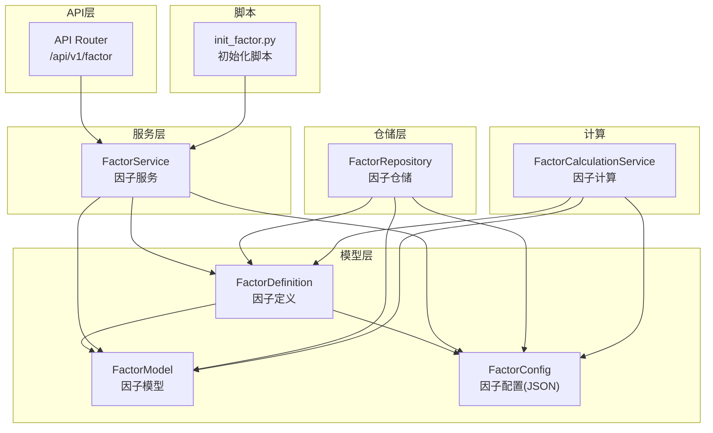
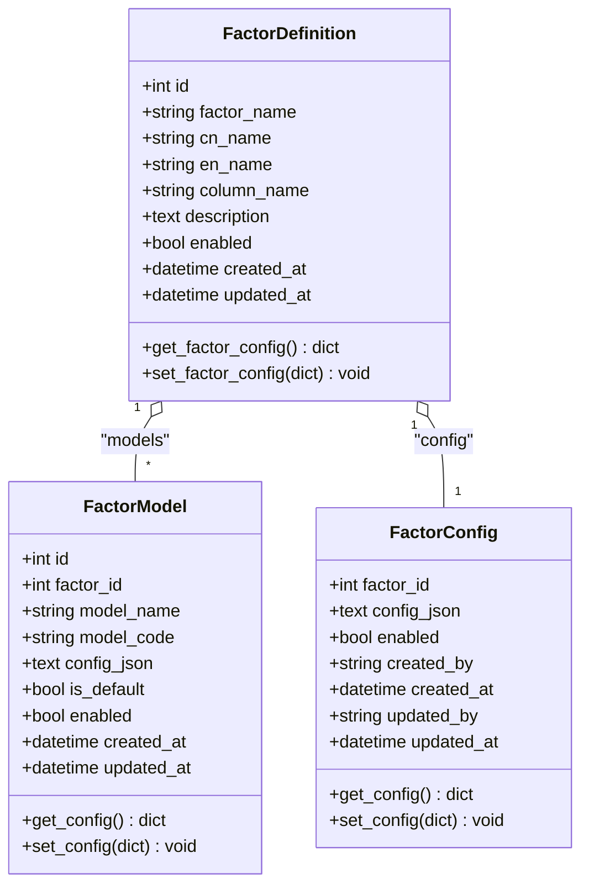
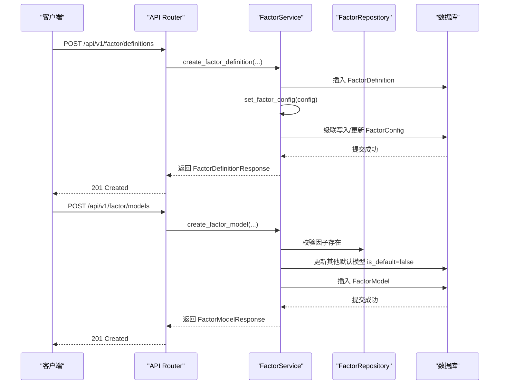
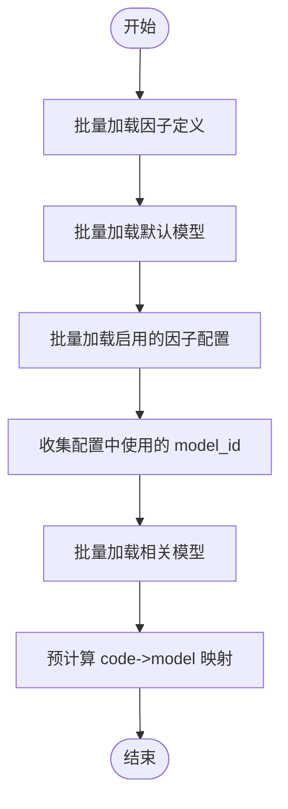
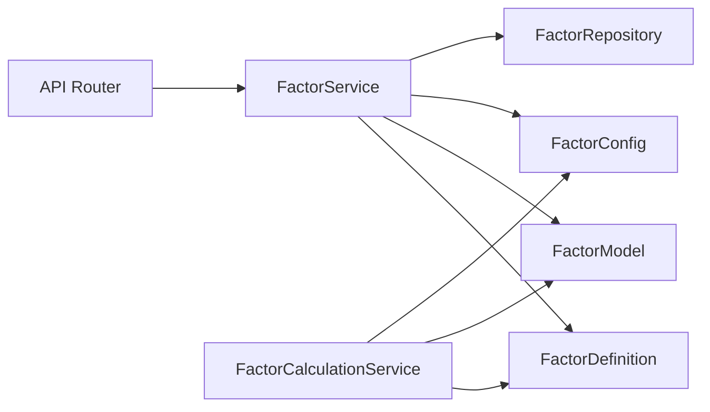

# 因子层级关系

<cite>
**本文引用的文件**
- [zquant/models/factor.py](file://zquant/models/factor.py)
- [zquant/schemas/factor.py](file://zquant/schemas/factor.py)
- [zquant/services/factor.py](file://zquant/services/factor.py)
- [zquant/repositories/factor_repository.py](file://zquant/repositories/factor_repository.py)
- [zquant/api/v1/factor.py](file://zquant/api/v1/factor.py)
- [zquant/scripts/init_factor.py](file://zquant/scripts/init_factor.py)
- [zquant/services/factor_calculation.py](file://zquant/services/factor_calculation.py)
</cite>

## 目录
1. [简介](#简介)
2. [项目结构](#项目结构)
3. [核心组件](#核心组件)
4. [架构总览](#架构总览)
5. [详细组件分析](#详细组件分析)
6. [依赖关系分析](#依赖关系分析)
7. [性能考量](#性能考量)
8. [故障排查指南](#故障排查指南)
9. [结论](#结论)
10. [附录](#附录)

## 简介
本文件系统化阐述因子定义(FactorDefinition)、因子模型(FactorModel)与因子配置(FactorConfig)三者之间的层级关联结构，重点说明：
- FactorDefinition 中 models（一对多）与 config（一对一）的关系字段及其 ORM 映射差异；
- cascade='all, delete-orphan' 在 models 关系中的作用，确保删除因子定义时自动清理无主记录；
- get_factor_config() 与 set_factor_config() 方法如何通过 JSON 字段与对象关系协同工作；
- 创建新因子时如何初始化其默认模型与配置；
- Index 索引在查询性能优化中的应用。

## 项目结构
围绕因子层级关系的核心文件分布如下：
- 模型层：FactorDefinition、FactorModel、FactorConfig（ORM 定义与关系）
- 服务层：FactorService（业务编排与校验）
- 仓储层：FactorRepository（数据访问与查询）
- API 层：factor.py（RESTful 接口）
- 脚本：init_factor.py（初始化换手率因子、默认模型与示例配置）
- 计算：factor_calculation.py（批量加载默认模型与配置，构建 code->model 映射）

图表来源
- [zquant/models/factor.py](file://zquant/models/factor.py#L35-L171)
- [zquant/services/factor.py](file://zquant/services/factor.py#L43-L187)
- [zquant/repositories/factor_repository.py](file://zquant/repositories/factor_repository.py#L38-L153)
- [zquant/api/v1/factor.py](file://zquant/api/v1/factor.py#L66-L176)
- [zquant/scripts/init_factor.py](file://zquant/scripts/init_factor.py#L243-L378)
- [zquant/services/factor_calculation.py](file://zquant/services/factor_calculation.py#L75-L212)

章节来源
- [zquant/models/factor.py](file://zquant/models/factor.py#L35-L171)
- [zquant/services/factor.py](file://zquant/services/factor.py#L43-L187)
- [zquant/repositories/factor_repository.py](file://zquant/repositories/factor_repository.py#L38-L153)
- [zquant/api/v1/factor.py](file://zquant/api/v1/factor.py#L66-L176)
- [zquant/scripts/init_factor.py](file://zquant/scripts/init_factor.py#L243-L378)
- [zquant/services/factor_calculation.py](file://zquant/services/factor_calculation.py#L75-L212)

## 核心组件
- FactorDefinition（因子定义）
  - 一对多关系：models（FactorModel）
  - 一对一关系：config（FactorConfig）
  - 提供 get_factor_config()/set_factor_config() 与 JSON 配置协同
- FactorModel（因子模型）
  - 外键：factor_id -> FactorDefinition
  - 提供 get_config()/set_config() 与 JSON 配置协同
- FactorConfig（因子配置）
  - 主键：factor_id（一对一）
  - JSON 字段：config_json 存储配置字典
  - 提供 get_config()/set_config() 与 JSON 配置协同

章节来源
- [zquant/models/factor.py](file://zquant/models/factor.py#L35-L171)

## 架构总览
下图展示了三层关系与数据流：定义层（FactorDefinition）承载模型集合与配置对象；服务层负责校验与持久化；API 层对外暴露 RESTful 接口；脚本负责初始化默认模型与示例配置；计算层批量加载默认模型与配置，构建 code->model 映射。

图表来源
- [zquant/models/factor.py](file://zquant/models/factor.py#L35-L171)

## 详细组件分析

### FactorDefinition 的关系字段与 ORM 映射
- models 关系（一对多）
  - 通过 relationship("FactorModel", back_populates="factor", cascade="all, delete-orphan") 实现
  - 作用：当删除 FactorDefinition 时，与其关联的 FactorModel 会被级联删除（delete-orphan）
- config 关系（一对一）
  - 通过 relationship("FactorConfig", back_populates="factor", uselist=False, cascade="all, delete-orphan") 实现
  - 作用：每个 FactorDefinition 对应一个 FactorConfig；删除 FactorDefinition 时，对应的 FactorConfig 也会被级联删除

章节来源
- [zquant/models/factor.py](file://zquant/models/factor.py#L50-L57)

### FactorDefinition 的配置协同：get_factor_config() 与 set_factor_config()
- get_factor_config()
  - 若存在 FactorConfig，则返回其 get_config()；否则返回默认结构 {"enabled": True, "mappings": []}
- set_factor_config(config)
  - 校验输入类型与结构（mappings 必须为列表，每项需包含 model_id；codes 可为列表或 None）
  - 若传入 config 非空：确保 FactorConfig 关系对象存在并 set_config(config)
  - 若传入 config 为空：清空配置（保留 enabled=True, mappings=[]），不直接删除对象，交由调用方决定是否删除

章节来源
- [zquant/models/factor.py](file://zquant/models/factor.py#L59-L109)

### FactorModel 的配置协同：get_config() 与 set_config()
- get_config()
  - 解析 config_json 为字典；若为空返回 {}
- set_config(config)
  - 将字典序列化为 JSON 并写入 config_json；若为 None 则清空

章节来源
- [zquant/models/factor.py](file://zquant/models/factor.py#L136-L145)

### FactorConfig 的配置协同：get_config() 与 set_config()
- get_config()
  - 解析 config_json 为字典；异常或空时返回默认结构 {"enabled": True, "mappings": []}
- set_config(config)
  - 校验结构并序列化；同时同步 enabled 字段
  - 若传入 config 为空：清空 JSON 并将 enabled 设为默认值

章节来源
- [zquant/models/factor.py](file://zquant/models/factor.py#L173-L222)

### cascade='all, delete-orphan' 的作用与一致性
- 在 models 关系上：
  - 删除 FactorDefinition 时，所有关联的 FactorModel 会被自动删除，避免孤儿记录
- 在 config 关系上：
  - 删除 FactorDefinition 时，对应的 FactorConfig 也会被自动删除，保证一对一关系的一致性

章节来源
- [zquant/models/factor.py](file://zquant/models/factor.py#L50-L57)

### 通过 API 与服务层创建新因子并初始化默认模型与配置
- API 层
  - POST /api/v1/factor/definitions：创建因子定义（可携带 factor_config）
  - POST /api/v1/factor/models：创建因子模型（可设 is_default）
  - POST /api/v1/factor/configs：创建因子配置（新表结构，factor_id 主键）
- 服务层
  - FactorService.create_factor_definition：校验名称唯一、设置列名默认值、调用 set_factor_config 写入配置
  - FactorService.create_factor_model：校验因子存在、必要时取消其他默认模型、保存模型并 set_config
  - FactorService.create_factor_config：校验模型存在、默认配置唯一性、写入 FactorConfig
- 脚本层
  - init_factor.py：创建换手率因子定义与默认模型，再创建示例配置（多映射）

图表来源
- [zquant/api/v1/factor.py](file://zquant/api/v1/factor.py#L66-L176)
- [zquant/services/factor.py](file://zquant/services/factor.py#L43-L187)
- [zquant/repositories/factor_repository.py](file://zquant/repositories/factor_repository.py#L71-L82)

章节来源
- [zquant/api/v1/factor.py](file://zquant/api/v1/factor.py#L66-L176)
- [zquant/services/factor.py](file://zquant/services/factor.py#L43-L187)
- [zquant/scripts/init_factor.py](file://zquant/scripts/init_factor.py#L243-L378)

### 查询与性能优化：Index 索引的应用
- FactorDefinition
  - 索引：idx_factor_name、idx_enabled
  - 用途：按名称检索、启用状态过滤
- FactorModel
  - 索引：idx_factor_id、idx_model_code、idx_is_default、idx_enabled
  - 用途：按因子过滤、按模型代码过滤、默认模型快速定位、启用状态过滤
- FactorConfig
  - 索引：idx_factor_id、idx_enabled
  - 用途：按因子主键查询、启用状态过滤

章节来源
- [zquant/models/factor.py](file://zquant/models/factor.py#L40-L57)
- [zquant/models/factor.py](file://zquant/models/factor.py#L116-L134)
- [zquant/models/factor.py](file://zquant/models/factor.py#L157-L171)

### 计算层的批量加载与映射构建
- 批量加载默认模型与配置，收集所有配置中使用的 model_id，再批量加载相关模型
- 预计算 code->model 映射：优先匹配特定代码映射，其次匹配默认映射，最后回退到因子定义的默认模型

图表来源
- [zquant/services/factor_calculation.py](file://zquant/services/factor_calculation.py#L75-L212)

章节来源
- [zquant/services/factor_calculation.py](file://zquant/services/factor_calculation.py#L75-L212)

## 依赖关系分析
- 组件耦合
  - FactorDefinition 依赖 FactorModel（一对多）与 FactorConfig（一对一）
  - FactorService 依赖模型与仓储，提供业务规则与校验
  - FactorRepository 提供基础查询能力（启用过滤、默认模型查询等）
  - API Router 依赖服务层进行业务处理
  - 计算层依赖模型与服务层进行批量加载与映射构建
- 外部依赖
  - SQLAlchemy ORM 与关系映射
  - FastAPI 路由与 Pydantic 模型

图表来源
- [zquant/api/v1/factor.py](file://zquant/api/v1/factor.py#L66-L176)
- [zquant/services/factor.py](file://zquant/services/factor.py#L43-L187)
- [zquant/repositories/factor_repository.py](file://zquant/repositories/factor_repository.py#L38-L153)
- [zquant/services/factor_calculation.py](file://zquant/services/factor_calculation.py#L75-L212)

章节来源
- [zquant/api/v1/factor.py](file://zquant/api/v1/factor.py#L66-L176)
- [zquant/services/factor.py](file://zquant/services/factor.py#L43-L187)
- [zquant/repositories/factor_repository.py](file://zquant/repositories/factor_repository.py#L38-L153)
- [zquant/services/factor_calculation.py](file://zquant/services/factor_calculation.py#L75-L212)

## 性能考量
- 索引设计
  - 在 FactorDefinition 上建立 factor_name 与 enabled 索引，提升按名称与启用状态查询效率
  - 在 FactorModel 上建立 factor_id、model_code、is_default、enabled 索引，支持多维过滤与默认模型快速定位
  - 在 FactorConfig 上建立 factor_id 与 enabled 索引，支持按因子主键与启用状态查询
- 批量加载
  - 计算层通过 in_ 查询与集合去重，减少多次往返数据库的开销
- JSON 字段
  - FactorConfig 与 FactorModel 的 JSON 字段便于灵活扩展配置，但查询时建议通过索引字段过滤后再解析 JSON，避免全表扫描

[本节为通用指导，无需列出具体文件来源]

## 故障排查指南
- 删除因子定义后仍有模型残留
  - 检查 FactorDefinition.models 关系是否正确配置 cascade='all, delete-orphan'
  - 确认删除操作发生在同一事务内
- 配置更新后未生效
  - 确认 FactorDefinition.set_factor_config() 已被调用且结构校验通过
  - 确认 FactorConfig.set_config() 已同步 enabled 字段
- 默认模型冲突
  - 创建/更新模型时，如设置 is_default=True，需确保同一因子下仅有一个默认模型
- 查询不到默认模型或配置
  - 检查 enabled 状态过滤条件
  - 确认索引是否生效（factor_id、enabled 等）

章节来源
- [zquant/models/factor.py](file://zquant/models/factor.py#L50-L57)
- [zquant/services/factor.py](file://zquant/services/factor.py#L191-L225)
- [zquant/repositories/factor_repository.py](file://zquant/repositories/factor_repository.py#L135-L153)

## 结论
- FactorDefinition 作为根节点，承载一对多的模型集合与一对一的配置对象，二者通过 cascade='all, delete-orphan' 保证删除一致性
- get_factor_config()/set_factor_config() 与 JSON 字段协同，既满足灵活性又保持强约束（如默认配置唯一性）
- 通过合理的索引设计与批量加载策略，显著提升查询与计算性能
- 初始化脚本与 API 流程清晰地展示了从“定义—模型—配置”的完整闭环

[本节为总结性内容，无需列出具体文件来源]

## 附录

### 配置数据结构说明
- 配置字典结构
  - enabled: bool，是否启用
  - mappings: list[dict]，映射项数组
    - model_id: int，模型 ID
    - codes: list[str]|None，股票代码列表；None 或空列表表示默认配置
- 默认配置唯一性
  - 同一因子的配置中最多允许一个默认映射（codes 为空或 None）

章节来源
- [zquant/models/factor.py](file://zquant/models/factor.py#L59-L109)
- [zquant/models/factor.py](file://zquant/models/factor.py#L173-L222)
- [zquant/services/factor.py](file://zquant/services/factor.py#L540-L578)
- [zquant/services/factor.py](file://zquant/services/factor.py#L633-L745)

### 初始化示例（换手率因子）
- 创建因子定义与默认模型
- 创建示例配置（默认模型用于所有股票，特定模型用于部分股票）
- 通过脚本执行，确保默认模型唯一与配置结构正确

章节来源
- [zquant/scripts/init_factor.py](file://zquant/scripts/init_factor.py#L243-L378)