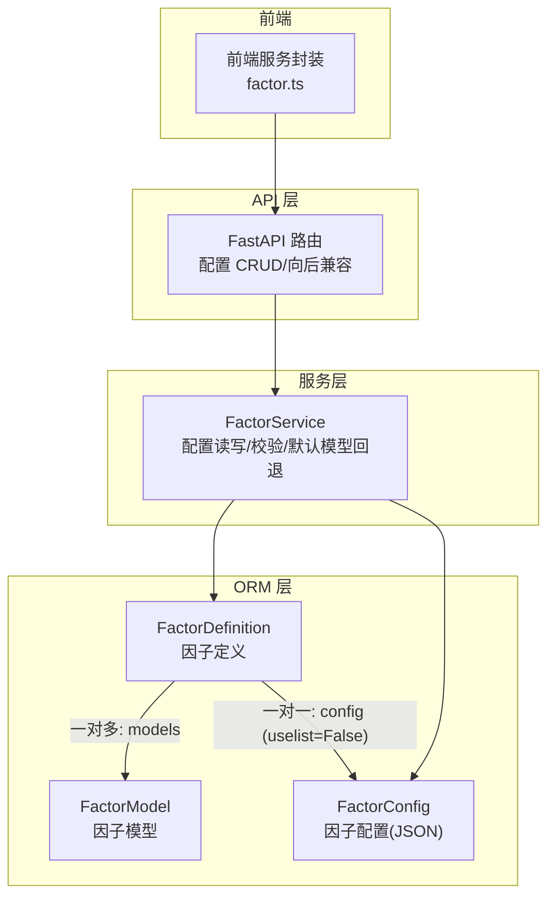
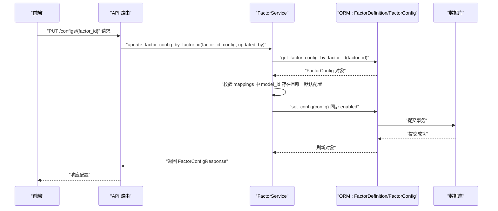
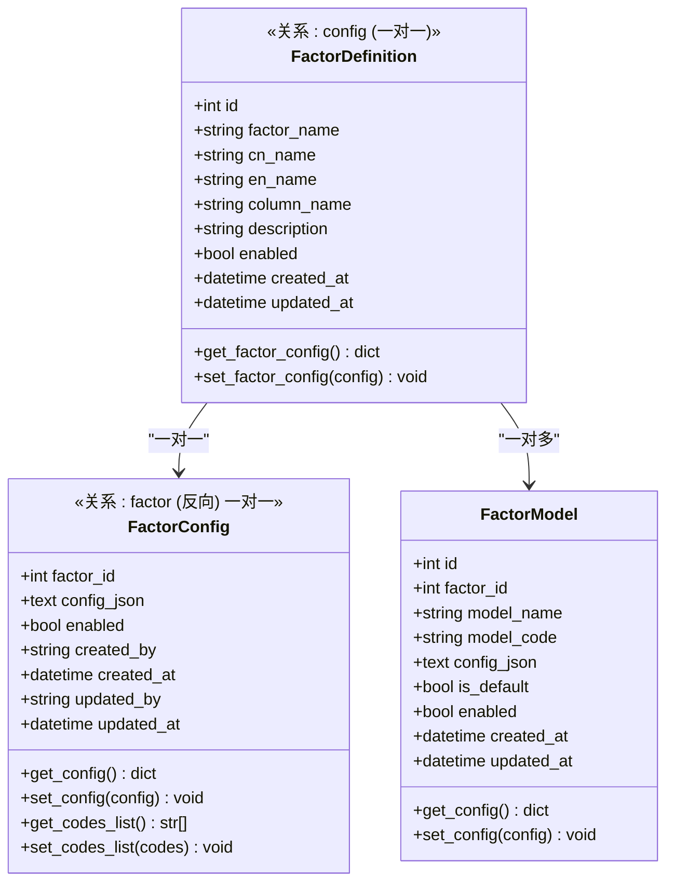
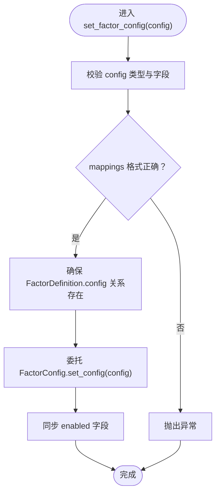
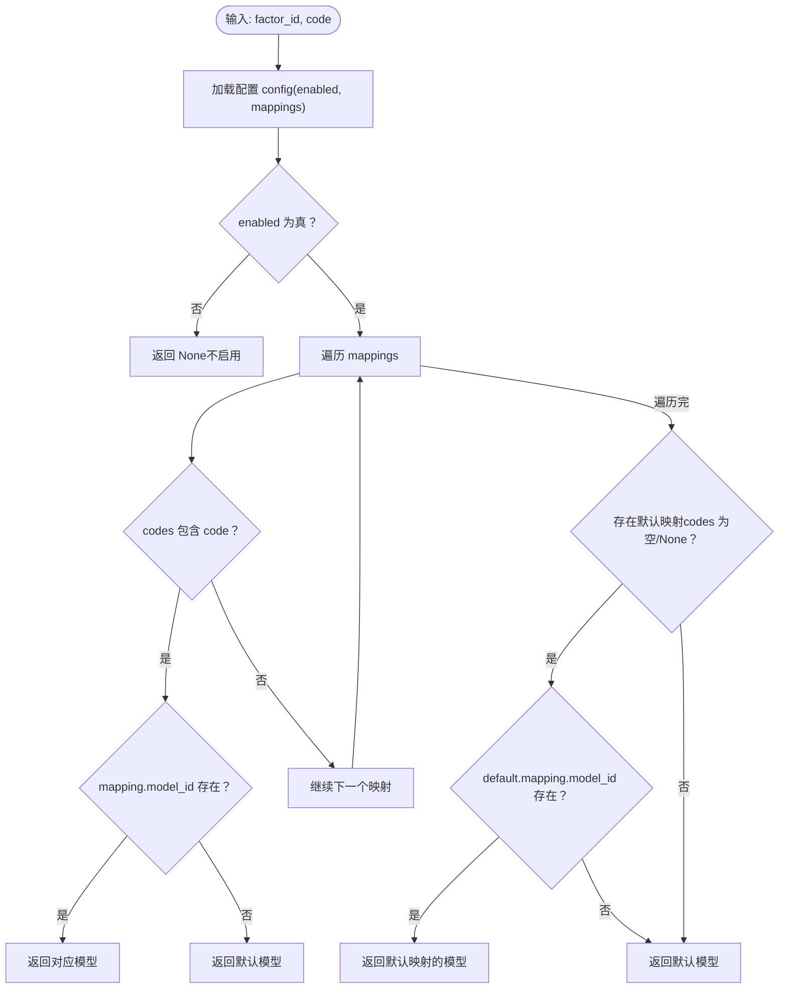
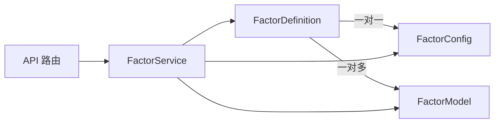

# 因子配置机制

<cite>
**本文引用的文件**
- [zquant/models/factor.py](file://zquant/models/factor.py)
- [zquant/schemas/factor.py](file://zquant/schemas/factor.py)
- [zquant/services/factor.py](file://zquant/services/factor.py)
- [zquant/api/v1/factor.py](file://zquant/api/v1/factor.py)
- [web/src/services/zquant/factor.ts](file://web/src/services/zquant/factor.ts)
</cite>

## 目录
1. [简介](#简介)
2. [项目结构](#项目结构)
3. [核心组件](#核心组件)
4. [架构总览](#架构总览)
5. [组件详解](#组件详解)
6. [依赖关系分析](#依赖关系分析)
7. [性能考量](#性能考量)
8. [故障排查指南](#故障排查指南)
9. [结论](#结论)

## 简介
本文件深入解析因子配置机制，围绕 FactorConfig 模型与其一对一关系（uselist=False）展开，阐明 config_json 字段中存储的 JSON 配置结构（包含 enabled 状态与 mappings 映射列表）的业务含义；解释 get_factor_config() 与 set_factor_config() 如何协同保证配置数据一致性；说明 set_codes_list() 方法为何废弃并给出向后兼容处理；分析 mappings 数组中 model_id 与 codes 组合如何实现细粒度的因子计算范围控制；最后结合 created_by/updated_by 审计字段，说明配置变更的追踪机制。

## 项目结构
与因子配置相关的核心代码分布在以下模块：
- ORM 层：FactorDefinition、FactorConfig、FactorModel
- 服务层：FactorService（配置读写、校验、默认模型回退）
- API 层：FastAPI 路由（配置 CRUD、向后兼容接口）
- 前端：调用配置接口的客户端封装

图表来源
- [zquant/models/factor.py](file://zquant/models/factor.py#L35-L110)
- [zquant/services/factor.py](file://zquant/services/factor.py#L38-L110)
- [zquant/api/v1/factor.py](file://zquant/api/v1/factor.py#L351-L420)
- [web/src/services/zquant/factor.ts](file://web/src/services/zquant/factor.ts#L150-L203)

章节来源
- [zquant/models/factor.py](file://zquant/models/factor.py#L35-L110)
- [zquant/services/factor.py](file://zquant/services/factor.py#L38-L110)
- [zquant/api/v1/factor.py](file://zquant/api/v1/factor.py#L351-L420)
- [web/src/services/zquant/factor.ts](file://web/src/services/zquant/factor.ts#L150-L203)

## 核心组件
- FactorDefinition：因子定义，维护因子元信息与启用状态，通过关系字段 config 指向 FactorConfig（一对一）。
- FactorConfig：因子配置表，以 factor_id 为主键，config_json 存储 JSON 配置，包含 enabled 与 mappings 列表，同时具备 created_by/updated_by 审计字段。
- FactorModel：因子模型，与 FactorDefinition 多对一关系，用于选择具体计算模型。
- FactorService：服务层，负责配置的读取、校验、更新、默认模型回退、以及与 FactorConfig 表的交互。
- API 路由：提供配置的增删改查接口，包含向后兼容的旧接口。
- 前端封装：提供调用配置接口的方法，兼容旧接口。

章节来源
- [zquant/models/factor.py](file://zquant/models/factor.py#L35-L110)
- [zquant/models/factor.py](file://zquant/models/factor.py#L147-L234)
- [zquant/services/factor.py](file://zquant/services/factor.py#L38-L110)
- [zquant/api/v1/factor.py](file://zquant/api/v1/factor.py#L351-L420)
- [web/src/services/zquant/factor.ts](file://web/src/services/zquant/factor.ts#L150-L203)

## 架构总览
下图展示因子配置在各层之间的流转与职责划分。

图表来源
- [zquant/api/v1/factor.py](file://zquant/api/v1/factor.py#L351-L376)
- [zquant/services/factor.py](file://zquant/services/factor.py#L686-L744)
- [zquant/models/factor.py](file://zquant/models/factor.py#L147-L234)

## 组件详解

### FactorConfig 模型与一对一关系（uselist=False）
- 主键与外键：factor_id 作为主键，指向 FactorDefinition 的 id，形成一对一关系。
- 配置存储：config_json 字段存储 JSON 结构，包含 enabled 与 mappings 列表。
- 审计字段：created_by/updated_by 记录创建者与更新者，created_at/updated_at 记录时间戳。
- 关系定义：FactorDefinition 的 config 关系使用 uselist=False，确保每个 FactorDefinition 仅关联一个 FactorConfig。

图表来源
- [zquant/models/factor.py](file://zquant/models/factor.py#L35-L110)
- [zquant/models/factor.py](file://zquant/models/factor.py#L147-L234)

章节来源
- [zquant/models/factor.py](file://zquant/models/factor.py#L35-L110)
- [zquant/models/factor.py](file://zquant/models/factor.py#L147-L234)

### config_json 字段的 JSON 配置结构与业务含义
- 结构组成：
  - enabled：布尔值，表示该因子配置是否启用。
  - mappings：数组，元素为对象，包含：
    - model_id：整数，指向 FactorModel 的 id，决定使用哪个模型进行计算。
    - codes：字符串数组或 None，表示该映射适用的股票代码集合；None 或空数组表示“默认配置”，即未显式匹配到特定代码时使用的模型。
- 业务含义：
  - enabled 控制是否启用该配置的整体开关。
  - mappings 提供细粒度的因子计算范围控制：优先匹配精确代码（codes 包含某只股票），若未命中则回退到默认配置（codes 为空或 None）。
  - 默认配置最多只能有一个，否则会触发校验错误。

章节来源
- [zquant/models/factor.py](file://zquant/models/factor.py#L173-L222)
- [zquant/services/factor.py](file://zquant/services/factor.py#L541-L577)
- [zquant/services/factor.py](file://zquant/services/factor.py#L686-L744)

### get_factor_config() 与 set_factor_config() 的协作与一致性保障
- get_factor_config()：
  - 从 FactorDefinition 获取其关联的 FactorConfig，解析 config_json 为字典；若无配置则返回默认结构。
- set_factor_config()：
  - 在 FactorDefinition 上设置配置时，先验证配置格式（包含 mappings 与 enabled），再确保 FactorDefinition.config 关系存在并委托给 FactorConfig.set_config() 写入数据库。
  - 若传入空配置，则清空为默认结构，避免物理删除关系对象。
- 一致性保障：
  - 格式校验：确保 mappings 是列表，每个 mapping 包含 model_id，codes 类型合法。
  - 唯一默认配置：在服务层与表层均校验默认配置数量，防止重复默认映射。
  - enabled 同步：FactorConfig.set_config() 会同步 enabled 字段，保持与 JSON 中 enabled 一致。

图表来源
- [zquant/models/factor.py](file://zquant/models/factor.py#L70-L109)
- [zquant/models/factor.py](file://zquant/models/factor.py#L187-L222)

章节来源
- [zquant/models/factor.py](file://zquant/models/factor.py#L70-L109)
- [zquant/models/factor.py](file://zquant/models/factor.py#L187-L222)

### set_codes_list() 方法的废弃与向后兼容处理
- 废弃原因：
  - 旧有设计仅支持单一 codes 列表，无法表达多模型、多股票范围的复杂映射。
  - 新设计采用 mappings 数组，每个 mapping 可独立指定 model_id 与 codes，实现更灵活的控制。
- 向后兼容：
  - FactorConfig.set_codes_list() 仍保留，内部将旧的 codes 列表迁移到 mappings[0]，并在注释中明确废弃提示。
  - API 层提供向后兼容接口（例如 GET /definitions/{factor_id}/config），优先尝试从新表读取，若不存在则回退到旧逻辑。
- 建议迁移：
  - 使用新的配置结构（enabled + mappings），通过 PUT /configs/{factor_id} 更新配置。

章节来源
- [zquant/models/factor.py](file://zquant/models/factor.py#L223-L267)
- [zquant/api/v1/factor.py](file://zquant/api/v1/factor.py#L404-L427)
- [web/src/services/zquant/factor.ts](file://web/src/services/zquant/factor.ts#L150-L203)

### mappings 数组中 model_id 与 codes 的组合与计算范围控制
- 精确匹配优先：根据股票代码在 mappings 中查找 codes 包含该代码的映射，若找到则使用其 model_id。
- 默认回退：若未找到精确匹配，则查找默认映射（codes 为空或 None），使用其 model_id。
- 默认模型回退：若映射中 model_id 为空，则回退到 FactorDefinition 的默认模型。
- 服务层逻辑：FactorService.get_model_for_code() 实现上述查找与回退策略。

图表来源
- [zquant/services/factor.py](file://zquant/services/factor.py#L580-L629)

章节来源
- [zquant/services/factor.py](file://zquant/services/factor.py#L580-L629)

### 审计字段 created_by/updated_by 的配置变更追踪
- 创建：创建 FactorConfig 时，created_by 与 updated_by 同步设置为创建者。
- 更新：更新 FactorConfig 时，若提供 updated_by 参数，将 updated_by 字段更新为当前用户。
- API 层：PUT /configs/{factor_id} 接口在更新时传入 current_user.username 作为 updated_by。
- 响应：FactorConfigResponse 支持返回 created_by/updated_by/created_at/updated_at，便于前端展示与审计。

章节来源
- [zquant/services/factor.py](file://zquant/services/factor.py#L686-L744)
- [zquant/models/factor.py](file://zquant/models/factor.py#L147-L234)
- [zquant/schemas/factor.py](file://zquant/schemas/factor.py#L239-L267)
- [zquant/api/v1/factor.py](file://zquant/api/v1/factor.py#L351-L376)

## 依赖关系分析
- FactorDefinition 与 FactorConfig：一对一（uselist=False），通过 FactorDefinition.config 关系访问 FactorConfig。
- FactorDefinition 与 FactorModel：一对多，用于选择不同模型。
- FactorService 作为协调者，负责：
  - 校验配置格式与唯一默认配置
  - 将 FactorDefinition 的配置委托给 FactorConfig
  - 提供 get_model_for_code() 进行模型选择与回退
- API 层提供新旧接口，新接口使用 FactorConfig 表，旧接口兼容历史行为。

图表来源
- [zquant/models/factor.py](file://zquant/models/factor.py#L35-L110)
- [zquant/services/factor.py](file://zquant/services/factor.py#L38-L110)

章节来源
- [zquant/models/factor.py](file://zquant/models/factor.py#L35-L110)
- [zquant/services/factor.py](file://zquant/services/factor.py#L38-L110)

## 性能考量
- 查询路径优化：
  - FactorDefinition.config 为一对一，读取配置只需一次 JOIN 或外键访问。
  - FactorConfig 表按 factor_id 建有索引，适合按因子快速定位配置。
- 写入一致性：
  - set_factor_config() 在服务层统一校验后再写入，避免脏数据进入数据库。
- 默认配置约束：
  - 限制默认映射数量，减少回退分支判断成本，提升 get_model_for_code() 的查找效率。

[本节为通用建议，无需列出具体文件来源]

## 故障排查指南
- “只能有一个默认配置”错误
  - 现象：更新配置时报错，默认映射数量超过 1。
  - 排查：检查 mappings 中是否有多条 codes 为空或 None 的映射。
  - 解决：仅保留一条默认映射，或为某些映射补充明确的 codes。
- “每个映射必须包含 model_id”错误
  - 现象：更新配置时报错，mapping 缺少 model_id。
  - 排查：确认 mappings 中每条映射都包含 model_id。
- “因子配置不存在”错误
  - 现象：GET /configs/{factor_id} 报错。
  - 排查：确认 FactorConfig 中是否存在该 factor_id 的记录。
- “因子模型不存在”错误
  - 现象：更新配置时报错，引用的 model_id 不存在。
  - 排查：确认 FactorModel 中是否存在该 model_id。
- 向后兼容接口
  - 若前端仍调用旧接口（如 GET /definitions/{factor_id}/config），需确保新表存在；否则回退到旧逻辑。

章节来源
- [zquant/services/factor.py](file://zquant/services/factor.py#L541-L577)
- [zquant/services/factor.py](file://zquant/services/factor.py#L686-L744)
- [zquant/api/v1/factor.py](file://zquant/api/v1/factor.py#L404-L427)

## 结论
- FactorConfig 采用一对一关系（uselist=False）与以 factor_id 为主键的设计，使每个因子仅有一份配置，简化了配置管理与一致性保障。
- config_json 的 enabled 与 mappings 结构实现了“精确匹配优先、默认回退”的细粒度控制，配合 FactorService 的 get_model_for_code()，可灵活地为不同股票选择不同的计算模型。
- set_factor_config() 与 FactorConfig.set_config() 的双重校验与 enabled 同步，确保配置数据的完整性与一致性。
- set_codes_list() 已废弃，推荐使用新的 mappings 结构并通过 API 更新；向后兼容接口与前端封装提供了平滑迁移路径。
- created_by/updated_by 审计字段贯穿创建与更新流程，便于追踪配置变更历史。