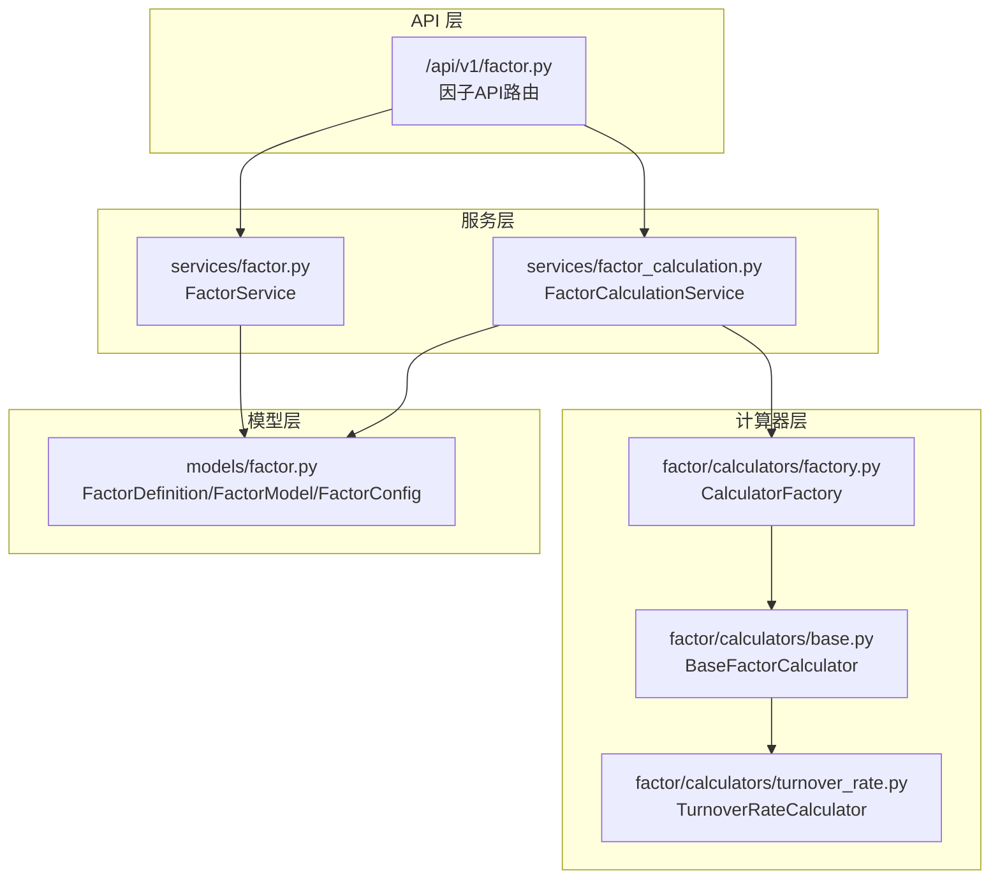
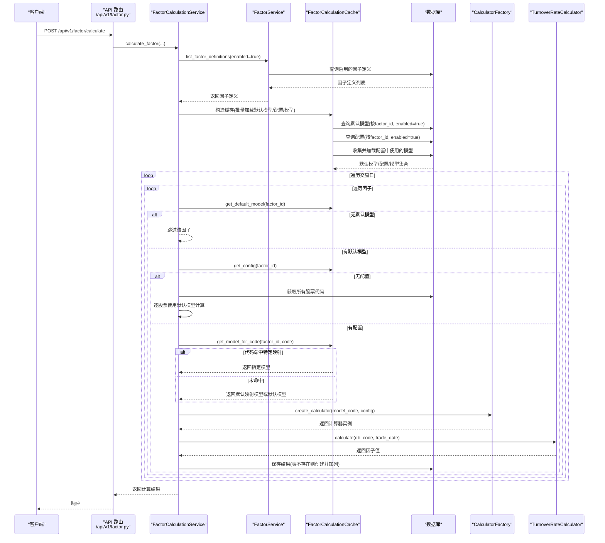
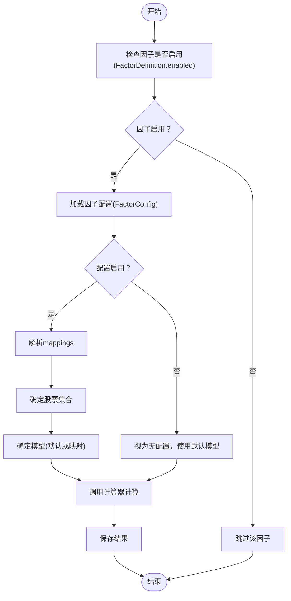
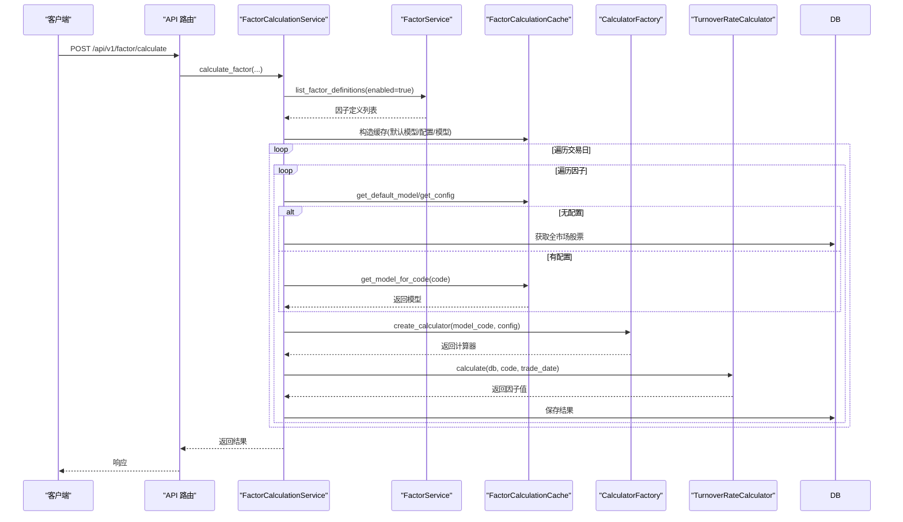
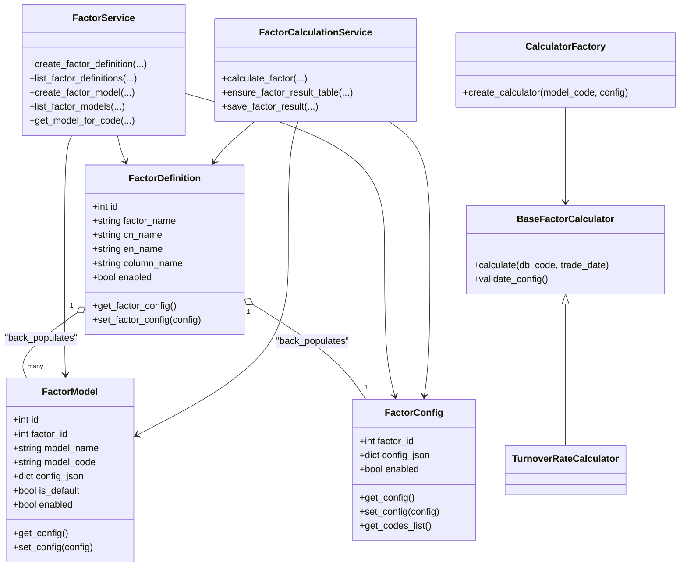

# 层级交互与业务流程

<cite>
**本文引用的文件**
- [zquant/models/factor.py](file://zquant/models/factor.py)
- [zquant/services/factor.py](file://zquant/services/factor.py)
- [zquant/services/factor_calculation.py](file://zquant/services/factor_calculation.py)
- [zquant/factor/calculators/base.py](file://zquant/factor/calculators/base.py)
- [zquant/factor/calculators/factory.py](file://zquant/factor/calculators/factory.py)
- [zquant/factor/calculators/turnover_rate.py](file://zquant/factor/calculators/turnover_rate.py)
- [zquant/api/v1/factor.py](file://zquant/api/v1/factor.py)
- [zquant/scripts/init_factor.py](file://zquant/scripts/init_factor.py)
- [docs/factor_management.md](file://docs/factor_management.md)
</cite>

## 目录
1. [简介](#简介)
2. [项目结构](#项目结构)
3. [核心组件](#核心组件)
4. [架构总览](#架构总览)
5. [详细组件分析](#详细组件分析)
6. [依赖关系分析](#依赖关系分析)
7. [性能考量](#性能考量)
8. [故障排查指南](#故障排查指南)
9. [结论](#结论)

## 简介
本文件系统化梳理因子层级在实际业务场景中的交互流程，重点围绕以下主题展开：
- 因子启用/禁用：FactorDefinition.enabled 与 FactorConfig.enabled 的优先级关系与合并逻辑
- 新因子创建：系统如何自动初始化默认模型与配置记录
- 因子计算：FactorCalculationService 如何依据 FactorConfig 的 mappings 动态选择目标股票与对应模型
- 时序图：从 API 请求到最终调用具体计算器（如 turnover_rate_calculator）的完整调用链路，突出各层级模型间的协作关系

## 项目结构
围绕因子层级交互的关键模块分布如下：
- 模型层：FactorDefinition、FactorModel、FactorConfig（定义与持久化）
- 服务层：FactorService（因子定义/模型/配置管理）、FactorCalculationService（因子计算与结果落库）
- 计算器层：BaseFactorCalculator 抽象、TurnoverRateCalculator 实现、CalculatorFactory 工厂
- API 层：/api/v1/factor 提供因子定义、模型、配置与计算的 REST 接口
- 初始化脚本：scripts/init_factor.py 负责创建表、初始化换手率因子与示例配置

图表来源
- [zquant/api/v1/factor.py](file://zquant/api/v1/factor.py#L1-L120)
- [zquant/services/factor.py](file://zquant/services/factor.py#L1-L120)
- [zquant/services/factor_calculation.py](file://zquant/services/factor_calculation.py#L1-L120)
- [zquant/models/factor.py](file://zquant/models/factor.py#L1-L120)
- [zquant/factor/calculators/base.py](file://zquant/factor/calculators/base.py#L1-L82)
- [zquant/factor/calculators/factory.py](file://zquant/factor/calculators/factory.py#L1-L90)
- [zquant/factor/calculators/turnover_rate.py](file://zquant/factor/calculators/turnover_rate.py#L1-L80)

章节来源
- [zquant/api/v1/factor.py](file://zquant/api/v1/factor.py#L1-L120)
- [zquant/services/factor.py](file://zquant/services/factor.py#L1-L120)
- [zquant/services/factor_calculation.py](file://zquant/services/factor_calculation.py#L1-L120)
- [zquant/models/factor.py](file://zquant/models/factor.py#L1-L120)
- [zquant/factor/calculators/base.py](file://zquant/factor/calculators/base.py#L1-L82)
- [zquant/factor/calculators/factory.py](file://zquant/factor/calculators/factory.py#L1-L90)
- [zquant/factor/calculators/turnover_rate.py](file://zquant/factor/calculators/turnover_rate.py#L1-L80)

## 核心组件
- 因子定义（FactorDefinition）：承载因子元信息与启用状态，并提供配置读写入口
- 因子模型（FactorModel）：承载模型元信息、启用状态、默认标志与模型配置
- 因子配置（FactorConfig）：以 JSON 形式存储配置，包含 enabled 与 mappings 列表
- FactorService：负责因子定义、模型、配置的 CRUD 与校验
- FactorCalculationService：负责因子计算调度、缓存、结果落库
- BaseFactorCalculator/CalculatorFactory：计算器抽象与工厂，按 model_code 分发具体计算器
- API 路由：对外暴露因子定义、模型、配置与计算接口

章节来源
- [zquant/models/factor.py](file://zquant/models/factor.py#L35-L120)
- [zquant/services/factor.py](file://zquant/services/factor.py#L38-L120)
- [zquant/services/factor_calculation.py](file://zquant/services/factor_calculation.py#L1-L120)
- [zquant/factor/calculators/base.py](file://zquant/factor/calculators/base.py#L1-L82)
- [zquant/factor/calculators/factory.py](file://zquant/factor/calculators/factory.py#L1-L90)

## 架构总览
下图展示从 API 请求到计算器执行的完整调用链路，强调 FactorConfig 的 mappings 如何驱动模型选择与股票集合。

图表来源
- [zquant/api/v1/factor.py](file://zquant/api/v1/factor.py#L733-L757)
- [zquant/services/factor_calculation.py](file://zquant/services/factor_calculation.py#L576-L996)
- [zquant/services/factor.py](file://zquant/services/factor.py#L579-L629)
- [zquant/factor/calculators/factory.py](file://zquant/factor/calculators/factory.py#L53-L79)
- [zquant/factor/calculators/turnover_rate.py](file://zquant/factor/calculators/turnover_rate.py#L59-L154)

章节来源
- [zquant/api/v1/factor.py](file://zquant/api/v1/factor.py#L733-L757)
- [zquant/services/factor_calculation.py](file://zquant/services/factor_calculation.py#L576-L996)
- [zquant/services/factor.py](file://zquant/services/factor.py#L579-L629)
- [zquant/factor/calculators/factory.py](file://zquant/factor/calculators/factory.py#L53-L79)
- [zquant/factor/calculators/turnover_rate.py](file://zquant/factor/calculators/turnover_rate.py#L59-L154)

## 详细组件分析

### 因子启用/禁用优先级与合并逻辑
- FactorDefinition.enabled：控制因子是否参与计算（在计算入口处被检查）
- FactorConfig.enabled：控制该因子的配置是否生效（在配置加载与模型选择阶段被检查）
- 合并逻辑：
  - 若因子未启用（FactorDefinition.enabled=false），直接跳过该因子的计算
  - 若因子启用，但配置未启用（FactorConfig.enabled=false），则视为无配置，使用默认模型对全市场或配置的股票集合进行计算
  - 若配置启用，则按 mappings 的规则选择模型与股票集合

图表来源
- [zquant/services/factor_calculation.py](file://zquant/services/factor_calculation.py#L714-L740)
- [zquant/services/factor_calculation.py](file://zquant/services/factor_calculation.py#L776-L871)
- [zquant/services/factor.py](file://zquant/services/factor.py#L579-L629)

章节来源
- [zquant/services/factor_calculation.py](file://zquant/services/factor_calculation.py#L714-L740)
- [zquant/services/factor_calculation.py](file://zquant/services/factor_calculation.py#L776-L871)
- [zquant/services/factor.py](file://zquant/services/factor.py#L579-L629)

### 新因子创建时的默认模型与配置初始化
- 创建因子定义时可附带初始配置（factor_config），系统会将其写入 FactorConfig 表
- 初始化脚本会创建默认模型（如“换手率计算模型（每日指标）”）并设置为默认
- 示例配置包含多映射：默认模型用于所有股票，特定模型用于部分股票
- 若未显式创建配置，计算时将视为无配置，使用默认模型对全市场计算

章节来源
- [zquant/services/factor.py](file://zquant/services/factor.py#L43-L88)
- [zquant/scripts/init_factor.py](file://zquant/scripts/init_factor.py#L243-L302)
- [zquant/scripts/init_factor.py](file://zquant/scripts/init_factor.py#L304-L384)

### FactorCalculationService 如何根据 mappings 动态选择目标股票与模型
- 股票集合选择：
  - 若配置中包含 codes 列表，则仅计算该列表中的股票
  - 若 codes 为空或 None，则计算全市场股票
- 模型选择：
  - 先按代码匹配特定映射，若命中则使用映射中的 model_id
  - 若未命中，使用默认映射（codes 为空或 None）所指向的 model_id
  - 若仍无默认映射，回退到因子定义的默认模型
- 计算器创建与执行：
  - 依据 model_code 与模型配置创建具体计算器
  - 调用计算器 calculate 并保存结果

章节来源
- [zquant/services/factor_calculation.py](file://zquant/services/factor_calculation.py#L245-L264)
- [zquant/services/factor_calculation.py](file://zquant/services/factor_calculation.py#L156-L209)
- [zquant/services/factor_calculation.py](file://zquant/services/factor_calculation.py#L895-L996)
- [zquant/factor/calculators/factory.py](file://zquant/factor/calculators/factory.py#L53-L79)

### 时序图：从 API 到具体计算器的调用链

图表来源
- [zquant/api/v1/factor.py](file://zquant/api/v1/factor.py#L733-L757)
- [zquant/services/factor_calculation.py](file://zquant/services/factor_calculation.py#L576-L996)
- [zquant/factor/calculators/factory.py](file://zquant/factor/calculators/factory.py#L53-L79)
- [zquant/factor/calculators/turnover_rate.py](file://zquant/factor/calculators/turnover_rate.py#L59-L154)

章节来源
- [zquant/api/v1/factor.py](file://zquant/api/v1/factor.py#L733-L757)
- [zquant/services/factor_calculation.py](file://zquant/services/factor_calculation.py#L576-L996)
- [zquant/factor/calculators/factory.py](file://zquant/factor/calculators/factory.py#L53-L79)
- [zquant/factor/calculators/turnover_rate.py](file://zquant/factor/calculators/turnover_rate.py#L59-L154)

## 依赖关系分析
- FactorDefinition 与 FactorConfig：一对一关系，配置以 JSON 字段存储，FactorDefinition 提供便捷访问
- FactorModel 与 FactorDefinition：一对多关系，每个因子可有多个模型，其中最多一个默认模型
- FactorCalculationService 依赖 FactorService 获取因子定义与模型，依赖 FactorCalculationCache 减少数据库查询
- CalculatorFactory 依据 model_code 分发具体计算器，TurnoverRateCalculator 实现具体计算逻辑
- API 层通过 FactorCalculationService 暴露计算接口，内部构建 extra_info 传递给落库步骤

图表来源
- [zquant/models/factor.py](file://zquant/models/factor.py#L35-L120)
- [zquant/services/factor.py](file://zquant/services/factor.py#L38-L120)
- [zquant/services/factor_calculation.py](file://zquant/services/factor_calculation.py#L1-L120)
- [zquant/factor/calculators/base.py](file://zquant/factor/calculators/base.py#L1-L82)
- [zquant/factor/calculators/factory.py](file://zquant/factor/calculators/factory.py#L1-L90)
- [zquant/factor/calculators/turnover_rate.py](file://zquant/factor/calculators/turnover_rate.py#L1-L80)

章节来源
- [zquant/models/factor.py](file://zquant/models/factor.py#L35-L120)
- [zquant/services/factor.py](file://zquant/services/factor.py#L38-L120)
- [zquant/services/factor_calculation.py](file://zquant/services/factor_calculation.py#L1-L120)
- [zquant/factor/calculators/base.py](file://zquant/factor/calculators/base.py#L1-L82)
- [zquant/factor/calculators/factory.py](file://zquant/factor/calculators/factory.py#L1-L90)
- [zquant/factor/calculators/turnover_rate.py](file://zquant/factor/calculators/turnover_rate.py#L1-L80)

## 性能考量
- 批量加载与缓存：FactorCalculationCache 一次性加载默认模型、配置与相关模型，减少多次查询
- 预计算映射：对特定代码与默认映射进行预计算，提升 get_model_for_code 的命中效率
- 数据表与列管理：按需创建因子结果表与列，避免重复 ALTER 操作
- 日志与进度：按批次输出进度，便于监控大规模计算的执行情况

章节来源
- [zquant/services/factor_calculation.py](file://zquant/services/factor_calculation.py#L44-L213)
- [zquant/services/factor_calculation.py](file://zquant/services/factor_calculation.py#L266-L373)

## 故障排查指南
- 因子未计算：
  - 检查 FactorDefinition.enabled 是否为真
  - 检查 FactorConfig.enabled 与 mappings 是否正确
- 计算器异常：
  - 确认 model_code 是否在工厂注册
  - 校验模型配置 validate_config 的返回
- 结果未入库：
  - 检查 ensure_factor_result_table 与 save_factor_result 的错误日志
  - 确认表与列已创建成功
- API 权限：
  - 计算接口需要管理员权限，确认用户角色

章节来源
- [zquant/factor/calculators/factory.py](file://zquant/factor/calculators/factory.py#L53-L79)
- [zquant/factor/calculators/turnover_rate.py](file://zquant/factor/calculators/turnover_rate.py#L155-L176)
- [zquant/services/factor_calculation.py](file://zquant/services/factor_calculation.py#L266-L373)
- [zquant/api/v1/factor.py](file://zquant/api/v1/factor.py#L733-L757)

## 结论
- 启用优先级：因子启用（FactorDefinition.enabled）优先于配置启用（FactorConfig.enabled）。只有两者同时满足，配置才会生效
- 配置驱动：FactorConfig 的 mappings 决定股票集合与模型选择，支持默认映射与特定映射混合
- 初始化策略：创建因子定义时可附带配置；初始化脚本会创建默认模型与示例配置，便于快速上手
- 执行链路：API -> FactorCalculationService -> FactorCalculationCache -> CalculatorFactory -> 具体计算器 -> 结果落库

章节来源
- [zquant/services/factor_calculation.py](file://zquant/services/factor_calculation.py#L714-L740)
- [zquant/services/factor_calculation.py](file://zquant/services/factor_calculation.py#L776-L871)
- [zquant/services/factor.py](file://zquant/services/factor.py#L579-L629)
- [zquant/scripts/init_factor.py](file://zquant/scripts/init_factor.py#L243-L302)
- [docs/factor_management.md](file://docs/factor_management.md#L190-L259)