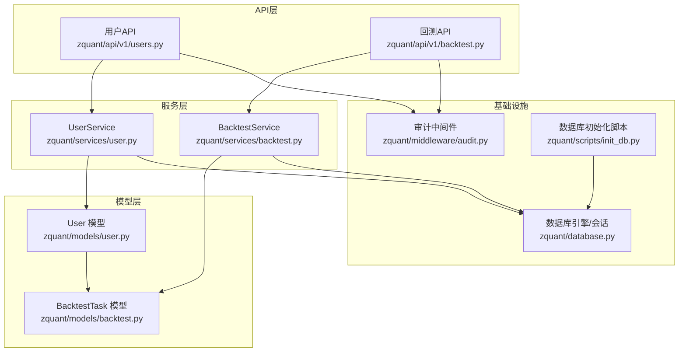
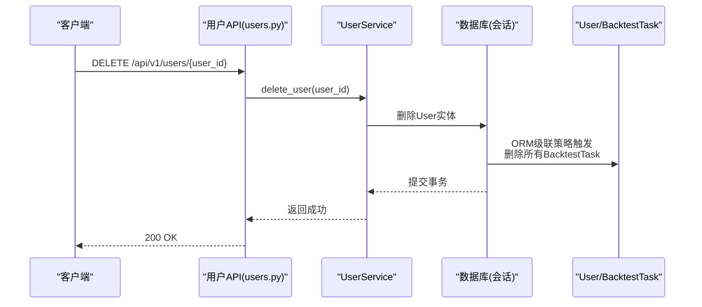
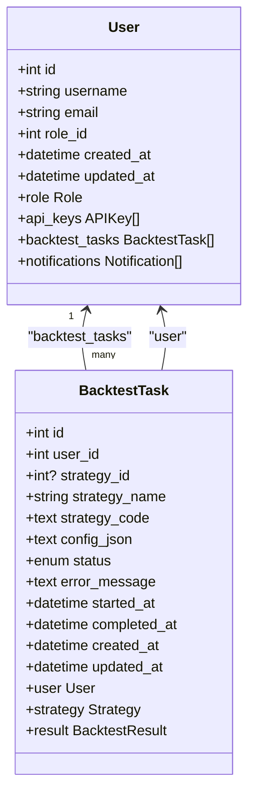
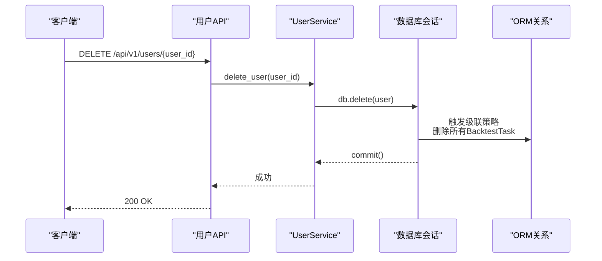
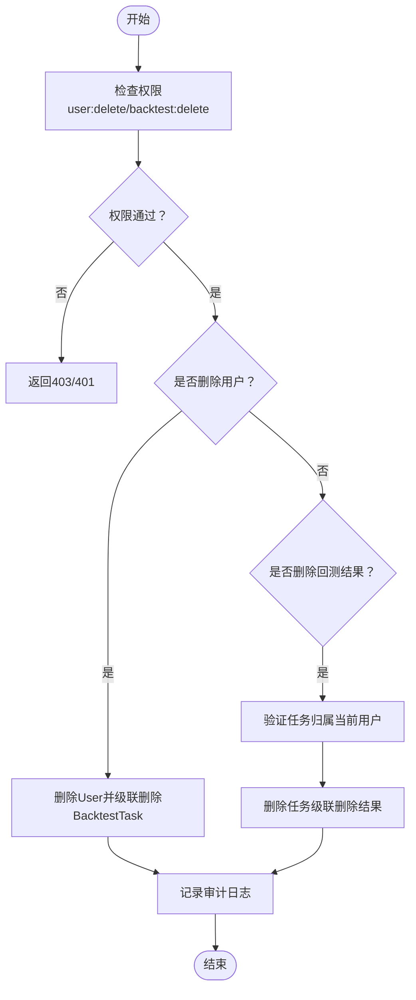
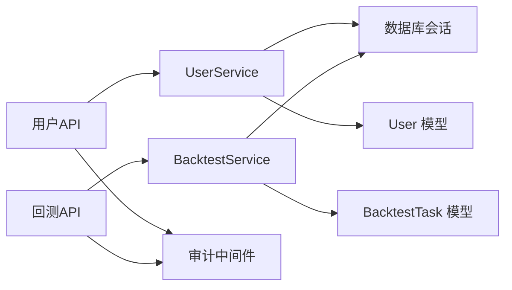

# 用户与回测任务关系

<cite>
**本文引用的文件**
- [zquant/models/user.py](file://zquant/models/user.py)
- [zquant/models/backtest.py](file://zquant/models/backtest.py)
- [zquant/services/user.py](file://zquant/services/user.py)
- [zquant/services/backtest.py](file://zquant/services/backtest.py)
- [zquant/api/v1/users.py](file://zquant/api/v1/users.py)
- [zquant/api/v1/backtest.py](file://zquant/api/v1/backtest.py)
- [zquant/database.py](file://zquant/database.py)
- [zquant/middleware/audit.py](file://zquant/middleware/audit.py)
- [zquant/scripts/init_db.py](file://zquant/scripts/init_db.py)
</cite>

## 目录
1. [引言](#引言)
2. [项目结构](#项目结构)
3. [核心组件](#核心组件)
4. [架构总览](#架构总览)
5. [详细组件分析](#详细组件分析)
6. [依赖分析](#依赖分析)
7. [性能考虑](#性能考虑)
8. [故障排查指南](#故障排查指南)
9. [结论](#结论)

## 引言
本文件聚焦于用户(User)与回测任务(BacktestTask)之间的数据库关系，系统性解析以下关键点：
- User模型中backtest_tasks关系字段的配置与级联策略“all, delete-orphan”的作用机制及数据一致性意义
- BacktestTask模型中user_id外键与user关系映射的一对多关联在ORM层面的实现
- 用户删除时的级联删除流程示例（通过代码片段路径定位）
- updated_at字段的onupdate触发器如何确保时间戳同步
- 该关系在业务逻辑中的重要性：权限控制、数据隔离与审计追踪

## 项目结构
围绕用户与回测任务关系的关键文件分布如下：
- 模型层：用户与回测相关模型定义
- 服务层：用户与回测的服务接口，体现业务流程
- API层：对外暴露的REST接口，承载权限控制与资源隔离
- 中间件：审计日志中间件，记录敏感操作
- 数据库与初始化：声明式ORM基类、会话管理与数据库初始化脚本

图表来源
- [zquant/models/user.py](file://zquant/models/user.py#L74-L113)
- [zquant/models/backtest.py](file://zquant/models/backtest.py#L48-L70)
- [zquant/services/user.py](file://zquant/services/user.py#L209-L222)
- [zquant/services/backtest.py](file://zquant/services/backtest.py#L180-L214)
- [zquant/api/v1/users.py](file://zquant/api/v1/users.py#L197-L208)
- [zquant/api/v1/backtest.py](file://zquant/api/v1/backtest.py#L390-L424)
- [zquant/database.py](file://zquant/database.py#L39-L110)
- [zquant/middleware/audit.py](file://zquant/middleware/audit.py#L36-L160)
- [zquant/scripts/init_db.py](file://zquant/scripts/init_db.py#L94-L110)

章节来源
- [zquant/models/user.py](file://zquant/models/user.py#L74-L113)
- [zquant/models/backtest.py](file://zquant/models/backtest.py#L48-L70)
- [zquant/database.py](file://zquant/database.py#L39-L110)

## 核心组件
- User模型
  - 定义backtest_tasks关系，使用cascade="all, delete-orphan"，确保用户删除时自动级联删除其所有回测任务；同时孤儿对象也会被自动删除，维持数据一致性。
  - updated_at字段配置onupdate触发器，保证每次更新都会同步更新时间戳。
- BacktestTask模型
  - user_id外键指向用户表主键，建立与User的一对多关系。
  - user关系映射back_populates="backtest_tasks"，形成双向关联。
  - updated_at字段同样配置onupdate触发器，确保任务状态变更时时间戳同步。
- UserService.delete_user
  - 提供删除用户的入口，调用数据库会话删除User实体，随后由ORM级联策略触发删除所有关联的BacktestTask。
- BacktestService.get_user_tasks
  - 通过user_id过滤回测任务，体现资源隔离：每个用户只能看到自己的回测任务。

章节来源
- [zquant/models/user.py](file://zquant/models/user.py#L88-L94)
- [zquant/models/backtest.py](file://zquant/models/backtest.py#L54-L69)
- [zquant/services/user.py](file://zquant/services/user.py#L209-L222)
- [zquant/services/backtest.py](file://zquant/services/backtest.py#L180-L214)

## 架构总览
用户与回测任务关系在系统中的交互路径如下：

图表来源
- [zquant/api/v1/users.py](file://zquant/api/v1/users.py#L197-L208)
- [zquant/services/user.py](file://zquant/services/user.py#L209-L222)
- [zquant/models/user.py](file://zquant/models/user.py#L88-L94)
- [zquant/models/backtest.py](file://zquant/models/backtest.py#L54-L69)

## 详细组件分析

### User与BacktestTask的ORM关系设计
- User.backtest_tasks
  - 双向关系：User.backtest_tasks 与 BacktestTask.user
  - 级联策略：cascade="all, delete-orphan"
    - all：对父对象的任何持久化操作（新增、更新、删除）都会传播到子对象
    - delete-orphan：当子对象不再与父对象关联时，自动删除子对象，防止悬挂数据
  - 作用：用户删除时，所有关联的回测任务会被级联删除；若某任务不再属于该用户，也会被自动清理
- BacktestTask.user_id
  - 外键约束：指向zq_app_users.id
  - 关系映射：back_populates="backtest_tasks"，形成完整的一对多双向关联
- 时间戳同步：updated_at字段均配置onupdate=func.now()，确保每次更新都会同步更新时间戳

图表来源
- [zquant/models/user.py](file://zquant/models/user.py#L74-L113)
- [zquant/models/backtest.py](file://zquant/models/backtest.py#L48-L70)

章节来源
- [zquant/models/user.py](file://zquant/models/user.py#L88-L94)
- [zquant/models/backtest.py](file://zquant/models/backtest.py#L54-L69)

### 级联删除流程示例（用户删除）
- API入口
  - 用户删除API：DELETE /api/v1/users/{user_id}
  - 权限校验：需要user:delete权限
- 服务层
  - UserService.delete_user：根据user_id查询用户，删除User实体并提交事务
- ORM级联
  - User.backtest_tasks配置cascade="all, delete-orphan"，删除User时自动删除所有BacktestTask
- 结果
  - 用户与其所有回测任务被彻底清理，避免悬挂数据

图表来源
- [zquant/api/v1/users.py](file://zquant/api/v1/users.py#L197-L208)
- [zquant/services/user.py](file://zquant/services/user.py#L209-L222)
- [zquant/models/user.py](file://zquant/models/user.py#L88-L94)

章节来源
- [zquant/api/v1/users.py](file://zquant/api/v1/users.py#L197-L208)
- [zquant/services/user.py](file://zquant/services/user.py#L209-L222)

### updated_at onupdate触发器与时间戳同步
- User.updated_at
  - default=func.now()：首次创建时设置创建时间
  - onupdate=func.now()：后续更新时自动更新updated_at
- BacktestTask.updated_at
  - 同样配置onupdate=func.now()，确保任务状态变更（如运行中、完成、失败）时时间戳同步
- 实践意义
  - 便于审计追踪：记录数据的最后修改时间
  - 业务排序：按updated_at排序展示最新任务
  - 数据一致性：避免手工维护时间戳导致的不一致

章节来源
- [zquant/models/user.py](file://zquant/models/user.py#L86-L86)
- [zquant/models/backtest.py](file://zquant/models/backtest.py#L64-L64)

### 业务逻辑中的重要性：权限控制、数据隔离与审计追踪
- 权限控制
  - 用户删除API需要user:delete权限，防止未授权删除
  - 回测结果删除API需要backtest:delete权限，且需验证任务归属当前用户
- 数据隔离
  - BacktestService.get_user_tasks与BacktestService.get_result均通过user_id过滤，确保用户只能访问自己的回测任务与结果
- 审计追踪
  - 审计中间件记录敏感操作（如用户管理、回测管理），包含方法、路径、状态码、用户信息、客户端IP等，便于问题追溯与合规审计

图表来源
- [zquant/api/v1/users.py](file://zquant/api/v1/users.py#L197-L208)
- [zquant/api/v1/backtest.py](file://zquant/api/v1/backtest.py#L416-L424)
- [zquant/services/backtest.py](file://zquant/services/backtest.py#L180-L214)
- [zquant/middleware/audit.py](file://zquant/middleware/audit.py#L36-L160)

章节来源
- [zquant/api/v1/users.py](file://zquant/api/v1/users.py#L197-L208)
- [zquant/api/v1/backtest.py](file://zquant/api/v1/backtest.py#L416-L424)
- [zquant/services/backtest.py](file://zquant/services/backtest.py#L180-L214)
- [zquant/middleware/audit.py](file://zquant/middleware/audit.py#L36-L160)

## 依赖分析
- 组件耦合
  - User与BacktestTask通过外键user_id建立强依赖，ORM关系配置确保数据一致性
  - UserService与BacktestService分别封装用户与回测的业务流程，API层负责权限校验与资源隔离
- 外部依赖
  - SQLAlchemy ORM：声明式模型、关系映射、级联策略
  - 数据库引擎与会话管理：统一的会话生命周期与异常处理
  - 审计中间件：统一记录敏感操作

图表来源
- [zquant/api/v1/users.py](file://zquant/api/v1/users.py#L197-L208)
- [zquant/api/v1/backtest.py](file://zquant/api/v1/backtest.py#L390-L424)
- [zquant/services/user.py](file://zquant/services/user.py#L209-L222)
- [zquant/services/backtest.py](file://zquant/services/backtest.py#L180-L214)
- [zquant/models/user.py](file://zquant/models/user.py#L74-L113)
- [zquant/models/backtest.py](file://zquant/models/backtest.py#L48-L70)
- [zquant/middleware/audit.py](file://zquant/middleware/audit.py#L36-L160)
- [zquant/database.py](file://zquant/database.py#L39-L110)

章节来源
- [zquant/database.py](file://zquant/database.py#L39-L110)
- [zquant/models/user.py](file://zquant/models/user.py#L74-L113)
- [zquant/models/backtest.py](file://zquant/models/backtest.py#L48-L70)

## 性能考虑
- 级联删除的代价
  - 用户删除时会触发大量回测任务的删除，建议在批量删除场景下评估数据库压力与锁竞争
- 查询隔离
  - 通过user_id过滤回测任务与结果，避免全表扫描，提升查询性能
- 时间戳更新
  - onupdate触发器在每次更新时写入数据库，建议在高频更新场景下关注写放大

## 故障排查指南
- 用户删除后仍有回测任务残留
  - 检查User.backtest_tasks是否配置了cascade="all, delete-orphan"
  - 确认删除流程是否提交事务并捕获异常
  - 参考路径：[User.backtest_tasks关系](file://zquant/models/user.py#L88-L94)，[UserService.delete_user](file://zquant/services/user.py#L209-L222)
- 回测结果删除无效
  - 确认API权限与资源归属校验逻辑
  - 参考路径：[回测结果删除API](file://zquant/api/v1/backtest.py#L416-L424)，[BacktestService.delete_result](file://zquant/services/backtest.py#L260-L278)
- 审计日志缺失
  - 检查审计中间件是否启用与敏感路径匹配
  - 参考路径：[AuditMiddleware](file://zquant/middleware/audit.py#L36-L160)
- 数据库初始化问题
  - 确认表结构创建与角色权限初始化是否成功
  - 参考路径：[init_database](file://zquant/scripts/init_db.py#L94-L110)

章节来源
- [zquant/models/user.py](file://zquant/models/user.py#L88-L94)
- [zquant/services/user.py](file://zquant/services/user.py#L209-L222)
- [zquant/api/v1/backtest.py](file://zquant/api/v1/backtest.py#L416-L424)
- [zquant/services/backtest.py](file://zquant/services/backtest.py#L260-L278)
- [zquant/middleware/audit.py](file://zquant/middleware/audit.py#L36-L160)
- [zquant/scripts/init_db.py](file://zquant/scripts/init_db.py#L94-L110)

## 结论
- User与BacktestTask之间通过外键user_id与双向关系映射形成清晰的一对多关联
- User.backtest_tasks采用cascade="all, delete-orphan"，确保用户删除时自动清理其全部回测任务，有效维护数据一致性
- updated_at的onupdate触发器保障时间戳同步，便于审计与排序
- 权限控制与资源隔离贯穿API与服务层，配合审计中间件，满足业务安全与合规要求