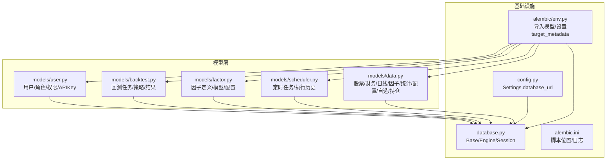
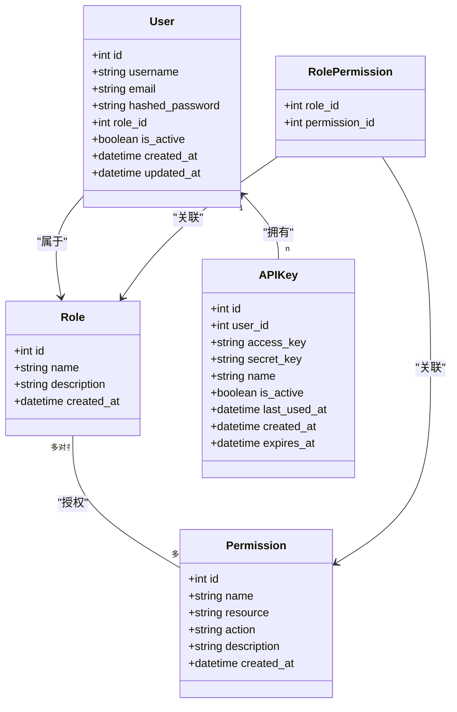
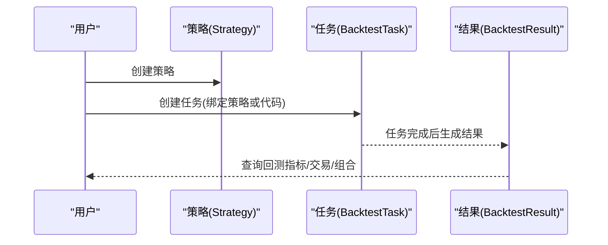
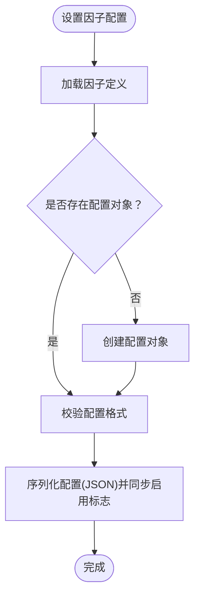
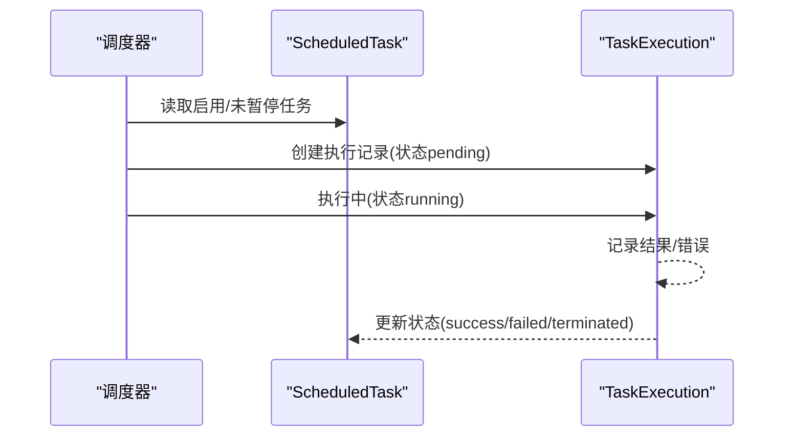
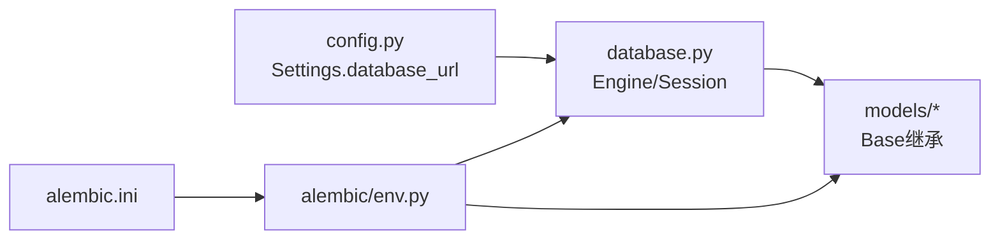

# 数据库模式设计

<cite>
**本文引用的文件**
- [zquant/models/__init__.py](file://zquant/models/__init__.py)
- [zquant/models/user.py](file://zquant/models/user.py)
- [zquant/models/backtest.py](file://zquant/models/backtest.py)
- [zquant/models/factor.py](file://zquant/models/factor.py)
- [zquant/models/scheduler.py](file://zquant/models/scheduler.py)
- [zquant/models/data.py](file://zquant/models/data.py)
- [zquant/alembic/env.py](file://zquant/alembic/env.py)
- [zquant/alembic.ini](file://zquant/alembic.ini)
- [zquant/database.py](file://zquant/database.py)
- [zquant/config.py](file://zquant/config.py)
</cite>

## 目录
1. [简介](#简介)
2. [项目结构](#项目结构)
3. [核心组件](#核心组件)
4. [架构总览](#架构总览)
5. [详细组件分析](#详细组件分析)
6. [依赖分析](#依赖分析)
7. [性能考虑](#性能考虑)
8. [故障排查指南](#故障排查指南)
9. [结论](#结论)
10. [附录](#附录)

## 简介
本文件面向zquant项目的数据库模式设计，基于SQLAlchemy模型（models/）对核心实体进行权威说明，覆盖用户(User)、回测任务(BacktestTask)、因子(Factor)、定时任务(ScheduledTask)、股票数据(StockData)等。内容包括：
- 每个表的字段定义、数据类型、主外键关系、索引与约束
- 数据库迁移机制（Alembic）如何管理模式变更
- ER图（实体关系图）可视化整体数据模型
- 数据访问模式与高频查询优化策略
- 示例数据记录帮助理解数据结构

## 项目结构
数据库层由以下关键模块组成：
- 模型定义：位于 zquant/models/ 下，统一继承自 zquant/database.py 中的 Base
- 连接与会话：zquant/database.py 提供引擎、会话工厂与上下文管理
- 配置：zquant/config.py 提供数据库URL构建与连接池参数
- 迁移：zquant/alembic/ 通过 env.py 注入模型元数据，实现自动化迁移



**图表来源**
- [zquant/models/user.py](file://zquant/models/user.py#L1-L113)
- [zquant/models/backtest.py](file://zquant/models/backtest.py#L1-L119)
- [zquant/models/factor.py](file://zquant/models/factor.py#L1-L267)
- [zquant/models/scheduler.py](file://zquant/models/scheduler.py#L1-L203)
- [zquant/models/data.py](file://zquant/models/data.py#L1-L1227)
- [zquant/database.py](file://zquant/database.py#L1-L155)
- [zquant/config.py](file://zquant/config.py#L1-L166)
- [zquant/alembic/env.py](file://zquant/alembic/env.py#L1-L71)
- [zquant/alembic.ini](file://zquant/alembic.ini#L1-L45)

**章节来源**
- [zquant/models/__init__.py](file://zquant/models/__init__.py#L1-L63)
- [zquant/database.py](file://zquant/database.py#L1-L155)
- [zquant/config.py](file://zquant/config.py#L1-L166)
- [zquant/alembic/env.py](file://zquant/alembic/env.py#L1-L71)
- [zquant/alembic.ini](file://zquant/alembic.ini#L1-L45)

## 核心组件
本节概述各核心实体及其职责边界，并给出字段与关系概览。

- 用户(User)：用户基本信息、角色关联、API密钥、回测任务、策略、通知
- 回测任务(BacktestTask)：回测任务、策略、结果
- 因子(Factor)：因子定义、因子模型、因子配置
- 定时任务(ScheduledTask)：定时任务配置、执行历史
- 股票数据(StockData)：股票基础、交易日历、日线、日线指标、技术因子、专业版因子、统计、配置、自选、持仓、数据同步日志

**章节来源**
- [zquant/models/user.py](file://zquant/models/user.py#L1-L113)
- [zquant/models/backtest.py](file://zquant/models/backtest.py#L1-L119)
- [zquant/models/factor.py](file://zquant/models/factor.py#L1-L267)
- [zquant/models/scheduler.py](file://zquant/models/scheduler.py#L1-L203)
- [zquant/models/data.py](file://zquant/models/data.py#L1-L1227)

## 架构总览
下图展示核心实体之间的关系，包括主外键、索引与典型查询路径。

```mermaid
erDiagram
ZQ_APP_USERS {
int id PK
string username UK
string email UK
string hashed_password
int role_id FK
boolean is_active
datetime created_at
datetime updated_at
}
ZQ_APP_ROLES {
int id PK
string name UK
string description
datetime created_at
}
ZQ_APP_PERMISSIONS {
int id PK
string name UK
string resource
string action
string description
datetime created_at
}
ZQ_APP_ROLE_PERMISSIONS {
int role_id PK FK
int permission_id PK FK
}
ZQ_APP_APIKEYS {
int id PK
int user_id FK
string access_key UK
string secret_key
string name
boolean is_active
datetime last_used_at
datetime created_at
datetime expires_at
}
ZQ_BACKTEST_STRATEGIES {
int id PK
int user_id FK
string name
text description
string category
text code
text params_schema
boolean is_template
datetime created_at
datetime updated_at
}
ZQ_BACKTEST_TASKS {
int id PK
int user_id FK
int strategy_id FK
text strategy_code
string strategy_name
text config_json
enum status
text error_message
datetime started_at
datetime completed_at
datetime created_at
datetime updated_at
}
ZQ_BACKTEST_RESULTS {
int id PK
int task_id UK FK
double total_return
double annual_return
double max_drawdown
double sharpe_ratio
double win_rate
double profit_loss_ratio
double alpha
double beta
text metrics_json
text trades_json
text portfolio_json
datetime created_at
}
ZQ_QUANT_FACTOR_DEFINITIONS {
int id PK
string factor_name UK
string cn_name
string en_name
string column_name
text description
boolean enabled
datetime created_at
datetime updated_at
}
ZQ_QUANT_FACTOR_MODELS {
int id PK
int factor_id FK
string model_name
string model_code
text config_json
boolean is_default
boolean enabled
datetime created_at
datetime updated_at
}
ZQ_QUANT_FACTOR_CONFIGS {
int factor_id PK FK
text config_json
boolean enabled
string created_by
datetime created_at
string updated_by
datetime updated_at
}
ZQ_TASK_SCHEDULED_TASKS {
int id PK
string name UK
string job_id UK
enum task_type
string cron_expression
int interval_seconds
boolean enabled
boolean paused
text description
text config_json
int max_retries
int retry_interval
datetime created_at
datetime updated_at
}
ZQ_TASK_TASK_EXECUTIONS {
int id PK
int task_id
enum status
datetime start_time
datetime end_time
int duration_seconds
text result_json
text error_message
int retry_count
datetime created_at
}
ZQ_DATA_TUSTOCK_STOCKBASIC {
string ts_code PK
string symbol
string name
string area
string industry
string fullname
string enname
string cnspell
string market
string exchange
string curr_type
string list_status
date list_date
date delist_date
string is_hs
string act_name
string act_ent_type
string created_by
datetime created_time
string updated_by
datetime updated_time
}
ZQ_DATA_FUNDAMENTALS {
int id PK
string symbol FK
date report_date
string statement_type
text data_json
datetime created_at
datetime updated_at
unique uq_zq_data_fundamentals_symbol_date_type(symbol, report_date, statement_type)
index idx_zq_data_fundamentals_symbol_date(symbol, report_date)
}
ZQ_DATA_TUSTOCK_TRADECAL {
int id PK
string exchange
date cal_date
smallint is_open
date pretrade_date
string created_by
datetime created_time
string updated_by
datetime updated_time
unique uq_tustock_tradecal_exchange_date(exchange, cal_date)
index idx_tustock_tradecal_exchange_date(exchange, cal_date)
}
ZQ_DATA_TUSTOCK_DAILY_XXXX {
int id PK
string ts_code
date trade_date
double open
double high
double low
double close
double pre_close
double change
double pct_chg
double vol
double amount
string created_by
datetime created_time
string updated_by
datetime updated_time
unique uq_tustock_daily_XXXX_ts_code_date(ts_code, trade_date)
index idx_tustock_daily_XXXX_ts_code_date(ts_code, trade_date)
}
ZQ_DATA_TUSTOCK_DAILY_BASIC_XXXX {
int id PK
string ts_code
date trade_date
double close
double turnover_rate
double turnover_rate_f
double volume_ratio
double pe
double pe_ttm
double pb
double ps
double ps_ttm
double dv_ratio
double dv_ttm
double total_share
double float_share
double free_share
double total_mv
double circ_mv
string created_by
datetime created_time
string updated_by
datetime updated_time
unique uq_tustock_daily_basic_XXXX_ts_code_date(ts_code, trade_date)
index idx_tustock_daily_basic_XXXX_ts_code_date(ts_code, trade_date)
}
ZQ_DATA_TUSTOCK_FACTOR_XXXX {
int id PK
string ts_code
date trade_date
double close
double open
double high
double low
double pre_close
double change
double pct_change
double vol
double amount
double adj_factor
double open_hfq
double open_qfq
double close_hfq
double close_qfq
double high_hfq
double high_qfq
double low_hfq
double low_qfq
double pre_close_hfq
double pre_close_qfq
double macd_dif
double macd_dea
double macd
double kdj_k
double kdj_d
double kdj_j
double rsi_6
double rsi_12
double rsi_24
double boll_upper
double boll_mid
double boll_lower
double cci
string created_by
datetime created_time
string updated_by
datetime updated_time
unique uq_tustock_factor_XXXX_ts_code_date(ts_code, trade_date)
index idx_tustock_factor_XXXX_ts_code_date(ts_code, trade_date)
}
ZQ_DATA_TUSTOCK_STKFACTORPRO_XXXX {
int id PK
string ts_code
date trade_date
double open
double open_hfq
double open_qfq
double high
double high_hfq
double high_qfq
double low
double low_hfq
double low_qfq
double close
double close_hfq
double close_qfq
double pre_close
double change
double pct_chg
double vol
double amount
double turnover_rate
double turnover_rate_f
double volume_ratio
double pe
double pe_ttm
double pb
double ps
double ps_ttm
double dv_ratio
double dv_ttm
double total_share
double float_share
double free_share
double total_mv
double circ_mv
double adj_factor
double ... 技术指标 ...
string created_by
datetime created_time
string updated_by
datetime updated_time
unique uq_tustock_stkfactorpro_XXXX_ts_code_date(ts_code, trade_date)
index idx_tustock_stkfactorpro_XXXX_ts_code_date(ts_code, trade_date)
}
ZQ_STATS_APISYNC {
bigint id PK
string table_name
string operation_type
bigint insert_count
bigint update_count
bigint delete_count
string operation_result
string error_message
datetime start_time
datetime end_time
float duration_seconds
string created_by
datetime created_time
}
ZQ_STATS_STATISTICS {
date stat_date PK
string table_name PK
boolean is_split_table
int split_count
bigint total_records
bigint daily_records
bigint daily_insert_count
bigint daily_update_count
string created_by
datetime created_time
string updated_by
datetime updated_time
unique uq_table_statistics_date_name(stat_date, table_name)
index idx_table_statistics_date(stat_date)
index idx_table_statistics_name(table_name)
}
ZQ_APP_CONFIGS {
string config_key PK
string config_value
string comment
string created_by
datetime created_time
string updated_by
datetime updated_time
index idx_config_key(config_key)
}
ZQ_QUANT_FAVORITE {
int id PK
int user_id FK
datetime fav_datettime
string code
string comment
string created_by
datetime created_time
string updated_by
datetime updated_time
unique uq_stock_favorite_user_code(user_id, code)
index idx_stock_favorite_user_id(user_id)
index idx_stock_favorite_code(code)
index idx_stock_favorite_datettime(fav_datettime)
}
ZQ_QUANT_POSITION {
int id PK
int user_id FK
string code
double quantity
numeric avg_cost
date buy_date
double current_price
double market_value
double profit
numeric profit_pct
string comment
string created_by
datetime created_time
string updated_by
datetime updated_time
unique uq_stock_position_user_code(user_id, code)
index idx_stock_position_user_id(user_id)
index idx_stock_position_code(code)
index idx_stock_position_buy_date(buy_date)
}
ZQ_APP_USERS ||--o{ ZQ_APP_APIKEYS : "拥有"
ZQ_APP_USERS ||--o{ ZQ_BACKTEST_TASKS : "创建"
ZQ_APP_USERS ||--o{ ZQ_BACKTEST_STRATEGIES : "创建"
ZQ_APP_USERS ||--o{ ZQ_QUANT_FAVORITE : "收藏"
ZQ_APP_USERS ||--o{ ZQ_QUANT_POSITION : "持有"
ZQ_APP_ROLES ||--o{ ZQ_APP_USERS : "分配"
ZQ_APP_ROLES ||--o{ ZQ_APP_ROLE_PERMISSIONS : "授权"
ZQ_APP_PERMISSIONS ||--o{ ZQ_APP_ROLE_PERMISSIONS : "授权"
ZQ_BACKTEST_STRATEGIES ||--o{ ZQ_BACKTEST_TASKS : "被引用"
ZQ_BACKTEST_TASKS ||--|| ZQ_BACKTEST_RESULTS : "产生"
ZQ_QUANT_FACTOR_DEFINITIONS ||--o{ ZQ_QUANT_FACTOR_MODELS : "定义"
ZQ_QUANT_FACTOR_DEFINITIONS ||--|| ZQ_QUANT_FACTOR_CONFIGS : "配置"
ZQ_DATA_TUSTOCK_STOCKBASIC ||--o{ ZQ_DATA_FUNDAMENTALS : "财务"
ZQ_TASK_SCHEDULED_TASKS ||--o{ ZQ_TASK_TASK_EXECUTIONS : "执行"
```

**图表来源**
- [zquant/models/user.py](file://zquant/models/user.py#L1-L113)
- [zquant/models/backtest.py](file://zquant/models/backtest.py#L1-L119)
- [zquant/models/factor.py](file://zquant/models/factor.py#L1-L267)
- [zquant/models/scheduler.py](file://zquant/models/scheduler.py#L1-L203)
- [zquant/models/data.py](file://zquant/models/data.py#L1-L1227)

## 详细组件分析

### 用户(User)与权限(Role/Permission/APIKey)
- 表：zq_app_users、zq_app_roles、zq_app_permissions、zq_app_role_permissions、zq_app_apikeys
- 关键字段与约束
  - 用户表：主键id；用户名/邮箱唯一索引；外键role_id；活跃状态；时间戳
  - 角色表：主键id；名称唯一索引；描述；时间戳
  - 权限表：主键id；权限名唯一索引；资源与动作；描述；时间戳
  - 角色权限关联：联合主键(role_id, permission_id)，外键约束
  - API密钥表：主键id；用户外键；访问密钥唯一索引；名称/状态/过期时间/最后使用时间；时间戳
- 关系
  - 用户属于一个角色；角色拥有多个权限（多对多通过中间表）
  - 用户拥有多个API密钥（级联删除）
  - 用户创建回测任务/策略/通知（级联删除）



**图表来源**
- [zquant/models/user.py](file://zquant/models/user.py#L1-L113)

**章节来源**
- [zquant/models/user.py](file://zquant/models/user.py#L1-L113)

### 回测任务(BacktestTask)与策略(Strategy)/结果(BacktestResult)
- 表：zq_backtest_tasks、zq_backtest_strategies、zq_backtest_results
- 关键字段与约束
  - 任务表：主键id；用户外键；策略外键（可空）；策略代码/名称；配置JSON；状态枚举；时间戳
  - 策略表：主键id；用户外键；名称/描述/分类；策略代码；参数Schema；模板标记；时间戳
  - 结果表：主键id；任务唯一外键；收益/夏普/胜率/盈亏比/Alpha/Beta等指标；指标/交易/组合JSON；时间戳
- 关系
  - 任务属于用户；可关联策略；一对一结果
  - 策略属于用户



**图表来源**
- [zquant/models/backtest.py](file://zquant/models/backtest.py#L1-L119)

**章节来源**
- [zquant/models/backtest.py](file://zquant/models/backtest.py#L1-L119)

### 因子(Factor)定义/模型/配置
- 表：zq_quant_factor_definitions、zq_quant_factor_models、zq_quant_factor_configs
- 关键字段与约束
  - 定义表：主键id；因子名唯一索引；中文/英文简称；列名；启用标志；时间戳
  - 模型表：主键id；因子外键；模型名/代码；配置JSON；默认/启用标志；时间戳
  - 配置表：因子主键；配置JSON；启用标志；创建/修改人；时间戳
- 索引
  - 定义表：因子名、启用标志
  - 模型表：因子id、模型代码、默认、启用标志
  - 配置表：因子id、启用标志
- 方法
  - 定义/模型提供JSON配置读写与校验
  - 配置提供映射列表与兼容性方法



**图表来源**
- [zquant/models/factor.py](file://zquant/models/factor.py#L1-L267)

**章节来源**
- [zquant/models/factor.py](file://zquant/models/factor.py#L1-L267)

### 定时任务(ScheduledTask)与执行历史(TaskExecution)
- 表：zq_task_scheduled_tasks、zq_task_task_executions
- 关键字段与约束
  - 任务表：主键id；名称/作业ID唯一索引；任务类型；Cron/间隔；启用/暂停；描述；配置JSON；重试次数/间隔；时间戳
  - 执行表：主键id；任务id；状态；开始/结束时间；时长；结果JSON；错误信息；重试次数；时间戳
- 关系
  - 任务包含多次执行记录（倒序排序）
  - 执行记录不建立外键，避免删除任务时级联影响



**图表来源**
- [zquant/models/scheduler.py](file://zquant/models/scheduler.py#L1-L203)

**章节来源**
- [zquant/models/scheduler.py](file://zquant/models/scheduler.py#L1-L203)

### 股票数据(StockData)与分表/视图
- 表族
  - 基础信息：zq_data_tustock_stockbasic（ts_code主键）
  - 交易日历：zq_data_tustock_tradecal（唯一约束：交易所+日期）
  - 日线：zq_data_tustock_daily_XXXX（按ts_code分表，唯一约束：ts_code+trade_date）
  - 日线指标：zq_data_tustock_daily_basic_XXXX（唯一约束：ts_code+trade_date）
  - 技术因子：zq_data_tustock_factor_XXXX（唯一约束：ts_code+trade_date）
  - 专业版因子：zq_data_tustock_stkfactorpro_XXXX（唯一约束：ts_code+trade_date）
  - 自定义因子：zq_quant_factor_spacex_XXXX（唯一约束：ts_code+trade_date）
- 统计与配置
  - 数据同步日志：zq_stats_apisync
  - 表统计：zq_stats_statistics（唯一约束：stat_date+table_name）
  - 应用配置：zq_app_configs（主键config_key）
  - 自选/持仓：zq_quant_favorite、zq_quant_position（唯一约束：user_id+code）
- 动态类
  - models/data.py 提供按ts_code动态生成分表类的方法，统一约束与索引命名

```mermaid
classDiagram
class Tustock {
+string ts_code PK
+string symbol
+string name
+...
}
class TustockTradecal {
+int id PK
+string exchange
+date cal_date
+smallint is_open
+unique(uq_tustock_tradecal_exchange_date)
+index(idx_tustock_tradecal_exchange_date)
}
class TustockDaily {
+int id PK
+string ts_code
+date trade_date
+double open
+double high
+double low
+double close
+unique(uq_tustock_daily_ts_code_date)
+index(idx_tustock_daily_ts_code_date)
}
class TustockDailyBasic {
+int id PK
+string ts_code
+date trade_date
+double close
+double turnover_rate
+...
+unique(uq_tustock_daily_basic_ts_code_date)
+index(idx_tustock_daily_basic_ts_code_date)
}
class TustockFactor {
+int id PK
+string ts_code
+date trade_date
+double ... 技术指标 ...
+unique(uq_tustock_factor_ts_code_date)
+index(idx_tustock_factor_ts_code_date)
}
class TustockStkFactorPro {
+int id PK
+string ts_code
+date trade_date
+double ... 专业指标 ...
+unique(uq_tustock_stkfactorpro_ts_code_date)
+index(idx_tustock_stkfactorpro_ts_code_date)
}
class DataOperationLog {
+bigint id PK
+string table_name
+string operation_type
+bigint insert_count
+bigint update_count
+bigint delete_count
+string operation_result
+datetime start_time
+datetime end_time
+float duration_seconds
+datetime created_time
}
class TableStatistics {
+date stat_date PK
+string table_name PK
+boolean is_split_table
+int split_count
+bigint total_records
+bigint daily_records
+unique(uq_table_statistics_date_name)
+index(idx_table_statistics_date)
+index(idx_table_statistics_name)
}
class Config {
+string config_key PK
+string config_value
+string comment
+index(idx_config_key)
}
class StockFavorite {
+int id PK
+int user_id
+datetime fav_datettime
+string code
+unique(uq_stock_favorite_user_code)
+index(idx_stock_favorite_user_id)
+index(idx_stock_favorite_code)
+index(idx_stock_favorite_datettime)
}
class StockPosition {
+int id PK
+int user_id
+string code
+double quantity
+numeric avg_cost
+date buy_date
+double current_price
+double market_value
+double profit
+numeric profit_pct
+unique(uq_stock_position_user_code)
+index(idx_stock_position_user_id)
+index(idx_stock_position_code)
+index(idx_stock_position_buy_date)
}
Tustock ||--o{ Fundamental : "财务"
```

**图表来源**
- [zquant/models/data.py](file://zquant/models/data.py#L1-L1227)

**章节来源**
- [zquant/models/data.py](file://zquant/models/data.py#L1-L1227)

## 依赖分析
- 模型依赖
  - 所有模型继承自 zquant/database.py 的 Base
  - Alembic env.py 导入 models/__init__.py，从而扫描全部模型并设置 target_metadata
- 连接与会话
  - database.py 基于 config.py 的 Settings.database_url 构建引擎
  - 提供 get_db()/get_db_context() 两种会话管理方式
- 迁移流程
  - alembic.ini 指定脚本位置与日志
  - env.py 读取 settings.database_url，注入 Base.metadata 到 Alembic



**图表来源**
- [zquant/config.py](file://zquant/config.py#L1-L166)
- [zquant/database.py](file://zquant/database.py#L1-L155)
- [zquant/alembic/env.py](file://zquant/alembic/env.py#L1-L71)
- [zquant/alembic.ini](file://zquant/alembic.ini#L1-L45)

**章节来源**
- [zquant/config.py](file://zquant/config.py#L1-L166)
- [zquant/database.py](file://zquant/database.py#L1-L155)
- [zquant/alembic/env.py](file://zquant/alembic/env.py#L1-L71)
- [zquant/alembic.ini](file://zquant/alembic.ini#L1-L45)

## 性能考虑
- 索引与唯一约束
  - 高频查询字段（如用户id、股票代码、日期、状态枚举）均建立索引
  - 分表场景下，唯一约束保证幂等写入，减少重复数据
- 连接池与超时
  - database.py 使用连接池参数（大小、溢出、回收、超时、预检）提升并发稳定性
- JSON字段
  - 回测结果、因子配置、财务数据采用JSON存储，便于扩展但需注意查询与序列化开销
- 分表策略
  - 按 ts_code 动态分表，降低单表热点与锁竞争，适合高频写入的日线/因子数据
- 执行结果压缩
  - 定时任务执行结果仅保留必要字段，避免大体积JSON写入

[本节为通用指导，无需特定文件来源]

## 故障排查指南
- 迁移失败
  - 检查 alembic.ini 的脚本位置与日志配置
  - 确认 env.py 已正确注入 models 并设置 target_metadata
  - 使用 settings.database_url 连接数据库，确认凭据与网络可达
- 连接异常
  - 查看 database.py 的连接池事件日志与超时参数
  - 使用 get_db_context() 确保事务提交/回滚与会话关闭
- 数据一致性
  - 分表唯一约束冲突时，检查 ts_code 与 trade_date 组合是否重复
  - 财务/日线/因子表的唯一约束确保幂等写入

**章节来源**
- [zquant/alembic/env.py](file://zquant/alembic/env.py#L1-L71)
- [zquant/alembic.ini](file://zquant/alembic.ini#L1-L45)
- [zquant/database.py](file://zquant/database.py#L1-L155)
- [zquant/models/data.py](file://zquant/models/data.py#L1-L1227)

## 结论
本数据库模式围绕用户、回测、因子、定时任务与股票数据五大领域构建，采用分表与索引策略支撑高频写入与查询。通过Alembic统一管理迁移，结合连接池与会话上下文，保障了系统的可维护性与性能。建议在生产环境中：
- 明确各表的索引与唯一约束，避免重复写入
- 对JSON字段的查询与序列化进行性能评估
- 使用分表策略隔离热点数据，定期清理历史数据

[本节为总结，无需特定文件来源]

## 附录

### 数据库迁移机制（Alembic）
- 配置
  - alembic.ini：脚本位置、日志级别
  - env.py：导入模型、设置 target_metadata、读取 settings.database_url
- 流程
  - offline/online 两种迁移模式，自动扫描模型元数据
  - 通过 Alembic 脚本生成与应用，保持数据库结构与模型一致

**章节来源**
- [zquant/alembic/env.py](file://zquant/alembic/env.py#L1-L71)
- [zquant/alembic.ini](file://zquant/alembic.ini#L1-L45)
- [zquant/config.py](file://zquant/config.py#L1-L166)

### 示例数据记录（字段示意）
以下为常见实体的字段示意，便于理解数据结构与关系（非真实数据）：
- 用户：id、username、email、role_id、is_active、created_at、updated_at
- 回测任务：id、user_id、strategy_id、strategy_code、config_json、status、started_at、completed_at、created_at、updated_at
- 因子定义：id、factor_name、column_name、enabled、created_at、updated_at
- 定时任务：id、name、job_id、task_type、cron_expression、interval_seconds、enabled、paused、config_json、max_retries、retry_interval、created_at、updated_at
- 股票基础：ts_code、symbol、name、area、industry、list_status、list_date、delist_date、created_time、updated_time
- 日线数据：ts_code、trade_date、open、high、low、close、vol、amount、created_time、updated_time
- 财务数据：symbol、report_date、statement_type、data_json、created_at、updated_at
- 数据同步日志：table_name、operation_type、insert_count、update_count、delete_count、operation_result、start_time、end_time、duration_seconds、created_time
- 表统计：stat_date、table_name、is_split_table、split_count、total_records、daily_records、daily_insert_count、daily_update_count、created_time、updated_time
- 应用配置：config_key、config_value、comment、created_time、updated_time
- 自选/持仓：user_id、code、fav_datettime/buy_date、quantity、avg_cost、current_price、market_value、profit、profit_pct、comment、created_time、updated_time

**章节来源**
- [zquant/models/user.py](file://zquant/models/user.py#L1-L113)
- [zquant/models/backtest.py](file://zquant/models/backtest.py#L1-L119)
- [zquant/models/factor.py](file://zquant/models/factor.py#L1-L267)
- [zquant/models/scheduler.py](file://zquant/models/scheduler.py#L1-L203)
- [zquant/models/data.py](file://zquant/models/data.py#L1-L1227)