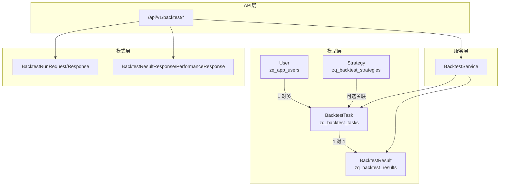
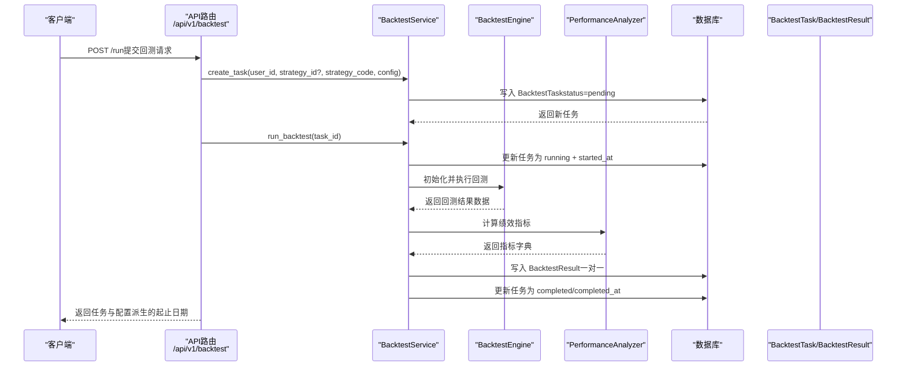
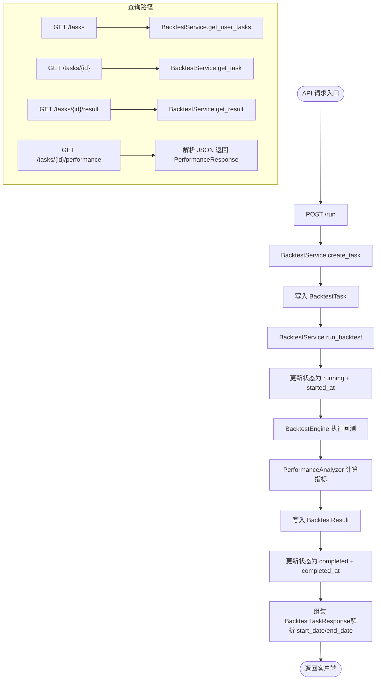
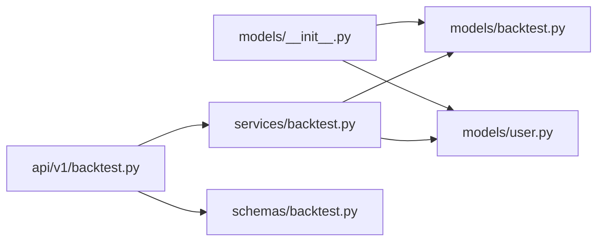

# 回测模型

<cite>
**本文引用的文件**
- [zquant/models/backtest.py](file://zquant/models/backtest.py)
- [zquant/models/user.py](file://zquant/models/user.py)
- [zquant/api/v1/backtest.py](file://zquant/api/v1/backtest.py)
- [zquant/schemas/backtest.py](file://zquant/schemas/backtest.py)
- [zquant/services/backtest.py](file://zquant/services/backtest.py)
- [zquant/models/__init__.py](file://zquant/models/__init__.py)
</cite>

## 目录
1. [简介](#简介)
2. [项目结构](#项目结构)
3. [核心组件](#核心组件)
4. [架构概览](#架构概览)
5. [详细组件分析](#详细组件分析)
6. [依赖分析](#依赖分析)
7. [性能考虑](#性能考虑)
8. [故障排查指南](#故障排查指南)
9. [结论](#结论)

## 简介
本文件围绕 zquant 平台的回测任务模型进行权威说明，聚焦于数据库表 zq_backtest_tasks 的结构与行为，阐述其与 User 模型及 BacktestResult 模型的一对一关系，并结合 API 层如何支撑策略回测的完整生命周期（创建、执行、查询、结果存储）。文档同时给出关键流程图与时序图，帮助读者快速理解模型设计与调用链路。

## 项目结构
回测相关的核心代码分布在以下模块：
- 模型层：zquant/models/backtest.py 定义了 BacktestTask、Strategy、BacktestResult 及状态枚举；zquant/models/user.py 定义 User 及其关系。
- 服务层：zquant/services/backtest.py 提供任务创建、执行、查询与结果管理等业务逻辑。
- API 层：zquant/api/v1/backtest.py 提供对外接口，包括运行回测、查询任务、查询结果、查询绩效报告等。
- 模式层：zquant/schemas/backtest.py 定义请求与响应的 Pydantic 模型。
- 模块导出：zquant/models/__init__.py 统一导出回测相关模型。

图表来源
- [zquant/models/backtest.py](file://zquant/models/backtest.py#L48-L119)
- [zquant/models/user.py](file://zquant/models/user.py#L74-L94)
- [zquant/api/v1/backtest.py](file://zquant/api/v1/backtest.py#L90-L173)
- [zquant/schemas/backtest.py](file://zquant/schemas/backtest.py#L33-L106)
- [zquant/services/backtest.py](file://zquant/services/backtest.py#L43-L178)

章节来源
- [zquant/models/backtest.py](file://zquant/models/backtest.py#L48-L119)
- [zquant/models/user.py](file://zquant/models/user.py#L74-L94)
- [zquant/api/v1/backtest.py](file://zquant/api/v1/backtest.py#L90-L173)
- [zquant/schemas/backtest.py](file://zquant/schemas/backtest.py#L33-L106)
- [zquant/services/backtest.py](file://zquant/services/backtest.py#L43-L178)
- [zquant/models/__init__.py](file://zquant/models/__init__.py#L27-L63)

## 核心组件
本节聚焦 zq_backtest_tasks 表结构与关键字段语义，以及与 User、Strategy、BacktestResult 的关系映射。

- 表名与主键
  - 表名：zq_backtest_tasks
  - 主键：id（自增整数）

- 字段定义与约束
  - user_id：整数，非空，外键指向 zq_app_users.id，建立索引；用于资源隔离与归属。
  - strategy_id：整数，可空，外键指向 zq_backtest_strategies.id，建立索引；可选，支持“从策略库选择”或“直接提供策略代码”两种方式。
  - strategy_code：文本，非空；存放策略 Python 代码字符串。
  - strategy_name：字符串，可空；策略名称，便于展示与检索。
  - config_json：文本，非空；回测配置（JSON 格式），包含 start_date、end_date、symbols、initial_capital 等。
  - status：枚举，非空，默认 pending，建立索引；取值范围见 BacktestStatus。
  - error_message：文本，可空；记录失败原因。
  - started_at：时间戳，可空；任务开始时间。
  - completed_at：时间戳，可空；任务完成时间。
  - created_at：时间戳，非空；记录创建时间。
  - updated_at：时间戳，非空；记录更新时间。

- 关系映射
  - 与 User：BacktestTask.user 通过 user_id 外键反向关联 User.backtest_tasks。
  - 与 Strategy：BacktestTask.strategy 通过 strategy_id 外键关联 Strategy。
  - 与 BacktestResult：BacktestTask.result 为一对一关系，BacktestResult.task_id 唯一且外键指向 BacktestTask.id，采用级联删除。

- 时间戳字段
  - created_at、updated_at 使用数据库函数默认值，自动维护。

章节来源
- [zquant/models/backtest.py](file://zquant/models/backtest.py#L48-L119)
- [zquant/models/user.py](file://zquant/models/user.py#L74-L94)

## 架构概览
下图展示了从 API 到服务再到模型与数据库的整体交互路径，以及回测任务的生命周期流转。

图表来源
- [zquant/api/v1/backtest.py](file://zquant/api/v1/backtest.py#L90-L173)
- [zquant/services/backtest.py](file://zquant/services/backtest.py#L43-L178)
- [zquant/models/backtest.py](file://zquant/models/backtest.py#L48-L119)

## 详细组件分析

### BacktestTask 实体与表结构
- 字段与索引
  - user_id、strategy_id、status 均建立索引，有利于按用户、策略与状态过滤。
  - status 字段用于快速筛选任务状态，提升查询效率。
- 关系
  - user：一对多反向关系，User.backtest_tasks。
  - strategy：一对一（可选），Strategy 由策略库或直接传入。
  - result：一对一正向关系，BacktestResult.task_id 唯一，实现“一个任务对应一个结果”的约束。
- 生命周期字段
  - started_at/completed_at 支持任务阶段可视化与统计。
- 与 User 的关系
  - 通过 user_id 外键与 User 建立强绑定，API 查询与删除均进行资源隔离校验，确保用户只能访问自身任务。

章节来源
- [zquant/models/backtest.py](file://zquant/models/backtest.py#L48-L119)
- [zquant/models/user.py](file://zquant/models/user.py#L74-L94)
- [zquant/api/v1/backtest.py](file://zquant/api/v1/backtest.py#L123-L173)

### BacktestStatus 枚举
- 取值：pending、running、completed、failed、cancelled。
- 用途：统一任务状态管理，配合 API 与服务层的状态更新逻辑。

章节来源
- [zquant/models/backtest.py](file://zquant/models/backtest.py#L38-L46)

### BacktestResult 实体与一对一关系
- 关键字段
  - task_id：唯一外键，指向 BacktestTask.id。
  - 核心指标：total_return、annual_return、max_drawdown、sharpe_ratio、win_rate、profit_loss_ratio、alpha、beta。
  - JSON 字段：metrics_json、trades_json、portfolio_json，用于存储详细指标、交易记录与每日投资组合。
- 关系
  - BacktestResult.task 一对一反向关联 BacktestTask.result。
- 删除策略
  - 服务层提供删除结果并级联删除任务的能力，确保数据一致性。

章节来源
- [zquant/models/backtest.py](file://zquant/models/backtest.py#L92-L119)
- [zquant/services/backtest.py](file://zquant/services/backtest.py#L260-L278)

### 与 User 模型的关系
- User.backtest_tasks：一对多，每个用户可拥有多个回测任务。
- API 查询与删除均以 current_user.id 作为过滤条件，保证资源隔离。

章节来源
- [zquant/models/user.py](file://zquant/models/user.py#L74-L94)
- [zquant/api/v1/backtest.py](file://zquant/api/v1/backtest.py#L123-L173)

### API 生命周期支持
- 创建与执行
  - POST /api/v1/backtest/run：接收 BacktestRunRequest，内部调用 BacktestService.create_task 创建任务，随后同步执行 BacktestService.run_backtest，最终返回 BacktestTaskResponse（其中 start_date/end_date 从 config_json 中解析）。
- 查询任务
  - GET /api/v1/backtest/tasks：分页、排序（id/name/status/created_at/updated_at）。
  - GET /api/v1/backtest/tasks/{task_id}：按任务 ID 查询详情。
- 查询结果与绩效报告
  - GET /api/v1/backtest/tasks/{task_id}/result：返回 BacktestResultResponse。
  - GET /api/v1/backtest/tasks/{task_id}/performance：返回 PerformanceResponse（包含 metrics/trades/portfolio 的 JSON 结构）。
- 结果管理
  - GET /api/v1/backtest/results：列出当前用户的结果（支持排序）。
  - DELETE /api/v1/backtest/results/{result_id}：删除结果并级联删除任务。

图表来源
- [zquant/api/v1/backtest.py](file://zquant/api/v1/backtest.py#L90-L173)
- [zquant/services/backtest.py](file://zquant/services/backtest.py#L43-L178)
- [zquant/schemas/backtest.py](file://zquant/schemas/backtest.py#L33-L106)

章节来源
- [zquant/api/v1/backtest.py](file://zquant/api/v1/backtest.py#L90-L173)
- [zquant/schemas/backtest.py](file://zquant/schemas/backtest.py#L33-L106)
- [zquant/services/backtest.py](file://zquant/services/backtest.py#L43-L178)

## 依赖分析
- 模块导出
  - zquant/models/__init__.py 将 BacktestTask、BacktestResult、Strategy、BacktestStatus 统一导出，便于上层引用。
- 外部依赖
  - SQLAlchemy：定义 ORM 映射、关系与索引。
  - FastAPI：提供 API 路由与依赖注入。
  - Pydantic：定义请求与响应模型。
  - loguru：日志记录。

图表来源
- [zquant/models/__init__.py](file://zquant/models/__init__.py#L27-L63)
- [zquant/models/backtest.py](file://zquant/models/backtest.py#L48-L119)
- [zquant/models/user.py](file://zquant/models/user.py#L74-L94)
- [zquant/api/v1/backtest.py](file://zquant/api/v1/backtest.py#L90-L173)
- [zquant/schemas/backtest.py](file://zquant/schemas/backtest.py#L33-L106)
- [zquant/services/backtest.py](file://zquant/services/backtest.py#L43-L178)

章节来源
- [zquant/models/__init__.py](file://zquant/models/__init__.py#L27-L63)

## 性能考虑
- 索引优化
  - user_id、strategy_id、status 建立索引，有助于按用户、策略与状态进行高效过滤。
- 查询优化
  - 服务层在查询任务与结果时支持排序与分页，避免一次性加载大量数据。
  - 通过子查询与 in 子句限制结果集范围，减少跨表扫描。
- 关系加载
  - 使用 relationship 与 back_populates 管理关系，避免 N+1 查询问题。
- JSON 字段
  - config_json、metrics_json、trades_json、portfolio_json 为文本存储，便于灵活扩展，但查询与聚合需谨慎使用索引或物化视图（如需要）。

[本节为通用建议，不直接分析具体文件]

## 故障排查指南
- 常见错误与定位
  - 策略缺失：当 strategy_id 无效或非模板策略且不属于当前用户时，服务层会抛出错误；检查策略是否存在且可被当前用户使用。
  - 策略代码异常：动态加载策略类时若未定义 Strategy 类，将报错；确认策略代码符合框架要求。
  - 任务不存在：查询任务或结果时若 user_id 不匹配，将返回空或 404；检查当前登录用户与任务归属。
  - 执行失败：服务层捕获异常后将任务状态置为 failed 并记录 error_message；查看任务的 error_message 字段定位问题。
- 日志与可观测性
  - 服务层使用 loguru 记录任务创建、执行与失败信息；结合 created_at/updated_at/start_date/end_date 辅助定位问题。
- API 层错误码
  - 400：参数错误（如缺少策略代码或配置非法）。
  - 404：任务或结果不存在。
  - 500：服务器内部错误（通常为策略执行异常）。

章节来源
- [zquant/services/backtest.py](file://zquant/services/backtest.py#L43-L178)
- [zquant/api/v1/backtest.py](file://zquant/api/v1/backtest.py#L90-L173)

## 结论
zquant 的回测任务模型以 BacktestTask 为核心，通过明确的字段定义、索引策略与关系映射，实现了对策略回测生命周期的完整支撑。配合 API 层提供的创建、执行、查询与结果管理能力，用户可以在平台上便捷地发起回测、追踪进度并获取详细的绩效报告。模型与服务层的设计兼顾了可扩展性与资源隔离，适合在生产环境中稳定运行。