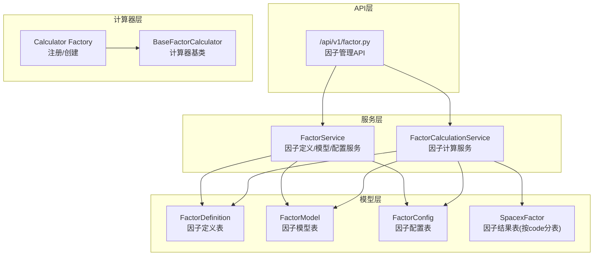
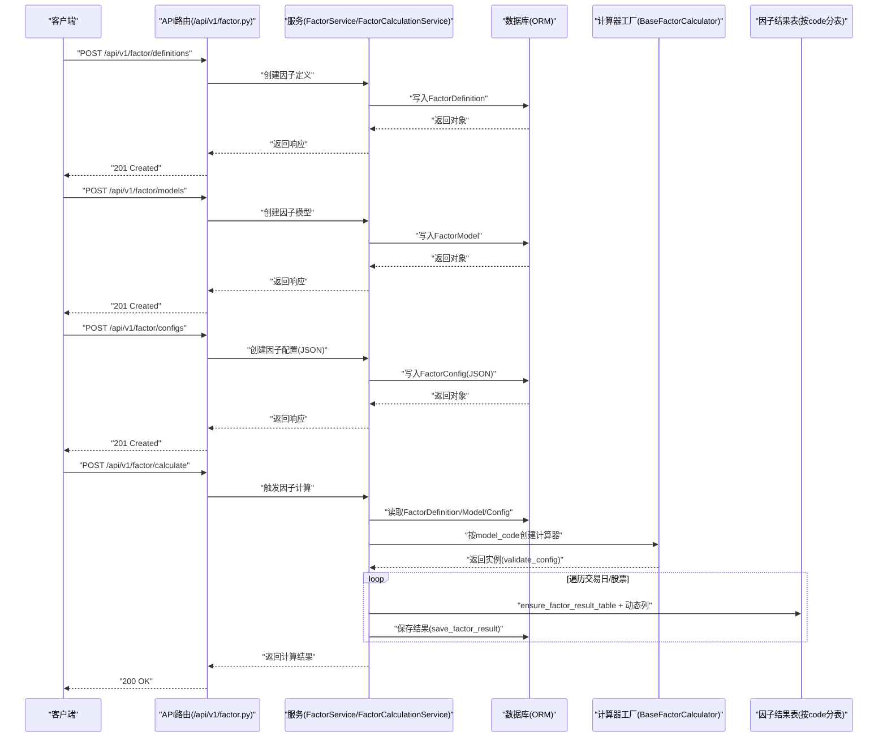
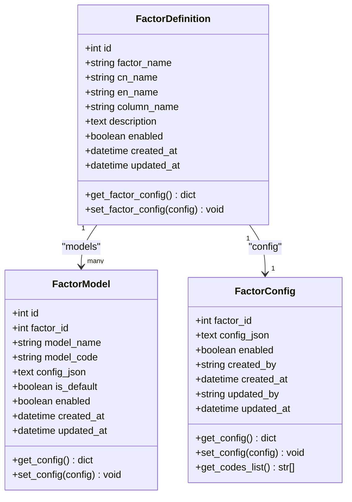
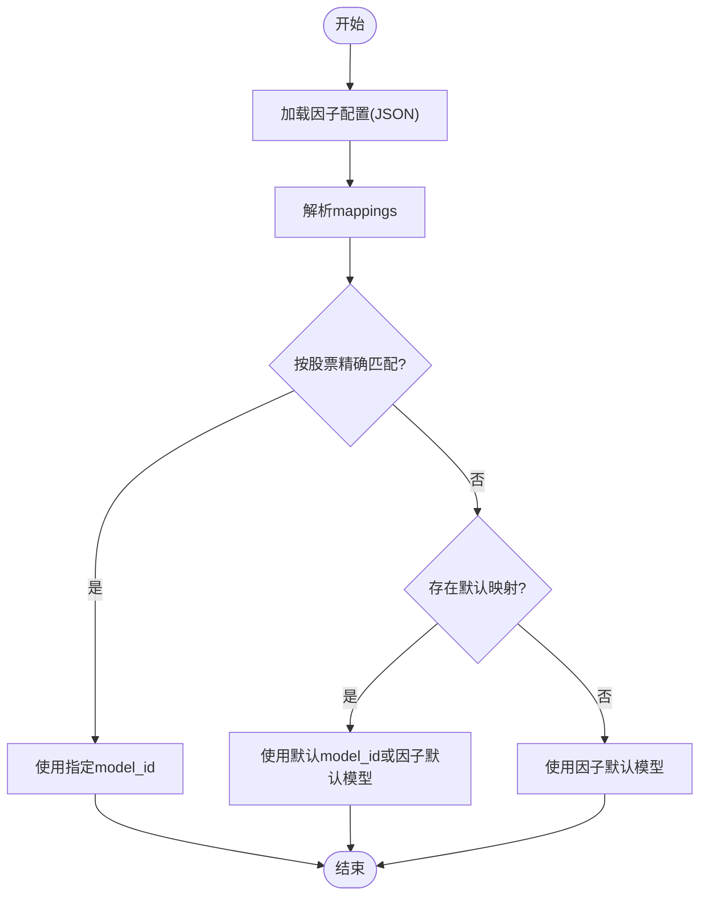
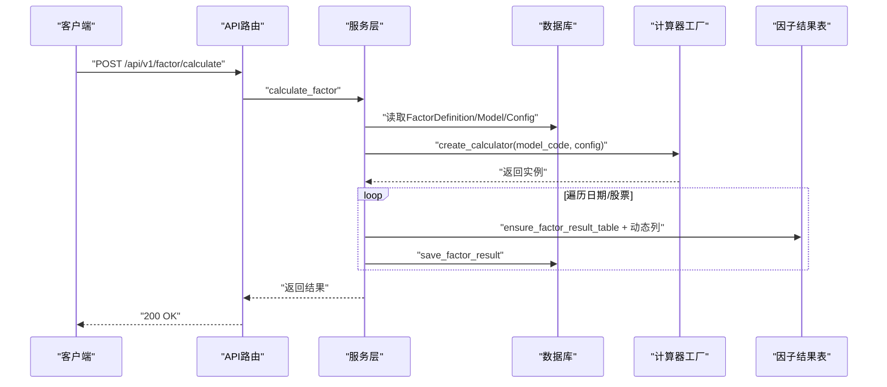
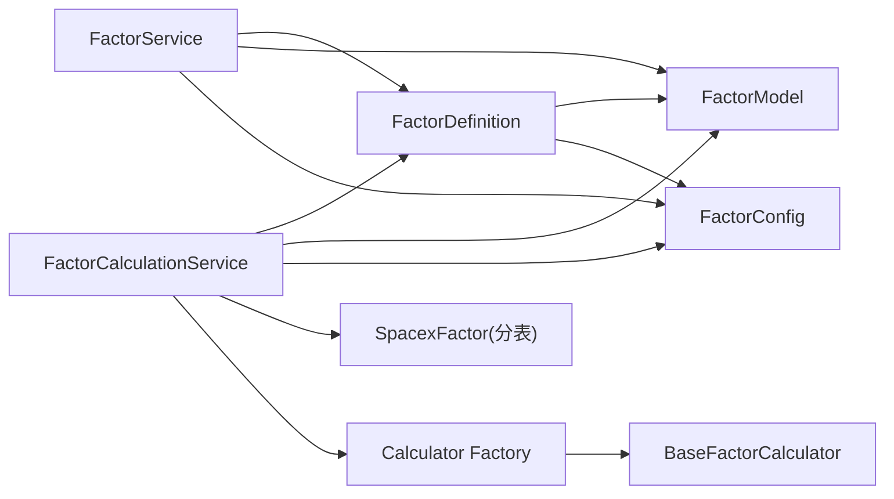

# 因子模型

<cite>
**本文引用的文件**
- [zquant/models/factor.py](file://zquant/models/factor.py)
- [docs/factor_management.md](file://docs/factor_management.md)
- [zquant/api/v1/factor.py](file://zquant/api/v1/factor.py)
- [zquant/schemas/factor.py](file://zquant/schemas/factor.py)
- [zquant/services/factor.py](file://zquant/services/factor.py)
- [zquant/services/factor_calculation.py](file://zquant/services/factor_calculation.py)
- [zquant/factor/calculators/base.py](file://zquant/factor/calculators/base.py)
- [zquant/factor/calculators/factory.py](file://zquant/factor/calculators/factory.py)
- [zquant/models/data.py](file://zquant/models/data.py)
</cite>

## 目录
1. [简介](#简介)
2. [项目结构](#项目结构)
3. [核心组件](#核心组件)
4. [架构总览](#架构总览)
5. [详细组件分析](#详细组件分析)
6. [依赖关系分析](#依赖关系分析)
7. [性能考量](#性能考量)
8. [故障排查指南](#故障排查指南)
9. [结论](#结论)
10. [附录](#附录)

## 简介
本文件面向zquant平台的因子管理数据模型，系统性梳理FactorDefinition（因子定义表）、FactorModel（因子模型表）、FactorConfig（因子配置表）以及按股票代码分表存储的因子结果表（zq_quant_factor_spacex_{code}）之间的实体关系与设计原理。同时结合API层与服务层，说明如何通过REST接口完成因子的定义、配置、计算与查询，并深入解析config_json字段的灵活配置能力与分表策略的实现细节。

## 项目结构
围绕因子管理的关键模块分布如下：
- 数据模型层：因子定义、模型、配置与结果表的ORM定义
- API层：因子定义、模型、配置与计算、查询的REST接口
- 服务层：业务逻辑封装，包括因子配置解析、模型选择、计算调度与结果落库
- 计算器层：基于工厂模式的因子计算器注册与实例化
- 数据模型工具：分表命名与动态建表工具

图表来源
- [zquant/models/factor.py](file://zquant/models/factor.py#L35-L171)
- [zquant/api/v1/factor.py](file://zquant/api/v1/factor.py#L66-L176)
- [zquant/services/factor.py](file://zquant/services/factor.py#L38-L188)
- [zquant/services/factor_calculation.py](file://zquant/services/factor_calculation.py#L215-L333)
- [zquant/factor/calculators/base.py](file://zquant/factor/calculators/base.py#L34-L82)
- [zquant/factor/calculators/factory.py](file://zquant/factor/calculators/factory.py#L31-L90)
- [zquant/models/data.py](file://zquant/models/data.py#L941-L1016)

章节来源
- [zquant/models/factor.py](file://zquant/models/factor.py#L35-L171)
- [zquant/api/v1/factor.py](file://zquant/api/v1/factor.py#L66-L176)
- [zquant/services/factor.py](file://zquant/services/factor.py#L38-L188)
- [zquant/services/factor_calculation.py](file://zquant/services/factor_calculation.py#L215-L333)
- [zquant/factor/calculators/base.py](file://zquant/factor/calculators/base.py#L34-L82)
- [zquant/factor/calculators/factory.py](file://zquant/factor/calculators/factory.py#L31-L90)
- [zquant/models/data.py](file://zquant/models/data.py#L941-L1016)

## 核心组件
- 因子定义表（FactorDefinition）
  - 存储因子元数据：factor_name（唯一标识）、cn_name、en_name、column_name（结果列名）、description、enabled、created_at、updated_at
  - 关系：一对多（models）与一对一（config），支持通过get/set方法管理config_json
- 因子模型表（FactorModel）
  - 存储不同计算算法：factor_id（外键）、model_name、model_code（用于识别计算器类型）、config_json（模型配置）、is_default、enabled、created_at、updated_at
  - 关系：多对一（factor），支持get/set_config解析/序列化JSON
- 因子配置表（FactorConfig）
  - 以factor_id为主键，存储JSON配置：{"enabled": bool, "mappings": [{"model_id": int, "codes": list[str]|None}, ...]}
  - 支持get/set_config校验与同步enabled字段
- 分表存储（zq_quant_factor_spacex_{code}）
  - 按股票代码分表，表名由get_spacex_factor_table_name生成
  - 动态添加因子列（如turnover_rate），支持插入或更新

章节来源
- [zquant/models/factor.py](file://zquant/models/factor.py#L35-L171)
- [zquant/models/data.py](file://zquant/models/data.py#L941-L1016)

## 架构总览
下图展示因子管理从API到服务、模型与分表存储的整体交互流程。

图表来源
- [zquant/api/v1/factor.py](file://zquant/api/v1/factor.py#L66-L176)
- [zquant/services/factor.py](file://zquant/services/factor.py#L38-L188)
- [zquant/services/factor_calculation.py](file://zquant/services/factor_calculation.py#L576-L800)
- [zquant/factor/calculators/factory.py](file://zquant/factor/calculators/factory.py#L53-L80)
- [zquant/models/data.py](file://zquant/models/data.py#L941-L1016)

## 详细组件分析

### 因子定义表（FactorDefinition）
- 设计要点
  - 唯一标识：factor_name
  - 列名：column_name决定结果表的列名
  - 关系：back_populates双向绑定，支持通过get/set方法管理config_json
- 配置管理
  - set_factor_config对输入进行严格校验，确保mappings格式合法
  - get_factor_config返回{"enabled": bool, "mappings": [...]}

图表来源
- [zquant/models/factor.py](file://zquant/models/factor.py#L35-L171)

章节来源
- [zquant/models/factor.py](file://zquant/models/factor.py#L35-L171)

### 因子模型表（FactorModel）
- 设计要点
  - model_code用于识别具体计算器类型
  - config_json存储模型级配置（如数据源、字段映射等）
  - is_default用于默认算法选择
- 配置管理
  - get_config/set_config负责JSON解析与序列化

章节来源
- [zquant/models/factor.py](file://zquant/models/factor.py#L111-L171)

### 因子配置表（FactorConfig）
- 设计要点
  - 以factor_id为主键，JSON字段config_json存储{"enabled": bool, "mappings": [{"model_id": int, "codes": list[str]|None}, ...]}
  - 支持get_codes_list聚合所有codes
- 配置优先级
  - mappings中codes为空或None表示默认配置；若某股票在多个mapping中出现，优先匹配精确codes；否则回退至默认mapping或因子默认模型

章节来源
- [zquant/models/factor.py](file://zquant/models/factor.py#L147-L267)
- [zquant/services/factor.py](file://zquant/services/factor.py#L580-L629)

### 分表存储策略与config_json灵活配置
- 分表策略
  - 表名生成：get_spacex_factor_table_name(code)将TS代码转换为zq_quant_factor_spacex_{code_num}
  - 动态建表：ensure_factor_result_table在表不存在时创建基础结构，再按因子定义动态添加列
  - 列扩展：sync_factor_columns按启用因子定义为所有因子表补齐缺失列
- config_json灵活配置
  - 支持多映射：每个mapping可指定model_id与codes列表
  - 默认配置：codes为空或None表示默认映射
  - 优先级：先按精确codes匹配，再按默认映射，最后回退到因子默认模型
  - 模型选择：get_model_for_code依据配置与默认模型返回对应FactorModel

图表来源
- [zquant/services/factor.py](file://zquant/services/factor.py#L580-L629)
- [zquant/services/factor_calculation.py](file://zquant/services/factor_calculation.py#L265-L333)

章节来源
- [zquant/models/data.py](file://zquant/models/data.py#L941-L1016)
- [zquant/services/factor_calculation.py](file://zquant/services/factor_calculation.py#L265-L333)
- [zquant/services/factor.py](file://zquant/services/factor.py#L580-L629)

### API工作流（定义/模型/配置/计算/查询）
- 定义与模型
  - API提供创建/查询/更新/删除因子定义与模型的REST接口
  - 服务层负责校验与持久化
- 配置
  - 新接口使用JSON配置（支持多映射），向后兼容旧接口
  - 支持按factor_id查询/更新/删除配置
- 计算
  - 手动触发计算，支持单日或日期范围
  - 服务层根据配置选择模型与股票集合，动态创建/扩展表列并保存结果
- 查询
  - 支持按code与因子名称查询历史结果

图表来源
- [zquant/api/v1/factor.py](file://zquant/api/v1/factor.py#L731-L800)
- [zquant/services/factor_calculation.py](file://zquant/services/factor_calculation.py#L576-L800)
- [zquant/factor/calculators/factory.py](file://zquant/factor/calculators/factory.py#L53-L80)

章节来源
- [zquant/api/v1/factor.py](file://zquant/api/v1/factor.py#L66-L176)
- [zquant/api/v1/factor.py](file://zquant/api/v1/factor.py#L731-L800)
- [zquant/schemas/factor.py](file://zquant/schemas/factor.py#L100-L168)
- [zquant/schemas/factor.py](file://zquant/schemas/factor.py#L170-L267)
- [zquant/schemas/factor.py](file://zquant/schemas/factor.py#L293-L345)

## 依赖关系分析
- 模型间依赖
  - FactorModel.factor_id -> FactorDefinition.id（外键）
  - FactorConfig.factor_id -> FactorDefinition.id（外键）
- 服务层依赖
  - FactorService依赖FactorDefinition/FactorModel/FactorConfig
  - FactorCalculationService依赖FactorService、数据模型工具与计算器工厂
- 计算器依赖
  - 工厂按model_code注册并创建BaseFactorCalculator实例，validate_config用于校验配置有效性

图表来源
- [zquant/models/factor.py](file://zquant/models/factor.py#L35-L171)
- [zquant/services/factor.py](file://zquant/services/factor.py#L38-L188)
- [zquant/services/factor_calculation.py](file://zquant/services/factor_calculation.py#L215-L333)
- [zquant/factor/calculators/factory.py](file://zquant/factor/calculators/factory.py#L31-L90)

章节来源
- [zquant/models/factor.py](file://zquant/models/factor.py#L35-L171)
- [zquant/services/factor.py](file://zquant/services/factor.py#L38-L188)
- [zquant/services/factor_calculation.py](file://zquant/services/factor_calculation.py#L215-L333)
- [zquant/factor/calculators/factory.py](file://zquant/factor/calculators/factory.py#L31-L90)

## 性能考量
- 缓存优化
  - FactorCalculationCache一次性加载因子定义、默认模型、配置与模型映射，显著降低重复查询开销
- 分表与列扩展
  - 按需创建分表与动态添加列，避免全量重建；批量同步列提升一致性
- 并发与幂等
  - 保存结果时按trade_date+ts_code去重，避免重复写入
- 日期范围与交易日过滤
  - 计算前根据交易日仓库获取有效日期范围，减少无效计算

[本节为通用指导，无需列出具体文件来源]

## 故障排查指南
- 因子配置错误
  - 检查config_json格式是否为{"enabled": bool, "mappings": [{"model_id": int, "codes": list[str]|None}, ...]}
  - 确保每个mapping包含model_id；默认映射最多一个（codes为空或None）
- 计算器未注册
  - 确认model_code已在工厂注册，validate_config返回有效
- 分表列缺失
  - 使用sync_factor_columns补齐所有启用因子的列；或使用ensure_factor_result_table按因子定义动态添加
- 数据未同步或非交易日
  - 确认当日数据同步状态与交易日状态

章节来源
- [zquant/services/factor.py](file://zquant/services/factor.py#L524-L629)
- [zquant/services/factor_calculation.py](file://zquant/services/factor_calculation.py#L376-L469)
- [zquant/factor/calculators/factory.py](file://zquant/factor/calculators/factory.py#L53-L80)

## 结论
zquant平台的因子管理采用“定义-模型-配置-计算-查询”的完整闭环：以FactorDefinition统一管理因子元数据，以FactorModel承载算法与配置，以FactorConfig提供灵活的多映射与默认策略，最终通过分表存储实现高扩展性的结果落库。API层提供标准化REST接口，服务层承担业务编排与性能优化，计算器工厂保证算法可插拔与可验证。config_json的多映射与默认映射机制，使得因子计算具备高度灵活性与可维护性。

[本节为总结性内容，无需列出具体文件来源]

## 附录
- 表结构与字段说明（来自官方文档）
  - 因子定义表：包含id、factor_name、cn_name、en_name、column_name、description、enabled、created_at、updated_at
  - 因子模型表：包含id、factor_id、model_name、model_code、config_json、is_default、enabled、created_at、updated_at
  - 因子配置表：包含factor_id（主键）、config_json、enabled、created_by、created_at、updated_by、updated_at
  - 因子结果表：按code分表，如zq_quant_factor_spacex_{code}，包含trade_date、ts_code、各因子列、时间戳与操作人字段

章节来源
- [docs/factor_management.md](file://docs/factor_management.md#L19-L69)