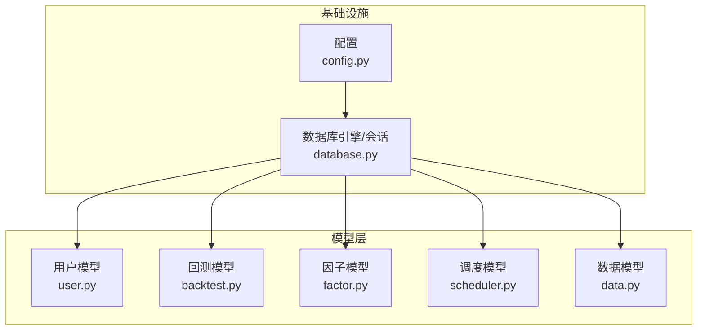
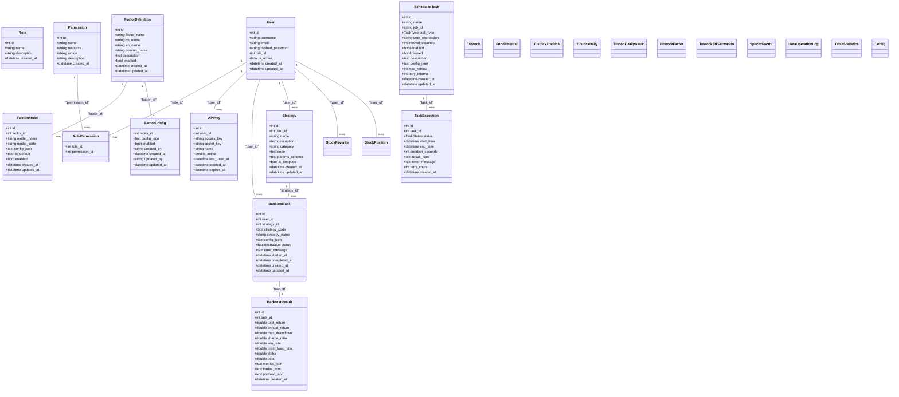
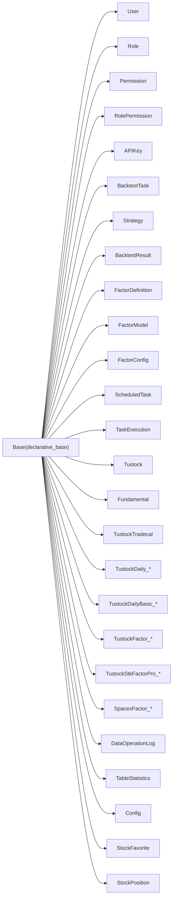

# 数据模型定义

<cite>
**本文引用的文件**
- [zquant/models/user.py](file://zquant/models/user.py)
- [zquant/models/backtest.py](file://zquant/models/backtest.py)
- [zquant/models/factor.py](file://zquant/models/factor.py)
- [zquant/models/scheduler.py](file://zquant/models/scheduler.py)
- [zquant/models/data.py](file://zquant/models/data.py)
- [zquant/database.py](file://zquant/database.py)
- [zquant/config.py](file://zquant/config.py)
</cite>

## 目录
1. [简介](#简介)
2. [项目结构](#项目结构)
3. [核心组件](#核心组件)
4. [架构概览](#架构概览)
5. [详细组件分析](#详细组件分析)
6. [依赖分析](#依赖分析)
7. [性能考量](#性能考量)
8. [故障排查指南](#故障排查指南)
9. [结论](#结论)

## 简介
本文件面向zquant平台的数据模型权威说明，聚焦SQLAlchemy模型层，覆盖用户、回测任务、因子、定时任务、股票数据等关键实体。文档逐表解析字段定义、数据类型、主外键关系、索引与约束，并结合业务场景解释设计意图与使用方式。同时给出与代码实现相对应的“章节来源”与“图示来源”，便于读者定位到具体实现。

## 项目结构
- 数据模型集中于 zquant/models 下的各模块文件，分别对应用户、回测、因子、调度、数据等子域。
- 数据库连接与会话由 zquant/database.py 提供，统一声明基类 Base，供各模型继承。
- 数据库连接参数由 zquant/config.py 的 Settings 管理，最终拼装为 mysql+pymysql URL。

**图示来源**
- [zquant/config.py](file://zquant/config.py#L98-L104)
- [zquant/database.py](file://zquant/database.py#L41-L54)
- [zquant/models/user.py](file://zquant/models/user.py#L74-L113)
- [zquant/models/backtest.py](file://zquant/models/backtest.py#L48-L119)
- [zquant/models/factor.py](file://zquant/models/factor.py#L35-L267)
- [zquant/models/scheduler.py](file://zquant/models/scheduler.py#L68-L203)
- [zquant/models/data.py](file://zquant/models/data.py#L57-L1227)

**章节来源**
- [zquant/config.py](file://zquant/config.py#L98-L104)
- [zquant/database.py](file://zquant/database.py#L41-L54)

## 核心组件
- 用户与权限：用户表、角色表、权限表、角色权限关联表、API密钥表。
- 回测：回测任务、策略、回测结果。
- 因子：因子定义、因子模型、因子配置。
- 定时任务：定时任务配置、任务执行历史。
- 股票数据：基础信息、财务数据、交易日历、日线/日频指标/技术因子/专业版因子/自定义因子结果等分表与视图。

**章节来源**
- [zquant/models/user.py](file://zquant/models/user.py#L34-L113)
- [zquant/models/backtest.py](file://zquant/models/backtest.py#L38-L119)
- [zquant/models/factor.py](file://zquant/models/factor.py#L35-L267)
- [zquant/models/scheduler.py](file://zquant/models/scheduler.py#L38-L203)
- [zquant/models/data.py](file://zquant/models/data.py#L57-L1227)

## 架构概览
下图展示关键模型之间的关系与依赖，包括外键约束、一对一/一对多关系、枚举类型与索引策略。

**图示来源**
- [zquant/models/user.py](file://zquant/models/user.py#L34-L113)
- [zquant/models/backtest.py](file://zquant/models/backtest.py#L38-L119)
- [zquant/models/factor.py](file://zquant/models/factor.py#L35-L267)
- [zquant/models/scheduler.py](file://zquant/models/scheduler.py#L38-L203)
- [zquant/models/data.py](file://zquant/models/data.py#L57-L1227)

## 详细组件分析

### 用户与权限模型（zq_app_users、zq_app_roles、zq_app_permissions、zq_app_role_permissions、zq_app_apikeys）
- 表：zq_app_users
  - 字段与类型：id（整型，主键+索引）、username（字符串，唯一+索引）、email（字符串，唯一+索引）、hashed_password（字符串）、role_id（整型，外键至zq_app_roles.id）、is_active（布尔）、created_at、updated_at。
  - 约束与索引：主键、唯一索引(username)、唯一索引(email)、普通索引(role_id)。
  - 关系：与Role一对多（back_populates）、与APIKey一对多（级联删除）、与BacktestTask一对多（级联删除）、与Strategy一对多（级联删除）、与Notification一对多（级联删除）。
- 表：zq_app_roles
  - 字段与类型：id（整型，主键+索引）、name（字符串，唯一+索引）、description（字符串）、created_at（时间）。
  - 约束与索引：主键、唯一索引(name)。
  - 关系：与User一对多（back_populates）、与Permission多对多（通过zq_app_role_permissions）。
- 表：zq_app_permissions
  - 字段与类型：id（整型，主键+索引）、name（字符串，唯一+索引）、resource（字符串）、action（字符串）、description（字符串）、created_at（时间）。
  - 约束与索引：主键、唯一索引(name)。
  - 关系：与Role多对多（通过zq_app_role_permissions）。
- 表：zq_app_role_permissions
  - 字段与类型：role_id（整型，外键）、permission_id（整型，外键）。
  - 约束与索引：复合主键(role_id, permission_id)。
- 表：zq_app_apikeys
  - 字段与类型：id（整型，主键+索引）、user_id（整型，外键至zq_app_users.id，索引）、access_key（字符串，唯一+索引）、secret_key（字符串）、name（字符串）、is_active（布尔）、last_used_at（时间）、created_at（时间）、expires_at（时间）。
  - 约束与索引：主键、唯一索引(access_key)、普通索引(user_id)。
  - 关系：与User一对多（back_populates）。

- 索引策略说明
  - 用户表：username/email唯一索引保障登录与注册幂等；role_id索引支撑按角色查询。
  - API密钥表：access_key唯一索引保障密钥唯一性；user_id索引支撑按用户检索密钥。
  - 角色/权限表：name唯一索引保障资源与动作的唯一标识；role_id+permission_id复合主键保证角色权限映射无重复。

**章节来源**
- [zquant/models/user.py](file://zquant/models/user.py#L34-L113)

### 回测任务模型（zq_backtest_tasks、zq_backtest_strategies、zq_backtest_results）
- 表：zq_backtest_tasks
  - 字段与类型：id（整型，主键+自增+索引）、user_id（整型，外键至zq_app_users.id，索引）、strategy_id（整型，外键至zq_backtest_strategies.id，索引）、strategy_code（文本，策略代码）、strategy_name（字符串）、config_json（文本，回测配置）、status（枚举BacktestStatus，索引）、error_message（文本）、started_at（时间）、completed_at（时间）、created_at、updated_at。
  - 约束与索引：主键；user_id、strategy_id、status建立索引。
  - 关系：与User一对多；与Strategy一对一（可选策略）；与BacktestResult一对一（级联删除）。
- 表：zq_backtest_strategies
  - 字段与类型：id（整型，主键+自增+索引）、user_id（整型，外键至zq_app_users.id，索引）、name（字符串，索引）、description（文本）、category（字符串，索引）、code（文本，策略代码）、params_schema（文本，参数Schema）、is_template（布尔，索引）、created_at、updated_at。
  - 约束与索引：主键；user_id、name、category、is_template建立索引。
  - 关系：与User一对多。
- 表：zq_backtest_results
  - 字段与类型：id（整型，主键+自增+索引）、task_id（整型，外键至zq_backtest_tasks.id，唯一+索引）、total_return、annual_return、max_drawdown、sharpe_ratio、win_rate、profit_loss_ratio、alpha、beta、metrics_json、trades_json、portfolio_json、created_at。
  - 约束与索引：主键；task_id唯一索引。
  - 关系：与BacktestTask一对一（反向back_populates）。

- 状态枚举与时间戳
  - BacktestStatus：pending、running、completed、failed、cancelled。
  - 时间戳：created_at默认当前时间；updated_at默认当前时间并在更新时刷新。

- 关系与流程
  - 用户创建策略或直接提交策略代码，发起回测任务。
  - 任务执行期间更新status、started_at、completed_at与error_message。
  - 任务完成后生成回测结果，包含指标与序列化数据。

**章节来源**
- [zquant/models/backtest.py](file://zquant/models/backtest.py#L38-L119)

### 因子模型（zq_quant_factor_definitions、zq_quant_factor_models、zq_quant_factor_configs）
- 表：zq_quant_factor_definitions
  - 字段与类型：id（整型，主键+自增+索引）、factor_name（字符串，唯一+索引）、cn_name（字符串）、en_name（字符串）、column_name（字符串）、description（文本）、enabled（布尔，索引）、created_at、updated_at。
  - 约束与索引：主键；factor_name唯一索引；enabled索引。
  - 关系：与FactorModel一对多（级联删除）、与FactorConfig一对一（级联删除）。
  - 方法：get_factor_config/set_factor_config，校验并持久化配置字典，支持“启用开关+映射列表（模型ID+股票代码集合）”。
- 表：zq_quant_factor_models
  - 字段与类型：id（整型，主键+自增+索引）、factor_id（整型，外键至zq_quant_factor_definitions.id，索引）、model_name（字符串）、model_code（字符串）、config_json（文本）、is_default（布尔，索引）、enabled（布尔，索引）、created_at、updated_at。
  - 约束与索引：主键；factor_id索引；model_code索引；is_default索引；enabled索引。
  - 关系：与FactorDefinition一对多（级联删除）。
  - 方法：get_config/set_config，将JSON配置序列化/反序列化。
- 表：zq_quant_factor_configs
  - 字段与类型：factor_id（整型，主键+外键至zq_quant_factor_definitions.id，索引）、config_json（文本）、enabled（布尔，索引）、created_by（字符串）、created_at、updated_by（字符串）、updated_at。
  - 约束与索引：主键；factor_id索引；enabled索引。
  - 关系：与FactorDefinition一对一（back_populates）。
  - 方法：get_config/set_config/get_codes_list/set_codes_list（兼容旧接口）。

- 配置机制与分表策略
  - 配置采用JSON存储，支持“启用开关+映射列表”，每条映射包含model_id与codes（股票代码列表或None）。
  - 通过FactorDefinition.get_factor_config可统一读取配置；FactorConfig.set_config会同步enabled字段。
  - 该模型不直接承载数据分表逻辑，但为后续按股票维度扩展分表提供配置入口。

**章节来源**
- [zquant/models/factor.py](file://zquant/models/factor.py#L35-L267)

### 定时任务模型（zq_task_scheduled_tasks、zq_task_task_executions）
- 表：zq_task_scheduled_tasks
  - 字段与类型：id（整型，主键+自增+索引）、name（字符串，唯一+索引）、job_id（字符串，唯一+索引）、task_type（枚举TaskType）、cron_expression（字符串）、interval_seconds（整型）、enabled（布尔，索引）、paused（布尔，索引）、description（文本）、config_json（文本）、max_retries（整型）、retry_interval（整型）、created_at、updated_at。
  - 约束与索引：主键；name唯一索引；job_id唯一索引；task_type、enabled、paused建立索引。
  - 关系：与TaskExecution一对多（级联删除），按start_time倒序排列。
  - 方法：get_config/set_config，序列化/反序列化任务配置。
- 表：zq_task_task_executions
  - 字段与类型：id（整型，主键+自增+索引）、task_id（整型，索引）、status（枚举TaskStatus）、start_time（时间，索引）、end_time（时间）、duration_seconds（整型）、result_json（文本）、error_message（文本）、retry_count（整型）、created_at。
  - 约束与索引：主键；task_id索引；status索引；start_time索引。
  - 关系：与ScheduledTask一对多（back_populates）。
  - 方法：get_result/set_result，精简结果JSON，仅保留关键字段，避免冗余输出；对失败场景提取关键错误摘要。

- 任务类型与状态
  - TaskType：manual_task、common_task、workflow。
  - TaskStatus：pending、running、success、failed、completed、terminated。

- 调度配置与执行关系
  - 通过cron_expression或interval_seconds配置触发；enabled/paused控制启停；max_retries/retry_interval控制重试策略。
  - 执行历史记录包含开始/结束时间、耗时、结果摘要与错误信息，便于审计与排障。

**章节来源**
- [zquant/models/scheduler.py](file://zquant/models/scheduler.py#L38-L203)

### 股票数据模型（zq_data_*系列与zq_stats_*、zq_app_configs、zq_quant_*）
- 基础信息与财务
  - zq_data_tustock_stockbasic：股票基础信息，主键ts_code（索引），含市场、交易所、上市状态、上市/退市日期等字段。
  - zq_data_fundamentals：财务数据，唯一约束(symbol, report_date, statement_type)，索引(symbol, report_date)。
  - zq_data_tustock_tradecal：交易日历，唯一约束(exchange, cal_date)，索引(exchange, cal_date)。
- 日线与日频指标
  - zq_data_tustock_daily_*：按ts_code分表，唯一约束(ts_code, trade_date)，索引(ts_code, trade_date)。
  - zq_data_tustock_daily_basic_*：按ts_code分表，唯一约束(ts_code, trade_date)，索引(ts_code, trade_date)。
- 技术因子与专业版因子
  - zq_data_tustock_factor_*：按ts_code分表，唯一约束(ts_code, trade_date)，索引(ts_code, trade_date)。
  - zq_data_tustock_stkfactorpro_*：按ts_code分表，唯一约束(ts_code, trade_date)，索引(ts_code, trade_date)。
- 自定义量化因子结果
  - zq_quant_factor_spacex_*：按code分表，唯一约束(ts_code, trade_date)，索引(ts_code, trade_date)。
- 视图与统计
  - 视图名称常量：日线视图、日频指标视图、因子视图、专业版因子视图、自定义因子视图。
  - zq_stats_apisync：数据操作日志，记录表名、操作类型、计数、结果、耗时、时间窗口等。
  - zq_stats_statistics：每日数据统计，唯一约束(stat_date, table_name)，索引(stat_date, table_name)。
- 配置与用户资产
  - zq_app_configs：应用配置表，主键config_key（索引），支持注释与加密存储。
  - zq_quant_favorite：我的自选，唯一约束(user_id, code)，索引(user_id, code, fav_datettime)。
  - zq_quant_position：我的持仓，唯一约束(user_id, code)，索引(user_id, code, buy_date)。

- 分表策略与索引设计
  - 按ts_code/code生成表名，统一采用(ts_code, trade_date)唯一约束与索引，确保按日期范围查询高效。
  - 交易日历与财务数据同样采用联合唯一约束与索引，保障数据完整性与查询效率。
  - 统计表按日期+表名唯一，便于每日快照与增量统计。

- 动态类与工厂
  - data.py提供动态类工厂：create_tustock_daily_class、create_tustock_daily_basic_class、create_tustock_factor_class、create_tustock_stkfactorpro_class、create_spacex_factor_class，配合唯一约束与索引名称计算，确保分表一致性。

**章节来源**
- [zquant/models/data.py](file://zquant/models/data.py#L57-L1227)

## 依赖分析
- 模型依赖
  - 所有模型继承自 zquant/database.py 中的 Base，统一由 declarative_base() 创建。
  - 用户模型依赖角色/权限/API密钥；回测模型依赖用户/策略/结果；调度模型依赖任务与执行；数据模型依赖基础表与分表工厂。
- 外键与级联
  - 用户与API密钥、回测任务、策略、收藏、持仓之间存在外键约束与级联删除，确保数据一致性。
  - 回测结果与任务为一对一，调度执行与任务为一对多。
- 枚举与索引
  - BacktestStatus、TaskStatus、TaskType均为枚举类型，配合索引提升查询效率。
  - 大量字段建立索引（唯一/普通），覆盖常用过滤条件与排序字段。

**图示来源**
- [zquant/database.py](file://zquant/database.py#L81-L81)
- [zquant/models/user.py](file://zquant/models/user.py#L34-L113)
- [zquant/models/backtest.py](file://zquant/models/backtest.py#L38-L119)
- [zquant/models/factor.py](file://zquant/models/factor.py#L35-L267)
- [zquant/models/scheduler.py](file://zquant/models/scheduler.py#L38-L203)
- [zquant/models/data.py](file://zquant/models/data.py#L57-L1227)

## 性能考量
- 索引与查询
  - 高频过滤字段（用户名、邮箱、角色ID、任务状态、策略名称、因子名称、enabled等）均建立索引，减少全表扫描。
  - 分表表名按ts_code/code生成，唯一约束(ts_code, trade_date)与索引配合，适合按日期范围查询。
- 枚举与JSON
  - 枚举字段使用SQLEnum，减少字符串比较开销；JSON字段用于灵活配置，注意序列化/反序列化成本与长度控制。
- 事务与连接池
  - database.py提供连接池配置与会话管理，建议在高并发场景下合理设置池大小与超时参数，避免连接争用。
- 结果集压缩
  - 调度执行结果set_result仅保留必要字段，避免stdout/stderr冗余，降低存储与传输成本。

[本节为通用指导，无需列出章节来源]

## 故障排查指南
- 用户登录/权限问题
  - 检查zq_app_users表的username/email唯一性与role_id外键是否正确。
  - 核对zq_app_role_permissions映射是否存在重复或缺失。
- 回测任务异常
  - 查看zq_backtest_tasks.status与error_message，确认任务状态流转是否正常。
  - 若缺少结果，检查BacktestResult是否成功创建。
- 因子配置异常
  - 使用FactorDefinition.get_factor_config与FactorConfig.get_config核对配置字典格式。
  - 确认enabled与mappings字段是否符合预期。
- 调度任务失败
  - 查看zq_task_scheduled_tasks.enabled/paused与cron_expression/interval_seconds配置。
  - 检查zq_task_task_executions.status与error_message，必要时增加重试次数与间隔。
- 数据分表缺失
  - 确认按ts_code/code生成的分表是否存在，唯一约束与索引是否一致。
  - 对于动态类，检查表名生成逻辑与唯一约束命名规则。

**章节来源**
- [zquant/models/user.py](file://zquant/models/user.py#L74-L113)
- [zquant/models/backtest.py](file://zquant/models/backtest.py#L38-L119)
- [zquant/models/factor.py](file://zquant/models/factor.py#L35-L267)
- [zquant/models/scheduler.py](file://zquant/models/scheduler.py#L38-L203)
- [zquant/models/data.py](file://zquant/models/data.py#L57-L1227)

## 结论
本数据模型围绕用户、回测、因子、调度与股票数据五大领域构建，采用清晰的表结构、外键约束与索引策略，既满足业务灵活性（如因子配置的JSON化、调度的Cron/间隔配置），又兼顾性能与可维护性（分表与唯一约束）。通过统一的Base与连接池管理，模型具备良好的扩展性与稳定性，可支撑zquant平台的持续演进。