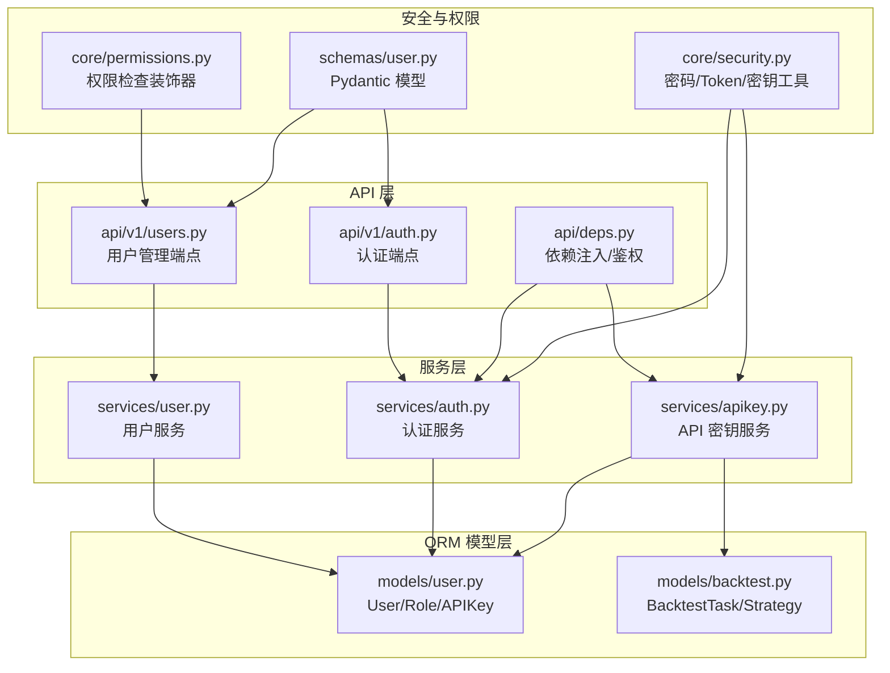
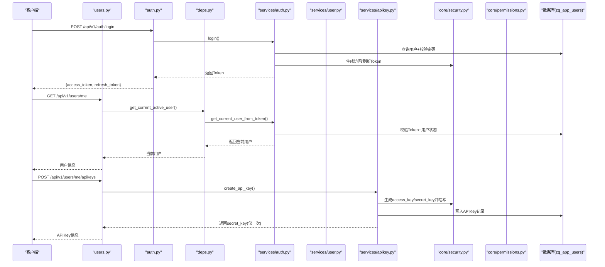
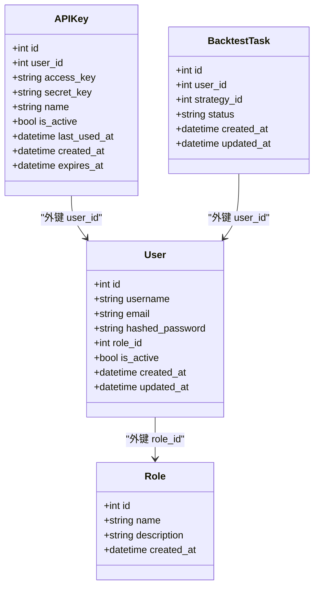

# 用户模型

<cite>
**本文引用的文件**
- [zquant/models/user.py](file://zquant/models/user.py)
- [zquant/models/backtest.py](file://zquant/models/backtest.py)
- [zquant/api/v1/users.py](file://zquant/api/v1/users.py)
- [zquant/api/v1/auth.py](file://zquant/api/v1/auth.py)
- [zquant/api/deps.py](file://zquant/api/deps.py)
- [zquant/schemas/user.py](file://zquant/schemas/user.py)
- [zquant/services/user.py](file://zquant/services/user.py)
- [zquant/services/auth.py](file://zquant/services/auth.py)
- [zquant/services/apikey.py](file://zquant/services/apikey.py)
- [zquant/core/security.py](file://zquant/core/security.py)
- [zquant/core/permissions.py](file://zquant/core/permissions.py)
</cite>

## 目录
1. [简介](#简介)
2. [项目结构](#项目结构)
3. [核心组件](#核心组件)
4. [架构总览](#架构总览)
5. [详细组件分析](#详细组件分析)
6. [依赖关系分析](#依赖关系分析)
7. [性能考量](#性能考量)
8. [故障排查指南](#故障排查指南)
9. [结论](#结论)

## 简介
本文件为 zquant 平台“用户模型”的权威文档，围绕数据库表 zq_app_users 的结构与关系展开，重点说明：
- 字段定义与索引设计
- 与 Role、APIKey、BacktestTask 等模型的关系（relationship）及外键约束
- 结合 API v1 中用户管理、认证与 API 密钥管理端点，阐述模型如何支撑用户认证、API 密钥管理与权限控制
- 在系统安全架构中的核心作用与最佳实践

## 项目结构
用户模型位于后端 ORM 层，配合 API 层、服务层与安全模块共同实现完整的用户生命周期管理与安全控制。

图表来源
- [zquant/models/user.py](file://zquant/models/user.py#L74-L113)
- [zquant/models/backtest.py](file://zquant/models/backtest.py#L48-L70)
- [zquant/api/v1/users.py](file://zquant/api/v1/users.py#L51-L208)
- [zquant/api/v1/auth.py](file://zquant/api/v1/auth.py#L39-L65)
- [zquant/api/deps.py](file://zquant/api/deps.py#L41-L93)
- [zquant/services/user.py](file://zquant/services/user.py#L37-L222)
- [zquant/services/auth.py](file://zquant/services/auth.py#L45-L289)
- [zquant/services/apikey.py](file://zquant/services/apikey.py#L43-L142)
- [zquant/core/security.py](file://zquant/core/security.py#L39-L133)
- [zquant/core/permissions.py](file://zquant/core/permissions.py#L38-L111)
- [zquant/schemas/user.py](file://zquant/schemas/user.py#L166-L220)

章节来源
- [zquant/models/user.py](file://zquant/models/user.py#L74-L113)
- [zquant/api/v1/users.py](file://zquant/api/v1/users.py#L51-L208)
- [zquant/api/v1/auth.py](file://zquant/api/v1/auth.py#L39-L65)
- [zquant/api/deps.py](file://zquant/api/deps.py#L41-L93)
- [zquant/services/user.py](file://zquant/services/user.py#L37-L222)
- [zquant/services/auth.py](file://zquant/services/auth.py#L45-L289)
- [zquant/services/apikey.py](file://zquant/services/apikey.py#L43-L142)
- [zquant/core/security.py](file://zquant/core/security.py#L39-L133)
- [zquant/core/permissions.py](file://zquant/core/permissions.py#L38-L111)
- [zquant/schemas/user.py](file://zquant/schemas/user.py#L166-L220)

## 核心组件
- User 实体（zq_app_users）
  - 主键 id
  - 唯一用户名 username（带索引）
  - 唯一邮箱 email（带索引）
  - 哈希密码 hashed_password
  - 角色外键 role_id
  - 激活状态 is_active
  - 创建时间 created_at
  - 更新时间 updated_at
- Role 实体（zq_app_roles）
  - 主键 id
  - 唯一名称 name（带索引）
  - 描述 description
  - 创建时间 created_at
- APIKey 实体（zq_app_apikeys）
  - 主键 id
  - 用户外键 user_id
  - 唯一访问密钥 access_key（带索引）
  - 存储哈希后的 secret_key
  - 名称/描述 name
  - 激活状态 is_active
  - 最后使用时间 last_used_at
  - 创建时间 created_at
  - 过期时间 expires_at
- BacktestTask 实体（zq_backtest_tasks）
  - 主键 id
  - 用户外键 user_id
  - 策略外键 strategy_id
  - 状态 status
  - 时间戳 created_at/updated_at

章节来源
- [zquant/models/user.py](file://zquant/models/user.py#L74-L113)
- [zquant/models/backtest.py](file://zquant/models/backtest.py#L48-L70)

## 架构总览
用户模型贯穿认证、授权与资源管理的全链路：API 层接收请求，依赖注入解析 Token 或 API Key，服务层执行业务逻辑（密码哈希、Token 签发、API Key 验证、权限检查），ORM 层持久化到数据库。

图表来源
- [zquant/api/v1/auth.py](file://zquant/api/v1/auth.py#L39-L65)
- [zquant/api/v1/users.py](file://zquant/api/v1/users.py#L101-L123)
- [zquant/api/deps.py](file://zquant/api/deps.py#L41-L93)
- [zquant/services/auth.py](file://zquant/services/auth.py#L200-L249)
- [zquant/services/apikey.py](file://zquant/services/apikey.py#L47-L77)
- [zquant/core/security.py](file://zquant/core/security.py#L85-L133)
- [zquant/models/user.py](file://zquant/models/user.py#L74-L113)

## 详细组件分析

### User 实体与表结构
- 表名：zq_app_users
- 字段与索引
  - id：主键，整型，带索引
  - username：字符串，唯一，带索引
  - email：字符串，唯一，带索引
  - hashed_password：字符串，存储密码哈希
  - role_id：整型，外键至 zq_app_roles.id
  - is_active：布尔，默认 true
  - created_at：时间戳，默认当前时间
  - updated_at：时间戳，默认当前时间，更新时自动写入
- 关系
  - 与 Role：一对多（User.role_id -> Role.id）
  - 与 APIKey：一对多（User.id -> APIKey.user_id），级联删除孤儿
  - 与 BacktestTask：一对多（User.id -> BacktestTask.user_id），级联删除孤儿
  - 与 Strategy：一对多（User.id -> Strategy.user_id），级联删除孤儿
  - 与 Notification：一对多（User.id -> Notification.user_id），级联删除孤儿

章节来源
- [zquant/models/user.py](file://zquant/models/user.py#L74-L113)

### Role/Permission 与权限控制
- Role 表：id、name（唯一+索引）、description、created_at
- Permission 表：id、name（唯一+索引）、resource、action、description、created_at
- 关系
  - Role 与 Permission 通过中间表 zq_app_role_permissions 维持多对多
  - User 与 Role 为多对一；User 通过 Role 间接获得 Permission 列表
- 权限检查
  - API 路由通过装饰器检查 resource:action，内部通过 SQL JOIN 检查用户角色是否拥有对应权限
  - 提供 require_role 与 is_admin 等便捷方法

章节来源
- [zquant/models/user.py](file://zquant/models/user.py#L34-L63)
- [zquant/core/permissions.py](file://zquant/core/permissions.py#L38-L111)

### APIKey 实体与 API 密钥管理
- 表名：zq_app_apikeys
- 字段
  - id、user_id（外键）、access_key（唯一+索引）、secret_key（存储哈希）
  - name、is_active、last_used_at、created_at、expires_at
- 关系
  - 与 User：一对多（User.id -> APIKey.user_id）
- 服务流程
  - 创建：生成 access_key/secret_key 对，secret_key 明文仅返回一次，其余以哈希形式存储
  - 验证：按 access_key 查找，校验 is_active、expires_at、secret_key 哈希匹配，更新 last_used_at
  - 删除/禁用：按 user_id 限定范围，确保资源隔离

章节来源
- [zquant/models/user.py](file://zquant/models/user.py#L96-L113)
- [zquant/services/apikey.py](file://zquant/services/apikey.py#L47-L142)
- [zquant/api/v1/users.py](file://zquant/api/v1/users.py#L101-L136)

### BacktestTask 与用户关联
- BacktestTask 表含 user_id 外键，与 User 建立一对多关系
- 用户维度的回测任务隔离与审计（created_at/updated_at）

章节来源
- [zquant/models/backtest.py](file://zquant/models/backtest.py#L48-L70)

### 认证与 Token 管理
- 登录
  - 校验用户名与密码（密码哈希验证）
  - 成功后签发访问/刷新 Token（算法与密钥来自配置）
- 刷新
  - 使用刷新 Token 解码并重新签发新的访问/刷新 Token
- 依赖注入
  - 通过 Authorization Bearer 头解析 Token，校验黑名单与用户状态
  - 通过 X-API-Key 与 X-API-Secret 头走 API Key 流程

章节来源
- [zquant/api/v1/auth.py](file://zquant/api/v1/auth.py#L39-L65)
- [zquant/api/deps.py](file://zquant/api/deps.py#L41-L93)
- [zquant/services/auth.py](file://zquant/services/auth.py#L200-L289)
- [zquant/core/security.py](file://zquant/core/security.py#L85-L133)

### 用户管理 API 与权限
- 用户列表/详情/创建/更新/删除/重置密码
- 权限控制
  - 读取/创建/更新/删除均需相应 resource:action 权限
  - 当前用户信息接口依赖 get_current_active_user，确保用户处于激活状态

章节来源
- [zquant/api/v1/users.py](file://zquant/api/v1/users.py#L51-L208)
- [zquant/core/permissions.py](file://zquant/core/permissions.py#L38-L111)
- [zquant/api/deps.py](file://zquant/api/deps.py#L70-L75)

### 数据模型与序列化
- Pydantic 模型
  - UserCreate/UserUpdate/PasswordReset：输入校验与字段约束
  - UserResponse/UserInDB：输出/属性映射
  - Token/LoginRequest/APIKeyCreate/APIKeyResponse：认证与 API Key 相关
- 服务层与 API 层通过这些模型进行参数传递与响应序列化

章节来源
- [zquant/schemas/user.py](file://zquant/schemas/user.py#L33-L104)
- [zquant/schemas/user.py](file://zquant/schemas/user.py#L166-L220)

## 依赖关系分析

图表来源
- [zquant/models/user.py](file://zquant/models/user.py#L34-L113)
- [zquant/models/backtest.py](file://zquant/models/backtest.py#L48-L70)

章节来源
- [zquant/models/user.py](file://zquant/models/user.py#L34-L113)
- [zquant/models/backtest.py](file://zquant/models/backtest.py#L48-L70)

## 性能考量
- 索引优化
  - 用户名与邮箱唯一索引，降低重复注册与登录查询成本
  - API Key 的 access_key 唯一索引，保证密钥查找高效
- 关系级联
  - User 与 APIKey/BacktestTask/Strategy/Notification 的级联删除，减少孤立数据
- 查询排序与分页
  - 用户列表支持按多个字段排序与分页，避免一次性加载大量数据
- 缓存与 Token 黑名单
  - 登录失败次数与锁定状态使用缓存，降低数据库压力
  - Token 黑名单采用哈希键，避免存储完整 Token

[本节为通用建议，无需列出具体文件来源]

## 故障排查指南
- 登录失败被锁定
  - 现象：提示账户被锁定
  - 排查：检查缓存中 login_attempts 与 lockout 键是否过期
  - 参考路径：[AuthService._check_login_lockout](file://zquant/services/auth.py#L70-L95)
- 用户不存在或被禁用
  - 现象：Token 无效或用户状态非激活
  - 排查：确认用户是否存在且 is_active=true
  - 参考路径：[AuthService.get_current_user_from_token](file://zquant/services/auth.py#L251-L289)
- API Key 无效/过期/禁用
  - 现象：API Key 验证失败
  - 排查：确认 access_key 存在、secret_key 正确、is_active=true、expires_at 未过期
  - 参考路径：[APIKeyService.verify_api_key](file://zquant/services/apikey.py#L90-L116)
- 权限不足
  - 现象：403 Forbidden
  - 排查：确认当前用户角色是否具备 resource:action 权限
  - 参考路径：[check_permission](file://zquant/core/permissions.py#L38-L61)、[has_permission](file://zquant/core/permissions.py#L64-L79)
- 数据库表未初始化
  - 现象：Token 验证抛出“表不存在”异常
  - 排查：运行数据库初始化脚本
  - 参考路径：[get_current_user 异常分支](file://zquant/api/deps.py#L60-L67)

章节来源
- [zquant/services/auth.py](file://zquant/services/auth.py#L70-L95)
- [zquant/services/auth.py](file://zquant/services/auth.py#L251-L289)
- [zquant/services/apikey.py](file://zquant/services/apikey.py#L90-L116)
- [zquant/core/permissions.py](file://zquant/core/permissions.py#L38-L79)
- [zquant/api/deps.py](file://zquant/api/deps.py#L60-L67)

## 结论
User 模型作为 zquant 平台的核心实体，通过完善的字段设计、关系建模与外键约束，为认证、授权与资源管理提供了坚实基础。结合 API Key 与权限检查机制，系统实现了强安全性的用户生命周期管理，既满足了 Web 端的 Token 认证，也支持了服务间的安全调用。建议在生产环境中：
- 严格遵循密码强度策略与 Token 生命周期管理
- 定期清理过期 API Key 与审计日志
- 通过中间表维护细粒度权限，最小化权限授予
- 使用缓存与索引优化高频查询路径