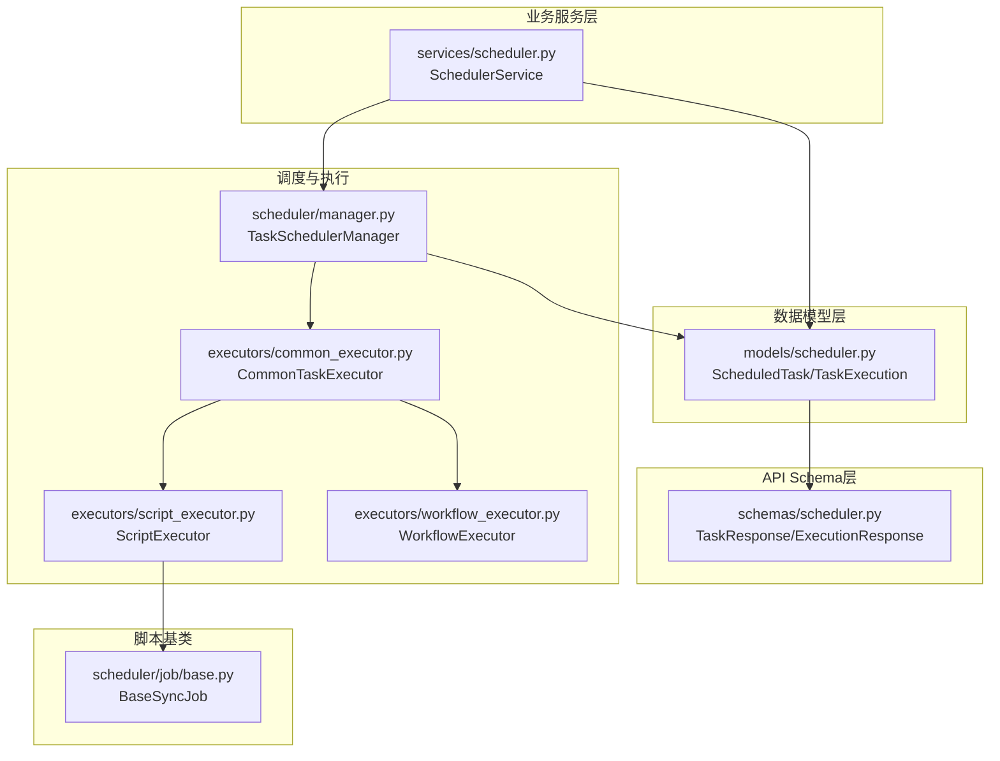
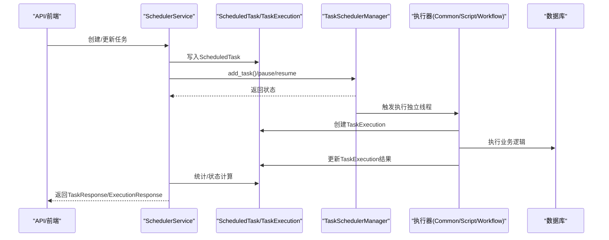
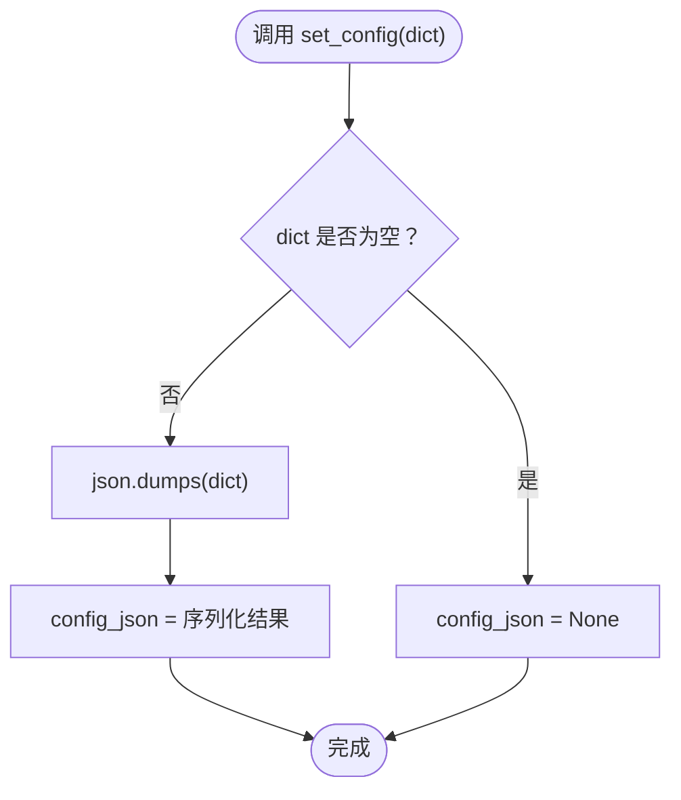
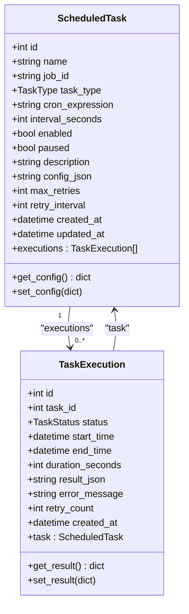
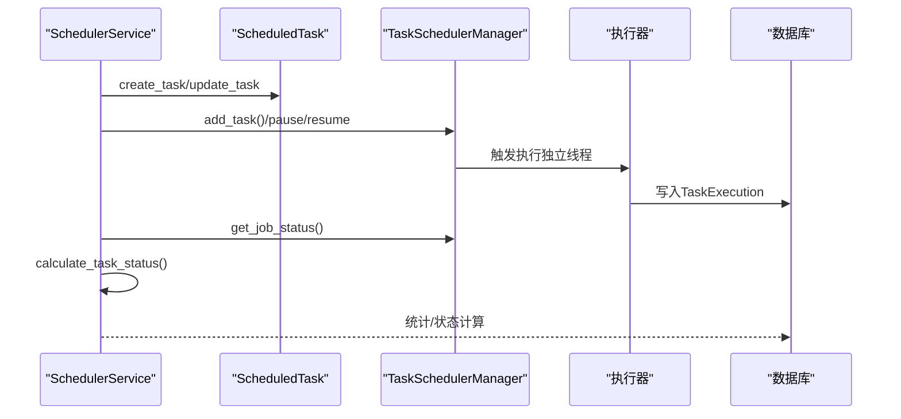
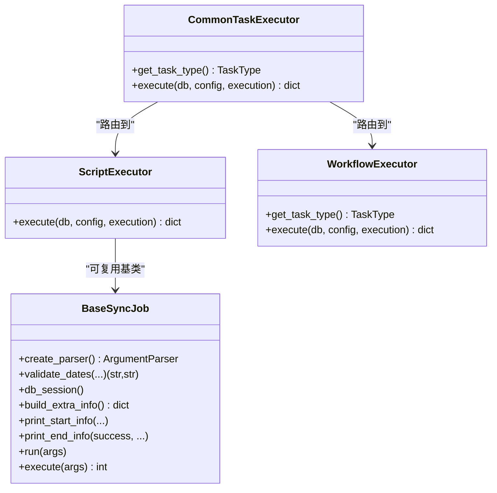
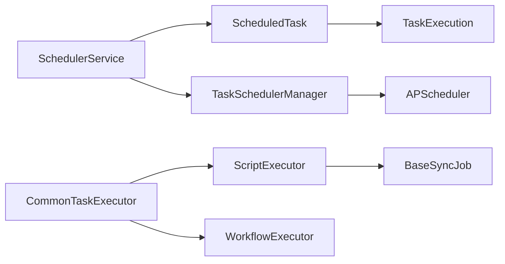

# 调度模型

<cite>
**本文引用的文件**
- [zquant/models/scheduler.py](file://zquant/models/scheduler.py)
- [zquant/schemas/scheduler.py](file://zquant/schemas/scheduler.py)
- [zquant/services/scheduler.py](file://zquant/services/scheduler.py)
- [zquant/scheduler/manager.py](file://zquant/scheduler/manager.py)
- [zquant/scheduler/executors/common_executor.py](file://zquant/scheduler/executors/common_executor.py)
- [zquant/scheduler/executors/script_executor.py](file://zquant/scheduler/executors/script_executor.py)
- [zquant/scheduler/executors/workflow_executor.py](file://zquant/scheduler/executors/workflow_executor.py)
- [zquant/scheduler/job/base.py](file://zquant/scheduler/job/base.py)
- [docs/refactoring_summary.md](file://docs/refactoring_summary.md)
</cite>

## 目录
1. [简介](#简介)
2. [项目结构](#项目结构)
3. [核心组件](#核心组件)
4. [架构总览](#架构总览)
5. [详细组件分析](#详细组件分析)
6. [依赖分析](#依赖分析)
7. [性能考虑](#性能考虑)
8. [故障排查指南](#故障排查指南)
9. [结论](#结论)
10. [附录](#附录)

## 简介
本文件面向zquant平台的任务调度数据模型，围绕ScheduledTask实体及其相关模型、服务与执行器，系统化梳理数据库表结构、字段语义、配置JSON操作方法、与TaskExecution的关联关系，以及与调度脚本基类重构的协同方式。文档特别强调：
- ScheduledTask实体的数据库表结构与字段定义
- get_config()/set_config()如何便捷地操作JSON配置
- 与TaskExecution模型的关系及执行历史记录
- 基于调度脚本基类的统一调度脚本管理能力

## 项目结构
围绕调度模型的关键文件分布如下：
- 数据模型层：zquant/models/scheduler.py
- API Schema层：zquant/schemas/scheduler.py
- 业务服务层：zquant/services/scheduler.py
- 调度器与执行器：zquant/scheduler/manager.py、zquant/scheduler/executors/*
- 调度脚本基类：zquant/scheduler/job/base.py
- 重构总结文档：docs/refactoring_summary.md

图表来源
- [zquant/models/scheduler.py](file://zquant/models/scheduler.py#L68-L127)
- [zquant/schemas/scheduler.py](file://zquant/schemas/scheduler.py#L67-L114)
- [zquant/services/scheduler.py](file://zquant/services/scheduler.py#L39-L110)
- [zquant/scheduler/manager.py](file://zquant/scheduler/manager.py#L46-L120)
- [zquant/scheduler/executors/common_executor.py](file://zquant/scheduler/executors/common_executor.py#L37-L70)
- [zquant/scheduler/executors/script_executor.py](file://zquant/scheduler/executors/script_executor.py#L43-L51)
- [zquant/scheduler/executors/workflow_executor.py](file://zquant/scheduler/executors/workflow_executor.py#L39-L86)
- [zquant/scheduler/job/base.py](file://zquant/scheduler/job/base.py#L51-L120)

章节来源
- [zquant/models/scheduler.py](file://zquant/models/scheduler.py#L68-L127)
- [zquant/schemas/scheduler.py](file://zquant/schemas/scheduler.py#L67-L114)
- [zquant/services/scheduler.py](file://zquant/services/scheduler.py#L39-L110)
- [zquant/scheduler/manager.py](file://zquant/scheduler/manager.py#L46-L120)
- [zquant/scheduler/executors/common_executor.py](file://zquant/scheduler/executors/common_executor.py#L37-L70)
- [zquant/scheduler/executors/script_executor.py](file://zquant/scheduler/executors/script_executor.py#L43-L51)
- [zquant/scheduler/executors/workflow_executor.py](file://zquant/scheduler/executors/workflow_executor.py#L39-L86)
- [zquant/scheduler/job/base.py](file://zquant/scheduler/job/base.py#L51-L120)

## 核心组件
- ScheduledTask：定时任务配置表，承载任务元数据、调度配置与JSON配置
- TaskExecution：任务执行历史表，记录每次执行的开始/结束、状态、结果与重试次数
- TaskResponse/ExecutionResponse：API响应模型，负责ORM对象到响应结构的转换
- SchedulerService：任务生命周期管理（创建、更新、启用/禁用、暂停/恢复、手动触发、统计）
- TaskSchedulerManager：基于APScheduler的任务调度器，负责任务注册、触发、状态查询与重试
- 执行器族：CommonTaskExecutor、ScriptExecutor、WorkflowExecutor，分别处理通用任务、脚本命令与编排任务
- BaseSyncJob：调度脚本基类，提供统一的参数解析、日期校验、数据库会话、错误处理与结果格式化

章节来源
- [zquant/models/scheduler.py](file://zquant/models/scheduler.py#L68-L127)
- [zquant/schemas/scheduler.py](file://zquant/schemas/scheduler.py#L67-L114)
- [zquant/services/scheduler.py](file://zquant/services/scheduler.py#L39-L110)
- [zquant/scheduler/manager.py](file://zquant/scheduler/manager.py#L46-L120)
- [zquant/scheduler/executors/common_executor.py](file://zquant/scheduler/executors/common_executor.py#L37-L70)
- [zquant/scheduler/executors/script_executor.py](file://zquant/scheduler/executors/script_executor.py#L43-L51)
- [zquant/scheduler/executors/workflow_executor.py](file://zquant/scheduler/executors/workflow_executor.py#L39-L86)
- [zquant/scheduler/job/base.py](file://zquant/scheduler/job/base.py#L51-L120)

## 架构总览
调度模型的端到端流程如下：
- 任务创建/更新：SchedulerService通过ORM写入ScheduledTask，必要时调用TaskSchedulerManager将任务加入APScheduler
- 调度执行：TaskSchedulerManager根据cron或interval触发任务；在独立线程中创建TaskExecution记录，调用对应执行器
- 执行器路由：CommonTaskExecutor根据配置决定使用ScriptExecutor或其它内部路由；WorkflowExecutor负责编排任务的串行/并行执行
- 结果落盘：执行器将结果写入TaskExecution.result_json，SchedulerService提供统计与状态计算
- API响应：TaskResponse/ExecutionResponse从ORM对象转换为对外响应

图表来源
- [zquant/services/scheduler.py](file://zquant/services/scheduler.py#L39-L110)
- [zquant/scheduler/manager.py](file://zquant/scheduler/manager.py#L93-L139)
- [zquant/scheduler/executors/common_executor.py](file://zquant/scheduler/executors/common_executor.py#L37-L70)
- [zquant/scheduler/executors/script_executor.py](file://zquant/scheduler/executors/script_executor.py#L43-L51)
- [zquant/scheduler/executors/workflow_executor.py](file://zquant/scheduler/executors/workflow_executor.py#L39-L86)
- [zquant/models/scheduler.py](file://zquant/models/scheduler.py#L108-L127)

## 详细组件分析

### ScheduledTask实体与数据库表结构
- 表名：zq_task_scheduled_tasks
- 主键：id（自增整数）
- 唯一索引：name、job_id
- 字段定义与语义
  - id：主键
  - name：任务名称，唯一
  - job_id：APScheduler作业ID，唯一
  - task_type：任务类型枚举（manual_task、common_task、workflow）
  - cron_expression：Cron表达式（如：0 18 * * *），与interval_seconds互斥
  - interval_seconds：间隔秒数，与cron_expression互斥
  - enabled：是否启用
  - paused：是否暂停
  - description：任务描述
  - config_json：任务配置（JSON格式）
  - max_retries：最大重试次数
  - retry_interval：重试间隔（秒）
  - created_at/updated_at：创建与更新时间戳
- 关系
  - executions：与TaskExecution的一对多关系，按执行时间倒序排列，级联删除孤儿执行记录

章节来源
- [zquant/models/scheduler.py](file://zquant/models/scheduler.py#L68-L106)
- [zquant/models/scheduler.py](file://zquant/models/scheduler.py#L88-L95)

### TaskExecution实体与执行历史
- 表名：zq_task_task_executions
- 主键：id
- 字段定义与语义
  - task_id：任务ID（非外键约束，避免删除任务时的级联问题）
  - status：执行状态枚举（pending、running、success、failed、completed、terminated）
  - start_time/end_time：开始/结束时间
  - duration_seconds：执行时长（秒）
  - result_json：执行结果（JSON格式）
  - error_message：错误信息
  - retry_count：重试次数
  - created_at：创建时间
- 关系
  - task：与ScheduledTask的back_populates关系

章节来源
- [zquant/models/scheduler.py](file://zquant/models/scheduler.py#L108-L127)

### JSON配置操作：get_config()与set_config()
- get_config()：当config_json存在时，解析为字典；否则返回空字典
- set_config(config)：将字典序列化为JSON字符串后赋值给config_json；若config为空则置空
- 作用：屏蔽底层JSON存储细节，使上层业务以Python字典形式读写任务配置，便于Schema与服务层统一处理

图表来源
- [zquant/models/scheduler.py](file://zquant/models/scheduler.py#L97-L106)

章节来源
- [zquant/models/scheduler.py](file://zquant/models/scheduler.py#L97-L106)

### 与TaskExecution的关系
- ScheduledTask.executions：一对多，按执行时间倒序，级联删除孤儿执行记录
- TaskExecution.task：反向关系，通过primaryjoin绑定task_id与ScheduledTask.id
- 用途：记录每次执行的开始/结束、状态、结果与重试次数，支撑统计与状态计算

图表来源
- [zquant/models/scheduler.py](file://zquant/models/scheduler.py#L68-L127)

章节来源
- [zquant/models/scheduler.py](file://zquant/models/scheduler.py#L88-L127)

### 任务生命周期与调度器集成
- SchedulerService
  - create_task/update_task：创建/更新任务，自动调用set_config，必要时添加到调度器
  - enable/disable/pause/resume：控制任务启用/禁用与暂停/恢复，并同步至调度器
  - trigger_task：手动触发任务，手动任务走独立线程执行并创建执行记录
  - list_tasks/get_task：支持批量查询、最新执行时间与状态附加，并计算调度状态
  - stats：统计总执行次数、成功/失败/运行中数量、成功率与平均时长
- TaskSchedulerManager
  - add_task/remove_task/pause/resume/trigger：基于APScheduler的任务管理
  - _build_trigger/_build_job_func：根据cron或interval构建触发器与执行包装函数
  - _retry_task：在独立线程中按重试策略执行重试

图表来源
- [zquant/services/scheduler.py](file://zquant/services/scheduler.py#L39-L110)
- [zquant/services/scheduler.py](file://zquant/services/scheduler.py#L112-L239)
- [zquant/services/scheduler.py](file://zquant/services/scheduler.py#L391-L491)
- [zquant/scheduler/manager.py](file://zquant/scheduler/manager.py#L93-L139)
- [zquant/scheduler/manager.py](file://zquant/scheduler/manager.py#L195-L258)
- [zquant/scheduler/manager.py](file://zquant/scheduler/manager.py#L282-L372)
- [zquant/scheduler/manager.py](file://zquant/scheduler/manager.py#L373-L463)

章节来源
- [zquant/services/scheduler.py](file://zquant/services/scheduler.py#L39-L110)
- [zquant/services/scheduler.py](file://zquant/services/scheduler.py#L112-L239)
- [zquant/services/scheduler.py](file://zquant/services/scheduler.py#L391-L491)
- [zquant/scheduler/manager.py](file://zquant/scheduler/manager.py#L93-L139)
- [zquant/scheduler/manager.py](file://zquant/scheduler/manager.py#L195-L258)
- [zquant/scheduler/manager.py](file://zquant/scheduler/manager.py#L282-L372)
- [zquant/scheduler/manager.py](file://zquant/scheduler/manager.py#L373-L463)

### 执行器与调度脚本基类
- CommonTaskExecutor：根据config路由到不同执行器；若包含command则使用ScriptExecutor
- ScriptExecutor：执行外部命令/脚本，支持超时、工作目录识别、捕获stdout/stderr
- WorkflowExecutor：支持serial/parallel两种模式，按依赖关系执行子任务
- BaseSyncJob：统一的调度脚本基类，提供参数解析、日期校验、数据库会话、错误处理与结果格式化，便于脚本复用与标准化

图表来源
- [zquant/scheduler/executors/common_executor.py](file://zquant/scheduler/executors/common_executor.py#L37-L70)
- [zquant/scheduler/executors/script_executor.py](file://zquant/scheduler/executors/script_executor.py#L43-L51)
- [zquant/scheduler/executors/workflow_executor.py](file://zquant/scheduler/executors/workflow_executor.py#L39-L86)
- [zquant/scheduler/job/base.py](file://zquant/scheduler/job/base.py#L51-L120)

章节来源
- [zquant/scheduler/executors/common_executor.py](file://zquant/scheduler/executors/common_executor.py#L37-L70)
- [zquant/scheduler/executors/script_executor.py](file://zquant/scheduler/executors/script_executor.py#L43-L51)
- [zquant/scheduler/executors/workflow_executor.py](file://zquant/scheduler/executors/workflow_executor.py#L39-L86)
- [zquant/scheduler/job/base.py](file://zquant/scheduler/job/base.py#L51-L120)

### API响应模型与配置映射
- TaskResponse.from_orm：从ORM对象创建响应对象，其中config字段来自ScheduledTask.get_config()
- ExecutionResponse.from_orm：从ORM对象创建响应对象，result字段来自TaskExecution.get_result()

章节来源
- [zquant/schemas/scheduler.py](file://zquant/schemas/scheduler.py#L67-L114)
- [zquant/schemas/scheduler.py](file://zquant/schemas/scheduler.py#L116-L149)
- [zquant/models/scheduler.py](file://zquant/models/scheduler.py#L97-L106)
- [zquant/models/scheduler.py](file://zquant/models/scheduler.py#L129-L133)

## 依赖分析
- ScheduledTask与TaskExecution：一对多，通过executions/task关系建立
- SchedulerService依赖TaskSchedulerManager与ORM模型，提供任务全生命周期管理
- TaskSchedulerManager依赖APScheduler，封装任务注册、触发与状态查询
- 执行器族依赖CommonTaskExecutor与具体执行器，实现任务类型路由
- BaseSyncJob为脚本层提供统一基类，便于脚本复用与标准化

图表来源
- [zquant/models/scheduler.py](file://zquant/models/scheduler.py#L68-L127)
- [zquant/services/scheduler.py](file://zquant/services/scheduler.py#L39-L110)
- [zquant/scheduler/manager.py](file://zquant/scheduler/manager.py#L46-L120)
- [zquant/scheduler/executors/common_executor.py](file://zquant/scheduler/executors/common_executor.py#L37-L70)
- [zquant/scheduler/executors/script_executor.py](file://zquant/scheduler/executors/script_executor.py#L43-L51)
- [zquant/scheduler/executors/workflow_executor.py](file://zquant/scheduler/executors/workflow_executor.py#L39-L86)
- [zquant/scheduler/job/base.py](file://zquant/scheduler/job/base.py#L51-L120)

章节来源
- [zquant/models/scheduler.py](file://zquant/models/scheduler.py#L68-L127)
- [zquant/services/scheduler.py](file://zquant/services/scheduler.py#L39-L110)
- [zquant/scheduler/manager.py](file://zquant/scheduler/manager.py#L46-L120)
- [zquant/scheduler/executors/common_executor.py](file://zquant/scheduler/executors/common_executor.py#L37-L70)
- [zquant/scheduler/executors/script_executor.py](file://zquant/scheduler/executors/script_executor.py#L43-L51)
- [zquant/scheduler/executors/workflow_executor.py](file://zquant/scheduler/executors/workflow_executor.py#L39-L86)
- [zquant/scheduler/job/base.py](file://zquant/scheduler/job/base.py#L51-L120)

## 性能考虑
- 线程池与异步执行：调度器使用线程池执行任务，避免阻塞主线程；独立线程执行任务，确保任务完成
- 重试策略：失败后按retry_interval延时重试，最多max_retries次，避免频繁重试造成压力
- 触发器构建：cron表达式与interval触发器的构建与校验，保证调度准确性
- 执行结果压缩：TaskExecution.set_result仅保留关键字段，避免冗余数据占用空间

章节来源
- [zquant/scheduler/manager.py](file://zquant/scheduler/manager.py#L46-L120)
- [zquant/scheduler/manager.py](file://zquant/scheduler/manager.py#L282-L372)
- [zquant/scheduler/manager.py](file://zquant/scheduler/manager.py#L373-L463)
- [zquant/models/scheduler.py](file://zquant/models/scheduler.py#L135-L203)

## 故障排查指南
- 任务未启用/暂停
  - 现象：调度状态为DISABLED/PAUSED
  - 排查：确认enabled/paused字段；通过SchedulerService.enable_task()/pause_task()调整
- 调度器未运行
  - 现象：任务未加入调度器或无法触发
  - 排查：确认TaskSchedulerManager.start()已调用；检查调度器状态与线程池大小
- Cron表达式无效
  - 现象：add_task失败
  - 排查：确认cron_expression格式正确；查看TaskSchedulerManager._build_trigger日志
- 手动任务无法触发
  - 现象：手动任务不在调度器中
  - 排查：手动任务需通过SchedulerService.trigger_task在独立线程执行；检查线程命名与异常日志
- 执行结果过大
  - 现象：result_json序列化后超限
  - 排查：TaskExecution.set_result会裁剪冗余字段并保留核心信息；检查日志中的_note提示

章节来源
- [zquant/services/scheduler.py](file://zquant/services/scheduler.py#L313-L390)
- [zquant/scheduler/manager.py](file://zquant/scheduler/manager.py#L93-L139)
- [zquant/scheduler/manager.py](file://zquant/scheduler/manager.py#L195-L258)
- [zquant/scheduler/manager.py](file://zquant/scheduler/manager.py#L282-L372)
- [zquant/models/scheduler.py](file://zquant/models/scheduler.py#L135-L203)

## 结论
本调度模型以ScheduledTask为核心，通过get_config()/set_config()屏蔽JSON配置细节，配合TaskExecution记录执行历史，形成“配置—执行—统计”的完整闭环。SchedulerService与TaskSchedulerManager共同实现任务生命周期与调度控制，执行器族与调度脚本基类提供统一的执行与脚本复用能力。结合重构总结文档中的基类重构，平台实现了更高的代码复用性与可维护性，为统一的调度脚本管理奠定了坚实基础。

## 附录
- 统一调度脚本管理要点
  - 通过BaseSyncJob统一参数解析、日期校验、数据库会话与错误处理
  - 通过CommonTaskExecutor路由到具体执行器，简化任务类型判断
  - 通过WorkflowExecutor支持复杂编排，提升任务组合与执行灵活性

章节来源
- [docs/refactoring_summary.md](file://docs/refactoring_summary.md#L47-L69)
- [zquant/scheduler/job/base.py](file://zquant/scheduler/job/base.py#L51-L120)
- [zquant/scheduler/executors/common_executor.py](file://zquant/scheduler/executors/common_executor.py#L37-L70)
- [zquant/scheduler/executors/workflow_executor.py](file://zquant/scheduler/executors/workflow_executor.py#L39-L86)